# Samples on Data Science Virtual Machines

Azure Data Science Virtual Machines includes a comprehensive set of sample code. The sample code is in the form of Jupyter notebooks and scripts in languages such as Python and R. 
> [!NOTE]
> For more information on how to run Jupyter notebooks on your data science virtual machines, see the [Access Jupyter](#access-jupyter) section.

## Quick reference of samples
| Samples category | Description | Locations |
| ------------- | ------------- | ------------- |
| R language  | Samples in R explain scenarios such as how to connect with Azure cloud data stores. They also explain how to compare open-source R and Microsoft R. And they explain how to operationalize models on Microsoft R Server or SQL Server.   [R language](#r-language) |  `~notebooks`     `~samples/MicrosoftR`     `~samples/RSqlDemo`     `~samples/SQLRServices`   |
| Python language  | Samples in Python explain scenarios such as how to connect with Azure cloud data stores and work with Azure Machine Learning.    [Python language](#python-language) |  `~notebooks`   |
| Julia language  | Sample in Julia that details plotting and deep learning in Julia. It also explains calling C and Python from Julia.   [Julia language](#julia-language) |  Windows:  `~notebooks/Julia_notebooks`   Linux:  `~notebooks/julia`   |
| Azure Machine Learning  | Build machine learning and deep learning models with Machine Learning. Deploy models anywhere. Use automated machine learning and intelligent hyperparameter tuning. Also use model management and distributed training.   [Machine Learning](#azureml) |  `~notebooks/AzureML`   |
| PyTorch notebooks  | Deep learning samples that use PyTorch-based neural networks. Notebooks range from beginner to advanced scenarios.    [PyTorch notebooks](#pytorch) |  `~notebooks/Deep_learning_frameworks/pytorch`   |
| TensorFlow  |  Different neural network samples and techniques implemented by using the TensorFlow framework.   [TensorFlow](#tensorflow) |  `~notebooks/Deep_learning_frameworks/tensorflow`   |
| Microsoft Cognitive Toolkit     | Deep learning samples published by the Cognitive Toolkit team at Microsoft.    [Cognitive Toolkit](#cntk) |   `~notebooks/DeepLearningTools/CNTK/Tutorials`   Linux:  `~notebooks/CNTK`   |
| caffe2 | Deep learning samples that use caffe2-based neural networks. Several notebooks familiarize users with caffe2 and how to use it effectively. Examples include image pre-processing and data set creation. They also include regression and how to use pre-trained models.   [caffe2](#caffe2) |  `~notebooks/Deep_learning_frameworks/caffe2`   |
| H2O   | Python-based samples that use H2O for real-world scenario problems.   [H2O](#h2o) |  `~notebooks/h2o`   |
| SparkML language  | Samples that use features of the Spark MLLib toolkit through pySpark and MMLSpark--Microsoft Machine Learning for Apache Spark on Apache Spark 2.x.    [SparkML language](#sparkml) |  `~notebooks/SparkML/pySpark` `~notebooks/MMLSpark`    |
| XGBoost | Standard machine learning samples in XGBoost for scenarios such as classification and regression.   [XGBoost](#xgboost) |  Windows: `\dsvm\samples\xgboost\demo`   |

 

## Access Jupyter 

To access Jupyter, select the `Jupyter` icon on the desktop or application menu. You also can access Jupyter on Linux editions of Data Science Virtual Machines. You can access remotely from a web browser by visiting `https://<Full Domain Name or IP Address of the DSVM>:8000` on Ubuntu.

To add exceptions and make Jupyter access available over a browser, see the following screenshot.

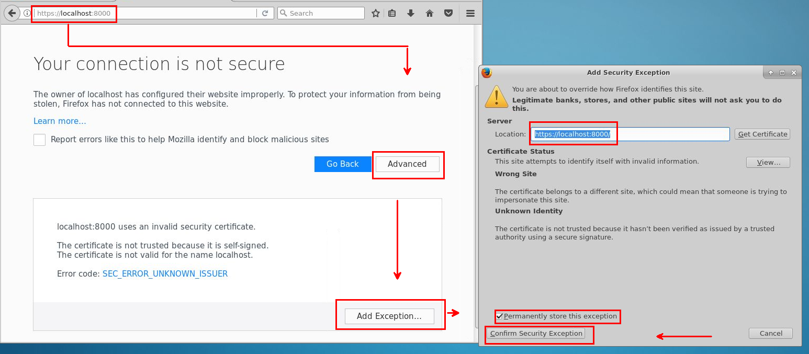

Sign in with the same password as your login for Data Science Virtual Machines.
 

**Jupyter home**
 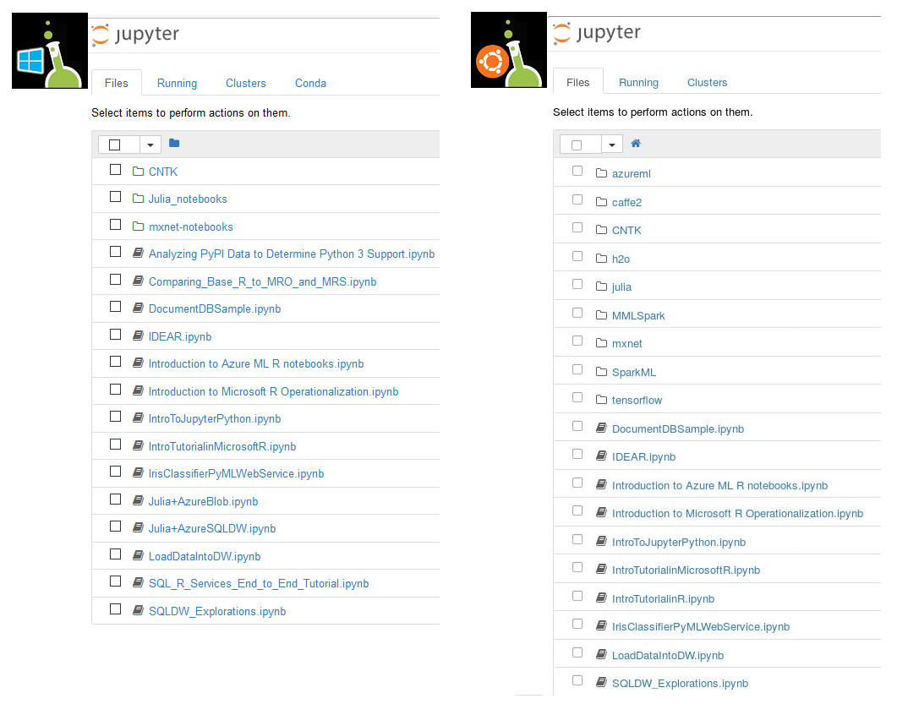 

## R language 
 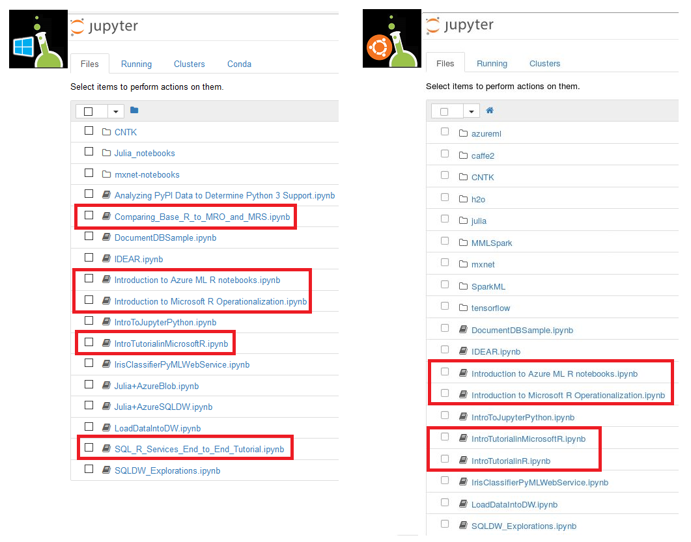 

## Python language
 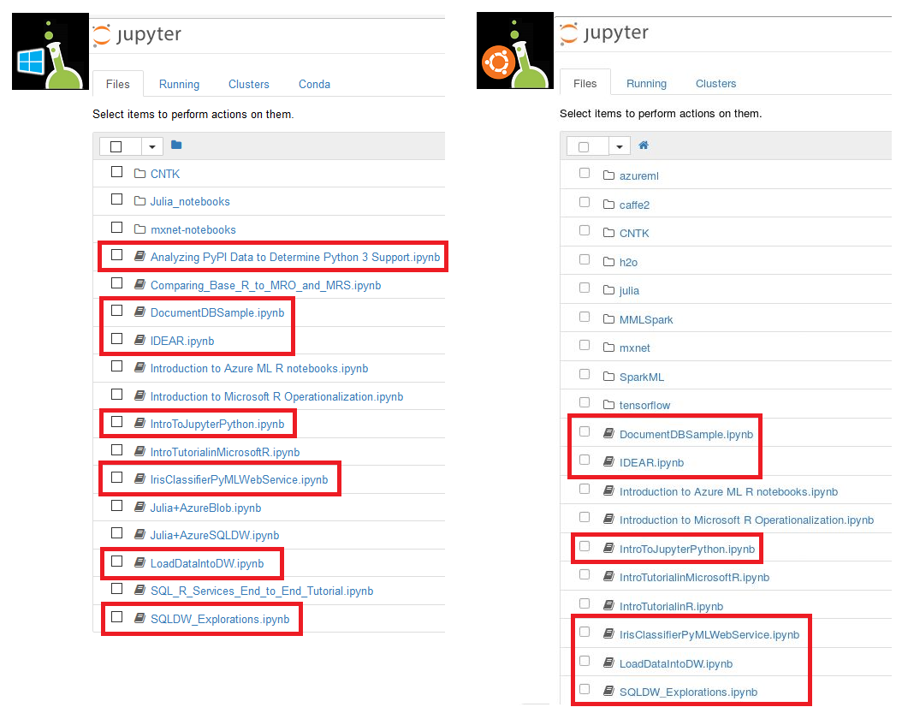 

## Julia language 
 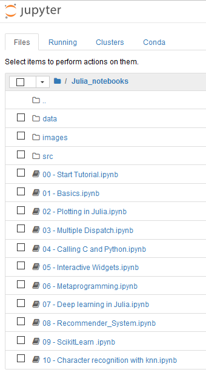 

## AzureML 
 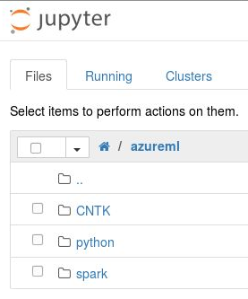 

## PyTorch
 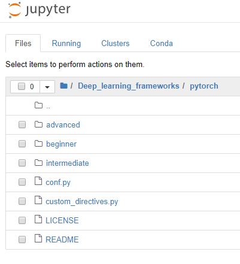 

## TensorFlow 
 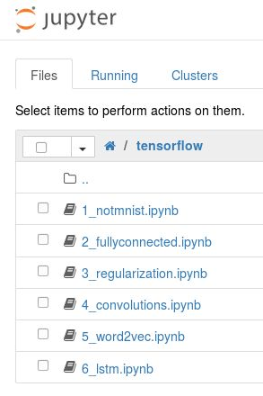 

## CNTK 
 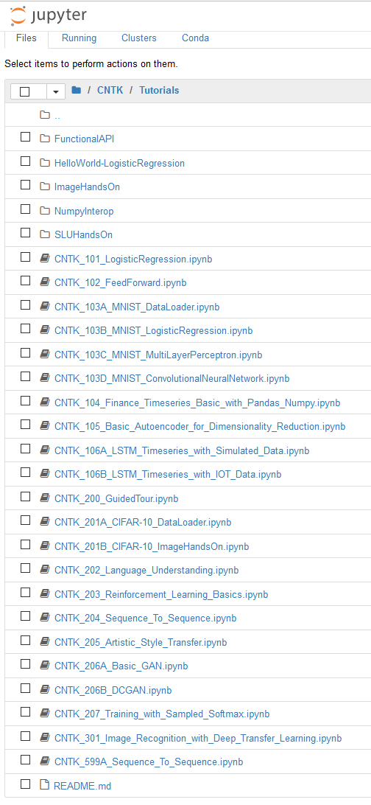 

## caffe2 
 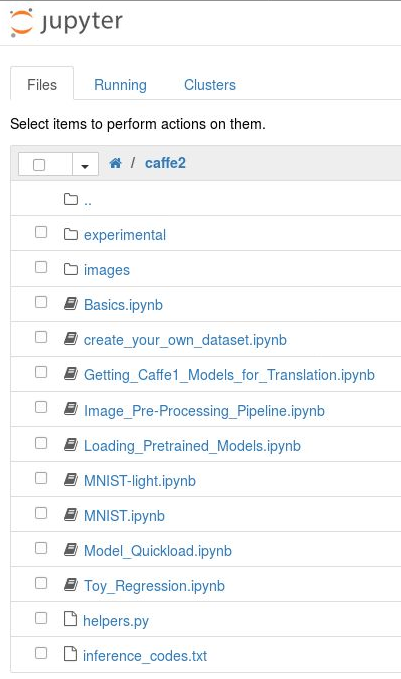 

## H2O 
 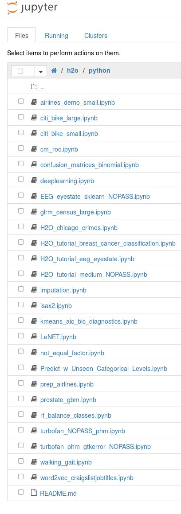 

## SparkML 
 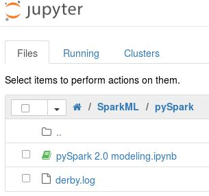 

## XGBoost 
 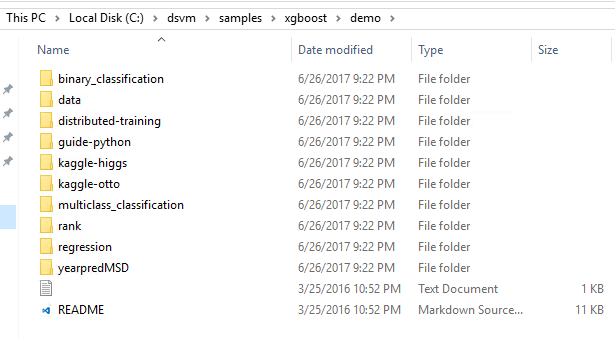 

