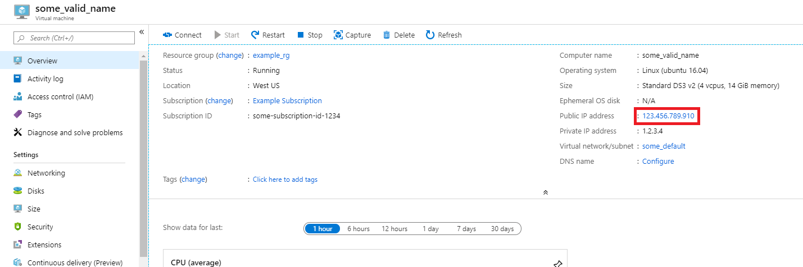
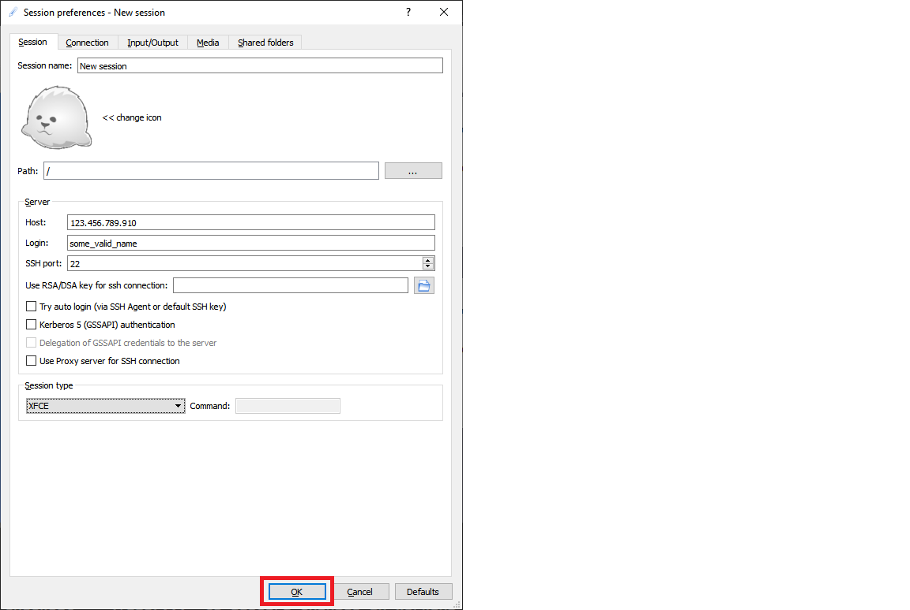
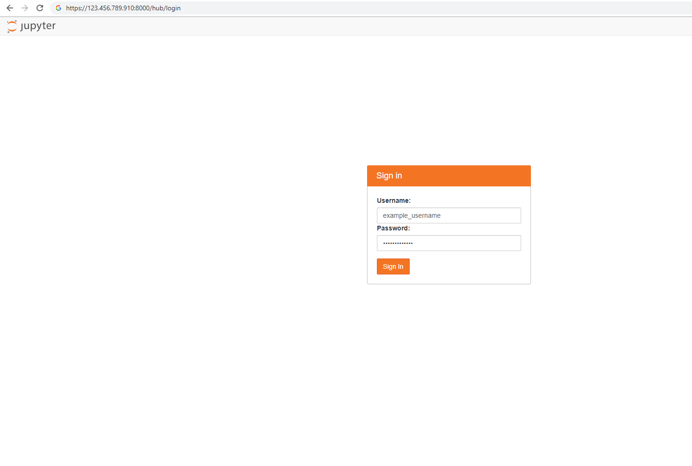
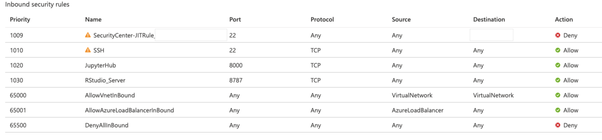

# Quickstart: Set up the Data Science Virtual Machine for Linux (Ubuntu)

Get up and running with the Ubuntu 20.04 Data Science Virtual Machine and Azure DSVM for PyTorch.

## Prerequisites

To create an Ubuntu 20.04 Data Science Virtual Machine or an Azure DSVM for PyTorch, you must have an Azure subscription. [Try Azure for free](https://azure.com/free).

>[!NOTE]
>Azure free accounts don't support GPU enabled virtual machine SKUs.

## Create your Data Science Virtual Machine for Linux

Here are the steps to create an instance of the Ubuntu 20.04 Data Science Virtual Machine or the Azure DSVM for PyTorch:

1. Go to the [Azure portal](https://portal.azure.com). You might be prompted to sign in to your Azure account if you're not already signed in.
1. Find the virtual machine listing by typing in "data science virtual machine" and selecting "Data Science Virtual Machine- Ubuntu 20.04" or "Azure DSVM for PyTorch"

1. On the next window, select **Create**.

1. You should be redirected to the "Create a virtual machine" blade.
   
1. Enter the following information to configure each step of the wizard:

    1. **Basics**:
    
       * **Subscription**: If you have more than one subscription, select the one on which the machine will be created and billed. You must have resource creation privileges for this subscription.
       * **Resource group**: Create a new group or use an existing one.
       * **Virtual machine name**: Enter the name of the virtual machine. This name will be used in your Azure portal.
       * **Region**: Select the datacenter that's most appropriate. For fastest network access, it's the datacenter that has most of your data or is closest to your physical location. Learn more about [Azure Regions](https://azure.microsoft.com/global-infrastructure/regions/).
       * **Image**: Leave the default value.
       * **Size**: This option should autopopulate with a size that is appropriate for general workloads. Read more about [Linux VM sizes in Azure](../../virtual-machines/sizes.md).
       * **Authentication type**: For quicker setup, select "Password." 
         
         > [!NOTE]
         > If you intend to use JupyterHub, make sure to select "Password," as JupyterHub is *not* configured to use SSH public keys.

       * **Username**: Enter the administrator username. You'll use this username to log into your virtual machine. This username need not be the same as your Azure username. Do *not* use capitalized letters.
         
         > [!IMPORTANT]
         > If you use capitalized letters in your username, JupyterHub will not work, and you'll encounter a 500 internal server error.

       * **Password**: Enter the password you'll use to log into your virtual machine.    
    
   1. Select **Review + create**.
   1. **Review+create**
      * Verify that all the information you entered is correct. 
      * Select **Create**.
    
    The provisioning should take about 5 minutes. The status is displayed in the Azure portal.

## How to access the Ubuntu Data Science Virtual Machine

You can access the Ubuntu DSVM in one of four ways:

  * SSH for terminal sessions
  * xrdp for graphical sessions
  * X2Go for graphical sessions
  * JupyterHub and JupyterLab for Jupyter notebooks

### SSH

If you configured your VM with SSH authentication, you can log on using the account credentials that you created in the **Basics** section of step 3 for the text shell interface. [Learn more about connecting to a Linux VM](../../virtual-machines/linux-vm-connect.md).

### xrdp
xrdp is the standard tool for accessing Linux graphical sessions. While this isn't included in the distro by default, you can [install it by following these instructions](../../virtual-machines/linux/use-remote-desktop.md).

### X2Go
> [!NOTE]
> The X2Go client performed better than X11 forwarding in testing. We recommend using the X2Go client for a graphical desktop interface.

The Linux VM is already provisioned with X2Go Server and ready to accept client connections. To connect to the Linux VM graphical desktop, complete the following procedure on your client:

1. Download and install the X2Go client for your client platform from [X2Go](https://wiki.x2go.org/doku.php/doc:installation:x2goclient).
1. Make note of the virtual machine's public IP address, which you can find in the Azure portal by opening the virtual machine you created.

   

1. Run the X2Go client. If the "New Session" window doesn't pop up automatically, go to Session -> New Session.

1. On the resulting configuration window, enter the following configuration parameters:
   * **Session tab**:
     * **Host**: Enter the IP address of your VM, which you made note of earlier.
     * **Login**: Enter the username on the Linux VM.
     * **SSH Port**: Leave it at 22, the default value.
     * **Session Type**: Change the value to **XFCE**. Currently, the Linux VM supports only the XFCE desktop.
   * **Media tab**: You can turn off sound support and client printing if you don't need to use them.
   * **Shared folders**: Use this tab to add client machine directory that you would like to mount on the VM. 

   
1. Select **OK**.
1. Click on the box in the right pane of the X2Go window to bring up the log-in screen for your VM.
1. Enter the password for your VM.
1. Select **OK**.
1. You may have to give X2Go permission to bypass your firewall to finish connecting.
1. You should now see the graphical interface for your Ubuntu DSVM. 


### JupyterHub and JupyterLab

The Ubuntu DSVM runs [JupyterHub](https://github.com/jupyterhub/jupyterhub), a multiuser Jupyter server. To connect, take the following steps:

   1. Make note of the public IP address for your VM, by searching for and selecting your VM in the Azure portal.
      

   1. From your local machine, open a web browser and navigate to https:\//your-vm-ip:8000, replacing "your-vm-ip" with the IP address you took note of earlier.
   1. Your browser will probably prevent you from opening the page directly, telling you that there's a certificate error. The DSVM is providing security via a self-signed certificate. Most browsers will allow you to click through after this warning. Many browsers will continue to provide some kind of visual warning about the certificate throughout your Web session.

      >[!NOTE]
      > If you see the `ERR_EMPTY_RESPONSE` error message in your browser, make sure you access the machine by explicitly using the *HTTPS* protocol, and not by using *HTTP* or just the web address. If you type the web address without `https://` in the address line, most browsers will default to `http`, and you will see this error.

   1. Enter the username and password that you used to create the VM, and sign in. 

      

      >[!NOTE]
      > If you receive a 500 Error at this stage, it is likely that you used capitalized letters in your username. This is a known interaction between Jupyter Hub and the PAMAuthenticator it uses. 
      > If you receive a "Can't reach this page" error, it is likely that your Network Security Group permissions need to be adjusted. In the Azure portal, find the Network Security Group resource within your Resource Group. To access JupyterHub from the public Internet, you must have port 8000 open. (The image shows that this VM is configured for just-in-time access, which is highly recommended. See [Secure your management ports with just-in time access](../../security-center/security-center-just-in-time.md).)
      > 

   1. Browse the many sample notebooks that are available.

JupyterLab, the next generation of Jupyter notebooks and JupyterHub, is also available. To access it, sign in to JupyterHub, and then browse to the URL https:\//your-vm-ip:8000/user/your-username/lab, replacing "your-username" with the username you chose when configuring the VM. Again, you may be initially blocked from accessing the site because of a certificate error.

You can set JupyterLab as the default notebook server by adding this line to `/etc/jupyterhub/jupyterhub_config.py`:

```python
c.Spawner.default_url = '/lab'
```

## Next steps

Here's how you can continue your learning and exploration:

* The [Data science on the Data Science Virtual Machine for Linux](linux-dsvm-walkthrough.md) walkthrough shows you how to do several common data science tasks with the Linux DSVM provisioned here. 
* Explore the various data science tools on the DSVM by trying out the tools described in this article. You can also run `dsvm-more-info` on the shell within the virtual machine for a basic introduction and pointers to more information about the tools installed on the VM.  
* Learn how to systematically build analytical solutions using the [Team Data Science Process](/azure/architecture/data-science-process/overview).
* Visit the [Azure AI Gallery](https://gallery.azure.ai/) for machine learning and data analytics samples that use the Azure AI services.
* Consult the appropriate [reference documentation](./reference-ubuntu-vm.md) for this virtual machine.
