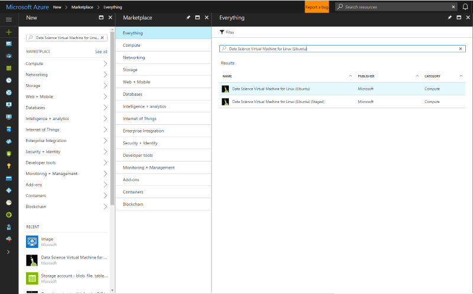

# Provision the Data Science Virtual Machine for Linux (Ubuntu)

The Data Science Virtual Machine for Linux is an Ubuntu-based virtual machine image that makes it easy to get started with machine learning, including deep learning, on Azure. Deep learning tools include:

  * [Caffe](http://caffe.berkeleyvision.org/): A deep learning framework built for speed, expressivity, and modularity
  * [Caffe2](https://github.com/caffe2/caffe2): A cross-platform version of Caffe
  * [Microsoft Cognitive Toolkit](https://github.com/Microsoft/CNTK): A deep learning software toolkit from Microsoft Research
  * [H2O](https://www.h2o.ai/): An open-source big data platform and graphical user interface
  * [Keras](https://keras.io/): A high-level neural network API in Python for Theano and TensorFlow
  * [MXNet](http://mxnet.io/): A flexible, efficient deep learning library with many language bindings
  * [NVIDIA DIGITS](https://developer.nvidia.com/digits): A graphical system that simplifies common deep learning tasks
  * [PyTorch](http://pytorch.org/): A high-level Python library with support for dynamic networks
  * [TensorFlow](https://www.tensorflow.org/): An open-source library for machine intelligence from Google
  * [Theano](http://deeplearning.net/software/theano/): A Python library for defining, optimizing, and efficiently evaluating mathematical expressions involving multi-dimensional arrays
  * [Torch](http://torch.ch/): A scientific computing framework with wide support for machine learning algorithms
  * CUDA, cuDNN, and the NVIDIA driver
  * Many sample Jupyter notebooks

All libraries are the GPU versions, though they also run on the CPU.

The Data Science Virtual Machine for Linux also contains popular tools for data science and development activities, including:

* Microsoft R Server Developer Edition with Microsoft R Open
* Anaconda Python distribution (versions 2.7 and 3.5), including popular data analysis libraries
* JuliaPro - a curated distribution of Julia language with popular scientific and data analytics libraries
* Standalone Spark instance and single node Hadoop (HDFS, Yarn)
* JupyterHub - a multiuser Jupyter notebook server supporting R, Python, PySpark, Julia kernels
* Azure Storage Explorer
* Azure command-line interface (CLI) for managing Azure resources
* Machine learning tools
  * [Vowpal Wabbit](https://github.com/JohnLangford/vowpal_wabbit): A fast machine learning system supporting techniques such as online, hashing, allreduce, reductions, learning2search, active, and interactive learning
  * [XGBoost](https://xgboost.readthedocs.org/en/latest/): A tool providing fast and accurate boosted tree implementation
  * [Rattle](https://togaware.com/rattle/): A graphical tool that makes getting started with data analytics and machine learning in R easy
  * [LightGBM](https://github.com/Microsoft/LightGBM): A fast, distributed, high-performance gradient boosting framework
* Azure SDK in Java, Python, node.js, Ruby, PHP
* Libraries in R and Python for use in Azure Machine Learning and other Azure services
* Development tools and editors (RStudio, PyCharm, IntelliJ, Emacs, vim)


Doing data science involves iterating on a sequence of tasks:

1. Finding, loading, and pre-processing data
1. Building and testing models
1. Deploying the models for consumption in intelligent applications

Data scientists use various tools to complete these tasks. It can be quite time consuming to find the appropriate versions of the software, and then to download, compile, and install these versions.

The Data Science Virtual Machine for Linux can ease this burden substantially. Use it to jump-start your analytics project. It enables you to work on tasks in various languages, including R, Python, SQL, Java, and C++. The Azure SDK included in the VM allows you to build your applications by using various services on Linux for the Microsoft cloud platform. In addition, you have access to other languages like Ruby, Perl, PHP, and node.js that are also pre-installed.

There are no software charges for this data science VM image. You pay only the Azure hardware usage fees that are assessed based on the size of the virtual machine that you provision. More details on the compute fees can be found on the [VM listing page on the Azure Marketplace](https://azure.microsoft.com/marketplace/partners/microsoft-ads/linux-data-science-vm/).

## Other Versions of the Data Science Virtual Machine
A [CentOS](linux-dsvm-intro.md) image is also available, with many of the same tools as the Ubuntu image. A [Windows](provision-vm.md) image is available as well.

## Prerequisites
Before you can create a Data Science Virtual Machine for Linux, you must have an Azure subscription. To obtain one, see [Get Azure free trial](https://azure.microsoft.com/free/).

## Create your Data Science Virtual Machine for Linux
Here are the steps to create an instance of the Data Science Virtual Machine for Linux:

1. Navigate to the virtual machine listing on the [Azure portal](https://portal.azure.com/#create/microsoft-dsvm.linux-data-science-vm-ubuntulinuxdsvmubuntu). You may be prompted to login to your Azure account if you are not already signed in. 
1. Click **Create** (at the bottom) to bring up the wizard.
1. The following sections provide the inputs for each of the steps in the wizard (enumerated on the right of the preceding figure) used to create the Microsoft Data Science Virtual Machine. Here are the inputs needed to configure each of these steps:
   
   a. **Basics**:
   
   * **Name**: Name of your data science server you are creating.
   * **VM Disk Type**: Choose **Premium SSD** if you prefer a solid-state drive (SSD). Otherwise, choose **Standard HDD**. 
   * **User Name**: First account sign-in ID.
   * **Password**: First account password (you can use SSH public key instead of password).
   * **Subscription**: If you have more than one subscription, select the one on which the machine is to be created and billed. You must have resource creation privileges for this subscription.
   * **Resource Group**: You can create a new one or use an existing group.
   * **Location**: Select the data center that is most appropriate. Usually it is the data center that has most of your data, or is closest to your physical location for fastest network access.
   
   b. **Size**:
   
   * Select one of the server types that meets your functional requirement and cost constraints. Select an NC or ND-class VM for GPU based VM instances. The [Products available by region](https://azure.microsoft.com/global-infrastructure/services/) page lists the regions with GPUs.
   
   c. **Settings**:
   
   * In most cases, you can just use the default values. To consider non-default values, hover over the informational link for help on the specific fields.
   
   d. **Summary**:
   
   * Verify that all information you entered is correct. A link is provided to the terms of use. The VM does not have any additional charges beyond the compute for the server size you chose in the **Size** step. To start the provisioning, click **Create**. 
   
The provisioning should take about 5 minutes. The status of the provisioning is displayed on the Azure portal.

## How to access the Data Science Virtual Machine for Linux

You can access the Ubuntu DSVM using three methods:
1. SSH for terminal sessions
1. X2Go for graphical sessions
1. JupyterHub and JupyterLab for Jupyter notebooks

### SSH

After the VM is created, you can sign in to it by using SSH. Use the account credentials that you created in the **Basics** section of step 3 for the text shell interface. On Windows, you can download an SSH client tool like [Putty](http://www.putty.org). If you prefer a graphical desktop (X Windows System), you can use X11 forwarding on Putty or install the X2Go client.

> [!NOTE]
> The X2Go client performed better than X11 forwarding in testing. We recommend using the X2Go client for a graphical desktop interface.
> 
> 

### X2Go
The Linux VM is already provisioned with X2Go server and ready to accept client connections. To connect to the Linux VM graphical desktop, complete the following procedure on your client:

1. Download and install the X2Go client for your client platform from [X2Go](http://wiki.x2go.org/doku.php/doc:installation:x2goclient).    
1. Run the X2Go client, and select **New Session**. It opens a configuration window with multiple tabs. Enter the following configuration parameters:
   * **Session tab**:
     * **Host**: The host name or IP address of your Linux Data Science VM.
     * **Login**: User name on the Linux VM.
     * **SSH Port**: Leave it at 22, the default value.
     * **Session Type**: Change the value to XFCE. Currently the Linux VM only supports XFCE desktop.
   * **Media tab**: You can turn off sound support and client printing if you don't need to use them.
   * **Shared folders**: If you want directories from your client machines mounted on the Linux VM, add the client machine directories that you want to share with the VM on this tab.

After you sign in to the VM by using either the SSH client or XFCE graphical desktop through the X2Go client, you are ready to start using the tools that are installed and configured on the VM. On XFCE, you can see applications menu shortcuts and desktop icons for many of the tools.

### JupyterHub and JupyterLab

The Ubuntu DSVM runs [JupyterHub](https://github.com/jupyterhub/jupyterhub), a multi-user Jupyter server. To connect, browse to https://your-vm-ip:8000 on your laptop or desktop, enter the username and password that you used to create the VM, and log in. Many sample notebooks are available for you to browse and try out.

JupyterLab, the next generation of Jupyter notebooks and JupyterHub, is also available. To access it, log in to JupyterHub, then browse to the URL https://your-vm-ip:8000/user/your-username/lab. You can set JupyterLab as the default notebook server by adding this line to /etc/jupyterhub/jupyterhub_config.py:

    c.Spawner.default_url = '/lab'

## Tools installed on the Data Science Virtual Machine for Linux
### Deep Learning Libraries

#### CNTK
The Microsoft Cognitive Toolkit is an open source, deep learning toolkit. Python bindings are available in the root and py35 Conda environments. It also has a command-line tool (cntk) that is already in the PATH.

Sample Python notebooks are available in JupyterHub. To run a basic sample at the command-line, execute the following commands in the shell:

    cd /home/[USERNAME]/notebooks/CNTK/HelloWorld-LogisticRegression
    cntk configFile=lr_bs.cntk makeMode=false command=Train

For more information, see the CNTK section of [GitHub](https://github.com/Microsoft/CNTK), and the [CNTK wiki](https://github.com/Microsoft/CNTK/wiki).

#### Caffe
Caffe is a deep learning framework from the Berkeley Vision and Learning Center. It is available in /opt/caffe. Examples can be found in /opt/caffe/examples.

#### Caffe2
Caffe2 is a deep learning framework from Facebook that is built on Caffe. It is available in Python 2.7 in the Conda root environment. To activate it, run the following from the shell:

    source /anaconda/bin/activate root

Some example notebooks are available in JupyterHub.

#### H2O
H2O is a fast, in-memory, distributed machine learning and predictive analytics platform. A Python package is installed in both the root and py35 Anaconda environments. An R package is also installed. To start H2O from the command-line, run `java -jar /dsvm/tools/h2o/current/h2o.jar`; there are various [command line options](http://docs.h2o.ai/h2o/latest-stable/h2o-docs/starting-h2o.html#from-the-command-line) that you may like to configure. The Flow Web UI can be accessed by browsing to http://localhost:54321 to get started. Sample notebooks are also available in JupyterHub.

#### Keras
Keras is a high-level neural network API in Python that is capable of running on top of either TensorFlow or Theano. It is available in the root and py35 Python environments. 

#### MXNet
MXNet is a deep learning framework designed for both efficiency and flexibility. It has R and Python bindings included on the DSVM. Sample notebooks are included in JupyterHub, and sample code is available in /dsvm/samples/mxnet.

#### NVIDIA DIGITS
The NVIDIA Deep Learning GPU Training System, known as DIGITS, is a system to simplify common deep learning tasks like managing data, designing and training neural networks on GPU systems, and monitoring performance in real time with advanced visualization. 

DIGITS is available as a service, called digits. Start the service and browse to http://localhost:5000 to get started.

DIGITS is also installed as a Python module in the Conda root environment.

#### TensorFlow
TensorFlow is Google's deep learning library. It is an open source software library for numerical computation using data flow graphs. TensorFlow is available in the py35 Python environment, and some sample notebooks are
included in JupyterHub.

#### Theano
Theano is a Python library for efficient numerical computation. It is available in the root and py35 Python environments. 

#### Torch
Torch is a scientific computing framework with wide support for machine learning algorithms. It is available in /dsvm/tools/torch, and the th interactive session and luarocks package manager are available at the command line. Examples are available in /dsvm/samples/torch.

PyTorch is also available in the root Anaconda environment. Examples are in /dsvm/samples/pytorch.

### Microsoft R Server
R is one of the most popular languages for data analysis and machine learning. If you want to use R for your analytics, the VM has Microsoft R Server (MRS) with the Microsoft R Open (MRO) and Math Kernel Library (MKL). The MKL optimizes math operations common in analytical algorithms. MRO is 100 percent compatible with CRAN-R, and any of the R libraries published in CRAN can be installed on the MRO. MRS gives you scaling and operationalization of R models into web services. You can edit your R programs in one of the default editors, like RStudio, vi, or Emacs. If you prefer using the Emacs editor, it has been pre-installed. The Emacs package ESS (Emacs Speaks Statistics) simplifies working with R files within the Emacs editor.

To launch R console, you just type **R** in the shell. This takes you to an interactive environment. To develop your R program, you typically use an editor like Emacs or vi, and then run the scripts within R. With RStudio, you have a full graphical IDE environment to develop your R program.

There is also an R script for you to install the [Top 20 R packages](http://www.kdnuggets.com/2015/06/top-20-r-packages.html) if you want. This script can be run after you are in the R interactive interface, which can be entered (as mentioned) by typing **R** in the shell.  

### Python
Anaconda Python is installed with Python 2.7 and 3.5 environments. The 2.7 environment is called _root_, and the 3.5 environment is called _py35_. This distribution contains the base Python along with about 300 of the most popular math, engineering, and data analytics packages. 

The py35 environment is the default. To activate the root (2.7) environment:

    source activate root

To activate the py35 environment again:

    source activate py35

To invoke a Python interactive session, just type **python** in the shell. 

Install additional Python libraries using ```conda``` or ````pip```` . For pip, activate the correct environment first if you do not want the default:

    source activate root
    pip install <package>

Or specify the full path to pip:

    /anaconda/bin/pip install <package>
    
For conda, you should always specify the environment name (_py35_ or _root_):

    conda install <package> -n py35

If you are on a graphical interface or have X11 forwarding set up, you can type **pycharm** to launch the PyCharm Python IDE. You can use the default text editors. In addition, you can use Spyder, a Python IDE that is bundled with Anaconda Python distributions. Spyder needs a graphical desktop or X11 forwarding. A shortcut to Spyder is provided in the graphical desktop.s

### Jupyter notebook
The Anaconda distribution also comes with a Jupyter notebook, an environment to share code and analysis. The Jupyter notebook is accessed through JupyterHub. You sign in using your local Linux user name and password.

The Jupyter notebook server has been pre-configured with Python 2, Python 3, and R kernels. There is a desktop icon named "Jupyter Notebook" to launch the browser to access the notebook server. If you are on the VM via SSH or X2Go client, you can also visit [https://localhost:8000/](https://localhost:8000/) to access the Jupyter notebook server.

> [!NOTE]
> Continue if you get any certificate warnings.
> 
> 

You can access the Jupyter notebook server from any host. Just type *https://\<VM DNS name or IP Address\>:8000/*

> [!NOTE]
> Port 8000 is opened in the firewall by default when the VM is provisioned.
> 
> 

We have packaged sample notebooks--one in Python and one in R. You can see the link to the samples on the notebook home page after you authenticate to the Jupyter notebook by using your local Linux user name and password. You can create a new notebook by selecting **New**, and then the appropriate language kernel. If you don't see the **New** button, click the **Jupyter** icon on the top left to go to the home page of the notebook server.

### Apache Spark Standalone 
A standalone instance of Apache Spark is preinstalled on the Linux DSVM to help you develop Spark applications locally first before testing and deploying on large clusters. You can run PySpark programs through the Jupyter kernel. When you open Jupyter, click the **New** button and you should see a list of available kernels. The "Spark - Python" is the PySpark kernel that lets you build Spark applications using Python language. You can also use a Python IDE like PyCharm or Spyder to build you Spark program. Since, this is a standalone  instance, the Spark stack runs within the calling client program. This makes it faster and easier to troubleshoot issues compared to developing on a Spark cluster. 

A sample PySpark notebook is provided on Jupyter that you can find in the "SparkML" directory under the home directory of Jupyter ($HOME/notebooks/SparkML/pySpark). 

If you are programming in R for Spark, you can use Microsoft R Server, SparkR or sparklyr. 

Before running in Spark context in Microsoft R Server, you need to do a one time setup step to enable a local single node Hadoop HDFS and Yarn instance. By default, Hadoop services are installed but disabled on the DSVM. In order to enable it, you need to run the following commands as root the first time:

    echo -e 'y\n' | ssh-keygen -t rsa -P '' -f ~hadoop/.ssh/id_rsa
    cat ~hadoop/.ssh/id_rsa.pub >> ~hadoop/.ssh/authorized_keys
    chmod 0600 ~hadoop/.ssh/authorized_keys
    chown hadoop:hadoop ~hadoop/.ssh/id_rsa
    chown hadoop:hadoop ~hadoop/.ssh/id_rsa.pub
    chown hadoop:hadoop ~hadoop/.ssh/authorized_keys
    systemctl start hadoop-namenode hadoop-datanode hadoop-yarn

You can stop the Hadoop related services when you dont need them by running ````systemctl stop hadoop-namenode hadoop-datanode hadoop-yarn````
A sample demonstrating how to develop and test MRS in remote Spark context (which is the standalone Spark instance on the DSVM) is provided and available in the `/dsvm/samples/MRS` directory. 

### IDEs and editors
You have a choice of several code editors. This includes vi/VIM, Emacs, PyCharm, RStudio, and IntelliJ. IntelliJ, RStudio and PyCharm are graphical editors, and need you to be signed in to a graphical desktop to use them. These editors have desktop and application menu shortcuts to launch them.

**VIM** and **Emacs** are text-based editors. On Emacs, we have installed an add-on package called Emacs Speaks Statistics (ESS) that makes working with R easier within the Emacs editor. More information can be found at [ESS](http://ess.r-project.org/).

**LaTex** is installed through the texlive package along with an Emacs add-on [auctex](https://www.gnu.org/software/auctex/manual/auctex/auctex.html) package, which simplifies authoring your LaTex documents within Emacs.  

### Databases

#### Graphical SQL client
**SQuirrel SQL**, a graphical SQL client, has been provided to connect to different databases (such as Microsoft SQL Server, and MySQL) and to run SQL queries. You can run this from a graphical desktop session (using the X2Go client, for example). To invoke SQuirrel SQL, you can either launch it from the icon on the desktop or run the following command on the shell.

    /usr/local/squirrel-sql-3.7/squirrel-sql.sh

Before the first use, set up your drivers and database aliases. The JDBC drivers are located at:

*/usr/share/java/jdbcdrivers*

For more information, see [SQuirrel SQL](http://squirrel-sql.sourceforge.net/index.php?page=screenshots).

#### Command-line tools for accessing Microsoft SQL Server
The ODBC driver package for SQL Server also comes with two command-line tools:

**bcp**: The bcp utility bulk copies data between an instance of Microsoft SQL Server and a data file in a user-specified format. The bcp utility can be used to import large numbers of new rows into SQL Server tables, or to export data out of tables into data files. To import data into a table, you must either use a format file created for that table, or understand the structure of the table and the types of data that are valid for its columns.

For more information, see [Connecting with bcp](https://msdn.microsoft.com/library/hh568446.aspx).

**sqlcmd**: You can enter Transact-SQL statements with the sqlcmd utility, as well as system procedures, and script files at the command prompt. This utility uses ODBC to execute Transact-SQL batches.

For more information, see [Connecting with sqlcmd](https://msdn.microsoft.com/library/hh568447.aspx).

> [!NOTE]
> There are some differences in this utility between Linux and Windows platforms. See the documentation for details.
> 
> 

#### Database access libraries
There are libraries available in R and Python to access databases.

* In R, the **RODBC** package or **dplyr** package allows you to query or execute SQL statements on the database server.
* In Python, the **pyodbc** library provides database access with ODBC as the underlying layer.  

### Azure tools
The following Azure tools are installed on the VM:

* **Azure command-line interface**: The Azure CLI allows you to create and manage Azure resources through shell commands. To invoke the Azure tools, just type **azure help**. For more information, see the [Azure CLI documentation page](https://docs.microsoft.com/cli/azure/get-started-with-az-cli2).
* **Microsoft Azure Storage Explorer**: Microsoft Azure Storage Explorer is a graphical tool that is used to browse through the objects that you have stored in your Azure storage account, and to upload and download data to and from Azure blobs. You can access Storage Explorer from the desktop shortcut icon. You can invoke it from a shell prompt by typing **StorageExplorer**. You need to be signed in from an X2Go client, or have X11 forwarding set up.
* **Azure Libraries**: The following are some of the pre-installed libraries.
  
  * **Python**: The Azure-related libraries in Python that are installed are **azure**, **azureml**, **pydocumentdb**, and **pyodbc**. With the first three libraries, you can access Azure storage services, Azure Machine Learning, and Azure Cosmos DB (a NoSQL database on Azure). The fourth library, pyodbc (along with the Microsoft ODBC driver for SQL Server), enables access to SQL Server, Azure SQL Database, and Azure SQL Data Warehouse from Python by using an ODBC interface. Enter **pip list** to see all the listed libraries. Be sure to run this command in both the Python 2.7 and 3.5 environments.
  * **R**: The Azure-related libraries in R that are installed are **AzureML** and **RODBC**.
  * **Java**: The list of Azure Java libraries can be found in the directory **/dsvm/sdk/AzureSDKJava** on the VM. The key libraries are Azure storage and management APIs, Azure Cosmos DB, and JDBC drivers for SQL Server.  

You can access the [Azure portal](https://portal.azure.com) from the pre-installed Firefox browser. On the Azure portal, you can create, manage, and monitor Azure resources.

### Azure Machine Learning
Azure Machine Learning is a fully managed cloud service that enables you to build, deploy, and share predictive analytics solutions. You build your experiments and models from Azure Machine Learning Studio. It can be accessed from a web browser on the data science virtual machine by visiting [Microsoft Azure Machine Learning](https://studio.azureml.net).

After you sign in to Azure Machine Learning Studio, you have access to an experimentation canvas where you can build a logical flow for the machine learning algorithms. You also have access to a Jupyter notebook hosted on Azure Machine Learning and can work seamlessly with the experiments in Machine Learning Studio. Operationalize the machine learning models that you have built by wrapping them in a web service interface. This enables clients written in any language to invoke predictions from the machine learning models. For more information, see the [Machine Learning documentation](https://azure.microsoft.com/documentation/services/machine-learning/).

You can also build your models in R or Python on the VM, and then deploy it in production on Azure Machine Learning. We have installed libraries in R (**AzureML**) and Python (**azureml**) to enable this functionality.

For information on how to deploy models in R and Python into Azure Machine Learning, see [Ten things you can do on the Data science Virtual Machine](vm-do-ten-things.md) (in particular, the section "Build models using R or Python and Operationalize them using Azure Machine Learning").

> [!NOTE]
> These instructions were written for the Windows version of the Data Science VM. But the information provided there on deploying models to Azure Machine Learning is applicable to the Linux VM.
> 
> 

### Machine learning tools
The VM comes with a few machine learning tools and algorithms that have been pre-compiled and pre-installed locally. These include:

* **Vowpal Wabbit**: A fast online learning algorithm.
* **xgboost**: A tool that provides optimized, boosted tree algorithms.
* **Rattle**: An R-based graphical tool for easy data exploration and modeling.
* **Python**: Anaconda Python comes bundled with machine learning algorithms with libraries like Scikit-learn. You can install other libraries by using the `pip install` command.
* **LightGBM**: A fast, distributed, high-performance gradient boosting framework based on decision tree algorithms.
* **R**: A rich library of machine learning functions is available for R. Some of the libraries that are pre-installed are lm, glm, randomForest, rpart. Other libraries can be installed by running:
  
        install.packages(<lib name>)

Here is some additional information about the first three machine learning tools in the list.

#### Vowpal Wabbit
Vowpal Wabbit is a machine learning system that uses techniques such as online, hashing, allreduce, reductions, learning2search, active, and interactive learning.

To run the tool on a basic example, do the following:

    cp -r /dsvm/tools/VowpalWabbit/demo vwdemo
    cd vwdemo
    vw house_dataset

There are other, larger demos in that directory. For more information on VW, see  [this section of GitHub](https://github.com/JohnLangford/vowpal_wabbit), and the [Vowpal Wabbit wiki](https://github.com/JohnLangford/vowpal_wabbit/wiki).

#### xgboost
This is a library that is designed and optimized for boosted (tree) algorithms. The objective of this library is to push the computation limits of machines to the extremes needed to provide large-scale tree boosting that is scalable, portable, and accurate.

It is provided as a command line as well as an R library.

To use this library in R, you can start an interactive R session (just by typing **R** in the shell), and load the library.

Here is a simple example you can run in R prompt:

    library(xgboost)

    data(agaricus.train, package='xgboost')
    data(agaricus.test, package='xgboost')
    train <- agaricus.train
    test <- agaricus.test
    bst <- xgboost(data = train$data, label = train$label, max.depth = 2,
                    eta = 1, nthread = 2, nround = 2, objective = "binary:logistic")
    pred <- predict(bst, test$data)

To run the xgboost command line, here are the commands to execute in the shell:

    cp -r /dsvm/tools/xgboost/demo/binary_classification/ xgboostdemo
    cd xgboostdemo
    xgboost mushroom.conf


A .model file is written to the directory specified. Information about this demo example can be found [on GitHub](https://github.com/dmlc/xgboost/tree/master/demo/binary_classification).

For more information about xgboost, see the [xgboost documentation page](https://xgboost.readthedocs.org/en/latest/), and its [GitHub repository](https://github.com/dmlc/xgboost).

#### Rattle
Rattle (the **R** **A**nalytical **T**ool **T**o **L**earn **E**asily) uses GUI-based data exploration and modeling. It presents statistical and visual summaries of data, transforms data that can be readily modeled, builds both unsupervised and supervised models from the data, presents the performance of models graphically, and scores new data sets. It also generates R code, replicating the operations in the UI that can be run directly in R or used as a starting point for further analysis.

To run Rattle, you need to be in a graphical desktop sign-in session. On the terminal, type ```R``` to enter the R environment. At the R prompt, enter the following commands:

    library(rattle)
    rattle()

Now a graphical interface opens up with a set of tabs. Here are the quick start steps in Rattle needed to use a sample weather data set and build a model. In some of the steps below, you are prompted to automatically install and load some required R packages that are not already on the system.

> [!NOTE]
> If you don't have access to install the package in the system directory (the default), you may see a prompt on your R console window to install packages to your personal library. Answer *y* if you see these prompts.
> 
> 

1. Click **Execute**.
1. A dialog pops up, asking you if you like to use the example weather data set. Click **Yes** to load the example.
1. Click the **Model** tab.
1. Click **Execute** to build a decision tree.
1. Click **Draw** to display the decision tree.
1. Click the **Forest** radio button, and click **Execute** to build a random forest.
1. Click the **Evaluate** tab.
1. Click the **Risk** radio button, and click **Execute** to display two Risk (Cumulative) performance plots.
1. Click the **Log** tab to show the generate R code for the preceding operations.
   (Due to a bug in the current release of Rattle, you need to insert a *#* character in front of *Export this log ...* in the text of the log.)
1. Click the **Export** button to save the R script file named *weather_script.R* to the home folder.

You can exit Rattle and R. Now you can modify the generated R script, or use it as it is to run it anytime to repeat everything that was done within the Rattle UI. Especially for beginners in R, this is an easy way to quickly do analysis and machine learning in a simple graphical interface, while automatically generating code in R to modify and/or learn.

## Next steps
Here's how you can continue your learning and exploration:

* The [Data science on the Data Science Virtual Machine for Linux](linux-dsvm-walkthrough.md) walkthrough shows you how to perform several common data science tasks with the Linux Data Science VM provisioned here. 
* Explore the various data science tools on the data science VM by trying out the tools described in this article. You can also run *dsvm-more-info* on the shell within the virtual machine for a basic introduction and pointers to more information about the tools installed on the VM.  
* Learn how to build end-to-end analytical solutions systematically by using the [Team Data Science Process](http://aka.ms/tdsp).
* Visit the [Azure AI Gallery](https://gallery.azure.ai/) for machine learning and data analytics samples that use the Azure AI services.

