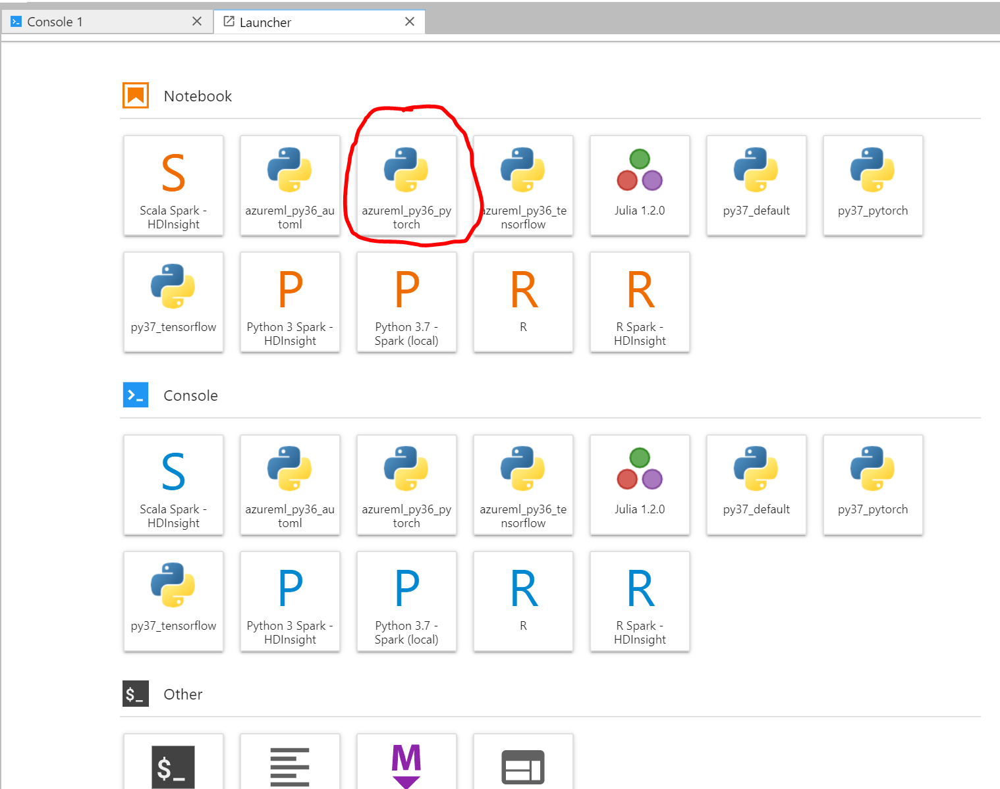
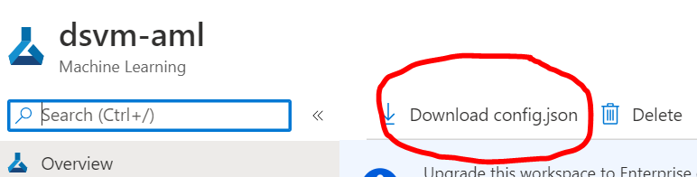
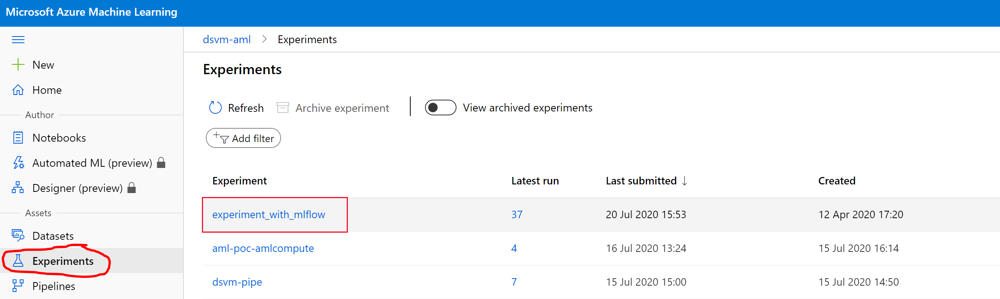
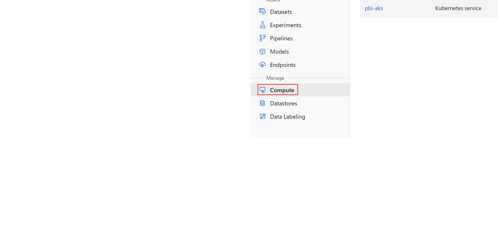
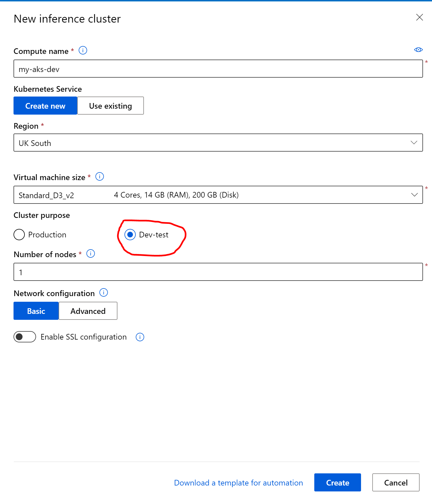
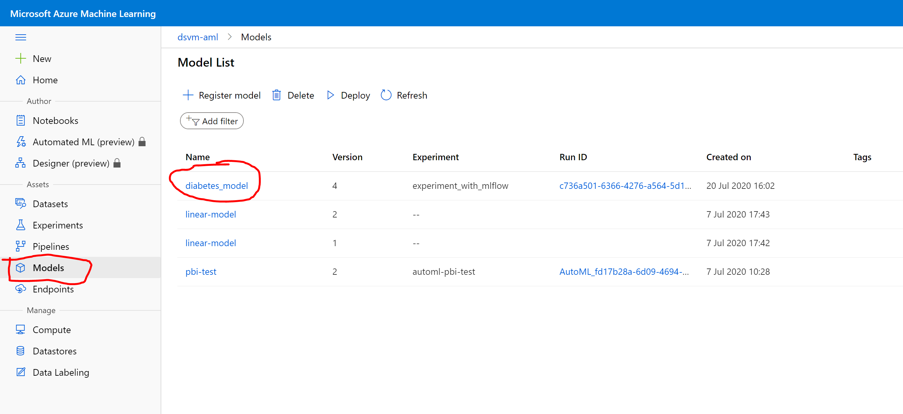
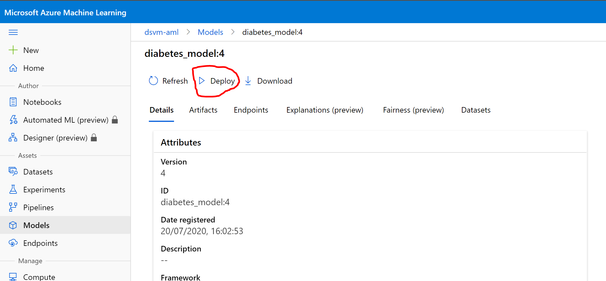
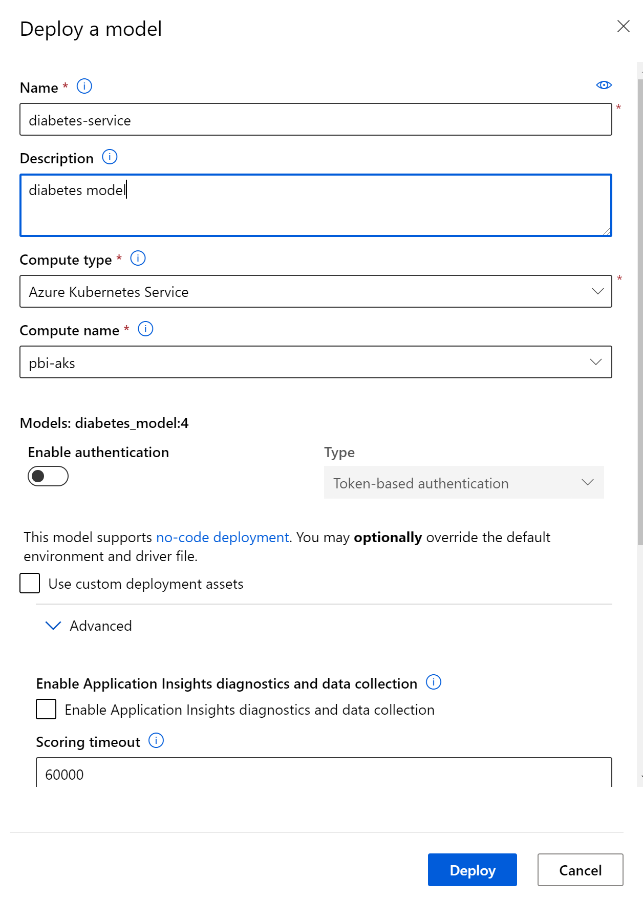
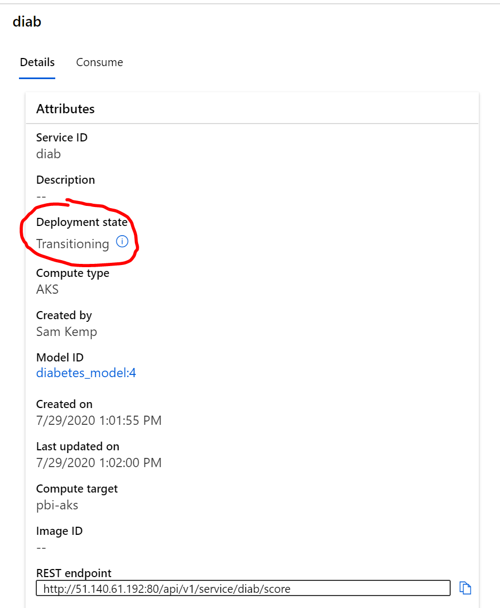

# Track experiments and deploy models in Azure Machine Learning

Enhance the model creation process by tracking your experiments and monitoring run metrics. In this article, learn how to add logging code to your training script using the [MLflow](https://mlflow.org/) API and track the experiment in Azure Machine Learning.

The following diagram illustrates that with MLflow Tracking, you track an experiment's run metrics and store model artifacts in your Azure Machine Learning workspace.


## Prerequisites

* You'll need to [provision an Azure Machine Learning Workspace](../how-to-manage-workspace.md#create-a-workspace)

## Create a new notebook

The Azure Machine Learning and MLFlow SDK are preinstalled on the Data Science VM and can be accessed in the **azureml_py36_\*** conda environment. In JupyterLab, click on the launcher and select the following kernel:



## Set up the workspace

Go to the [Azure portal](https://portal.azure.com) and select the workspace you provisioned as part of the prerequisites. You'll see __Download config.json__ (see below) - download the config and ensure It's stored in your working directory on the DSVM.



The config contains information such as the workspace name, subscription, etc. and it means that you don't need to hard code these parameters.

## Track DSVM runs

Add the following code to your notebook (or script) to set the Azure Machine Learning workspace object.

```Python
import mlflow
from azureml.core import Workspace

ws = Workspace.from_config()

mlflow.set_tracking_uri(ws.get_mlflow_tracking_uri())
```

>[!NOTE]
The tracking URI is valid up to an hour or less. If you restart your script after some idle time, use the get_mlflow_tracking_uri API to get a new URI.

### Load the data

This example uses the diabetes dataset, a well-known small dataset that comes with scikit-learn. This cell loads the dataset and splits it into random training and testing sets.

```python
from sklearn.datasets import load_diabetes
from sklearn.linear_model import Ridge
from sklearn.metrics import mean_squared_error
from sklearn.model_selection import train_test_split
import joblib

X, y = load_diabetes(return_X_y = True)
columns = ['age', 'gender', 'bmi', 'bp', 's1', 's2', 's3', 's4', 's5', 's6']
X_train, X_test, y_train, y_test = train_test_split(X, y, test_size=0.2, random_state=0)
data = {
    "train":{"X": X_train, "y": y_train},
    "test":{"X": X_test, "y": y_test}
}

print ("Data contains", len(data['train']['X']), "training samples and",len(data['test']['X']), "test samples")
```

### Add tracking

Add experiment tracking using the Azure Machine Learning SDK, and upload a persisted model into the experiment run record. The following code adds logs, and uploads a model file to the experiment run. The model is also registered in the Azure Machine Learning model registry.

```python
# Get an experiment object from Azure Machine Learning
from azureml.mlflow import register_model
experiment_name = 'experiment_with_mlflow'
mlflow.set_experiment(experiment_name)

with mlflow.start_run():
    # Log the algorithm parameter alpha to the run
    mlflow.log_param('alpha', 0.03)

    # Create, fit, and test the scikit-learn Ridge regression model
    regression_model = Ridge(alpha=0.03)
    regression_model.fit(data['train']['X'], data['train']['y'])
    preds = regression_model.predict(data['test']['X'])

    # Output the Mean Squared Error to the notebook and to the run
    print('Mean Squared Error is', mean_squared_error(data['test']['y'], preds))
    mlflow.log_metric('mse', mean_squared_error(data['test']['y'], preds))

    # Save the model
    model_file_name = 'model.pkl'
    joblib.dump(value = regression_model, filename = model_file_name)

    # upload the model file explicitly into artifacts
    mlflow.log_artifact(model_file_name)
    # register the model
    register_model(mlflow.active_run(), 'diabetes_model', 'model.pkl', model_framework="ScikitLearn")
```

### View runs in Azure Machine Learning

You can view the experiment run in [Azure Machine Learning Studio](https://ml.azure.com). Click on __Experiments__ in the left-hand menu and select the 'experiment_with_mlflow' (or if you decided to name your experiment differently in the above snippet, click on the name used):



You should see the logged Mean Squared Error (MSE):


If you click on the run, You'll see other details and also the pickled model in the __Outputs+logs__

## Deploy model in Azure Machine Learning

In this section, we outline how to deploy models trained on a DSVM to Azure Machine Learning.

### Step 1: Create Inference Compute

On the left-hand menu in [Azure Machine Learning Studio](https://ml.azure.com) click on __Compute__ and then the __Inference clusters__ tab. Next, click on __+ New__ as discussed below:



In the __New Inference cluster__ pane fill details for:

* Compute Name
* Kubernetes Service - select create new
* Select the region
* Select the VM size (for the purposes of this tutorial, the default of Standard_D3_v2 is sufficient)
* Cluster Purpose - select __Dev-test__
* Number of nodes should equal __1__
* Network Configuration - Basic

Next, click on __Create__.



### Step 2: Deploy no-code inference service

When we registered the model in our code using `register_model`, we specified the framework as sklearn. Azure Machine Learning supports no code deployments for the following frameworks:

* scikit-learn
* Tensorflow SaveModel format
* ONNX model format

No-code deployment means that you can deploy straight from the model artifact without needing to specify any specific scoring script.

To deploy the diabetes model, go to the left-hand menu in the [Azure Machine Learning Studio](https://ml.azure.com) and select __Models__. Next, click on the registered diabetes_model:



Next, click on the __Deploy__ button in the model details pane:



We will deploy the model to the Inference Cluster (Azure Kubernetes Service) we created in step 1. Fill the details below by providing a name for the service, and the name of the AKS compute cluster (created in step 1). We also recommend that you increase the __CPU reserve capacity__ to 1 (from 0.1) and the __Memory reserve capacity__ to 1 (from 0.5) - you can make this increase by clicking on __Advanced__ and filling in the details. Then click __Deploy__.



### Step 3: Consume

When the model has deployed successfully, you should see the following (to get to this page click on Endpoints from the left-hand menu > then click on the name of deployed service):



You should see that the deployment state goes from __transitioning__ to __healthy__. In addition, this details section provides the REST endpoint and Swagger URLs that an application developer can use to integrate your ML model into their apps.

You can test the endpoint using [Postman](https://www.postman.com/), or you can use the Azure Machine Learning SDK:

[!INCLUDE [sdk v1](../includes/machine-learning-sdk-v1.md)]

```python
from azureml.core import Webservice
import json

# if you called your service differently then change the name below
service = Webservice(ws, name="diabetes-service")

input_payload = json.dumps({
    'data': X_test[0:2].tolist(),
    'method': 'predict'  # If you have a classification model, you can get probabilities by changing this to 'predict_proba'.
})

output = service.run(input_payload)

print(output)
```

### Step 4: Clean up

Delete the Inference Compute you created in Step 1 so that you don't incur ongoing compute charges. On the left-hand menu in the Azure Machine Learning Studio, click on Compute > Inference Clusters > Select the compute > Delete.

## Next Steps

* Learn more about [deploying models in Azure Machine Learning](../v1/how-to-deploy-and-where.md)
