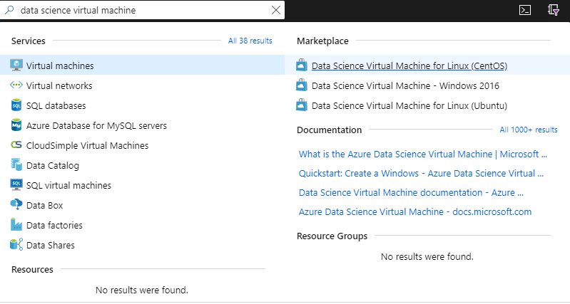
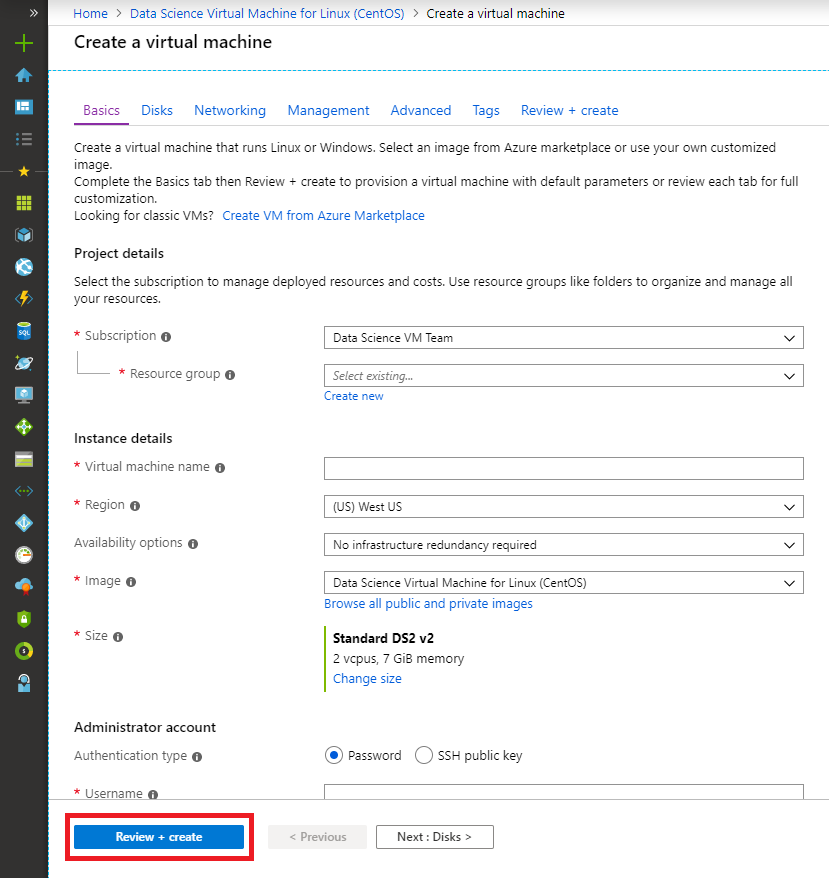

# Quickstart: Set up a CentOS (Linux) Data Science Virtual Machine in Azure

## Prerequisites

To create a CentOS Data Science Virtual Machine, you must have an **Azure subscription**. [Create a free subscription](https://azure.com/free).

## Create your CentOS Data Science Virtual Machine

Here are the steps to create an instance of the CentOS Data Science Virtual Machine:

1. Go to the [Azure portal](https://portal.azure.com). You might be prompted to sign in to your Azure account if you're not already signed in. 
1. Type "data science virtual machine" into the search bar and select the CentOS DSVM.

    

1. On the subsequent window, select **Create**.

    

1. You should be redirected to the "Create a virtual machine" blade.
   
   

1. Enter the following information to configure each step of the wizard:

    1. **Basics**:
    
       * **Subscription**: If you have more than one subscription, select the one on which the machine will be created and billed. You must have resource creation privileges for this subscription.
       * **Resource group**: Create a new group or use an existing one.
       * **Virtual machine name**: Enter the name of the virtual machine. This is how it will appear in your Azure portal.
       * **Region**: Select the datacenter that's most appropriate. For fastest network access, it's the datacenter that has most of your data or is closest to your physical location. Learn more about [Azure Regions](https://azure.microsoft.com/en-us/global-infrastructure/regions/).
       * **Image**: Leave the default value.
       * **Size**: This should auto-populate with a size that is appropriate for general workloads. Read more about [Linux VM sizes in Azure](../../virtual-machines/linux/sizes.md).
       * **Authentication type**: For quicker setup, select "Password." 
         
         > [!NOTE]
         > If you intend to use JupyterHub, make sure to select "Password," as JupyterHub is *not* configured to use SSH public keys.

       * **Username**: Enter the administrator username. This is the username you will use to log into your virtual machine, and need not be the same as your Azure username. Do *not* use capitalized letters.
         
         > [!NOTE]
         > If you use capitalized letters in your username, JupyterHub will not work, and you will encounter a 500 internal server error.

       * **Password**: Enter the password you will use to log into your virtual machine.    
    
   1. Select **Review + create**.
   1. **Review+create**
      * Verify that all the information you entered is correct. 
      * Select **Create**.
    
    The provisioning should take about 5 minutes. The status is displayed in the Azure portal.

## How to access the CentOS Data Science Virtual Machine

You can access the CentOS DSVM in one of three ways:

  1. SSH for terminal sessions
  1. X2Go for graphical sessions
  1. JupyterHub and JupyterLab for Jupyter notebooks

You can also attach a Data Science Virtual Machine to Azure Notebooks to run Jupyter notebooks on the VM and bypass the limitations of the free service tier. For more information, see [Manage and configure Azure Notebooks projects](../../notebooks/configure-manage-azure-notebooks-projects.md#compute-tier).

### SSH

After the VM is created, if it was configured with SSH access, you can sign in to it by using SSH. Use the account credentials that you created in the **Basics** section of step 3 for the text shell interface. On Windows, you can download an SSH client tool like [PuTTY](https://www.putty.org). If you prefer a graphical desktop (X Window System), you can use X11 forwarding on PuTTY.

> [!NOTE]
> The X2Go client performed better than X11 forwarding in testing. We recommend using the X2Go client for a graphical desktop interface.

### X2Go

The Linux VM is already provisioned with X2Go Server and ready to accept client connections. To connect to the Linux VM graphical desktop, complete the following procedure on your client:

1. Download and install the X2Go client for your client platform from [X2Go](https://wiki.x2go.org/doku.php/doc:installation:x2goclient).
1. Make note of the virtual machine's public IP address, which you can find in the Azure portal by opening the virtual machine you just created.

   

1. Run the X2Go client. If the "New Session" window does not pop up automatically, go to Session -> New Session.

1. On the resulting configuration window, enter the following configuration parameters:
   * **Session tab**:
     * **Host**: Enter the IP address of your VM, which you made note of earlier.
     * **Login**: Enter the username on the Linux VM.
     * **SSH Port**: Leave it at 22, the default value.
     * **Session Type**: Change the value to **XFCE**. Currently, the Linux VM supports only the XFCE desktop.
   * **Media tab**: You can turn off sound support and client printing if you don't need to use them.
   * **Shared folders**: If you want directories from your client machines mounted on the Linux VM, add the client machine directories that you want to share with the VM on this tab.

   
1. Select **OK**.
1. Click on the box in the right pane of the X2Go window in order to bring up the log-in screen for your VM.
1. Enter the password for your VM.
1. Select **OK**.
1. You may have to give X2Go permission to bypass your firewall in order to finish connecting.
1. You should now see the graphical interface for your CentOS DSVM. 


### JupyterHub and JupyterLab

The CentOS DSVM runs [JupyterHub](https://github.com/jupyterhub/jupyterhub), a multiuser Jupyter server. To connect, take the following steps:

   1. Make note of the public IP address for your VM, by searching for and selecting your VM in the Azure portal.

       

   1. From your local machine, open a web browser and navigate to https:\//your-vm-ip:8000, replacing "your-vm-ip" with the IP address you took note of earlier.
   1. Enter the username and password that you used to create the VM, and sign in. 

      

   1. Browse the many sample notebooks that are available.

JupyterLab, the next generation of Jupyter notebooks and JupyterHub, is also available. To access it, sign in to JupyterHub, and then browse to the URL https:\//your-vm-ip:8000/user/your-username/lab, replacing "your-username" with the username you chose when configuring the VM.

You can set JupyterLab as the default notebook server by adding this line to `/etc/jupyterhub/jupyterhub_config.py`:

```python
c.Spawner.default_url = '/lab'
```

## Next steps

Here's how you can continue your learning and exploration:

* The walkthrough [Data science on the Data Science Virtual Machine for Linux](linux-dsvm-walkthrough.md) shows you how to do several common data science tasks with the Linux DSVM provisioned here. 
* Explore the various data science tools on the DSVM by trying out the tools described in this article. You can also run `dsvm-more-info` in the shell in the virtual machine for a basic introduction and for pointers to more information about the tools installed on the DSVM.  
* Learn how to build end-to-end analytical solutions systematically by using the [Team Data Science Process](https://aka.ms/tdsp).
* Visit the [Azure AI Gallery](https://gallery.azure.ai/) for machine learning and data analytics samples that use the Azure AI services.
* Consult the appropriate [reference documentation](./reference-centos-vm.md) for this virtual machine.