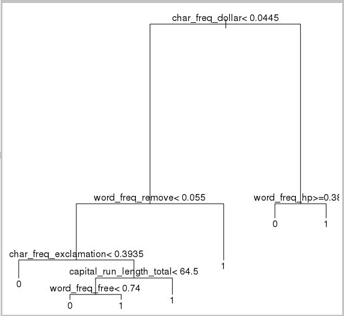
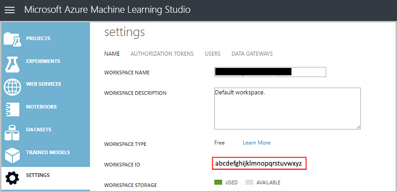
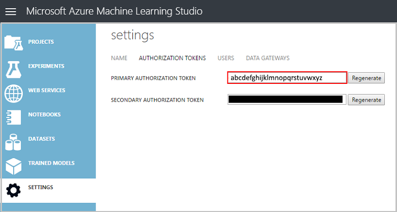

# Data science with a Linux Data Science Virtual Machine on Azure
This walkthrough shows you how to perform several common data science tasks with the Linux Data Science VM. The Linux Data Science Virtual Machine (DSVM) is a virtual machine image available on Azure that is pre-installed with a collection of tools commonly used for data analytics and machine learning. The key software components are itemized in the [Provision the Linux Data Science Virtual Machine](linux-dsvm-intro.md) topic. The VM image makes it easy to get started doing data science in minutes, without having to install and configure each of the tools individually. You can easily scale up the VM, if needed, and stop it when not in use. So this resource is both elastic and cost-efficient.

The data science tasks demonstrated in this walkthrough follow the steps outlined in the [Team Data Science Process](https://azure.microsoft.com/documentation/learning-paths/data-science-process/). This process provides a systematic approach to data science that enables teams of data scientists to effectively collaborate over the lifecycle of building intelligent applications. The data science process also provides an iterative framework for data science that can be followed by an individual.

We analyze the [spambase](https://archive.ics.uci.edu/ml/datasets/spambase) dataset in this walkthrough. This is a set of emails that are marked as either spam or ham (meaning they are not spam), and also contains some statistics on the content of the emails. The statistics included are discussed in the next but one section.

## Prerequisites
Before you can use a Linux Data Science Virtual Machine, you must have the following:

* An **Azure subscription**. If you do not already have one, see [Create your free Azure account today](https://azure.microsoft.com/free/).
* A [**Linux data science VM**](https://azure.microsoft.com/marketplace/partners/microsoft-ads/linux-data-science-vm). For information on provisioning this VM, see [Provision the Linux Data Science Virtual Machine](linux-dsvm-intro.md).
* [X2Go](http://wiki.x2go.org/doku.php) installed on your computer and opened an XFCE session. For information on installing and configuring an **X2Go client**, see [Installing and configuring X2Go client](linux-dsvm-intro.md#installing-and-configuring-x2go-client).
* For a smoother scrolling experience, toggle the gfx.xrender.enabled flag in about:config in VMs FireFox browser. [See more here.](https://www.reddit.com/r/firefox/comments/4nfmvp/ff_47_unbearable_slow_over_remote_x11/). Also consider toggling *mousewheel.enable_pixel_scrolling* to False. [Instructions here.](https://support.mozilla.org/en-US/questions/981140)
* An **AzureML account**. If you don't already have one, sign up for new one at the [AzureML homepage](https://studio.azureml.net/). There is a free usage tier to help you get started.

## Download the spambase dataset
The [spambase](https://archive.ics.uci.edu/ml/datasets/spambase) dataset is a relatively small set of data that contains only 4601 examples. This is a convenient size to use when demonstrating that some of the key features of the Data Science VM as it keeps the resource requirements modest.

> [!NOTE]
> This walkthrough was created on a D2 v2-sized Linux Data Science Virtual Machine (CentOS Edition). This size DSVM is capable of handling the procedures in this walkthrough.
>
>

If you need more storage space, you can create additional disks and attach them to your VM. These disks use persistent Azure storage, so their data is preserved even when the server is reprovisioned due to resizing or is shut down. To add a disk and attach it to your VM, follow the instructions in [Add a disk to a Linux VM](../../virtual-machines/linux/add-disk.md?toc=%2fazure%2fvirtual-machines%2flinux%2ftoc.json). These steps use the Azure Command-Line Interface (Azure CLI), which is already installed on the DSVM. So these procedures can be done entirely from the VM itself. Another option to increase storage is to use [Azure files](../../storage/files/storage-how-to-use-files-linux.md).

To download the data, open a terminal window and run this command:

    wget http://archive.ics.uci.edu/ml/machine-learning-databases/spambase/spambase.data

The downloaded file does not have a header row, so let's create another file that does have a header. Run this command to create a file with the appropriate headers:

    echo 'word_freq_make, word_freq_address, word_freq_all, word_freq_3d,word_freq_our, word_freq_over, word_freq_remove, word_freq_internet,word_freq_order, word_freq_mail, word_freq_receive, word_freq_will,word_freq_people, word_freq_report, word_freq_addresses, word_freq_free,word_freq_business, word_freq_email, word_freq_you, word_freq_credit,word_freq_your, word_freq_font, word_freq_000, word_freq_money,word_freq_hp, word_freq_hpl, word_freq_george, word_freq_650, word_freq_lab,word_freq_labs, word_freq_telnet, word_freq_857, word_freq_data,word_freq_415, word_freq_85, word_freq_technology, word_freq_1999,word_freq_parts, word_freq_pm, word_freq_direct, word_freq_cs, word_freq_meeting,word_freq_original, word_freq_project, word_freq_re, word_freq_edu,word_freq_table, word_freq_conference, char_freq_semicolon, char_freq_leftParen,char_freq_leftBracket, char_freq_exclamation, char_freq_dollar, char_freq_pound, capital_run_length_average,capital_run_length_longest, capital_run_length_total, spam' > headers

Then concatenate the two files together with the command:

    cat spambase.data >> headers
    mv headers spambaseHeaders.data

The dataset has several types of statistics on each email:

* Columns like ***word\_freq\_WORD*** indicate the percentage of words in the email that match *WORD*. For example, if *word\_freq\_make* is 1, then 1% of all words in the email were *make*.
* Columns like ***char\_freq\_CHAR*** indicate the percentage of all characters in the email that were *CHAR*.
* ***capital\_run\_length\_longest*** is the longest length of a sequence of capital letters.
* ***capital\_run\_length\_average*** is the average length of all sequences of capital letters.
* ***capital\_run\_length\_total*** is the total length of all sequences of capital letters.
* ***spam*** indicates whether the email was considered spam or not (1 = spam, 0 = not spam).

## Explore the dataset with Microsoft R Open
Let's examine the data and do some basic machine learning with R. The Data Science VM comes with [Microsoft R Open](https://mran.revolutionanalytics.com/open/) pre-installed. The multithreaded math libraries in this version of R offer better performance than various single-threaded versions. Microsoft R Open also provides reproducibility by using a snapshot of the CRAN package repository.

To get copies of the code samples used in this walkthrough, clone the **Azure-Machine-Learning-Data-Science** repository using git, which is pre-installed on the VM. From the git command line, run:

    git clone https://github.com/Azure/Azure-MachineLearning-DataScience.git

Open a terminal window and start a new R session with the R interactive console or use RStudio preinstalled on the machine.


To import the data and set up the environment, run:

    data <- read.csv("spambaseHeaders.data")
    set.seed(123)

To see summary statistics about each column:

    summary(data)

For a different view of the data:

    str(data)

This shows you the type of each variable and the first few values in the dataset.

The *spam* column was read as an integer, but it's actually a categorical variable (or factor). To set its type:

    data$spam <- as.factor(data$spam)

To do some exploratory analysis, use the [ggplot2](http://ggplot2.org/) package, a popular graphing library for R that is already installed on the VM. Note, from the summary data displayed earlier, that we have summary statistics on the frequency of the exclamation mark character. Let's plot those frequencies here with the following commands:

    library(ggplot2)
    ggplot(data) + geom_histogram(aes(x=char_freq_exclamation), binwidth=0.25)

Since the zero bar is skewing the plot, let's get rid of it:

    email_with_exclamation = data[data$char_freq_exclamation > 0, ]
    ggplot(email_with_exclamation) + geom_histogram(aes(x=char_freq_exclamation), binwidth=0.25)

There is a non-trivial density above 1 that looks interesting. Let's look at just that data:

    ggplot(data[data$char_freq_exclamation > 1, ]) + geom_histogram(aes(x=char_freq_exclamation), binwidth=0.25)

Then split it by spam vs ham:

    ggplot(data[data$char_freq_exclamation > 1, ], aes(x=char_freq_exclamation)) +
    geom_density(lty=3) +
    geom_density(aes(fill=spam, colour=spam), alpha=0.55) +
    xlab("spam") +
    ggtitle("Distribution of spam \nby frequency of !") +
    labs(fill="spam", y="Density")

These examples should enable you to make similar plots of the other columns to explore the data contained in them.

## Train and test an ML model
Now let's train a couple of machine learning models to classify the emails in the dataset as containing either span or ham. We train a decision tree model and a random forest model in this section and then test their accuracy of their predictions.

> [!NOTE]
> The rpart (Recursive Partitioning and Regression Trees) package used in the following code is already installed on the Data Science VM.
>
>

First, let's split the dataset into training and test sets:

    rnd <- runif(dim(data)[1])
    trainSet = subset(data, rnd <= 0.7)
    testSet = subset(data, rnd > 0.7)

And then create a decision tree to classify the emails.

    require(rpart)
    model.rpart <- rpart(spam ~ ., method = "class", data = trainSet)
    plot(model.rpart)
    text(model.rpart)

Here is the result:



To determine how well it performs on the training set, use the following code:

    trainSetPred <- predict(model.rpart, newdata = trainSet, type = "class")
    t <- table(`Actual Class` = trainSet$spam, `Predicted Class` = trainSetPred)
    accuracy <- sum(diag(t))/sum(t)
    accuracy

To determine how well it performs on the test set:

    testSetPred <- predict(model.rpart, newdata = testSet, type = "class")
    t <- table(`Actual Class` = testSet$spam, `Predicted Class` = testSetPred)
    accuracy <- sum(diag(t))/sum(t)
    accuracy

Let's also try a random forest model. Random forests train a multitude of decision trees and output a class that is the mode of the classifications from all of the individual decision trees. They provide a more powerful machine learning approach as they correct for the tendency of a decision tree model to overfit a training dataset.

    require(randomForest)
    trainVars <- setdiff(colnames(data), 'spam')
    model.rf <- randomForest(x=trainSet[, trainVars], y=trainSet$spam)

    trainSetPred <- predict(model.rf, newdata = trainSet[, trainVars], type = "class")
    table(`Actual Class` = trainSet$spam, `Predicted Class` = trainSetPred)

    testSetPred <- predict(model.rf, newdata = testSet[, trainVars], type = "class")
    t <- table(`Actual Class` = testSet$spam, `Predicted Class` = testSetPred)
    accuracy <- sum(diag(t))/sum(t)
    accuracy


## Deploy a model to Azure ML
[Azure Machine Learning Studio](https://studio.azureml.net/) (AzureML) is a cloud service that makes it easy to build and deploy predictive analytics models. One of the nice features of AzureML is its ability to publish any R function as a web service. The AzureML R package makes deployment easy to do right from our R session on the DSVM.

To deploy the decision tree code from the previous section, you need to sign in to Azure Machine Learning Studio. You need your workspace ID and an authorization token to sign in. To find these values and initialize the AzureML variables with them:

Select **Settings** on the left-hand menu. Note your **WORKSPACE ID**. 

Select **Authorization Tokens** from the overhead menu and note your **Primary Authorization Token**.

Load the **AzureML** package and then set values of the variables with your token and workspace ID in your R session on the DSVM:

    if(!require("AzureML")) install.packages("AzureML")
    require(AzureML)
    wsAuth = "<authorization-token>"
    wsID = "<workspace-id>"


Let's simplify the model to make this demonstration easier to implement. Pick the three variables in the decision tree closest to the root and build a new tree using just those three variables:

    colNames <- c("char_freq_dollar", "word_freq_remove", "word_freq_hp", "spam")
    smallTrainSet <- trainSet[, colNames]
    smallTestSet <- testSet[, colNames]
    model.rpart <- rpart(spam ~ ., method = "class", data = smallTrainSet)

We need a prediction function that takes the features as an input and returns the predicted values:

    predictSpam <- function(newdata) {
      predictDF <- predict(model.rpart, newdata = newdata)
      return(colnames(predictDF)[apply(predictDF, 1, which.max)])
    }


Publish the predictSpam function to AzureML using the **publishWebService** function:

    spamWebService <- publishWebService(ws, fun = predictSpam, name="spamWebService", inputSchema = smallTrainSet, data.frame=TRUE)


This function takes the **predictSpam** function, creates a web service named **spamWebService** with defined inputs and outputs, and returns information about the new endpoint.

View details of the latest published web service, including its API endpoint and access keys with the command:

    s<-tail(services(ws, name = "spamWebService"), 1)
    ep <- endpoints(ws,s)
    ep

To try it out on the first 10 rows of the test set:

    consume(ep, smallTestSet[1:10, ])


## Use other tools available
The remaining sections show how to use some of the tools installed on the Linux Data Science VM.Here is the list of tools discussed:

* XGBoost
* Python
* Jupyterhub
* Rattle
* PostgreSQL & Squirrel SQL
* SQL Server Data Warehouse

## XGBoost
[XGBoost](https://xgboost.readthedocs.org/en/latest/) is a tool that provides a fast and accurate boosted tree implementation.

    require(xgboost)
    data <- read.csv("spambaseHeaders.data")
    set.seed(123)

    rnd <- runif(dim(data)[1])
    trainSet = subset(data, rnd <= 0.7)
    testSet = subset(data, rnd > 0.7)

    bst <- xgboost(data = data.matrix(trainSet[,0:57]), label = trainSet$spam, nthread = 2, nrounds = 2, objective = "binary:logistic")

    pred <- predict(bst, data.matrix(testSet[, 0:57]))
    accuracy <- 1.0 - mean(as.numeric(pred > 0.5) != testSet$spam)
    print(paste("test accuracy = ", accuracy))

XGBoost can also call from python or a command line.

## Python
For development using Python, the Anaconda Python distributions 2.7 and 3.5 have been installed in the DSVM.

> [!NOTE]
> The Anaconda distribution includes [Conda](http://conda.pydata.org/docs/index.html), which can be used to create custom environments for Python that have different versions and/or packages installed in them.
>
>

Let's read in some of the spambase dataset and classify the emails with support vector machines in scikit-learn:

    import pandas
    from sklearn import svm    
    data = pandas.read_csv("spambaseHeaders.data", sep = ',\s*')
    X = data.ix[:, 0:57]
    y = data.ix[:, 57]
    clf = svm.SVC()
    clf.fit(X, y)

To make predictions:

    clf.predict(X.ix[0:20, :])

To show how to publish an AzureML endpoint, let's make a simpler model the three variables as we did when we published the R model previously.

    X = data[["char_freq_dollar", "word_freq_remove", "word_freq_hp"]]
    y = data.ix[:, 57]
    clf = svm.SVC()
    clf.fit(X, y)

To publish the model to AzureML:

    # Publish the model.
    workspace_id = "<workspace-id>"
    workspace_token = "<workspace-token>"
    from azureml import services
    @services.publish(workspace_id, workspace_token)
    @services.types(char_freq_dollar = float, word_freq_remove = float, word_freq_hp = float)
    @services.returns(int) # 0 or 1
    def predictSpam(char_freq_dollar, word_freq_remove, word_freq_hp):
        inputArray = [char_freq_dollar, word_freq_remove, word_freq_hp]
        return clf.predict(inputArray)

    # Get some info about the resulting model.
    predictSpam.service.url
    predictSpam.service.api_key

    # Call the model
    predictSpam.service(1, 1, 1)

> [!NOTE]
> This is only available for python 2.7 and is not yet supported on 3.5. Run with **/anaconda/bin/python2.7**.
>
>

## Jupyterhub
The Anaconda distribution in the DSVM comes with a Jupyter notebook, a cross-platform environment to share Python, R, or Julia code and analysis. The Jupyter notebook is accessed through JupyterHub. You sign in using your local Linux user name and password at ***https://\<VM DNS name or IP Address\>:8000/***. All configuration files for JupyterHub are found in directory **/etc/jupyterhub**.

> [!NOTE]
> To use the Python Package Manager (via the `pip` command) from a Jupyter notebook in the current kernel, the following command may be used in code cell, for example:
```python
   import sys
   ! {sys.executable} -m pip install numpy -y
```
>
>

> [!NOTE]
> To use the Conda installer (via the `conda` command) from a Jupyter notebook in the current kernel, the following command may be used in code cell, for example:
```python
   import sys
   ! {sys.prefix}/bin/conda install --yes --prefix {sys.prefix} numpy
```
>
>

Several sample notebooks are already installed on the VM:

* See the [IntroToJupyterPython.ipynb](https://github.com/Azure/Azure-MachineLearning-DataScience/blob/master/Data-Science-Virtual-Machine/Samples/Notebooks/IntroToJupyterPython.ipynb) for a sample Python notebook.
* See [IntroTutorialinR](https://github.com/Azure/Azure-MachineLearning-DataScience/blob/master/Data-Science-Virtual-Machine/Samples/Notebooks/IntroTutorialinR.ipynb) for a sample **R** notebook.
* See the [IrisClassifierPyMLWebService](https://github.com/Azure/Azure-MachineLearning-DataScience/blob/master/Data-Science-Virtual-Machine/Samples/Notebooks/IrisClassifierPyMLWebService.ipynb) for another sample **Python** notebook.

> [!NOTE]
> The Julia language is also available from the command line on the Linux Data Science VM.
>
>

## Rattle
[Rattle](https://cran.r-project.org/web/packages/rattle/index.html) (the R Analytical Tool To Learn Easily) is a graphical R tool for data mining. It has an intuitive interface that makes it easy to load, explore, and transform data and build and evaluate models.  The article [Rattle: A Data Mining GUI for R](https://journal.r-project.org/archive/2009-2/RJournal_2009-2_Williams.pdf) provides a walkthrough that demonstrates its features.

Install and start Rattle with the following commands:

    if(!require("rattle")) install.packages("rattle")
    require(rattle)
    rattle()

> [!NOTE]
> Installation is not required on the DSVM. But Rattle may prompt you to install additional packages when it loads.
>
>

Rattle uses a tab-based interface. Most of the tabs correspond to steps in the [Data Science Process](https://azure.microsoft.com/documentation/learning-paths/data-science-process/), like loading data or exploring it. The data science process flows from left to right through the tabs. But the last tab contains a log of the R commands run by Rattle.

To load and configure the dataset:

* To load the file, select the **Data** tab, then
* Choose the selector next to **Filename** and choose **spambaseHeaders.data**.
* To load the file. select **Execute** in the top row of buttons. You should see a summary of each column, including its identified data type, whether it's an input, a target, or other type of variable, and the number of unique values.
* Rattle has correctly identified the **spam** column as the target. Select the spam column, then set the **Target Data Type** to **Categoric**.

To explore the data:

* Select the **Explore** tab.
* Click **Summary**, then **Execute**, to see some information about the variable types and some summary statistics.
* To view other types of statistics about each variable, select other options like **Describe** or **Basics**.

The **Explore** tab also allows you to generate many insightful plots. To plot a histogram of the data:

* Select **Distributions**.
* Check **Histogram** for **word_freq_remove** and **word_freq_you**.
* Select **Execute**. You should see both density plots in a single graph window, where it is clear that the word "you" appears much more frequently in emails than "remove".

The Correlation plots are also interesting. To create one:

* Choose **Correlation** as the **Type**, then
* Select **Execute**.
* Rattle warns you that it recommends a maximum of 40 variables. Select **Yes** to view the plot.

There are some interesting correlations that come up: "technology" is strongly correlated to "HP" and "labs", for example. It is also strongly correlated to "650", because the area code of the dataset donors is 650.

The numeric values for the correlations between words are available in the Explore window. It is interesting to note, for example, that "technology" is negatively correlated with "your" and "money".

Rattle can transform the dataset to handle some common issues. For example, it allows you to rescale features, impute missing values, handle outliers, and remove variables or observations with missing data. Rattle can also identify association rules between observations and/or variables. These tabs are out of scope for this introductory walkthrough.

Rattle can also perform cluster analysis. Let's exclude some features to make the output easier to read. On the **Data** tab, choose **Ignore** next to each of the variables except these ten items:

* word_freq_hp
* word_freq_technology
* word_freq_george
* word_freq_remove
* word_freq_your
* word_freq_dollar
* word_freq_money
* capital_run_length_longest
* word_freq_business
* spam

Then go back to the **Cluster** tab, choose **KMeans**, and set the *Number of clusters* to 4. Then **Execute**. The results are displayed in the output window. One cluster has high frequency of "george" and "hp" and is probably a legitimate business email.

To build a simple decision tree machine learning model:

* Select the **Model** tab,
* Choose **Tree** as the **Type**.
* Select **Execute** to display the tree in text form in the output window.
* Select the **Draw** button to view a graphical version. This looks quite similar to the tree we obtained earlier using *rpart*.

One of the nice features of Rattle is its ability to run several machine learning methods and quickly evaluate them. Here is the procedure:

* Choose **All** for the **Type**.
* Select **Execute**.
* After it finishes you can click any single **Type**, like **SVM**, and view the results.
* You can also compare the performance of the models on the validation set using the **Evaluate** tab. For example, the **Error Matrix** selection shows you the confusion matrix, overall error, and averaged class error for each model on the validation set.
* You can also plot ROC curves, perform sensitivity analysis, and do other types of model evaluations.

Once you're finished building models, select the **Log** tab to view the R code run by Rattle during your session. You can select the **Export** button to save it.

> [!NOTE]
> There is a bug in current release of Rattle. To modify the script or use it to repeat your steps later, you must insert a # character in front of *Export this log ... * in the text of the log.
>
>

## PostgreSQL & Squirrel SQL
The DSVM comes with PostgreSQL installed. PostgreSQL is a sophisticated, open-source relational database. This section shows how to load our spam dataset into PostgreSQL and then query it.

Before you can load the data, you need to allow password authentication from the localhost. At a command prompt:

    sudo gedit /var/lib/pgsql/data/pg_hba.conf

Near the bottom of the config file are several lines that detail the allowed connections:

    # "local" is for Unix domain socket connections only
    local   all             all                                     trust
    # IPv4 local connections:
    host    all             all             127.0.0.1/32            ident
    # IPv6 local connections:
    host    all             all             ::1/128                 ident

Change the "IPv4 local connections" line to use md5 instead of ident, so we can log in using a username and password:

    # IPv4 local connections:
    host    all             all             127.0.0.1/32            md5

And restart the postgres service:

    sudo systemctl restart postgresql

To launch psql, an interactive terminal for PostgreSQL, as the built-in postgres user, run the following command from a prompt:

    sudo -u postgres psql

Create a new user account, using the same username as the Linux account you're currently logged in as, and give it a password:

    CREATE USER <username> WITH CREATEDB;
    CREATE DATABASE <username>;
    ALTER USER <username> password '<password>';
    \quit

Then log in to psql as your user:

    psql

And import the data into a new database:

    CREATE DATABASE spam;
    \c spam
    CREATE TABLE data (word_freq_make real, word_freq_address real, word_freq_all real, word_freq_3d real,word_freq_our real, word_freq_over real, word_freq_remove real, word_freq_internet real,word_freq_order real, word_freq_mail real, word_freq_receive real, word_freq_will real,word_freq_people real, word_freq_report real, word_freq_addresses real, word_freq_free real,word_freq_business real, word_freq_email real, word_freq_you real, word_freq_credit real,word_freq_your real, word_freq_font real, word_freq_000 real, word_freq_money real,word_freq_hp real, word_freq_hpl real, word_freq_george real, word_freq_650 real, word_freq_lab real,word_freq_labs real, word_freq_telnet real, word_freq_857 real, word_freq_data real,word_freq_415 real, word_freq_85 real, word_freq_technology real, word_freq_1999 real,word_freq_parts real, word_freq_pm real, word_freq_direct real, word_freq_cs real, word_freq_meeting real,word_freq_original real, word_freq_project real, word_freq_re real, word_freq_edu real,word_freq_table real, word_freq_conference real, char_freq_semicolon real, char_freq_leftParen real,char_freq_leftBracket real, char_freq_exclamation real, char_freq_dollar real, char_freq_pound real, capital_run_length_average real, capital_run_length_longest real, capital_run_length_total real, spam integer);
    \copy data FROM /home/<username>/spambase.data DELIMITER ',' CSV;
    \quit

Now, let's explore the data and run some queries using **Squirrel SQL**, a graphical tool that lets you interact with databases via a JDBC driver.

To get started, launch Squirrel SQL from the Applications menu. To set up the driver:

* Select **Windows**, then **View Drivers**.
* Right-click on **PostgreSQL** and select **Modify Driver**.
* Select **Extra Class Path**, then **Add**.
* Enter ***/usr/share/java/jdbcdrivers/postgresql-9.4.1208.jre6.jar*** for the **File Name** and
* Select **Open**.
* Choose List Drivers, then select **org.postgresql.Driver** in **Class Name**, and select **OK**.

To set up the connection to the local server:

* Select **Windows**, then **View Aliases.**
* Choose the **+** button to make a new alias.
* Name it *Spam database*, choose **PostgreSQL** in the **Driver** drop-down.
* Set the URL to *jdbc:postgresql://localhost/spam*.
* Enter your *username* and *password*.
* Click **OK**.
* To open the **Connection** window, double-click the ***Spam database*** alias.
* Select **Connect**.

To run some queries:

* Select the **SQL** tab.
* Enter a simple query such as `SELECT * from data;` in the query textbox at the top of the SQL tab.
* Press **Ctrl-Enter** to run it. By default Squirrel SQL returns the first 100 rows from your query.

There are many more queries you could run to explore this data. For example, how does the frequency of the word *make* differ between spam and ham?

    SELECT avg(word_freq_make), spam from data group by spam;

Or what are the characteristics of email that frequently contain *3d*?

    SELECT * from data order by word_freq_3d desc;

Most emails that have a high occurrence of *3d* are apparently spam, so it could be a useful feature for building a predictive model to classify the emails.

If you wanted to perform machine learning with data stored in a PostgreSQL database, consider using [MADlib](http://madlib.incubator.apache.org/).

## SQL Server Data Warehouse
Azure SQL Data Warehouse is a cloud-based, scale-out database capable of processing massive volumes of data, both relational and non-relational. For more information, see [What is Azure SQL Data Warehouse?](../../sql-data-warehouse/sql-data-warehouse-overview-what-is.md)

To connect to the data warehouse and create the table, run the following command from a command prompt:

    sqlcmd -S <server-name>.database.windows.net -d <database-name> -U <username> -P <password> -I

Then at the sqlcmd prompt:

    CREATE TABLE spam (word_freq_make real, word_freq_address real, word_freq_all real, word_freq_3d real,word_freq_our real, word_freq_over real, word_freq_remove real, word_freq_internet real,word_freq_order real, word_freq_mail real, word_freq_receive real, word_freq_will real,word_freq_people real, word_freq_report real, word_freq_addresses real, word_freq_free real,word_freq_business real, word_freq_email real, word_freq_you real, word_freq_credit real,word_freq_your real, word_freq_font real, word_freq_000 real, word_freq_money real,word_freq_hp real, word_freq_hpl real, word_freq_george real, word_freq_650 real, word_freq_lab real,word_freq_labs real, word_freq_telnet real, word_freq_857 real, word_freq_data real,word_freq_415 real, word_freq_85 real, word_freq_technology real, word_freq_1999 real,word_freq_parts real, word_freq_pm real, word_freq_direct real, word_freq_cs real, word_freq_meeting real,word_freq_original real, word_freq_project real, word_freq_re real, word_freq_edu real,word_freq_table real, word_freq_conference real, char_freq_semicolon real, char_freq_leftParen real,char_freq_leftBracket real, char_freq_exclamation real, char_freq_dollar real, char_freq_pound real, capital_run_length_average real, capital_run_length_longest real, capital_run_length_total real, spam integer) WITH (CLUSTERED COLUMNSTORE INDEX, DISTRIBUTION = ROUND_ROBIN);
    GO

Copy data with bcp:

    bcp spam in spambaseHeaders.data -q -c -t  ',' -S <server-name>.database.windows.net -d <database-name> -U <username> -P <password> -F 1 -r "\r\n"

> [!NOTE]
> The line endings in the downloaded file are Windows-style, but bcp expects UNIX-style, so we need to tell bcp that with the -r flag.
>
>

And query with sqlcmd:

    select top 10 spam, char_freq_dollar from spam;
    GO

You could also query with Squirrel SQL. Follow similar steps for PostgreSQL, using the Microsoft MSSQL Server JDBC Driver, which can be found in ***/usr/share/java/jdbcdrivers/sqljdbc42.jar***.

## Next steps
For an overview of topics that walk you through the tasks that comprise the Data Science process in Azure, see [Team Data Science Process](https://docs.microsoft.com/azure/machine-learning/team-data-science-process/overview).

For a description of other end-to-end walkthroughs that demonstrate the steps in the Team Data Science Process for specific scenarios, see [Team Data Science Process walkthroughs](../team-data-science-process/walkthroughs.md). The walkthroughs also illustrate how to combine cloud and on-premises tools and services into a workflow or pipeline to create an intelligent application.
