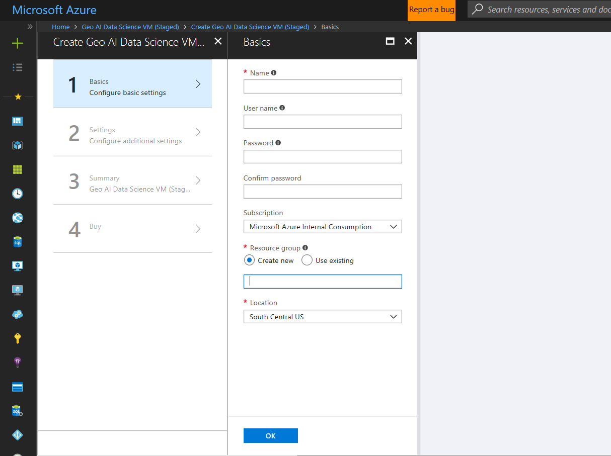
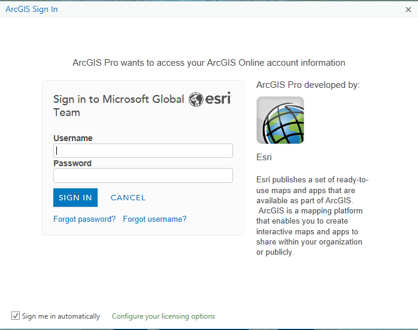
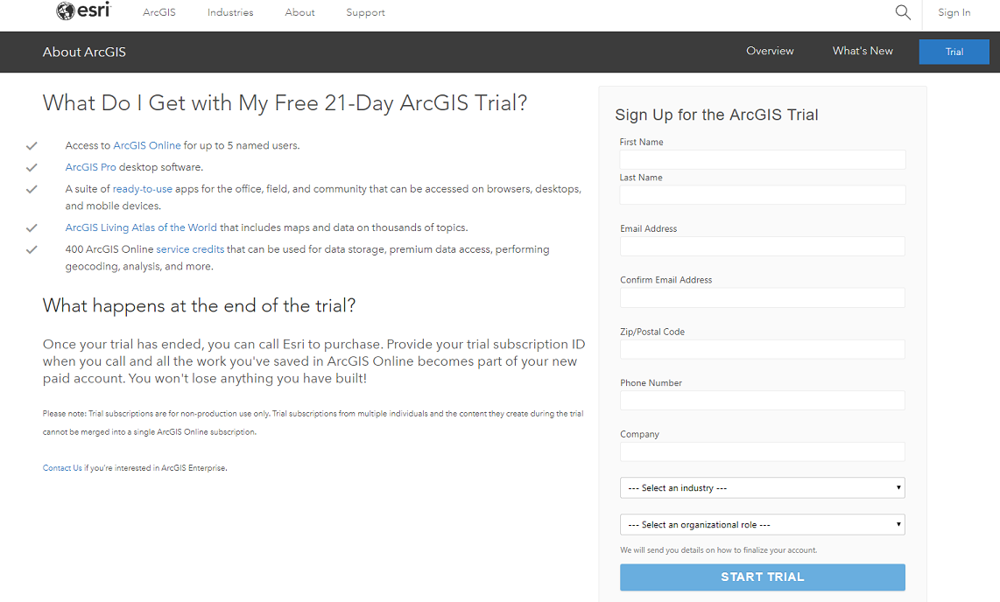

# Provision a Geo Artificial Intelligence Virtual Machine on Azure 

The Geo AI Data Science Virtual Machine (Geo-DSVM) is an extension of the popular [Azure Data Science Virtual Machine](https://aka.ms/dsvm) that is specially configured to combine AI and geospatial analytics. The geospatial analytics in the VM are powered by [ArcGIS Pro](https://www.arcgis.com/features/index.html). The Data Science VM enables the rapid training of machine learning models, and even of deep learning models, on data that is enriched with geographic information. It is supported on Windows 2016 DSVM only. ​

The Geo-DSVM contains several tools for AI including:

- GPU editions of popular deep learning frameworks like Microsoft Cognitive Toolkit, TensorFlow, Keras, Caffe2, Chainer; 
- tools to acquire and pre-process image, textual data, 
- tools for development activities such as Microsoft R Server Developer Edition, Anaconda Python, Jupyter notebooks for Python and R, IDEs for Python and R, SQL databases
- ESRI's ArcGIS Pro desktop software along with Python and R interfaces that can work with the geospatial data from your AI applications. 
 

## Create your Geo AI Data Science VM

Here is the procedure to create an instance of the Geo AI Data Science VM: 

1. Navigate to the virtual machine listing on [Azure portal](https://ms.portal.azure.com/#create/microsoft-ads.geodsvmwindows).
2. Select the **Create** button at the bottom to be taken into a wizard.

3. The wizard used to create the Geo-DSVM requires **inputs** for each of the **four steps** enumerated on the right of this figure. Here are the inputs needed to configure each of these steps:

   - **Basics**

      1. **Name**: Name of the data science server you are creating.

      2. **User Name**: Admin account login id.

      3. **Password**: Admin account password.

      4. **Subscription**: If you have more than one subscription, select the one on which the machine is to be created and billed.

      5. **Resource Group**: You can create a new one or use an **empty** existing Azure resource group in your subscription.

      6. **Location**: Select the data center that is most appropriate. Usually it is the data center that has most of your data or is closest to your physical location for fastest network access. If you need to do deep learning on GPU, you must choose one of the locations in Azure that has the NC-Series GPU VM instances. Currently the locations that have GPU VMs are: **East US, North Central US, South Central US, West US 2, North Europe, West Europe**. For the latest list, check the [Azure Products by Region Page](https://azure.microsoft.com/regions/services/) and look for **NC-Series** under **Compute**. 

   - **Settings**: Select one of the NC-Series GPU virtual machine size if you plan to run deep learning on  GPU on your Geo DSVM. Otherwise, you can choose one of the CPU based instance.  Create a storage account for your VM. 
   
   - **Summary**: Verify that all information you entered is correct.

   - **Buy**: Click **Buy** to start the provisioning. A link is provided to the terms of the service. The VM does not have any additional charges beyond the compute for the server size you chose in the **Size** step. 
 
>[!NOTE]
> The provisioning should take about 20-30 minutes. The status of the provisioning is displayed on the Azure portal.

 
## How to access the Geo AI Data Science Virtual Machine

 Once your VM is created, you are ready to start using the tools that are installed and pre-configured on it. There are start menu tiles and desktop icons for many of the tools. You can remote desktop into it using the Admin account credentials that you configured in the preceding **Basics** section. 

 
## Using ArcGIS Pro installed in the VM

The Geo-DSVM already has ArcGIS Pro desktop pre-installed and the environment pre-configured to work with all the tools in the DSVM. When you start ArcGIS it prompts you for a login to your ArcGIS account. If you already have an ArcGIS account and have licenses for the software, you can use your existing credentials.  

Otherwise, you can sign up for new ArcGIS account and license or get a [free trial](https://www.arcgis.com/features/free-trial.html). 

After you sign up for either a paid or free trial ArcGIS account, you can authorize ArcGIS Pro for your account by following the instructions in [Getting Started with ArcGIS Pro](https://www.esri.com/library/brochures/getting-started-with-arcgis-pro.pdf). 

After you sign in to ArcGIS Pro desktop with your ArcGIS account, you are ready to begin using the data science tools that are installed and configured on the VM for your Geospatial analytics and machine learning projects.

## Next steps

Get started using the Geo AI Data Science VM with guidance from the following topics:

* [Use the Geo AI Data Science VM](use-geo-ai-dsvm.md)
