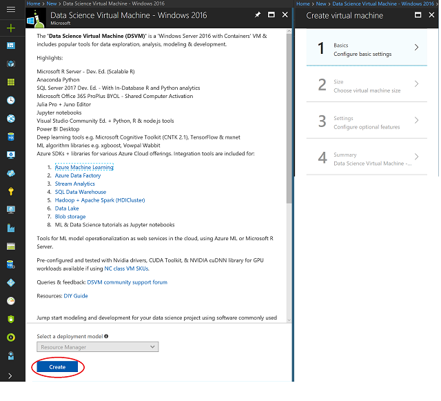

---
title: Provision the Windows Data Science Virtual Machine on Azure | Microsoft Docs
description: Configure and create a Data Science Virtual Machine on Azure for analytics and machine learning.
services: machine-learning
documentationcenter: ''
author: gopitk
manager: cgronlun

ms.assetid: e1467c0f-497b-48f7-96a0-7f806a7bec0b
ms.service: machine-learning
ms.component: data-science-vm
ms.workload: data-services
ms.devlang: na
ms.topic: article
ms.date: 08/30/2018
ms.author: gokuma

---
# Provision the Windows Data Science Virtual Machine on Azure
The Microsoft Data Science Virtual Machine (DSVM) is a Windows Azure virtual machine (VM) image. It's preinstalled and configured with several tools that are used for data analytics and machine learning. The following tools are included:

* [Azure Machine Learning](../service/index.yml) Workbench.
* [Microsoft Machine Learning Server](https://docs.microsoft.com/machine-learning-server/index) Developer edition.
* Anaconda Python distribution.
* Jupyter Notebook with R, Python, and PySpark kernels.
* Microsoft Visual Studio Community.
* Microsoft Power BI desktop.
* Microsoft SQL Server 2017 Developer edition.
* A standalone Apache Spark instance for local development and testing.
* [JuliaPro](https://juliacomputing.com/products/juliapro.html).
* Machine learning and data analytics tools:
  * Deep learning frameworks. A rich set of AI frameworks are included on the VM: [Microsoft Cognitive Toolkit](https://www.microsoft.com/en-us/cognitive-toolkit/), [TensorFlow](https://www.tensorflow.org/), [Chainer](https://chainer.org/), mxNet, and Keras.
  * [Vowpal Wabbit](https://github.com/JohnLangford/vowpal_wabbit). A fast machine learning system that supports techniques like online hashing, allreduce, reductions, learning2search, and active and interactive learning.
  * [XGBoost](https://xgboost.readthedocs.org/en/latest/). A tool that provides fast and accurate boosted tree implementation.
  * [Rattle](https://togaware.com/rattle/), the R analytical tool to learn easily. A tool that gets you started with data analytics and machine learning in R. It includes GUI-based data exploration and modeling with automatic R code generation.
  * [Weka](http://www.cs.waikato.ac.nz/ml/weka/). Visual data mining and machine learning software in Java.
  * [Apache Drill](https://drill.apache.org/). A schema-free SQL query engine for Apache Hadoop, NoSQL, and cloud storage.  It supports ODBC and JDBC interfaces for querying NoSQL and files from standard BI tools like Power BI, Microsoft Excel, and Tableau.
* Libraries in R and Python for use in Azure Machine Learning and other Azure services.
* Git, including Git Bash, to work with source code repositories that include GitHub and Azure DevOps. Git provides several popular Linux command-line utilities that are accessible both on Git Bash and a command prompt. Examples are awk, sed, perl, grep, find, wget, and curl.

Data science involves iterating on a sequence of tasks:

1. Find, load, and preprocess data.
1. Build and test models.
1. Deploy the models for consumption in intelligent applications.

Data scientists use several tools for these tasks. It can be time consuming to find the appropriate versions of software and then download and install them. The Microsoft Data Science Virtual Machine saves time by providing a ready-to-use image that can be provisioned on Azure with several popular tools preinstalled and configured. 

The Microsoft Data Science Virtual Machine jump-starts your analytics project. You can work on tasks in various languages including R, Python, SQL, and C#. Visual Studio provides an easy-to-use integrated development environment (IDE) to develop and test your code. The Azure SDK is included in the VM. So you can build your applications by using various services on Microsoft’s cloud platform. 

There are no software charges for this data science VM image. You pay only the Azure usage fees. They depend on the size of the virtual machine you provision. More details on compute fees are in the **Pricing details** section on the [Data Science Virtual Machine](https://azuremarketplace.microsoft.com/marketplace/apps/microsoft-ads.windows-data-science-vm?tab=PlansAndPrice) page. 

## Other versions of the Data Science Virtual Machine
* An [Ubuntu](dsvm-ubuntu-intro.md) image. It has many tools similar to the DSVM plus a few additional deep learning frameworks. 
* A [Linux CentOS](linux-dsvm-intro.md) image.
* The [Windows Server 2012 edition](https://azuremarketplace.microsoft.com/marketplace/apps/microsoft-ads.standard-data-science-vm) of the Data Science Virtual Machine. A few tools are available only on the Windows Server 2016 edition. Otherwise, this article also applies to the Windows Server 2012 edition.

## Prerequisite
To create a Microsoft Data Science Virtual Machine, you must have an Azure subscription. See [Get Azure free trial](http://azure.com/free).


## Create your Microsoft Data Science Virtual Machine
To create an instance of the Microsoft Data Science Virtual Machine, follow these steps:

1. Navigate to the virtual machine listing on the [Azure portal](https://portal.azure.com/#create/microsoft-dsvm.dsvm-windowsserver-2016). You may be prompted to login to your Azure account if you are not already signed in.
1. Select the **Create** button at the bottom to be taken into a wizard.

   

1. The wizard that creates the Microsoft Data Science Virtual Machine requires **input**. The following input is needed to configure each of the steps shown on the right of the figure:

  a. **Basics**:

    i. **Name**. The name of the data science server you're creating.  

    ii. **VM Disk Type**. Choose **SSD** or **HDD**. For an NC_v1 GPU instance like NVidia Tesla K80 based, choose **HDD** as the disk type.   

    iii. **User Name**. The admin account ID to sign in.   

    iv. **Password**. The admin account password.  

    v. **Subscription**. If you have more than one subscription, select the one on which the machine is to be created and billed.   

    vi. **Resource Group**. You can create a new one or use an existing group.   

    vii. **Location**. Select the data center that's most appropriate. For fastest network access, it's the data center that has most of your data or is closest to your physical location.   

  b. **Size**. Select one of the server types that meets your functional requirements and cost constraints. For more choices of VM sizes, select **View All**.  

  c. **Settings**:  

    i. **Use Managed Disks**. Choose **Managed** if you want Azure to manage the disks for the VM. If not, you need to specify a new or existing storage account.  

    ii. **Other parameters**. You can use the default values. If you want to use nondefault values, hover over the informational link for help on the specific fields.  

  d. **Summary**. Verify that all the information you entered is correct. Select **Create**. 

> [!NOTE]
> * The VM doesn't have any additional charges beyond the compute cost for the server size you chose in the **Size** step. 
> * Provisioning takes about 10 to 20 minutes. Its status displays on the Azure portal.
> 
> 

## How to access the Microsoft Data Science Virtual Machine
After the VM is created and provisioned, you can remote desktop into it by using the admin account credentials that you configured in the preceding **Basics** section. You're ready to start using the tools that are installed and configured on the VM. Many of the tools have start menu tiles and desktop icons. 


## Tools installed on the Microsoft Data Science Virtual Machine

### Microsoft Machine Learning Server Developer edition
You can use Microsoft Enterprise Library for scalable R or Python for your analytics because Machine Learning Server Developer edition is installed on the VM. Previously known as Microsoft R Server, Machine Learning Server is a broadly deployable enterprise-class analytics platform. It's available for both R and Python and is scalable, commercially supported, and secure. 

Machine Learning Server supports various big data statistics, predictive modeling, and machine learning tasks. It supports the full range of analytics: exploration, analysis, visualization, and modeling. By using and extending open-source R and Python, Machine Learning Server is compatible with R and Python scripts and functions. It's also compatible with CRAN, pip, and Conda packages to analyze data at the enterprise scale. 

Machine Learning Server addresses the in-memory limitations of open-source R by adding parallel and chunked processing of data. So you can run analytics on much bigger data than what fits in main memory. Visual Studio Community is included on the VM. It has the R tools for Visual Studio and Python Tools for Visual Studio (PTVS) extension that provide a full IDE for working with R or Python. We also provide other IDEs like [RStudio](http://www.rstudio.com) and [PyCharm Community edition](https://www.jetbrains.com/pycharm/) on the VM. 

### Python
For development by using Python, Anaconda Python distributions 2.7 and 3.6 have been installed. These distributions have the base Python along with about 300 of the most popular math, engineering, and data analytics packages. You can use PTVS, which is installed within Visual Studio Community 2017. Or you can use one of the IDEs bundled with Anaconda like IDLE or Spyder. Search for and launch one of these packages (Win+S).

> [!NOTE]
> To point the Python Tools for Visual Studio at Anaconda Python 2.7, you need to create custom environments for each version. To set these environment paths in Visual Studio 2017 Community, navigate to **Tools** > **Python Tools** > **Python Environments**. Then select **+ Custom**. 
> 
> 

Anaconda Python 3.6 is installed under **C:\Anaconda**. Anaconda Python 2.7 is installed under **c:\Anaconda\envs\python2**. For detailed steps, see [PTVS documentation](https://docs.microsoft.com/visualstudio/python/installing-python-interpreters). 

### The Jupyter Notebook
Anaconda distribution also comes with the Jupyter Notebook, an environment to share code and analysis. The Jupyter Notebook server is preconfigured with Python 2.7, Python 3.x, PySpark, Julia, and R kernels. To start the Jupyter server and launch the browser to access the notebook server, there's a desktop icon called **Jupyter Notebook**. 

We package several sample notebooks in Python and R. After you access Jupyter, the notebooks show how to work with the following technologies:

* Machine Learning Server.
* SQL Server Machine Learning Services, in-database analytics. 
* Python.
* Microsoft Cognitive ToolKit.
* Tensorflow.
* Other Azure technologies. 

You see the link to the samples on the notebook home page after you authenticate to the Jupyter Notebook by using the password you created in an earlier step. 

### Visual Studio Community 2017
Visual Studio Community is installed on the VM. It's a free version of the popular IDE from Microsoft that you can use for evaluation purposes and small teams. See the [licensing terms](https://www.visualstudio.com/support/legal/mt171547). 

Open Visual Studio by double-clicking the desktop icon or the **Start** menu. Search for programs (Win+S), followed by **Visual Studio**. From there, you can create projects in languages like C#, Python, R, and node.js. Installed plug-ins make it convenient to work with the following Azure services:
* Azure Data Catalog
* Azure HDInsight Hadoop and Spark
* Azure Data Lake 

There's also a plug-in called ```Visual Studio Tools for AI``` that seamlessly integrates to Azure Machine Learning and helps you rapidly build AI applications. 

> [!NOTE]
> You might get a message that your evaluation period is expired. Enter your Microsoft account credentials. Or create a new free account to get access to Visual Studio Community. 
> 
> 

### SQL Server 2017 Developer edition
A developer version of SQL Server 2017 with Machine Learning Services to run in-database analytics is provided on the VM in either R or Python. Machine Learning Services provides a platform for developing and deploying intelligent applications. You can use these languages and many packages from the community to create models and generate predictions for your SQL Server data. You can keep analytics close to the data because Machine Learning Services, in-database, integrates both the R and Python languages within SQL Server. This integration eliminates the cost and security risks associated with data movement.

> [!NOTE]
> The SQL Server Developer edition is only for development and test purposes. You need a license to run it in production. 
> 
> 

You can access SQL Server by launching Microsoft SQL Server Management Studio. Your VM name is populated as the **Server Name**. Use Windows authentication when you sign in as the admin on Windows. When you're in SQL Server Management Studio, you can create other users, create databases, import data, and run SQL queries. 

To enable in-database analytics by using SQL Machine Learning Services, run the following command as a one-time action in SQL Server Management Studio after you sign in as the server administrator: 

        CREATE LOGIN [%COMPUTERNAME%\SQLRUserGroup] FROM WINDOWS 

        (Please replace the %COMPUTERNAME% with your VM name)


### Azure
Several Azure tools are installed on the VM:

* A desktop shortcut goes to Azure SDK documentation. 
* **AzCopy** is used to move data in and out of your Azure Storage account. To see usage, enter **Azcopy** at a command prompt. 
* Use **Azure Storage Explorer** to browse the objects you store in your Azure Storage account. It also transfers data to and from Azure Storage. To access this tool, you can enter **Storage Explorer** in the **Search** field. Or find it on the Windows **Start** menu. 
* **Adlcopy** moves data to Azure Data Lake. To see usage, enter **adlcopy** in a command prompt. 
* **dtui** moves data to and from Azure Cosmos DB, a NoSQL database on the cloud. Enter **dtui** in a command prompt. 
* **Azure Data Factory Integration Runtime** moves data between on-premises data sources and the cloud. It's used within tools like Azure Data Factory. 
* **Microsoft Azure PowerShell** is a tool that's used to administer your Azure resources in the PowerShell scripting language. It's also installed on your VM. 

### Power BI
The **Power BI Desktop** is installed to help you build dashboards and visualizations. Use this tool to pull data from different sources, to author your dashboards and reports, and to publish them to the cloud. For more information, see the [Power BI](http://powerbi.microsoft.com) site. You can find the Power BI desktop on the **Start** menu. 

> [!NOTE]
> You need a Microsoft Office 365 account to access Power BI. 
> 
> 

### Azure Machine Learning Workbench

Azure Machine Learning Workbench is a desktop application and command-line interface. The workbench has built-in data preparation that learns your data preparation steps as you take them. It also provides project management, run history, and notebook integration to boost your productivity. 

You can use open-source frameworks, including TensorFlow, Cognitive Toolkit, Spark ML, and scikit-learn, to develop your models. On the DSVM, we provide a desktop icon to install the Azure Machine Learning Workbench into the individual user's **%LOCALAPPDATA%** directory. 

Each user of the workbench must take a one-time action. Double-click the ```AzureML Workbench Setup``` desktop icon to install the workbench instance. Azure Machine Learning also creates and uses a per user Python environment that's extracted in the **%LOCALAPPDATA%\amlworkbench\python** directory.

## More Microsoft development tools
The [Microsoft Web Platform Installer](https://www.microsoft.com/web/downloads/platform.aspx) is used to find and download other Microsoft development tools. There's also a shortcut to the tool provided on the Microsoft Data Science Virtual Machine desktop.  

## Important directories on the VM
| Item | Directory |
| --- | --- |
| Jupyter Notebook server configurations | C:\ProgramData\jupyter |
| Jupyter Notebook samples home directory | c:\dsvm\notebooks and c:\users\<username>\notebooks |
| Other samples | c:\dsvm\samples |
| Anaconda, default: Python 3.6 | c:\Anaconda |
| Anaconda Python 2.7 environment | c:\Anaconda\envs\python2 |
| Microsoft Machine Learning Server (Standalone) Python | C:\Program Files\Microsoft\ML Server\PYTHON_SERVER |
| Default R instance, Machine Learning Server (Standalone) | C:\Program Files\Microsoft\ML Server\R_SERVER |
| SQL Machine Learning Services in-database instance directory | C:\Program Files\Microsoft SQL Server\MSSQL14.MSSQLSERVER |
| Azure Machine Learning Workbench, per user | %localappdata%\amlworkbench | 
| Miscellaneous tools | c:\dsvm\tools |

> [!NOTE]
> On the Windows Server 2012 edition of the DSVM and Windows Server 2016 edition before March 2018, the default Anaconda environment is Python 2.7. The secondary environment is Python 3.5, located at **c:\Anaconda\envs\py35**. 
> 
> 

## Next steps

* Explore the tools on the data science VM by selecting the **Start** menu.
* Learn about Azure Machine Learning Services and Workbench by visiting the product [quickstart and tutorials page](../service/index.yml). 
* Navigate to **C:\Program Files\Microsoft\ML Server\R_SERVER\library\RevoScaleR\demoScripts** for samples that use the RevoScaleR library in R that supports data analytics at the enterprise scale.  
* Read the article [Ten things you can do on the Data science Virtual Machine](http://aka.ms/dsvmtenthings).
* Learn how to build end-to-end analytical solutions systematically by using the [Team Data Science Process](../team-data-science-process/index.yml).
* Visit the [Azure AI Gallery](http://gallery.cortanaintelligence.com) for machine learning and data analytics samples that use Azure Machine Learning and related data services on Azure. We've also provided an icon for this gallery on the **Start** menu and desktop of the virtual machine.

