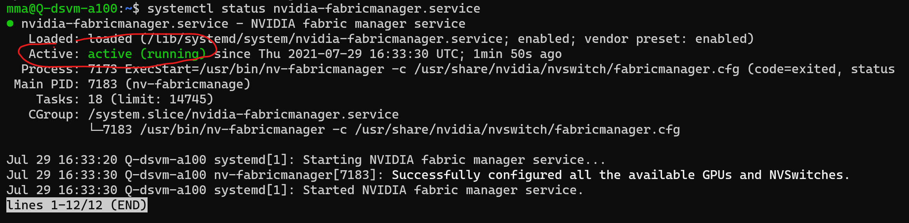
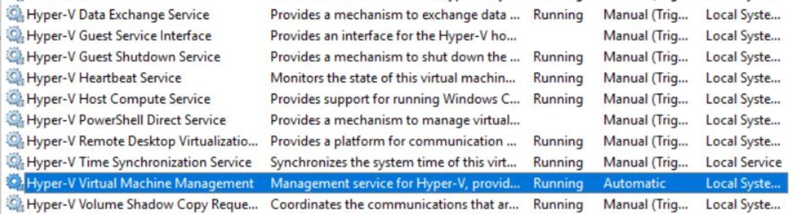

# Known issues and troubleshooting the Azure Data Science Virtual Machine

This article helps you find and correct errors or failures you might come across when using the Azure Data Science
Virtual Machine.


## Ubuntu

### Fix GPU on NVIDIA A100 GPU Chip - Azure NDasrv4 Series 

The ND A100 v4 series virtual machine is a new flagship addition to the Azure GPU family, designed for high-end Deep Learning training and tightly-coupled scale-up and scale-out HPC workloads.

Due to different architecture it requires different setup for your high-demanding workloads to benefit from GPU acceleration using TensorFlow or PyTorch frameworks.

We are working towards supporting the ND A100 machines GPUs out-of-the-box. Meanwhile you can make your GPU working by adding NVIDIA's Fabric Manager and updating drivers. 

Follow these simple steps while in Terminal:

1. Add NVIDIA's repository to install/update drivers - step-by-step instructions can be found [here](https://docs.nvidia.com/datacenter/tesla/tesla-installation-notes/index.html#ubuntu-lts)
2. [OPTIONAL] You can also update your CUDA drivers (from repository above)
3. Install NVIDIA's Fabric Manager drivers:

    ```
    sudo apt-get install cuda-drivers-460
    sudo apt-get install cuda-drivers-fabricmanager-460
    ```

4. Reboot your VM (to get your drivers ready)
5. Enable and start newly installed NVIDIA Fabric Manager service:

    ```
    sudo systemctl enable nvidia-fabricmanager
    sudo systemctl start nvidia-fabricmanager
    ```

You can now check your drivers and GPU working by running:
```
systemctl status nvidia-fabricmanager.service
``` 

After which you should see Fabric Manager service running



### Connection to desktop environment fails

If you can connect to the DSVM over SSH terminal but not over x2go, you might have set the wrong session type in x2go.
To connect to the DSVM's desktop environment, you need the session type in *x2go/session preferences/session* set to
*XFCE*. Other desktop environments are currently not supported.

### Fonts look wrong when connecting to DSVM using x2go

When you connect to x2go and some fonts look wrong, it might be related to a session setting in x2go. Before connecting
to the DSVM, uncheck the "Set display DPI" checkbox in the "Input/Output" tab of the session preferences dialog.

### Prompted for unknown password

When you create a DSVM setting *Authentication type* to *SSH Public Key* (which is recommended over using password
authentication), you will not be given a password. However, in some scenarios, some applications will still ask you for
a password. Run `sudo passwd <user_name>` to create a new password for a certain user. With `sudo passwd`, you can
create a new password for the root user.

Running these command will not change the configuration of SSH, and allowed sign-in mechanisms will be kept the same. 

### Prompted for password when running sudo command

When running a `sudo` command on an Ubuntu machine, you might be asked to enter your password again and again to confirm
that you are really the user who is logged in. This behavior is expected, and it is the default in Ubuntu. However, in some scenarios, a repeated authentication is not necessary and rather annoying.

To disable reauthentication for most cases, you can run the following command in a terminal.

 `echo -e "\n$USER ALL=(ALL) NOPASSWD: ALL\n" | sudo tee -a /etc/sudoers`

After restarting the terminal, sudo will not ask for another login and will consider the authentication from your
session login as sufficient.

### Cannot use docker as non-root user

In order to use docker as a non-root user, your user needs to be member of the docker group. You can run the
`getent group docker` command to check which users belong to that group. To add your user to the docker group, run
`sudo usermod -aG docker $USER`.

### Docker containers cannot interact with the outside via network

By default, docker adds new containers to the so-called "bridge network", which is `172.17.0.0/16`. If the subnet of
that bridge network overlaps with the subnet of your DSVM or with another private subnet you have in your subscription,
no network communication between the host and the container is possible. In that case, web applications running in the container cannot be reached, and the container cannot update packages from apt.

To fix the issue, you need to reconfigure docker to use an IP address space for its bridge network that does not overlap
with other networks of your subscription. For example, by adding

```json
"default-address-pools": [
        {
            "base": "10.255.248.0/21",
            "size": 21
        }
    ]
```

to the JSON document contained in file `/etc/docker/daemon.json`, docker will assign another subnet to the bridge
network. (The file needs to be edited using sudo, for example by running `sudo nano /etc/docker/daemon.json`.)

After the change, the docker service needs to be restarted by running `service docker restart`.

To check if your changes have taken effect, you can run `docker network inspect bridge`. The value under
*IPAM.Config.Subnet* should correspond to the address pool specified above.

### GPU(s) not available in docker container

The docker installed on the DSVM supports GPUs by default. However, there is a few prerequisite that must be met.

* Obviously, the VM size of the DSVM has to include at least one GPU.
* When starting your docker container with `docker run`, you need to add a *--gpus* parameter, for example, `--gpus all`.
* VM sizes that include NVIDIA A100 GPUs need additional software packages installed, esp. the
[NVIDIA Fabric Manager](https://docs.nvidia.com/datacenter/tesla/pdf/fabric-manager-user-guide.pdf). These packages
might not be pre-installed in your image yet.


## Windows

### Virtual Machine Generation 2 (Gen 2) not working
When you try to create Data Science VM based on Virtual Machine Generation 2 (Gen 2) it fails.

Currently, we maintain and provide images for Data Science VM based on Windows 2019 Server only for Generation 1 virtual machines. [Gen 2](../../virtual-machines/generation-2.md) are not yet supported and we plan to support them in near future. 


### Accessing SQL Server

When you try to connect to the pre-installed SQL Server instance, you might encounter a "login failed" error. To
successfully connect to the SQL Server instance, you need to run the program you are connecting with, for example, SQL Server
Management Studio (SSMS), in administrator mode. The administrator mode is required because by DSVM's default, only
administrators are allowed to connect.

### Hyper-V does not work

That Hyper-V initially doesn't work on Windows is expected behavior. For boot performance, we've disabled some services.
To enable Hyper-V:

1. Open the search bar on your Windows DSVM
1. Type in "Services,"
1. Set all Hyper-V services to "Manual"
1. Set "Hyper-V Virtual Machine Management" to "Automatic"

Your final screen should look like this:

   

