# Upgrade your Data Science Virtual Machine to Ubuntu 18.04

intro tk

## Prerequisites

1.  Make sure there are no dependencies on UBUNTU 16.04 for any driver.

2.  Create snapshot(backup) to counter the possible failures during migration.

## Overview

This document includes the migration plan for Ubuntu 18.04 from 16.04.
There are two possible ways to migrate:

### In-place migration

Also known a same server migration. In this migration no new machine is
needed and upgradation of existing VM takes place

### Side by side migration

Also known as inter server migration. In this migration the a new VM is
made, whereas the data is transferred from first server to the new
server. (Between OS of two different kernel)

## Create Snapshot

### Login to **Azure** portal and search snapshot in **search** **bar**

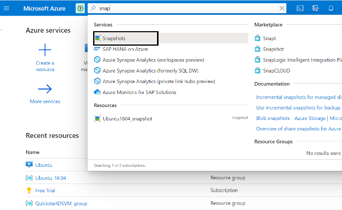

Search for Snapshot on Azure portal

### Create a new **snapshot** for the Ubuntu 16.04 VM

> 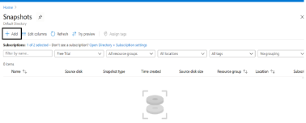
>
> (Select '**Add'** option)
>
> 
>
> Enter snapshot details(select the resource group you want to back up)

### Once all the details are filled and Validations are passed. Click '**Create'**.

> 
>
> Click '**Create'**

### The snapshot(backup) is now created.


## In-place migration

### Login to Ubuntu VM

> Copy the '**SSH**' from '**Connect'** tab of VM
>
> 
>
> Paste the '**SSH'** string in **CLI/Powershell** and enter the
> **credentials**
>
> 
>
> Press '**Enter'** and now you are logged in to the VM

### Enter the following commands in the Ubuntu VM and press **Enter.**

> \$ sudo do-release-upgrade
>
>
> Enter the '**Command'** and Press '**Enter'**
>
> 
>
> Wait until the upgradation completes.
>
> 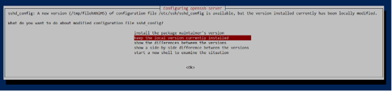

### After completion of upgradation. The VM will ask you to restart it. Type '**Y'** and press '**Enter'.**

> 

4.  ### Now the system Upgrade is successful. Try accessing the VM as mention in **Step 1.** 

5.  ### If below **Error** is shown on CLI and stops you to log in then it is because the **SSH** key is updated and the invalid key needs to be **deleted** now.


In case, you encounter above error due to ssh upgradation then use below
command to delete the invalid SSH key create due to upgrade.

```bash
ssh-keygen -R "your server hostname or ip"
```

> 

Run the command and allow the connection by typing '**Yes'**

### Now if you check the current version using '**cat /etc/os-release'** , it will show **18.04** now.


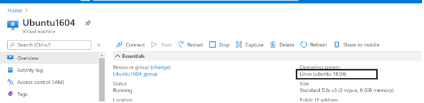

The change of version is also reflected on **Azure portal**.

## Migrating from CentOS 

second into tk 

## Prerequisites

1.  Be sure you have a good (bootable or restorable) backup before doing
    anything major to a system.

2.  It is often helpful to have a bootable Linux system on a separate
    set of partitions or better yet a separate disk. This can serve as a
    failback or rescue system, as well as an on-line backup.

3.  Migrations from other systems based on the same set of upstream
    source packages should be relatively straight-forward, for example
    [[FAQ/CentOS3]{.ul}](https://wiki.centos.org/FAQ/CentOS3) .

4.  User may want to upgrade the operating system parts of the
    filesystem and leave user directories, such as /home in place. If
    you do leave the old user home directories in place expect some
    problems with the GNOME/KDE menus and other desktop items. It may be
    preferable to create new user accounts and mount the old directories
    somewhere else in the filesystem for reference, copying, or linking
    user\'s material after the migration.

## Migration at a glance

1.  First thing we\'d want to do is create the Ubuntu VM with the distro that you want.

2.  We\'ll take a snapshot OS, the CentOS disk, create a disk from that snapshot, and attach it as a data disk to the Ubuntu VM.

3.  We can then copy the information from the CentOS disk over to the Ubuntu disk.

4.  From there, we\'ll want to mount the disk inside the Ubuntu VM, and move around the files we need for your services.

5.  Programs will need to be reinstalled/setup.

## Migrate from a CentOS VM to Ubuntu VM in Simple steps

1. Create a new Ubuntu VM (using [Azure portal](file:///C:\Users\Hitesh%20Kumar\Desktop\DOCFILE\portal.azure.com) or [ARM template](https://docs.microsoft.com/en-us/azure/machine-learning/data-science-virtual-machine/dsvm-tutorial-resource-manager)) and migrate the necessary data for the services running on the CentOS VM.


### **1.1 Creating a VM using ARM template:**

1.  Review the ARM template.

2.  Deploy the template. To choose the template from the Azure CLI,
    > login and choose your subscription and then run.

### 1.2 Review the deployed resource:

> To see your Data Science Virtual Machine:
>
> 1.2.1. Go to the [Azure
> portal](https://login.microsoftonline.com/organizations/oauth2/v2.0/authorize?client_id=c44b4083-3bb0-49c1-b47d-974e53cbdf3c&response_type=code%20id_token&scope=https%3A%2F%2Fmanagement.core.windows.net%2F%2Fuser_impersonation%20openid%20email%20profile&state=OpenIdConnect.AuthenticationProperties%3DLNPAUQ_5kA-QM6hNmfr3WFK4SGHoyje74W8tEqwIupABUBw-sg6kSAFojkUqBZlkp8MUfy3SF5mOIq0ywVUCaSvUG_wL2rL1np57JtSujJrCPH7mz1YsolCh_TuPjqTTj_rXXkAzMhnk7Y-DE6R9WSgWwKnS-2uPY3Y9rQrDToPkJhv7HceUzAtV4Ib4l822LsrzOLDPWi-UyXLJH1jzOT0Am-4VaU_6cwNPRDnfpXHr2oqd7JqtKz_iQglAQgkUgFV-Vn6oKLizfxFGiTbpQdXGgaHZ65xAUJ0XwbER1ES0ZPB7b_vx2HlS1QYSQgXJrHAPi-H_V3jJUvjMrhvIiOz14RVirATCnT4tvY0yFkRB1mnDwNHURV5w5T2AIY3F&response_mode=form_post&nonce=637353387935086679.NDM3YWM0NTEtZjYzZC00ZTE4LThkMWUtMWQwMTA1MjRhODNkN2RhYjczNzYtNWFlYy00YmY3LTg5Y2UtZWQ5NTE4ZTUwMTY2&redirect_uri=https%3A%2F%2Fportal.azure.com%2Fsignin%2Findex%2F&site_id=501430&client-request-id=0a8bf639-d408-4abd-9ba7-89ea005d830a&x-client-SKU=ID_NET45&x-client-ver=5.3.0.0&sso_reload=true)
> .
>
> 1.2.2. Sign in.
>
> 1.2.3. Choose the resource group you just created.
>
> 
>
> Fig1.2.3(a) - You\'ll see the Resource Group's information

2. Create a snapshot of the existing CentOS VM ([detailed here](https://docs.microsoft.com/en-us/azure/virtual-machines/windows/snapshot-copy-managed-disk#:~:text=To%20create%20a%20snapshot%2C%20complete%20the%20following%20steps%3A,the%20managed%20disk%20to%20snapshot.%20More%20items...%20)).On the [Azure portal](https://login.microsoftonline.com/organizations/oauth2/v2.0/authorize?client_id=c44b4083-3bb0-49c1-b47d-974e53cbdf3c&response_type=code%20id_token&scope=https%3A%2F%2Fmanagement.core.windows.net%2F%2Fuser_impersonation%20openid%20email%20profile&state=OpenIdConnect.AuthenticationProperties%3DOFA2-Tk_0Md0MwAuJKfipXNBdjytEnyMZATw4tN9sGg4mHpsSun8RHj4B46VG6Uo2PlMRNsUZkLntejO3OVAlcC1BVYRZuc2IHI3SLLaWOuz2Pgc_x1cmimTkKzU2IuwMULf4jXAnDm5e54guJlCQPwWSCV0FmdBptwPayrLqvxSqoaXbuk5jC8j5a3Sg3iAmrcclofWH5uL5rsU0GgQjfKqGZluHqFwq-tUkeP_YeBtlZakemZchjzXWB33MAit03b3adZ7tzMiCj1rhh4WBFb0E4Oy9y53zyhd8Z6tHkwa1AYiQ_L7fPNhavuqHusyxRnE-pBHJer4EprwYqO8pDmU7Wr6BU04w-4FUvbySMIiX69ka3hXqK86BlKXW5Ut&response_mode=form_post&nonce=637353422479044483.MDI1YWI1NmUtYjYwMS00ZmZiLWIyNDctYjNiOGQ3NTg0Mzk4NGQxZTIzOTUtOWYyMC00MWZjLTk1NDItZTFhNzMwZGYwMDI2&redirect_uri=https%3A%2F%2Fportal.azure.com%2Fsignin%2Findex%2F&site_id=501430&client-request-id=0a8bf639-d408-4abd-9ba7-89ea005d830a&x-client-SKU=ID_NET45&x-client-ver=5.3.0.0&sso_reload=true) select **Create** a resource.

> 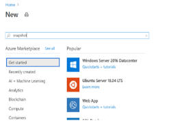
>
> Fig 2(a) - Select Create a Resource
>
> 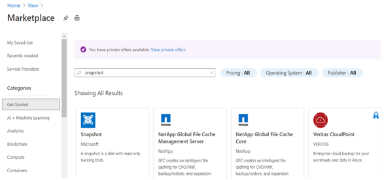
>
> Fig 2(b) - Search for and select Snapshot

3. In the **Marketplace** window, select **Snapshot**. The Create snapshot window appears.
------------------------------------------------------------------------------------------

> 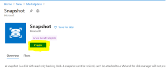

### 3.1 Enter a Name for the snapshot.

> 

### 3.2 Select an existing **Resource group** or enter the name of a new one.

> 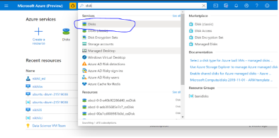

4. Create a **Disk** from that snapshot, In the Azure Portal, type **\'Disk\'** in the search bar.

> 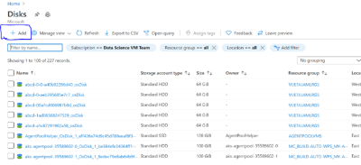
>
> Fig 4(a) -- Type 'disk' and select from dropdown

5. On the **Disk** page, select the **\'+ Add\'** option in the top left.

> 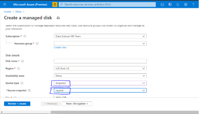
>
> Fig 5(a) -- Select the '+Add' option

6. During creation for **\'Source type\'** choose **\"Snapshot\"** and a new drop menu will appear to let you select the previously created snapshot.

> 
>
> Fig 6(a) -- Select previously captured disk

7. Go to the new **Ubuntu VM** page, select the **\'Disks\'** blade on the [left rail]{.ul} and click the **\'Attach existing disks\'** option ([detailed here](https://docs.microsoft.com/en-us/azure/virtual-machines/linux/attach-disk-portal)).

> 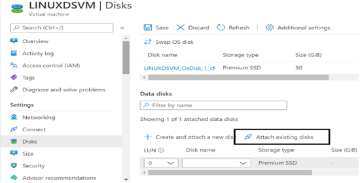
>
> Fig 7(a) -- Select 'Disks'
>
> 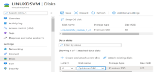
>
> Fig 7(b) -- Select 'Attach existing disks'

8. Type in or search for the **Disk** created in the last step.

> 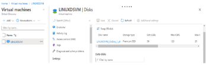
>
> Fig 8(a) - Select the disk from dropdown
>
> 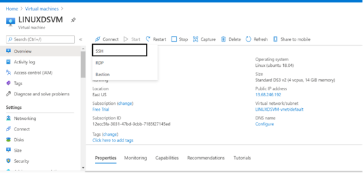
>
> Fig 8(b) -- Save the changes

9. **SSH** into the **VM** to access it.

> 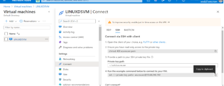
>
> Fig 9(a) - Select SSH From connect TAB in overview section
>
> 
>
> Fig 9(b) -- Copy the SSH string
>
> 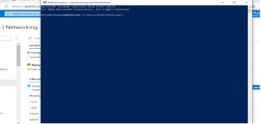
>
> Fig 9(c) - Paste the SSH string on power shell with key path
>
> 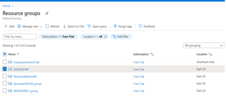
>
> Fig 9(d) -- Enter the password to login and access the VM

\*\*\*\* You do not need to partition this disk as it is already set
up.\*\*\*\*

10. **Move** or **Copy** the necessary directories or files from the **CentOS VM** to the **Ubuntu VM** in the appropriate directories for the services.

## Cold Migration

1.  Moving a powered off or suspended virtual machine to a new host.
    > Optionally, you can relocate configuration and disk files for
    > powered off or suspended virtual machines to new storage
    > locations.

2.  You can also use cold migration to move virtual machines from one
    > virtual switch to another, and from one data centre to another.
    > You can perform cold migration manually or you can schedule a
    > task.

## Steps to Perform Cold Migration

1. Go to the [Azure portal](https://portal.azure.com/) to manage the resource group containing the VM to move. Search for and select **Resource groups.**

> 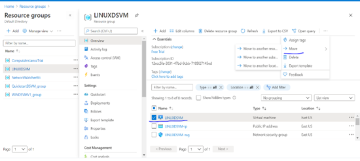

2. Choose the resource group containing the VM that you would like to move. At the top of the page for the resource group, select **Move** and then select **Move to another subscription**. The **Move resources** page opens.

> 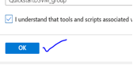

3. Select each of the resources to move. In most cases, you should move all of the related resources that are listed and then Select an existing **Resource group**, or enter a name to have a new resource group created.

> 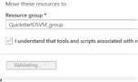
>
> Fig 3(a) - Select the target resource group from drop-down.

4. When you are done, select that you understand that new resource IDs will be created and that the new IDs will need to be used with the VM after it is moved, and then select **OK**. It will validate before migration.


Fig 4(a) -- Click **OK** Fig 4(b) - Validation

## Next steps

tk
