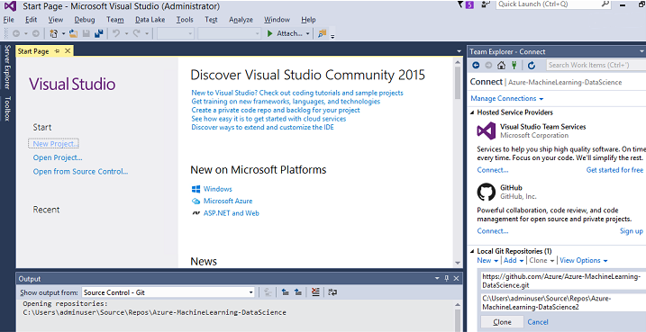
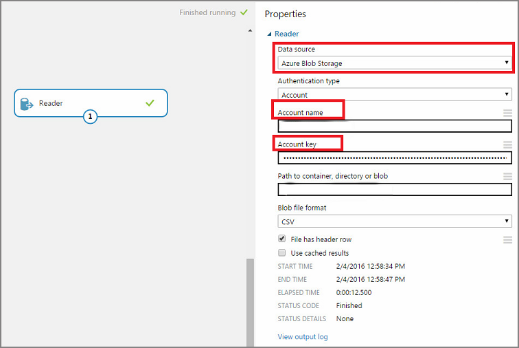
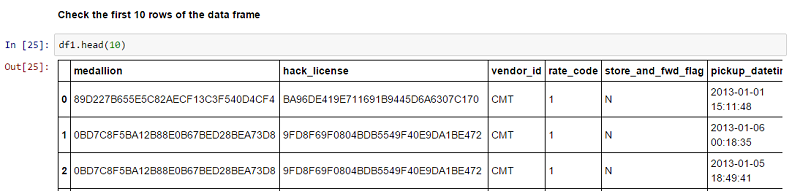
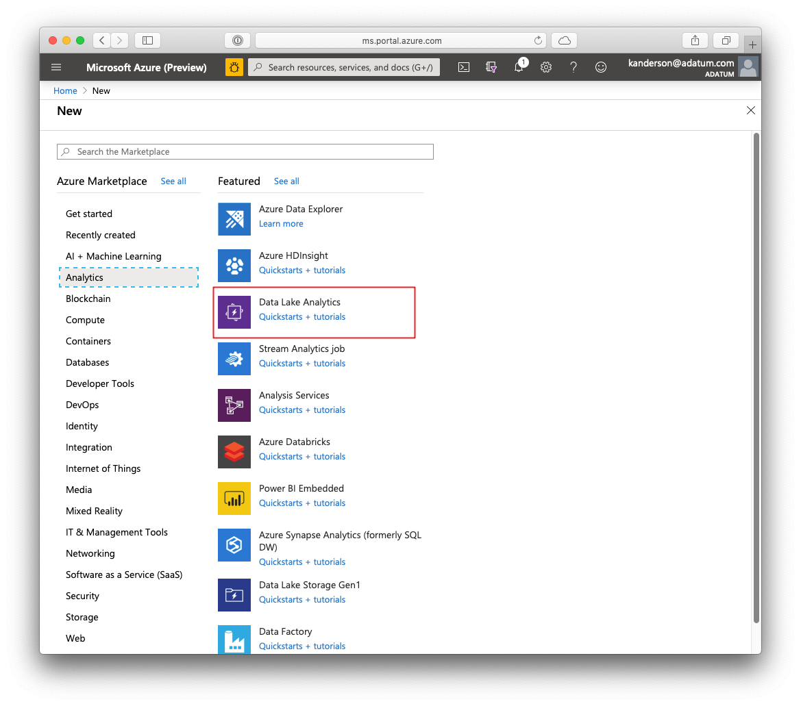
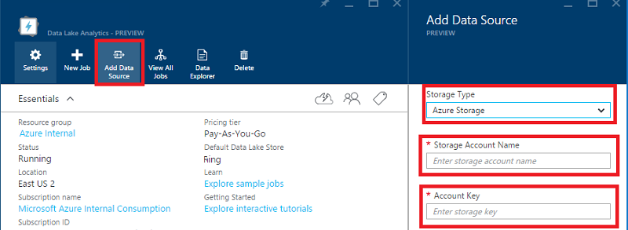
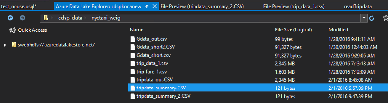
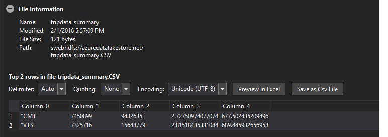

# Ten things you can do on the Windows Data Science Virtual Machine

The Windows Data Science Virtual Machine (DSVM) is a powerful data science development environment where you can perform data exploration and modeling tasks. The environment comes already built and bundled with several popular data analytics tools that make it easy to get started with your analysis for on-premises, cloud, or hybrid deployments. 

The DSVM works closely with Azure services. It can read and process data that's already stored on Azure, in Azure SQL Data Warehouse, Azure Data Lake, Azure Storage, or Azure Cosmos DB. It can also take advantage of other analytics tools, such as Azure Machine Learning and Azure Data Factory.

In this article, you'll learn how to use your DSVM to perform data science tasks and interact with other Azure services. Here are some of the things you can do on the DSVM:

- Explore data and develop models locally on the DSVM by using Microsoft Machine Learning Server and Python.
- Use a Jupyter notebook to experiment with your data in a browser by using Python 2, Python 3, and Microsoft R. (Microsoft R is an enterprise-ready version of R designed for performance.)
- Deploy models built through R and Python on Azure Machine Learning so client applications can access your models by using a simple web service interface.
- Administer your Azure resources by using the Azure portal or PowerShell.
- Extend your storage space and share large-scale datasets/code across your whole team by creating an Azure Files share as a mountable drive on your DSVM.
- Share code with your team by using GitHub. Access your repository by using the pre-installed Git clients: Git Bash and Git GUI.
- Access Azure data and analytics services like Azure Blob storage, Azure Data Lake, Azure Cosmos DB, Azure SQL Data Warehouse, and Azure SQL Database.
- Build reports and a dashboard by using the Power BI Desktop instance that's pre-installed on the DSVM, and deploy them in the cloud.
- Dynamically scale your DSVM to meet your project's needs.
- Install additional tools on your virtual machine.   

> [!NOTE]
> Additional usage charges apply for many of the data storage and analytics services listed in this article. For details, see the [Azure pricing](https://azure.microsoft.com/pricing/) page.
> 
> 

## Prerequisites

* You need an Azure subscription. You can [sign up for a free trial](https://azure.microsoft.com/free/).
* Instructions for provisioning a Data Science Virtual Machine on the Azure portal are available in [Creating a virtual machine](https://portal.azure.com/#create/microsoft-dsvm.dsvm-windowsserver-2016).


[!INCLUDE [updated-for-az](../../../includes/updated-for-az.md)]

## Explore data and develop models with Microsoft Machine Learning Server
You can use languages like R and Python to do your data analytics right on the DSVM.

For R, you can use an IDE like RStudio that can be found on the start menu or on the desktop. Or you can use R Tools for Visual Studio. Microsoft has provided additional libraries on top of the open-source CRAN R to enable scalable analytics and the ability to analyze data larger than the memory size allowed in parallel chunked analysis. 

For Python, you can use an IDE like Visual Studio Community Edition, which has the Python Tools for Visual Studio (PTVS) extension pre-installed. By default, only Python 3.6, the root Conda environment, is configured on PTVS. To enable Anaconda Python 2.7, take the following steps:

1. Create custom environments for each version by going to **Tools** > **Python Tools** > **Python Environments**, and then selecting **+ Custom** in Visual Studio Community Edition.
1. Give a description and set the environment prefix path as **c:\anaconda\envs\python2** for Anaconda Python 2.7.
1. Select **Auto Detect** > **Apply** to save the environment.

See the [PTVS documentation](https://aka.ms/ptvsdocs) for more details on how to create Python environments.

Now you're set up to create a new Python project. Go to **File** > **New** > **Project** > **Python** and select the type of Python application you're building. You can set the Python environment for the current project to the desired version (Python 2.7 or 3.6) by right-clicking **Python environments** and then selecting **Add/Remove Python Environments**. You can find more information about working with PTVS in the [product documentation](https://aka.ms/ptvsdocs).

## Use Jupyter notebooks
The Jupyter Notebook provides a browser-based IDE for data exploration and modeling. You can use Python 2, Python 3, or R (both open source and Microsoft R Server) in a Jupyter notebook.

To start the Jupyter Notebook, select the **Jupyter Notebook** icon on the **Start** menu or on the desktop. In the DSVM command prompt, you can also run the command ```jupyter notebook``` from the directory where you have existing notebooks or where you want to create new notebooks.  

After you start Jupyter, navigate to the `/notebooks` directory for example notebooks that are pre-packaged into the DSVM. Now you can:

* Select the notebook to see the code.
* Run each cell by selecting Shift+Enter.
* Run the entire notebook by selecting **Cell** > **Run**.
* Create a new notebook by selecting the Jupyter icon (upper-left corner), selecting the **New** button on the right, and then choosing the notebook language (also known as kernels).   

> [!NOTE]
> Currently, Python 2.7, Python 3.6, R, Julia, and PySpark kernels in Jupyter are supported. The R kernel supports programming in both open-source R and Microsoft R.   
> 
> 

When you're in the notebook, you can explore your data, build the model, and test the model by using your choice of libraries.

## Train and deploy models by using Azure Machine Learning
After you've built and validated your model, the next step is usually to deploy it into production. This step allows your client applications to invoke the model predictions on a real-time basis or a batch mode basis. Azure Machine Learning provides a mechanism to operationalize a model built in either R or Python.

When you operationalize your model in Azure Machine Learning, a web service is exposed. It allows clients to make REST calls that pass in input parameters and receive predictions from the model as outputs.

### Build and operationalize Python models
Here's a snippet of code developed in a Python Jupyter notebook that builds a simple model by using the Scikit-learn library:

```python
# IRIS classification
from sklearn import datasets
from sklearn import svm
clf = svm.SVC()
iris = datasets.load_iris()
X, y = iris.data, iris.target
clf.fit(X, y)
```

The method that's used to deploy your Python models to Azure Machine Learning wraps the prediction of the model into a function and decorates it with attributes provided by the pre-installed Azure Machine Learning Python library. The attributes denote your Azure Machine Learning workspace ID, the API key, and the input and return parameters.  

```python
from azureml import services
@services.publish(workspaceid, auth_token)
@services.types(sep_l=float, sep_w=float, pet_l=float, pet_w=float)
@services.returns(int)  # 0, or 1, or 2
def predictIris(sep_l, sep_w, pet_l, pet_w):
    inputArray = [sep_l, sep_w, pet_l, pet_w]


return clf.predict(inputArray)
```

A client can now make calls to the web service. Convenience wrappers construct the REST API requests. Here's sample code to consume the web service:

```python
# Consume through web service URL and keys
from azureml import services
@services.service(url, api_key)
@services.types(sep_l = float, sep_w = float, pet_l=float, pet_w=float)
@services.returns(float)
def IrisPredictor(sep_l, sep_w, pet_l, pet_w):
pass

IrisPredictor(3,2,3,4)
```

### Build and operationalize R models
You can deploy R models built on the Data Science Virtual Machine or elsewhere onto Azure Machine Learning in a way that's similar to how it's done for Python. Here are the steps:

1. Create a settings.json file to provide your workspace ID and authentication token. 
2. Write a wrapper for the model's predict function.
3. Call ```publishWebService``` in the Azure Machine Learning library to pass in the function wrapper.  

Use the following procedure and code snippets to set up, build, publish, and consume a model as a web service in Azure Machine Learning.

#### Set up

Create a settings.json file under a directory called ```.azureml``` under your home directory. Enter the parameters from your Azure Machine Learning workspace.

Here's the settings.json file structure:

```json
{"workspace":{
"id"                  : "ENTER YOUR AZUREML WORKSPACE ID",
"authorization_token" : "ENTER YOUR AZUREML AUTH TOKEN"
}}
```

#### Build a model in R and publish it in Azure Machine Learning

```r
library(AzureML)
ws <- workspace(config="~/.azureml/settings.json")

if(!require("lme4")) install.packages("lme4")
library(lme4)
set.seed(1)
train <- sleepstudy[sample(nrow(sleepstudy), 120),]
m <- lm(Reaction ~ Days + Subject, data = train)

# Define a prediction function to publish based on the model:
sleepyPredict <- function(newdata){
        predict(m, newdata=newdata)
}

ep <- publishWebService(ws, fun = sleepyPredict, name="sleepy lm", inputSchema = sleepstudy, data.frame=TRUE)
```

#### Consume the model deployed in Azure Machine Learning
To consume the model from a client application, use the Azure Machine Learning library to look up the published web service by name. Use the `services` API call to determine the endpoint. Then you just call the `consume` function and pass in the data frame to be predicted.

Use the following code to consume the model published as an Azure Machine Learning web service:

```r
library(AzureML)
library(lme4)
ws <- workspace(config="~/.azureml/settings.json")

s <-  services(ws, name = "sleepy lm")
s <- tail(s, 1) # use the last published function, in case of duplicate function names

ep <- endpoints(ws, s)

# Try this out, and compare with raw data
ans = consume(ep, sleepstudy)$ans
```

See more information about [R packages in Machine Learning Studio](/azure/machine-learning/studio-module-reference/r-packages-supported-by-azure-machine-learning).

## Manage Azure resources
The DSVM doesn't just allow you to build your analytics solution locally on the virtual machine. It also allows you to access services on the Azure cloud platform. Azure provides several compute, storage, data analytics, and other services that you can administer and access from your DSVM.

To administer your Azure subscription and cloud resources, you have two options:
+ Use your browser and go to the [Azure portal](https://portal.azure.com).

+ Use PowerShell scripts. Run Azure PowerShell from a shortcut on the desktop or from the **Start** menu. See the 
[Microsoft Azure PowerShell documentation](../../powershell-azure-resource-manager.md) for full details. 

## Extend storage by using shared file systems
Data scientists can share large datasets, code, or other resources within the team. The DSVM has about 45 GB of space available. To extend your storage, you can use Azure Files and either mount it on one or more DSVM instances or access it via a REST API. You can also use the [Azure portal](../../virtual-machines/windows/attach-managed-disk-portal.md) or use [Azure PowerShell](../../virtual-machines/windows/attach-disk-ps.md) to add extra dedicated data disks. 

> [!NOTE]
> The maximum space on the Azure Files share is 5 TB. The size limit for each file is 1 TB. 

You can use this script in Azure PowerShell to create an Azure Files share:

```powershell
# Authenticate to Azure.
Connect-AzAccount
# Select your subscription
Get-AzSubscription –SubscriptionName "<your subscription name>" | Select-AzSubscription
# Create a new resource group.
New-AzResourceGroup -Name <dsvmdatarg>
# Create a new storage account. You can reuse existing storage account if you want.
New-AzStorageAccount -Name <mydatadisk> -ResourceGroupName <dsvmdatarg> -Location "<Azure Data Center Name For eg. South Central US>" -Type "Standard_LRS"
# Set your current working storage account
Set-AzCurrentStorageAccount –ResourceGroupName "<dsvmdatarg>" –StorageAccountName <mydatadisk>

# Create an Azure Files share
$s = New-AzStorageShare <<teamsharename>>
# Create a directory under the file share. You can give it any name
New-AzStorageDirectory -Share $s -Path <directory name>
# List the share to confirm that everything worked
Get-AzStorageFile -Share $s
```

Now that you have created an Azure Files share, you can mount it in any virtual machine in Azure. We recommend that you put the VM in the same Azure datacenter as the storage account, to avoid latency and data transfer charges. Here are the Azure PowerShell commands to mount the drive on the DSVM:

```powershell
# Get the storage key of the storage account that has the Azure Files share from the Azure portal. Store it securely on the VM to avoid being prompted in the next command.
cmdkey /add:<<mydatadisk>>.file.core.windows.net /user:<<mydatadisk>> /pass:<storage key>

# Mount the Azure Files share as drive Z on the VM. You can choose another drive letter if you want.
net use z:  \\<mydatadisk>.file.core.windows.net\<<teamsharename>>
```

Now you can access this drive as you would any normal drive on the VM.

## Share code in GitHub
GitHub is a code repository where you can find code samples and sources for various tools by using technologies shared by the developer community. It uses Git as the technology to track and store versions of the code files. GitHub is also a platform where you can create your own repository to store your team's shared code and documentation, implement version control, and control who has access to view and contribute code. 

Visit the [GitHub help pages](https://help.github.com/) for more information on using Git. You can use GitHub as one of the ways to collaborate with your team, use code developed by the community, and contribute code back to the community.

The DSVM comes loaded with client tools on the command line and on the GUI to access the GitHub repository. The command-line tool that works with Git and GitHub is called Git Bash. Visual Studio is installed on the DSVM and has the Git extensions. You can find icons for these tools on the **Start** menu and on the desktop.

To download code from a GitHub repository, you use the ```git clone``` command. For example, to download the data science repository published by Microsoft into the current directory, you can run the following command in Git Bash:

    git clone https://github.com/Azure/DataScienceVM.git

In Visual Studio, you can do the same clone operation. The  following screenshot shows how to access Git and GitHub tools in Visual Studio:



You can find more information on using Git to work with your GitHub repository from resources available on github.com. The [cheat sheet](https://services.github.com/on-demand/downloads/github-git-cheat-sheet.pdf) is a useful reference.

## Access Azure data and analytics services
### Azure Blob storage
Azure Blob storage is a reliable, economical cloud storage service for data big and small. This section describes how you can move data to Blob storage and access data stored in an Azure blob.

#### Prerequisites

* Create your Azure Blob storage account from the [Azure portal](https://portal.azure.com).

   

* Confirm that the command-line AzCopy tool is pre-installed: ```C:\Program Files (x86)\Microsoft SDKs\Azure\AzCopy\azcopy.exe```. The directory that contains azcopy.exe is already on your PATH environment variable, so you can avoid typing the full command path when running this tool. For more information on the AzCopy tool, see the [AzCopy documentation](../../storage/common/storage-use-azcopy.md).
* Start the Azure Storage Explorer tool. You can download it from the  [Storage Explorer webpage](https://storageexplorer.com/). 

   

#### Move data from a VM to an Azure blob: AzCopy

To move data between your local files and Blob storage, you can use AzCopy on the command line or in PowerShell:

    AzCopy /Source:C:\myfolder /Dest:https://<mystorageaccount>.blob.core.windows.net/<mycontainer> /DestKey:<storage account key> /Pattern:abc.txt

Replace **C:\myfolder** with the path where your file is stored, **mystorageaccount** with your Blob storage account name, **mycontainer** with the container name, and **storage account key** with your Blob storage access key. You can find your storage account credentials in the [Azure portal](https://portal.azure.com).

Run the AzCopy command in PowerShell or from a command prompt. Here is some example usage of the AzCopy command:

```powershell
# Copy *.sql from a local machine to an Azure blob
"C:\Program Files (x86)\Microsoft SDKs\Azure\AzCopy\azcopy" /Source:"c:\Aaqs\Data Science Scripts" /Dest:https://[ENTER STORAGE ACCOUNT].blob.core.windows.net/[ENTER CONTAINER] /DestKey:[ENTER STORAGE KEY] /S /Pattern:*.sql

# Copy back all files from an Azure blob container to a local machine

"C:\Program Files (x86)\Microsoft SDKs\Azure\AzCopy\azcopy" /Dest:"c:\Aaqs\Data Science Scripts\temp" /Source:https://[ENTER STORAGE ACCOUNT].blob.core.windows.net/[ENTER CONTAINER] /SourceKey:[ENTER STORAGE KEY] /S
```

After you run the AzCopy command to copy to an Azure blob, your file will appear in Azure Storage Explorer.


#### Move data from a VM to an Azure blob: Azure Storage Explorer

You can also upload data from the local file in your VM by using Azure Storage Explorer:

* To upload data to a container, select the target container and select the **Upload** button.
* Select the ellipsis (**...**) to the right of the **Files** box, select one or multiple files to upload from the file system, and select **Upload** to begin uploading the files.

#### Read data from an Azure blob: Machine Learning reader module

In Azure Machine Learning Studio, you can use the Import Data module to read data from your blob.



#### Read data from an Azure blob: Python ODBC

You can use the BlobService library to read data directly from a blob in a Jupyter notebook or in a Python program.

First, import the required packages:

```python
import pandas as pd
from pandas import Series, DataFrame
import numpy as np
import matplotlib.pyplot as plt
from time import time
import pyodbc
import os
from azure.storage.blob import BlobService
import tables
import time
import zipfile
import random
```

Then, plug in your Blob storage account credentials and read data from the blob:

```python
CONTAINERNAME = 'xxx'
STORAGEACCOUNTNAME = 'xxxx'
STORAGEACCOUNTKEY = 'xxxxxxxxxxxxxxxx'
BLOBNAME = 'nyctaxidataset/nyctaxitrip/trip_data_1.csv'
localfilename = 'trip_data_1.csv'
LOCALDIRECTORY = os.getcwd()
LOCALFILE =  os.path.join(LOCALDIRECTORY, localfilename)

#download from blob
t1 = time.time()
blob_service = BlobService(account_name=STORAGEACCOUNTNAME,account_key=STORAGEACCOUNTKEY)
blob_service.get_blob_to_path(CONTAINERNAME,BLOBNAME,LOCALFILE)
t2 = time.time()
print(("It takes %s seconds to download "+BLOBNAME) % (t2 - t1))

#unzip downloaded files if needed
#with zipfile.ZipFile(ZIPPEDLOCALFILE, "r") as z:
#    z.extractall(LOCALDIRECTORY)

df1 = pd.read_csv(LOCALFILE, header=0)
df1.columns = ['medallion','hack_license','vendor_id','rate_code','store_and_fwd_flag','pickup_datetime','dropoff_datetime','passenger_count','trip_time_in_secs','trip_distance','pickup_longitude','pickup_latitude','dropoff_longitude','dropoff_latitude']
print 'the size of the data is: %d rows and  %d columns' % df1.shape
```

The data is read as a data frame:



### Azure Data Lake
Azure Data Lake Storage is a hyperscale repository for big data analytics workloads and is compatible with Hadoop Distributed File System (HDFS). It works with Hadoop, Spark, and Azure Data Lake Analytics. In this section, you'll learn how you can move data into Azure Data Lake Storage and run analytics by using Azure Data Lake Analytics.

#### Prerequisites

* Create your Azure Data Lake Analytics instance in the [Azure portal](https://portal.azure.com).

   

* The  [Azure Data Lake and Stream Analytics Tools for Visual Studio plug-in](https://www.microsoft.com/download/details.aspx?id=49504) is already installed in Visual Studio Community Edition on the virtual machine. After you start Visual Studio and sign in to your Azure subscription, you should see your Azure Data Analytics account and storage in the left panel of Visual Studio.

   

#### Move data from a VM to Data Lake: Azure Data Lake Explorer

You can use Azure Data Lake Explorer to [upload data from the local files in your virtual machine to Data Lake Storage](https://docs.microsoft.com/azure/data-lake-store/data-lake-store-get-started-portal).

You can also build a data pipeline to operationalize your data movement to or from Azure Data Lake by using [Azure Data Factory](https://azure.microsoft.com/services/data-factory/). [This article](https://azure.microsoft.com/blog/creating-big-data-pipelines-using-azure-data-lake-and-azure-data-factory/) guides you through the steps to build the data pipelines.

#### Read data from an Azure blob to Data Lake: U-SQL

If your data resides in Azure Blob storage, you can directly read data from an Azure blob in a U-SQL query. Before you compose your U-SQL query, make sure your Blob storage account is linked to your Azure Data Lake instance. Go to the Azure portal, find your Azure Data Lake Analytics dashboard, select **Add Data Source**, select a storage type of **Azure Storage**, and plug in your Azure storage account name and key. Then you can reference the data stored in the storage account.



In Visual Studio, you can read data from Blob storage, manipulate data, engineer features, and send the resulting data to either Azure Data Lake or Azure Blob storage. When you reference the data in Blob storage, use **wasb://**. When you reference the data in Azure Data Lake, use **swbhdfs://**.

You can use the following U-SQL queries in Visual Studio:

```usql
@a =
    EXTRACT medallion string,
            hack_license string,
            vendor_id string,
            rate_code string,
            store_and_fwd_flag string,
            pickup_datetime string,
            dropoff_datetime string,
            passenger_count int,
            trip_time_in_secs double,
            trip_distance double,
            pickup_longitude string,
            pickup_latitude string,
            dropoff_longitude string,
            dropoff_latitude string

    FROM "wasb://<Container name>@<Azure Blob Storage Account Name>.blob.core.windows.net/<Input Data File Name>"
    USING Extractors.Csv();

@b =
    SELECT vendor_id,
    COUNT(medallion) AS cnt_medallion,
    SUM(passenger_count) AS cnt_passenger,
    AVG(trip_distance) AS avg_trip_dist,
    MIN(trip_distance) AS min_trip_dist,
    MAX(trip_distance) AS max_trip_dist,
    AVG(trip_time_in_secs) AS avg_trip_time
    FROM @a
    GROUP BY vendor_id;

OUTPUT @b   
TO "swebhdfs://<Azure Data Lake Storage Account Name>.azuredatalakestore.net/<Folder Name>/<Output Data File Name>"
USING Outputters.Csv();

OUTPUT @b   
TO "wasb://<Container name>@<Azure Blob Storage Account Name>.blob.core.windows.net/<Output Data File Name>"
USING Outputters.Csv();
```

After your query is submitted to the server, a diagram shows the status of your job.


#### Query data in Data Lake: U-SQL

After the dataset is ingested in Azure Data Lake, you can use [U-SQL language](../../data-lake-analytics/data-lake-analytics-u-sql-get-started.md) to query and explore the data. U-SQL language is similar to T-SQL, but combines some features from C# so that users can write customized modules and user-defined functions. You can use the scripts in the previous step.

After the query is submitted to the server, tripdata_summary.CSV appears in Azure Data Lake Explorer. You can preview the data by right-clicking the file.



The file information appears:



### Azure SQL Data Warehouse and databases
Azure SQL Data Warehouse is an elastic data warehouse as a service with an enterprise-class SQL Server experience.

You can provision your Azure SQL data warehouse by following the instructions in [this article](../../sql-data-warehouse/sql-data-warehouse-get-started-provision.md). After you provision your SQL data warehouse, you can use [this walkthrough](../team-data-science-process/sqldw-walkthrough.md) to do data upload, exploration, and modeling by using data within the SQL data warehouse.

#### Azure Cosmos DB
Azure Cosmos DB is a NoSQL database in the cloud. You can use it to work with documents like JSON, and to store and query the documents.

Use the following prerequisite steps to access Azure Cosmos DB from the DSVM:

1. The Azure Cosmos DB Python SDK is already installed on the DSVM. To update it, run ```pip install pydocumentdb --upgrade``` from a command prompt.
2. Create an Azure Cosmos DB account and database from the [Azure portal](https://portal.azure.com).
3. Download the Azure Cosmos DB Data Migration Tool from the [Microsoft Download Center](https://www.microsoft.com/download/details.aspx?id=53595) and extract to a directory of your choice.
4. Import JSON data (volcano data) stored in a [public blob](https://data.humdata.org/dataset/a60ac839-920d-435a-bf7d-25855602699d/resource/7234d067-2d74-449a-9c61-22ae6d98d928/download/volcano.json) into Azure Cosmos DB with the following command parameters to the migration tool. (Use dtui.exe from the directory where you installed the Azure Cosmos DB Data Migration Tool.) Enter the source and target location with these parameters:
   
    `/s:JsonFile /s.Files:https://data.humdata.org/dataset/a60ac839-920d-435a-bf7d-25855602699d/resource/7234d067-2d74-449a-9c61-22ae6d98d928/download/volcano.json /t:DocumentDBBulk /t.ConnectionString:AccountEndpoint=https://[DocDBAccountName].documents.azure.com:443/;AccountKey=[[KEY];Database=volcano /t.Collection:volcano1`

After you import the data, you can go to Jupyter and open the notebook titled *DocumentDBSample*. It contains Python code to access Azure Cosmos DB and do some basic querying. You can learn more about Azure Cosmos DB by visiting the service's [documentation page](https://docs.microsoft.com/azure/cosmos-db/).

## Use Power BI reports and dashboards 
You can visualize the Volcano JSON file from the preceding Azure Cosmos DB example in Power BI Desktop to gain visual insights into the data. Detailed steps are available in the [Power BI article](../../cosmos-db/powerbi-visualize.md). Here are the high-level steps:

1. Open Power BI Desktop and select **Get Data**. Specify the URL as: `https://cahandson.blob.core.windows.net/samples/volcano.json`.
2. You should see the JSON records imported as a list. Convert the list to a table so Power BI can work with it.
4. Expand the columns by selecting the expand (arrow) icon.
5. Notice that the location is a **Record** field. Expand the record and select only the coordinates. **Coordinate** is a list column.
6. Add a new column to convert the list coordinate column into a comma-separated **LatLong** column. Concatenate the two elements in the coordinate list field by using the formula ```Text.From([coordinates]{1})&","&Text.From([coordinates]{0})```.
7. Convert the **Elevation** column to decimal and select the **Close** and **Apply** buttons.

Instead of preceding steps, you can paste the following code. It scripts out the steps used in the Advanced Editor in Power BI to write the data transformations in a query language.

```pqfl
let
    Source = Json.Document(Web.Contents("https://cahandson.blob.core.windows.net/samples/volcano.json")),
    #"Converted to Table" = Table.FromList(Source, Splitter.SplitByNothing(), null, null, ExtraValues.Error),
    #"Expanded Column1" = Table.ExpandRecordColumn(#"Converted to Table", "Column1", {"Volcano Name", "Country", "Region", "Location", "Elevation", "Type", "Status", "Last Known Eruption", "id"}, {"Volcano Name", "Country", "Region", "Location", "Elevation", "Type", "Status", "Last Known Eruption", "id"}),
    #"Expanded Location" = Table.ExpandRecordColumn(#"Expanded Column1", "Location", {"coordinates"}, {"coordinates"}),
    #"Added Custom" = Table.AddColumn(#"Expanded Location", "LatLong", each Text.From([coordinates]{1})&","&Text.From([coordinates]{0})),
    #"Changed Type" = Table.TransformColumnTypes(#"Added Custom",{{"Elevation", type number}})
in
    #"Changed Type"
```

You now have the data in your Power BI data model. Your Power BI Desktop instance should appear as follows:


You can start building reports and visualizations by using the data model. You can follow the steps in [this Power BI article](../../cosmos-db/powerbi-visualize.md#build-the-reports) to build a report.

## Scale the DSVM dynamically 
You can scale up and down the DSVM to meet your project's needs. If you don't need to use the VM in the evening or on weekends, you can shut down the VM from the [Azure portal](https://portal.azure.com).

> [!NOTE]
> You incur compute charges if you use just the shutdown button for the operating system on the VM.  
> 
> 

You might need to handle some large-scale analysis and need more CPU, memory, or disk capacity. If so, you can find a choice of VM sizes in terms of CPU cores, GPU-based instances for deep learning, memory capacity, and disk types (including solid-state drives) that meet your compute and budgetary needs. The full list of VMs, along with their hourly compute pricing, is available on the [Azure Virtual Machines pricing](https://azure.microsoft.com/pricing/details/virtual-machines/) page.

Similarly, your need for VM processing capacity might diminish. (For example: you moved a major workload to a Hadoop or Spark cluster.) You can then scale down the cluster from the [Azure portal](https://portal.azure.com) and go to the settings of your VM instance. 

## Add more tools
Tools prebuilt into the DSVM can address many common data-analytics needs. This saves you time because you don't have to install and configure your environments one by one. It also saves you money, because you pay for only resources that you use.

You can use other Azure data and analytics services profiled in this article to enhance your analytics environment. In some cases, you might need additional tools, including some proprietary partner tools. You have full administrative access on the virtual machine to install new tools that you need. You can also install additional packages in Python and R that are not pre-installed. For Python, you can use either ```conda``` or ```pip```. For R, you can use ```install.packages()``` in the R console, or use the IDE and select **Packages** > **Install Packages**.

## Deep learning

In addition to the framework-based samples, you can get a set of comprehensive walkthroughs that have been validated on the DSVM. These walkthroughs help you jump-start your development of deep-learning applications in domains like image and text/language understanding.   


- [Running neural networks across different frameworks](https://github.com/ilkarman/DeepLearningFrameworks): This walkthrough shows how to migrate code from one framework to another. It also demonstrates how to compare models and runtime performance across frameworks. 

- [A how-to guide to build an end-to-end solution to detect products within images](https://github.com/Azure/cortana-intelligence-product-detection-from-images): Image detection is a technique that can locate and classify objects within images. This technology has the potential to bring huge rewards in many real-life business domains. For example, retailers can use this technique to determine which product a customer has picked up from the shelf. This information in turn helps stores manage product inventory. 

- [Deep learning for audio](https://blogs.technet.microsoft.com/machinelearning/2018/01/30/hearing-ai-getting-started-with-deep-learning-for-audio-on-azure/): This tutorial shows how to train a deep-learning model for audio event detection on the [urban sounds dataset](https://serv.cusp.nyu.edu/projects/urbansounddataset/urbansound8k.html). It also provides an overview of how to work with audio data.

- [Classification of text documents](https://github.com/anargyri/lstm_han): This walkthrough demonstrates how to build and train two neural network architectures: Hierarchical Attention Network and Long Short Term Memory (LSTM) network. These neural networks use the Keras API for deep learning to classify text documents. Keras is a front end to three of the most popular deep-learning frameworks: Microsoft Cognitive Toolkit, TensorFlow, and Theano.

## Summary
This article described some of the things you can do on the Microsoft Data Science Virtual Machine. There are many more things you can do to make the DSVM an effective analytics environment.

