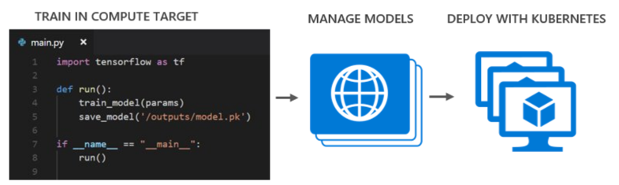

---
title: Install and use the CLI for top tasks - Azure Machine Learning
description: Learn how to install and use the CLI for the most common machine learning tasks in Azure Machine Learning.
services: machine-learning
author: haining

ms.author: haining
manager: cgronlun
ms.reviewer: mldocs
ms.service: machine-learning
ms.component: core
ms.workload: data-services
ms.topic: conceptual
ms.date: 03/10/2018

ROBOTS: NOINDEX
---
# Install and use the machine learning CLI for top tasks in Azure Machine Learning

[!INCLUDE [workbench-deprecated](../../../includes/aml-deprecating-preview-2017.md)]

Azure Machine Learning service is an integrated, end-to-end data science and advanced analytics solution. Professional data scientists can use Azure Machine Learning service to prepare data, develop experiments, and deploy models at cloud scale. 

Azure Machine Learning provides a command-line interface (CLI) with which you can:
+ Manage your workspace and projects
+ Set up compute targets
+ Run training experiments
+ View history and metrics for past runs
+ Deploy models into production as web services
+ Manage production models and services

This article presents some of the most useful CLI commands for your convenience. 



## What you need to get started

You need contributer access to an Azure subscription or a resource group where you can deploy your models. Also, you need to install Azure Machine Learning Workbench in order to run the CLI. 

>[!IMPORTANT]
>The CLI delivered with Azure Machine Learning service is different from the [Azure CLI](https://docs.microsoft.com/cli/azure/?view=azure-cli-latest), which is used for managing Azure resources.

## Get and start CLI

To get this CLI, install Azure Machine Learning Workbench, which can be downloaded from here:​
    + Windows - https://aka.ms/azureml-wb-msi ​
    + MacOS - https://aka.ms/azureml-wb-dmg ​​

To start the CLI:
+ In Azure Machine Learning Workbench, launch the CLI from the menu **File -> Open Command Prompt.**​

## Get command help 

You can get extra information about CLI commands using `--debug` or `--help` after the commands such as `az ml <xyz> --debug` where `<xyz>` is the command name. For example:
```azurecli
az ml computetarget --debug ​

az ml experiment --help
```

## Common CLI tasks for Azure Machine Learning 

Learn about the most common tasks you can perform with the CLI in this section, including:
+ [Setting up compute target​s](#target)
+ [Submitting jobs for remote execution](#jobs)
+ [Working with Jupyter notebooks​](#jupyter)
+ [Interacting with run histories](#history)
+ [Configuring your environment to operationalize](#o16n)

<a name="target"></a>

### Set up a compute target​

You can compute your machine learning model in different targets, including:
+ in local mode
+ in a Data Science VM (DSVM)
+ on an HDInsight cluster

To attach a Data Science VM target:​
```azurecli
az ml computetarget attach remotedocker -n <target name> -a <ip address or FQDN> -u <username> -w <password>​
``` 

To attach an HDInsight target:​
```azurecli
az ml computetarget attach cluster -n <target name> -a <cluster name, e.g. myhdicluster-ssh.azurehdinsight.net> -u <ssh username> -w <ssh password>​
```

Within the **aml_config** folder, you can change the conda dependencies. 

Also, you can operate with PySpark, Python, or Python in a GPU DSVM. 

To define the Python operation mode:
+ For Python, add `Framework:Python​` in `<target name>.runconfig` 

+ For PySpark, add `Framework:PySpark​` in `<target name>.runconfig` 

+ For Python in a GPU DSVM,
    1. Add `Framework:Python​` in `<target name>.runconfig` 

    1. Also, add `baseDockerImage: microsoft/mmlspark:plus-gpu-0.9.9 and nvidiaDocker:true​` in `<target name>.compute`

To prepare the compute target:​
```azurecli
az ml experiment prepare -c <target name>​
```

>[!TIP]
>To show your subscription​:<br/>
>`az account show​`<br/>
>
>To set your subscription​:<br/>
>`az account set –s "my subscription name" `​

<a name="jobs"></a>

### Submit remote jobs

To submit a job to a remote target:​
```azurecli
az ml experiment submit -c <target name> myscript.py
```

<a name="jupyter"></a>

### Work with Jupyter notebooks​

To start a Jupyter notebook:​
```azurecli
az ml notebook start​
```

This command starts a Jupyter notebook in localhost. You can work in local by selecting the kernel Python 3, or work in your remote VM by selecting the kernel `<target name>`.​

<a name="history"></a>

### Interact with and explore the run history

To list the run history:​
```azurecli
az ml history list -o table​
```

To list all completed runs:​
```azurecli
az ml history list --query "[?status=='Completed']" -o table​
```

To find runs with the best accuracy​:
```azurecli
az ml history list --query "@[?Accuracy != null] | max_by(@, &Accuracy).Accuracy"​
```
​
You can also download the files generated by each run. 

To promote a model that is saved in the folder outputs:​
```azurecli
az ml history promote -r <run id> -ap outputs/model.pkl -n <model name>​
```

To download that model:​
```azurecli
az ml asset download -l assets/model.pkl.link -d <model folder path>​
```

<a name="o16n"></a>

### Configure your environment to operationalize

To set up your operationalization environment, you must create:​

> [!div class="checklist"]
> * A resource group ​
> * A storage account​
> * An Azure Container Registry (ACR)​
> * An Application insight account​
> * A Kubernetes deployment on an Azure Container Service (ACS) cluster​


To set up a local deployment for testing in a Docker container:
```azurecli
az ml env setup -l <region, e.g. eastus2> -n <env name> -g <resource group name>​
```

To set up an ACS cluster with Kubernetes​:
```azurecli
az ml env setup -l <region, e.g. eastus2> -n <env name> -g <resource group name> --cluster​
```
​
To monitor the status of the deployment:
```azurecli
az ml env show -n <environment name> -g <resource group name>​
```
​
To set the environment that should be used​:
```azurecli
az ml env set -n <environment name> -g <resource group name>​
```

## Next steps

Get started with one of these articles: ​
+ [Install and start using Azure Machine Learning](quickstart-installation.md)
+ [Classifying Iris Data Tutorial: Part 1](tutorial-classifying-iris-part-1.md)

Dig deeper with one of these articles:
+ [CLI commands for managing models](model-management-cli-reference.md)
