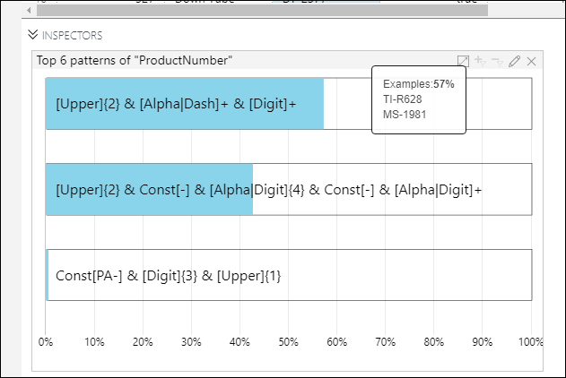

# Supported inspectors for the Azure Machine Learning data preparation preview

[!INCLUDE [workbench-deprecated](../../../includes/aml-deprecating-preview-2017.md)] 

This document outlines the set of inspectors that are available in this preview.

## The halo effect 
Some inspectors support the halo effect. This effect uses two different colors to immediately show the change visually from a transform. The gray represents the value prior to the latest transform, and the blue shows the current value. This effect can be enabled and disabled in options.

## Graphical filtering 
Some of the inspectors support the filtering of data by using the inspector as an editor. Using the inspector as an editor involves selecting graphical elements, and then using the toolbar in the upper-right part of the inspector window to filter in or out the selected values. 

## Column statistics
For numeric columns, this inspector provides a variety of different stats about the column. Statistics include the following measurements: 
- Minimum
- Lower quartile
- Median
- Upper quartile
- Maximum
- Average
- Standard deviation

### Options 
- None

## Histogram 
Computes and displays a histogram of a single numeric column. The default number of buckets is calculated using Scott’s Rule. However, the rule can be overridden via the options.

This Inspector supports the halo effect.

### Options
- Minimum number of buckets (applies even when default bucketing is checked)
- Default number of buckets (Scott's Rule) 
- Show halo
- Kernel density plot overlay (Gaussian kernel) 
- Use logarithmic scale

### Actions
This inspector supports filtering via buckets, which can include single or multi-select buckets. Apply filters as previously described.

## Value counts
This inspector presents a frequency table of values for the column that is currently selected. The default display is for the top six values. You can change the limit to any number, however. You can also set the display to count from the bottom instead of the top. This inspector supports the halo effect.

### Options 
- Number of top values
- Descending
- Include null/error values
- Show halo
- Use logarithmic scale

### Actions 
This inspector supports filtering via bars, which can include single or multi-select bars. Apply filters as previously described.

## Box plot 
A box whisker plot of a numeric column.

### Options 
- Group by column

## Scatter plot
A scatter plot for two numeric columns. The data is down-sampled for performance reasons. The sample size can be overridden in the options.

### Options  
- X-axis column
- Y-axis column
- Sample size
- Group by column

## Time series
A line graph with time awareness on the x-axis.

### Options
- Date column
- Numeric column
- Sample size

### Actions
This inspector supports filtering via a click-and-drag select method to select a range on the graph. After you complete selection, apply filters as previously described.

## Map 
A map with points that are plotted, assuming that latitude and longitude have been specified. Latitude must be selected first.

### Options
- Latitude column
- Longitude column
- Clustering on
- Group by column

### Actions
This inspector supports filtering via point selection on the map. Press the **Ctrl** key, and then click and drag with the mouse to form a square around the points. Then apply filters as previously described.

You can quickly size the map to show only the possible points by pressing the **E** on the left side of the map.

## Pattern Frequency 

This inspector shows a list of patterns in the selected String column. The patterns are represented using a regular expression like syntax. Hovering on the pattern shows the examples of values represented by that pattern. Along with the patterns, the approximate coverages in terms of percentage is also shown.

### Options
- Number of top values
- Descending
- Show halo

### Actions
This inspector supports filtering based on displayed patterns. Press the **Ctrl** key, and then select the filled bars in pattern inspector. Then apply filters as previously described. As a result of the user acion, an Advanced filter step is added. You can see and modify the generated Python code by invoking the edit option of the Advanced Filter step.
