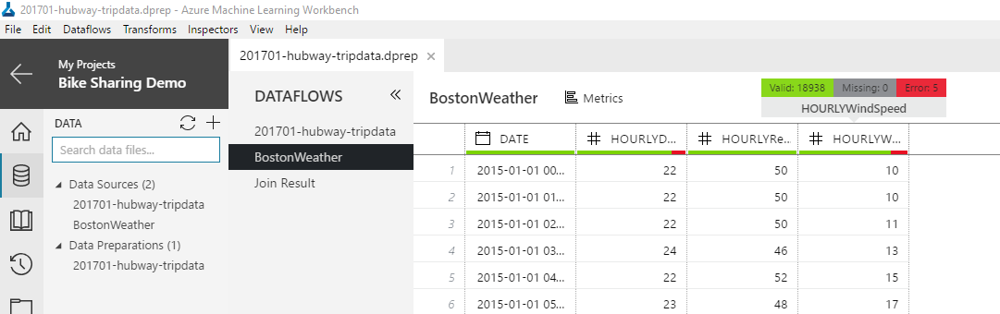
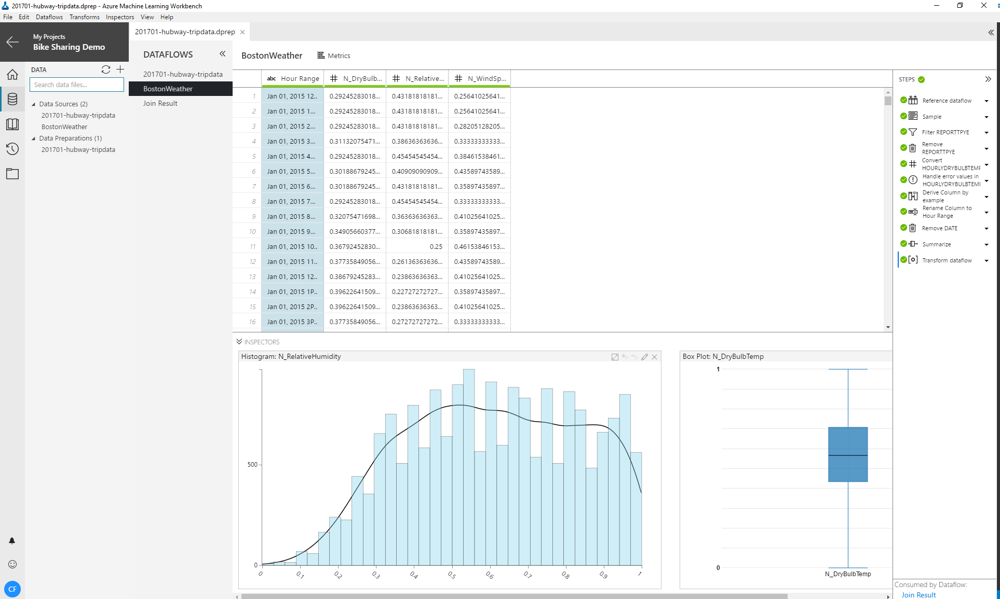
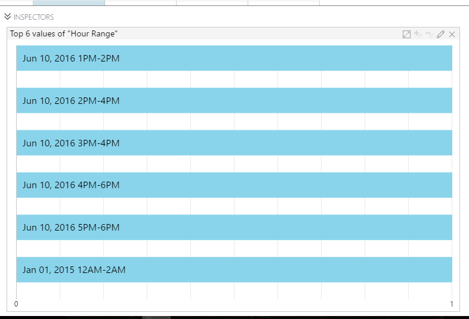
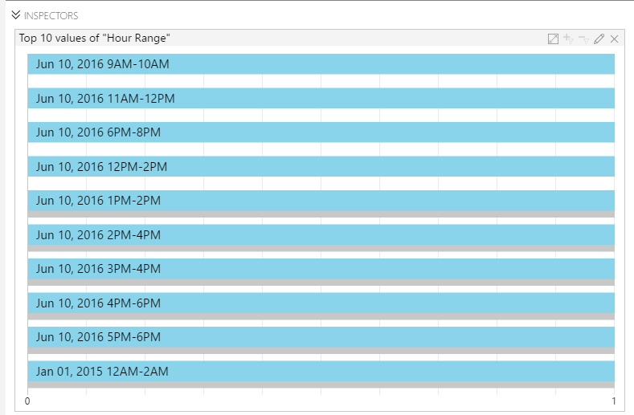

# Getting started with data preparation

[!INCLUDE [workbench-deprecated](../../../includes/aml-deprecating-preview-2017.md)] 

Welcome to the Data Preparation Getting Started Guide. 

Data Preparation provides a set of tools for efficiently exploring, understanding, and fixing problems in data. It allows you to consume data in many forms and transform that data into cleansed data that is better suited for downstream usage.

Data Preparation is installed as part of the Azure Machine Learning Workbench experience.  Use Data Preparation locally or deploy to a target cluster and cloud as a runtime or execution environment.

The design time runtime uses Python for extensibility and depends on various Python libraries such as Pandas. As with other components of Azure ML Workbench there is no need to install Python, it is installed for you. However if you need to install additional libraries these libraries need to be installed in the Azure ML Workbench Python directory not your usual Python directory. More details on how to install packages can be found [here](data-prep-python-extensibility-overview.md).

A project is required before you can use Data Prep, once that project is created you may prepare data. 

Navigate to the Data section of the project by selecting the Data icon  on the left of the screen.  Click "+" again to **Add a Data Source**. The Data Source Wizard should launch and adds a **Data Source** (.dsource) file to the project after completing the wizard. By default, the view of the data is the grid. Above the grid, it is also possible to select Metrics view. In Metrics view, summary statistics are shown.  After reviewing the summary statistics, click on **Prepare** at the top of the screen. [More information about the Data Source Wizard](data-source-wizard.md) 

## Building blocks of data preparation ##
### The Package ###

A Package is the primary container for your work. A Package is the artifact that is saved to and loaded from disk. While working inside the client, the Package is constantly AutoSaved in the background. 

The output/results of a Package can be explored in Python or via a Jupyter Notebook.

A Package can be executed across multiple runtimes including local Python, Spark (including in Docker), and HDInsight.

A Package contains one or more Dataflows that are the steps and transforms applied to the data.

A Package may use another Package as a Data Source (referred to as a Reference Data Flow).

### The dataflow ###
A Dataflow has a source and optional Transforms which are arranged through a series of Steps and optional destinations. Clicking on a Step re-executes all the sources and Transforms prior to and including the selected Step.  The transformed data through that step is shown within the grid. Steps can be added, moved, and deleted within a Dataflow through the Step List.

The Step List on the right side of the client can be opened and closed to provide more screen space.

Multiple Dataflows can exist in the UI at a time, each Dataflow is represented as a tab in the UI.

### The source
A source is where the data comes from, and the format it is in. A Data Prep Package always sources its data from another Data Flow(Data Source). It is this reference Data Flow that contains the information. Each source has a different user experience to allow it to be configured. The source produces a “rectangular”/tabular view of the data. If the source data originally has a “ragged right”, then the structure is normalized to be “rectangular.” [Appendix 2 provides the current list of supported sources](data-prep-appendix2-supported-data-sources.md).

### The transform ###
Transforms consume data in a given format, perform some operation on the data (such as changing the data type) and then produce data in the new format. Each Transform has its own UI and behavior(s). Chaining several Transforms together via Steps in the Dataflow is the core of Data Preparation functionality. [Appendix 3 provides the current list of supported Transforms](data-prep-appendix3-supported-transforms.md).

### The inspector ###

Inspectors are visualizations of the data and are available to improve understanding of the data.  Understanding the data and data quality issues helps you decide which actions (Transforms) should be taken. Some Inspectors support actions that generate Transforms. For example, the Value Count Inspector allows you to select a Value and then apply a filter to include that Value or to Exclude that Value. Inspectors can also provide context for Transforms. For example, selecting one or more columns changes the possible Transforms that can be applied.

A column may have multiple Inspectors at any point in time (for example, Column Statistics and a Histogram). There can also be instances of an Inspector across multiple columns. For example, all numeric columns could have Histograms at the same time.

Inspectors appear in the Profiling Well at the bottom of the screen.  Maximize inspectors to see them larger within the main content area. Think of the data grid as the default inspector. Any Inspector can be expanded into the main content area. Inspectors within the main content area minimize to the Profiling Well. Customize an Inspector by clicking on the pencil icon within the Inspector. Reorder Inspectors within the Well using drag and drop.

Some Inspectors support a “Halo” mode. This mode shows the value or state before the last Transform was applied. The old value is displayed in gray with the current value in the foreground and shows the impact of a Transform. [Appendix 4 provides the current list of supported Inspectors](data-prep-appendix4-supported-inspectors.md).

### The destination
 A Destination is where you write/export the data to after you have prepared it in a Dataflow. A given Dataflow can have multiple Destinations. Each Destination has a different user experience to allow it to be configured. The Destination consumes data in a “rectangular”/tabular format and writes it out to some location in a given format. [Appendix 5 provides the current list of supported Destinations](data-prep-appendix5-supported-destinations.md).

### Using data preparation ###
Data Preparation assumes a basic five-step methodology/approach to data preparation.

#### Step 1: Ingestion ####
Import data for Data Preparation by using the **Add Data Source** option within the project view.  All initial ingestion of data is handled through the Data Source Wizard.

#### Step 2: Understand/profile the data ####

First, look at the Data Quality Bar at the top of each column. Green represents the rows that have values. Gray represents rows with a missing value, null, etc. Red indicates error values. Hover over the bar to get a tool tip with the exact numbers of rows in each of the three buckets. The Data Quality Bar uses a logarithmic scale so always check the actual numbers to get a rough feel for the volume of missing data.

Next, use a combination of other Inspectors plus the grid to better understand data characteristics.  Start formulating hypotheses about the data preparation required for further analysis. Most inspectors work on a single column or a small number of columns.  

It’s likely that several Inspectors across several columns are needed to understand the data. You can scroll through various Inspectors in the Profiling Well. Within the well, you can also move Inspectors to the head of the list in order to see them in the immediately viewable area.

Different Inspectors are provided for continuous vs categorical variables/columns. The Inspector menu enables and disables options depending on the type of variables/columns you have.

When working with wide datasets that have many columns, a pragmatic approach of working with subsets is advisable. This approach includes focusing on a small number of columns (for example, 5-10), preparing them and then working through the remaining columns. The grid inspector supports vertical partitioning of columns and so if you have more than 300 columns then you need to "page" through them.
 

#### Step 3: Transform the data ####
Transforms change the data and allow the execution of the data to support the current working hypothesis. Transforms appear as Steps in the Step List on the right-hand side. It is possible to “time travel” through the Step List by clicking on any arbitrary point in the Step List.

A green icon to the left of a given Step indicates that it has run and the data reflects the execution of the Transform. A vertical bar to the left of the Step indicates the current state of the data in the Inspectors.

Try to make small frequent changes to the data and to validate (Step 4) after each change as the hypothesis evolves.

#### Step 4: Verify the impact of the transformation. 
Decide if the hypothesis was correct. If correct, then develop the next hypothesis and repeat steps 2-3 for the new one. If incorrect, then undo the last transformation and develop a new hypothesis and repeat steps 2-3.

The primary way to determine if the Transform had the right impact is to use the Inspectors. Use existing. Use Inspectors with the Halo effect enabled or launch multiple Inspectors to view the data at given points in time.

 

To undo a Transformation, go the Steps List on the right-hand side of the UI. (The Steps List panel may need to be popped back out. To open it, click the double chevron pointing left). In the panel, select the Transform that was executed that you wish to undo. Select the drop-down on the right-hand side of the UI block. Select either **Edit** to make changes or **Delete** to remove the Transform from the Steps List and the Dataflow.

#### Step 5: Output 
When finished with your data preparation, you can write the Dataflow to an output. A Dataflow can have many outputs. From the Transforms menu, you can select which output you want the dataset to be written as. You can also select the output's destination. 

## List of Appendices 
[Appendix 2 - Supported Data Sources](data-prep-appendix2-supported-data-sources.md)  
[Appendix 3 - Supported Transforms](data-prep-appendix3-supported-transforms.md)  
[Appendix 4 - Supported Inspectors](data-prep-appendix4-supported-inspectors.md)  
[Appendix 5 - Supported Destinations](data-prep-appendix5-supported-destinations.md)  
[Appendix 6 - Sample Filter Expressions in Python](data-prep-appendix6-sample-filter-expressions-python.md)  
[Appendix 7 - Sample Transform Dataflow Expressions in Python](data-prep-appendix7-sample-transform-data-flow-python.md)  
[Appendix 8 - Sample Data Sources in Python](data-prep-appendix8-sample-source-connections-python.md)  
[Appendix 9 - Sample Destination Connections in Python](data-prep-appendix9-sample-destination-connections-python.md)  
[Appendix 10 - Sample Column Transforms in Python](data-prep-appendix10-sample-custom-column-transforms-python.md)  

## See Also

[Advanced data preparation tutorial](tutorial-bikeshare-dataprep.md)