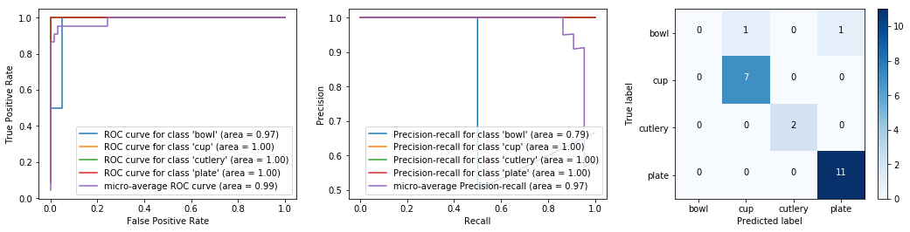
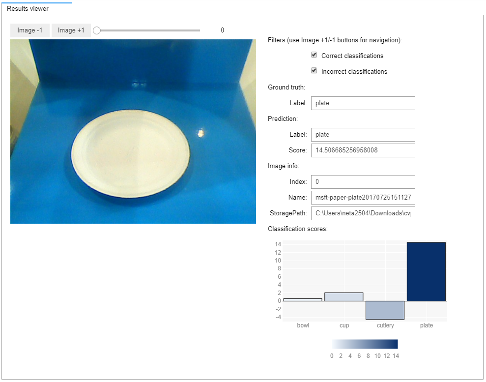

# Build and deploy image classification models with Azure Machine Learning

[!INCLUDE [workbench-deprecated](../../../includes/aml-deprecating-preview-2017.md)]

In this article, learn how to use Azure Machine Learning Package for Computer Vision (AMLPCV) to train, test, and deploy an image classification model. For an overview of this package and its detailed reference documentation, [see here](https://aka.ms/aml-packages/vision).

A large number of problems in the computer vision domain can be solved using image classification. These problems include building models that answer questions such as:
+ _Is an OBJECT present in the image? For example, "dog", "car", "ship", and so on_
+ _What class of eye disease severity is evinced by this patient's retinal scan?_

When building and deploying this model with AMLPCV, you go through the following steps:
1. Dataset Creation
2. Image Visualization and annotation
3. Image Augmentation
4. Deep Neural Network (DNN) Model Definition
5. Classifier Training
6. Evaluation and Visualization
7. Web service Deployment
8. Web service Load Testing

[CNTK](https://www.microsoft.com/cognitive-toolkit/) is used as the deep learning framework, training is performed locally on a GPU powered machine such as the ([Deep learning Data Science VM](https://azuremarketplace.microsoft.com/marketplace/apps/microsoft-ads.dsvm-deep-learning?tab=Overview)), and deployment uses the Azure ML Operationalization CLI.

## Prerequisites

1. If you don't have an Azure subscription, create a [free account](https://azure.microsoft.com/free/?WT.mc_id=A261C142F) before you begin.

1. The following accounts and application must be set up and installed:
   - An Azure Machine Learning Experimentation account 
   - An Azure Machine Learning Model Management account
   - Azure Machine Learning Workbench installed

   If these three are not yet created or installed, follow the [Azure Machine Learning Quickstart and Workbench installation](../desktop-workbench/quickstart-installation.md) article. 

1. The Azure Machine Learning Package for Computer Vision must be installed. Learn how to [install this package here](https://aka.ms/aml-packages/vision).

## Sample data and notebook

### Get the Jupyter notebook

Download the notebook to run the sample described here yourself.

> [!div class="nextstepaction"]
> [Get the Jupyter notebook](https://aka.ms/aml-packages/vision/notebooks/image_classification)

### Load the sample data

The following example uses a dataset consisting of 63 tableware images. Each image is labeled as belonging to one of four different classes (bowl, cup, cutlery, plate). The number of images in this example is small so that this sample can be executed quickly. In practice at least 100 images per class should be provided. All images are located at *"../sample_data/imgs_recycling/"*, in subdirectories called "bowl", "cup", "cutlery", and "plate".


```python
import warnings
warnings.filterwarnings("ignore")
import json, numpy as np, os, timeit 
from azureml.logging import get_azureml_logger
from imgaug import augmenters
from IPython.display import display
from sklearn import svm
from cvtk import ClassificationDataset, CNTKTLModel, Context, Splitter, StorageContext
from cvtk.augmentation import augment_dataset
from cvtk.core.classifier import ScikitClassifier
from cvtk.evaluation import ClassificationEvaluation, graph_roc_curve, graph_pr_curve, graph_confusion_matrix
import matplotlib.pyplot as plt

from classification.notebook.ui_utils.ui_annotation import AnnotationUI
from classification.notebook.ui_utils.ui_results_viewer import ResultsUI
from classification.notebook.ui_utils.ui_precision_recall import PrecisionRecallUI

%matplotlib inline

# Disable printing of logging messages
from azuremltkbase.logging import ToolkitLogger
ToolkitLogger.getInstance().setEnabled(False)
```


## Create a dataset

Once you have imported the dependencies and set the storage context, you can create the dataset object.

To create that object with Azure Machine Learning Package for Computer Vision, provide the root directory of the images on the local disk. This directory must follow the same general structure as the tableware dataset, that is, contain subdirectories with the actual images:
- root
    - label 1
    - label 2
    - ...
    - label n
  
Training an image classification model for a different dataset is as easy as changing the root path `dataset_location` in the following code to point at different images.


```python
# Root image directory
dataset_location = os.path.abspath("classification/sample_data/imgs_recycling")

dataset_name = 'recycling'
dataset = ClassificationDataset.create_from_dir(dataset_name, dataset_location)
print("Dataset consists of {} images with {} labels.".format(len(dataset.images), len(dataset.labels)))
print("Select information for image 2: name={}, label={}, unique id={}.".format(
    dataset.images[2].name, dataset.images[2]._labels[0].name, dataset.images[2]._storage_id))
```

    F1 2018-04-23 17:12:57,593 INFO azureml.vision:machine info {"is_dsvm": true, "os_type": "Windows"} 
    F1 2018-04-23 17:12:57,599 INFO azureml.vision:dataset creating dataset for scenario=classification 
    Dataset consists of 63 images with 4 labels.
    Select information for image 2: name=msft-plastic-bowl20170725152154282.jpg, label=bowl, unique id=3.

The dataset object provides functionality to download images using the [Bing Image Search API](https://azure.microsoft.com/services/cognitive-services/bing-image-search-api/). 

Two types of search queries are supported: 
+ Regular text queries
+ Image URL queries

These queries along with the class label must be provided inside a JSON-encoded text file. For example:

```json
{
	"bowl": [
					"plastic bowl",
					"../imgs_recycling/bowl"
	],
	"cup": [
					"plastic cup",
					"../imgs_recycling/cup",
					"http://cdnimg2.webstaurantstore.com/images/products/main/123662/268841/dart-solo-ultra-clear-conex-tp12-12-oz-pet-plastic-cold-cup-1000-case.jpg"
	],
	"cutlery": [
					"plastic cutlery",
					"../imgs_recycling/cutlery",
					"http://img4.foodservicewarehouse.com/Prd/1900SQ/Fineline_2514-BO.jpg"
	],
	"plate": [
					"plastic plate",
					"../imgs_recycling/plate"
	]
}
```

Furthermore, you must explicitly create a Context object to contain the Bing Image Search API key. This requires a Bing Image Search API subscription.

## Visualize and annotate images

You can visualize the images and correct labels in the dataset object using the following widget. 

If you encounter the "Widget Javascript not detected" error, run this command to solve it: 
<br>`jupyter nbextension enable --py --sys-prefix widgetsnbextension`


```python
annotation_ui = AnnotationUI(dataset, Context.get_global_context())
display(annotation_ui.ui)
```


## Augment images

The [`augmentation` module](https://docs.microsoft.com/python/api/cvtk.augmentation) provides functionality to augment a dataset object using all the transformations described in the [imgaug](https://github.com/aleju/imgaug) library. Image transformations can be grouped in a single pipeline, in which case all transformations in the pipeline are applied simultaneously each image. 

If you would like to apply different augmentation steps separately, or in any different manner, you can define multiple pipelines and pass them to the *augment_dataset* function. For more information and examples of image augmentation, see the [imgaug documentation](https://github.com/aleju/imgaug).

Adding augmented images to the training set is especially beneficial for small datasets. Since the DNN training process is slower due to the increased number of training images, we recommend you start experimentation without augmentation.


```python
# Split the dataset into train and test  
train_set_orig, test_set = dataset.split(train_size = 0.66, stratify = "label")
print("Number of training images = {}, test images = {}.".format(train_set_orig.size(), test_set.size()))
```

    F1 2018-04-23 17:13:01,780 INFO azureml.vision:splitter splitting a dataset 
    F1 2018-04-23 17:13:01,805 INFO azureml.vision:dataset creating dataset for scenario=classification 
    F1 2018-04-23 17:13:01,809 INFO azureml.vision:dataset creating dataset for scenario=classification 
    Number of training images = 41, test images = 22.
    


```python
augment_train_set = False

if augment_train_set:
    aug_sequence = augmenters.Sequential([
            augmenters.Fliplr(0.5),             # horizontally flip 50% of all images
            augmenters.Crop(percent=(0, 0.1)),  # crop images by 0-10% of their height/width
        ])
    train_set = augment_dataset(train_set_orig, [aug_sequence])
    print("Number of original training images = {}, with augmented images included = {}.".format(train_set_orig.size(), train_set.size()))
else:
    train_set = train_set_orig  
```

## Define DNN models

The following pretrained Deep Neural Network models are supported with this package: 
+ Resnet-18
+ Resnet-34
+ Resnet-50
+ Resnet-101
+ Resnet-152

These DNNs can be used either as classifier, or as featurizer. 

More information about the networks can be found [here](https://github.com/Microsoft/CNTK/blob/master/PretrainedModels/Image.md), and a basic introduction to Transfer Learning is [here](https://blog.slavv.com/a-gentle-intro-to-transfer-learning-2c0b674375a0).

The default image classification parameters for this package are 224x224 pixel resolution and a Resnet-18 DNN. These parameters were selected to work well on a wide variety of tasks. Accuracy can often be improved, for example, by increasing the image resolution to 500x500 pixels, and/or selecting a deeper model (Resnet-50). However, changing the parameters can come at a significant increase in training time. See the article on [How to improve accuracy](https://docs.microsoft.com/azure/machine-learning/service/how-to-improve-accuracy-for-computer-vision-models).


```python
# Default parameters (224 x 224 pixels resolution, Resnet-18)
lr_per_mb = [0.05]*7 + [0.005]*7 +  [0.0005]
mb_size = 32
input_resoluton = 224
base_model_name = "ResNet18_ImageNet_CNTK"

# Suggested parameters for 500 x 500 pixels resolution, Resnet-50
# (see in the Appendix "How to improve accuracy", last row in table)
# lr_per_mb   = [0.01] * 7 + [0.001] * 7 + [0.0001]
# mb_size    = 8
# input_resoluton = 500
# base_model_name = "ResNet50_ImageNet_CNTK"

# Initialize model
dnn_model = CNTKTLModel(train_set.labels,
                       base_model_name=base_model_name,
                       image_dims = (3, input_resoluton, input_resoluton))
```

    Successfully downloaded ResNet18_ImageNet_CNTK
    

## Train the classifier

You can choose one of the following methods for the pre-trained DNN.

  - **DNN refinement**, which trains the DNN to perform the classification directly. While DNN training is slow, it typically leads to the best results since all network weights can be improved during training to give best accuracy.

  - **DNN featurization**, which runs the DNN as-is to obtain a lower-dimensional representation of an image (512, 2048, or 4096 floats). That representation is then used as input to train a separate classifier. Since the DNN is kept unchanged, this approach is much faster compared to DNN refinement, however accuracy is not as good. Nevertheless, training an external classifier such as a linear SVM (as shown in the following code) can provide a strong baseline, and help with understanding the feasibility of a problem.
  
TensorBoard can be used to visualize the training progress. To activate TensorBoard:
1. Add the parameter `tensorboard_logdir=PATH` as shown in the following code
1. Start the TensorBoard client using the command `tensorboard --logdir=PATH` in a new console.
1. Open a web browser as instructed by TensorBoard, which by default is localhost:6006. 


```python
# Train either the DNN or a SVM as classifier 
classifier_name = "dnn"

if classifier_name.lower() == "dnn":  
    dnn_model.train(train_set, lr_per_mb = lr_per_mb, mb_size = mb_size, eval_dataset=test_set) #, tensorboard_logdir=r"tensorboard"
    classifier = dnn_model
elif classifier_name.lower() == "svm":
    learner = svm.LinearSVC(C=1.0, class_weight='balanced', verbose=0)
    classifier = ScikitClassifier(dnn_model, learner = learner)
    classifier.train(train_set)
else:
    raise Exception("Classifier unknown: " + classifier)   
```

    F1 2018-04-23 17:13:28,238 INFO azureml.vision:Fit starting in experiment  1541466320 
    F1 2018-04-23 17:13:28,239 INFO azureml.vision:model starting training for scenario=classification 
    <class 'int'>
    1 worker
    Training transfer learning model for 15 epochs (epoch_size = 41).
    non-distributed mode
    Training 15741700 parameters in 53 parameter tensors.
    Training 15741700 parameters in 53 parameter tensors.
    Learning rate per minibatch: 0.05
    Momentum per minibatch: 0.9
    PROGRESS: 0.00%
    Finished Epoch[1 of 15]: [Training] loss = 2.820586 * 41, metric = 68.29% * 41 5.738s (  7.1 samples/s);
    Evaluation Set Error :: 29.27%
    Finished Epoch[2 of 15]: [Training] loss = 0.286728 * 41, metric = 9.76% * 41 0.752s ( 54.5 samples/s);
    Evaluation Set Error :: 34.15%
    Finished Epoch[3 of 15]: [Training] loss = 0.206938 * 41, metric = 4.88% * 41 0.688s ( 59.6 samples/s);
    Evaluation Set Error :: 41.46%
    Finished Epoch[4 of 15]: [Training] loss = 0.098931 * 41, metric = 2.44% * 41 0.785s ( 52.2 samples/s);
    Evaluation Set Error :: 48.78%
    Finished Epoch[5 of 15]: [Training] loss = 0.046547 * 41, metric = 0.00% * 41 0.724s ( 56.6 samples/s);
    Evaluation Set Error :: 43.90%
    Finished Epoch[6 of 15]: [Training] loss = 0.059709 * 41, metric = 4.88% * 41 0.636s ( 64.5 samples/s);
    Evaluation Set Error :: 34.15%
    Finished Epoch[7 of 15]: [Training] loss = 0.005817 * 41, metric = 0.00% * 41 0.710s ( 57.7 samples/s);
    Evaluation Set Error :: 14.63%
    Learning rate per minibatch: 0.005
    Finished Epoch[8 of 15]: [Training] loss = 0.014917 * 41, metric = 0.00% * 41 0.649s ( 63.2 samples/s);
    Evaluation Set Error :: 9.76%
    Finished Epoch[9 of 15]: [Training] loss = 0.040539 * 41, metric = 2.44% * 41 0.777s ( 52.8 samples/s);
    Evaluation Set Error :: 9.76%
    Finished Epoch[10 of 15]: [Training] loss = 0.024606 * 41, metric = 0.00% * 41 0.626s ( 65.5 samples/s);
    Evaluation Set Error :: 7.32%
    PROGRESS: 0.00%
    Finished Epoch[11 of 15]: [Training] loss = 0.004225 * 41, metric = 0.00% * 41 0.656s ( 62.5 samples/s);
    Evaluation Set Error :: 4.88%
    Finished Epoch[12 of 15]: [Training] loss = 0.004364 * 41, metric = 0.00% * 41 0.702s ( 58.4 samples/s);
    Evaluation Set Error :: 4.88%
    Finished Epoch[13 of 15]: [Training] loss = 0.007974 * 41, metric = 0.00% * 41 0.721s ( 56.9 samples/s);
    Evaluation Set Error :: 4.88%
    Finished Epoch[14 of 15]: [Training] loss = 0.000655 * 41, metric = 0.00% * 41 0.711s ( 57.7 samples/s);
    Evaluation Set Error :: 4.88%
    Learning rate per minibatch: 0.0005
    Finished Epoch[15 of 15]: [Training] loss = 0.024865 * 41, metric = 0.00% * 41 0.688s ( 59.6 samples/s);
    Evaluation Set Error :: 4.88%
    Stored trained model at ../../../cvtk_output\model_trained\ImageClassification.model
    F1 2018-04-23 17:13:45,097 INFO azureml.vision:Fit finished in experiment  1541466320 
    


```python
# Plot how the training and test accuracy increases during gradient descent. 
if classifier_name == "dnn":
    [train_accs, test_accs, epoch_numbers] = classifier.train_eval_accs
    plt.xlabel("Number of training epochs") 
    plt.ylabel("Classification accuracy") 
    train_plot = plt.plot(epoch_numbers, train_accs, 'r-', label = "Training accuracy")
    test_plot = plt.plot(epoch_numbers, test_accs, 'b-.', label = "Test accuracy")
    plt.legend()
```


## Evaluate and visualize model performance

You can evaluate the performance of the trained model on an independent test dataset using the evaluation module. Some of the evaluation metrics it computes include:
 
+ Accuracy (by default class-averaged)
+ PR curve
+ ROC curve
+ Area-under-curve
+ Confusion matrix


```python
# Run the classifier on all test set images
ce = ClassificationEvaluation(classifier, test_set, minibatch_size = mb_size)

# Compute Accuracy and the confusion matrix
acc = ce.compute_accuracy()
print("Accuracy = {:2.2f}%".format(100*acc))
cm  = ce.compute_confusion_matrix()
print("Confusion matrix = \n{}".format(cm))

# Show PR curve, ROC curve, and confusion matrix
fig, ((ax1, ax2, ax3)) = plt.subplots(1,3)
fig.set_size_inches(18, 4)
graph_roc_curve(ce, ax=ax1)
graph_pr_curve(ce, ax=ax2)
graph_confusion_matrix(ce, ax=ax3)
plt.show()
```

    F1 2018-04-23 17:14:37,449 INFO azureml.vision:evaluation doing evaluation for scenario=classification 
    F1 2018-04-23 17:14:37,450 INFO azureml.vision:model scoring dataset for scenario=classification 
    Accuracy = 95.45%
    Confusion matrix = 
    [[ 0  1  0  1]
     [ 0  7  0  0]
     [ 0  0  2  0]
     [ 0  0  0 11]]
    





```python
# Results viewer UI
labels = [l.name for l in dataset.labels] 
pred_scores = ce.scores #classification scores for all images and all classes
pred_labels = [labels[i] for i in np.argmax(pred_scores, axis=1)]

results_ui = ResultsUI(test_set, Context.get_global_context(), pred_scores, pred_labels)
display(results_ui.ui)
```




```python
# Precision / recall curve UI
precisions, recalls, thresholds = ce.compute_precision_recall_curve() 
thresholds = list(thresholds)
thresholds.append(thresholds[-1])
pr_ui = PrecisionRecallUI(100*precisions[::-1], 100*recalls[::-1], thresholds[::-1])
display(pr_ui.ui) 
```


## Operationalization: deploy and consume

Operationalization is the process of publishing models and code as web services and the consumption of these services to produce business results. 

Once your model is trained, you can deploy that model as a web service for consumption using [Azure Machine Learning CLI](https://docs.microsoft.com/azure/machine-learning/desktop-workbench/cli-for-azure-machine-learning). Your models can be deployed to your local machine or Azure Container Service (ACS) cluster. Using ACS, you can scale your web service manually or use the autoscaling functionality.

**Sign in with Azure CLI**

Using an [Azure](https://azure.microsoft.com/) account with a valid subscription, log in using the following CLI command:
<br>`az login`

+ To switch to another Azure subscription, use the command:
<br>`az account set --subscription [your subscription name]`

+ To see the current model management account, use the command:
  <br>`az ml account modelmanagement show`

**Create and set your cluster deployment environment**

You only need to set your deployment environment once. If you don't have one yet, set up your deployment environment now using [these instructions](https://docs.microsoft.com/azure/machine-learning/desktop-workbench/deployment-setup-configuration#environment-setup). 

To see your active deployment environment, use the following CLI command:
<br>`az ml env show`
   
Sample Azure CLI command to create and set deployment environment

```CLI
az provider register -n Microsoft.MachineLearningCompute
az provider register -n Microsoft.ContainerRegistry
az provider register -n Microsoft.ContainerService
az ml env setup --cluster -n [your environment name] -l [Azure region e.g. westcentralus] [-g [resource group]]
az ml env set -n [environment name] -g [resource group]
az ml env cluster
```
    
### Manage web services and deployments

The following APIs can be used to deploy models as web services, manage those web services, and manage deployments.

|Task|API|
|----|----|
|Create deployment object|`deploy_obj = AMLDeployment(deployment_name=deployment_name, associated_DNNModel=dnn_model, aml_env="cluster")`
|Deploy web service|`deploy_obj.deploy()`|
|Score image|`deploy_obj.score_image(local_image_path_or_image_url)`|
|Delete web service|`deploy_obj.delete()`|
|Build docker image without web service|`deploy_obj.build_docker_image()`|
|List existing deployment|`AMLDeployment.list_deployment()`|
|Delete if the service exists with the deployment name|`AMLDeployment.delete_if_service_exist(deployment_name)`|

**API documentation:** Consult the [package reference documentation](https://aka.ms/aml-packages/vision) for the detailed reference for each module and class.

**CLI reference:** For more advanced operations related to deployment, refer to the [model management CLI reference](https://docs.microsoft.com/azure/machine-learning/desktop-workbench/model-management-cli-reference).

**Deployment management in Azure portal**: You can track and manage your deployments in the [Azure portal](https://ms.portal.azure.com/). From the Azure portal, find your Machine Learning Model Management account page using its name. Then go to the Model Management account page > Model Management > Services.


```python
# ##### OPTIONAL###### 
# Interactive CLI setup helper, including model management account and deployment environment.
# If you haven't setup you CLI before or if you want to change you CLI settings, you can use this block to help you interactively.
#
# UNCOMMENT THE FOLLOWING LINES IF YOU HAVE NOT CREATED OR SET THE MODEL MANAGEMENT ACCOUNT AND DEPLOYMENT ENVIRONMENT
#
# from azuremltkbase.deployment import CliSetup
# CliSetup().run()
```


```python
# # Optional. Persist your model on disk and reuse it later for deployment. 
# from cvtk import TFFasterRCNN, Context
# import os
# save_model_path = os.path.join(Context.get_global_context().storage.persistent_path, "saved_classifier.model")
# # Save model to disk
# dnn_model.serialize(save_model_path)
# # Load model from disk
# dnn_model = CNTKTLModel.deserialize(save_model_path)
```


```python
from cvtk.operationalization import AMLDeployment

# set deployment name
deployment_name = "wsdeployment"

# Optional Azure Machine Learning deployment cluster name (environment name) and resource group name
# If you don't provide here. It will use the current deployment environment (you can check with CLI command "az ml env show").
azureml_rscgroup = "<resource group>"
cluster_name = "<cluster name>"

# If you provide the cluster information, it will use the provided cluster to deploy. 
# Example: deploy_obj = AMLDeployment(deployment_name=deployment_name, associated_DNNModel=dnn_model,
#                            aml_env="cluster", cluster_name=cluster_name, resource_group=azureml_rscgroup, replicas=1)

# Create deployment object
deploy_obj = AMLDeployment(deployment_name=deployment_name, aml_env="cluster", associated_DNNModel=dnn_model, replicas=1)

# Check if the deployment name exists, if yes remove it first.
if deploy_obj.is_existing_service():
    AMLDeployment.delete_if_service_exist(deployment_name)
    
# Create the web service
print("Deploying to Azure cluster...")
deploy_obj.deploy()
print("Deployment DONE")
```

### Consume the web service 

Once you deploy the model as a web service, you can score images with the web service using one of these methods:

- Score the web service directly with the deployment object using `deploy_obj.score_image(image_path_or_url)`

- Use the Service endpoint URL and Service key (None for local deployment) with: `AMLDeployment.score_existing_service_with_image(image_path_or_url, service_endpoint_url, service_key=None)`

- Form your HTTP requests directly to score the web service endpoint. This option is for advanced users.

### Score with existing deployment object

```
deploy_obj.score_image(image_path_or_url)
```


```python
# Score with existing deployment object

# Score local image with file path
print("Score local image with file path")
image_path_or_url = test_set.images[0].storage_path
print("Image source:",image_path_or_url)
serialized_result_in_json = deploy_obj.score_image(image_path_or_url, image_resize_dims=[224,224])
print("serialized_result_in_json:", serialized_result_in_json)

# Score image url and remove image resizing
print("Score image url")
image_path_or_url = "https://cvtkdata.blob.core.windows.net/publicimages/microsoft_logo.jpg"
print("Image source:",image_path_or_url)
serialized_result_in_json = deploy_obj.score_image(image_path_or_url)
print("serialized_result_in_json:", serialized_result_in_json)

# Score image url with added paramters. Add softmax to score.
print("Score image url with added paramters. Add softmax to score")
from cvtk.utils.constants import ClassificationRESTApiParamters
image_path_or_url = "https://cvtkdata.blob.core.windows.net/publicimages/microsoft_logo.jpg"
print("Image source:",image_path_or_url)
serialized_result_in_json = deploy_obj.score_image(image_path_or_url, image_resize_dims=[224,224], parameters={ClassificationRESTApiParamters.ADD_SOFTMAX:True})
print("serialized_result_in_json:", serialized_result_in_json)
```


```python
# Time image scoring
import timeit

for img_index, img_obj in enumerate(test_set.images[:10]):
    print("Calling API for image {} of {}: {}...".format(img_index, len(test_set.images), img_obj.name))
    tic = timeit.default_timer()
    return_json = deploy_obj.score_image(img_obj.storage_path, image_resize_dims=[224,224])
    print("   Time for API call: {:.2f} seconds".format(timeit.default_timer() - tic))
    print(return_json)
```

### Score with service endpoint url and service key

`AMLDeployment.score_existing_service_with_image(image_path_or_url, service_endpoint_url, service_key=None)`

```python
# Import related classes and functions
from cvtk.operationalization import AMLDeployment

service_endpoint_url = "" # please replace with your own service url
service_key = "" # please replace with your own service key
# score local image with file path
image_path_or_url = test_set.images[0].storage_path
print("Image source:",image_path_or_url)
serialized_result_in_json = AMLDeployment.score_existing_service_with_image(image_path_or_url,service_endpoint_url, service_key = service_key)
print("serialized_result_in_json:", serialized_result_in_json)

# score image url
image_path_or_url = "https://cvtkdata.blob.core.windows.net/publicimages/microsoft_logo.jpg"
print("Image source:",image_path_or_url)
serialized_result_in_json = AMLDeployment.score_existing_service_with_image(image_path_or_url,service_endpoint_url, service_key = service_key, image_resize_dims=[224,224])
print("serialized_result_in_json:", serialized_result_in_json)
```

### Score endpoint with http request directly

The following example code forms the HTTP request directly in Python. However, you can do it in other programming languages.


```python
def score_image_list_with_http(images, service_endpoint_url, service_key=None, parameters={}):
    """Score image list with http request

    Args:
        images(list): list of (input image file path, base64 image string, url or buffer)
        service_endpoint_url(str): endpoint url
        service_key(str): service key, None for local deployment.
        parameters(dict): service additional paramters in dictionary


    Returns:
        result (list): list of serialized result 
    """
    import requests
    from io import BytesIO
    import base64
    routing_id = ""

    if service_key is None:
        headers = {'Content-Type': 'application/json',
                   'X-Marathon-App-Id': routing_id}
    else:
        headers = {'Content-Type': 'application/json',
                   "Authorization": ('Bearer ' + service_key), 'X-Marathon-App-Id': routing_id}
    payload = []
    for image in images:
        encoded = None
        # read image
        with open(image,'rb') as f:
            image_buffer = BytesIO(f.read()) ## Getting an image file represented as a BytesIO object
        # convert your image to base64 string
        encoded = base64.b64encode(image_buffer.getvalue())
        image_request = {"image_in_base64": "{0}".format(encoded), "parameters": parameters}
        payload.append(image_request)
    body = json.dumps(payload)
    r = requests.post(service_endpoint_url, data=body, headers=headers)
    try:
        result = json.loads(r.text)
    except:
        raise ValueError("Incorrect output format. Result cant not be parsed: " + r.text)
    return result

# Test with images
images = [test_set.images[0].storage_path, test_set.images[1].storage_path] # A list of local image files
score_image_list_with_http(images, service_endpoint_url, service_key)
```

### Parse serialized result from web service

The output from the web service is a JSON string. You can parse this JSON string with different DNN model classes.


```python
image_path_or_url = test_set.images[0].storage_path
print("Image source:",image_path_or_url)
serialized_result_in_json = deploy_obj.score_image(image_path_or_url, image_resize_dims=[224,224])
print("serialized_result_in_json:", serialized_result_in_json)
```


```python
# Parse result from json string
import numpy as np
parsed_result = CNTKTLModel.parse_serialized_result(serialized_result_in_json)
print("Parsed result:", parsed_result)
# Map result to image class
class_index = np.argmax(np.array(parsed_result))
print("Class index:", class_index)
dnn_model.class_map
print("Class label:", dnn_model.class_map[class_index])
```


## Next steps

Learn more about Azure Machine Learning Package for Computer Vision in these articles:

+ Learn how to [improve the accuracy of this model](how-to-improve-accuracy-for-computer-vision-models.md).

+ Read the [package overview](https://aka.ms/aml-packages/vision).

+ Explore the [reference documentation](https://docs.microsoft.com/python/api/overview/azure-machine-learning/computer-vision) for this package.

+ Learn about [other Python packages for Azure Machine Learning](reference-python-package-overview.md).
