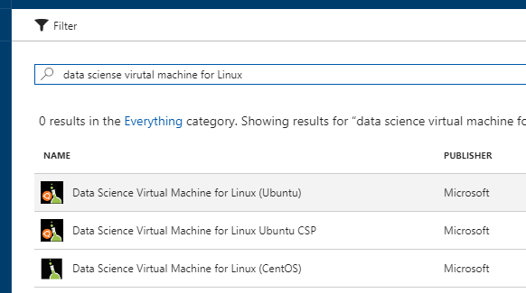
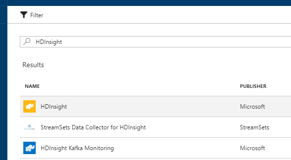
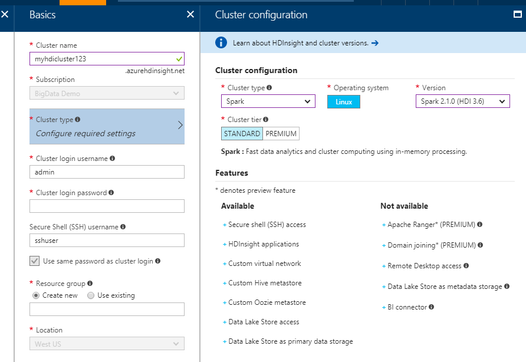

# Create DSVM and HDI Spark cluster as compute targets

[!INCLUDE [workbench-deprecated](../../../includes/aml-deprecating-preview-2017.md)]

You can easily scale up or scale out your machine learning experiment by adding additional compute targets such as Ubuntu-based DSVM (Data Science Virtual Machine), and Apache Spark for Azure HDInsight cluster. This article walks you through the steps of creating these compute targets in Azure. For more information on Azure ML compute targets, refer to [overview of Azure Machine Learning experimentation service](experimentation-service-configuration.md).

>[!NOTE]
>You need to ensure you have proper permissions to create resources such as VM and HDI clusters in Azure before you proceed. Also both of these resources can consume many compute cores depending on your configuration. Make sure your subscription has enough capacity for the virtual CPU cores. You can always get in touch with Azure support to increase the maximum number of cores allowed in your subscription.

## Create an Ubuntu DSVM in Azure portal

You can create a DSVM from Azure portal. 

1. Log on to Azure portal from https://portal.azure.com
2. Click on the **+NEW** link, and search for "data science virtual machine for Linux".
    
4. Choose **Data Science Virtual Machine for Linux (Ubuntu)** in the list, and follow the on-screen instructions to create the DSVM.

>[!IMPORTANT]
>Make sure you choose **Password** as the _Authentication type_.


## Create an Ubuntu DSVM using azure-cli

You can also use an Azure resource management template to deploy a DSVM.

>[!NOTE]
>All following commands are assumed to be issued from the root folder of an Azure ML project.

First, create a `mydsvm.json` file using your favorite text editor in the `docs` folder. (If you don't have a `docs` folder in the project root folder, create one.) We use this file to configure some basic parameters for the Azure resource management template. 

Copy and paste the following JSON snippet into the `mydsvm.json` file, and fill in the appropriate values:

```json
{
  "$schema": "https://schema.management.azure.com/schemas/2015-01-01/deploymentParameters.json#",
  "contentVersion": "1.0.0.0",
  "parameters": {
     "adminUsername": { "value" : "<admin username>"},
     "adminPassword": { "value" : "<admin password>"},
     "vmName": { "value" : "<vm name>"},
     "vmSize": { "value" : "<vm size>"}
  }
}
```

For the _vmSize_ field, you can use any suppported VM size listed in the [Ubuntu DSVM Azure resource management template](https://github.com/Azure/DataScienceVM/blob/master/Scripts/CreateDSVM/Ubuntu/multiazuredeploywithext.json). We recommend you use one of the below sizes as compute targets for Azure ML. 


>[!TIP]
> For [deep learning workloads](how-to-use-gpu.md) you can deploy to GPU powered VMs.

- [General Purpose VMs](../../virtual-machines/linux/sizes-general.md)
  - Standard_DS2_v2 
  - Standard_DS3_v2 
  - Standard_DS4_v2 
  - Standard_DS12_v2 
  - Standard_DS13_v2 
  - Standard_DS14_v2 
- [GPU powered VMs](../../virtual-machines/linux/sizes-gpu.md)
  - Standard_NC6 
  - Standard_NC12 
  - Standard_NC24 
 

Read more about these [sizes for Linux virtual machines in Azure](../../virtual-machines/linux/sizes.md) and their [pricing information](https://azure.microsoft.com/pricing/details/virtual-machines/linux/).

Launch CLI Window from the Azure ML Workbench app by clicking on **File** --> **Open Command Prompt**, or **Open PowerShell** menu item. 

>[!NOTE]
>You can also do this in any command-line environment where you have az-cli installed.

In the command-line window, enter the below commands:

```azurecli
# first make sure you have a valid Azure authentication token
$ az account get-access-token

# if you don't have a valid token, please log in to Azure first. 
# if you already do, you can skip this step.
$ az login

# list all subscriptions you have access to
$ az account list -o table

# make sure you set the subscription you want to use to create DSVM as the current subscription
$ az account set -s <subscription name or Id>

# it is always a good idea to create a resource group for the VM and associated resources to live in.
# you can use any Azure region, but it is best to create them in the region where your Azure ML Experimentation account is, e.g. eastus2, westcentralus or australiaeast.
# also, only certain Azure regions has GPU-equipped VMs available.
$ az group create -n <resource group name> -l <azure region>

# now let's create the DSVM based on the JSON configuration file you created earlier.
# note we assume the mydsvm.json config file is placed in the "docs" sub-folder.
$ az group deployment create -g <resource group name> --template-uri https://raw.githubusercontent.com/Azure/DataScienceVM/master/Scripts/CreateDSVM/Ubuntu/azuredeploy.json --parameters @docs/mydsvm.json

# find the FQDN (fully qualified domain name) of the VM just created. 
# you can also use IP address from the next command if FQDN is not set.
$ az vm show -g <resource group name> -n <vm name> --query "fqdns"

# find the IP address of the VM just created
$ az vm show -g <resource group name> -n <vm name> --query "publicIps"
```
## Attach a DSVM compute target
Once the DSVM is created, you can now attach it to your Azure ML project.

```azurecli
# attach the DSVM compute target
# it is a good idea to use FQDN in case the IP address changes after you deallocate the VM and restart it
$ az ml computetarget attach remotedocker --name <compute target name> --address <ip address or FQDN> --username <admin username> --password <admin password> 

# prepare the Docker image on the DSVM 
$ az ml experiment prepare -c <compute target name>
```
Now you should be ready to run experiments on this DSVM.

## Deallocate a DSVM and restart it later
When you finish the compute tasks from Azure ML, you can deallocate the DSVM. This action shuts down the VM, releases the compute resources, but it preserves the virtual disks. You are not charged for the compute cost when the VM is deallocated.

To deallocate a VM:

```azurecli
$ az vm deallocate -g <resource group name> -n <vm name>
```

To bring the VM back to life, use the `az ml start` command:

```azurecli
$ az vm start -g <resource group name> -n <vm name>
```

## Expand the DSVM OS disk
The Ubuntu DSVM comes with a 50GB OS disk and 100GB data disk. Docker stores its images on the data disk, as more space is available there. When used as compute target for Azure ML, this disk can be used up by Docker engine pulling down Docker images and building conda layers on top of it. You might need to expand the disk to a larger size (such as 200 GB) to avoid the "disk full" error while you are in the middle of an execution. Reference [How to expand virtual hard disks on a Linux VM with the Azure CLI](../../virtual-machines/linux/expand-disks.md) to learn how to do this easily from azure-cli. 

## Create an Apache Spark for Azure HDInsight cluster in Azure portal

To run scale-out Spark jobs, you need to create an Apache Spark for Azure HDInsight cluster in Azure portal.

1. Log on to Azure portal from https://portal.azure.com
2. Click on the **+NEW** link, and search for "HDInsight".

    
    
3. Choose **HDInsight** in the list, and then click on the **Create** button.
4. In the **Basics** configuration screen, **Cluster type** settings, make sure you choose **Spark** as the _Cluster type_, **Linux** as the _Operating system_, and **Spark 2.1.0 (HDI 3.6)** as the _Version.

    

    >[!IMPORTANT]
    >Notice in the above screen the cluster has a _Cluster login username_ field and a _Secure Shell (SSH) username_ field. These are two different user identities, even though for convenience you can specify the same password for both logins. The _Cluster login username_ is used to log in to the management web UI of the HDI cluster. The _SSH login username_ is used to log in to the head node of the cluster, and this is what's needed for Azure ML to dispatch Spark jobs.

5. Choose the cluster size and node size you need and finish the creation wizard. It can take up to 30 minutes for the cluster to finish provisioning. 

## Attach an HDI Spark cluster compute target

Once the Spark HDI cluster is created, you can now attach it to your Azure ML project.

```azurecli
# attach the HDI compute target
$ az ml computetarget attach cluster --name <compute target name> --address <cluster name, such as myhdicluster123.azurehdinsight.net> --username <ssh username> --password <ssh password> 

# prepare the conda environment on HDI
$ az ml experiment prepare -c <compute target name>
```
Now you should be ready to run experiments on this Spark cluster.

## Next steps

Learn more about:
- [Overview of Azure Machine Learning experimentation service](experimentation-service-configuration.md)
- [Azure Machine Learning Workbench experimentation service configuration files](experimentation-service-configuration-reference.md)
- [Apache Spark for Azure HDInsight cluster](https://azure.microsoft.com/services/hdinsight/apache-spark/)
- [Data Science Virtual Machine](https://azure.microsoft.com/services/virtual-machines/data-science-virtual-machines/)
