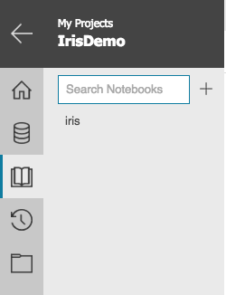
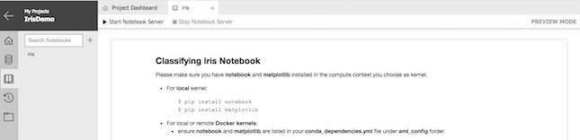
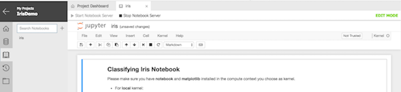
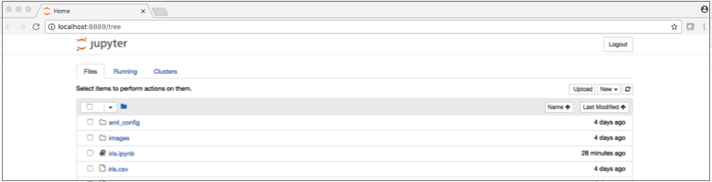
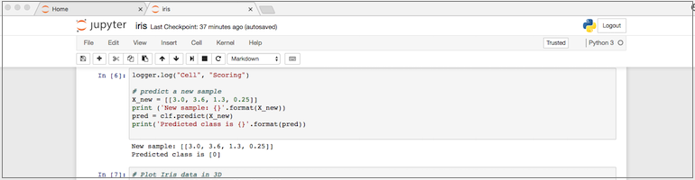

# Use Jupyter Notebooks in Azure Machine Learning Workbench

[!INCLUDE [workbench-deprecated](../../../includes/aml-deprecating-preview-2017.md)]


Azure Machine Learning Workbench supports interactive data science experimentation through its integration with Jupyter Notebooks. This article describes how to make effective use of this feature to increase the rate and quality of your interactive data science experimentation.

## Prerequisites
- [Create Azure Machine Learning accounts and install Azure Machine Learning Workbench](quickstart-installation.md).
- Be familiar with the [Jupyter Notebook](http://jupyter.org/). This article is not about learning how to use Jupyter.

## Jupyter Notebook architecture
At a high level, Jupyter Notebook architecture includes three components. Each can run in different compute environments:

- **Client**: Receives user input and displays rendered output.
- **Server**: Web server that hosts the notebook files (.ipynb files).
- **Kernel**: Runtime environment in which execution of the notebook cells happens.

For more information, see the official [Jupyter documentation](http://jupyter.readthedocs.io/en/latest/architecture/how_jupyter_ipython_work.html). The following diagram depicts how this client, server, and kernel architecture maps to the components in Azure Machine Learning:


## Kernels in Azure Machine Learning Workbench notebooks
You can access different kernels in Azure Machine Learning Workbench by defining run configurations and compute targets in the `aml_config` folder in your project. Adding a new compute target by issuing the `az ml computetarget attach` command is the equivalent of adding a new kernel.

>[!NOTE]
>Review [Configuring Azure Machine Learning Experimentation Service](experimentation-service-configuration.md) for more details on run configurations and compute targets.

### Kernel naming convention
Azure Machine Learning Workbench generates custom Jupyter kernels. These kernels are named *\<project name> \<run config name>*. For example, if you have a run configuration named _docker-python_ in a project named _myIris_,  Azure Machine Learning makes available a kernel named *myIris docker-python.* You set the running kernel in the Jupyter Notebook **Kernel** menu, in the **Change kernel** submenu. The name of the running kernel appears on the far right of the menu bar.
 
Currently, Azure Machine Learning Workbench supports the following types of kernels.

### Local Python kernel
This Python kernel supports execution on local machines. It's integrated with Azure Machine Learning Run History support. The name of the kernel is typically *my_project_name local.*

>[!NOTE]
>Do not use the Python 3 kernel. It is a standalone kernel provided by Jupyter by default and is not integrated with Azure Machine Learning capabilities. For example, the `%azureml` Jupyter magic functions return "not found" errors. 

### Python kernel in Docker (local or remote)
This Python kernel runs in a Docker container either on your local machine or in a remote Linux virtual machine (VM). The name of the kernel is typically *my_project docker.* The associated `docker.runconfig` file has the `Framework` field set to `Python`.

### PySpark kernel in Docker (local or remote)
This PySpark kernel executes scripts in a Spark context running inside a Docker container, either on your local machine or on a remote Linux VM. The kernel name is typically *my_project docker.* The associated `docker.runconfig` file has the `Framework` field set to `PySpark`.

### PySpark kernel in an Azure HDInsight cluster
This kernel runs in the remote Azure HDInsight cluster that you attached as a compute target for your project. The kernel name is typically *my_project my_hdi.* 

>[!IMPORTANT]
>In the `.compute` file for the HDI compute target, you must change the `yarnDeployMode` field to `client` (the default value is `cluster`) to use this kernel. 

## Start a Jupyter server from Azure Machine Learning Workbench
From Azure Machine Learning Workbench, you can access notebooks via the **Notebooks** tab. The _Classifying Iris_ sample project includes an `iris.ipynb` sample notebook.



When you open a notebook in Azure Machine Learning Workbench, it's displayed in its own document tab in **Preview Mode**. This is a read-only view that doesn't require a running Jupyter server and kernel.



Selecting the **Start Notebook Server** button starts the Jupyter server and switches the notebook into **Edit Mode**. The familiar Jupyter Notebook user interface appears embedded in Workbench. You can now set a kernel from the **Kernel**  menu and start your interactive notebook session. 

>[!NOTE]
>With non-local kernels, it can take a minute or two to start if you're using it for the first time. You can execute the `az ml experiment prepare` command from the CLI window to prepare the compute target so the kernel starts much faster after the compute target is prepared.



This is a fully interactive Jupyter Notebook experience. All regular notebook operations and keyboard shortcuts are supported from this window, except for some file operations that can be done via the Workbench **Notebooks** tab and **File** tab.

## Start a Jupyter server from the command line
You can also start a notebook session by issuing `az ml notebook start` from the command-line window:
```
$ az ml notebook start
[I 10:14:25.455 NotebookApp] The port 8888 is already in use, trying another port.
[I 10:14:25.464 NotebookApp] Serving notebooks from local directory: /Users/johnpelak/Desktop/IrisDemo
[I 10:14:25.465 NotebookApp] 0 active kernels 
[I 10:14:25.465 NotebookApp] The Jupyter Notebook is running at: http://localhost:8889/?token=1f0161ab88b22fc83f2083a93879ec5e8d0ec18490f0b953
[I 10:14:25.465 NotebookApp] Use Control-C to stop this server and shut down all kernels (twice to skip confirmation).
[C 10:14:25.466 NotebookApp] 
    
Copy and paste this URL into your browser when you connect for the first time, to login with a token: http://localhost:8889/?token=1f0161ab88b22fc83f2083a93879ec5e8d0ec18490f0b953
[I 10:14:25.759 NotebookApp] Accepting one-time-token-authenticated connection from ::1
[I 10:16:52.970 NotebookApp] Kernel started: 7f8932e0-89b9-48b4-b5d0-e8f48d1da159
[I 10:16:53.854 NotebookApp] Adapting to protocol v5.1 for kernel 7f8932e0-89b9-48b4-b5d0-e8f48d1da159
```
Your default browser automatically opens with the Jupyter server pointing to the project home directory. You can also use the URL and token displayed in the CLI window to open other browser windows locally. 



You can now select an `.ipynb` notebook file, open it, set the kernel (if it hasn't been set), and start your interactive session.



## Use magic commands to manage experiments

You can use [magic commands](http://ipython.readthedocs.io/en/stable/interactive/magics.html) within your notebook cells to track your run history and save outputs such as models or datasets.

To track individual notebook cell runs, use the `%azureml history on` magic command. After you turn on the history, each cell run appears as an entry in the run history:

```
%azureml history on
from azureml.logging import get_azureml_logger
logger = get_azureml_logger()
logger.log("Cell","Load Data")
```

To turn off cell run tracking, use the `%azureml history off` magic command.

You can use the `%azureml upload` magic command to save model and data files from your run. The saved objects appear as outputs in the run history view:

```
modelpath = os.path.join("outputs","model.pkl")
with open(modelpath,"wb") as f:
    pickle.dump(model,f)
%azureml upload outputs/model.pkl
```

>[!NOTE]
>The outputs must be saved to a folder named *outputs.*

## Next steps
- To learn how to use Jupyter Notebook, see the [Jupyter official documentation](http://jupyter-notebook.readthedocs.io/en/latest/).    
- To gain a deeper understanding of the Azure Machine Learning experimentation execution environment, see [Configuring Azure Machine Learning Experimentation Service](experimentation-service-configuration.md).

