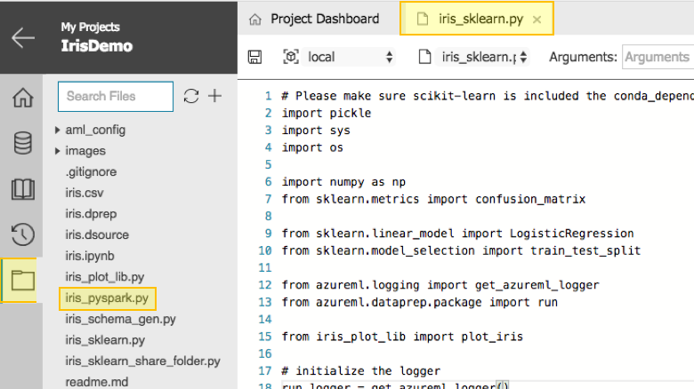
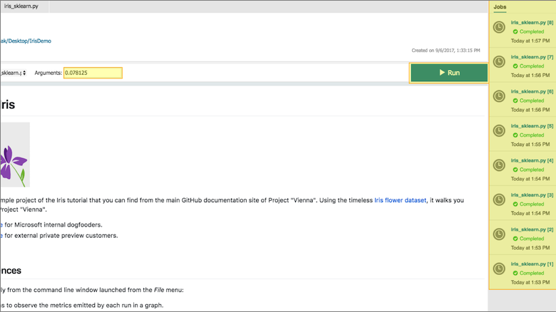
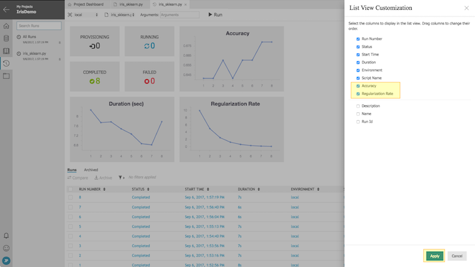
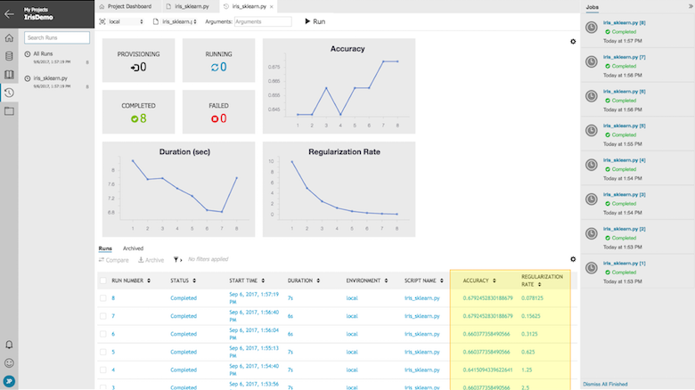
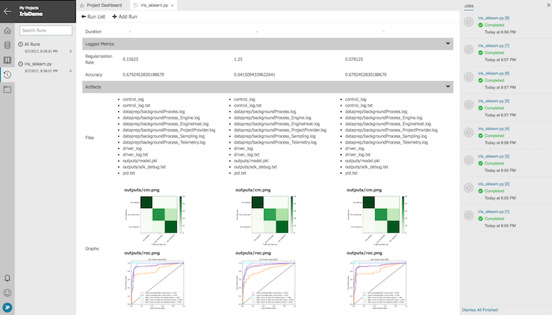
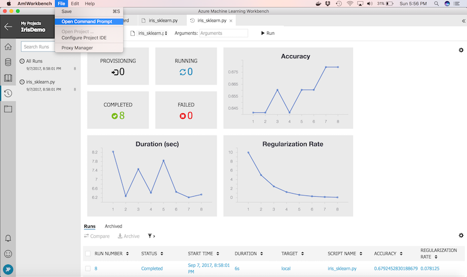

# How to Use Run History and Model Metrics in Azure Machine Learning Workbench

[!INCLUDE [workbench-deprecated](../../../includes/aml-deprecating-preview-2017.md)] 


Azure Machine Learning Workbench supports data science experimentation via its **Run History** and **Model Metrics** features.
**Run History** provides a means to track the outputs of your machine learning experiments, and then enables filtering and comparison of their results.
**Model Metrics** can be logged from any point of your scripts, tracking whatever values are most important in your data science experiments.
This article describes how to make effective use of these features to increase the rate and the quality of your data science experimentation.

## Prerequisites
To step through this how-to guide, you need to:
* [Create and Install Azure Machine Learning](quickstart-installation.md)
- [Create a Project](quickstart-installation.md)


## Azure ML Logging API Overview
The [Azure ML Logging API](reference-logging-api.md) is available via the **azureml.logging** module in Python (which is installed with the Azure ML Workbench.)
After importing this module, you can use the **get_azureml_logger** method to instantiate a **logger** object.
Then, you can use the logger's **log** method to store key/value pairs produced by your Python scripts.
Currently, logging model metrics of scalar and list types are supported as shown.

```Python
# create a logger instance in already set up environment 
from azureml.logging import get_azureml_logger
logger = get_azureml_logger()

# log scalar (any integer or floating point type is fine)
logger.log("simple value", 7)


# log list
logger.log("all values", [5, 6, 7])
```
It is easy to use the logger within your Azure ML Workbench projects, and this article shows you how to do so.

## Create a Project in Azure ML Workbench
If you don't already have a project, you can create one from the [Create and Install Quickstart](quickstart-installation.md)
From the **Project Dashboard**, you can open the **iris_sklearn.py** script (as shown.)



You can use this script as a guide for expected implementation of model metric logging in Azure ML.

## Parameterize and Log Model Metrics from Script
In the **iris_sklearn.py** script, the expected pattern to import and construct the logger in Python can be reduced to the following lines of code.

```Python
from azureml.logging import get_azureml_logger
run_logger = get_azureml_logger()
```

Once created, you can invoke the **log** method with any name/value pair.

When development is complete, it is often useful to parameterize scripts so that values can be passed in via the command line.
The sample below shows how to accept command-line parameters (when present) using standard Python libraries.
This script takes a single parameter for the Regularization Rate (*reg*) used to fit a classification model in an effort to increase *accuracy* without overfitting.
These variables are then logged as *Regularization Rate* and *Accuracy* so that the model with optimal results can be easily identified.

```Python
# change regularization rate and you will likely get a different accuracy.
reg = 0.01
# load regularization rate from argument if present
if len(sys.argv) > 1:
    reg = float(sys.argv[1])

print("Regularization rate is {}".format(reg))

# log the regularization rate
run_logger.log("Regularization Rate", reg)

# train a logistic regression model on the training set
clf1 = LogisticRegression(C=1/reg).fit(X_train, Y_train)
print (clf1)

# evaluate the test set
accuracy = clf1.score(X_test, Y_test)
print ("Accuracy is {}".format(accuracy))

# log accuracy
run_logger.log("Accuracy", accuracy)
```

Taking these steps in your scripts enable them to make optimal usage of **Run History**.

## Launch Runs from Project Dashboard
Returning to the **Project Dashboard**, you can launch a **tracked run** by selecting the **iris_sklearn.py** script and entering the **regularization rate** parameter in the **Arguments** edit box.


Since launching tracked runs does not block Azure ML Workbench, several can be launched in parallel.
The status of each tracked run is visible in the **Jobs Panel** as shown.



This enables optimal resource utilization without requiring each job to run in serial.

## View Results in Run History
Progress and results of tracked runs are available for analysis in Azure ML Workbench's **Run History**.
**Run History** provides three distinct views:
- Dashboard
- Details
- Comparison

The **Dashboard** view displays data across all runs of a given script, rendered in both graphical, and tabular forms.
The **Details** view displays all data generated from a specific run of a given script, including logged metrics and output files (such as rendered plots.)
The **Comparison** view enables results of two or three runs to be viewed side-by-side, also including logged metrics and output files.

Across eight tracked runs of **iris_sklearn.py**, values for the **regularization rate** parameter and **accuracy** result were logged to illustrate how to use the Run History views.

### Run History Dashboard
The results of all eight runs are visible in the **Run History Dashboard**.
As **iris_sklearn.py** logs *Regularization Rate* and *Accuracy*, the **Run History Dashboard** displays charts for these values by default.


The **Run History Dashboard** can be customized so that logged values also appear in the grid.  Clicking the **customize** icon displays the **List View Customization** dialogue as shown.



Any values logged during tracked runs are available for display, and selecting **Regularization Rate** and **Accuracy** adds them to the grid.



It is easy to find interesting runs by hovering over points in the charts.  In this case, Run 7 yielded a good accuracy coupled with a low duration.


Clicking a point associated with Run 7 in any chart or the link to Run 7 in the grid displays the **Run History Details**.

### Run History Details
From this view, full results of the Run 7 along with any artifacts produced by Run 7 are displayed.


The **Run History Details** view also provides the capability to **download** any files written to the **./outputs** folder (these files are backed by Azure ML Workbench's cloud storage for Run History, which is the subject of another article.)

Finally, **Run History Details** provides a means to restore your project its state at the time of this run.
Clicking the **Restore** button displays a confirmation dialogue as shown.


If confirmed, files may be overwritten or removed, so use this feature carefully.

### Run History Comparison
Selecting two or three runs in the **Run History Dashboard** and clicking **Compare** brings you to the **Run History Comparison** view.
Alternatively, clicking **Compare** and selecting a run within the **Run History Details** view also brings you to the **Run History Comparison** view.
In either case, the **Run History Comparison** view provides a means to see the logged results and artifacts of two or three runs side by side.



This view is especially useful for comparison of plots, but in general, any properties of runs can be compared here.

### Command Line Interface
Azure Machine Learning Workbench also provides access to Run History through its **Command Line Interface**.
To access the **Command Line Interface**, click the **Open Command Prompt** menu as shown.



The commands available for Run History are accessed via `az ml history`, with online help available by adding the `-h` flag.
```
$ az ml history -h

Group
    az ml history: View run history of machine learning experiments.

Commands:
    compare : Compare two runs.
    download: Download all the artifacts from a run into the destination path.
    info    : Details about one run.
    last    : Get detail about most recent run.
    list    : List runs.
    promote : Promote Artifacts.
```
These commands provide the same features and return the same data shown the **Run History Views**.
For example, the results of last run can be displayed as a JSON object.
```
$ az ml history last
{
  "Accuracy": 0.6792452830188679,
  "Regularization Rate": 0.078125,
  "attachments": "control_log, control_log.txt, driver_log, driver_log.txt, pid.txt, dataprep/backgroundProcess.log, dataprep/backgroundProcess_Engine.log, dataprep/backgroundProcess_EngineHost.log, dataprep/backgroundProcess_ProjectProvider.log, dataprep/backgroundProcess_Sampling.log, dataprep/backgroundProcess_Telemetry.log, outputs/cm.png, outputs/model.pkl, outputs/sdk_debug.txt, outputs/roc.png",
  "created_utc": "2017-09-08T00:58:01.611105+00:00",
  "description": null,
  "duration": "0:00:04.892389",
  "end_time_utc": "2017-09-08T00:58:07.951403+00:00",
  "experiment_id": "ce92d0a9-3e2c-4d51-85de-93ef22249ce1",
  "heartbeat_enabled": true,
  "hidden": false,
  "name": null,
  "parent_run_id": null,
  "properties": {
    "CommitId": "e77a5f0df2af1a482bbe39b70bfbb16b62228cb3"
  },
  "run_id": "IrisDemo_1504832281116",
  "run_number": 8,
  "script_name": "iris_sklearn.py",
  "start_time_utc": "2017-09-08T00:58:03.059014+00:00",
  "status": "Completed",
  "target": "local",
  "user_id": "e9fafe06-b0e4-4154-8374-aae34f9977b2"
}
```
Also, the list of all runs can be displayed in a tabular format.
```
$ az ml history list -o table
  Accuracy    Regularization Rate  Duration        Run_id                  Script_name      Start_time_utc                    Status
----------  ---------------------  --------------  ----------------------  ---------------  --------------------------------  ---------
  0.679245               0.078125  0:00:04.892389  IrisDemo_1504832281116  iris_sklearn.py  2017-09-08T00:58:03.059014+00:00  Completed
  0.679245               0.15625   0:00:04.734956  IrisDemo_1504832255198  iris_sklearn.py  2017-09-08T00:57:38.507196+00:00  Completed
  0.660377               0.3125    0:00:04.913762  IrisDemo_1504832234904  iris_sklearn.py  2017-09-08T00:57:16.849881+00:00  Completed
  0.660377               0.625     0:00:06.107764  IrisDemo_1504832210767  iris_sklearn.py  2017-09-08T00:56:54.602813+00:00  Completed
  0.641509               1.25      0:00:04.742727  IrisDemo_1504832171373  iris_sklearn.py  2017-09-08T00:56:13.879280+00:00  Completed
  0.660377               2.5       0:00:04.915401  IrisDemo_1504832148526  iris_sklearn.py  2017-09-08T00:55:52.937083+00:00  Completed
  0.641509               5         0:00:04.730627  IrisDemo_1504832127172  iris_sklearn.py  2017-09-08T00:55:29.612382+00:00  Completed
  0.641509              10         0:00:06.059082  IrisDemo_1504832109906  iris_sklearn.py  2017-09-08T00:55:14.739806+00:00  Completed

```
The **Command Line Interface** is an alternative pathway to access the power of Azure Machine Learning Workbench.

## Next Steps
These features are available to assist with the process of data science experimentation.
We hope that you find them to be useful, and would greatly appreciate your feedback.
This is just our initial implementation, and we have a great deal of enhancements planned.
We look forward to continuously delivering them to the Azure Machine Learning Workbench. 
