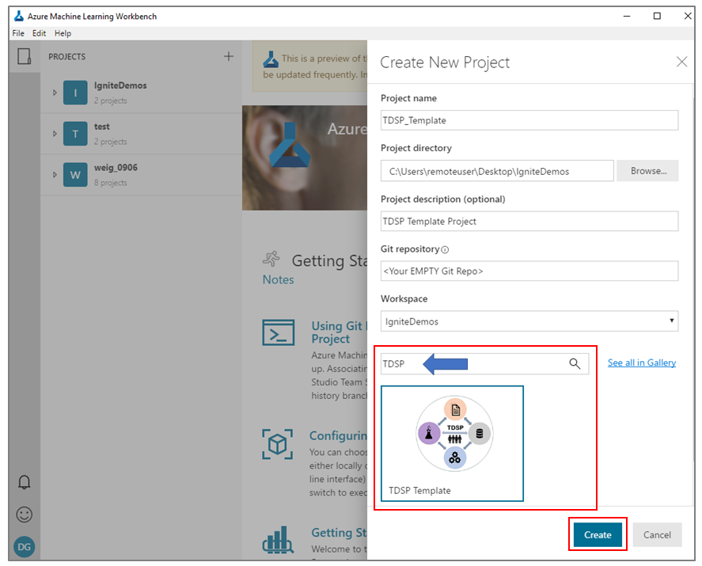

# Structure projects with the Team Data Science Process template

This document provides instructions on how to create data science projects in an earlier version of Azure Machine Learning using Team Data Science Process (TDSP) templates. These templates help to structure projects for collaboration and reproducibility. 

[!INCLUDE [workbench-deprecated](../../../includes/aml-deprecating-preview-2017.md)] 

## What is the Team Data Science Process?
The TDSP is an agile, iterative, data science process for executing and delivering advanced analytics solutions. It's designed to improve the collaboration and efficiency of data science teams in enterprise organizations. It supports these objectives with four key components:

   * A standard [data science lifecycle](../team-data-science-process/lifecycle.md) definition.
   * A standardized project structure, [project documentation, and reporting templates](https://github.com/Azure/Azure-TDSP-ProjectTemplate).
   * An infrastructure and resources for project execution, such as, respectively, a compute and storage infrastructure and code repositories.
   * [Tools and utilities](https://github.com/Azure/Azure-TDSP-Utilities) for data science project tasks, such as:
      - Collaborative version control
      - Code review
      - Data exploration and modeling
      - Work planning

For a more complete discussion of the TDSP, see the [Team Data Science Process overview](../team-data-science-process/overview.md).

## Why should you use the TDSP structure and templates?
Standardization of the structure, lifecycle, and documentation of data science projects is key to facilitating effective collaboration on data science teams. Create machine learning projects with the TDSP template to provide such a framework for coordinated teamwork.

We previously released a [GitHub repository for the TDSP project structure and templates](https://github.com/Azure/Azure-TDSP-ProjectTemplate) to help achieve these objectives. But it was not possible, until now, to instantiate the TDSP structure and templates within a data science tool. It's now possible to create a machine learning project that instantiates the TDSP structure and documentation templates. 

## Things to note before creating a new project
Review the following items *before* you create a new project:
* Review the TDSP Machine Learning [template](https://aka.ms/tdspamlgithubrepo).
* The contents (other than what is already present in the "docs" folder) are required to be less than 25 MB in size. See the note that follows this list.
* The sample\_data folder is only for small data files (less than 5 MB) with which you can test your code or start early development.
* Storing files, such as Word and PowerPoint files, can increase the size of the "docs" folder substantially. We advise that you to find a collaborative Wiki, [SharePoint](https://products.office.com/sharepoint/collaboration), or other collaborative resource to store such files.
* To learn how to handle large files and outputs in Machine Learning, read [Persisting changes and dealing with large files](http://aka.ms/aml-largefiles).

> [!NOTE]
> All documentation-related content (text, markdowns, images, and other document files) that is *not* used during project execution, other than the readme.md file, must reside in the folder named "docs" (all lowercase). The "docs" folder is a special folder ignored by Machine Learning execution so that the contents in this folder don't get copied to compute targets unnecessarily. Objects in this folder also don’t count toward the 25 MB cap for the project size. The "docs" folder, for example, is the place to store large image files needed in your documentation. These files are still tracked by Git through the run history. 

## Instantiate the TDSP structure and templates from the Machine Learning template gallery
To create a new project with the TDSP structure and documentation templates, complete the following procedures.

### Create a new project
To create a new project, open Azure Machine Learning. Under **Projects** on the top-left pane, select the plus sign (**+**), and then select **New Project**.

### Create a new TDSP-structured project
   1. Specify the parameters and information in the relevant box or list:

      - Project name
      - Project directory
      - Project description
      - An empty Git repository path
      - Workspace name

   2. Then in the **Search** box, enter **TDSP**. 
   3. When the **Structure a project with TDSP** option appears, select that template. 
   4. Select the **Create** button to create your new project with a TDSP structure. If you provide an empty Git repository when you create the project (in the appropriate text box), then that repository will populate with the project structure and contents after creation of the project.

## Examine the TDSP project structure
After your new project has been created, you can examine its structure (see the left panel in the following figure). It contains all the aspects of standardized documentation for business understanding. These items include the stages of the TDSP lifecycle, data location, definitions, and the architecture of this documentation template. 

The structure shown is derived from the TDSP structure that is published in [TDSP project structure, documents, and artifact templates](https://github.com/Azure/Azure-TDSP-ProjectTemplate), with some modifications. For example, several of the document templates are merged into one markdown, namely, [ProjectReport](https://aka.ms/tdspamlgithubrepoprojectreport). 

### Project folder structure
The TDSP project template contains the following top-level folders:
   - **code**: Contains code.
   - **docs**: Contains necessary documentation about the project (for example, markdown files and related media).
   - **sample_data**: Contains **SAMPLE (small)** data that you can use for early development or testing. Typically, these sets are not larger than several (5) MB. This folder is not for full or large data sets.

## Use the TDSP structure and templates
You need to add project-specific information to the structure and templates. You're expected to populate these with the code and the information necessary to execute and deliver your project. The [ProjectReport](https://aka.ms/tdspamlgithubrepoprojectreport) file is a template that you need to modify with information relevant to your project. It comes with a set of questions that help you fill out the information for each of the four stages of the [TDSP lifecycle](../team-data-science-process/lifecycle.md).

An example of what a project structure looks like during execution or after completion is shown in the left panel in the following figure. This project is from the [Team Data Science Process sample project: Classify incomes from US census data in Azure Machine Learning](https://github.com/Azure/MachineLearningSamples-TDSPUCIAdultIncome) sample project.

## Document your project
Refer to the [TDSP documentation templates](https://github.com/Azure/Azure-TDSP-ProjectTemplate) for information on how to document your project. In the current Machine Learning TDSP documentation template, we recommend that you include all the information in the [ProjectReport](https://aka.ms/tdspamlgithubrepoprojectreport) file. This template should be filled out with information that is specific to your project. 

We also provide a [ProjectLearnings](https://aka.ms/tdspamlgithubrepoprojectlearnings) template. You can use this template to include any information that is not included in the primary project document, but that is still useful to document. 

### Example project report
You can get an [example project report](https://github.com/Azure/MachineLearningSamples-TDSPUCIAdultIncome/blob/master/docs/deliverable_docs/ProjectReport.md). This project report for the [US income classification sample project](https://github.com/Azure/MachineLearningSamples-TDSPUCIAdultIncome) shows how to instantiate and use the TDSP template for a data science project.

## Next steps
To facilitate your understanding on how to use the TDSP structure and templates in Machine Learning projects, we provide several completed project examples in the documentation for Machine Learning:

- For a sample that shows how to create a TDSP project in Machine Learning, see [Team Data Science Process sample project: Classify incomes from US Census data in Azure Machine Learning](https://github.com/Azure/MachineLearningSamples-TDSPUCIAdultIncome).
- For a sample that uses deep learning in natural language processing (NLP) in a TDSP-instantiated project in Machine Learning, see [Bio-medical entity recognition using natural language processing with deep learning](https://github.com/Azure/MachineLearningSamples-BiomedicalEntityExtraction).

