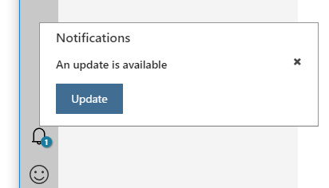

# Azure Machine Learning Workbench - Known Issues And Troubleshooting Guide 
This article helps you find and correct errors or failures encountered as a part of using the Azure Machine Learning Workbench application. 

## Find the Workbench build number
When communicating with the support team, it is important to include the build number of the Workbench app. On Windows, you can find out the build number by clicking on the **Help** menu and choose **About Azure ML Workbench**. On macOS, you can click on the **Azure ML Workbench** menu and choose **About Azure ML Workbench**.

## Machine Learning MSDN Forum
We have an MSDN Forum that you can post questions. The product team monitors the forum actively. 
The forum URL is [https://aka.ms/aml-forum-service](https://aka.ms/aml-forum-service). 

## Gather diagnostics information
Sometimes it can be helpful if you can provide diagnostic information when asking for help. Here is where the log files live:

### Installer log
If you run into issue during installation, the installer log files are here:

```
# Windows:
%TEMP%\amlinstaller\logs\*

# macOS:
/tmp/amlinstaller/logs/*
```
You can zip up the contents of these directories and send it to us for diagnostics.

### Workbench desktop app log
If you have trouble logging in, or if the Workbench desktop crashes, you can find log files here:
```
# Windows
%APPDATA%\AmlWorkbench

# macOS
~/Library/Application Support/AmlWorkbench
``` 
You can zip up the contents of these directories and send it to us for diagnostics.

### Experiment execution log
If a particular script fails during submission from the desktop app, try to resubmit it through CLI using `az ml experiment submit` command. This should give you full error message in JSON format, and most importantly it contains an **operation ID** value. Send us the JSON file including the **operation ID** and we can help diagnose. 

If a particular script succeeds in submission but fails in execution, it should print out the **Run ID** to identify that particular run. You can package up the relevant log files using the following command:

```azurecli
# Create a ZIP file that contains all the diagnostics information
$ az ml experiment diagnostics -r <run_id> -t <target_name>
```

The `az ml experiment diagnostics` command generates a `diagnostics.zip` file in the project root folder. The ZIP package contains the entire project folder in the state at the time it was executed, plus logging information. Be sure to remove any sensitive information you don't want to include before sending us the diagnostics file.

## Send us a frown (or a smile)

When you are working in Azure ML Workbench, you can also send us a frown (or a smile) by clicking on the smiley face icon at the lower left corner of the application shell. You can optionally choose to include your email address (so we can get back to you), and/or a screenshot of the current state. 

## Known service limits
- Max allowed project folder size: 25 MB.
    >[!NOTE]
    >This limit doesn't apply to `.git`, `docs` and `outputs` folders. These folder names are case-sensitive. If you are working with large files, refer to [Persisting Changes and Deal with Large Files](how-to-read-write-files.md).

- Max allowed experiment execution time: seven days

- Max size of tracked file in `outputs` folder after a run: 512 MB
  - This means if your script produces a file larger than 512 MB in the outputs folder, it is not collected there. If you are working with large files, refer to [Persisting Changes and Deal with Large Files](how-to-read-write-files.md).

- SSH keys are not supported when connecting to a remote machine or Spark cluster over SSH. Only username/password mode is currently supported.

- When using HDInsight cluster as compute target, it must use Azure blob as primary storage. Using Azure Data Lake Storage is not supported.

- Text clustering transforms are not supported on Mac.

- RevoScalePy library is only supported on Windows and Linux (in Docker containers). It is not supported on macOS.

- Jupyter Notebooks have a max size limit of 5 MB when opening them from the Workbench app. You can open large notebooks from CLI using 'az ml notebook start' command, and clean cell outputs to reduce the file size.

## Can't update Workbench
When a new update is available, the Workbench app homepage displays a message informing you about the new update. You should see an update badge appearing on the lower left corner of the app on the bell icon. Click on the badge and follow the installer wizard to install the update. 



If you don't see the notification, try to restart the app. If you still don't see the update notification after restart, there might be a few causes.

### You are launching Workbench from a pinned shortcut on the task bar
You may have already installed the update. But your pinned shortcut is still pointing to the old bits on disk. You can verify this by browsing to the `%localappdata%/AmlWorkbench` folder and see if you have latest version installed there, and examine the property of the pinned shortcut to see where it is pointing to. If verified, simply remove the old shortcut, launch Workbench from Start menu, and optionally create a new pinned shortcut on the task bar.

### You installed Workbench using the "install Azure ML Workbench" link on a Windows DSVM
Unfortunately there is no easy fix on this one. You have to perform the following steps to remove the installed bits, and download the latest installer to fresh-install the Workbench: 
   - remove the folder `C:\Users\<Username>\AppData\Local\amlworkbench`
   - remove script `C:\dsvm\tools\setup\InstallAMLFromLocal.ps1`
   - remove desktop shortcut that launches the above script
   - download the installer https://aka.ms/azureml-wb-msi and reinstall.

## Stuck at "Checking experimentation account" screen after logging in
After logging in, the Workbench app might get stuck on a blank screen with a message showing "Checking experimentation account" with a spinning wheel. To resolve this issue, take the following steps:
1. Shutdown the app
2. Delete the following file:
  ```
  # on Windows
  %appdata%\AmlWorkbench\AmlWb.settings

  # on macOS
  ~/Library/Application Support/AmlWorkbench/AmlWb.settings
  ```
3. Restart the app.

## Can't delete Experimentation Account
You can use CLI to delete an Experimentation Account, but you must delete the child workspaces and the child projects within those child workspaces first. Otherwise, you see the error "Can not delete resource before nested resources are deleted."

```azure-cli
# delete a project
$ az ml project delete -g <resource group name> -a <experimentation account name> -w <workspace name> -n <project name>

# delete a workspace 
$ az ml workspace delete -g <resource group name> -a <experimentation account name> -n <workspace name>

# delete an experimentation account
$ az ml account experimentation delete -g <resource group name> -n <experimentation account name>
```

You can also delete the projects and workspaces from within the Workbench app.

## Can't open file if project is in OneDrive
If you have Windows 10 Fall Creators Update, and your project is created in a local folder mapped to OneDrive, you might find that you cannot open any file in Workbench. This is due to a bug introduced by the Fall Creators Update that causes node.js code to fail in a OneDrive folder. The bug will be fixed soon by Windows update, but until then, please do not create projects in a OneDrive folder.

## File name too long on Windows
If you use Workbench on Windows, you might run into the default maximum 260-character file name length limit, which could surface as a "system cannot find the path specified" error. You can modify a registry key setting to allow much longer file path name. Review [this article](https://msdn.microsoft.com/library/windows/desktop/aa365247%28v=vs.85%29.aspx?#maxpath) for more details on how to set the _MAX_PATH_ registry key.

## Interrupt CLI execution output
If you kick off an experimentation run using `az ml experiment submit` or `az ml notebook start` and you'd like to interrupt the output: 
- On Windows use Ctrl-Break key combination from the keyboard
- On macOS, use Ctrl-C.

Please note that this only interrupts the output stream in the CLI window. It does not actually stop a job that's being executed. If you want to cancel an ongoing job, use `az ml experiment cancel -r <run_id> -t <target name>` command.

On Windows computers with keyboards that do not have Break key, possible alternatives include Fn-B, Ctrl-Fn-B or Fn+Esc. Consult your hardware vendor's documentation for a specific key combination.

## Docker error "read: connection refused"
When executing against a local Docker container, sometimes you might see the following error: 
```
Get https://registry-1.docker.io/v2/: 
dial tcp: 
lookup registry-1.docker.io on [::1]:53: read udp [::1]:49385->[::1]:53: 
read: connection refused
```

You can fix it by changing the Docker DNS Server from `automatic` to a fixed value of `8.8.8.8`.

## Remove VM execution error "no tty present"
When executing against a Docker container on a remote Linux machine, you might encounter the following error message:
```
sudo: no tty present and no askpass program specified.
``` 
This can happen if you use Azure portal to change the root password of an Ubuntu Linux VM. 

Azure Machine Learning Workbench requires password-less sudoers access to run on remote hosts. The simplest way to do that is to use _visudo_ to edit the following file (you may create the file if it does not exist):

```
$ sudo visudo -f /etc/sudoers
```

>[!IMPORTANT]
>It is important to edit the file with _visudo_ and not another command. _visudo_ automatically syntax checks all sudo config files, and failure to produce a syntactically correct sudoers file can lock you out of sudo.

Insert the following line at the end of the file:

```
username ALL=(ALL) NOPASSWD:ALL
```

Where _username_ is the name of Azure Machine Learning Workbench will use to log in to your remote host.

The line must be placed after #includedir "/etc/sudoers.d", otherwise it may be overridden by another rule.

If you have a more complicated sudo configuration, you may want to consult sudo documentation for Ubuntu available here: https://help.ubuntu.com/community/Sudoers

The above error can also happen if you are not using an Ubuntu-based Linux VM in Azure as an execution target. We only support Ubuntu-based Linux VM for remote execution. 

## VM disk is full
By default when you create a new Linux VM in Azure, you get a 30-GB disk for the operating system. Docker engine by default uses the same disk for pulling down images and running containers. This can fill up the OS disk and you see a "VM Disk is Full" error when it happens.

A quick fix is to remove all Docker images you no longer use. The following Docker command does just that. (Of course you have to SSH into the VM in order to execute the Docker command from a bash shell.)

```
$ docker system prune -a
```

You can also add a data disk and configure Docker engine to use the data disk for storing images. Here is [how to add a data disk](https://docs.microsoft.com/azure/virtual-machines/linux/add-disk). You can then [change where Docker stores images](https://forums.docker.com/t/how-do-i-change-the-docker-image-installation-directory/1169).

Or, you can expand the OS disk, and you don't have to touch Docker engine configuration. Here is [how you can expand the OS disk](https://docs.microsoft.com/azure/virtual-machines/linux/expand-disks).

```azure-cli
# Deallocate VM (stopping will not work)
$ az vm deallocate --resource-group myResourceGroup  --name myVM

# Get VM's Disc Name
az disk list --resource-group myResourceGroup --query '[*].{Name:name,Gb:diskSizeGb,Tier:accountType}' --output table

# Update Disc Size using above name
$ az disk update --resource-group myResourceGroup --name myVMdisc --size-gb 250
    
# Start VM    
$ az vm start --resource-group myResourceGroup  --name myVM
```

## Sharing C drive on Windows
If you are executing in a local Docker container on Windows, setting `sharedVolumes` to `true` in the `docker.compute` file under `aml_config` can improve execution performance. However, this requires you share C drive in the _Docker for Windows Tool_. If you are not able to share C drive, try the following tips:

* Check the sharing on C drive using file explorer
* Open network adapter settings and uninstall/reinstall "File and Printer Sharing for Microsoft Networks" for vEthernet
* Open docker settings and share C drive from within docker settings
* Changes to the Windows password affect the sharing. Open File explorer, reshare the C drive, and enter the new password.
* You might also encounter firewall issue when attempting to share your C drive with Docker. This [Stack Overflow post](http://stackoverflow.com/questions/42203488/settings-to-windows-firewall-to-allow-docker-for-windows-to-share-drive/43904051) can be helpful.
* When sharing C drive using domain credentials, the sharing might stop working on networks where the domain controller is not reachable (for example, home network, public wifi etc.). For more information, see [this post](https://blogs.msdn.microsoft.com/stevelasker/2016/06/14/configuring-docker-for-windows-volumes/).

You can also avoid the sharing problem, at a small performance cost, by setting `sharedVolumne` to `false` in the `docker.compute` file.

## Wipe clean Workbench installation
You generally don't need to do this. But in case you must wipe clean an installation, here are the steps:

- On Windows:
  - First make sure you use _Add or Remove Programs_ applet in the _Control Panel_ to remove the _Azure Machine Learning Workbench_ application entry.  
  - Then you can download and run either one of the following scripts:
    - [Windows command line script](https://github.com/Azure/MachineLearning-Scripts/blob/master/cleanup/cleanup_win.cmd).
    - [Windows PowerShell script](https://github.com/Azure/MachineLearning-Scripts/blob/master/cleanup/cleanup_win.ps1). (You may need to run `Set-ExecutionPolicy Unrestricted` in a privilege-elevated PowerShell window before you can run the script.)
- On macOS:
  - Just download and run the [macOS bash shell script](https://github.com/Azure/MachineLearning-Scripts/blob/master/cleanup/cleanup_mac.sh).

## Azure ML using a different python location than the Azure ML installed python environment
Due to a recent change in Azure Machine Learning Workbench, users may notice that local runs may not point to the python environment installed by the Azure ML Workbench anymore. This may happen if the user have another python environment installed on their computer and the "Python" path is set to point to that environment. 
In order to use Azure ML Workbench installed Python environment, follow these steps:
- Go to local.compute file under your aml_config folder under your project root.
- Change the "pythonLocation" variable to point to the physical path of Azure ML workbench installed python environment. You can get this path in two ways:
    - Azure ML python location can be found at %localappdata%\AmlWorkbench\python\python.exe
    - you can open cmd from Azure ML Workbench, type python on command prompt, import sys.exe, run sys.executable and get the path from there. 


## Some useful Docker commands

Here are some useful Docker commands:

```sh
# display all running containers
$ docker ps

# dislplay all containers (running or stopped)
$ docke ps -a

# display all images
$ docker images

# show Docker logs of a container
$ docker logs <container_id>

# create a new container and launch into a bash shell
$ docker run <image_id> /bin/bash

# launch into a bash shell on a running container
$ docker exec -it <container_id> /bin/bash

# stop an running container
$ docker stop <container_id>

# delete a container
$ docker rm <container_id>

# delete an image
$ docker rmi <image_id>

# delete all unussed Docker images 
$ docker system prune -a

```
