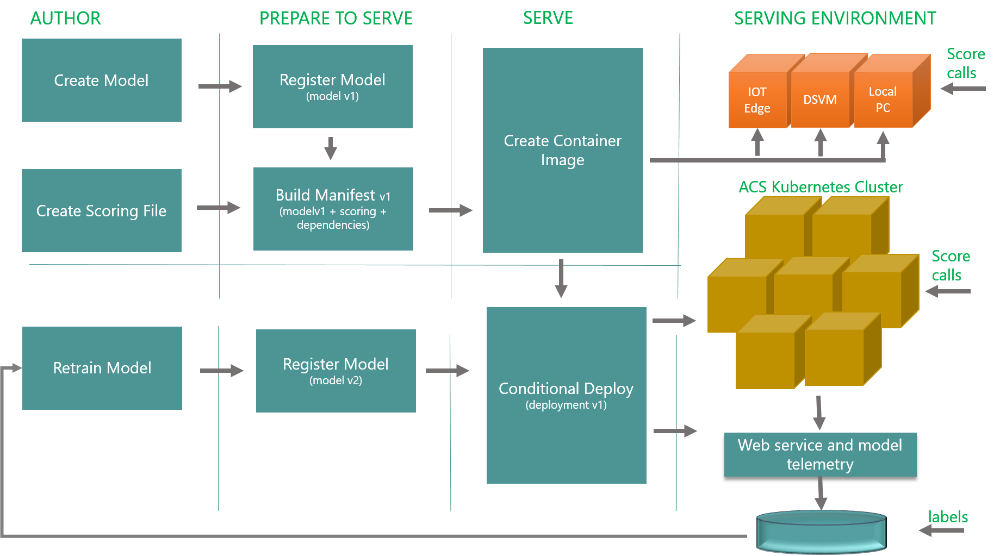

# Azure Machine Learning Model Management

[!INCLUDE [workbench-deprecated](../../../includes/aml-deprecating-preview-2017.md)]

Azure Machine Learning Model Management enables you to manage and deploy machine-learning workflows and models. 

Model Management provides capabilities for:
- Model versioning
- Tracking models in production
- Deploying models to production through AzureML Compute Environment with [Azure Container Service](https://azure.microsoft.com/services/container-service/) and [Kubernetes](https://docs.microsoft.com/azure/container-service/kubernetes/container-service-kubernetes-walkthrough)
- Creating Docker containers with the models and testing them locally
- Automated model retraining
- Capturing model telemetry for actionable insights. 

Azure Machine Learning Model Management provides a registry of model versions. It also provides automated workflows for packaging and deploying Machine Learning containers as REST APIs. The models and their runtime dependencies are packaged in Linux-based Docker container with prediction API. 

Azure Machine Learning Compute Environments help to set up and manage scalable clusters for hosting the models. The compute environment is based on Azure Container Services. Azure Container Services provides automatic exposure of Machine Learning APIs as REST API endpoints with the following features:

- Authentication
- Load balancing
- Automatic scale-out
- Encryption

Azure Machine Learning Model Management provides these capabilities through the CLI, API, and the Azure portal. 

Azure Machine Learning model management uses the following information:

 - Model file or a directory with the model files
 - User created Python file implementing a model scoring function
 - Conda dependency file listing runtime dependencies
 - Runtime environment choice, and 
 - Schema file for API parameters 

This information is used when performing the following actions:

- Registering a model
- Creating a manifest that is used when building a container
- Building a Docker container image
- Deploying a container to Azure Container Service
 
The following figure shows an overview of how models are registered and deployed into the cluster. 

## Create and manage models 
You can register models with Azure Machine Learning Model Management for tracking model versions in production. For ease of reproducibility and governance, the service captures all dependencies and associated information. For deeper insights into performance, you can capture model telemetry using the provided SDK. Model telemetry is archived in user-provided storage. The model telemetry can be used later for analyzing model performance, retraining, and gaining insights for your business.

## Create and manage manifests 
Models require additional artifacts to deploy into  production. The system provides the capability to create a manifest that encompasses model, dependencies, inference script (aka scoring script), sample data, schema etc. This manifest acts as a recipe to create a Docker container image. Enterprises can auto-generate manifest, create different versions, and manage their manifests. 

## Create and manage Docker container images 
You can use the manifest from the previous step to build Docker-based container images in their respective environments. The containerized, Docker-based images provide enterprises with the flexibility to run these images on the following compute environments:

- [Kubernetes based Azure Container Service](https://docs.microsoft.com/azure/container-service/kubernetes/container-service-kubernetes-walkthrough)
- On-premises container services
- Development environments
- IoT devices

These Docker-based containerized images are self-contained with all necessary dependencies required for generating predictions. 

## Deploy Docker container images 
With the Azure Machine Learning Model Management, you can deploy Docker-based container images with a single command to Azure Container Service managed by ML Compute Environment. These deployments are created with a front-end server that provides the following features:

- Low latency predictions at scale
- Load balancing
- Automatic scaling of ML endpoints
- API key authorization
- API swagger document

You can control the deployment scale and telemetry through the following configuration settings:

- System logging and model telemetry for each web service level. If enabled, all stdout logs are streamed to [Azure Application Insights](https://azure.microsoft.com/services/application-insights/). Model telemetry is archived in storage that you provide. 
- Auto-scale and concurrency limits. These settings automatically increase the number of deployed containers based on the load within the existing cluster. They also control the throughput and consistency of prediction latency.

## Consumption 
Azure Machine Learning Model Management creates REST API for the deployed model along with the swagger document. You can consume deployed models by calling the REST APIs with API key and model inputs to get the predictions as part of the line-of-business applications. The sample code is available in GitHub for languages Java, [Python](https://github.com/CortanaAnalyticsGallery-Int/digit-recognition-cnn-tf/blob/master/client.py), and C# for calling REST APIs. The Azure Machine Learning Model Management CLI provides an easy way to work with these REST APIs. You can consume the APIs using a single CLI command, a swagger-enabled applications, or using curl. 

## Retraining 
Azure Machine Learning Model Management provides APIs that you can use to retrain your models. You can also use the APIs to update existing deployments with updated versions of the model. As part of the data science workflow, you recreate the model in your experimentation environment. Then, you register the model with Model Management, and update existing deployments. Updates are performed using a single UPDATE CLI command. The UPDATE command updates existing deployments without changing the API URL or the key. The applications consuming the model continue to work without any code change, and start getting better predictions using new model.

The complete workflow describing these concepts is captured in the following figure:

## Frequently asked questions (FAQ) 
- **What data types are supported? Can I pass NumPy arrays directly as input to web service?**

   If you are providing schema file that was created using generate_schema SDK, then you can pass NumPy and/or Pandas DF. You can also pass any JSON serializable inputs. You can pass image as binary encoded string as well.

- **Does the web service support multiple inputs or parse different inputs?**

   Yes, you can take multiple inputs packaged in the one JSON request as a dictionary. Each input would correspond to a single unique dictionary key.

- **Is the call activated by a request to the web service a blocking call or an asynchronous call?**

   If service was created using realtime option as part of the CLI or API, then it is a blocking/synchronous call. It is expected to be realtime fast. Although on the client side you can call it using async HTTP library to avoid blocking the client thread.

- **How many requests can the web service simultaneously handle?**

   It depends on the cluster and web service scale. You can scale out your service to 100x of replicas and then it can handle many requests concurrently. You can also configure the maximum concurrent request per replica to increase service throughput.

- **How many requests can the web service queue up?**

   It is configurable. By default, it is set to ~10 per single replica, but you can increase/decrease it to your application requirements. Typically, increasing it the number of queued requests increases the service throughput but makes the latencies worse at higher percentiles. To keep the latencies consistent, you may want to set the queuing to a low value (1-5), and increase the number of replicas to handle the throughput. You can also turn on autoscaling to make the number of replicas adjusting automatically based on load. 

- **Can the same machine or cluster be used for multiple web service endpoints?**

   Absolutely. You can run 100x of services/endpoints on the same cluster. 

## Next steps
For getting started with Model Management, see [Configuring Model Management](deployment-setup-configuration.md).
