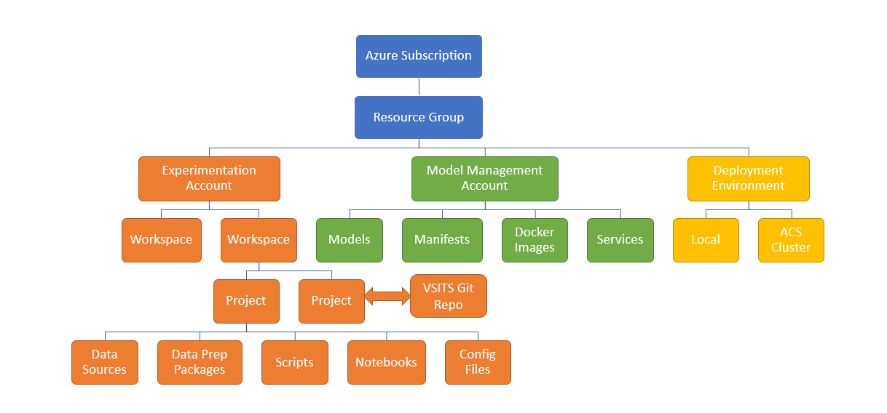

# Azure Machine Learning - Concepts

This article defines and describes the concepts you need to know to use Azure Machine Learning. 

- **Subscription:** An Azure subscription grants you access to resources in Azure. Because Azure Machine Learning is deeply integrated with compute, storage, and many other Azure resources and services, Workbench requires that each user has access to a valid Azure subscription. Users must also have sufficient permissions within that subscription to create resources.

- **Experimentation Account:** Experimentation account is an Azure resource required by Azure ML, and a billing vehicle. It contains your workspaces, which in turn contain projects. You can add multiple users, referred to as _seats_, to an experimentation account. You must have access to an experimentation account in order to use Azure ML Workbench to run experiments. 

- **Model Management Account** A model management account is also an Azure resource required by Azure ML for managing models. You can use it to register models and manifests, build containerized web services and deploy them locally or in the cloud. It is also the other billing vehicle of Azure ML.

- **Workspace:** A Workspace is the primary component for sharing and collaboration in Azure ML. Projects are grouped within a workspace. A workspace can then be shared with multiple users that have been added to the experimentation account.

- **Project:** In Azure Machine Learning, a project is the logical container for all the work being done to solve a problem. It maps to a single file folder on your local disk, and you can add any files or sub folders to it. A project can optionally be associated with a Git repository for source control and collaboration.  

- **Experiment:** In Azure ML, an experiment is one or more source code file(s) that can be executed from a single entry point. It may contain tasks such as data ingestion, feature engineering, model training, or model evaluation. Currently, Azure ML supports Python or PySpark experiments only.

- **Model:** In Azure Machine Learning, models refer to the product of a machine learning experiment. They are recipes that when applied correctly to data, generate predicted values. Models can be deployed to test or production environments, and used for scoring new data. Once in production, models can be monitored for performance and data drift, and retrained as required. 

- **Compute Target:** A compute target is the compute resource that you configure for executing your experiments. It can be your local computer (Windows or macOS), Docker container running on your local computer or in a Linux VM on Azure, or an HDInsight Spark cluster.

- **Run:** The Experimentation Service defines a run as the lifetime of an experiment execution in a compute target. Azure ML captures information of each run automatically and presents the entire history of a particular experiment in the form of run history.

- **Environment:** In Azure Machine Learning, an environment denotes a particular computing resource that is used for deploying and managing your models. It can be your local computer, a Linux VM on Azure, or a Kubernetes cluster running in Azure Container Service, depending on context and configuration. Your model is hosted in a Docker container running in these environments and exposed as a REST API endpoint.

- **Managed model:** Model Management enables you to deploy models as web services, manage various versions of your models, and monitor their performance and metrics. Managed models are registered with an Azure Machine Learning Model Management account.

- **Manifests:** When the Model Management system deploys a model into production, it includes a manifest that can encompass model, dependencies, scoring script, sample data, and schema. The manifest is the recipe used to create a Docker container image. Using Model Management, you can auto-generate the manifests, create different versions, and manage these manifests. 

- **Images:** You can use manifests to generate (and regenerate) Docker images. Containerized Docker images create flexibility to run them in the cloud, on local machines, or on IoT device. Images are self-contained, and include all dependencies required for scoring new data with models. 

- **Services:** Model Management allows you to deploy models as web services. The webservice logic and dependencies are encapsulated into an image. Each webservice is a set of containers based on the image ready to service requests to a given URL. A web service is counted as a single deployment.
