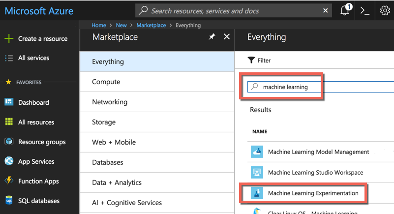
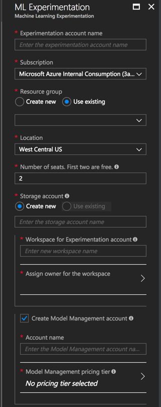
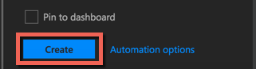
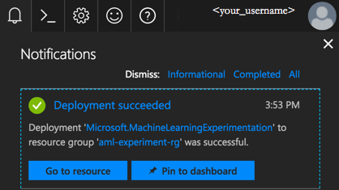
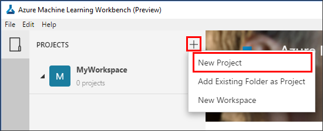
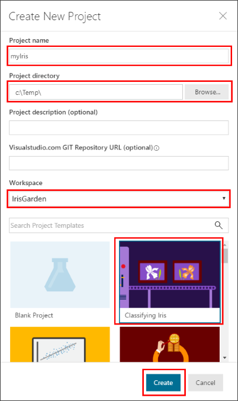
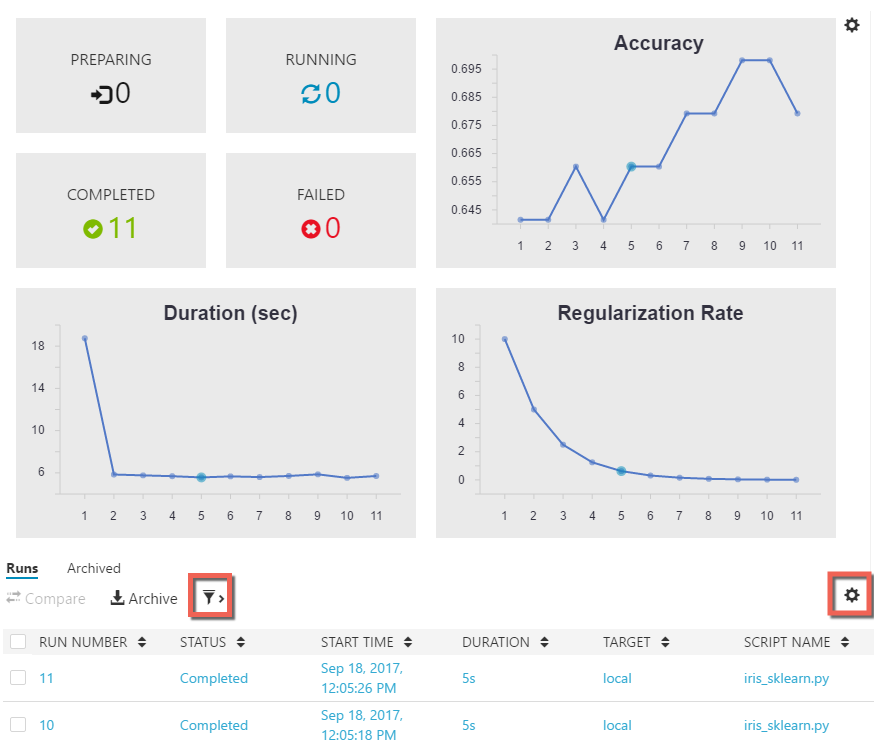

---
title: Installation Quickstart for Azure Machine Learning service | Microsoft Docs
description: In this Quickstart, you can learn how to create Azure Machine Learning resources, and how to install and get started with Azure Machine Learning Workbench.
services: machine-learning
author: hning86
ms.author: haining
manager: mwinkle
ms.reviewer: jmartens, jasonwhowell, mldocs
ms.service: machine-learning
ms.component: core
ms.workload: data-services
ms.custom: mvc
ms.topic: quickstart
ms.date: 3/7/2018
ROBOTS: NOINDEX 
---

# Quickstart: Install and get started with Azure Machine Learning service

[!INCLUDE [workbench-deprecated](../../../includes/aml-deprecating-preview-2017.md)]


Azure Machine Learning service (preview) is an integrated, end-to-end data science and advanced analytics solution. It helps professional data scientists prepare data, develop experiments, and deploy models at cloud scale.

This quickstart shows you how to:

* Create service accounts for Azure Machine Learning service
* Install and log in to Azure Machine Learning Workbench.
* Create a project in Workbench
* Run a script in that project  
* Access the command-line interface (CLI)


As part of the Microsoft Azure portfolio, Azure Machine Learning service requires an Azure subscription. If you don't have an Azure subscription, create a [free account](https://azure.microsoft.com/free/?WT.mc_id=A261C142F) before you begin.

Additionally, you must have adequate permissions to create assets such as Resource Groups, Virtual Machines, and so on. 

<a name="prerequisites"></a>You can install the Azure Machine Learning Workbench application on the following operating systems:
- Windows 10 or Windows Server 2016
- macOS Sierra or High Sierra

## Create Azure Machine Learning service accounts
Use the Azure portal to provision your Azure Machine Learning accounts: 
1. Sign in to the [Azure portal](https://portal.azure.com/) using the credentials for the Azure subscription you'll use. If you don't have an Azure subscription, create a [free account](https://azure.microsoft.com/free/?WT.mc_id=A261C142F) now. 

   

1. Select the **Create a resource** button (+) in the upper-left corner of the portal.

   

1. Enter **Machine Learning** in the search bar. Select the search result named **Machine Learning Experimentation**. 

   

1. In the **Machine Learning Experimentation** pane, scroll to the bottom and select **Create** to begin defining your experimentation account.  

   

1. In the **ML Experimentation** pane, configure your Machine Learning Experimentation account. 

   Setting|Suggested value for tutorial|Description
   ---|---|---
   Experimentation account name | _Unique name_ |Enter a unique name that identifies your account. You can use your own name, or a departmental or project name that best identifies the experiment. The name should be 2 to 32 characters. It should include only alphanumeric characters and the dash (-) character. 
   Subscription | _Your subscription_ |Choose the Azure subscription that you want to use for your experiment. If you have multiple subscriptions, choose the appropriate subscription in which the resource is billed.
   Resource group | _Your resource group_ | Use an existing resource group in your subscription, or enter a name to create a new resource group for this experimentation account. 
   Location | _The region closest to your users_ | Choose the location closest to your users and the data resources.
   Number of seats | 2 | Enter the number of seats. Learn how [seating impacts pricing](https://azure.microsoft.com/pricing/details/machine-learning/).<br/><br/>For this Quickstart, you only need two seats. Seats can be added or removed as needed in the Azure portal.
   Storage account | _Unique name_ | Select **Create new** and provide a name to create an [Azure storage account](https://docs.microsoft.com/azure/storage/common/storage-quickstart-create-account?tabs=portal). The name should be 3 to 24 characters, and should include only alphanumeric characters. Alternatively, select **Use existing** and select your existing storage account from the drop-down list. The storage account is required and is used to hold project artifacts and run history data. 
   Workspace for Experimentation account | IrisGarden<br/>(name used in tutorials) | Provide a name for a workspace for this account. The name should be 2 to 32 characters. It should include only alphanumeric characters and the dash (-) character. This workspace contains the tools you need to create, manage, and publish experiments.
   Assign owner for the workspace | _Your account_ | Select your own account as the workspace owner.
   Create Model Management account | **check** |Create a Model Management account now so that this resource is available when you want to deploy and manage your models as real-time web services. <br/><br/>While optional, we recommend creating the Model Management account at the same time as the Experimentation account.
   Account name | _Unique name_ | Choose a unique name that identifies your Model Management account. You can use your own name, or a departmental or project name that best identifies the experiment. The name should be 2 to 32 characters. It should include only alphanumeric characters and the dash (-) character. 
   Model Management pricing tier | **DEVTEST** | Select **No pricing tier selected** to specify the pricing tier for your new Model Management account. For cost savings, select the **DEVTEST** pricing tier if it's available on your subscription (limited availability). Otherwise, select the S1 pricing tier. Click **Select** to save the pricing tier selection. 
   Pin to dashboard | _check_ | Select the **Pin to dashboard** option to allow easy tracking of your Machine Learning Experimentation account on the front dashboard page of the Azure portal.

   

5. Select **Create** to begin the creation process of the Experimentation account along with the Model Management account.

   

   It can take a few moments to create an account. You can check on the status of the deployment process by clicking the Notifications icon (bell) on the Azure portal toolbar.
   
   


## Install and log in to Workbench

Azure Machine Learning Workbench is available for Windows or macOS. See the list of [supported platforms](#prerequisites).

>[!WARNING]
>The installation might take around 30 minutes to complete. 

1. Download and launch the latest Workbench installer. 
   >[!IMPORTANT]
   >Download the installer fully on disk, and then run it from there. Do not run it directly from your browser's download widget.

   **On Windows:** 

   &nbsp;&nbsp;&nbsp;&nbsp;A. Download [AmlWorkbenchSetup.msi](https://aka.ms/azureml-wb-msi).  <br/>
   &nbsp;&nbsp;&nbsp;&nbsp;B. Double-click on the downloaded installer in File Explorer.

   **On macOS:** 

   &nbsp;&nbsp;&nbsp;&nbsp;A. Download [AmlWorkbench.dmg](https://aka.ms/azureml-wb-dmg). <br/>
   &nbsp;&nbsp;&nbsp;&nbsp;B. Double-click on the downloaded installer in Finder.<br/><br/>

1. Follow the on-screen instructions in your installer to completion. 

   **The installation might take around 30 minutes to complete.**  
   
   | |Installation path to Azure Machine Learning Workbench|
   |--------|------------------------------------------------|
   |Windows|C:\Users\\<user\>\AppData\Local\AmlWorkbench|
   |macOS|/Applications/Azure ML Workbench.app|

   The installer will download and set up all the necessary dependencies, such as Python, Miniconda, and other related libraries. This installation also includes the Azure cross-platform command-line tool, or Azure CLI.

1. Launch Workbench by selecting the **Launch Workbench** button on the last screen of the installer. 

   If you closed the installer:
   + On Windows, launch it using the **Machine Learning Workbench** desktop shortcut. 
   + On macOS, select **Azure ML Workbench** in Launchpad.

1. On the first screen, select **Sign in with Microsoft** to authenticate with the Azure Machine Learning Workbench. Use the same credentials you used in the Azure portal to create the Experimentation and Model Management accounts. 

   Once you are signed in, Workbench uses the first Experimentation account it finds in your Azure subscriptions, and displays all workspaces and projects associated with that account. 

   >[!TIP]
   > You can switch to a different Experimentation account using the icon in the lower-left corner of the Workbench application window.

## Create a project in Workbench

In Azure Machine Learning, a project is the logical container for all the work being done to solve a problem. It maps to a single folder on your local disk, and you can add any files or subfolders to it. 

Here, we are creating a new Workbench project using a template that includes the [Iris flower dataset](https://en.wikipedia.org/wiki/Iris_flower_data_set). The tutorials that follow this quickstart depend on this data to build a model that predicts the type of iris based on some of its physical characteristics.  

1. With Azure Machine Learning Workbench open, select the plus sign (+) in the **PROJECTS** pane and choose **New Project**.  

   

1. Fill out of the form fields and select the **Create** button to create a new project in the Workbench.

   Field|Suggested value for tutorial|Description
   ---|---|---
   Project name | myIris |Enter a unique name that identifies your account. You can use your own name, or a departmental or project name that best identifies the experiment. The name should be 2 to 32 characters. It should include only alphanumeric characters and the dash (-) character. 
   Project directory | c:\Temp\ | Specify the directory in which the project is created.
   Project description | _leave blank_ | Optional field useful for describing the projects.
   Visualstudio.com GIT Repository URL |_leave blank_ | Optional field. A project can optionally be associated with a Git repository on Azure DevOps for source control and collaboration. [Learn how to set that up.](../desktop-workbench/using-git-ml-project.md#step-3-set-up-a-machine-learning-project-and-git-repo). 
   Selected workspace | IrisGarden (if it exists) | Choose a workspace that you have created for your Experimentation account in the Azure portal. <br/>If you followed the Quickstart, you should have a workspace by the name IrisGarden. If not, select the one you created when you created your Experimentation account or any other you want to use.
   Project template | Classifying Iris | Templates contain scripts and data you can use to explore the product. This template contains the scripts and data you need for this quickstart and other tutorials in this documentation site. 

   
 
 A new project is created and the project dashboard opens with that project. At this point, you can explore the project home page, data sources, notebooks, and source code files. 

>[!TIP]
>You can configure Workbench to work with a Python IDE for a smooth data science development experience. Then, you can interact with your project in the IDE. [Learn how](../desktop-workbench/how-to-configure-your-ide.md). 

## Run a Python script

Now, you can run the **iris_sklearn.py** script on your local computer. This script is included by default with the **Classifying Iris** project template. The script builds a [logistic regression](https://en.wikipedia.org/wiki/Logistic_regression) model using the popular Python [scikit-learn](http://scikit-learn.org/stable/index.html) library.

1. In the command bar at the top of the **Project Dashboard** page, select **local** as the execution target and select **iris_sklearn.py** as the script to run. These values are preselected by default. 

   There are other files included in the sample that you can check out later, but for this quickstart we are only interested in **iris_sklearn.py**. 

   

1. In the **Arguments** text box, enter **0.01**. This number corresponds to the regularization rate, and is used in the script to configure the logistic regression model. 

1. Select **Run** to start the execution of the script on your computer. The **iris_sklearn.py** job immediately appears in the **Jobs** panel on the right so you can monitor the script's execution.

   Congratulations! You've successfully run a Python script in Azure Machine Learning Workbench.

1. Repeat steps 2 - 3 several times using different argument values ranging from **0.001** to **10** (for example, using powers of 10). Each run appears in the **Jobs** pane.

1. Inspect the run history by selecting the **Runs** view and then **iris_sklearn.py** in the Runs list. 

   

   This view shows every run that was executed on **iris_sklearn.py**. The run history dashboard also displays the top metrics, a set of default graphs, and a list of metrics for each run. 

1. You can customize this view by sorting, filtering, and adjusting the configurations using the gear and filter icons.

   

3. Select a completed run in the Jobs pane to see a detailed view for that specific execution. Details include additional metrics, the files that it produced, and other potentially useful logs.

## Start the CLI

The Azure Machine Learning command-line interface (CLI) is also installed. The CLI interface allows you to access and interact with your Azure Machine Learning service using the `az` commands to perform all tasks required for an end-to-end data science workflow. [Learn more.](../desktop-workbench/tutorial-iris-azure-cli.md)

You can launch the Azure Machine Learning CLI from the Workbench's toolbar using **File → Open Command Prompt**.

You can get help on commands in the Azure Machine Learning CLI using the --help argument.

```az ml --help```

## Clean up resources

[!INCLUDE [aml-delete-resource-group](../../../includes/aml-delete-resource-group.md)]

## Next steps
You have now created the necessary Azure Machine Learning accounts and installed the Azure Machine Learning Workbench application. You have also created a project, ran a script, and explored the run history of the script.

For a more in-depth experience of this workflow, including how to deploy your Iris model as a web service, follow the full-length *Classifying Iris* tutorial. The tutorial contains detailed steps for [data preparation](../desktop-workbench/tutorial-classifying-iris-part-1.md), [experimentation](../desktop-workbench/tutorial-classifying-iris-part-2.md), and [model management](../desktop-workbench/tutorial-classifying-iris-part-3.md). 

> [!div class="nextstepaction"]
> [Tutorial: Classifying Iris (Part 1)](../desktop-workbench/tutorial-classifying-iris-part-1.md)

>[!NOTE]
> While you have created your model management account, your environment is not set up for deploying web services yet. Learn how to set up your [deployment environment](../desktop-workbench/deployment-setup-configuration.md).
