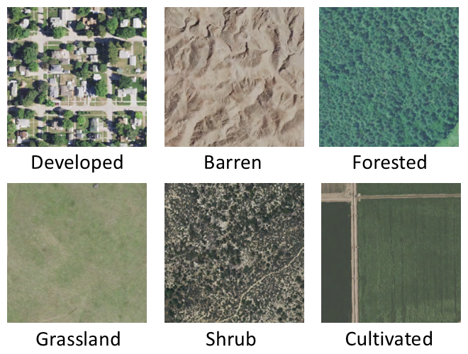
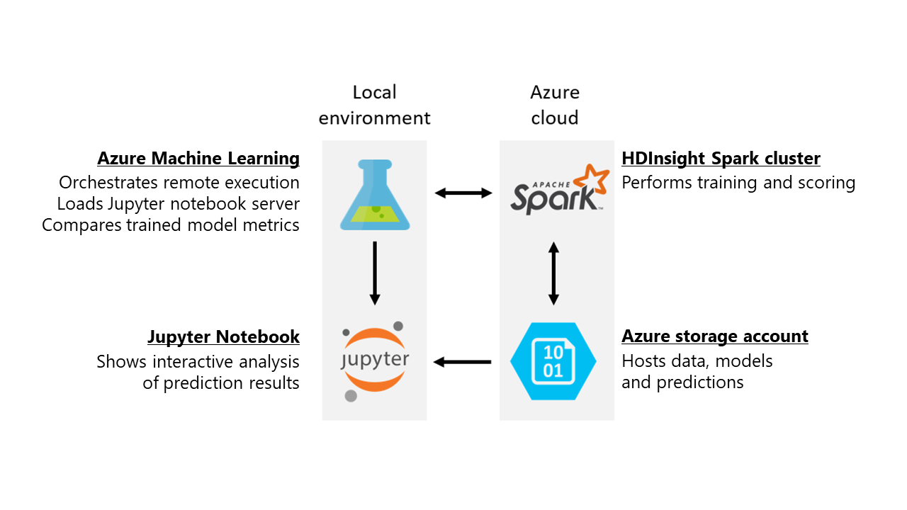
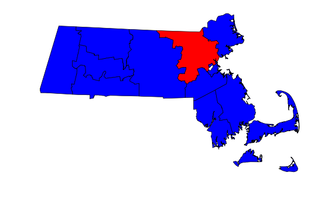

# Aerial Image Classification

[!INCLUDE [workbench-deprecated](../../../includes/aml-deprecating-preview-2017.md)] 


This example demonstrates how to use Azure Machine Learning Workbench to coordinate distributed training and operationalization of image classification models. We use two approaches for training: (i) refining a deep neural network using an [Azure Batch AI](https://docs.microsoft.com/azure/batch-ai/) GPU cluster, and (ii) using the [Microsoft Machine Learning for Apache Spark (MMLSpark)](https://github.com/Azure/mmlspark) package to featurize images using pretrained CNTK models and to train classifiers using the derived features. We then apply the trained models in parallel fashion to large image sets in the cloud using an [Azure HDInsight Spark](https://azure.microsoft.com/services/hdinsight/apache-spark/) cluster, allowing us to scale the speed of training and operationalization by adding or removing worker nodes.

This example highlights two approaches to transfer learning, which leverages pretrained models to avoid the costs of training deep neural networks from scratch. Retraining a deep neural network typically requires GPU compute, but can lead to greater accuracy when the training set is sufficiently large. Training a simple classifier on featurized images does not require GPU compute, is inherently fast and arbitrarily scalable, and fits fewer parameters. This method is therefore an excellent choice when few training samples are available -- as is often the case for custom use cases. 

The Spark cluster used in this example has 40 worker nodes and costs ~$40/hr to operate; the Batch AI cluster resources include eight GPUs and cost ~$10/hr to operate. Completing this walkthrough takes approximately three hours. When you are finished, follow the cleanup instructions to remove the resources you have created and stop incurring charges.

## Link to the Gallery GitHub repository

The public GitHub repository for this real world scenario contains all materials, including code samples, needed for this example:

[https://github.com/Azure/MachineLearningSamples-AerialImageClassification](https://github.com/Azure/MachineLearningSamples-AerialImageClassification)

## Use case description

In this scenario, we train machine learning models to classify the type of land shown in aerial images of 224-meter x 224-meter plots. Land use classification models can be used to track urbanization, deforestation, loss of wetlands, and other major environmental trends using periodically collected aerial imagery. We have prepared training and validation image sets based on imagery from the U.S. National Agriculture Imagery Program and land use labels published by the U.S. National Land Cover Database. Example images in each land use class are shown here:



After training and validating the classifier model, we will apply it to aerial images spanning Middlesex County, MA -- home of Microsoft's New England Research & Development (NERD) Center -- to demonstrate how these models can be used to study trends in urban development.

To produce an image classifier using transfer learning, data scientists often construct multiple models with a range of methods and select the most performant model. Azure Machine Learning Workbench can help data scientists coordinate training across different compute environments, track and compare the performance of multiple models, and apply a chosen model to large datasets on the cloud.

## Scenario structure

In this example, image data and pretrained models are housed in an Azure storage account. An Azure HDInsight Spark cluster reads these files and constructs an image classification model using MMLSpark. The trained model and its predictions are then written to the storage account, where they can be analyzed and visualized by a Jupyter notebook running locally. Azure Machine Learning Workbench coordinates remote execution of scripts on the Spark cluster. It also tracks accuracy metrics for multiple models trained using different methods, allowing the user to select the most performant model.



These step-by-step instructions begin by guiding you through the creation and preparation of an Azure storage account and Spark cluster, including data transfer and dependency installation. They then describe how to launch training jobs and compare the performance of the resulting models. Finally, they illustrate how to apply a chosen model to a large image set on the Spark cluster and analyze the prediction results locally.


## Set up the execution environment

The following instructions guide you through the process of setting up execution environment for this example.

### Prerequisites
- An [Azure account](https://azure.microsoft.com/free/) (free trials are available)
    - You will create an HDInsight Spark cluster with 40 worker nodes (168 cores total). Ensure that your account has enough available cores by reviewing the "Usage + quotas" tab for your subscription in Azure portal.
       - If you have fewer cores available, you may modify the HDInsight cluster template to decrease the number of workers provisioned. Instructions for this appear under the "Create the HDInsight Spark cluster" section.
    - This sample creates a Batch AI Training cluster with two NC6 (1 GPU, 6 vCPU) VMs. Ensure that your account has enough available cores in the East US region by reviewing the "Usage + quotas" tab for your subscription in Azure portal.
- [Azure Machine Learning Workbench](../service/overview-what-is-azure-ml.md)
    - Follow the [Install and create Quickstart](../desktop-workbench/quickstart-installation.md) to install the Azure Machine Learning Workbench and create Experimentation and Model Management Accounts.
- [Batch AI](https://github.com/Azure/BatchAI) Python SDK and Azure CLI
    - Complete the following sections in the [Batch AI Recipes README](https://github.com/Azure/BatchAI/tree/master/recipes):
        - "Prerequisites"
        - "Create and get your Azure Active Directory (AAD) application"
        - "Register BatchAI Resource Providers" (under "Run Recipes Using Azure CLI")
        - "Install Azure Batch AI Management Client"
        - "Install Azure Python SDK"
    - Record the client ID, secret, and tenant ID of the Azure Active Directory application you are directed to create. You will use those credentials later in this tutorial.
    - As of this writing, Azure Machine Learning Workbench and Azure Batch AI use separate forks of the Azure CLI. For clarity, we refer to the Workbench's version of the CLI as "a CLI launched from Azure Machine Learning Workbench" and the general-release version (which includes Batch AI) as "Azure CLI."
- [AzCopy](https://docs.microsoft.com/azure/storage/common/storage-use-azcopy), a free utility for coordinating file transfer between Azure storage accounts
    - Ensure that the folder containing the AzCopy executable is on your system's PATH environment variable. (Instructions on modifying environment variables are available [here](https://support.microsoft.com/help/310519/how-to-manage-environment-variables-in-windows-xp).)
- An SSH client; we recommend [PuTTY](http://www.putty.org/).

This example was tested on a Windows 10 PC; you should be able to run it from any Windows machine, including Azure Data Science Virtual Machines. The Azure CLI was installed from an MSI according to [these instructions](https://github.com/Azure/azure-sdk-for-python/wiki/Contributing-to-the-tests#getting-azure-credentials). Minor modifications may be required (for example, changes to filepaths) when running this example on macOS.

### Set up Azure resources

This example requires an HDInsight Spark cluster and an Azure storage account to host relevant files. Follow these instructions to create these resources in a new Azure resource group:

#### Create a new Workbench project

Create a new project using this example as a template:
1.	Open Azure Machine Learning Workbench
2.	On the **Projects** page, click the **+** sign and select **New Project**
3.	In the **Create New Project** pane, fill in the information for your new project
4.	In the **Search Project Templates** search box, type "Aerial Image Classification" and select the template
5.	Click **Create**
 
#### Create the resource group

1. After loading your project in Azure Machine Learning Workbench, open a Command Line Interface (CLI) by clicking File -> Open Command Prompt.
    Use this version of the CLI for the majority of the tutorial. (Where indicated, you are asked to open another version of the CLI to prepare Batch AI resources.)

1. From the command-line interface, log in to your Azure account by running the following command:

    ```
    az login
    ```

    You are asked to visit a URL and type in a provided temporary code; the website requests your Azure account credentials.
    
1. When login is complete, return to the CLI and run the following command to determine which Azure subscriptions are available to your Azure account:

    ```
    az account list
    ```

    This command lists all subscriptions associated with your Azure account. Find the ID of the subscription you would like to use. Write the subscription ID where indicated in the following command, then set the active subscription by executing the command:

    ```
    az account set --subscription [subscription ID]
    ```

1. The Azure resources created in this example are stored together in an Azure resource group. Choose a unique resource group name and write it where indicated, then execute both commands to create the Azure resource group:

    ```
    set AZURE_RESOURCE_GROUP=[resource group name]
    az group create --location eastus --name %AZURE_RESOURCE_GROUP%
    ```

#### Create the storage account

We now create the storage account that hosts project files that must be accessed by the HDInsight Spark.

1. Choose a unique storage account name and write it where indicated in the following `set` command, then create an Azure storage account by executing both commands:

    ```
    set STORAGE_ACCOUNT_NAME=[storage account name]
    az storage account create --name %STORAGE_ACCOUNT_NAME% --resource-group %AZURE_RESOURCE_GROUP% --sku Standard_LRS
    ```

1. List the storage account keys by running the following command:

    ```
    az storage account keys list --resource-group %AZURE_RESOURCE_GROUP% --account-name %STORAGE_ACCOUNT_NAME%
    ```

    Record the value of `key1` as the storage key in the following command, then run the command to store the value.
    ```
    set STORAGE_ACCOUNT_KEY=[storage account key]
    ```
1. Create a file share named `baitshare` in your storage account with the following command:

    ```
    az storage share create --account-name %STORAGE_ACCOUNT_NAME% --account-key %STORAGE_ACCOUNT_KEY% --name baitshare
    ```
1. In your favorite text editor, load the `settings.cfg` file from the Azure Machine Learning Workbench project's "Code" subdirectory, and insert the storage account name and key as indicated. Save and close the `settings.cfg` file.
1. If you have not already done so, download and install the [AzCopy](http://aka.ms/downloadazcopy) utility. Ensure that the AzCopy executable is on your system path by typing "AzCopy" and pressing Enter to show its documentation.
1. Issue the following commands to copy all of the sample data, pretrained models, and model training scripts to the appropriate locations in your storage account:

    ```
    AzCopy /Source:https://mawahsparktutorial.blob.core.windows.net/test /SourceSAS:"?sv=2017-04-17&ss=bf&srt=sco&sp=rwl&se=2037-08-25T22:02:55Z&st=2017-08-25T14:02:55Z&spr=https,http&sig=yyO6fyanu9ilAeW7TpkgbAqeTnrPR%2BpP1eh9TcpIXWw%3D" /Dest:https://%STORAGE_ACCOUNT_NAME%.blob.core.windows.net/test /DestKey:%STORAGE_ACCOUNT_KEY% /S
    AzCopy /Source:https://mawahsparktutorial.blob.core.windows.net/train /SourceSAS:"?sv=2017-04-17&ss=bf&srt=sco&sp=rwl&se=2037-08-25T22:02:55Z&st=2017-08-25T14:02:55Z&spr=https,http&sig=yyO6fyanu9ilAeW7TpkgbAqeTnrPR%2BpP1eh9TcpIXWw%3D" /Dest:https://%STORAGE_ACCOUNT_NAME%.blob.core.windows.net/train /DestKey:%STORAGE_ACCOUNT_KEY% /S
    AzCopy /Source:https://mawahsparktutorial.blob.core.windows.net/middlesexma2016 /SourceSAS:"?sv=2017-04-17&ss=bf&srt=sco&sp=rwl&se=2037-08-25T22:02:55Z&st=2017-08-25T14:02:55Z&spr=https,http&sig=yyO6fyanu9ilAeW7TpkgbAqeTnrPR%2BpP1eh9TcpIXWw%3D" /Dest:https://%STORAGE_ACCOUNT_NAME%.blob.core.windows.net/middlesexma2016 /DestKey:%STORAGE_ACCOUNT_KEY% /S
    AzCopy /Source:https://mawahsparktutorial.blob.core.windows.net/pretrainedmodels /SourceSAS:"?sv=2017-04-17&ss=bf&srt=sco&sp=rwl&se=2037-08-25T22:02:55Z&st=2017-08-25T14:02:55Z&spr=https,http&sig=yyO6fyanu9ilAeW7TpkgbAqeTnrPR%2BpP1eh9TcpIXWw%3D" /Dest:https://%STORAGE_ACCOUNT_NAME%.blob.core.windows.net/pretrainedmodels /DestKey:%STORAGE_ACCOUNT_KEY% /S
    AzCopy /Source:https://mawahsparktutorial.blob.core.windows.net/pretrainedmodels /SourceSAS:"?sv=2017-04-17&ss=bf&srt=sco&sp=rwl&se=2037-08-25T22:02:55Z&st=2017-08-25T14:02:55Z&spr=https,http&sig=yyO6fyanu9ilAeW7TpkgbAqeTnrPR%2BpP1eh9TcpIXWw%3D" /Dest:https://%STORAGE_ACCOUNT_NAME%.file.core.windows.net/baitshare/pretrainedmodels /DestKey:%STORAGE_ACCOUNT_KEY% /S
    AzCopy /Source:https://mawahsparktutorial.blob.core.windows.net/scripts /SourceSAS:"?sv=2017-04-17&ss=bf&srt=sco&sp=rwl&se=2037-08-25T22:02:55Z&st=2017-08-25T14:02:55Z&spr=https,http&sig=yyO6fyanu9ilAeW7TpkgbAqeTnrPR%2BpP1eh9TcpIXWw%3D" /Dest:https://%STORAGE_ACCOUNT_NAME%.file.core.windows.net/baitshare/scripts /DestKey:%STORAGE_ACCOUNT_KEY% /S
    ```

    Expect file transfer to take around one hour. While you wait, you can proceed to the following section: you may need to open another Command Line Interface through Workbench and redefine the temporary variables there.

#### Create the HDInsight Spark cluster

Our recommended method to create an HDInsight cluster uses the HDInsight Spark cluster resource manager template included in the "Code\01_Data_Acquisition_and_Understanding\01_HDInsight_Spark_Provisioning" subfolder of this project.

1. The HDInsight Spark cluster template is the "template.json" file under the "Code\01_Data_Acquisition_and_Understanding\01_HDInsight_Spark_Provisioning" subfolder of this project. By default, the template creates a Spark cluster with 40 worker nodes. If you must adjust that number, open the template in your favorite text editor and replace any instances of "40" with the worker node number of your choice.
    - You may encounter out-of-memory errors later if the number of worker nodes you choose is smaller. To combat memory errors, you may run the training and operationalization scripts on a subset of the available data as described later in this document.
2. Choose a unique name and password for the HDInsight cluster and write them where indicated in the following command: Then create the cluster by issuing the commands:

    ```
    set HDINSIGHT_CLUSTER_NAME=[HDInsight cluster name]
    set HDINSIGHT_CLUSTER_PASSWORD=[HDInsight cluster password]
    az group deployment create --resource-group %AZURE_RESOURCE_GROUP% --name hdispark --template-file "Code\01_Data_Acquisition_and_Understanding\01_HDInsight_Spark_Provisioning\template.json" --parameters storageAccountName=%STORAGE_ACCOUNT_NAME%.blob.core.windows.net storageAccountKey=%STORAGE_ACCOUNT_KEY% clusterName=%HDINSIGHT_CLUSTER_NAME% clusterLoginPassword=%HDINSIGHT_CLUSTER_PASSWORD%
    ```

Your cluster's deployment may take up to 30 minutes (including provisioning and script action execution).

### Set up Batch AI resources

While you wait for your Storage account file transfer and Spark cluster deployment to complete, you can prepare the Batch AI Network File Server (NFS) and GPU cluster. Open an Azure CLI command prompt and run the following command:

```
az --version 
```

Confirm that `batchai` is listed among the installed modules. If not, you may be using a different Command Line Interface (for example, one opened through Workbench).

Next, check that provider registration has successfully completed. (Provider registration takes up to fifteen minutes and may still be ongoing if you recently completed the [Batch AI setup instructions](https://github.com/Azure/BatchAI/tree/master/recipes).) Confirm that both "Microsoft.Batch" and "Microsoft.BatchAI" appear with status "Registered" in the output of the following command:

```
az provider list --query "[].{Provider:namespace, Status:registrationState}" --out table
```

If not, run the following provider registration commands and wait ~15 minutes for registration to complete.
```
az provider register --namespace Microsoft.Batch
az provider register --namespace Microsoft.BatchAI
```

Modify the following commands to replace the bracketed expressions with the values you used earlier during resource group and storage account creation. Then, store the values as variables by executing the commands:
```
az account set --subscription [subscription ID]
set AZURE_RESOURCE_GROUP=[resource group name]
set STORAGE_ACCOUNT_NAME=[storage account name]
set STORAGE_ACCOUNT_KEY=[storage account key]
az configure --defaults location=eastus
az configure --defaults group=%AZURE_RESOURCE_GROUP%
```

Identify the folder containing your Azure Machine Learning project (for example, `C:\Users\<your username>\AzureML\aerialimageclassification`). Replace the bracketed value with the folder's filepath (with no trailing backslash) and execute the command:
```
set PATH_TO_PROJECT=[The filepath of your project's root directory]
```
You are now ready to create the Batch AI resources needed for this tutorial.

#### Prepare the Batch AI Network File Server

Your Batch AI cluster accesses your training data on a Network File Server. Data access may be several-fold faster when accessing files from an NFS vs. an Azure File Share or Azure Blob Storage.

1. Issue the following command to create a Network File Server:

    ```
    az batchai file-server create -n landuseclassifier -u demoUser -p "Dem0Pa$$w0rd" --vm-size Standard_DS2_V2 --disk-count 1 --disk-size 1000 --storage-sku Premium_LRS
    ```

1. Check the provisioning status of your Network File Server using the following command:

    ```
    az batchai file-server list
    ```

    When the "provisioningState" of the Network File Server named "landuseclassifier" is "succeeded", it is ready for use. Expect provisioning to take about five minutes.
1. Find the IP address of your NFS in the output of the previous command (the "fileServerPublicIp" property under "mountSettings"). Write the IP address where indicated in the following command, then store the value by executing the command:

    ```
    set AZURE_BATCH_AI_TRAINING_NFS_IP=[your NFS IP address]
    ```

1. Using your favorite SSH tool (the following sample command uses [PuTTY](http://www.putty.org/)), execute this project's `prep_nfs.sh` script on the NFS to transfer the training and validation image sets there.

    ```
    putty -ssh demoUser@%AZURE_BATCH_AI_TRAINING_NFS_IP% -pw Dem0Pa$$w0rd -m %PATH_TO_PROJECT%\Code\01_Data_Acquisition_and_Understanding\02_Batch_AI_Training_Provisioning\prep_nfs.sh
    ```

    Do not be concerned if the data download and extraction progress updates scroll across the shell window so quickly that they are illegible.

If desired, you can confirm that the data transfer has proceeded as planned by logging in to the file server with your favorite SSH tool and checking the `/mnt/data` directory contents. You should find two folders, training_images and validation_images, each containing with subfolders named according to land use categories.  The training and validation sets should contain ~44k and ~11k images, respectively.

#### Create a Batch AI cluster

1. Create the cluster by issuing the following command:

    ```
    az batchai cluster create -n landuseclassifier2 -u demoUser -p "Dem0Pa$$w0rd" --afs-name baitshare --nfs landuseclassifier --image UbuntuDSVM --vm-size STANDARD_NC6 --max 2 --min 2 --storage-account-name %STORAGE_ACCOUNT_NAME% 
    ```

1. Use the following command to check your cluster's provisioning status:

    ```
    az batchai cluster list
    ```

    When the allocation state for the cluster named "landuseclassifier" changes from resizing to steady, it's possible to submit jobs. However, jobs do not start running until all VMs in the cluster have left the "preparing" state. If the "errors" property of the cluster is not null, an error occurred during cluster creation and it should not be used.

#### Record Batch AI Training credentials

While you wait for cluster allocation to complete, open the `settings.cfg` file from the "Code" subdirectory of this project in the text editor of your choice. Update the following variables with your own credentials:
- `bait_subscription_id` (your 36-character Azure subscription ID)
- `bait_aad_client_id` (the Azure Active Directory application/client ID mentioned in the "Prerequisites" section)
- `bait_aad_secret` (the Azure Active Directory application secret mentioned in the "Prerequisites" section)
- `bait_aad_tenant` (the Azure Active Directory tenant ID mentioned in the "Prerequisites" section)
- `bait_region` (as of this writing, the only option is: eastus)
- `bait_resource_group_name` (the resource group you chose earlier)

Once you have assigned these values, the modified lines of your settings.cfg file should resemble the following text:

```
[Settings]
    # Credentials for the Azure Storage account
    storage_account_name = yoursaname
    storage_account_key = kpIXXXXXXXXXXXXXXXXXXXXXXXXXXXXXXXXXXXXXXXXXXXXXXXXQ==
    
    # Batch AI training credentials
    bait_subscription_id = 0caXXXXX-XXXX-XXXX-XXXX-XXXXXXXXX9c3
    bait_aad_client_id = d0aXXXXX-XXXX-XXXX-XXXX-XXXXXXXXX7f8
    bait_aad_secret = ygSXXXXXXXXXXXXXXXXXXXXXXXXXXXXXXXXXXXXXXXXXXXXXXX6I=
    bait_aad_tenant = 72fXXXXX-XXXX-XXXX-XXXX-XXXXXXXXXb47
    bait_region = eastus
    bait_resource_group_name = yourrgname
```

Save and close `settings.cfg`.

You may now close the CLI window where you executed the Batch AI resource creation commands. All further steps in this tutorial use a CLI launched from Azure Machine Learning Workbench.

### Prepare the Azure Machine Learning Workbench execution environment

#### Register the HDInsight cluster as an Azure Machine Learning Workbench compute target

Once HDInsight cluster creation is complete, register the cluster as a compute target for your project as follows:

1.  Issue the following command from the Azure Machine Learning Command Line Interface:

    ```
    az ml computetarget attach cluster --name myhdi --address %HDINSIGHT_CLUSTER_NAME%-ssh.azurehdinsight.net --username sshuser --password %HDINSIGHT_CLUSTER_PASSWORD%
    ```

    This command adds two files, `myhdi.runconfig` and `myhdi.compute`, to your project's `aml_config` folder.

1. Open the `myhdi.compute` file in your favorite text editor. Modify the `yarnDeployMode: cluster` line to read `yarnDeployMode: client`, then save and close the file.
1. Run the following command to prepare your HDInsight environment for use:
   ```
   az ml experiment prepare -c myhdi
   ```

#### Install local dependencies

Open a CLI from Azure Machine Learning Workbench and install dependencies needed for local execution by issuing the following command:

```
pip install matplotlib azure-storage==0.36.0 pillow scikit-learn azure-mgmt-batchai
```

## Data acquisition and understanding

This scenario uses publicly available aerial imagery data from the [National Agriculture Imagery Program](https://www.fsa.usda.gov/programs-and-services/aerial-photography/imagery-programs/naip-imagery/) at 1-meter resolution. We have generated sets of 224 pixel x 224 pixel PNG files cropped from the original NAIP data and sorted according to land use labels from the [National Land Cover Database](https://www.mrlc.gov/nlcd2011.php). A sample image with label "Developed" is shown at full size:


Class-balanced sets of ~44k and 11k images are used for model training and validation, respectively. We demonstrate model deployment on a ~67k image set tiling Middlesex County, MA -- home of Microsoft's New England Research and Development (NERD) center. For more information on how these image sets were constructed, see the [Embarrassingly Parallel Image Classification git repository](https://github.com/Azure/Embarrassingly-Parallel-Image-Classification).



During setup, the aerial image sets used in this example were transferred to the storage account that you created. The training, validation, and operationalization images are all 224 pixel x 224 pixel PNG files at a resolution of one pixel per square meter. The training and validation images have been organized into subfolders based on their land use label. (The land use labels of the operationalization images are unknown and in many cases ambiguous; some of these images contain multiple land types.) For more information on how these image sets were constructed, see the [Embarrassingly Parallel Image Classification git repository](https://github.com/Azure/Embarrassingly-Parallel-Image-Classification).

To view example images in your Azure storage account (optional):
1. Log in to the [Azure portal](https://portal.azure.com).
1. Search for the name of your storage account in the search bar along the top of your screen. Click on your storage account in the search results.
2. Click on the "Blobs" link in the storage account's main pane.
3. Click on the container named "train." You should see a list of directories named according to land use.
4. Click on any of these directories to load the list of images it contains.
5. Click on any image and download it to view the image.
6. If desired, click on the containers named "test" and "middlesexma2016" to view their contents as well.

## Modeling

### Training models with Azure Batch AI

The `run_batch_ai.py` script in the "Code\02_Modeling" subfolder of the Workbench project is used to issue a Batch AI Training job. This job retrains an image classifier DNN chosen by the user (AlexNet or ResNet 18 pretrained on ImageNet). The depth of retraining can also be specified: retraining just the final layer of the network may reduce overfitting when few training samples are available, while fine-tuning the whole network (or, for AlexNet, the fully connected layers) can lead to greater model performance when the training set is sufficiently large.

When the training job completes, this script saves the model (along with a file describing the mapping between the model's integer output and the string labels) and the predictions to blob storage. The BAIT job's log file is parsed to extract the timecourse of error rate improvement over the training epochs. The error rate improvement timecourse is logged to AML Workbench's run history feature for later viewing.

Select a name for your trained model, a pretrained model type, and a retraining depth. Write your selections where indicated in the following command, then begin retraining by executing the command from an Azure ML Command Line Interface:

```
az ml experiment submit -c local Code\02_Modeling\run_batch_ai.py --config_filename Code/settings.cfg --output_model_name [unique model name, alphanumeric characters only] --pretrained_model_type {alexnet,resnet18} --retraining_type {last_only,fully_connected,all} --num_epochs 10
```

Expect the Azure Machine Learning run to take about half an hour to complete. We recommend that you run a few similar commands (varying the output model name, the pretrained model type, and the retraining depth) so that you can compare the performance of models trained with different methods.

### Training models with MMLSpark

The `run_mmlspark.py` script in the "Code\02_Modeling" subfolder of the Workbench project is used to train an [MMLSpark](https://github.com/Azure/mmlspark) model for image classification. The script first featurizes the training set images using an image classifier DNN pretrained on the ImageNet dataset (either AlexNet or an 18-layer ResNet). The script then uses the featurized images to train an MMLSpark model (either a random forest or a logistic regression model) to classify the images. The test image set is then featurized and scored with the trained model. The accuracy of the model's predictions on the test set is calculated and logged to Azure Machine Learning Workbench's run history feature. Finally, the trained MMLSpark model and its predictions on the test set are saved to blob storage.

Select a unique output model name for your trained model, a pretrained model type, and an MMLSpark model type. Write your selections where indicated in the following command template, then begin retraining by executing the command from an Azure ML Command Line Interface:

```
az ml experiment submit -c myhdi Code\02_Modeling\run_mmlspark.py --config_filename Code/settings.cfg --output_model_name [unique model name, alphanumeric characters only] --pretrained_model_type {alexnet,resnet18} --mmlspark_model_type {randomforest,logisticregression}
```

An additional `--sample_frac` parameter can be used to train and test the model with a subset of available data. Using a small sample fraction decreases runtime and memory requirements at the expense of trained model accuracy. (For example, a run with `--sample_frac 0.1` is expected to take roughly twenty minutes.) For more information on this and other parameters, run `python Code\02_Modeling\run_mmlspark.py -h`.

Users are encouraged to run this script several times with different input parameters. The performance of the resulting models can then be compared in Azure Machine Learning Workbench's Run History feature.

### Comparing model performance using the Workbench Run History feature

After you have executed two or more training runs of either type, navigate to the Run History feature in Workbench by clicking the clock icon along the left-hand menu bar. Select `run_mmlspark.py` from the list of scripts at left. A pane loads comparing the test set accuracy for all runs. To see more detail, scroll down and click on the name of an individual run.

## Deployment

To apply one of your trained models to aerial images tiling Middlesex County, MA using remote execution on HDInsight, insert your desired model's name into the following command and execute it:

```
az ml experiment submit -c myhdi Code\03_Deployment\batch_score_spark.py --config_filename Code/settings.cfg --output_model_name [trained model name chosen earlier]
```

An additional `--sample_frac` parameter can be used to operationalize the model with a subset of available data. Using a small sample fraction decreases runtime and memory requirements at the expense of prediction completeness. For more information on this and other parameters, run `python Code\03_Deployment\batch_score_spark -h`.

This script writes the model's predictions to your storage account. The predictions can be examined as described in the next section.

## Visualization

The "Model prediction analysis" Jupyter notebook in the "Code\04_Result_Analysis" subfolder of the Workbench project visualizes a model's predictions. Load and run the notebook as follows:
1. Open the project in Workbench and click on the folder ("Files") icon along the left-hand menu to load the directory listing.
2. Navigate to the "Code\04_Result_Analysis" subfolder and click on the notebook named "Model prediction analysis." A preview rendering of the notebook should be displayed.
3. Click "Start Notebook Server" to load the notebook.
4. In the first cell, enter the name of the model whose results you would like to analyze where indicated.
5. Click on "Cell -> Run All" to execute all cells in the notebook.
6. Read along with the notebook to learn more about the analyses and visualizations it presents.

## Cleanup
When you have completed the example, we recommend that you delete all of the resources you have created by executing the following command from the Azure Command Line Interface:

  ```
  az group delete --name %AZURE_RESOURCE_GROUP%
  ```

## References

- [The Embarrassingly Parallel Image Classification repository](https://github.com/Azure/Embarrassingly-Parallel-Image-Classification)
   - Describes dataset construction from freely available imagery and labels
- [MMLSpark](https://github.com/Azure/mmlspark) GitHub repository
   - Contains additional examples of model training and evaluation with MMLSpark

## Conclusions

Azure Machine Learning Workbench helps data scientists easily deploy their code on remote compute targets. In this example, local MMLSpark training code was deployed for remote execution on an HDInsight cluster, and a local script launched a training job on an Azure Batch AI GPU cluster. Azure Machine Learning Workbench's run history feature tracked the performance of multiple models and helped us identify the most accurate model. Workbench's Jupyter notebooks feature helped visualize our models' predictions in an interactive, graphical environment.

## Next steps
To dive deeper into this example:
- In Azure Machine Learning Workbench's Run History feature, click the gear symbols to select which graphs and metrics are displayed.
- Examine the sample scripts for statements calling the `run_logger`. Check that you understand how each metric is being recorded.
- Examine the sample scripts for statements calling the `blob_service`. Check that you understand how trained models and predictions are stored and retrieved from the cloud.
- Explore the contents of the containers created in your blob storage account. Ensure that you understand which script or command is responsible for creating each group of files.
- Modify the training script to train a different MMLSpark model type or to change the model hyperparameters. Use the run history feature to determine whether your changes increased or decreased the model's accuracy.
