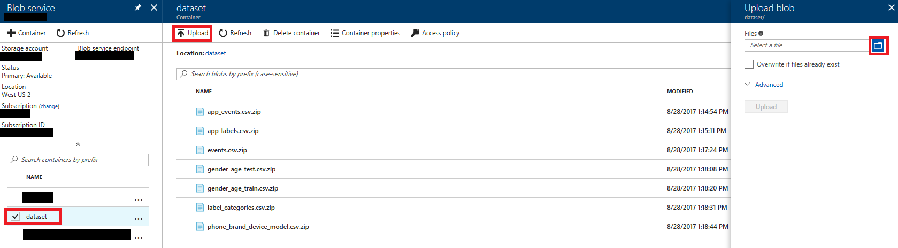
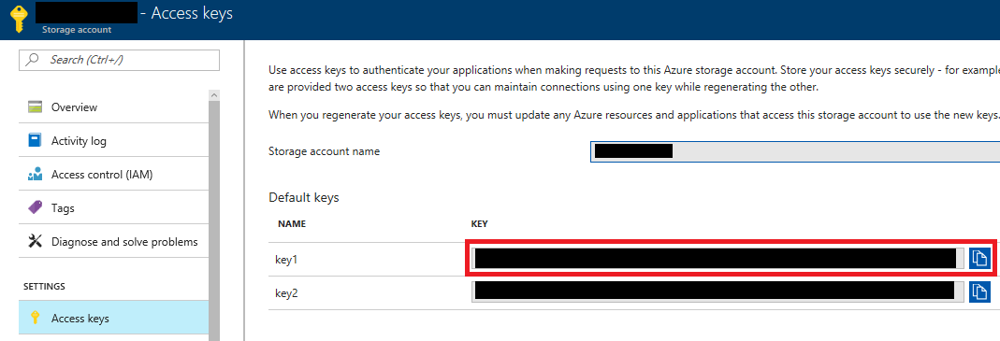
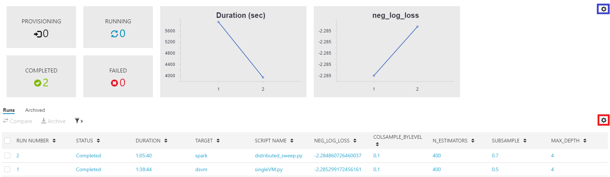

# Distributed tuning of hyperparameters using Azure Machine Learning Workbench

[!INCLUDE [workbench-deprecated](../../../includes/aml-deprecating-preview-2017.md)] 

This scenario shows how to use Azure Machine Learning Workbench to scale out tuning of hyperparameters of machine learning algorithms that implement scikit-learn API. We show how to configure and use a remote Docker container and Spark cluster as an execution backend for tuning hyperparameters.

## Link of the Gallery GitHub repository
Following is the link to the public GitHub repository: 

[https://github.com/Azure/MachineLearningSamples-DistributedHyperParameterTuning](https://github.com/Azure/MachineLearningSamples-DistributedHyperParameterTuning)

## Use case overview

Many machine learning algorithms have one or more knobs, called hyperparameters. These knobs allow tuning of algorithms to optimize their performance over future data, measured according to user-specified metrics (for example, accuracy, AUC, RMSE). Data scientist needs to provide values of hyperparameters when building a model over training data and before seeing the future test data. How based on the known training data can we set up the values of hyperparameters so that the model has a good performance over the unknown test data? 
    
A popular technique for tuning hyperparameters is a *grid search* combined with *cross-validation*. Cross-validation is a technique that assesses how well a model, trained on a training set, predicts over the test set. Using this technique, we first divide the dataset into K folds and then train the algorithm K times in a round-robin fashion. We do this on all but one of the folds called the "held-out fold". We compute the average value of the metrics of K models over K held-out folds. This average value, called *cross-validated performance estimate*, depends on the values of hyperparameters used when creating K models. When tuning hyperparameters, we search through the space of candidate hyperparameter values to find the ones that optimize cross-validation performance estimate. Grid search is a common search technique. In grid search, the space of candidate values of multiple hyperparameters is a cross-product of sets of candidate values of individual hyperparameters. 

Grid search using cross-validation can be time-consuming. If an algorithm has five hyperparameters each with five candidate values, we use K=5 folds. We then complete a grid search by training 56=15625 models. Fortunately, grid-search using cross-validation is an embarrassingly parallel procedure and all these models can be trained in parallel.

## Prerequisites

* An [Azure account](https://azure.microsoft.com/free/) (free trials are available).
* An installed copy of [Azure Machine Learning Workbench](../service/overview-what-is-azure-ml.md) following the [Install and create Quickstart](quickstart-installation.md) to install the Workbench and create accounts.
* This scenario assumes that you are running Azure ML Workbench on Windows 10 or MacOS with Docker engine locally installed. 
* To run the scenario with a remote Docker container, provision Ubuntu Data Science Virtual Machine (DSVM) by following the [instructions](https://docs.microsoft.com/azure/machine-learning/machine-learning-data-science-provision-vm). We recommend using a virtual machine with at least 8 cores and 28 Gb of memory. D4 instances of virtual machines have such capacity. 
* To run this scenario with a Spark cluster, provision Spark HDInsight cluster by following these [instructions](https://docs.microsoft.com/azure/hdinsight/hdinsight-hadoop-provision-linux-clusters). We recommend having a cluster with the following configuration in both header and worker nodes:
    - four worker nodes
    - eight cores
    - 28 Gb of memory  
      
  D4 instances of virtual machines have such capacity. 

     **Troubleshooting**: Your Azure subscription might have a quota on the number of cores that can be used. The Azure portal does not allow the creation of cluster with the total number of cores exceeding the quota. To find you quota, go in the Azure portal to the Subscriptions section, click on the subscription used to deploy a cluster and then click on **Usage+quotas**. Usually quotas are defined per Azure region and you can choose to deploy the Spark cluster in a region where you have enough free cores. 

* Create an Azure storage account that is used for storing the dataset. Follow the [instructions](https://docs.microsoft.com/azure/storage/common/storage-create-storage-account) to create a storage account.

## Data description

We use [TalkingData dataset](https://www.kaggle.com/c/talkingdata-mobile-user-demographics/data). This dataset has events from the apps in cell phones. The goal is to predict gender and age category of cell phone user given the type of the phone and the events that the user generated recently.  

## Scenario structure
This scenario has multiple folders in GitHub repository. Code and configuration files are in **Code** folder, all documentation is in **Docs** folder and all images are **Images** folder. The root folder has README file that contains a brief summary of this scenario.

### Getting started
Click on the Azure Machine Learning Workbench icon to run Azure Machine Learning Workbench and create a project from the  "Distributed Tuning of Hyperparameters" template. You can find detailed instructions on how to create a new project in [Install and create Quickstart](quickstart-installation.md).   

### Configuration of execution environments
We show how to run our code in a remote Docker container and in a Spark cluster. We start with the description of the settings that are common to both environments. 

We use [scikit-learn](https://anaconda.org/conda-forge/scikit-learn), [xgboost](https://anaconda.org/conda-forge/xgboost), and [azure-storage](https://pypi.python.org/pypi/azure-storage) packages that are not provided in the default Docker container of Azure Machine Learning Workbench. azure-storage package requires installation of [cryptography](https://pypi.python.org/pypi/cryptography) and [azure](https://pypi.python.org/pypi/azure) packages. To install these packages in the Docker container and in the nodes of Spark cluster, we modify conda_dependencies.yml file:

    name: project_environment
    channels:
      - conda-forge
    dependencies:
      - python=3.5.2
      - scikit-learn
      - xgboost
      - pip:
        - cryptography
        - azure
        - azure-storage

The modified conda\_dependencies.yml file is stored in aml_config directory of tutorial. 

In the next steps, we connect execution environment to Azure account. Click File Menu from the top left corner of AML Workbench. And choose "Open Command Prompt". Then run in CLI

    az login

You get a message

    To sign in, use a web browser to open the page https://aka.ms/devicelogin and enter the code <code> to authenticate.

Go to this web page, enter the code and sign into your Azure account. After this step, run in CLI

    az account list -o table

and find the Azure subscription ID that has your AML Workbench Workspace account. Finally, run in CLI

    az account set -s <subscription ID>

to complete the connection to your Azure subscription.

In the next two sections, we show how to complete configuration of remote docker and Spark cluster.

#### Configuration of remote Docker container

 To set up a remote Docker container, run in CLI

    az ml computetarget attach remotedocker --name dsvm --address <IP address> --username <username> --password <password> 

with IP address, user name and password in DSVM. IP address of DSVM can be found in Overview section of your DSVM page in Azure portal:

#### Configuration of Spark cluster

To set up Spark environment, run in CLI

    az ml computetarget attach cluster --name spark --address <cluster name>-ssh.azurehdinsight.net  --username <username> --password <password> 

with the name of the cluster, cluster's SSH user name and password. The default value of SSH user name is `sshuser`, unless you changed it during provisioning of the cluster. The name of the cluster can be found in Properties section of your cluster page in Azure portal:

We use spark-sklearn package to have Spark as an execution environment for distributed tuning of hyperparameters. We modified spark_dependencies.yml file to install this package when Spark execution environment is used:

    configuration: 
      #"spark.driver.cores": "8"
      #"spark.driver.memory": "5200m"
      #"spark.executor.instances": "128"
      #"spark.executor.memory": "5200m"  
      #"spark.executor.cores": "2"
  
    repositories:
      - "https://mmlspark.azureedge.net/maven"
      - "https://spark-packages.org/packages"
    packages:
      - group: "com.microsoft.ml.spark"
        artifact: "mmlspark_2.11"
        version: "0.7.91"
      - group: "databricks"
        artifact: "spark-sklearn"
        version: "0.2.0"

The modified spark\_dependencies.yml file is stored in aml_config directory of tutorial. 

### Data ingestion
The code in this scenario assumes that the data is stored in Azure blob storage. We show initially how to download data from Kaggle site to your computer and upload it to the blob storage. Then we show how to read the data from blob storage. 

To download data from Kaggle, go to [dataset page](https://www.kaggle.com/c/talkingdata-mobile-user-demographics/data) and click Download button. You will be asked to log in to Kaggle. After logging in, you will be redirected back to dataset page. Then download the first seven files in the left column by selecting them and clicking Download button. The total size of the downloaded files is 289 Mb. To upload these files to blob storage, create blob storage container 'dataset' in your storage account. You can do that by going to Azure page of your storage account, clicking Blobs and then clicking +Container. Enter 'dataset' as Name and click OK. The following screenshots illustrate these steps:

After that, select dataset container from the list and click Upload button. Azure portal allows you to upload multiple files concurrently. In "Upload blob" section click folder button, select all files from the dataset, click Open, and then click Upload. The following screenshot illustrates these steps:

 

Upload of the files takes several minutes, depending on your Internet connection. 

In our code, we use [Azure Storage SDK](https://docs.microsoft.com/python/azure/) to download the dataset from blob storage to the current execution environment. The download is performed in load\_data() function from load_data.py file. To use this code, you need to replace <ACCOUNT_NAME> and <ACCOUNT_KEY> with the name and primary key of your storage account that hosts the dataset. You can see the account name in the top left corner of your storage account's Azure page. To get account key, select Access Keys in Azure page of storage account (see the first screenshot in Data Ingestion section) and then copy the long string in the first row of key column:
 

The following code from load_data() function downloads a single file:

    from azure.storage.blob import BlockBlobService

    # Define storage parameters 
    ACCOUNT_NAME = "<ACCOUNT_NAME>"
    ACCOUNT_KEY = "<ACCOUNT_KEY>"
    CONTAINER_NAME = "dataset"

    # Define blob service     
    my_service = BlockBlobService(account_name=ACCOUNT_NAME, account_key=ACCOUNT_KEY)

    # Load blob
    my_service.get_blob_to_path(CONTAINER_NAME, 'app_events.csv.zip', 'app_events.csv.zip')

Notice that you do not need to run load_data.py file manually. It is called from other files later on.

### Feature engineering
The code for computing all features is in feature\_engineering.py file. You do not need to run feature_engineering.py file manually. Later on it will be called from other files.

We create multiple feature sets:
* One-hot encoding of brand and model of the cell phone (one\_hot\_brand_model function)
* Fraction of events generated by user in each weekday (weekday\_hour_features function)
* Fraction of events generated by user in each hour (weekday\_hour_features function)
* Fraction of events generated by user in each combination of weekday and hour (weekday\_hour_features function)
* Fraction of events generated by user in each app (one\_hot\_app_labels function)
* Fraction of events generated by user in each app label (one\_hot\_app_labels function)
* Fraction of events generated by user in each app category (text\_category_features function)
* Indicator features for categories of apps that were used to generated events (one\_hot_category function)

These features were inspired by Kaggle kernel [A linear model on apps and labels](https://www.kaggle.com/dvasyukova/a-linear-model-on-apps-and-labels).

The computation of these features requires significant amount of memory. Initially we tried to compute features in the local environment with 16-GB RAM. We were able to compute the first four sets of features, but received 'Out of memory' error when computing the fifth feature set. The computation of the first four feature sets is in singleVMsmall.py file and it can be executed in the local environment by running 

     az ml experiment submit -c local .\singleVMsmall.py   

in CLI window.

Since local environment is too small for computing all feature sets, we switch to remote DSVM that has larger memory. The execution inside DSVM is done inside Docker container that is managed by AML Workbench. Using this DSVM we are able to compute all features and train models and tune hyperparameters (see the next section). singleVM.py file has complete feature computation and modeling code. In the next section, we will show how to run singleVM.py in remote DSVM. 

### Tuning hyperparameters using remote DSVM
We use [xgboost](https://anaconda.org/conda-forge/xgboost) implementation [1] of gradient tree boosting. We also use [scikit-learn](http://scikit-learn.org/) package to tune hyperparameters of xgboost. Although xgboost is not part of scikit-learn package, it implements scikit-learn API and hence can be used together with hyperparameter tuning functions of scikit-learn. 

Xgboost has eight hyperparameters, described [here](https://github.com/dmlc/xgboost/blob/master/doc/parameter.md):
* n_estimators
* max_depth
* reg_alpha
* reg_lambda
* colsample\_by_tree
* learning_rate
* colsample\_by_level
* subsample
* objective  
 
Initially, we use remote DSVM and tune hyperparameters from a small grid of candidate values:

    tuned_parameters = [{'n_estimators': [300,400], 'max_depth': [3,4], 'objective': ['multi:softprob'], 'reg_alpha': [1], 'reg_lambda': [1], 'colsample_bytree': [1],'learning_rate': [0.1], 'colsample_bylevel': [0.1,], 'subsample': [0.5]}]  

This grid has four combinations of values of hyperparameters. We use 5-fold cross validation, resulting in 4x5=20 runs of xgboost. To measure performance of the models, we use negative log loss metric. The following code finds the values of hyperparameters from the grid that maximize the cross-validated negative log loss. The code also uses these values to train the final model over the full training set:

    clf = XGBClassifier(seed=0)
    metric = 'neg_log_loss'
    
    clf_cv = GridSearchCV(clf, tuned_parameters, scoring=metric, cv=5, n_jobs=8)
    model = clf_cv.fit(X_train,y_train)

After creating the model, we save the results of the hyperparameter tuning. We use logging API of AML Workbench to save the best values of hyperparameters and corresponding cross-validated estimate of the negative log loss:

    from azureml.logging import get_azureml_logger

    # initialize logger
    run_logger = get_azureml_logger()

    ...

    run_logger.log(metric, float(clf_cv.best_score_))

    for key in clf_cv.best_params_.keys():
        run_logger.log(key, clf_cv.best_params_[key]) 

We also create sweeping_results.txt file with cross-validated, negative log losses of all combinations of hyperparameter values in the grid.

    if not path.exists('./outputs'):
        makedirs('./outputs')
    outfile = open('./outputs/sweeping_results.txt','w')

    print("metric = ", metric, file=outfile)
    for i in range(len(model.grid_scores_)):
        print(model.grid_scores_[i], file=outfile)
    outfile.close()

This file is stored in a special ./outputs directory. Later on we show how to download it.  

 Before running singleVM.py in remote DSVM for the first time, we create a Docker container there by running 

    az ml experiment prepare -c dsvm

in CLI windows. Creation of Docker container takes several minutes. After that we run singleVM.py in DSVM:

    az ml experiment submit -c dsvm .\singleVM.py

This command finishes in 1 hour 38 minutes when DSVM has 8 cores and 28 Gb of memory. The logged values can be viewed in Run History window of AML Workbench:

By default Run History window shows values and graphs of the first 1-2 logged values. To see the full list of the chosen values of hyperparameters, click on the settings icon marked with red circle in the previous screenshot. Then, select the hyperparameters to be shown in the table. Also, to select the graphs that are shown in the top part of Run History window, click on the setting icon marked with blue circle and select the graphs from the list. 

The chosen values of hyperparameters can also be examined in Run Properties window: 

In the top right corner of Run Properties window, there is a section Output Files with the list of all files that were created in '.\output' folder. sweeping\_results.txt can be downloaded from there by selecting it and clicking Download button. sweeping_results.txt should have the following output:

    metric =  neg_log_loss
    mean: -2.29096, std: 0.03748, params: {'colsample_bytree': 1, 'learning_rate': 0.1, 'subsample': 0.5, 'n_estimators': 300, 'reg_alpha': 1, 'objective': 'multi:softprob', 'colsample_bylevel': 0.1, 'reg_lambda': 1, 'max_depth': 3}
    mean: -2.28712, std: 0.03822, params: {'colsample_bytree': 1, 'learning_rate': 0.1, 'subsample': 0.5, 'n_estimators': 400, 'reg_alpha': 1, 'objective': 'multi:softprob', 'colsample_bylevel': 0.1, 'reg_lambda': 1, 'max_depth': 3}
    mean: -2.28706, std: 0.03863, params: {'colsample_bytree': 1, 'learning_rate': 0.1, 'subsample': 0.5, 'n_estimators': 300, 'reg_alpha': 1, 'objective': 'multi:softprob', 'colsample_bylevel': 0.1, 'reg_lambda': 1, 'max_depth': 4}
    mean: -2.28530, std: 0.03927, params: {'colsample_bytree': 1, 'learning_rate': 0.1, 'subsample': 0.5, 'n_estimators': 400, 'reg_alpha': 1, 'objective': 'multi:softprob', 'colsample_bylevel': 0.1, 'reg_lambda': 1, 'max_depth': 4}

### Tuning hyperparameters using Spark cluster
We use Spark cluster to scale out tuning hyperparameters and use larger grid. Our new grid is

    tuned_parameters = [{'n_estimators': [300,400], 'max_depth': [3,4], 'objective': ['multi:softprob'], 'reg_alpha': [1], 'reg_lambda': [1], 'colsample_bytree': [1], 'learning_rate': [0.1], 'colsample_bylevel': [0.01, 0.1], 'subsample': [0.5, 0.7]}]

This grid has 16 combinations of values of hyperparameters. Since we use 5-fold cross validation, we run xgboost 16x5=80 times.

scikit-learn package does not have a native support of tuning hyperparameters using Spark cluster. Fortunately, [spark-sklearn](https://spark-packages.org/package/databricks/spark-sklearn) package from Databricks fills this gap. This package provides GridSearchCV function that has almost the same API as GridSearchCV function in scikit-learn. To use spark-sklearn and tune hyperparameters using Spark we need to create a Spark context

    from pyspark import SparkContext
    sc = SparkContext.getOrCreate()

Then we replace 

    from sklearn.model_selection import GridSearchCV

with 

    from spark_sklearn import GridSearchCV

Also we replace the call to GridSearchCV from scikit-learn to the one from spark-sklearn:

    clf_cv = GridSearchCV(sc = sc, param_grid = tuned_parameters, estimator = clf, scoring=metric, cv=5)

The final code for tuning hyperparameters using Spark is in distributed\_sweep.py file. The difference between singleVM.py and distributed_sweep.py is in definition of grid and additional four lines of code. Notice also that due to AML Workbench services, the logging code does not change when changing execution environment from remote DSVM to Spark cluster.

Before running distributed_sweep.py in Spark cluster for the first time, we need to install Python packages there. This can be achieved by running 

    az ml experiment prepare -c spark

in CLI windows. This installation takes several minutes. After that we run distributed_sweep.py in Spark cluster:

    az ml experiment submit -c spark .\distributed_sweep.py

This command finishes in 1 hour 6 minutes when Spark cluster has 6 worker nodes with 28 Gb of memory. The results of hyperparameter-tuning can be accessed in Azure Machine Learning Workbench the same way as remote DSVM execution. (namely logs, best values of hyperparameters, and sweeping_results.txt file)

### Architecture diagram

The following diagram shows the overall workflow:
 

## Conclusion 

In this scenario, we showed how to use Azure Machine Learning Workbench to perform tuning of hyperparameters in remote virtual machines and Spark clusters. We saw that Azure Machine Learning Workbench provides tools for easy configuration of execution environments. It also allows easily switching between them. 

## References

[1] T. Chen and C. Guestrin. [XGBoost: A Scalable Tree Boosting System](https://arxiv.org/abs/1603.02754). KDD 2016.

