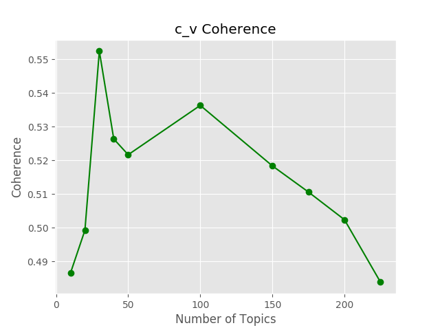

# Document Collection Analysis

[!INCLUDE [workbench-deprecated](../../../includes/aml-deprecating-preview-2017.md)] 


This scenario demonstrates how to summarize and analyze a large collection of documents, including techniques such as phrase learning, topic modeling, and topic model analysis using Azure ML Workbench. Azure Machine Learning Workbench provides for easy scale up for very large document collection, and provides mechanisms to train and tune models within a variety of compute contexts, ranging from local compute to Data Science Virtual Machines to Spark Cluster. Easy development is provided through Jupyter notebooks within Azure Machine Learning Workbench.

## Link to the Gallery GitHub repository

The public GitHub repository for this real world scenario contains all materials, including code samples, needed for this example:

[https://github.com/Azure/MachineLearningSamples-DocumentCollectionAnalysis](https://github.com/Azure/MachineLearningSamples-DocumentCollectionAnalysis)

## Overview

With a large amount of data (especially unstructured text data) collected every day, a significant challenge is to organize, search, and understand vast quantities of these texts. This document collection analysis scenario demonstrates an efficient and automated end-to-end workflow for analyzing large document collection and enabling downstream NLP tasks.

The key elements delivered by this scenario are:

1. Learning salient multi-words phrase from documents.

1. Discovering underlying topics presented in the document collection.

1. Representing documents by the topical distribution.

1. Presenting methods for organizing, searching, and summarizing documents based on the topical content.

The methods presented in this scenario could enable a variety of critical industrial workloads, such as discovery of topic trends anomaly, document collection summarization, and similar document search. It can be applied to many different types of document analysis, such as government legislation, news stories, product reviews, customer feedbacks, and scientific research articles.

The machine learning techniques/algorithms used in this scenario include:

1. Text processing and cleaning

1. Phrase Learning

1. Topic modeling

1. Corpus summarization

1. Topical trends and anomaly detection

## Prerequisites

The prerequisites to run this example are as follows:

* Make sure that you have properly installed [Azure Machine Learning Workbench](../service/overview-what-is-azure-ml.md) by following the [Install and create Quickstart](quickstart-installation.md).

* This example could be run on any compute context. However, it is recommended to run it on a multi-core machine with at least of 16-GB memory and 5-GB disk space.

## Create a new Workbench project

Create a new project using this example as a template:
1.	Open Azure Machine Learning Workbench
2.	On the **Projects** page, click the **+** sign and select **New Project**
3.	In the **Create New Project** pane, fill in the information for your new project
4.	In the **Search Project Templates** search box, type "Document Collection Analysis" and select the template
5.	Click **Create**

## Data description

The dataset used in this scenario contains text summaries and associated meta data for each legislative action taken by the US Congress. The data is collected from [GovTrack.us](https://www.govtrack.us/), which tracks the activities of United States Congress and helps Americans participate in their national legislative process. The bulk data can be downloaded via [this link](https://www.govtrack.us/data/congress/) using a manual script, which is not included in this scenario. The details of how to download the data could be found in the [GovTrack API documentation](https://www.govtrack.us/developers).

### Data source

In this scenario, the raw data collected is a series of legislative actions introduced by the US Congress (proposed bills and resolutions) from 1973 to June 2017 (the 93rd to the 115th Congresses). The data collected is in JSON format and contains a rich set of information about the legislative actions. Refer to [this GitHub link](https://github.com/unitedstates/congress/wiki/bills) for detailed description of the data fields. For the demonstration purpose within this scenario, only a subset of data fields were extracted from the JSON files. A pre-compiled TSV file `CongressionalDataAll_Jun_2017.tsv` containing records of those legislative actions is provided in this scenario. The TSV file can be downloaded automatically either by the notebooks `1_Preprocess_Text.ipynb` under the notebook folder or `preprocessText.py` in the Python package.

### Data structure

There are nine data fields in the data file. The data field names and the descriptions are listed as follows.

| Field Name | Type | Description | Contain Missing Value |
|------------|------|-------------|---------------|
| `ID` | String | The ID of the bill/resolution. The format of this field is [bill_type][number]-[congress]. For example, "hconres1-93" means the bill type is "hconres" (stands for House Concurrent Resolution, refer to [this document](https://github.com/unitedstates/congress/wiki/bills#basic-information)), the bill number is '1' and the congress number is '93'. | No |
| `Text` | String | The content of the bill/resolution. | No |
| `Date` | String | The date the bill/resolution initially proposed. In a format of 'yyyy-mm-dd'. | No |
| `SponsorName` | String | The name of the primary sponsor that proposed the bill/resolution. | Yes |
| `Type` | String | The title type of the primary sponsor, either 'rep' (representative) or 'sen' (senator). | Yes |
| `State` | String | The state of the primary sponsor. | Yes |
| `District` | Integer | The district number of the primary sponsor if the title of the sponsor is a representative. | Yes |
| `Party` | String | The party of the primary sponsor. | Yes |
| `Subjects` | String | The subject terms added cumulatively by the Library of Congress to the bill. The terms are concatenated by commas. These terms are written by a human in the Library of Congress, and are not usually present when information on the bill is first published. They can be added at any time. Thus by the end of life of a bill, some subject may not be relevant anymore. | Yes |

## Scenario structure

The document collection analysis example is organized into two types of deliverables. The first type is a series of iPython Notebooks that show the step-by-step descriptions of the entire workflow. The second type is a Python package as well as some code examples of how to use that package. The Python package is generic enough to serve many use cases.

The files in this example are organized as follows.

| File Name | Type | Description |
|-----------|------|-------------|
| `aml_config` | Folder | Azure Machine Learning Workbench configuration folder, refer to [this documentation](./experimentation-service-configuration-reference.md) for detailed experiment execution configuration |
| `Code` | Folder | The code folder used to save the Python scripts and Python package |
| `Data` | Folder | The data folder used to save intermediate files |
| `notebooks` | Folder | The Jupyter notebooks folder |
| `Code/documentAnalysis/__init__.py` | Python file | The Python package init file |
| `Code/documentAnalysis/configs.py` | Python file | The configuration file used by the document analysis Python package, including predefined constants |
| `Code/documentAnalysis/preprocessText.py` | Python file | The Python file used to preprocess the data for downstream tasks |
| `Code/documentAnalysis/phraseLearning.py` | Python file | The Python file used to learn phrases from the data and transform the raw data |
| `Code/documentAnalysis/topicModeling.py` | Python file | The Python file used to train a Latent Dirichlet Allocation (LDA) topic model |
| `Code/step1.py` | Python file | Step 1 of document collection analysis: preprocess text |
| `Code/step2.py` | Python file | Step 2 of document collection analysis: phrase learning |
| `Code/step3.py` | Python file | Step 3 of document collection analysis: train and evaluate LDA topic model |
| `Code/runme.py` | Python file | Example of run all steps in one file |
| `notebooks/1_Preprocess_Text.ipynb` | iPython Notebook | Preprocess text and transform the raw data |
| `notebooks/2_Phrase_Learning.ipynb` | iPython Notebook | Learn phrases from text data (after data transform) |
| `notebooks/3_Topic_Model_Training.ipynb` | iPython Notebook | Train LDA topic model |
| `notebooks/4_Topic_Model_Summarization.ipynb` | iPython Notebook | Summarize the contents of the document collection based on a trained LDA topic model |
| `notebooks/5_Topic_Model_Analysis.ipynb` | iPython Notebook | Analyze the topical content of a collection of text documents and correlate topical information against other meta-data associated with the document collection |
| `notebooks/6_Interactive_Visualization.ipynb` | iPython Notebook | Interactive visualization of learned topic model |
| `notebooks/winprocess.py` | Python file | The python script for multiprocessing used by notebooks |
| `README.md` | Markdown file | The README markdown file |

### Data ingestion and transformation

The compiled dataset `CongressionalDataAll_Jun_2017.tsv` is saved in Blob Storage and is accessible both from within the notebooks and the Python scripts. There are two steps for data ingestion and transformation: preprocessing the text data, and phrase learning.

#### Preprocess text data

The preprocessing step applies natural language processing techniques to clean and prepare the raw text data. It serves as a precursor for the unsupervised phrase learning and latent topic modeling. The detailed step-by-step description can be found in the notebook `1_Preprocess_Text.ipynb`. There is also a Python script `step1.py` corresponds to this notebook.

In this step, the TSV data file is downloaded from the Azure Blob Storage and imported as a Pandas DataFrame. Each row element in the DataFrame is a single cohesive long string of text or a 'document'. Each document is then split into chunks of text that are likely to be sentences, phrases, or subphrases. The splitting is designed to prohibit the phrase learning process from using cross-sentence or cross-phrase word strings when learning phrases.

There are multiple functions defined for the preprocessing step both in the notebook and the Python package. The majority of the job can be achieved by calling those two lines of codes.

```python
# Read raw data into a Pandas DataFrame
textDF = getData()

# Write data frame with preprocessed text out to TSV file
cleanedDataFrame = CleanAndSplitText(textDF, saveDF=True)
```

#### Phrase learning

The phrase learning step implements a basic framework to learn key phrases among a large collection of documents. It is described in the paper entitled "[Modeling Multiword Phrases with Constrained Phrases Tree for Improved Topic Modeling of Conversational Speech](http://people.csail.mit.edu/hazen/publications/Hazen-SLT-2012.pdf)", which was originally presented in the 2012 IEEE Workshop on Spoken Language Technology. The detailed implementation of phrase learning step is shown in the iPython Notebook `2_Phrase_Learning.ipynb` and the Python script `step2.py`.

This step takes the cleaned text as input and learns the most salient phrases present in a large collection of documents. The phrase learning is an iterative process that can be divided into three tasks: count n-grams, rank potential phrases by the Weighted Pointwise Mutual Information of their constituent words, and rewrite phrase to text. Those three tasks are executed sequentially in multiple iterations until the specified phrases have been learned.

In the document analysis Python package, a Python Class `PhraseLearner` is defined in the `phraseLearning.py` file. Below is the code snippet used to learn phrases.

```python
# Instantiate a PhraseLearner and run a configuration
phraseLearner = PhraseLearner(cleanedDataFrame, "CleanedText", numPhrase,
                        maxPhrasePerIter, maxPhraseLength, minInstanceCount)

# The chunks of text in a list
textData = list(phraseLearner.textFrame['LowercaseText'])

# Learn most salient phrases present in a large collection of documents
phraseLearner.RunConfiguration(textData,
            phraseLearner.learnedPhrases,
            addSpace=True,
            writeFile=True,
            num_workers=cpu_count()-1)
```

> [!NOTE]
> The phrase learning step is implemented with multiprocessing. However, more CPU cores do **NOT** mean a faster execution time. In our tests, the performance is not improved with more than eight cores due to the overhead of multiprocessing. It took about two and a half hours to learn 25,000 phrases on a machine with eight cores (3.6 GHz).
>

### Topic modeling

Learning a latent topic model use LDA is the third step in this scenario. The [gensim](https://radimrehurek.com/gensim/) Python package is required in this step to learn an [LDA topic model](https://en.wikipedia.org/wiki/Latent_Dirichlet_allocation). The corresponding notebook for this step is `3_Topic_Model_Training.ipynb`. You can also refer to `step3.py` for how to use the document analysis package.

In this step, the main task is to learn an LDA topic model and tune the hyper parameters. There are multiple parameters need to be tuned when train an LDA model, but the most important parameter is the number of topics. Too few topics may not have insight to the document collection; while choosing too many will result in the "over-clustering" of a corpus into many small, highly similar topics. The purpose of this scenario is to show how to tune the number of topics. Azure Machine Learning Workbench provides the freedom to run experiments with different parameter configuration on different compute contexts.

In the document analysis Python package, a few functions were defined to help the users figure out the best number of topics. The first approach is by evaluating the coherence of the topic model. There are four evaluation matrices supported: `u_mass`, `c_v`, `c_uci`, and `c_npmi`. The details of those four metrics are discussed in [this paper](http://svn.aksw.org/papers/2015/WSDM_Topic_Evaluation/public.pdf). The second approach is to evaluate the perplexity on a held-out corpus.

For the perplexity evaluation, a 'U' shape curve is expected to find out the best number of topics. And the elbow position is the best choice. It is recommended to evaluate multiple times with different random seed and get the average. The coherence evaluate is expected to be a 'n' shape, which means the coherence increases with increasing the number of topics and then decrease. An example plot of perplexity and `c_v` coherence is showing as follows.




In this scenario, the perplexity increases significantly after 200 topics, while the coherence value decreases significantly after 200 topics as well. Based on those graphs and the desire for more general topics versus over clustered topics, choose 200 topics should be a good option.

You can train one LDA topic model in one experiment run, or train and evaluate multiple LDA models with different topic number configurations in a single experiment run. It is recommended to run multiple times for one configuration and then get the average coherence and/or perplexity evaluations. The details of how to use the document analysis package can be found in `step3.py` file. An example code snippet is as follows.

```python
topicmodeler = TopicModeler(docs,
        stopWordFile=FUNCTION_WORDS_FILE,
        minWordCount=MIN_WORD_COUNT,
        minDocCount=MIN_DOC_COUNT,
        maxDocFreq=MAX_DOC_FREQ,
        workers=cpu_count()-1,
        numTopics=NUM_TOPICS,
        numIterations=NUM_ITERATIONS,
        passes=NUM_PASSES,
        chunksize=CHUNK_SIZE,
        random_state=RANDOM_STATE,
        test_ratio=test_ratio)

# Train an LDA topic model
lda = topicmodeler.TrainLDA(saveModel=saveModel)

# Evaluate coherence metrics
coherence = topicmodeler.EvaluateCoherence(lda, coherence_types)

# Evaluate perplexity on a held-out corpus
perplex = topicmodeler.EvaluatePerplexity(lda)
```

> [!NOTE]
> The execution time to train an LDA topic model depends on multiple factors such as the size of corpus, hyper parameter configuration, as well as the number of cores on the machine. Using multiple CPU cores trains a model faster. However, with the same hyper parameter setting more cores means fewer updates during training. It is recommended to have **at least 100 updates to train a converged LDA model**. The relationship between number of updates and hyper parameters is discussed in [this post](https://groups.google.com/forum/#!topic/gensim/ojySenxQHi4) and [this post](http://miningthedetails.com/blog/python/lda/GensimLDA/). In our tests, it took about 3 hours to train an LDA model with 200 topics using the configuration of `workers=15`, `passes=10`, `chunksize=1000` on a machine with 16 cores (2.0 GHz).
>

### Topic summarization and analysis

The topic summarization and analysis consists of two notebooks, while there are no corresponding functions in the document analysis package.

In `4_Topic_Model_Summarization.ipynb`, it shows how to summarize the contents of the document based on a trained LDA topic model. The summarization is applied to an LDA topic model learned in step 3. It shows how to measure the importance or quality of a topic using topic to document purity measure. This purity measure assumes latent topics that dominate the documents in which they appear are more semantically important than latent topics that are weakly spread across many documents. This concept was introduced in the paper "[Latent Topic Modeling for Audio Corpus Summarization](http://people.csail.mit.edu/hazen/publications/Hazen-Interspeech11.pdf)."

Notebook `5_Topic_Model_Analysis.ipynb` shows how to analyze the topical content of a collection of documents and correlate topical information against other meta-data associated with the document collection. A few plots are introduced in this notebook to help the users better understand the learned topic and the document collection.

Notebook `6_Interactive_Visualization.ipynb` shows how to interactively visualize learned topic model. It includes four interactive visualization tasks.

## Conclusion

This real world scenario highlights how to use well-known text analytics techniques (in this case, phrase learning and LDA topic modeling) to produce a robust model, and how Azure Machine Learning Workbench can help track model performance and seamlessly run learners at higher scale. In more detail:

* Use phrase learning and topic modeling to process a collection of documents and build a robust model. If the collection of documents is huge, Azure Machine Learning Workbench can easily scale it up and out. Additionally, users have the freedom to run experiments on different compute context easily from within Azure Machine Learning Workbench.

* Azure Machine Learning Workbench provides both options to run notebooks in a step by step manner and Python script to run an entire experiment.

* Hyper-parameter tuning using Azure Machine Learning Workbench to find the best number of topics needed to learn. Azure Machine Learning Workbench can help track the model performance and seamlessly run different learners at higher scale.

* Azure Machine Learning Workbench can manage the run history and learned models. It enables data scientists to quickly identify the best performing models, and to find the scripts and data used to generate them.

## References

* **Timothy J. Hazen, Fred Richardson**, [_Modeling Multiword Phrases with Constrained Phrases Tree for Improved Topic Modeling of Conversational Speech_](http://people.csail.mit.edu/hazen/publications/Hazen-SLT-2012.pdf). Spoken Language Technology Workshop (SLT), 2012 IEEE. IEEE, 2012.

* **Timothy J. Hazen**, [_Latent Topic Modeling for Audio Corpus Summarization_](http://people.csail.mit.edu/hazen/publications/Hazen-Interspeech11.pdf). 12th Annual Conference of the International Speech Communication Association. 2011.

* **Michael Roder, Andreas Both, Alexander Hinneburg**, [_Exploring the Space of Topic Coherence Measures_](http://svn.aksw.org/papers/2015/WSDM_Topic_Evaluation/public.pdf). Proceedings of the eighth ACM international conference on Web search and data mining. ACM, 2015.
