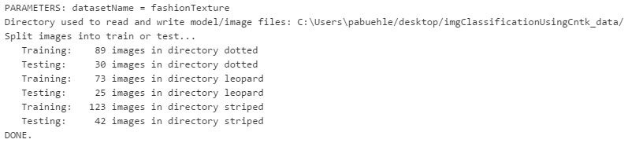
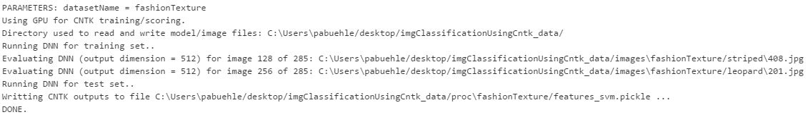
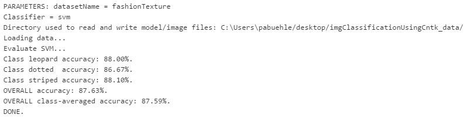
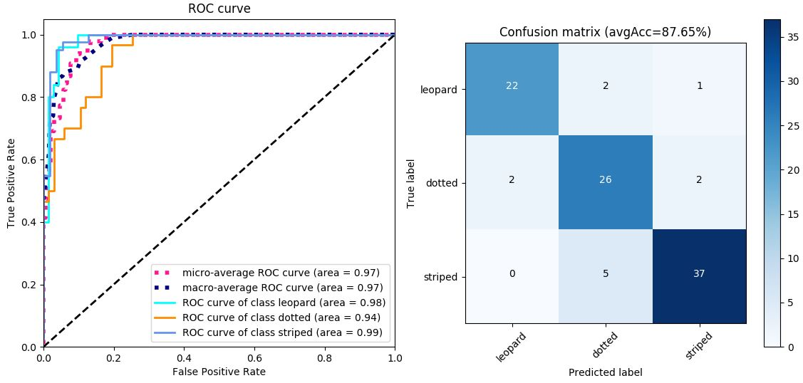
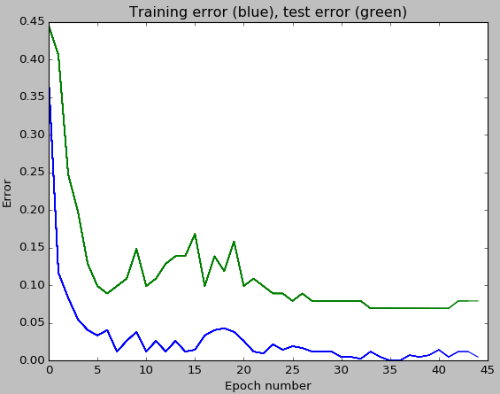
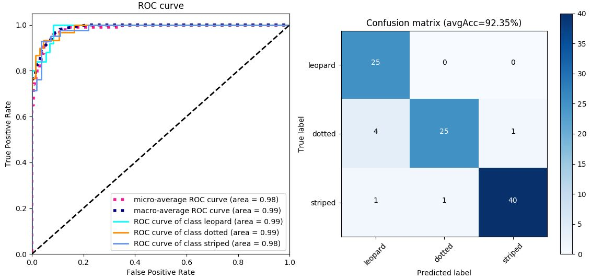
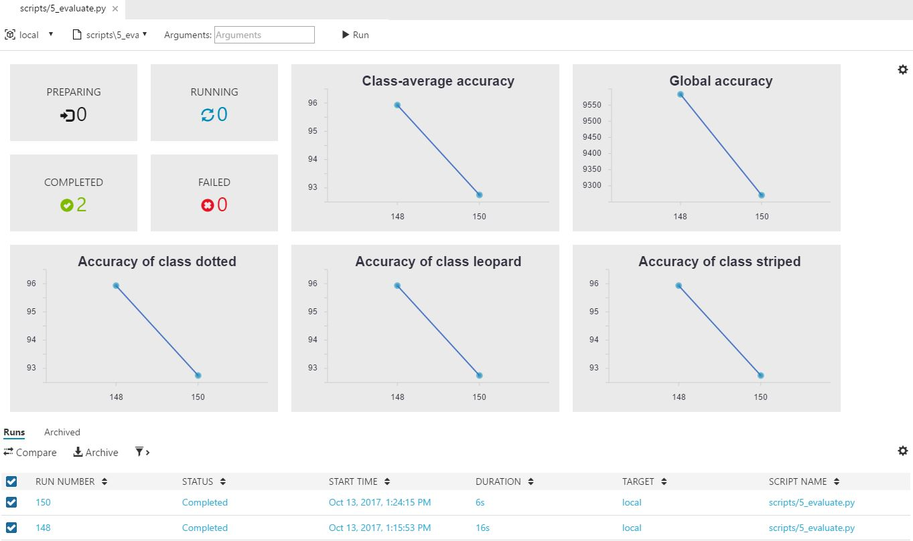
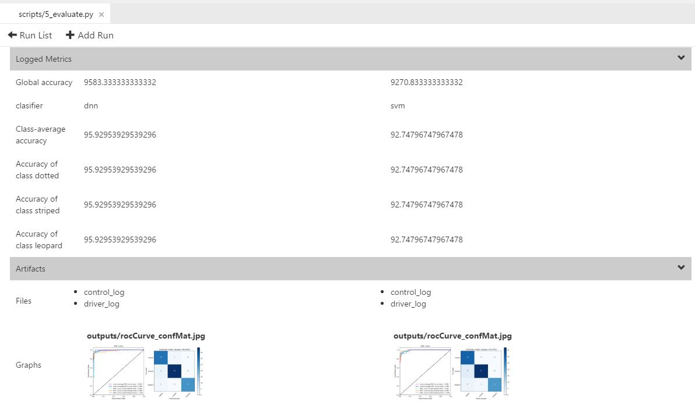
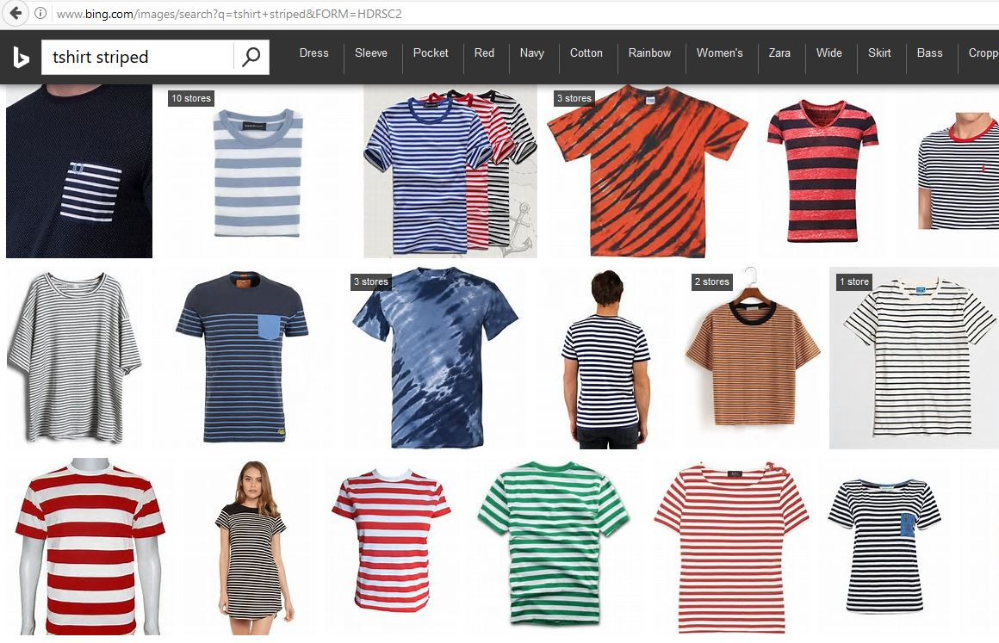

# Image classification using Azure Machine Learning Workbench

[!INCLUDE [workbench-deprecated](../../../includes/aml-deprecating-preview-2017.md)] 


Image classification approaches can be used to solve a large number of Computer Vision problems.
These include building models, which answer questions such as: *Is an OBJECT present in the image?* where OBJECT could for example be *dog*, *car*, or *ship*. Or more complex questions like: *What class of eye disease severity is evinced by this patient's retinal scan?*.

This tutorial addresses solving such problems. We show how to train, evaluate, and deploy your own image classification model using the  [Microsoft Cognitive Toolkit (CNTK) ](https://docs.microsoft.com/cognitive-toolkit/) for deep learning.
Example images are provided, but the reader can also bring their own dataset and train their own custom models.

Computer Vision solutions traditionally required expert knowledge to manually identify and implement so-called *features*, which highlight desired information in images.
This manual approach changed in 2012 with the famous [AlexNet](https://papers.nips.cc/paper/4824-imagenet-classification-with-deep-convolutional-neural-networks.pdf) [1] Deep Learning paper, and at present, Deep Neural Networks (DNN) are used to automatically find these features.
DNNs led to a huge improvement in the field not just for image classification, but also for other Computer Vision problems such as object detection and image similarity.


## Link to the gallery GitHub repository
[https://github.com/Azure/MachineLearningSamples-ImageClassificationUsingCNTK](https://github.com/Azure/MachineLearningSamples-ImageClassificationUsingCNTK)

## Overview

This tutorial is split into three parts:

- Part 1 shows how to train, evaluate, and deploy an image classification system using a pre-trained DNN as featurizer and training an SVM on its output.
- Part 2 then shows how to improve accuracy by, for example, refining the DNN rather than using it as a fixed featurizer.
- Part 3 covers how to use your own dataset instead of the provided example images, and if needed, how to produce your own dataset by scraping images from the net.

While previous experience with machine learning and CNTK is not required, it is helpful for understanding the underlying principles. Accuracy numbers, training time, etc. reported in the tutorial are only for reference, and the actual values when running the code almost certainly differ.


## Prerequisites

The prerequisites to run this example are as follows:

1. An [Azure account](https://azure.microsoft.com/free/) (free trials are available).
2. The [Azure Machine Learning Workbench](../service/overview-what-is-azure-ml.md) following the [quick start installation guide](quickstart-installation.md) to install the program and create a workspace.  
3. A Windows machine. Windows OS is necessary since the Workbench supports only Windows and MacOS, while Microsoft's Cognitive Toolkit (which we use as deep learning library) only supports Windows and Linux.
4. A dedicated GPU is not required to execute the SVM training in part 1, however it is needed for refining of the DNN described in part 2. If you lack a strong GPU, want to train on multiple GPUs, or do not have a Windows machine, then consider using Azure's Deep Learning Virtual Machine with Windows operating system. See [here](https://azuremarketplace.microsoft.com/marketplace/apps/microsoft-ads.dsvm-deep-learning) for a 1-click deployment guide. Once deployed, connect to the VM via a remote desktop connection, install Workbench there, and execute the code locally from the VM.
5. Various Python libraries such as OpenCV need to be installed. Click *Open Command Prompt* from the *File* menu in the Workbench and run the following commands to install these dependencies:  
    - `pip install https://cntk.ai/PythonWheel/GPU/cntk-2.2-cp35-cp35m-win_amd64.whl`  
    - `pip install opencv_python-3.3.1-cp35-cp35m-win_amd64.whl` after downloading the OpenCV wheel from http://www.lfd.uci.edu/~gohlke/pythonlibs/ (the exact filename and version can change)
    - `conda install pillow`
    - `pip install -U numpy`
    - `pip install bqplot`
    - `jupyter nbextension enable --py --sys-prefix bqplot`
    - `jupyter nbextension enable --py widgetsnbextension`

### Troubleshooting / Known bugs
- A GPU is needed for part 2, and otherwise the error "Batch normalization training on CPU is not yet implemented" is thrown when trying to refine the DNN.
- Out-of-memory errors during DNN training can be avoided by reducing the minibatch size (variable `cntk_mb_size` in `PARAMETERS.py`).
- The code was tested using CNTK 2.2, and should run also on older (up to v2.0) and newer versions without any or only minor changes.
- At the time of writing, the Azure Machine Learning Workbench had problems showing notebooks larger than 5 Mbytes. Notebooks of this large size can happen if the notebook is saved with all cell output displayed. If you encounter this error, then open the command prompt from the File menu inside the Workbench, execute `jupyter notebook`, open the notebook, clear all output, and save the notebook. After performing these steps, the notebook will open properly inside the Azure Machine Learning Workbench again.
- All scripts provided in this sample have to be executed locally, and not on e.g. a docker remote environment. All notebooks need to be executed with kernel set to the local project kernel with name "PROJECTNAME local" (e.g. "myImgClassUsingCNTK local").

    
## Create a new workbench project

To create a new project using this example as a template:
1.	Open Azure Machine Learning Workbench.
2.	On the **Projects** page, click the **+** sign and select **New Project**.
3.	In the **Create New Project** pane, fill in the information for your new project.
4.	In the **Search Project Templates** search box, type "Image classification" and select the template.
5.	Click **Create**.

Performing these steps creates the project structure shown below. The project directory is restricted to be less than 25 Mbytes since the Azure Machine Learning Workbench creates a copy of this folder after each run (to enable run history). Hence, all image and temporary files are saved to and from the directory *~/Desktop/imgClassificationUsingCntk_data* (referred to as *DATA_DIR* in this document).

  Folder| Description
  ---|---
  aml_config/|		                     Directory containing the Azure Machine Learning Workbench configuration files
  libraries/|		                       Directory containing all Python and Jupyter helper functions
  notebooks/|		                       Directory containing all notebooks
  resources/|		                       Directory containing all resources (for example url of fashion images)
  scripts/|		                         Directory containing all scripts
  PARAMETERS.py|                       Python script specifying all parameters
  readme.md|                           This readme document


## Data description

This tutorial uses as running example an upper body clothing texture dataset consisting of up to 428 images. Each image is annotated as one of three different textures (dotted, striped, leopard). We kept the number of images small so that this tutorial can be executed quickly. However, the code is well-tested and works with tens of thousands of images or more. All images were hand-annotated as is explained in [Part 3](#using-a-custom-dataset). The image URLs with their respective attributes are listed in the */resources/fashionTextureUrls.tsv* file.

The script `0_downloadData.py` downloads all images to the *DATA_DIR/images/fashionTexture/* directory. Some of the 428 URLs are likely broken. This is not an issue, and just means that we have slightly fewer images for training and testing. All scripts provided in this sample have to be executed locally, and not on e.g. a docker remote environment.

The following figure shows examples for the attributes dotted (left), striped (middle), and leopard (right). Annotations were done according to the upper body clothing item.

<p align="center">

</p>


## Part 1 - Model training and evaluation

In the first part of this tutorial, we are training a system that uses, but does not modify, a pre-trained deep neural network. This pre-trained DNN is used as a featurizer, and a linear SVM is trained to predict the attribute (dotted, striped, or leopard) of a given image.

We now described this approach in detail, step-by-step, and show which scripts need to be executed. We recommend after each step to inspect which files are written and where they are written to.

All important parameters are specified, and a short explanation provided, in a single place: the  `PARAMETERS.py` file.


### Step 1: Data preparation
`Script: 1_prepareData.py. Notebook: showImages.ipynb`

The notebook `showImages.ipynb` can be used to visualize the images, and to correct their annotation as needed. To run the notebook, open it in Azure Machine Learning Workbench, click on "Start Notebook Server" if this option is shown, change to the local project kernel with name "PROJECTNAME local" (e.g. "myImgClassUsingCNTK local"), and then execute all cells in the notebook. See the troubleshooting section in this document if you get an error complaining that the notebook is too large to be displayed.
<p align="center">

</p>

Now execute the script named `1_prepareData.py`, which assigns all images to either the training set or the test set. This assignment is mutually exclusive - no training image is also used for testing or vice versa. By default, a random 75% of the images from each attribute class are assigned to training, and the remaining 25% are assigned to testing. All data generated by the script are saved in the *DATA_DIR/proc/fashionTexture/* folder.

<p align="center">

</p>


### Step 2: Refining the Deep Neural Network
`Script: 2_refineDNN.py`

As we explained in part 1 of this tutorial, the pre-trained DNN is kept fixed (that is, it is not refined). However, the script named `2_refineDNN.py` is still executed in part 1, as it loads a pre-trained [ResNet](https://www.cv-foundation.org/openaccess/content_cvpr_2016/papers/He_Deep_Residual_Learning_CVPR_2016_paper.pdf) [2] model and modifies it, for example, to allow for higher input image resolution. This step is fast (seconds) and does not require a GPU.

In part 2 of the tutorial, a modification to the PARAMETERS.py file causes the `2_refineDNN.py` script to also refine the pre-trained DNN. By default, we run 45 training epochs during refinement.

In both cases, the final model is then written to the file *DATA_DIR/proc/fashionTexture/cntk_fixed.model*.

### Step 3: Evaluate DNN for all images
`Script: 3_runDNN.py`

We can now use the (possibly refined) DNN from the last step to featurize our images. Given an image as input to the DNN, the output is the 512-floats vector from the penultimate layer of the model. This vector is much smaller dimensional than the image itself. Nevertheless, it should contain (and even highlight) all information in the image relevant to recognize the image's attribute, that is, if the clothing item has a dotted, striped, or leopard texture.

All of the DNN image representations are saved to the file *DATA_DIR/proc/fashionTexture/cntkFiles/features.pickle*.

<p align="center">

</p>


### Step 4: Support Vector Machine training
`Script: 4_trainSVM.py`

The 512-floats representations computed in the last step are now used to train an SVM classifier: given an image as input, the SVM outputs a score for each attribute to be present. In our example dataset, this means a score for 'striped', for 'dotted', and for 'leopard'.

Script `4_trainSVM.py` loads the training images, trains an SVM for different values of the regularization (slack) parameter C, and keeps the SVM with highest accuracy. The classification accuracy is printed on the console and plotted in the Workbench. For the provided texture data these values should be around 100% and 88% respectively. Finally, the trained SVM is written to the file *DATA_DIR/proc/fashionTexture/cntkFiles/svm.np*.

<p align="center">

</p>


### Step 5: Evaluation and visualization
`Script: 5_evaluate.py. Notebook: showResults.ipynb`

The accuracy of the trained image classifier can be measured using the script `5_evaluate.py`. The script scores all test images using the trained SVM classifier, assigns each image the attribute with the highest score, and compares the predicted attributes with the ground truth annotations.

The output of script `5_evaluate.py` is shown below. The classification accuracy of each individual class is computed, as well as the accuracy for the full test set ('overall accuracy'), and the average over the individual accuracies ('overall class-averaged accuracy'). 100% corresponds to the best possible accuracy and 0% to the worst. Random guessing would on average produce a class-averaged accuracy of 1 over the number of attributes: in our case, this accuracy would be 33.33%. These results improve significantly when using a higher input resolution such as `rf_inputResoluton = 1000`, however at the expense of longer DNN computation times.

<p align="center">

</p>

In addition to accuracy, the ROC curve is plotted with respective area-under-curve (left); and the confusion matrix is shown (right):

<p align="center">

</p>

Finally, the notebook `showResults.py` is provided to scroll through the test images and visualize their respective classification scores. As explained in step1, every notebook in this sample needs to use the local project kernel with name "PROJECTNAME local":
<p align="center">

</p>


### Step 6: Deployment
`Scripts: 6_callWebservice.py, deploymain.py. Notebook: deploy.ipynb`

The trained system can now be published as a REST API. Deployment is explained in the notebook `deploy.ipynb`, and based on functionality within the Azure Machine Learning Workbench (remember to set as kernel the local project kernel with name "PROJECTNAME local"). See also the excellent deployment section of the [IRIS tutorial](tutorial-classifying-iris-part-3.md) for more deployment related information.

Once deployed, the web service can be called using the script `6_callWebservice.py`. Note that the IP address (either local or on the cloud) of the web service needs to be set first in the script. The notebook `deploy.ipynb` explains how to find this IP address.


## Part 2 - Accuracy improvements

In part 1, we showed how to classify an image by training a linear Support Vector Machine on the 512-floats output of a Deep Neural Network. This DNN was pre-trained on millions of images, and the penultimate layer returned as feature vector. This approach is fast since the DNN is used as-is, but nevertheless often gives good results.

We now present several ways to improve the accuracy of the model from part 1. Most notably we refine the DNN rather than keeping it fixed.

### DNN refinement

Instead of an SVM, one can do the classification directly in the neural network. This is achieved by adding a new last layer to the pre-trained DNN, which takes the 512-floats from the penultimate layer as input. The advantage of doing the classification in the DNN is that now the full network can be retrained using backpropagation. This approach often leads to much better classification accuracies compared to using the pre-trained DNN as-is, however at the expense of much longer training time (even with GPU).

Training the Neural Network instead of an SVM is done by changing the variable `classifier` in `PARAMETERS.py` from `svm` to `dnn`. Then, as described in part 1, all the scripts except for data preparation (step 1) and SVM training (step 4) need to be executed again. DNN refinement requires a GPU. if no GPU was found or if the GPU is locked (for example by a previous CNTK run) then script `2_refineDNN.py` throws an error. DNN training can throw out-of-memory error on some GPUs, which can be avoided by reducing the minibatch size (variable `cntk_mb_size` in `PARAMETERS.py`).

Once training completes, the refined model is saved to *DATA_DIR/proc/fashionTexture/cntk_refined.model*, and a plot drawn which shows how the training and test classification errors change during training. Note in that plot that the error on the training set is much smaller than on the test set. This so-called over-fitting behavior can be reduced, for example,  by using a higher value for the dropout rate `rf_dropoutRate`.
<p align="center">

</p>

As can be seen in the plot below, the accuracy using DNN refinement on the provided dataset is 92.35% versus the 88.92% before (part 1). In particular, the 'dotted' images improve significantly, with an ROC area-under-curve of 0.98 with refinement vs. 0.94 before. We are using a small dataset, and hence the actual accuracies running the code are different. This discrepancy is due to stochastic effects such as the random split of the images into training and testing sets.
<p align="center">

</p>

### Run history tracking

The Azure Machine Learning Workbench stores the history of each run on Azure to allow comparison of two or more runs that are even weeks apart. This is explained in detail in the [Iris tutorial](tutorial-classifying-iris-part-2.md). It is also illustrated in the following screenshots where we compare two runs of the script `5_evaluate.py`, using either DNN refinement that is, `classifier = "dnn"`(run number 148) or SVM training that is, `classifier = "svm"` (run number 150).

In the first screenshot, the DNN refinement leads to better accuracies than SVM training for all classes. The second screenshot shows all metrics that are being tracked, including what the classifier was. This tracking is done in the script `5_evaluate.py` by calling the Azure Machine Learning Workbench logger. In addition, the script also saves the ROC curve and confusion matrix to the *outputs* folder. This *outputs* folder is special in that its content is also tracked by the Workbench history feature and hence the output files can be accessed at any time, regardless of whether local copies have been overwritten.

<p align="center">

</p>

<p align="center">

</p>


### Parameter tuning

As is true for most machine learning projects, getting good results for a new dataset requires careful parameter tuning as well as evaluating different design decisions. To help with these tasks, all important parameters are specified, and a short explanation provided, in a single place: the `PARAMETERS.py` file.

Some of the most promising avenues for improvements are:

- Data quality: Ensure the training and test sets have high quality. That is, the images are annotated correctly, ambiguous images removed (for example clothing items with both stripes and dots), and the attributes are mutually exclusive (that is, chosen such that each image belongs to exactly one attribute).

- If the object-of-interest is small in the image then Image classification approaches are known not to work well. In such cases consider using an object detection approach as described in this [tutorial](https://github.com/Azure/ObjectDetectionUsingCntk).
- DNN refinement: The arguably most important parameter to get right is the learning rate `rf_lrPerMb`. If the accuracy on the training set (first figure in part 2) is not close to 0-5%, most likely it is due to a wrong the learning rate. The other parameters starting with `rf_` are less important. Typically, the training error should decrement exponentially and be close to 0% after training.

- Input resolution: The default image resolution is 224x224 pixels. Using higher image resolution (parameter: `rf_inputResoluton`) of, for example, 448x448 or 896x896 pixels often significant improves accuracy but slows down DNN refinement. **Using higher image resolution is nearly free lunch and almost always boosts accuracy**.

- DNN over-fitting: Avoid a large gap between the training and test accuracy during DNN refinement (first figure in part 2). This gap can be reduced using dropout rates `rf_dropoutRate` of 0.5 or more, and by increasing the regularizer weight `rf_l2RegWeight`. Using a high dropout rate can be especially helpful if the DNN input image resolution is high.

- Try using deeper DNNs by changing `rf_pretrainedModelFilename` from `ResNet_18.model` to either `ResNet_34.model` or `ResNet_50.model`. The Resnet-50 model is not only deeper, but its output of the penultimate layer is of size 2048 floats (vs. 512 floats of the ResNet-18 and ResNet-34 models). This increased dimension can be especially beneficial when training an SVM classifier.

## Part 3 - Custom dataset

In part 1 and 2, we trained and evaluated an image classification model using the provided upper body clothing textures images. We now show how to use a custom user-provided dataset instead. 

### Using a custom dataset

First, let's have a look at the folder structure for the clothing texture data. Note how all images for the different attributes are in the respective subfolders *dotted*, *leopard*, and *striped* at *DATA_DIR/images/fashionTexture/*. Note also how the image folder name also occurs in the `PARAMETERS.py` file:
```python
datasetName = "fashionTexture"
```

Using a custom dataset is as simple as reproducing this folder structure where all images are in subfolders according to their attribute, and to copy these subfolders to a new user-specified directory *DATA_DIR/images/newDataSetName/*. The only code change required is to set the `datasetName` variable to *newDataSetName*. Scripts 1-5 can then be executed in order, and all intermediate files are written to *DATA_DIR/proc/newDataSetName/*. No other code changes are required.

It is important that each image can be assigned to exactly one attribute. For example, it would be wrong to have attributes for 'animal' and for 'leopard', since a 'leopard' image would also belong to 'animal'. Also, it is best to remove images that are ambiguous and hence difficult to annotate.


### Image scraping and annotation

Collecting a sufficiently large number of annotated images for training and testing can be difficult. One way to overcome this problem is to scrape images from the Internet.

> [!IMPORTANT] 
> For any images you use, make sure you don't violate the image's copyright and licensing. 

<!--
For example, see below the Bing Image Search results for the query *t-shirt striped*. As expected, most images indeed are striped t-shirts. The few incorrect or ambiguous images (such as column 1, row 1; or column 3, row 2) can be identified and removed easily:
<p align="center">

</p>
-->

To generate a large and diverse dataset, multiple queries should be used. For example, 7\*3 = 21 queries can be synthesized automatically using all combinations of clothing items {blouse, hoodie, pullover, sweater, shirt, t-shirt, vest} and attributes {striped, dotted, leopard}. Downloading the top 50 images per query would then lead to a maximum of 21*50=1050 images.

<!--
Rather than manually downloading images from Bing Image Search, it is much easier to instead use the [Cognitive Services Bing Image Search API](https://www.microsoft.com/cognitive-services/bing-image-search-api) which returns a set of image URLs given a query string.
-->

Some of the downloaded images are exact or near duplicates (for example, differ just by image resolution or jpg artifacts). These duplicates should be removed so that the training and test split do not contain the same images. Removing duplicate images can be achieved using a hashing-based approach, which works in two steps: (i) first, the hash string is computed for all images; (ii) in a second pass over the images, only those images are kept with a hash string that has not yet been seen. All other images are discarded. We found the `dhash` approach in the Python library `imagehash` and described in this [blog](http://www.hackerfactor.com/blog/index.php?/archives/529-Kind-of-Like-That.html) to perform well, with the parameter `hash_size` set to 16. It is OK to incorrectly remove some non-duplicate images, as long as the majority of the real duplicates get removed.


## Conclusion

Some key highlights of this example are:
- Code to train, evaluate, and deploy image classification models.
- Demo images provided, but easily adaptable (one line change) to use own image dataset.
- State-of-the-art expert features implemented to train high accuracy models based on Transfer Learning.
- Interactive model development with Azure Machine Learning Workbench and Jupyter Notebook.


## References

[1] Alex Krizhevsky, Ilya Sutskever, and Geoffrey E. Hinton, [_ImageNet Classification with Deep Convolutional
Neural Networks_](https://papers.nips.cc/paper/4824-imagenet-classification-with-deep-convolutional-neural-networks.pdf). NIPS 2012.  
[2] Kaiming He, Xiangyu Zhang, Shaoqing Ren, and Jian Sun, [_Deep Residual Learning for Image Recognition_](https://www.cv-foundation.org/openaccess/content_cvpr_2016/papers/He_Deep_Residual_Learning_CVPR_2016_paper.pdf). CVPR 2016.
