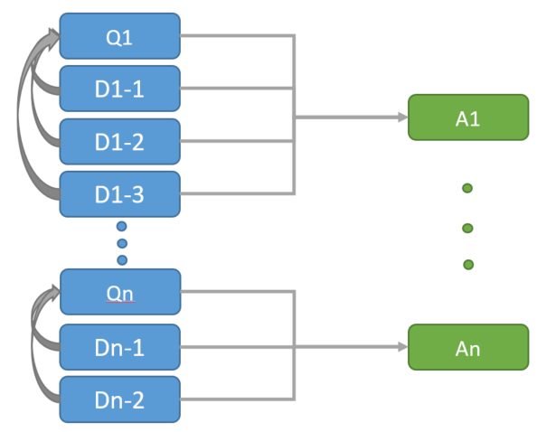

#  Q & A Matching using Azure Machine Learning workbench

[!INCLUDE [workbench-deprecated](../../../includes/aml-deprecating-preview-2017.md)] 

Answering open ended questions is difficult and often requires manual effort from subject matter experts (SMEs). To help reduce the demands on internal SMEs, companies often create lists of Frequently Asked Questions (FAQs) as a means of assisting users. This example showcases various effective machine learning methods to match open ended queries to pre-existing FAQ question/answers pairs. This example demonstrates an easy development process for building such a solution using the Azure Machine Learning Workbench. 

## Link to the gallery GitHub repository
[https://github.com/Azure/MachineLearningSamples-QnAMatching](https://github.com/Azure/MachineLearningSamples-QnAMatching)

## Overview

This example addresses the problem of mapping user questions to pre-existing Question & Answer (Q&A) pairs as is typically provided in a list of Frequently Asked Questions (that is, a FAQ) or in the Q&A pairs present on websites like [Stack Overflow](https://stackoverflow.com/). There are many approaches to match a question to its correct answer, such as finding the answer that is the most similar to the question. However, in this example open ended questions are matched to previously asked questions by assuming that each answer in the FAQ can answer multiple semantically equivalent questions.

The key steps required to deliver this solution are as follows:

1. Clean and process text data.
2. Learn informative phrases, which are multi-word sequences that provide more information when viewed in sequence than when treated independently.
3. Extract features from text data.
4. Train text classification models and evaluate model performance.

## Prerequisites

The prerequisites to run this example are as follows:

1. An [Azure account](https://azure.microsoft.com/free/) (free trials are available).
2. An installed copy of [Azure Machine Learning Workbench](../service/overview-what-is-azure-ml.md) following the [quick start installation guide](quickstart-installation.md) to install the program and create a workspace.
3. This example could be run on any compute context. However, it is recommended to run it on a multi-core machine with at least of 16-GB memory and 5-GB disk space.

## Create a new workbench project

Create a new project using this example as a template:
1.	Open Azure Machine Learning Workbench
2.	On the **Projects** page, click the **+** sign and select **New Project**
3.	In the **Create New Project** pane, fill in the information for your new project
4.	In the **Search Project Templates** search box, type "Q & A Matching" and select the template
5.	Click **Create**

## Data description

The dataset used in this example is a Stack Exchange Data Dump stored at [archive.org](https://archive.org/details/stackexchange). This data is an anonymized dump of all user-contributed content on the [Stack Exchange network](https://stackexchange.com/). Each site in the network is formatted as a separate archive consisting of XML files zipped via 7-zip using bzip2 compression. Each site archive includes Posts, Users, Votes, Comments, PostHistory, and PostLinks. 

### Data source

This example uses the [Posts data (10 GB)](https://archive.org/download/stackexchange/stackoverflow.com-Posts.7z) and [PostLinks data (515 MB)](https://archive.org/download/stackexchange/stackoverflow.com-PostLinks.7z) from the Stack Overflow site. For complete schema information, see the [readme.txt](https://ia800500.us.archive.org/22/items/stackexchange/readme.txt). 

The `PostTypeId` field in the Posts data indicates whether a post is a `Question` or an `Answer`. The `PostLinkTypeId` field in the PostLinks data indicates whether two posts are linked or duplicate. Question posts typically include some tags, which are keywords that categorize a question with other similar/duplicate questions. There are some tags with high frequency, such as `javascript`, `java`, `c#`, `php` etc., consist of a larger number of question posts. In this example, a subset of Q&A pairs with the `javascript` tag is extracted.

Additionionally, a question post may be related to multiple answer posts or duplicate question posts. To construct a list of FAQ from these two datasets, some data collection criteria are considered. The three sets of compiled data are selected using a SQL script, which is not included in this example. The resulting data description is as follows:

- `Original Questions (Q)`: Question posts are asked and answered on Stack Overflow site.
- `Duplications (D)`: Question posts duplicate other pre-existing questions (`PostLinkTypeId = 3`), which are the original questions. Duplications are considered as semantically equivalent to the original questions in the sense that the answer provided to the original question also answers the new duplicate question.
- `Answers (A)`: Each original question and its duplications may link to more than one answer posts. This example only selects the answer post that is either accepted by the original author (filtered by `AcceptedAnswerId`) or has the highest score (ranked by `Score`) in the original questions. 

The combination of these three datasets creates Q&A pairs where an answer (A) is mapped to one original question (Q) and multiple duplicate questions (D) as illustrated by the following data diagram:

<table><tr><td></td></tr></table>

### Data structure

The data schema and direct download links of the three datasets can be found in the following table:

| Dataset | Field | Type | Description
| ----------|------------|------------|--------
| [questions](https://bostondata.blob.core.windows.net/stackoverflow/orig-q.tsv.gz) | Id | String | The unique question ID (primary key)
|  | AnswerId | String | The unique answer ID per question
|  | Text0 | String | The raw text data including the question's title and body
|  | CreationDate | Timestamp | The timestamp of when the question has been asked
| [dupes](https://bostondata.blob.core.windows.net/stackoverflow/dup-q.tsv.gz) | Id | String | The unique duplication ID (primary key)
|  | AnswerId | String | The answer ID associated with the duplication
|  | Text0 | String | The raw text data including the duplication's title and body
|  | CreationDate | Timestamp | The timestamp of when the duplication has been asked
| [answers](https://bostondata.blob.core.windows.net/stackoverflow/ans.tsv.gz)  | Id | String | The unique answer ID (primary key)
|  | text0 | String | The raw text data of the answer

## Scenario structure

The Q&A matching example is presented through three types of files. The first type is a series of Jupyter Notebooks that show the step-by-step descriptions of the entire workflow. The second type is a set of Python files contain custom Python modules for phrase learning and feature extraction. These Python modules are generic enough to not only serve this example but also other use cases. The third type is a set of Python files to tune hyper-parameters and track model performance using the Azure Machine Learning Workbench.

The files in this example are organized as follows.

| File Name | Type | Description
| ----------|------------|--------
| `Image` | Folder | The folder used to save images for the README file
| `notebooks` | Folder | The Jupyter Notebooks folder
| `modules` | Folder | The Python modules folder
| `scripts` | Folder | The Python files folder
| `notebooks/Part_1_Data_Preparation.ipynb` | Jupyter Notebook | Access the sample data, pre-process the text, and prepare training and test datasets
| `notebooks/Part_2_Phrase_Learning.ipynb` | Jupyter Notebook | Learn informative phrases and tokenize text into Bag-of-Words (BOWs) representations
| `notebooks/Part_3_Model_Training_and_Evaluation.ipynb` | Jupyter Notebook | Extract features, train text classification models, and evaluation model performance
| `modules/__init__.py` | Python file | The Python package init file
| `modules/phrase_learning.py` | Python file | The Python modules used to transform the raw data and learn informative phrases
| `modules/feature_extractor.py` | Python file | The Python modules extract features for model training
| `scripts/naive_bayes.py` | Python file | The Python to tune hyper-parameters in the Naive Bayes model
| `scripts/random_forest.py` | Python file | The Python to tune hyper-parameters in the Random Forest model
| `README.md` | Markdown  file | The README markdown file

> [!NOTE]
> The series of notebooks is built under Python 3.5.
> 

### Data ingestion and transformation

The three compiled datasets are stored in a Blob storage and are retrieved in `Part_1_Data_Preparation.ipynb` notebook.  

Before training the text classification models, the text in the questions is cleaned and preprocessed to exclude code snippets. An unsupervised phrase learning is applied over the training material to learn informative multi-word sequences. These phrases are represented as single compound word units in the downstream Bag-of-Words (BOWs) featurization used by the text classification models.

The detailed step-by-step descriptions of text preprocessing and phrase learning can be found in the Notebooks `Part_1_Data_Preparation.ipynb` and `Part_2_Phrase_Learning.ipynb`, respectively.

### Modeling

This example is designed to score new questions against the pre-existing Q&A pairs by training text classification models where each pre-existing Q&A pair is a unique class and a subset of the duplicate questions for each Q&A pair are available as training material. In the example, the original questions and 75% of the duplicate questions are retained for training and the most recently posted 25% of duplicate questions are held-out as evaluation data.

The classification model uses an ensemble method to aggregate three base classifiers, including **Naive Bayes**, **Support Vector Machine**, and **Random Forest**. In each base classifier, the `AnswerId` is used as the class label and the BOWs representations is used as the features.

The model training process is illustrated in `Part_3_Model_Training_and_Evaluation.ipynb`.

### Evaluation

Two different evaluation metrics are used to assess performance. 
1. `Average Rank (AR)`: indicates the average position where the correct answer is found in the list of retrieved Q&A pairs (out of the full set of 103 answer classes). 
2. `Top 3 Percentage`: indicates the percentage of test questions that the correct answer can be retrieved in the top three choices in the returned ranked list. 

The evaluation is demonstrated in `Part_3_Model_Training_and_Evaluation.ipynb`.

## Conclusion

This example highlights how to use well-known text analytics techniques, such as phrase learning and text classification, to produce a robust model. It also showcases how Azure Machine Learning Workbench can help with interactive solution development and track model performance. 

Some key highlights of this example are:

- The question and answer matching problem can be effectively solved with phrase learning and text classification models.
- Demonstrating interactive model development with Azure Machine Learning Workbench and Jupyter Notebook.
- Azure Machine Learning Workbench manages the run history and learned models with logging the evaluation metrics for comparison purposes. These features enables quick hyper-parameter tuning and helps identify the best performing models.

## References

Timothy J. Hazen, Fred Richardson, [_Modeling Multiword Phrases with Constrained Phrases Tree for Improved Topic Modeling of Conversational Speech_](http://people.csail.mit.edu/hazen/publications/Hazen-SLT-2012.pdf). Spoken Language Technology Workshop (SLT), 2012 IEEE. IEEE, 2012.

Timothy J. Hazen, [_MCE Training Techniques for Topic Identification of Spoken Audio Documents_](http://ieeexplore.ieee.org/abstract/document/5742980/) in IEEE Transactions on Audio, Speech, and Language Processing, vol. 19, no. 8, pp. 2451-2460, Nov. 2011.
