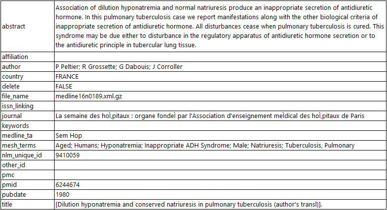
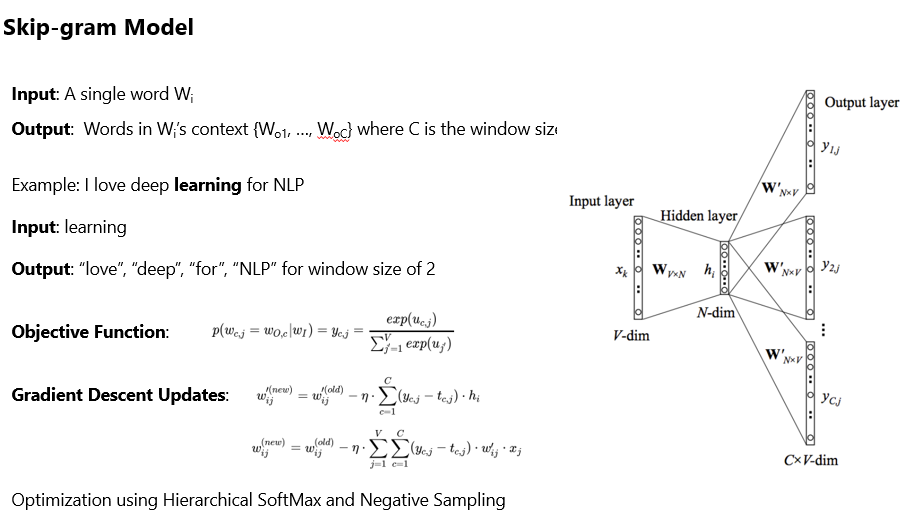
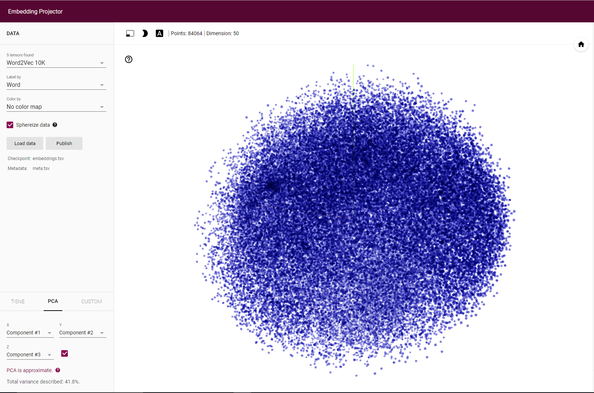
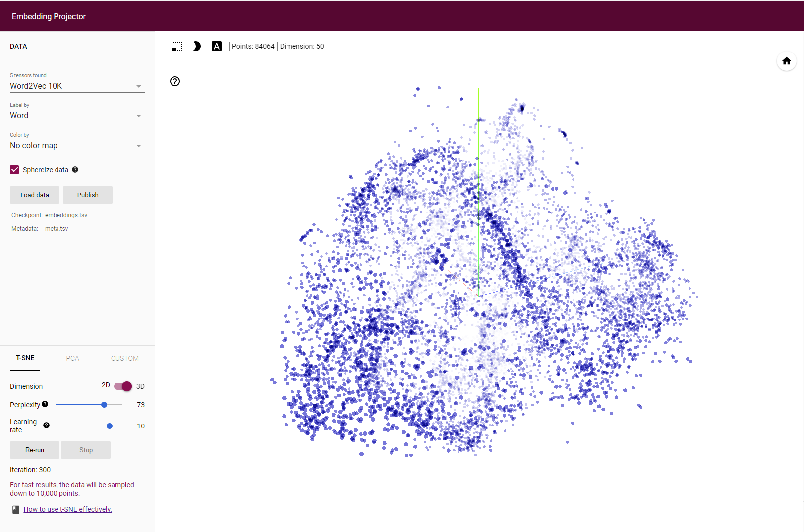
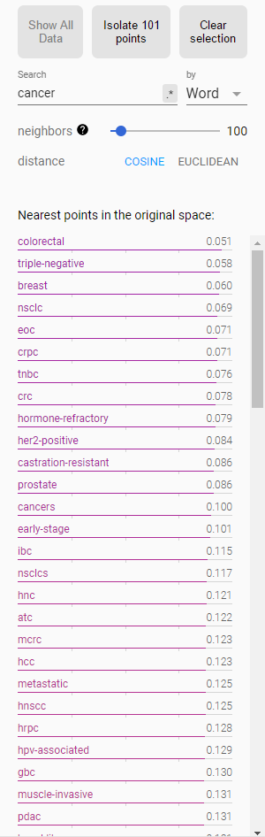
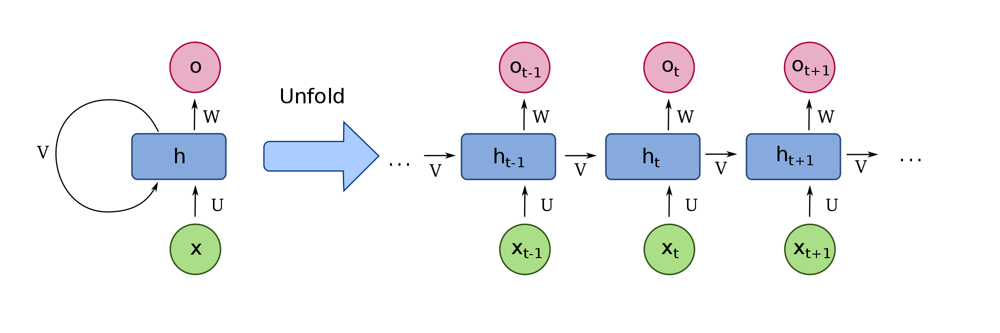
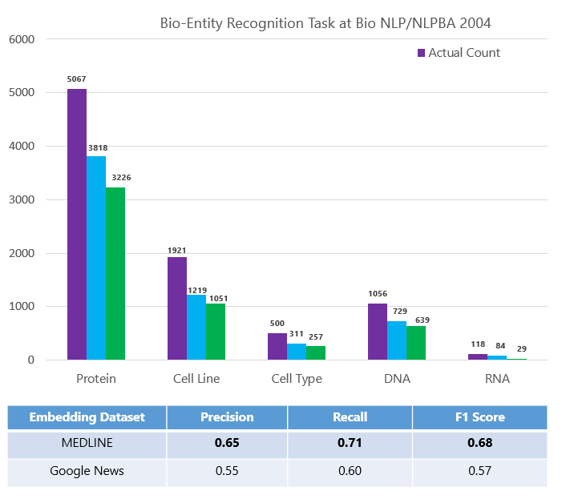
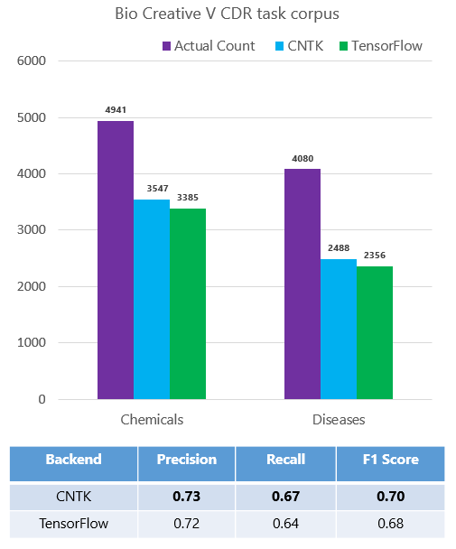

# Biomedical entity recognition using Team Data Science Process (TDSP) Template

[!INCLUDE [workbench-deprecated](../../../includes/aml-deprecating-preview-2017.md)] 

Entity extraction is a subtask of information extraction (also known as [Named-entity recognition (NER)](https://en.wikipedia.org/wiki/Named-entity_recognition), entity chunking, and entity identification). The aim of this real-world scenario is to highlight how to use Azure Machine Learning Workbench to solve a complicated Natural Language Processing (NLP) task such as entity extraction from unstructured text:

1. How to train a neural word embeddings model on a text corpus of about 18 million PubMed abstracts using [Spark Word2Vec implementation](https://spark.apache.org/docs/latest/mllib-feature-extraction.html#word2vec).
2. How to build a deep Long Short-Term Memory (LSTM) recurrent neural network model for entity extraction on a GPU-enabled Azure Data Science Virtual Machine (GPU DS VM) on Azure.
2. Demonstrate that domain-specific word embeddings model can outperform generic word embeddings models in the entity recognition task. 
3. Demonstrate how to train and operationalize deep learning models using Azure Machine Learning Workbench.

4. Demonstrate the following capabilities within Azure Machine Learning Workbench:

    * Instantiation of [Team Data Science Process (TDSP) structure and templates](how-to-use-tdsp-in-azure-ml.md)
    * Automated management of your project dependencies including the download and the installation
    * Execution of Python scripts on different compute environments
    * Run history tracking for Python scripts
    * Execution of jobs on remote Spark compute contexts using HDInsight Spark 2.1 clusters
    * Execution of jobs in remote GPU VMs on Azure
    * Easy operationalization of deep learning models as web services on Azure Container Services (ACS)

## Use case overview
Biomedical named entity recognition is a critical step for complex biomedical NLP tasks such as: 
* Extracting the mentions of named entities such diseases, drugs, chemicals, and symptoms from electronic medical or health records.
* Drug discovery
* Understanding the interactions between different entity types such as drug-drug interaction, drug-disease relationship, and gene-protein relationship.

Our use case scenario focuses on how a large amount of unstructured data corpus such as Medline PubMed abstracts can be analyzed to train a word embedding model. Then the output embeddings are considered as automatically generated features to train a neural entity extractor.

Our results show that the biomedical entity extraction model training on the domain-specific word embedding features outperforms the model trained on the generic feature type. The domain-specific model can detect 7012 entities correctly (out of 9475) with F1-score of 0.73 compared to 5274 entities with F1-score of 0.61 for the generic model.

The following figure shows the architecture that was used to process data and train models.

## Data description

### 1. Word2Vec model training data
We first downloaded the raw MEDLINE abstract data from [MEDLINE](https://www.nlm.nih.gov/pubs/factsheets/medline.html). The data is publically available in the form of XML files on their [FTP server](https://ftp.ncbi.nlm.nih.gov/pubmed/baseline). There are 892 XML files available on the server and each of the XML files has the information of 30,000 articles. More details about the data collection step are provided in the Project Structure section. The fields present in each file are 
        
        abstract
        affiliation
        authors
        country	
        delete: boolean if False means paper got updated so you might have two XMLs for the same paper.
        file_name	
        issn_linking	
        journal	
        keywords	
        medline_ta: this is abbreviation of the journal nam	
        mesh_terms: list of MeSH terms	
        nlm_unique_id	
        other_id: Other IDs	
        pmc: Pubmed Central ID	
        pmid: Pubmed ID
        pubdate: Publication date
        title

### 2. LSTM model training data

The neural entity extraction model has been trained and evaluated on publicly available datasets. To obtain a detailed description about these datasets, you could refer to the following sources:
 * [Bio-Entity Recognition Task at BioNLP/NLPBA 2004](http://www.nactem.ac.uk/tsujii/GENIA/ERtask/report.html)
 * [BioCreative V CDR task corpus](http://www.biocreative.org/tasks/biocreative-v/track-3-cdr/)
 * [Semeval 2013 - Task 9.1 (Drug Recognition)](https://www.cs.york.ac.uk/semeval-2013/task9/)

## Link to the Azure gallery GitHub repository
Following is the link to the public GitHub repository of the real-world scenario that contains the code and more detailed description: 

[https://github.com/Azure/MachineLearningSamples-BiomedicalEntityExtraction](https://github.com/Azure/MachineLearningSamples-BiomedicalEntityExtraction)

## Prerequisites 

* An Azure [subscription](https://azure.microsoft.com/free/)
* Azure Machine Learning Workbench. See [installation guide](quickstart-installation.md). Currently the Azure Machine Learning Workbench can be installed on the following operating systems only: 
    * Windows 10 or Windows Server 2016
    * macOS Sierra (or newer)

### Azure services
* [HDInsight Spark cluster](https://docs.microsoft.com/azure/hdinsight/hdinsight-apache-spark-jupyter-spark-sql) version Spark 2.1 on Linux (HDI 3.6) for scale-out computation. To process the full amount of MEDLINE abstracts discussed below, you need the minimum configuration of: 
    * Head node: [D13_V2](https://azure.microsoft.com/pricing/details/hdinsight/) size
    * Worker nodes: At least 4 of [D12_V2](https://azure.microsoft.com/pricing/details/hdinsight/). In our work, we used 11 worker nodes of D12_V2 size.
* [NC6 Data Science Virtual Machine (DSVM)](https://docs.microsoft.com/azure/machine-learning/machine-learning-data-science-linux-dsvm-intro) for scale-up computation.

### Python packages

All the required dependencies are defined in the aml_config/conda_dependencies.yml file under the scenario project folder. The dependencies defined in this file are automatically provisioned for runs against docker, VM, and HDI cluster targets. For details about the Conda environment file format, refer to [here](https://conda.io/docs/using/envs.html#create-environment-file-by-hand).

* [TensorFlow](https://www.tensorflow.org/install/)
* [CNTK 2.0](https://docs.microsoft.com/cognitive-toolkit/using-cntk-with-keras)
* [Keras](https://keras.io/#installation)
* NLTK
* Fastparquet

### Basic instructions for Azure Machine Learning (AML) workbench
* [Overview](../service/overview-what-is-azure-ml.md)
* [Installation](quickstart-installation.md)
* [Using TDSP](how-to-use-tdsp-in-azure-ml.md)
* [How to read and write files](how-to-read-write-files.md)
* [How to use Jupyter Notebooks](how-to-use-jupyter-notebooks.md)
* [How to use GPU](how-to-use-gpu.md)

## Scenario structure
For the scenario, we use the TDSP project structure and documentation templates (Figure 1), which follows the [TDSP lifecycle](https://github.com/Azure/Microsoft-TDSP/blob/master/Docs/lifecycle-detail.md). Project is created based on instructions provided [here](./how-to-use-tdsp-in-azure-ml.md).

 

The step-by-step data science workflow is as follows:

### 1. Data acquisition and understanding

See [Data Acquisition and Understanding](https://github.com/Azure/MachineLearningSamples-BiomedicalEntityExtraction/blob/master/code/01_data_acquisition_and_understanding/ReadMe.md).

The raw MEDLINE corpus has a total of 27 million abstracts where about 10 million articles have an empty abstract field. Azure HDInsight Spark is used to process big data that cannot be loaded into the memory of a single machine as a [Pandas DataFrame](https://pandas.pydata.org/pandas-docs/stable/generated/pandas.DataFrame.html). First, the data is downloaded into the Spark cluster. Then the following steps are executed on the [Spark DataFrame](https://spark.apache.org/docs/latest/sql-programming-guide.html): 
* parse the XML files using Medline XML Parser
* preprocess the abstract text including sentence splitting, tokenization, and case normalization.
* exclude articles where abstract field is empty or has short text 
* create the word vocabulary from the training abstracts
* train the word embedding neural model. For more information, see [GitHub code link](https://github.com/Azure/MachineLearningSamples-BiomedicalEntityExtraction/blob/master/code/01_data_acquisition_and_understanding/ReadMe.md) to get started.

After parsing XML files, data has the following format: 

The neural entity extraction model has been trained and evaluated on publicly available datasets. To obtain a detailed description about these datasets, you could refer to the following sources:
 * [Bio-Entity Recognition Task at BioNLP/NLPBA 2004](http://www.nactem.ac.uk/tsujii/GENIA/ERtask/report.html)
 * [BioCreative V CDR task corpus](http://www.biocreative.org/tasks/biocreative-v/track-3-cdr/)
 * [Semeval 2013 - Task 9.1 (Drug Recognition)](https://www.cs.york.ac.uk/semeval-2013/task9/)

### 2. Modeling

See [Modeling](https://github.com/Azure/MachineLearningSamples-BiomedicalEntityExtraction/tree/master/code/02_modeling).

Modeling is the stage where we show how you can use the data downloaded in the previous section for training your own word embedding model and use it for other downstream tasks. Although we are using the PubMed data, the pipeline to generate the embeddings is generic and can be reused to train word embeddings for any other domain. For embeddings to be an accurate representation of the data, it is essential that the word2vec is trained on a large amount of data.
Once we have the word embeddings ready, we can train a deep neural network model that uses the learned embeddings to initialize the Embedding layer. We mark the embedding layer as non-trainable but that is not mandatory. The training of the word embedding model is unsupervised and hence we are able to take advantage of unlabeled texts. However, the training of the entity recognition model is a supervised learning task and its accuracy depends on the amount and the quality of a manually-annotated data. 

#### 2.1. Feature generation

See [Feature generation](https://github.com/Azure/MachineLearningSamples-BiomedicalEntityExtraction/tree/master/code/02_modeling/01_feature_engineering).

Word2Vec is the word embedding unsupervised learning algorithm that trains a neural network model from an unlabeled training corpus. It produces a continuous vector for each word in the corpus that represents its semantic information. These models are simple neural networks with a single hidden layer. The word vectors/embeddings are learned by backpropagation and stochastic gradient descent. There are two types of word2vec models, namely, the Skip-Gram and the continuous-bag-of-words (check [here](https://arxiv.org/pdf/1301.3781.pdf) for more details). Since we are using the MLlib's implementation of the word2vec, which supports the Skip-gram model, we briefly describe it here (image taken from [link](https://ahmedhanibrahim.wordpress.com/2017/04/25/thesis-tutorials-i-understanding-word2vec-for-word-embedding-i/)): 

The model uses Hierarchical Softmax and Negative sampling to optimize the performance. Hierarchical SoftMax (H-SoftMax) is an approximation inspired by binary trees. H-SoftMax essentially replaces the flat SoftMax layer with a hierarchical layer that has the words as leaves. This allows us to decompose calculating the probability of one word into a sequence of probability calculations, which saves us from having to calculate the expensive normalization over all words. Since a balanced binary tree has a depth of log2(|V|) (V is the Vocabulary), we only need to evaluate at most log2(|V|) nodes to obtain the final probability of a word. The probability of a word w given its context c is then simply the product of the probabilities of taking right and left turns respectively that lead to its leaf node. We can build a Huffman Tree based on the frequency of the words in the dataset to ensure that more frequent words get shorter representations. For more information, see [this link](http://sebastianruder.com/word-embeddings-softmax/).
Image taken from [here](https://ahmedhanibrahim.wordpress.com/2017/04/25/thesis-tutorials-i-understanding-word2vec-for-word-embedding-i/).

##### Visualization

Once we have the word embeddings, we would like to visualize them and see the relationship between semantically similar words. 

We have shown two different ways of visualizing the embeddings. The first one uses a PCA to project the high dimensional vector to a 2-D vector space. This leads to a significant loss of information and the visualization is not as accurate. The second is to use PCA with [t-SNE](https://distill.pub/2016/misread-tsne/). t-SNE is a nonlinear dimensionality reduction technique that is well-suited for embedding high-dimensional data into a space of two or three dimensions, which can then be visualized in a scatter plot.  It models each high-dimensional object by a two- or three-dimensional point in such a way that similar objects are modeled by nearby points and dissimilar objects are modeled by distant points. It works in two parts. First, it creates a probability distribution over the pairs in the higher dimensional space in a way that similar objects have a high probability of being picked and dissimilar points have  low probability of getting picked. Second, it defines a similar probability distribution over the points in a low dimensional map and minimizes the KL Divergence between the two distributions with respect to location of points on the map. The location of the points in the low dimension is obtained by minimizing the KL Divergence using Gradient Descent. But t-SNE might not be always reliable. Implementation details can be found [here](https://github.com/Azure/MachineLearningSamples-BiomedicalEntityExtraction/tree/master/code/02_modeling/01_feature_engineering). 

As shown in the following figure, the t-SNE visualization provides more separation of word vectors and potential clustering patterns. 

* Visualization with PCA

* Visualization with t-SNE

* Points closest to "Cancer" (they are all subtypes of Cancer)

#### 2.2. Train the neural entity extractor

See [Train the neural entity extractor](https://github.com/Azure/MachineLearningSamples-BiomedicalEntityExtraction/tree/master/code/02_modeling/02_model_creation/ReadMe.md).

The feed-forward neural network architecture suffers from a problem that they treat each input and output as independent of the other inputs and outputs. This architecture can't model sequence-to-sequence labeling tasks such as machine translation and entity extraction. Recurrent neural network models overcome this problem as they can pass information computed until now to the next node. This property is called having memory in the network since it is able to use the previously computed information as shown in the following figure:

Vanilla RNNs actually suffer from the [Vanishing Gradient Problem](https://en.wikipedia.org/wiki/Vanishing_gradient_problem) due to which they are not able to utilize all the information they have seen before. The problem becomes evident only when a large amount of context is required to make a prediction. But models like LSTM do not suffer from such a problem, in fact they are designed to remember long-term dependencies. Unlike vanilla RNNs that have a single neural network, the LSTMs have the interactions between four neural networks for each cell. For a detailed explanation of how LSTM work, refer to [this post](http://colah.github.io/posts/2015-08-Understanding-LSTMs/).

Let’s try to put together our own LSTM-based recurrent neural network and try to extract entity types like drug, disease and symptom mentions from PubMed data. The first step is to obtain a large amount of labeled data and as you would have guessed, that's not easy! Most of the medical data contains lot of sensitive information about the person and hence are not publicly available. We rely on a combination of two different datasets that are publicly available. The first dataset is from Semeval 2013 - Task 9.1 (Drug Recognition) and the other is from BioCreative V CDR task. We are combining and auto labeling these two datasets so that we can detect both drugs and diseases from medical texts and evaluate our word embeddings. For implementation details, refer to [GitHub code link](https://github.com/Azure/MachineLearningSamples-BiomedicalEntityExtraction/tree/master/code/02_modeling/02_model_creation).

The model architecture that we have used across all the codes and for comparison is presented below. The parameter that changes for different datasets is the maximum sequence length (613 here).

#### 2.3. Model evaluation
See [Model evaluation](https://github.com/Azure/MachineLearningSamples-BiomedicalEntityExtraction/tree/master/code/02_modeling/03_model_evaluation/ReadMe.md).

We use the evaluation script from the shared task [Bio-Entity Recognition Task at Bio NLP/NLPBA 2004](http://www.nactem.ac.uk/tsujii/GENIA/ERtask/report.html) to evaluate the precision, recall, and F1 score of the model. 

#### In-domain versus generic word embedding models

The following is a comparison between the accuracy of two feature types: (1) word embeddings trained on PubMed abstracts and (2) word embeddings trained on Google News. We clearly see that the in-domain model outperforms the generic model. Hence having a specific word embedding model rather than using a generic one is much more helpful. 

* Task #1: Drugs and Diseases Detection

We perform the evaluation of the word embeddings on other datasets in the similar fashion and see that in-domain model is always better.

* Task #2: Proteins, Cell Line, Cell Type, DNA, and RNA Detection

* Task #3: Chemicals and Diseases Detection

* Task #4: Drugs Detection

* Task #5: Genes Detection

#### TensorFlow versus CNTK
All the reported models are trained using Keras with TensorFlow as backend. Keras with CNTK backend does not support "reverse" at the time this work was done. Therefore, for the sake of comparison, we have trained a unidirectional LSTM model with the CNTK backend and compared it to a unidirectional LSTM model with TensorFlow backend. Install CNTK 2.0 for Keras from [here](https://docs.microsoft.com/cognitive-toolkit/using-cntk-with-keras). 

We concluded that CNTK performs as good as Tensorflow both in terms of the training time taken per epoch (60 secs for CNTK and 75 secs for Tensorflow) and the number of test entities detected. We are using the Unidirectional layers for evaluation.

### 3. Deployment

See [Deployment](https://github.com/Azure/MachineLearningSamples-BiomedicalEntityExtraction/tree/master/code/03_deployment).

We deployed a web service on a cluster in the [Azure Container Service (ACS)](https://azure.microsoft.com/services/container-service/). The operationalization environment provisions Docker and Kubernetes in the cluster to manage the web-service deployment. You can find further information about the operationalization process [here](model-management-service-deploy.md ).

## Conclusion

We went over the details of how you could train a word embedding model using Word2Vec algorithm on Spark and then use the extracted embeddings as features to train a deep neural network for entity extraction. We have applied the training pipeline on the biomedical domain. However, the pipeline is generic enough to be applied to detect custom entity types of any other domain. You just need enough data and you can easily adapt the workflow presented here for a different domain.

## References

* Tomas Mikolov, Kai Chen, Greg Corrado, and Jeffrey Dean. 2013a. Efficient estimation of word representations in vector space. In Proceedings of ICLR.
* Tomas Mikolov, Ilya Sutskever, Kai Chen, Greg S Corrado, and Jeff Dean. 2013b. Distributed representations of words and phrases and their compositionality. In Proceedings of NIPS, pages 3111–3119.
* Billy Chiu, Gamal Crichton, Anna Korhonen, and Sampo Pyysalo. 2016. [How to Train Good Word Embeddings for Biomedical NLP](http://aclweb.org/anthology/W/W16/W16-2922.pdf), In Proceedings of the fifteenth Workshop on Biomedical Natural Language Processing, pages 166–174.
* [Vector Representations of Words](https://www.tensorflow.org/tutorials/word2vec)
* [Recurrent Neural Networks](https://www.tensorflow.org/tutorials/recurrent)
* [Problems encountered with Spark ml Word2Vec](https://intothedepthsofdataengineering.wordpress.com/2017/06/26/problems-encountered-with-spark-ml-word2vec/)
* [Spark Word2Vec: lessons learned](https://intothedepthsofdataengineering.wordpress.com/2017/06/26/spark-word2vec-lessons-learned/)

