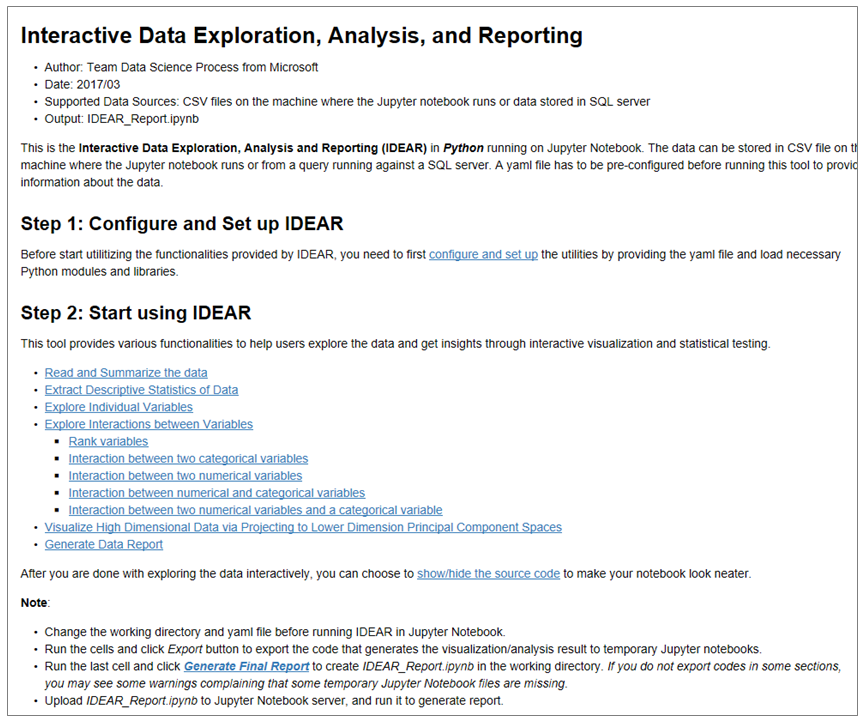
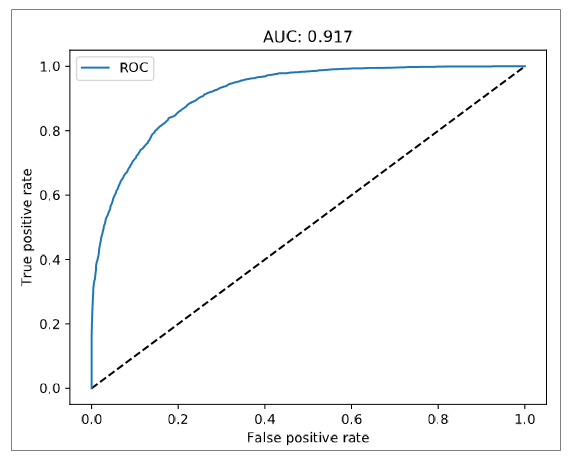

# Income classification with Team Data Science Process (TDSP) project

[!INCLUDE [workbench-deprecated](../../../includes/aml-deprecating-preview-2017.md)] 

## Introduction

Standardization of the structure and documentation of data science projects, that is anchored to an established [data science lifecycle](https://github.com/Azure/Microsoft-TDSP/blob/master/Docs/lifecycle-detail.md), is key to facilitating effective collaboration in data science teams. Creating Azure Machine Learning projects with the [Team Data Science Process (TDSP)](https://github.com/Azure/Microsoft-TDSP) template provides a framework for such standardization.

We had previously released a [GitHub repository for the TDSP project structure and templates](https://github.com/Azure/Azure-TDSP-ProjectTemplate). But it was not possible, until now to instantiate the TDSP structure and templates within a data science tool. We have now enabled creation of Azure Machine Learning projects that are instantiated with [TDSP structure and documentation templates for Azure Machine Learning](https://github.com/amlsamples/tdsp). Instructions on how to use TDSP structure and templates in Azure Machine Learning is provided [here](https://aka.ms/how-to-use-tdsp-in-aml). Here we provide an example of how an actual machine learning project can be created using TDSP structure, populated with project-specific code, artifacts and documents, and executed within the Azure Machine Learning.

## Link to GitHub repository
We provide summary documentation [here](https://github.com/Azure/MachineLearningSamples-TDSPUCIAdultIncome) about the sample. More extensive documentation can be found on the GitHub site.

### Purpose
The primary purpose of this sample is to show how to instantiate and execute a machine learning project using the [Team Data Science Process (TDSP)](https://github.com/Azure/Microsoft-TDSP) structure and templates in Azure Machine Learning. For this purpose, we use the well-known [1994 US Census data from the UCI Machine Learning Repository](https://archive.ics.uci.edu/ml/datasets/adult). The modeling task is to predict US annual income classes from US Census information (for example, age, race, education level, country of origin, etc.)

### Scope
 * Data exploration, training, and deployment of a machine learning model which address the prediction problem described in the Use Case Overview. 
 * Execution of the project in Azure Machine Learning using the Team Data Science Process (TDSP) template from Azure Machine Learning for this project. For project execution and reporting, we're going to use the TDSP lifecycle.
 * Operationalization of the solution directly from Azure Machine Learning in Azure Container Services.

 The project highlights several features of Azure Machine Learning, such TDSP structure instantiation and use, execution of code in Jupyter notebooks as well as Python files, and easy operationalization in Azure Container Services using Docker and Kubernetes.

## Team Data Science Process (TDSP) lifecycle
See [Team Data Science Process (TDSP) Lifecycle](https://github.com/Azure/Microsoft-TDSP/blob/master/Docs/lifecycle-detail.md)

## Prerequisites
### Required: subscription, hardware, software
1. An Azure [subscription](https://azure.microsoft.com). You can get a [free subscription](https://azure.microsoft.com/free/?v=17.16&WT.srch=1&WT.mc_id=AID559320_SEM_cZGgGOIg) to execute this sample also.
2. An [Azure Data Science Virtual Machine (DSVM) Windows Server 2016](https://azuremarketplace.microsoft.com/marketplace/apps/microsoft-ads.windows-data-science-vm), (VM Size: [DS3_V2](https://docs.microsoft.com/azure/virtual-machines/windows/sizes), with 4 virtual CPUs and 14-Gb RAM). Although tested on an Azure DSVM, it is likely to work on any Windows 10 machine.
3. Review documentation on Azure Machine Learning and its related services (see below for links).
4. Make sure that you have properly installed Azure Machine Learning by the [quick start installation guide](quickstart-installation.md).

The dataset for this sample is from the UCI ML Repository [[link]](https://archive.ics.uci.edu/ml/datasets/adult). It is taken from the 1994 US Census database and contains census and income information for about 50,000 individuals. This is structured dataset having numerical and categorical features, and a categorical target consisting of two income categories ('>50 K' or '<=50 K'). 

### Optional: Version control repository
If you would like to save and version your project and its contents, you need to have a version control repository where this can be done. You can enter the Git repository location while creating the new project using the TDSP template in Azure Machine Learning. See [how to use Git in Azure Machine Learning](using-git-ml-project.md) for further details.

### Informational: about Azure Machine Learning
* [FAQ - How to get started](frequently-asked-questions.md)
* [Overview](../service/overview-what-is-azure-ml.md)
* [Installation](quickstart-installation.md)
* [Execution](experimentation-service-configuration.md)
* [Using TDSP](https://aka.ms/how-to-use-tdsp-in-aml)
* [Read and write files](how-to-read-write-files.md)
* [Using Git with Azure Machine Learning](using-git-ml-project.md)
* [Deploying an ML model as a web service](model-management-service-deploy.md)

### Create a new workbench project

Create a new project using this example as a template:
1.	Open Azure Machine Learning Workbench
2.	On the **Projects** page, click the **+** sign and select **New Project**
3.	In the **Create New Project** pane, fill in the information for your new project
4.	In the **Search Project Templates** search box, type "Classify US incomes - TDSP project" and select the template
5.	Click **Create**

If you provide an empty Git repository location during creating the project (in the appropriate box), then that repository will be populated with the project structure and contents after creation of the project.

## Use case overview
The problem is to understand how socio-economic data captured in US Census can help predict annual income of individuals in US. Based on such Census features, the machine learning task is to predict if the income of an individual is above $50,000 or not (binary classification task).

## Data description
For detailed information about the data, see the [description](https://archive.ics.uci.edu/ml/machine-learning-databases/adult/adult.names) in the UCI repository. 

This data was extracted from the Census Bureau database found at: https://www.census.gov/en.html. 

* There are a total of 48,842 instances (prior to any filtering), mix of continuous and discrete (train=32,561, test=16,281)
* Probability for the label '>50 K'  : 23.93% / 24.78% (without unknowns)
* Probability for the label '<=50 K': 76.07% / 75.22% (without unknowns)  

* **TARGET**: Income class '>50 K', '<=50 K'. These are replaced by 1 and 0 respectively in data preparation phase.
* **FEATURES**: Age, work class, education level, education level, race, sex, hours of work per week, etc.

## Project structure, execution, and reporting

### Structure
For this project, we use the TDSP folder structure and documentation templates (below), which follows the [TDSP lifecycle](https://github.com/Azure/Microsoft-TDSP/blob/master/Docs/lifecycle-detail.md). 

Project is created based on instructions provided [here](https://aka.ms/how-to-use-tdsp-in-aml). After it is filled with the project's code and artifacts, the structure looks as follows (see project structure boxed in red in figure below).

### Execution
In this example, we execute code in **local compute environment**. Refer to Azure Machine Learning documents for further details on [execution options](experimentation-service-configuration.md).

Executing a Python script in a local Python runtime is easy:

    az ml experiment submit -c local my_script.py

IPython notebook files can be double-clicked from the project structure on the left of the Azure Machine Learning UI and run in the Jypyter Notebook Server.

The step-by-step data science workflow was as follows:

* [**Data acquisition and understanding**](https://github.com/Azure/MachineLearningSamples-TDSPUCIAdultIncome/tree/master/code/01_data_acquisition_and_understanding)

Data was downloaded in .csv form from URLs at UCI ML Repository [[link]](https://archive.ics.uci.edu/ml/datasets/adult). Features, target, and their transformations are described in detail in the ProjectReport.md file.

Code for data acquisition and understanding is located in: /code/01_data_acquisition_and_understanding.

Data exploration is performed using the Python 3 [IDEAR (Interactive Data Exploration and Reporting) utility](https://github.com/Azure/Azure-TDSP-Utilities/tree/master/DataScienceUtilities/DataReport-Utils/Python) published as a part of [TDSP suite of data science tools](https://github.com/Azure/Azure-TDSP-Utilities). This utility helps to generate standardized data exploration reports for data containing numerical and categorical features and target. Details of how the Python 3 IDEAR utility was used is provided below. 

The location of the final data exploration report is [IDEAR.html](https://github.com/Azure/MachineLearningSamples-TDSPUCIAdultIncome/tree/master/docs/deliverable_docs). A view of the IDEAR report is shown below:

* [**Modeling**](https://github.com/Azure/MachineLearningSamples-TDSPUCIAdultIncome/tree/master/code/02_modeling)

We created two models with 3-fold cross-validation: Elastic Net and Random forest. We used [59-point sampling](http://www.jmlr.org/papers/volume13/bergstra12a/bergstra12a.pdf)  for random grid search as a strategy for cross-validation and model parameter optimization. Accuracy of the models were measured using AUC (Area under curve) on the test data set. 

Code for modeling is located in: /code/02_modeling.

AUC of both Elastic Net and Random Forest models were > 0.85. We save both models in pickled.pkl files, and output the ROC plots for both models. AUC of Random Forest model was 0.92 and that of the Elastic Net model was 0.90. In addition, for model interpretation, feature importance for the Random Forest model are output in a .csv file and plotted in a pdf (top 20 predictive features only).

ROC curve of **Random Forest model** on test data is shown below. This was the model that was deployed:

Feature importance (top 20) of Random Forest model is shown below. It shows features capital gain amount, eduction, marital status, have highest feature importance.

* [**Deployment**](https://github.com/Azure/MachineLearningSamples-TDSPUCIAdultIncome/tree/master/code/03_deployment)

We  deployed the Random Forest model as a web-service on a cluster in the [Azure Container Service (ACS)](https://azure.microsoft.com/services/container-service/). The operationalization environment provisions Docker and Kubernetes in the cluster to manage the web-service deployment. You can find further information on the operationalization process [here](model-management-service-deploy.md). 

Code for deployment is located in: /code/03_deployment.

### [Final project report](https://github.com/Azure/MachineLearningSamples-TDSPUCIAdultIncome/blob/master/docs/deliverable_docs/ProjectReport.md)
Details about each of the above sections are provided in the compiled final project report [ProjectReport](https://github.com/Azure/MachineLearningSamples-TDSPUCIAdultIncome/blob/master/docs/deliverable_docs/ProjectReport.md). The project report also contains further details about the use case, model performance metrics, deployment, and infrastructure on which the project was developed and deployed.

The project report, together with the contents of the entire project folder, and version control repository may be delivered to the client.

## Conclusion

In this sample, we showed now to use TDSP structure and templates in Azure Machine Learning. Through the document and artifact templates you can:
1. Properly define purpose and scope of a project
2. Create a project team with distributed roles and responsibilities
3. Structure and execute projects according to the TDSP lifecycle stages
4. Develop standardized reports using TDSP data science utilities (such as the IDEAR data exploration and visualization report).
5. Prepare a final data science project report that can be delivered to a client

We hope you use this feature of Azure Machine Learning to facilitate with standardization and collaboration within your data science teams.

## Next Steps

See references below to get started:

[How to use Team Data Science Process (TDSP) in Azure Machine Learning](https://aka.ms/how-to-use-tdsp-in-aml)

[Team Data Science Process (TDSP)](https://github.com/Azure/Microsoft-TDSP)

[TDSP project template for Azure Machine Learning](https://aka.ms/tdspamlgithubrepo)

[US Income data-set from UCI ML repository](https://archive.ics.uci.edu/ml/datasets/adult)