# Tutorial 1: Classify Iris - Preparing the data

[!INCLUDE [workbench-deprecated](../../../includes/aml-deprecating-preview-2017.md)]

Azure Machine Learning service (preview) is an integrated, end-to-end data science and advanced analytics solution for professional data scientists to prepare data, develop experiments, and deploy models at cloud scale.

This tutorial is **part one of a three-part series**. In this tutorial, you walk through the basics of Azure Machine Learning service (preview) and learn how to:

> [!div class="checklist"]
> * Create a project in Azure Machine Learning Workbench
> * Create a data preparation package
> * Generate Python/PySpark code to invoke a data preparation package

This tutorial uses the timeless [Iris flower data set](https://en.wikipedia.org/wiki/Iris_flower_data_set). 

[!INCLUDE [aml-preview-note](../../../includes/aml-preview-note.md)]

## Prerequisites

If you don't have an Azure subscription, create a [free account](https://azure.microsoft.com/free/?WT.mc_id=A261C142F) before you begin.

To complete this tutorial, you must have:
- An Azure Machine Learning Experimentation account
- Azure Machine Learning Workbench installed

If you don't have these prerequisites already, follow the steps in the [Quickstart: Install and start](quickstart-installation.md) article to set up your accounts and install the Azure Machine Learning Workbench application. 

## Create a new project in Workbench

If you followed the steps in the [Quickstart: Install and start](quickstart-installation.md) article you should already have this project and can skip to the next section.

1. Open the Azure Machine Learning Workbench app, and log in if needed. 
   
   + On Windows, launch it using the **Machine Learning Workbench** desktop shortcut. 
   + On macOS, select **Azure ML Workbench** in Launchpad.

1. Select the plus sign (+) in the **PROJECTS** pane and choose **New Project**.  

   

1. Fill out of the form fields and select the **Create** button to create a new project in the Workbench.

   Field|Suggested value for tutorial|Description
   ---|---|---
   Project name | myIris |Enter a unique name that identifies your account. You can use your own name, or a departmental or project name that best identifies the experiment. The name should be 2 to 32 characters. It should include only alphanumeric characters and the dash (-) character. 
   Project directory | c:\Temp\ | Specify the directory in which the project is created.
   Project description | _leave blank_ | Optional field useful for describing the projects.
   Visualstudio.com GIT Repository URL |_leave blank_ | Optional field. You can associate a project with a Git repository on Azure DevOps for source control and collaboration. [Learn how to set that up](https://docs.microsoft.com/azure/machine-learning/desktop-workbench/using-git-ml-project#step-3-set-up-a-machine-learning-project-and-git-repo). 
   Selected workspace | IrisGarden (if it exists) | Choose a workspace that you have created for your Experimentation account in the Azure portal. <br/>If you followed the Quickstart, you should have a workspace by the name IrisGarden. If not, select the one you created when you created your Experimentation account or any other you want to use.
   Project template | Classifying Iris | Templates contain scripts and data you can use to explore the product. This template contains the scripts and data you need for this quickstart and other tutorials in this documentation site. 

   
 
 A new project is created and the project dashboard opens with that project. At this point, you can explore the project home page, data sources, notebooks, and source code files. 

   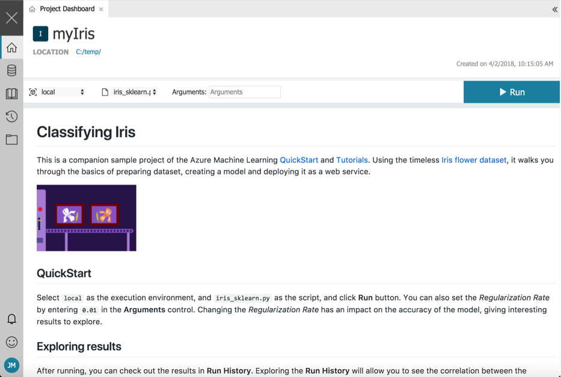
 

## Create a data preparation package

Next, you can explore and start preparing the data in Azure Machine Learning Workbench. Each transformation you perform in Workbench is stored in a JSON format in a local data preparation package (*.dprep file). This data preparation package is the primary container for your data preparation work in Workbench.

This data preparation package can be handed off later to a runtime, such as local-C#/CoreCLR, Scala/Spark, or Scala/HDI. 

1. Select the folder icon to open the Files view, then select **iris.csv** to open that file.

   This file contains a table with 5 columns and 50 rows. Four columns are numerical feature columns. The fifth column is a string target column. None of the columns have header names.

   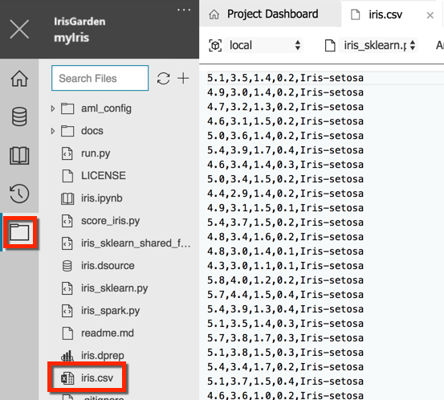

   >[!NOTE]
   > Do not include data files in your project folder, particularly when the file size is large. Because the **iris.csv** data file is tiny, it was included in this template for demonstration purposes. For more information, see [How to read and write large data files](how-to-read-write-files.md).

2. In the **Data view**, select the plus sign (**+**) to add a new data source. The **Add Data Source** page opens. 

   

3. Select **Text Files(\*.csv, \*.json, \*.txt., ...)** and click **Next**.
   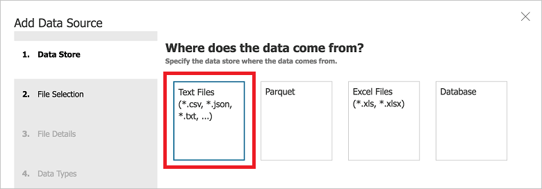

4. Browse to the file **iris.csv**, and click **Finish**. This will use default values for parameters such as the separator and data types.

   >[!IMPORTANT]
   >Make sure you select the **iris.csv** file from within the current project directory for this exercise. Otherwise, later steps might fail.
 
   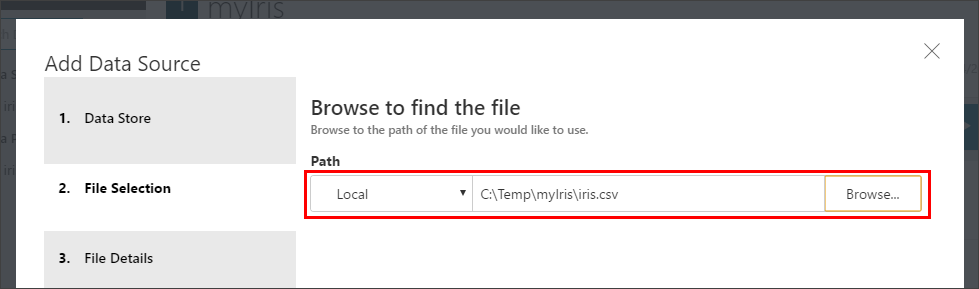
   
5. A new file named **iris-1.dsource** is created. The file is named uniquely with  "-1" because the sample project already comes with an unnumbered **iris.dsource** file.  

   The file opens, and the data is shown. A series of column headers, from **Column1** to **Column5**, is automatically added to this data set. Scroll to the bottom and notice that the last row of the data set is empty. The row is empty because there is an extra line break in the CSV file.

   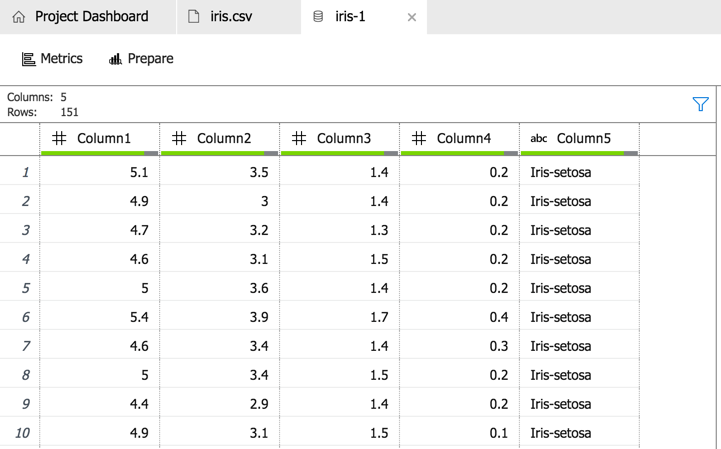

1. Select the **Metrics** button. Histograms are generated and displayed.

   You can switch back to the data view by selecting the **Data** button.
   
   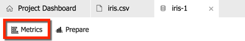

1. Observe the histograms. A complete set of statistics has been calculated for each column. 

   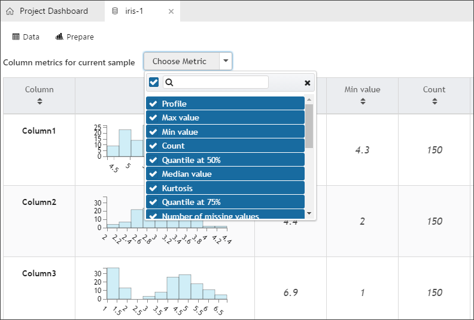

8. Begin creating a data preparation package by selecting the **Prepare** button. The **Prepare** dialog box opens. 

   The sample project contains a **iris.dprep** data preparation file that is selected by default. 

   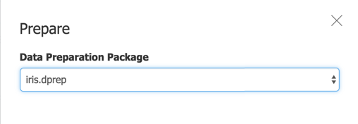

1. Create a new data preparation package by selecting **+ New Data Preparation Package** from the drop-down menu.

   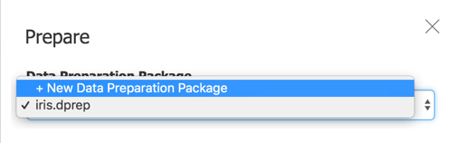

1. Enter a new value for the package name (use **iris-1**) and then select **OK**.

   A new data preparation package named **iris-1.dprep** is created and opened in the data preparation editor.

   

   Now, let's do some basic data preparation. 

1. Select each column header to make the header text editable. Then, rename each column as follows: 

   In order, enter **Sepal Length**, **Sepal Width**, **Petal Length**, **Petal Width**, and **Species** for the five columns respectively.

   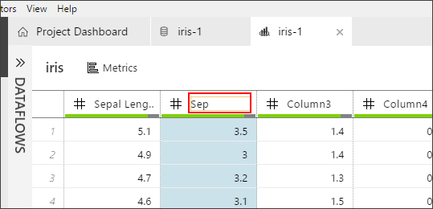

1. Count distinct values:
   1. Select the **Species** column
   1. Right-click to select it. 
   1. Select **Value Counts** from the drop-down menu. 

   The **Inspectors** pane opens below the data. A histogram with four bars appears. The target column has four distinct values: **Iris-virginica**, **Iris-versicolor**, **Iris-setosa**, and a **(null)** value.

   

   

1. To filter out the null values, select the "(null)" bar and then select the minus sign (**-**). 

   Then, the (null) row turns gray to indicate that it was filtered out. 

   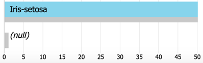

1. Take notice of the individual data preparation steps that are detailed in the **STEPS** pane. As you renamed the columns and filtered the null value rows, each action was recorded as a data preparation step. You can edit individual steps to adjust their settings, reorder the steps, and remove steps.

   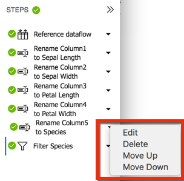

1. Close the data preparation editor. Select the **x** icon on the **iris-1** tab with the graph icon to close the tab. Your work is automatically saved into the **iris-1.dprep** file shown under the **Data Preparations** heading.

   

## Generate Python/PySpark code to invoke a data preparation package

 The output of a data preparation package can be explored directly in Python or in a Jupyter Notebook. The packages can be executed across multiple runtimes including local Python, Spark (including in Docker), and HDInsight. 

1. Find the **iris-1.dprep** file under the Data Preparations tab.

1. Right-click the **iris-1.dprep** file, and select **Generate Data Access Code File** from the context menu. 

   

   A new file named **iris-1.py** opens with the following lines of code to invoke the logic you created as a data preparation package:

   ```python
   # Use the Azure Machine Learning data preparation package
   from azureml.dataprep import package

   # Use the Azure Machine Learning data collector to log various metrics
   from azureml.logging import get_azureml_logger
   logger = get_azureml_logger()

   # This call will load the referenced package and return a DataFrame.
   # If run in a PySpark environment, this call returns a
   # Spark DataFrame. If not, it will return a Pandas DataFrame.
   df = package.run('iris-1.dprep', dataflow_idx=0)

   # Remove this line and add code that uses the DataFrame
   df.head(10)
   ```

   Depending on the context in which this code is run, `df` represents a different kind of DataFrame:
   + When executing on a Python runtime, a [pandas DataFrame](https://pandas.pydata.org/pandas-docs/stable/generated/pandas.DataFrame.html) is used.
   + When executing in a Spark context, a [Spark DataFrame](https://spark.apache.org/docs/latest/sql-programming-guide.html) is used. 
   
   To learn more about how to prepare data in Azure Machine Learning Workbench, see the [Get started with data preparation](data-prep-getting-started.md) guide.

## Clean up resources

[!INCLUDE [aml-delete-resource-group](../../../includes/aml-delete-resource-group.md)]

## Next steps

In this tutorial, you used Azure Machine Learning Workbench to:
> [!div class="checklist"]
> * Create a new project
> * Create a data preparation package
> * Generate Python/PySpark code to invoke a data preparation package

You are ready to move on to the next part in the tutorial series, where you learn how to build an Azure Machine Learning model:
> [!div class="nextstepaction"]
> [Tutorial 2 - Build models](tutorial-classifying-iris-part-2.md)
