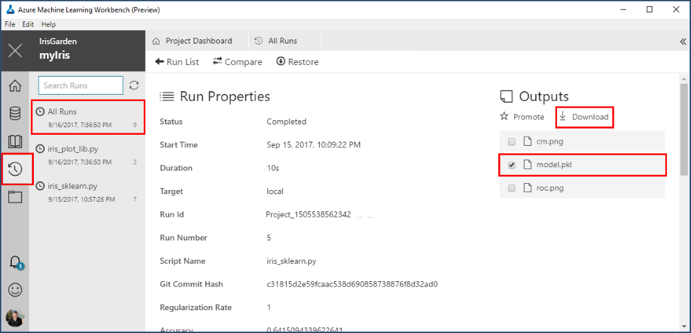
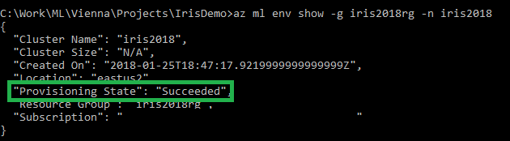

# Tutorial 3: Classify Iris: Deploy a model

[!INCLUDE [workbench-deprecated](../../../includes/aml-deprecating-preview-2017.md)]

Azure Machine Learning (preview) is an integrated, end-to-end data science and advanced analytics solution for professional data scientists. Data scientists can use it to prepare data, develop experiments, and deploy models at cloud scale.

This tutorial is **part three of a three-part series**. In this part of the tutorial, you use Machine Learning (preview) to:

> [!div class="checklist"]
> * Locate the model file.
> * Generate a scoring script and schema file.
> * Prepare the environment.
> * Create a real-time web service.
> * Run the real-time web service.
> * Examine the output blob data. 

This tutorial uses the timeless [Iris flower data set](https://en.wikipedia.org/wiki/Iris_flower_data_set). 

## Prerequisites

To complete this tutorial, you need:
- An Azure subscription. If you don't have an Azure subscription, create a [free account](https://azure.microsoft.com/free/?WT.mc_id=A261C142F) before you begin. 
- An experimentation account and Azure Machine Learning Workbench installed as described in this [quickstart](quickstart-installation.md)
- The classification model from [Tutorial part 2](tutorial-classifying-iris-part-2.md)
- A Docker engine installed and running locally

## Download the model pickle file
In the previous part of the tutorial, the **iris_sklearn.py** script was run in the Machine Learning Workbench locally. This action serialized the logistic regression model by using the popular Python object-serialization package [pickle](https://docs.python.org/3/library/pickle.html). 

1. Open the Machine Learning Workbench application. Then open the **myIris** project you created in the previous parts of the tutorial series.

1. After the project is open, select the **Files** button (folder icon) on the left pane to open the file list in your project folder.

1. Select the **iris_sklearn.py** file. The Python code opens in a new text editor tab inside the workbench.

1. Review the **iris_sklearn.py** file to see where the pickle file was generated. Select Ctrl+F to open the **Find** dialog box, and then find the word **pickle** in the Python code.

   This code snippet shows how the pickle output file was generated. The output pickle file is named **model.pkl** on the disk. 

   ```python
   print("Export the model to model.pkl")
   f = open('./outputs/model.pkl', 'wb')
   pickle.dump(clf1, f)
   f.close()
   ```

1. Locate the model pickle file in the output files of a previous run.
   
   When you ran the **iris_sklearn.py** script, the model file was written to the **outputs** folder with the name **model.pkl**. This folder lives in the execution environment that you choose to run the script, and not in your local project folder. 
   
   a. To locate the file, select the **Runs** button (clock icon) on the left pane to open the list of **All Runs**. 

   b. The **All Runs** tab opens. In the table of runs, select one of the recent runs where the target was **local** and the script name was **iris_sklearn.py**. 

   c. The **Run Properties** pane opens. In the upper-right section of the pane, notice the **Outputs** section.

   d. To download the pickle file, select the check box next to the **model.pkl** file, and then select **Download**. Save the file to the root of your project folder. The file is needed in the upcoming steps.

   

   Read more about the `outputs` folder in [How to read and write large data files](how-to-read-write-files.md).

## Get the scoring script and schema files
To deploy the web service along with the model file, you also need a scoring script. Optionally, you need a schema for the web service input data. The scoring script loads the **model.pkl** file from the current folder and uses it to produce new predictions.

1. Open the Machine Learning Workbench application. Then open the **myIris** project you created in the previous part of the tutorial series.

1. After the project is open, select the **Files** button (folder icon) on the left pane to open the file list in your project folder.

1. Select the **score_iris.py** file. The Python script opens. This file is used as the scoring file.

   

1. To get the schema file, run the script. Select the **local** environment and the **score_iris.py** script in the command bar, and then select **Run**. 

   This script creates a JSON file in the **Outputs** section, which captures the input data schema required by the model.

1. Note the **Jobs** pane on the right side of the **Project Dashboard** pane. Wait for the latest **score_iris.py** job to display the green **Completed** status. Then select the hyperlink **score_iris.py** for the latest job run to see the run details. 

1. On the **Run Properties** pane, in the **Outputs** section, select the newly created **service_schema.json** file. Select the check box next to the file name, and then select **Download**. Save the file into your project root folder.

1. Return to the previous tab where you opened the **score_iris.py** script. By using data collection, you can capture model inputs and predictions from the web service. The following steps are of particular interest for data collection.

1. Review the code at the top of the file, which imports class **ModelDataCollector**, because it contains the model data collection functionality:

   ```python
   from azureml.datacollector import ModelDataCollector
   ```

1. Review the following lines of code in the **init()** function that instantiates **ModelDataCollector**:

    ```python
    global inputs_dc, prediction_dc
    inputs_dc = ModelDataCollector('model.pkl',identifier="inputs")
    prediction_dc = ModelDataCollector('model.pkl', identifier="prediction")`
    ```

1. Review the following lines of code in the **run(input_df)** function as it collects the input and prediction data:

    ```python
    inputs_dc.collect(input_df)
    prediction_dc.collect(pred)
    ```

Now you're ready to prepare your environment to operationalize the model.

## Prepare to operationalize locally [For development and testing your service]
Use _local mode_ deployment to run in Docker containers on your local computer.

You can use _local mode_ for development and testing. The Docker engine must be running locally to complete the following steps to operationalize the model. You can use the `-h` flag at the end of each command to show the corresponding help message.

>[!NOTE]
>If you don't have the Docker engine locally, you can still proceed by creating a cluster in Azure for deployment. You can keep the cluster for re-use, or delete it after the tutorial so you don't incur ongoing charges.

>[!NOTE]
>Web services deployed locally do not show up in Azure Portal's list of services. They will be running in Docker on the local machine.

1. Open the command-line interface (CLI).
   In the Machine Learning Workbench application, on the **File** menu, select **Open Command Prompt**.

   The command-line prompt opens in your current project folder location **c:\temp\myIris>**.


1. Make sure the Azure resource provider **Microsoft.ContainerRegistry** is registered in your subscription. You must register this resource provider before you can create      an environment in step 3. You can check to see if it's already registered by using the following command:
   ``` 
   az provider list --query "[].{Provider:namespace, Status:registrationState}" --out table 
   ``` 

   You should see output like this: 
   ```
   Provider                                  Status 
   --------                                  ------
   Microsoft.Authorization                   Registered 
   Microsoft.ContainerRegistry               Registered 
   microsoft.insights                        Registered 
   Microsoft.MachineLearningExperimentation  Registered 
   ... 
   ```
   
   If **Microsoft.ContainerRegistry** is not registered, you can register it by using the following command:
   ``` 
   az provider register --namespace Microsoft.ContainerRegistry 
   ```
   Registration can take a few minutes. You can check on its status by using the previous **az provider list** command or the following command:
   ``` 
   az provider show -n Microsoft.ContainerRegistry 
   ``` 

   The third line of the output displays **"registrationState": "Registering"**. Wait a few moments and repeat the **show** command until the output displays **"registrationState": "Registered"**.

   >[!NOTE] 
   If you are deploying to an ACS cluster, you need register the **Microsoft.ContainerService** resource provider as well using the exact same approach.

1. Create the environment. You must run this step once per environment. For example, run it once for development environment, and once for production. Use _local mode_ for this first environment. You can try the `-c` or `--cluster` switch in the following command to set up an environment in _cluster mode_ later.

   The following setup command requires you to have Contributor access to the subscription. If you don't have that, you need at least Contributor access to the resource group that you are deploying to. In the latter case, you need to specify the resource group name as part of the setup command by using the `-g` flag. 

   ```azurecli
   az ml env setup -n <new deployment environment name> --location <e.g. eastus2>
   ```
   
   Follow the on-screen instructions to provision a storage account for storing Docker images, an Azure container registry that lists the Docker images, and an Azure Application Insights account that gathers telemetry. If you use the `-c` switch, the command will additionally create a Container Service cluster.
   
   The cluster name is a way for you to identify the environment. The location should be the same as the location of the Model Management account you created from the Azure portal.

   To make sure that the environment is set up successfully, use the following command to check the status:

   ```azurecli
   az ml env show -n <deployment environment name> -g <existing resource group name>
   ```

   Make sure that "Provisioning State" has the value "Succeeded", as shown, before you set the environment in step 5:

   
 
1. If you didn't create a Model Management account in previous parts of this tutorial, do so now. This is a one-time setup.
   ```azurecli
   az ml account modelmanagement create --location <e.g. eastus2> -n <new model management account name> -g <existing resource group name> --sku-name S1
   ```
   
1. Set the Model Management account.
   ```azurecli
   az ml account modelmanagement set -n <youracctname> -g <yourresourcegroupname>
   ```

1. Set the environment.

   After the setup finishes, use the following command to set the environment variables required to operationalize the environment. Use the same environment name that you used previously in step 3. Use the same resource group name that was output in the command window when the setup process finished.

   ```azurecli
   az ml env set -n <deployment environment name> -g <existing resource group name>
   ```

1. To verify that you have properly configured your operationalized environment for local web service deployment, enter the following command:

   ```azurecli
   az ml env show
   ```

Now you're ready to create the real-time web service.

>[!NOTE]
>You can reuse your Model Management account and environment for subsequent web service deployments. You don't need to create them for each web service. An account or an environment can have multiple web services associated with it.

## Create a real-time web service in one command
1. To create a real-time web service, use the following command:

   ```azurecli
   az ml service create realtime -f score_iris.py --model-file model.pkl -s ./output/service_schema.json -n irisapp -r python --collect-model-data true -c aml_config\conda_dependencies.yml
   ```
   This command generates a web service ID you can use later. Omit the output directory if in a notebook.

   The following switches are used with the **az ml service create realtime** command:

   * `-f`: The scoring script file name.

   * `--model-file`: The model file. In this case, it's the pickled model.pkl file.

   * `-s`: The service schema. This was generated in a previous step by running the **score_iris.py** script locally.

   * `-n`: The app name, which must be all lowercase.

   * `-r`: The runtime of the model. In this case, it's a Python model. Valid runtimes are `python` and `spark-py`.

   * `--collect-model-data true`: This switch enables data collection.

   * `-c`: Path to the conda dependencies file where additional packages are specified.

   >[!IMPORTANT]
   >The service name, which is also the new Docker image name, must be all lowercase. Otherwise, you get an error. 

1. When you run the command, the model and the scoring files are uploaded to the storage account you created as part of the environment setup. The deployment process builds a Docker image with your model, schema, and scoring file in it, and then pushes it to the Azure container registry: **\<ACR_name\>.azurecr.io/\<imagename\>:\<version\>**. 

   The command pulls down the image locally to your computer and then starts a Docker container based on that image. If your environment is configured in cluster mode, the Docker container is deployed into the Azure Cloud Services Kubernetes cluster instead.

   As part of the deployment, an HTTP REST endpoint for the web service is created on your local machine. After a few minutes, the command should finish with a success message. Your web service is ready for action!

1. To see the running Docker container, use the **docker ps** command:

   ```azurecli
   docker ps
   ```

## [Optional alternative] Create a real-time web service by using separate commands
As an alternative to the **az ml service create realtime** command shown previously, you also can perform the steps separately. 

First, register the model. Then generate the manifest, build the Docker image, and create the web service. This step-by-step approach gives you more flexibility at each step. Additionally, you can reuse the entities generated in previous steps and rebuild the entities only when needed.

1. Register the model by providing the pickle file name.

   ```azurecli
   az ml model register --model model.pkl --name model.pkl
   ```
   This command generates a model ID.

1. Create a manifest.

   To create a manifest, use the following command and provide the model ID output from the previous step:

   ```azurecli
   az ml manifest create --manifest-name <new manifest name> -f score_iris.py -r python -i <model ID> -s ./output/service_schema.json -c aml_config\conda_dependencies.yml
   ```
   This command generates a manifest ID.  Omit the output directory if in a notebook.

1. Create a Docker image.

   To create a Docker image, use the following command and provide the manifest ID value output from the previous step. You also can optionally include the conda dependencies by using the `-c` switch.

   ```azurecli
   az ml image create -n irisimage --manifest-id <manifest ID> 
   ```
   This command generates a Docker image ID.
   
1. Create the service.

   To create a service, use the following command and provide the image ID output from the previous step:

   ```azurecli
   az ml service create realtime --image-id <image ID> -n irisapp --collect-model-data true
   ```
   This command generates a web service ID.

You are now ready to run the web service.

## Run the real-time web service

To test the **irisapp** web service that's running, use a JSON-encoded record containing an array of four random numbers.

1. The web service includes sample data. When running in local mode, you can call the **az ml service usage realtime** command. That call retrieves a sample run command that you can use to test the service. The call also retrieves the scoring URL that you can use to incorporate the service into your own custom app.

   ```azurecli
   az ml service usage realtime -i <web service ID>
   ```

1. To test the service, execute the returned service run command:
    
   ```azurecli
   az ml service run realtime -i <web service ID> -d '{\"input_df\": [{\"petal width\": 0.25, \"sepal length\": 3.0, \"sepal width\": 3.6, \"petal length\": 1.3}]}'
   ```

   The output is **"Iris-setosa"**, which is the predicted class. (Your result might be different.) 

## View the collected data in Azure Blob storage

1. Sign in to the [Azure portal](https://portal.azure.com).

1. Locate your storage accounts. To do so, select **All Services**.

1. In the search box, enter **Storage accounts**, and then select Enter.

1. From the **Storage accounts** search box, select the **Storage account** resource matching your environment. 

   > [!TIP]
   > To determine which storage account is in use:
   > 1. Open Machine Learning Workbench.
   > 1. Select the project you're working on.
   > 1. Open a command line prompt from the **File** menu.
   > 1. At the command line prompt, enter `az ml env show -v`, and check the *storage_account* value. This is the name of your storage account.

1. After the **Storage account** pane opens, select **Blobs** from the **Services** section. Locate the container named **modeldata**. 
 
   If you don't see any data, you might need to wait up to 10 minutes after the first web-service request to see the data propagate to the storage account.

   Data flows into blobs with the following container path:

   ```
   /modeldata/<subscription_id>/<resource_group_name>/<model_management_account_name>/<webservice_name>/<model_id>-<model_name>-<model_version>/<identifier>/<year>/<month>/<day>/data.csv
   ```

1. You can consume this data from Azure Blob storage. There are a variety of tools that use both Microsoft software and open-source tools, such as:

   * Machine Learning: Open the CSV file by adding the CSV file as a data source.

   * Excel: Open the daily CSV files as a spreadsheet.

   * [Power BI](https://powerbi.microsoft.com/documentation/powerbi-azure-and-power-bi/): Create charts with data pulled from the CSV data in blobs.

   * [Hive](https://docs.microsoft.com/azure/hdinsight/hdinsight-hadoop-linux-tutorial-get-started): Load the CSV data into a Hive table, and perform SQL queries directly against the blobs.

   * [Spark](https://docs.microsoft.com/azure/hdinsight/hdinsight-apache-spark-overview): Create a DataFrame with a large portion of CSV data.

      ```python
      var df = spark.read.format("com.databricks.spark.csv").option("inferSchema","true").option("header","true").load("wasb://modeldata@<storageaccount>.blob.core.windows.net/<subscription_id>/<resource_group_name>/<model_management_account_name>/<webservice_name>/<model_id>-<model_name>-<model_version>/<identifier>/<year>/<month>/<date>/*")
      ```

## Clean up resources

[!INCLUDE [aml-delete-resource-group](../../../includes/aml-delete-resource-group.md)]

## Next steps
In this third part of the three-part tutorial series, you have learned how to use Machine Learning to:
> [!div class="checklist"]
> * Locate the model file.
> * Generate a scoring script and schema file.
> * Prepare the environment.
> * Create a real-time web service.
> * Run the real-time web service.
> * Examine the output blob data. 

You have successfully run a training script in various compute environments. You have also created, serialized, and operationalized a model through a Docker-based web service. 

You are now ready to do advanced data preparation:
> [!div class="nextstepaction"]
> [Tutorial 4 - Advanced data preparation](tutorial-bikeshare-dataprep.md)
