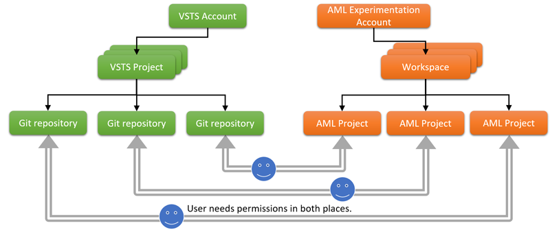
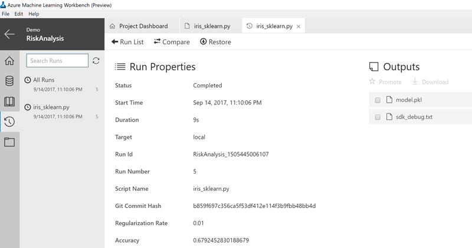

# Use a Git repo with a Machine Learning Workbench project

[!INCLUDE [workbench-deprecated](../../../includes/aml-deprecating-preview-2017.md)] 


Learn how Azure Machine Learning Workbench uses Git to provide version control, and ensure reproducibility in your data science experiment. Learn how to associate your project with a cloud Git repository (repo).

Machine Learning Workbench is designed for Git integration. When you create a new project, the project folder is automatically "Git-initialized" as a local Git repo. A second, hidden local Git repo is also created, with a branch named AzureMLHistory/\<project GUID\>. The branch keeps track of project folder changes for each execution. 

Associating the Azure Machine Learning project with a Git repo enables automatic version control, locally and remotely. The Git repo is hosted in Azure DevOps. Because the Machine Learning project is associated with a Git repo, anybody who has access to the remote repo can download the latest source code to another computer (roaming).  

> [!NOTE]
> Azure DevOps has its own access control list (ACL), which is independent of the Azure Machine Learning Experimentation service. User access might vary between a Git repo and a Machine Learning workspace or project. You might need to manage access. 
> 
> Whether you want to give a team member code-level access to your Machine Learning project or just share the workspace, you need to grant the user the correct permissions to access the Azure DevOps Git repo. 

To manage version control with Git, you can either use the master branch or create other branches in the repo. You can also use the local Git repo, and push to the remote Git repo, if it's provisioned.

This diagram depicts the relationship between an Azure DevOps Git repo and a Machine Learning project:



To get started using a remote Git repo, complete the steps that are described in the following sections.

> [!NOTE]
> Currently, Azure Machine Learning supports Git repositories only on Azure DevOps organizations.

## Step 1. Create a Machine Learning Experimentation account
Create a Machine Learning Experimentation account and install the Azure Machine Learning Workbench app. For more information, see [Install and create Quickstart](quickstart-installation.md).

## Step 2. Create an Azure DevOps project or use an existing project
In the [Azure portal](https://portal.azure.com/), create a new project:
1. Select **+**.
2. Search for **Team Project**.
3. Enter the required information:
    - **Name**: A team name.
    - **Version Control**: Select **Git**.
    - **Subscription**: Select a subscription that has a Machine Learning Experimentation account.
    - **Location**: Ideally, choose a region that is close to your Machine Learning Experimentation resources.
4. Select **Create**. 


Ensure that you sign in by using the same Azure Active Directory (Azure AD) account that you use to access Machine Learning Workbench. Otherwise, the system cannot access Machine Learning Workbench by using your Azure AD credentials. An exception is if you use the command line to create the Machine Learning project, and supply a personal access token to access the Git repo. We discuss this in more detail later in the article.

To go directly to the project that you created, use the URL https://\<project name\>.visualstudio.com.

## Step 3. Set up a Machine Learning project and Git repo

To set up a Machine Learning project, you have two options:
- Create a Machine Learning project that has a remote Git repo
- Associate an existing Machine Learning project with an Azure DevOps Git repo

### Create a Machine Learning project that has a remote Git repo
Open Machine Learning Workbench and create a new project. In the **Git repo** box, enter the Azure DevOps Git repo URL from Step 2. It usually looks like this: https://\<Azure DevOps organization name\>.visualstudio.com/_git/\<project name\>


You can also create the project by using the Azure command-line tool (Azure CLI). You have the option of entering a personal access token. Machine Learning can use this token to access the Git repo instead of using your Azure AD credentials:

```
# Create a new project that has a Git repo by using a personal access token.
$ az ml project create -a <Experimentation account name> -n <project name> -g <resource group name> -w <workspace name> -r <Git repo URL> --vststoken <Azure DevOps personal access token>
```

> [!IMPORTANT]
> If you choose the blank project template, the Git repo you choose to use might already have a master branch. Machine Learning simply clones the master branch locally. It adds the aml_config folder and other project metadata files to the local project folder. 
>
> If you choose any other project template, your Git repo *cannot* already have a master branch. If it does, you see an error. The alternative is to use the `az ml project create` command to create the project, with a `--force` switch. This deletes the files in the original master branch and replaces them with the new files in the template that you choose.

A new Machine Learning project is created, with remote Git repo integration enabled. The project folder is always Git-initialized as a local Git repo. The Git remote is set to the remote Azure DevOps Git repo, so you can push commits to the remote Git repo.

### Associate an existing Machine Learning project with an Azure DevOps Git repo
You can create a Machine Learning project without an Azure DevOps Git repo, and rely on the local Git repo for run history snapshots. Later, you can associate an Azure DevOps Git repo with this existing Machine Learning project by using the following command:

```azurecli
# Ensure that you are in the project path so Azure CLI has the context of your current project.
$ az ml project update --repo https://<Azure DevOps organization name>.visualstudio.com/_git/<project name>
```

> [!NOTE] 
> You can perform the update-repo operation only on a Machine Learning project that doesn't have a Git repo associated with it. Also, after you associate a Git repo with a Machine Learning, you can't remove it.

## Step 4. Capture a project snapshot in the Git repo
Execute a few script runs in the project, and make some changes in between the runs. You can do this either in the desktop app, or from Azure CLI by using the `az ml experiment submit` command. For more information, see the [Classifying Iris tutorial](tutorial-classifying-iris-part-1.md). For each run, if any change is made in any file in the project folder, a snapshot of the entire project folder is committed and pushed to the remote Git repo under a branch named AzureMLHistory/\<project GUID\>. To view the branches and commits, including the AzureMLHistory/\<project GUID\> branch, go to the Azure DevOps Git repo URL. 

> [!NOTE] 
> The snapshot is committed only before a script execution. Currently, a data prep execution or a Notebook cell execution doesn't trigger the snapshot.


> [!IMPORTANT] 
> It's best if you don't operate in the history branch by using Git commands. It might interfere with the run history. Instead, use the master branch or create other branches for your own Git operations.

## Step 5. Restore a previous project snapshot 
To restore the entire project folder to the state of a previous run history snapshot, in Machine Learning Workbench:
1. In the activity bar (hourglass icon), select **Runs**.
2. In the **Run List** view, select the run that you want to restore.
3. In the **Run Detail** view, select **Restore**.



Optionally, you can use the following commands in the Azure CLI window in Machine Learning Workbench:

```azurecli
# Discover the run I want to restore a snapshot from.
$ az ml history list -o table

# Restore the snapshot from a specific run.
$ az ml project restore --run-id <run ID>
```

Be cautious when you run this command. Executing this command overwrites the entire project folder with the snapshot that was taken when that specific run was kicked off. Your project stays in the current branch. This means that you **lose all changes** in your current project folder.  

You might want to use Git to commit your changes to the current branch before you perform this operation.

## Step 6. Use the master branch
One way to avoid accidentally losing your current project state is to commit the project to the master branch of the Git repo (or to any branch that you created yourself). You can use Git from the command line or from your favorite Git client tool to operate on the master branch. For example:

```sh
# Check status to make sure you are on the master branch (or branch of your choice).
$ git status

# Stage all changes.
$ git add -A

# Commit all changes locally on the master branch.
$ git commit -m 'these are my updates so far'

# Push changes to the remote Azure DevOps Git repo master branch.
$ git push origin master
```

Now, you can safely restore the project to an earlier snapshot by completing Step 5. You can always come back to the commit you just made on the master branch.

## Authentication
If you rely only on the run history functions in Machine Learning to take project snapshots and restore them, you don't need to worry about Git repo authentication. Authentication is handled by the Machine Learning Experimentation service layer.

However, if you use your own Git tools to manage version control, you need to handle authentication against the remote Git repo in Azure DevOps. In Machine Learning, the remote Git repo is added to the local repo as a Git remote by using the HTTPS protocol. This means that when you issue Git commands (such as push or pull) to the remote, you need to provide your user name and password, or a personal access token. To create a personal access token in an Azure DevOps Git repo, follow the instructions in [Use a personal access token to authenticate](https://docs.microsoft.com/azure/devops/organizations/accounts/use-personal-access-tokens-to-authenticate).

## Next steps
- Learn how to [use the Team Data Science Process to organize your project structure](how-to-use-tdsp-in-azure-ml.md).
