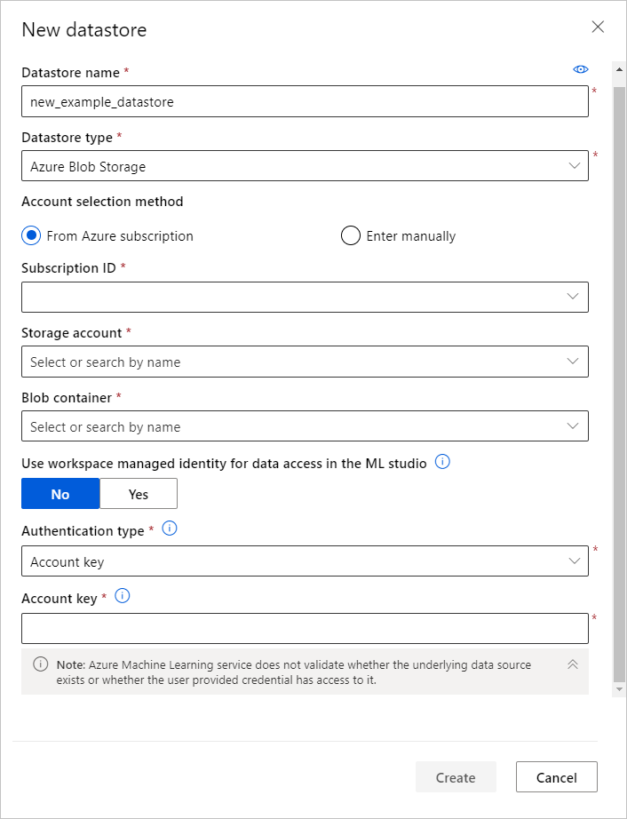

# Access data in Azure storage services
[!INCLUDE [aml-applies-to-basic-enterprise-sku](../../includes/aml-applies-to-basic-enterprise-sku.md)]

In this article, learn how to easily access your data in Azure Storage services via Azure Machine Learning datastores. Datastores are used to store connection information, like your subscription ID and token authorization. When you use datastores, you can access your storage without having to hard code connection information in your scripts. 

You can create datastores from [these Azure Storage solutions](#matrix). For unsupported storage solutions, and to save data egress cost during machine learning experiments, we recommend that you [move your data](#move) to supported Azure Storage solutions. 

## Prerequisites
You'll need:
- An Azure subscription. If you don’t have an Azure subscription, create a free account before you begin. Try the [free or paid version of Azure Machine Learning](https://aka.ms/AMLFree).

- An Azure storage account with an [Azure blob container](https://docs.microsoft.com/azure/storage/blobs/storage-blobs-overview) or [Azure file share](https://docs.microsoft.com/azure/storage/files/storage-files-introduction).

- The [Azure Machine Learning SDK for Python](https://docs.microsoft.com/python/api/overview/azure/ml/intro?view=azure-ml-py), or access to [Azure Machine Learning studio](https://ml.azure.com/).

- An Azure Machine Learning workspace.
  
  Either [create an Azure Machine Learning workspace](how-to-manage-workspace.md) or use an existing one via the Python SDK:

   ```Python
   import azureml.core
   from azureml.core import Workspace, Datastore
        
   ws = Workspace.from_config()
   ```
<a name="matrix"></a>

## Supported data storage service types

Datastores currently support storing connection information to the storage services listed in the following matrix.

| Storage&nbsp;type | Authentication&nbsp;type | [Azure&nbsp;Machine&nbsp;Learning studio](https://ml.azure.com/) | [Azure&nbsp;Machine&nbsp;Learning&nbsp; Python SDK](https://docs.microsoft.com/python/api/overview/azure/ml/intro?view=azure-ml-py) |  [Azure&nbsp;Machine&nbsp;Learning CLI](reference-azure-machine-learning-cli.md) | [Azure&nbsp;Machine&nbsp;Learning&nbsp; Rest API](https://docs.microsoft.com/rest/api/azureml/)
---|---|---|---|---|---
[Azure&nbsp;Blob&nbsp;Storage](https://docs.microsoft.com/azure/storage/blobs/storage-blobs-overview)| Account key <br> SAS token | ✓ | ✓ | ✓ |✓
[Azure&nbsp;File&nbsp;Share]((https://docs.microsoft.com/azure/storage/files/storage-files-introduction))| Account key <br> SAS token | ✓ | ✓ | ✓ |✓
[Azure&nbsp;Data Lake&nbsp;Storage Gen&nbsp;1](https://docs.microsoft.com/azure/data-lake-store/)| Service principal| ✓ | ✓ | ✓ |✓
[Azure&nbsp;Data Lake&nbsp;Storage Gen&nbsp;2](https://docs.microsoft.com/azure/storage/blobs/data-lake-storage-introduction)| Service principal| ✓ | ✓ | ✓ |✓
Azure&nbsp;SQL&nbsp;Database| SQL authentication <br>Service principal| ✓ | ✓ | ✓ |✓
Azure&nbsp;PostgreSQL | SQL authentication| ✓ | ✓ | ✓ |✓
Azure&nbsp;Database&nbsp;for&nbsp;MySQL | SQL authentication|  | ✓ | ✓ |✓
Databricks&nbsp;File&nbsp;System| No authentication | | ✓* | ✓ * |✓* 

*only supported on local compute target scenarios

### Storage guidance

We recommend creating a datastore for an Azure blob container.  
Both standard and premium storage are available for blobs. Although premium storage is more expensive, its faster throughput speeds might improve the speed of your training runs, particularly if you train against a large dataset. For information about the cost of storage accounts, see the [Azure pricing calculator](https://azure.microsoft.com/pricing/calculator/?service=machine-learning-service).

When you create a workspace, an Azure blob container and an Azure file share are automatically registered to the workspace. They're named `workspaceblobstore` and `workspacefilestore`, respectively. They store the connection information for the blob container and the file share that are provisioned in the storage account attached to the workspace. The `workspaceblobstore` container is set as the default datastore.

<a name="access"></a>

## Create and register datastores

When you register an Azure Storage solution as a datastore, you automatically create and register that datastore to a specific workspace. You can create and register datastores to a workspace by using the Python SDK or Azure Machine Learning studio.

>[!IMPORTANT]
> As part of the current datastore create and register process, Azure Machine Learning validates that the user provided principal (username, service principal or SAS token) has access to the underlying storage service. 
<br>
However, for Azure Data Lake Storage Gen 1 and 2 datastores, this validation  happens later when data access methods like [`from_files()`](https://docs.microsoft.com/python/api/azureml-core/azureml.data.dataset_factory.filedatasetfactory?view=azure-ml-py) or [`from_delimited_files()`](https://docs.microsoft.com/python/api/azureml-core/azureml.data.dataset_factory.tabulardatasetfactory?view=azure-ml-py#from-parquet-files-path--validate-true--include-path-false--set-column-types-none--partition-format-none-) are called. 

### Python SDK

All the register methods are on the [`Datastore`](https://docs.microsoft.com/python/api/azureml-core/azureml.core.datastore(class)?view=azure-ml-py) class and have the form `register_azure_*`.

You can find the information that you need to populate the `register()` method by using the [Azure portal](https://portal.azure.com):

1. Select **Storage Accounts** on the left pane, and choose the storage account that you want to register. 
2. For information like the account name, container, and file share name, go to the **Overview** page. For authentication information, like account key or SAS token, go to **Access Keys** on the **Settings** pane. 

> [!IMPORTANT]
> If your storage account is in a virtual network, only the creation of an Azure blob datastore is supported. To grant your workspace access to your storage account, set the parameter `grant_workspace_access` to `True`.

The following examples show how to register an Azure blob container, an Azure file share, and Azure Data Lake Storage Generation 2 as a datastore. For other storage services, please see the [reference documentation for the `register_azure_*` methods](https://docs.microsoft.com/python/api/azureml-core/azureml.core.datastore.datastore?view=azure-ml-py#methods).

#### Blob container

To register an Azure blob container as a datastore, use [`register_azure_blob-container()`](https://docs.microsoft.com/python/api/azureml-core/azureml.core.datastore(class)?view=azure-ml-py#register-azure-blob-container-workspace--datastore-name--container-name--account-name--sas-token-none--account-key-none--protocol-none--endpoint-none--overwrite-false--create-if-not-exists-false--skip-validation-false--blob-cache-timeout-none--grant-workspace-access-false--subscription-id-none--resource-group-none-).

The following code creates and registers the `blob_datastore_name` datastore to the `ws` workspace. This datastore accesses the `my-container-name` blob container on the `my-account-name` storage account, by using the provided account key.

```Python
blob_datastore_name='azblobsdk' # Name of the datastore to workspace
container_name=os.getenv("BLOB_CONTAINER", "<my-container-name>") # Name of Azure blob container
account_name=os.getenv("BLOB_ACCOUNTNAME", "<my-account-name>") # Storage account name
account_key=os.getenv("BLOB_ACCOUNT_KEY", "<my-account-key>") # Storage account key

blob_datastore = Datastore.register_azure_blob_container(workspace=ws, 
                                                         datastore_name=blob_datastore_name, 
                                                         container_name=container_name, 
                                                         account_name=account_name,
                                                         account_key=account_key)
```

#### File share

To register an Azure file share as a datastore, use [`register_azure_file_share()`](https://docs.microsoft.com/python/api/azureml-core/azureml.core.datastore(class)?view=azure-ml-py#register-azure-file-share-workspace--datastore-name--file-share-name--account-name--sas-token-none--account-key-none--protocol-none--endpoint-none--overwrite-false--create-if-not-exists-false--skip-validation-false-). 

The following code creates and registers the `file_datastore_name` datastore to the `ws` workspace. This datastore accesses the `my-fileshare-name` file share on the `my-account-name` storage account, by using the provided account key.

```Python
file_datastore_name='azfilesharesdk' # Name of the datastore to workspace
file_share_name=os.getenv("FILE_SHARE_CONTAINER", "<my-fileshare-name>") # Name of Azure file share container
account_name=os.getenv("FILE_SHARE_ACCOUNTNAME", "<my-account-name>") # Storage account name
account_key=os.getenv("FILE_SHARE_ACCOUNT_KEY", "<my-account-key>") # Storage account key

file_datastore = Datastore.register_azure_file_share(workspace=ws,
                                                     datastore_name=file_datastore_name, 
                                                     file_share_name=file_share_name, 
                                                     account_name=account_name,
                                                     account_key=account_key)
```

#### Azure Data Lake Storage Generation 2

For an Azure Data Lake Storage Generation 2 (ADLS Gen 2) datastore, use [register_azure_data_lake_gen2()](https://docs.microsoft.com/python/api/azureml-core/azureml.core.datastore.datastore?view=azure-ml-py#register-azure-data-lake-gen2-workspace--datastore-name--filesystem--account-name--tenant-id--client-id--client-secret--resource-url-none--authority-url-none--protocol-none--endpoint-none--overwrite-false-) to register a credential datastore connected to an Azure DataLake Gen 2 storage with service principal permissions. Learn more about [access control set up for ADLS Gen 2](https://docs.microsoft.com/azure/storage/blobs/data-lake-storage-access-control). 

The following code creates and registers the `adlsgen2_datastore_name` datastore to the `ws` workspace. This datastore accesses the file system `test` on the `account_name` storage account, by using the provided service principal credentials.

```python 
adlsgen2_datastore_name = 'adlsgen2datastore'

subscription_id=os.getenv("ADL_SUBSCRIPTION", "<my_subscription_id>") # subscription id of ADLS account
resource_group=os.getenv("ADL_RESOURCE_GROUP", "<my_resource_group>") # resource group of ADLS account

account_name=os.getenv("ADLSGEN2_ACCOUNTNAME", "<my_account_name>") # ADLS Gen2 account name
tenant_id=os.getenv("ADLSGEN2_TENANT", "<my_tenant_id>") # tenant id of service principal
client_id=os.getenv("ADLSGEN2_CLIENTID", "<my_client_id>") # client id of service principal
client_secret=os.getenv("ADLSGEN2_CLIENT_SECRET", "<my_client_secret>") # the secret of service principal

adlsgen2_datastore = Datastore.register_azure_data_lake_gen2(workspace=ws,
                                                             datastore_name=adlsgen2_datastore_name,
                                                             account_name=account_name, # ADLS Gen2 account name
                                                             filesystem='test', # ADLS Gen2 filesystem
                                                             tenant_id=tenant_id, # tenant id of service principal
                                                             client_id=client_id, # client id of service principal
                                                             client_secret=client_secret) # the secret of service principal
```

### Azure Machine Learning studio 

Create a new datastore in a few steps in Azure Machine Learning studio:

1. Sign in to [Azure Machine Learning studio](https://ml.azure.com/).
1. Select **Datastores** on the left pane under **Manage**.
1. Select **+ New datastore**.
1. Complete the form for a new datastore. The form intelligently updates itself based on your selections for Azure Storage type and authentication type.
  
You can find the information that you need to populate the form on the  [Azure portal](https://portal.azure.com). Select **Storage Accounts** on the left pane, and choose the storage account that you want to register. The **Overview** page provides information such as the account name, container, and file share name. For authentication items, like account key or SAS token, go to **Account Keys** on the **Settings** pane.

The following example demonstrates what the form looks like when you create an Azure blob datastore: 
    



<a name="get"></a>

## Get datastores from your workspace

To get a specific datastore registered in the current workspace, use the [`get()`](https://docs.microsoft.com/python/api/azureml-core/azureml.core.datastore(class)?view=azure-ml-py#get-workspace--datastore-name-) static method on the `Datastore` class:

```Python
# Get a named datastore from the current workspace
datastore = Datastore.get(ws, datastore_name='your datastore name')
```
To get the list of datastores registered with a given workspace, you can use the [`datastores`](https://docs.microsoft.com/python/api/azureml-core/azureml.core.workspace%28class%29?view=azure-ml-py#datastores) property on a workspace object:

```Python
# List all datastores registered in the current workspace
datastores = ws.datastores
for name, datastore in datastores.items():
    print(name, datastore.datastore_type)
```

To get the workspace's default datastore, use this line:

```Python
datastore = ws.get_default_datastore()
```

To define a different default datastore for the current workspace, use the [`set_default_datastore()`](https://docs.microsoft.com/python/api/azureml-core/azureml.core.workspace(class)?view=azure-ml-py#set-default-datastore-name-) method on the workspace object:

```Python
# Define the default datastore for the current workspace
ws.set_default_datastore('your datastore name')
```

<a name="up-and-down"></a>
## Upload and download data

The [`upload()`](https://docs.microsoft.com/python/api/azureml-core/azureml.data.azure_storage_datastore.azureblobdatastore?view=azure-ml-py#upload-src-dir--target-path-none--overwrite-false--show-progress-true-) and [`download()`](https://docs.microsoft.com/python/api/azureml-core/azureml.data.azure_storage_datastore.azureblobdatastore?view=azure-ml-py#download-target-path--prefix-none--overwrite-false--show-progress-true-) methods described in the following examples are specific to, and operate identically for, the [AzureBlobDatastore](https://docs.microsoft.com/python/api/azureml-core/azureml.data.azure_storage_datastore.azureblobdatastore?view=azure-ml-py) and [AzureFileDatastore](https://docs.microsoft.com/python/api/azureml-core/azureml.data.azure_storage_datastore.azurefiledatastore?view=azure-ml-py) classes.

### Upload

Upload either a directory or individual files to the datastore by using the Python SDK:

```Python
datastore.upload(src_dir='your source directory',
                 target_path='your target path',
                 overwrite=True,
                 show_progress=True)
```

The `target_path` parameter specifies the location in the file share (or blob container) to upload. It defaults to `None`, so the data is uploaded to root. If `overwrite=True`, any existing data at `target_path` is overwritten.

You can also upload a list of individual files to the datastore via the `upload_files()` method.

### Download

Download data from a datastore to your local file system:

```Python
datastore.download(target_path='your target path',
                   prefix='your prefix',
                   show_progress=True)
```

The `target_path` parameter is the location of the local directory to download the data to. To specify a path to the folder in the file share (or blob container) to download, provide that path to `prefix`. If `prefix` is `None`, all the contents of your file share (or blob container) will be downloaded.

<a name="train"></a>

## Access your data during training

To interact with data in your datastores or to package your data into a consumable object for machine learning tasks, like training, [create an Azure Machine Learning dataset](how-to-create-register-datasets.md). Datasets provide functions that load tabular data into a pandas or Spark DataFrame. Datasets also provide the ability to download or mount files of any format from Azure Blob storage, Azure Files, Azure Data Lake Storage Gen1, Azure Data Lake Storage Gen2, Azure SQL Database, and Azure Database for PostgreSQL. [Learn more about how to train with datasets](how-to-train-with-datasets.md).

### Accessing source code during training

Azure Blob storage has higher throughput speeds than an Azure file share and will scale to large numbers of jobs started in parallel. For this reason, we recommend configuring your runs to use Blob storage for transferring source code files.

The following code example specifies in the run configuration which blob datastore to use for source code transfers:

```python 
# workspaceblobstore is the default blob storage
run_config.source_directory_data_store = "workspaceblobstore" 
```

## Access data during scoring

Azure Machine Learning provides several ways to use your models for scoring. Some of these methods don't provide access to datastores. Use the following table to understand which methods allow you to access datastores during scoring:

| Method | Datastore access | Description |
| ----- | :-----: | ----- |
| [Batch prediction](how-to-run-batch-predictions.md) | ✔ | Make predictions on large quantities of data asynchronously. |
| [Web service](how-to-deploy-and-where.md) | &nbsp; | Deploy models as a web service. |
| [Azure IoT Edge module](how-to-deploy-and-where.md) | &nbsp; | Deploy models to IoT Edge devices. |

For situations where the SDK doesn't provide access to datastores, you might be able to create custom code by using the relevant Azure SDK to access the data. For example, the [Azure Storage SDK for Python](https://github.com/Azure/azure-storage-python) is a client library that you can use to access data stored in blobs or files.

<a name="move"></a>

## Move data to supported Azure Storage solutions

Azure Machine Learning supports accessing data from Azure Blob storage, Azure Files, Azure Data Lake Storage Gen1, Azure Data Lake Storage Gen2, Azure SQL Database, and Azure Database for PostgreSQL. If you're using unsupported storage, we recommend that you move your data to supported Azure Storage solutions by using [Azure Data Factory and these steps]((https://docs.microsoft.com/azure/data-factory/quickstart-create-data-factory-copy-data-tool)). Moving data to supported storage can help you save data egress costs during machine learning experiments. 

Azure Data Factory provides efficient and resilient data transfer with more than 80 prebuilt connectors at no additional cost. These connectors include Azure data services, on-premises data sources, Amazon S3 and Redshift, and Google BigQuery.

## Next steps

* [Create an Azure machine learning dataset](how-to-create-register-datasets.md)
* [Train a model](how-to-train-ml-models.md)
* [Deploy a model](how-to-deploy-and-where.md)
