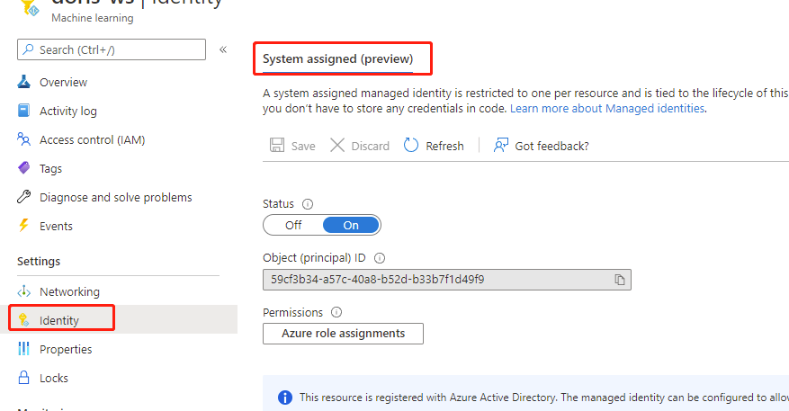
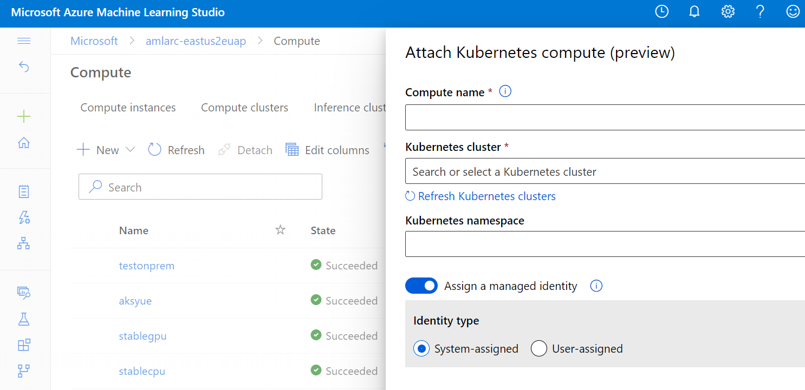

# Configure Kubernetes clusters for machine learning (preview)

Learn how to configure Azure Kubernetes Service (AKS) and Azure Arc-enabled Kubernetes clusters for training and inferencing machine learning workloads.

## What is Azure Arc-enabled machine learning?

Azure Arc enables you to run Azure services in any Kubernetes environment, whether it’s on-premises, multicloud, or at the edge.

Azure Arc-enabled machine learning lets you configure and use Azure Kubernetes Service or Azure Arc-enabled Kubernetes clusters to train, inference, and manage machine learning models in Azure Machine Learning.

## Machine Learning on Azure Kubernetes Service

To use Azure Kubernetes Service clusters for Azure Machine Learning training and inference workloads, you don't have to connect them to Azure Arc.

Before deploying the Azure Machine Learning extension on Azure Kubernetes Service clusters, you have to:

- Register the feature in your AKS cluster. For more information, see [Azure Kubernetes Service prerequisites](#aks-prerequisites).

To deploy the Azure Machine Learning extension on AKS clusters, see the [Deploy Azure Machine Learning extension](#deploy-azure-machine-learning-extension) section.

## Prerequisites

* An Azure subscription. If you don't have an Azure subscription [create a free account](https://azure.microsoft.com/free) before you begin.
* Azure Arc-enabled Kubernetes cluster. For more information, see the [Connect an existing Kubernetes cluster to Azure Arc quickstart guide](../azure-arc/kubernetes/quickstart-connect-cluster.md).

    > [!NOTE]
    > For AKS clusters, connecting them to Azure Arc is **optional**.

* Clusters running behind an outbound proxy server or firewall need additional network configurations. See [Configure inbound and outbound network traffic](how-to-access-azureml-behind-firewall.md#azure-arc-enabled-kubernetes-).
* Fulfill [Azure Arc-enabled Kubernetes cluster extensions prerequisites](../azure-arc/kubernetes/extensions.md#prerequisites).
  * Azure CLI version >= 2.24.0
  * Azure CLI k8s-extension extension version >= 1.0.0

* An Azure Machine Learning workspace. [Create a workspace](how-to-manage-workspace.md?tabs=python) before you begin if you don't have one already.
  * Azure Machine Learning Python SDK version >= 1.30
* Log into Azure using the Azure CLI

    ```azurecli
    az login
    az account set --subscription <your-subscription-id>
    ```  
### Azure Kubernetes Service (AKS) <a id="aks-prerequisites"></a>

For AKS clusters, connecting them to Azure Arc is **optional**.

However, you have to register the feature in your cluster. Use the following commands to register the feature:

```azurecli
az feature register --namespace Microsoft.ContainerService -n AKS-ExtensionManager
```
> [!NOTE]
> For more information, see [Deploy and manage cluster extensions for Azure Kubernetes Service (AKS)](../aks/cluster-extensions.md)

### Azure RedHat OpenShift Service (ARO) and OpenShift Container Platform (OCP) only

* An ARO or OCP Kubernetes cluster is up and running. For more information, see [Create ARO Kubernetes cluster](../openshift/tutorial-create-cluster.md) and [Create OCP Kubernetes cluster](https://docs.openshift.com/container-platform/4.6/installing/installing_platform_agnostic/installing-platform-agnostic.html)
* Grant privileged access to AzureML service accounts.

    Run `oc edit scc privileged` and add the following 

    * ```system:serviceaccount:azure-arc:azure-arc-kube-aad-proxy-sa```
    * ```system:serviceaccount:azureml:{EXTENSION NAME}-kube-state-metrics``` **(Note:** ```{EXTENSION NAME}``` **here must match with the extension name used in** ```az k8s-extension create --name``` **step)**
    * ```system:serviceaccount:azureml:cluster-status-reporter```
    * ```system:serviceaccount:azureml:prom-admission```
    * ```system:serviceaccount:azureml:default```
    * ```system:serviceaccount:azureml:prom-operator```
    * ```system:serviceaccount:azureml:csi-blob-node-sa```
    * ```system:serviceaccount:azureml:csi-blob-controller-sa```
    * ```system:serviceaccount:azureml:load-amlarc-selinux-policy-sa```
    * ```system:serviceaccount:azureml:azureml-fe```
    * ```system:serviceaccount:azureml:prom-prometheus```
    * ```system:serviceaccount:{KUBERNETES-COMPUTE-NAMESPACE}:default``` 
    
> [!NOTE]
> `{KUBERNETES-COMPUTE-NAMESPACE}` is the namespace of the Kubernetes compute cluster specified in compute attach, which defaults to `default`. Skip this setting if the namespace is `default`

## Deploy Azure Machine Learning extension

Azure Arc-enabled Kubernetes has a cluster extension functionality that enables you to install various agents including Azure Policy definitions, monitoring, machine learning, and many others. Azure Machine Learning requires the use of the *Microsoft.AzureML.Kubernetes* cluster extension to deploy the Azure Machine Learning agent on the Kubernetes cluster. Once the Azure Machine Learning extension is installed, you can attach the cluster to an Azure Machine Learning workspace and use it for the following scenarios:

* [Training only](#training)
* [Real-time inferencing only](#inferencing)
* [Training and inferencing](#training-inferencing)

> [!TIP]
> Train only clusters also support batch inferencing as part of Azure Machine Learning Pipelines.

Use the `k8s-extension` Azure CLI extension [`create`](/cli/azure/k8s-extension) command to deploy the Azure Machine Learning extension to your Azure Arc-enabled Kubernetes cluster.

> [!IMPORTANT]
> Set the `--cluster-type` parameter to `managedClusters` to deploy the Azure Machine Learning extension to AKS clusters.

The following configuration settings are available to be used for different Azure Machine Learning extension deployment scenarios.

You can use ```--config``` or ```--config-protected``` to specify list of key-value pairs for Azure Machine Learning deployment configurations.

> [!TIP]
> Set the `openshift` parameter to `True` to deploy the Azure Machine Learning extension to ARO and OCP Kubernetes clusters.

| Configuration Setting Key Name  | Description  | Training | Inference | Training and Inference |
   |--|--|--|--|--|
   |```enableTraining``` |```True``` or ```False```, default ```False```. **Must** be set to ```True``` for AzureML extension deployment with Machine Learning model training support.  |  **&check;**| N/A |  **&check;** |
   | ```enableInference``` |```True``` or ```False```, default ```False```.  **Must** be set to ```True``` for AzureML extension deployment with Machine Learning inference support. |N/A| **&check;** |  **&check;** |
   | ```allowInsecureConnections``` |```True``` or ```False```, default False. This **must** be set to ```True``` for AzureML extension deployment with HTTP endpoints support for inference, when ```sslCertPemFile``` and ```sslKeyPemFile``` are not provided. |N/A| Optional |  Optional |
   | ```privateEndpointNodeport``` |```True``` or ```False```, default ```False```.  **Must** be set to ```True``` for AzureML deployment with Machine Learning inference private endpoints support using serviceType nodePort. | N/A| Optional |  Optional |
   | ```privateEndpointILB``` |```True``` or ```False```, default ```False```.  **Must** be set to ```True``` for AzureML extension deployment with Machine Learning inference private endpoints support using serviceType internal load balancer | N/A| Optional |  Optional |
   |```sslSecret```| The Kubernetes secret under azureml namespace to store `cert.pem` (PEM-encoded SSL cert) and `key.pem` (PEM-encoded SSL key), required for AzureML extension deployment with HTTPS endpoint support for inference, when  ``allowInsecureConnections`` is set to ```False```. Use this config or give static cert and key file path in configuration protected settings.|N/A| Optional |  Optional |
   |```sslCname``` |A SSL CName to use if enabling SSL validation on the cluster.  |  N/A | Optional |  Optional |
   | ```inferenceLoadBalancerHA``` |```True``` or ```False```, default ```True```. By default, AzureML extension will deploy three ingress controller replicas for high availability, which requires at least three workers in a cluster. Set this config to ```False``` if you have fewer than three workers and want to deploy AzureML extension for development and testing only, in this case it will deploy one ingress controller replica only. | N/A| Optional |  Optional |
   |```openshift``` | ```True``` or ```False```, default ```False```. Set to ```True``` if you deploy AzureML extension on ARO or OCP cluster. The deployment process will automatically compile a policy package and load policy package on each node so AzureML services operation can function properly.  | Optional| Optional |  Optional |
   |```nodeSelector``` | Set the node selector so the extension components and the training/inference workloads will only be deployed to the nodes with all specified selectors. Usage: `nodeSelector.key=value`, support multiple selectors. Example: `nodeSelector.node-purpose=worker nodeSelector.node-region=eastus`| Optional| Optional |  Optional |
   |```installNvidiaDevicePlugin```  | ```True``` or ```False```, default ```True```. Nvidia Device Plugin is required for ML workloads on Nvidia GPU hardware. By default, AzureML extension deployment will install Nvidia Device Plugin regardless Kubernetes cluster has GPU hardware or not. User can specify this configuration setting to ```False``` if Nvidia Device Plugin installation is not required (either it is installed already or there is no plan to use GPU for workload). | Optional |Optional |Optional |
   |```reuseExistingPromOp```|```True``` or ```False```, default ```False```. AzureML extension needs prometheus operator to manage prometheus. Set to ```True``` to reuse existing prometheus operator. | Optional| Optional |  Optional |
   |```logAnalyticsWS```  |```True``` or ```False```, default ```False```. AzureML extension integrates with Azure LogAnalytics Workspace to provide log viewing and analysis capability through LogAnalytics Workspace. This setting must be explicitly set to ```True``` if customer wants to use this capability. LogAnalytics Workspace cost may apply.  |Optional |Optional |Optional |

   |Configuration Protected Setting Key Name  |Description  |Training |Inference |Training and Inference
   |--|--|--|--|--|
   | ```sslCertPemFile```, ```sslKeyPemFile``` |Path to SSL certificate and key file (PEM-encoded), required for AzureML extension deployment with HTTPS endpoint support for inference, when  ``allowInsecureConnections`` is set to ```False```. | N/A| Optional |  Optional |

> [!WARNING]
> If Nvidia Device Plugin, is already installed in your cluster, reinstalling them may result in an extension installation error. Set `installNvidiaDevicePlugin` to `False` to prevent deployment errors.
>
> By default, the deployed Kubernetes deployment resources are randomly deployed to **1 or more** nodes on the cluster, and daemonset resources are deployed to **all** nodes. If you want to restrict the extension deployment to specific nodes, use `nodeSelector` configuration setting.


### Deploy extension for training workloads <a id="training"></a>

Use the following Azure CLI command to deploy the Azure Machine Learning extension and enable training workloads on your Kubernetes cluster:

```azurecli
az k8s-extension create --name arcml-extension --extension-type Microsoft.AzureML.Kubernetes --config enableTraining=True --cluster-type connectedClusters --cluster-name <your-connected-cluster-name> --resource-group <resource-group> --scope cluster --auto-upgrade-minor-version False
```

### Deploy extension for real-time inferencing workloads <a id="inferencing"></a>

Depending on your network setup, Kubernetes distribution variant, and where your Kubernetes cluster is hosted (on-premises or the cloud), choose one of following options to deploy the Azure Machine Learning extension and enable inferencing workloads on your Kubernetes cluster.

#### Public endpoints support with public load balancer

* **HTTPS**

    ```azurecli
    az k8s-extension create --name arcml-extension --extension-type Microsoft.AzureML.Kubernetes --cluster-type connectedClusters --cluster-name <your-connected-cluster-name> --config enableInference=True sslCname=<cname> --config-protected sslCertPemFile=<path-to-the-SSL-cert-PEM-ile> sslKeyPemFile=<path-to-the-SSL-key-PEM-file> --resource-group <resource-group> --scope cluster --auto-upgrade-minor-version False
    ```

* **HTTP**

    > [!WARNING]
    > Public HTTP endpoints support with public load balancer is the least secure way of deploying the Azure Machine Learning extension for real-time inferencing scenarios and is therefore **NOT** recommended.

    ```azurecli
    az k8s-extension create --name arcml-extension --extension-type Microsoft.AzureML.Kubernetes --cluster-type connectedClusters --cluster-name <your-connected-cluster-name>  --configuration-settings enableInference=True allowInsecureConnections=True --resource-group <resource-group> --scope cluster --auto-upgrade-minor-version False
    ```

#### Private endpoints support with internal load balancer

* **HTTPS**

    ```azurecli
    az k8s-extension create --name amlarc-compute --extension-type Microsoft.AzureML.Kubernetes --cluster-type connectedClusters --cluster-name <your-connected-cluster-name> --config enableInference=True privateEndpointILB=True sslCname=<cname> --config-protected sslCertPemFile=<path-to-the-SSL-cert-PEM-ile> sslKeyPemFile=<path-to-the-SSL-key-PEM-file> --resource-group <resource-group> --scope cluster --auto-upgrade-minor-version False
    ```

* **HTTP**

   ```azurecli
   az k8s-extension create --name arcml-extension --extension-type Microsoft.AzureML.Kubernetes --cluster-type connectedClusters --cluster-name <your-connected-cluster-name> --config enableInference=True privateEndpointILB=True allowInsecureConnections=True --resource-group <resource-group> --scope cluster --auto-upgrade-minor-version False
   ```

#### Endpoints support with NodePort

Using a NodePort gives you the freedom to set up your own load-balancing solution, to configure environments that are not fully supported by Kubernetes, or even to expose one or more nodes' IPs directly.

When you deploy with NodePort service, the scoring url (or swagger url) will be replaced with one of Node IP (for example, ```http://<NodeIP><NodePort>/<scoring_path>```) and remain unchanged even if the Node is unavailable. But you can replace it with any other Node IP.

* **HTTPS**

    ```azurecli
    az k8s-extension create --name arcml-extension --extension-type Microsoft.AzureML.Kubernetes --cluster-type connectedClusters --cluster-name <your-connected-cluster-name> --resource-group <resource-group> --scope cluster --config enableInference=True privateEndpointNodeport=True sslCname=<cname> --config-protected sslCertPemFile=<path-to-the-SSL-cert-PEM-ile> sslKeyPemFile=<path-to-the-SSL-key-PEM-file> --auto-upgrade-minor-version False
    ```

* **HTTP**

   ```azurecli
   az k8s-extension create --name arcml-extension --extension-type Microsoft.AzureML.Kubernetes --cluster-type connectedClusters --cluster-name <your-connected-cluster-name> --config enableInference=True privateEndpointNodeport=True allowInsecureConnections=Ture --resource-group <resource-group> --scope cluster --auto-upgrade-minor-version False
   ```

### Deploy extension for training and inferencing workloads <a id="training-inferencing"></a>

Use the following Azure CLI command to deploy the Azure Machine Learning extension and enable cluster real-time inferencing, batch-inferencing, and training workloads on your Kubernetes cluster.

```azurecli
az k8s-extension create --name arcml-extension --extension-type Microsoft.AzureML.Kubernetes --cluster-type connectedClusters --cluster-name <your-connected-cluster-name> --config enableTraining=True enableInference=True sslCname=<cname> --config-protected sslCertPemFile=<path-to-the-SSL-cert-PEM-ile> sslKeyPemFile=<path-to-the-SSL-key-PEM-file>--resource-group <resource-group> --scope cluster --auto-upgrade-minor-version False
```

## Resources created during deployment

Once the Azure Machine Learning extension is deployed, the following resources are created in Azure as well as your Kubernetes cluster, depending on the workloads you run on your cluster.

   |Resource name  |Resource type |Training |Inference |Training and Inference| Description |
   |--|--|--|--|--|--|
   |Azure Service Bus|Azure resource|**&check;**|**&check;**|**&check;**|Used by gateway to sync job and cluster status to Azure Machine Learning services regularly.|
   |Azure Relay|Azure resource|**&check;**|**&check;**|**&check;**|Route traffic from Azure Machine Learning services to the Kubernetes cluster.|
   |aml-operator|Kubernetes deployment|**&check;**|N/A|**&check;**|Manage the lifecycle of training jobs.|
   |{EXTENSION-NAME}-kube-state-metrics|Kubernetes deployment|**&check;**|**&check;**|**&check;**|Export the cluster-related metrics to Prometheus.|
   |{EXTENSION-NAME}-prometheus-operator|Kubernetes deployment|**&check;**|**&check;**|**&check;**| Provide Kubernetes native deployment and management of Prometheus and related monitoring components.|
   |amlarc-identity-controller|Kubernetes deployment|N/A|**&check;**|**&check;**|Request and renew Blob/Azure Container Registry token with managed identity for infrastructure and user containers.|
   |amlarc-identity-proxy|Kubernetes deployment|N/A|**&check;**|**&check;**|Request and renew Blob/Azure Container Registry token with managed identity for infrastructure and user containers.|
   |azureml-fe|Kubernetes deployment|N/A|**&check;**|**&check;**|The front-end component that routes incoming inference requests to deployed services.|
   |inference-operator-controller-manager|Kubernetes deployment|N/A|**&check;**|**&check;**|Manage the lifecycle of inference endpoints. |
   |metrics-controller-manager|Kubernetes deployment|**&check;**|**&check;**|**&check;**|Manage the configuration for Prometheus|
   |relayserver|Kubernetes deployment|**&check;**|**&check;**|**&check;**|Pass the job spec from Azure Machine Learning services to the Kubernetes cluster.|
   |cluster-status-reporter|Kubernetes deployment|**&check;**|**&check;**|**&check;**|Gather the nodes and resource information, and upload it to Azure Machine Learning services.|
   |nfd-master|Kubernetes deployment|**&check;**|N/A|**&check;**|Node feature discovery.|
   |gateway|Kubernetes deployment|**&check;**|**&check;**|**&check;**|Send nodes and cluster resource information to Azure Machine Learning services.|
   |csi-blob-controller|Kubernetes deployment|**&check;**|N/A|**&check;**|Azure Blob Storage Container Storage Interface(CSI) driver.|
   |csi-blob-node|Kubernetes daemonset|**&check;**|N/A|**&check;**|Azure Blob Storage Container Storage Interface(CSI) driver.|
   |fluent-bit|Kubernetes daemonset|**&check;**|**&check;**|**&check;**|Gather infrastructure components' log.|
   |k8s-host-device-plugin-daemonset|Kubernetes daemonset|**&check;**|**&check;**|**&check;**|Expose fuse to pods on each node.|
   |nfd-worker|Kubernetes daemonset|**&check;**|N/A|**&check;**|Node feature discovery.|
   |prometheus-prom-prometheus|Kubernetes statefulset|**&check;**|**&check;**|**&check;**|Gather and send job metrics to Azure.|
   |frameworkcontroller|Kubernetes statefulset|**&check;**|N/A|**&check;**|Manage the lifecycle of Azure Machine Learning training pods.|
   |alertmanager|Kubernetes statefulset|**&check;**|N/A|**&check;**|Handle alerts sent by client applications such as the Prometheus server.|

> [!IMPORTANT]
> Azure Service Bus and Azure Relay resources are under the same resource group as the Arc cluster resource. These resources are used to communicate with the Kubernetes cluster and modifying them will break attached compute targets.

> [!NOTE]
> **{EXTENSION-NAME}** is the extension name specified by the ```az k8s-extension create --name``` Azure CLI command.

## Verify your AzureML extension deployment

```azurecli
az k8s-extension show --name arcml-extension --cluster-type connectedClusters --cluster-name <your-connected-cluster-name> --resource-group <resource-group>
```

In the response, look for `"extensionType": "arcml-extension"` and `"installState": "Installed"`. Note it might show `"installState": "Pending"` for the first few minutes.

When the `installState` shows **Installed**, run the following command on your machine with the kubeconfig file pointed to your cluster to check that all pods under *azureml* namespace are in *Running* state:

```bash
kubectl get pods -n azureml
```
## Update Azure Machine Learning extension

Use ```k8s-extension update``` CLI command to update the mutable properties of  Azure Machine Learning extension. For more information, see the [`k8s-extension update` CLI command documentation](/cli/azure/k8s-extension?view=azure-cli-latest#az-k8s-extension-update&preserve-view=true). 

1.	Azure Arc supports update of  ``--auto-upgrade-minor-version``, ``--version``,  ``--configuration-settings``, ``--configuration-protected-settings``.  
2.	For configurationSettings, only the settings that require update need to be provided. If the user provides all settings, they would be merged/overwritten with the provided values. 
3.	For ConfigurationProtectedSettings, ALL  settings should be provided. If some settings are omitted, those settings would be considered obsolete and deleted. 

> [!IMPORTANT]
> **Don't** update following configs if you have active training workloads or real-time inference endpoints. Otherwise, the training jobs will be impacted and endpoints unavailable.
> 
> * `enableTraining` from `True` to `False`
> * `installNvidiaDevicePlugin` from `True` to `False` when using GPU.
> * `nodeSelector`. The update operation can't remove existing nodeSelectors. It can only update existing ones or add new ones.
>
> **Don't** update following configs if you have active real-time inference endpoints, otherwise, the endpoints will be unavailable.
> * `allowInsecureConnections`
> *`privateEndpointNodeport`
> *`privateEndpointILB`
> *  To update `logAnalyticsWS` from `True` to `False`, provide all original `configurationProtectedSettings`. Otherwise, those settings are considered obsolete and deleted.

## Delete Azure Machine Learning extension

Use [`k8s-extension delete`](/cli/azure/k8s-extension?view=azure-cli-latest#az-k8s-extension-delete&preserve-view=true) CLI command to delete the Azure Machine Learning extension. 

It takes around 10 minutes to delete all components deployed to the Kubernetes cluster. Run `kubectl get pods -n azureml` to check if all components were deleted.


## Attach Arc Cluster

### Prerequisite

Azure Machine Learning workspace defaults to have a system-assigned managed identity to access Azure ML resources. It's all done if this default setting is applied. 



Otherwise, if a user-assigned managed identity is specified in Azure Machine Learning workspace creation, the following role assignments need to be granted to the identity manually before attaching the compute.

|Azure resource name  |Role to be assigned|
|--|--|
|Azure Service Bus|Azure Service Bus Data Owner|
|Azure Relay|Azure Relay Owner|
|Azure Arc-enable Kubernetes|Reader|

The Azure Service Bus and Azure Relay resource are created under the same Resource Group as the Arc cluster.

### [Studio](#tab/studio)

Attaching an Azure Arc-enabled Kubernetes cluster makes it available to your workspace for training.

1. Navigate to [Azure Machine Learning studio](https://ml.azure.com).
1. Under **Manage**, select **Compute**.
1. Select the **Attached computes** tab.
1. Select **+New > Kubernetes (preview)**

   

1. Enter a compute name and select your Azure Arc-enabled Kubernetes cluster from the dropdown.

    * **(Optional)** Enter Kubernetes namespace, which defaults to `default`. All machine learning workloads will be sent to the specified kubernetes namespace in the cluster.

    * **(Optional)** Assign system-assigned or user-assigned managed identity. Managed identities eliminate the need for developers to manage credentials. For more information, see [managed identities overview](../active-directory/managed-identities-azure-resources/overview.md) .

    

1. Select **Attach**

    In the Attached compute tab, the initial state of your cluster is *Creating*. When the cluster is successfully attached, the state changes to *Succeeded*. Otherwise, the state changes to *Failed*.

    

### [Python SDK](#tab/sdk)

You can use the Azure Machine Learning Python SDK to attach Azure Arc-enabled Kubernetes clusters as compute targets using the [`attach_configuration`](/python/api/azureml-core/azureml.core.compute.kubernetescompute.kubernetescompute?view=azure-ml-py&preserve-view=true) method.

The following Python code shows how to attach an Azure Arc-enabled Kubernetes cluster and use it as a compute target with managed identity enabled.

Managed identities eliminate the need for developers to manage credentials. For more information, see [managed identities overview](../active-directory/managed-identities-azure-resources/overview.md).

```python
from azureml.core.compute import KubernetesCompute
from azureml.core.compute import ComputeTarget
from azureml.core.workspace import Workspace
import os

ws = Workspace.from_config()

# Specify a name for your Kubernetes compute
amlarc_compute_name = "<COMPUTE_CLUSTER_NAME>"

# resource ID for the Kubernetes cluster and user-managed identity
resource_id = "/subscriptions/<sub ID>/resourceGroups/<RG>/providers/Microsoft.Kubernetes/connectedClusters/<cluster name>"

user_assigned_identity_resouce_id = ['subscriptions/<sub ID>/resourceGroups/<RG>/providers/Microsoft.ManagedIdentity/userAssignedIdentities/<identity name>']

ns = "default" 

if amlarc_compute_name in ws.compute_targets:
    amlarc_compute = ws.compute_targets[amlarc_compute_name]
    if amlarc_compute and type(amlarc_compute) is KubernetesCompute:
        print("found compute target: " + amlarc_compute_name)
else:
   print("creating new compute target...")


# assign user-assigned managed identity
amlarc_attach_configuration = KubernetesCompute.attach_configuration(resource_id = resource_id, namespace = ns,  identity_type ='UserAssigned',identity_ids = user_assigned_identity_resouce_id) 

# assign system-assigned managed identity
# amlarc_attach_configuration = KubernetesCompute.attach_configuration(resource_id = resource_id, namespace = ns,  identity_type ='SystemAssigned') 

amlarc_compute = ComputeTarget.attach(ws, amlarc_compute_name, amlarc_attach_configuration)
amlarc_compute.wait_for_completion(show_output=True)

# get detailed compute description containing managed identity principle ID, used for permission access. 
print(amlarc_compute.get_status().serialize())
```

Use the `identity_type` parameter to enable `SystemAssigned` or `UserAssigned` managed identities.

### [CLI](#tab/cli)

You can attach an AKS or Azure Arc enabled Kubernetes cluster using the Azure Machine Learning 2.0 CLI (preview).

Use the Azure Machine Learning CLI [`attach`](/cli/azure/ml/compute) command and set the `--type` argument to `Kubernetes` to attach your Kubernetes cluster using the Azure Machine Learning 2.0 CLI.

> [!NOTE]
> Compute attach support for AKS or Azure Arc enabled Kubernetes clusters requires a version of the Azure CLI `ml` extension >= 2.0.1a4. For more information, see [Install and set up the CLI (v2)](how-to-configure-cli.md).

The following commands show how to attach an Azure Arc-enabled Kubernetes cluster and use it as a compute target with managed identity enabled.

**AKS**

```azurecli
az ml compute attach --resource-group <resource-group-name> --workspace-name <workspace-name> --name amlarc-compute --resource-id "/subscriptions/<subscription-id>/resourceGroups/<resource-group-name>/providers/Microsoft.Kubernetes/managedclusters/<cluster-name>" --type Kubernetes --identity-type UserAssigned --user-assigned-identities "subscriptions/<subscription-id>/resourceGroups/<resource-group-name>/providers/Microsoft.ManagedIdentity/userAssignedIdentities/<identity-name>" --no-wait
```

**Azure Arc enabled Kubernetes**

```azurecli
az ml compute attach --resource-group <resource-group-name> --workspace-name <workspace-name> --name amlarc-compute --resource-id "/subscriptions/<subscription-id>/resourceGroups/<resource-group-name>/providers/Microsoft.Kubernetes/connectedClusters/<cluster-name>" --type kubernetes --user-assigned-identities "subscriptions/<subscription-id>/resourceGroups/<resource-group-name>/providers/Microsoft.ManagedIdentity/userAssignedIdentities/<identity-name>" --no-wait
```

Use the `identity_type` argument to enable `SystemAssigned` or `UserAssigned` managed identities.

> [!IMPORTANT]
> `--user-assigned-identities` is only required for `UserAssigned` managed identities. Although you can provide a list of comma-separated user managed identities, only the first one is used when you attach your cluster.

---

## Next steps

- [Create and select different instance types for training and inferencing workloads](how-to-kubernetes-instance-type.md)
- [Train models with CLI (v2)](how-to-train-cli.md)
- [Configure and submit training runs](how-to-set-up-training-targets.md)
- [Tune hyperparameters](how-to-tune-hyperparameters.md)
- [Train a model using Scikit-learn](how-to-train-scikit-learn.md)
- [Train a TensorFlow model](how-to-train-tensorflow.md)
- [Train a PyTorch model](how-to-train-pytorch.md)
- [Train using Azure Machine Learning pipelines](how-to-create-machine-learning-pipelines.md)
- [Train model on-premise with outbound proxy server](../azure-arc/kubernetes/quickstart-connect-cluster.md#connect-using-an-outbound-proxy-server)
