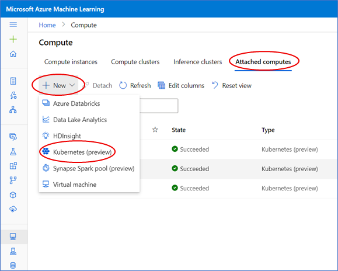
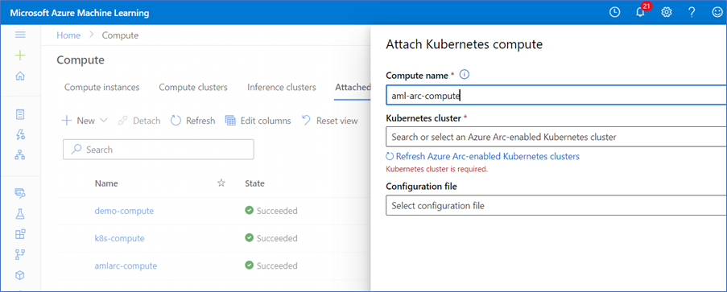
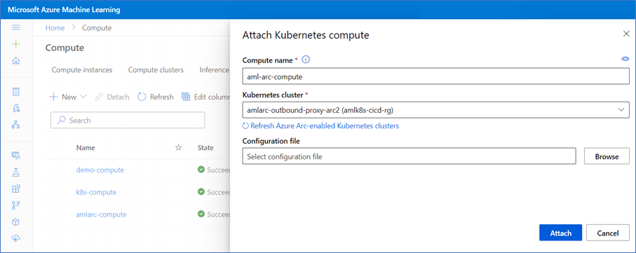

# Configure Azure Arc enabled machine learning (preview)

Learn how to configure Azure Arc enabled machine learning for training.

## What is Azure Arc enabled machine learning?

Azure Arc enables you to run Azure services in any Kubernetes environment, whether it’s on-premises, multicloud, or at the edge.

Azure Arc enabled machine learning lets you to configure and use an Azure Arc enabled Kubernetes clusters to train and manage machine learning models in Azure Machine Learning.

Azure Arc enabled machine learning supports the following training scenarios:

* Train models with 2.0 CLI
  * Distributed training
  * Hyperparameter sweeping
* Train models with Azure Machine Learning Python SDK
  * Hyperparameter tuning
* Build and use machine learning pipelines
* Train model on-premise with outbound proxy server
* Train model on-premise with NFS datastore

## Prerequisites

* An Azure subscription. If you don't have an Azure subscription [create a free account](https://azure.microsoft.com/free) before you begin.
* Azure Arc enabled Kubernetes cluster. For more information, see the [Connect an existing Kubernetes cluster to Azure Arc quickstart guide](../azure-arc/kubernetes/quickstart-connect-cluster.md).
* Fulfill [Azure Arc enabled Kubernetes cluster extensions prerequisites](../azure-arc/kubernetes/extensions.md#prerequisites).
  * Azure CLI version >= 2.24.0
  * Azure CLI k8s-extension extension version >= 0.4.3
* An Azure Machine Learning workspace. [Create a workspace](how-to-manage-workspace.md?tabs=python) before you begin if you don't have one already.
  * Azure Machine Learning Python SDK version >= 1.30

## Deploy Azure Machine Learning extension

Azure Arc enabled Kubernetes has a cluster extension functionality that enables you to install various agents including Azure policy, monitoring, machine learning, and many others. Azure Machine Learning requires the use of the *Microsoft.AzureML.Kubernetes* cluster extension to deploy the Azure Machine Learning agent on the Kubernetes cluster. Once the Azure Machine Learning extension is installed, you can attach the cluster to an Azure Machine Learning workspace and use it for training.

Use the `k8s-extension` Azure CLI extension to deploy the Azure Machine Learning extension to your Azure Arc-enabled Kubernetes cluster.

1. Login to Azure
    
    ```azurecli
    az login
    az account set --subscription <your-subscription-id>
    ```

1. Deploy Azure Machine Learning extension

    ```azurecli
    az k8s-extension create --name amlarc-compute --extension-type Microsoft.AzureML.Kubernetes --configuration-settings enableTraining=True  --cluster-type connectedClusters --cluster-name <your-connected-cluster-name> --resource-group <resource-group> --scope cluster
    ```

    >[!IMPORTANT]
    > To enabled Azure Arc-enabled cluster for training, `enableTraining` must be set to **True**. Running this command creates an Azure Service Bus and Azure Relay resource under the same resource group as the Arc cluster. These resources are used to communicate with the cluster. Modifying them will break attached clusters used as training compute targets.

    You can also configure the following settings when you deploy the Azure Machine Learning extension for model training:

    |Configuration Setting Key Name  |Description  |
    |--|--|
    | ```enableTraining``` | Default `False`. Set to `True` to create an extension instance for training machine learning models.  |
    |```logAnalyticsWS```  | Default `False`. The Azure Machine Learning extension integrates with Azure LogAnalytics Workspace. Set to `True` to provide log viewing and analysis capability through LogAnalytics Workspace. LogAnalytics Workspace cost may apply.   |
    |```installNvidiaDevicePlugin```  | Default `True`. Nvidia Device Plugin is required for training on Nvidia GPU hardware. The Azure Machine Learning extension installs the Nvidia Device Plugin by default during the Azure Machine Learning instance creation regardless of whether the Kubernetes cluster has GPU hardware or not. Set to `False` if you don't plan on using a GPU for training or Nvidia Device Plugin is already installed.  |
    |```installBlobfuseSysctl```  | Default `True` if "enableTraining=True". Blobfuse 1.3.7 is required for training. Azure Machine Learning installs Blobfuse by default when the extension instance is created. Set this configuration setting to `False` if Blobfuse 1.37 is already installed on your Kubernetes cluster.   |
    |```installBlobfuseFlexvol```  | Default `True` if "enableTraining=True". Blobfuse Flexvolume is required for  training. Azure Machine Learning installs Blobfuse Flexvolume by default to your default path. Set this configuration setting to `False` if Blobfuse Flexvolume is already installed on your Kubernetes cluster.   |
    |```volumePluginDir```  | Host path for Blobfuse Flexvolume to be installed. Applicable only if "enableTraining=True". By default, Azure Machine Learning installs Blobfuse Flexvolume under default path */etc/kubernetes/volumeplugins*. Specify a custom installation location by specifying this configuration setting.```   |

    > [!WARNING]
    > If Nvidia Device Plugin, Blobfuse, and Blobfuse Flexvolume are already installed in your cluster, reinstalling them may result in an extension installation error. Set `installNvidiaDevicePlugin`, `installBlobfuseSysctl`, and `installBlobfuseFlexvol` to `False` to prevent installation errors.

1. Verify your AzureML extension deployment

    ```azurecli
    az k8s-extension show --name amlarc-compute --cluster-type connectedClusters --cluster-name <your-connected-cluster-name> --resource-group <resource-group>
    ```

    In the response, look for `"extensionType": "amlarc-compute"` and `"installState": "Installed"`. Note it might show `"installState": "Pending"` for the first few minutes.

    When the `installState` shows **Installed**, run the following command on your machine with the kubeconfig file pointed to your cluster to check that all pods under *azureml* namespace are in *Running* state:

   ```bash
    kubectl get pods -n azureml
   ```

## Attach Arc cluster (studio)

Attaching an Azure Arc enabled Kubernetes cluster makes it available to your workspace for training.

1. Navigate to [Azure Machine Learning studio](https://ml.azure.com).
1. Under **Manage**, select **Compute**.
1. Select the **Attached computes** tab.
1. Select **+New > Kubernetes (preview)**

   

1. Enter a compute name and select your Azure Arc enabled Kubernetes cluster from the dropdown.

   

1. (Optional) For advanced scenarios, browse and upload a configuration file.

   

1. Select **Attach**

    In the Attached compute tab, the initial state of your cluster is *Creating*. When the cluster is successfully attached, the state changes to *Succeeded*. Otherwise, the state changes to *Failed*.

    

### Advanced attach scenario

Use a JSON configuration file to configure advanced compute target capabilities on Azure Arc enabled Kubernetes clusters.

The following is an example configuration file:

```json
{
   "namespace": "amlarc-testing",
   "defaultInstanceType": "gpu_instance",
   "instanceTypes": {
      "gpu_instance": {
         "nodeSelector": {
            "accelerator": "nvidia-tesla-k80"
         },
         "resources": {
            "requests": {
               "cpu": "2",
               "memory": "16Gi",
               "nvidia.com/gpu": "1"
            },
            "limits": {
               "cpu": "2",
               "memory": "16Gi",
               "nvidia.com/gpu": "1"
            }
         }
      },
      "big_cpu_sku": {
         "nodeSelector": {
            "VMSizes": "VM-64vCPU-256GB"
         },
         "resources": {
            "requests": {
               "cpu": "4",
               "memory": "16Gi",
               "nvidia.com/gpu": "0"
            },
            "limits": {
               "cpu": "4",
               "memory": "16Gi",
               "nvidia.com/gpu": "0"
            }
         }
      }
   }
}
```

The following custom compute target properties can be configured using a configuration file:

* `namespace` - Defaults to `default` namespace. This is the namespace where jobs and pods run under. Note that when setting a namespace other than the default, the namespace must already exist. Creating namespaces requires cluster administrator privileges.

* `defaultInstanceType` - The type of instance where training jobs run on by default. Required `defaultInstanceType` if `instanceTypes` property is specified. The value of `defaultInstanceType` must be one of values defined in the `instanceTypes` property.

    > [!IMPORTANT]
    > Currently, only job submissions using computer target name are supported. Therefore, the configuration will always default to defaultInstanceType.

* `instanceTypes` - List of instance types used for training jobs. Each instance type is defined by `nodeSelector` and `resources requests/limits` properties:

  * `nodeSelector` - One or more node labels used to identify nodes in a cluster. Cluster administrator privileges are needed to create labels for cluster nodes. If this property is specified, training jobs are scheduled to run on nodes with the specified node labels. You can use `nodeSelector` to target a subset of nodes for training workload placement. This can be useful in scenarios where a cluster has different SKUs, or different types of nodes such as CPU or GPU nodes. For example, you could create node labels for all GPU nodes and define an `instanceType` for the GPU node pool. Doing so targets the GPU node pool exclusively when scheduling training jobs. 

  * `resources requests/limits` - Specifies resources requests and limits a training job pod to run. Defaults to 1 CPU and 4GB of of memory.

    >[!IMPORTANT]
    > By default, a cluster resource is deployed with 1 CPU and 4 GB of memory. If a cluster is configured with lower resources, the job run will fail. To ensure successful job completion, we recommend to always specify resources requests/limits according to training job needs. The following is an example default configuration file:
    >
    > ```json
    > {
    >    "namespace": "default",
    >    "defaultInstanceType": "defaultInstanceType",
    >    "instanceTypes": {
    >       "defaultInstanceType": {
    >          "nodeSelector": null,
    >          "resources": {
    >             "requests": {
    >                "cpu": "1",
    >                "memory": "4Gi",
    >                "nvidia.com/gpu": "0"
    >             },
    >             "limits": {
    >                "cpu": "1",
    >                "memory": "4Gi",
    >                "nvidia.com/gpu": "0"
    >             }
    >          }
    >       }
    >    }
    > }
    > ```

## Attach Arc cluster (Python SDK)

The following Python code shows how to attach an Azure Arc enabled Kubernetes cluster and use it as a compute target for training:

```python
from azureml.core.compute import KubernetesCompute
from azureml.core.compute import ComputeTarget
import os

ws = Workspace.from_config()

# choose a name for your Azure Arc-enabled Kubernetes compute
amlarc_compute_name = os.environ.get("AML_COMPUTE_CLUSTER_NAME", "amlarc-compute")

# resource ID for your Azure Arc-enabled Kubernetes cluster
resource_id = "/subscriptions/123/resourceGroups/rg/providers/Microsoft.Kubernetes/connectedClusters/amlarc-cluster"

if amlarc_compute_name in ws.compute_targets:
    amlarc_compute = ws.compute_targets[amlarc_compute_name]
    if amlarc_compute and type(amlarc_compute) is KubernetesCompute:
        print("found compute target: " + amlarc_compute_name)
else:
    print("creating new compute target...")

    amlarc_attach_configuration = KubernetesCompute.attach_configuration(resource_id) 
    amlarc_compute = ComputeTarget.attach(ws, amlarc_compute_name, amlarc_attach_configuration)

 
    amlarc_compute.wait_for_completion(show_output=True)
    
     # For a more detailed view of current KubernetesCompute status, use get_status()
    print(amlarc_compute.get_status().serialize())
```

### Advanced attach scenario

The following code shows how to configure advanced compute target properties like namespace, nodeSelector, or resources requests/limits:

```python
from azureml.core.compute import KubernetesCompute
from azureml.core.compute import ComputeTarget
import os

ws = Workspace.from_config()

# choose a name for your Azure Arc-enabled Kubernetes compute
amlarc_compute_name = os.environ.get("AML_COMPUTE_CLUSTER_NAME", "amlarc-compute")

# resource ID for your Azure Arc-enabled Kubernetes cluster
resource_id = "/subscriptions/123/resourceGroups/rg/providers/Microsoft.Kubernetes/connectedClusters/amlarc-cluster"

if amlarc_compute_name in ws.compute_targets:
   amlarc_compute = ws.compute_targets[amlarc_compute_name]
   if amlarc_compute and type(amlarc_compute) is KubernetesCompute:
      print("found compute target: " + amlarc_compute_name)
else:
   print("creating new compute target...")
   ns = "amlarc-testing"
    
   instance_types = {
      "gpu_instance": {
         "nodeSelector": {
            "accelerator": "nvidia-tesla-k80"
         },
         "resources": {
            "requests": {
               "cpu": "2",
               "memory": "16Gi",
               "nvidia.com/gpu": "1"
            },
            "limits": {
               "cpu": "2",
               "memory": "16Gi",
               "nvidia.com/gpu": "1"
            }
        }
      },
      "big_cpu_sku": {
         "nodeSelector": {
            "VMSizes": "VM-64vCPU-256GB"
         }
      }
   }

   amlarc_attach_configuration = KubernetesCompute.attach_configuration(resource_id = resource_id, namespace = ns, default_instance_type="gpu_instance", instance_types = instance_types)
 
   amlarc_compute = ComputeTarget.attach(ws, amlarc_compute_name, amlarc_attach_configuration)

 
   amlarc_compute.wait_for_completion(show_output=True)
    
   # For a more detailed view of current KubernetesCompute status, use get_status()
   print(amlarc_compute.get_status().serialize())
```

## Next steps

- [Train models with 2.0 CLI](how-to-train-cli.md)
- [Configure and submit training runs](how-to-set-up-training-targets.md)
- [Tune hyperparameters](how-to-tune-hyperparameters.md)
- [Train a model using Scikit-learn](how-to-train-scikit-learn.md)
- [Train a TensorFlow model](how-to-train-tensorflow.md)
- [Train a PyTorch model](how-to-train-pytorch.md)
- [Train using Azure Machine Learning pipelines](how-to-create-machine-learning-pipelines.md)
- [Train model on-premise with outbound proxy server](../azure-arc/kubernetes/quickstart-connect-cluster.md#5-connect-using-an-outbound-proxy-server)
