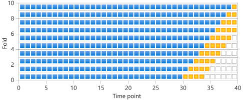
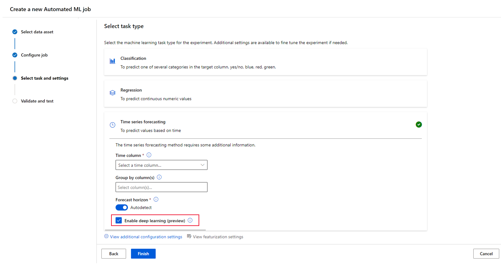
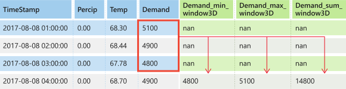

# Auto-train a time-series forecast model
[!INCLUDE [aml-applies-to-basic-enterprise-sku](../../includes/aml-applies-to-basic-enterprise-sku.md)]

In this article, you learn how to configure and train a time-series forecasting regression model using automated machine learning in the [Azure Machine Learning Python SDK](https://docs.microsoft.com/python/api/overview/azure/ml/?view=azure-ml-py). 

For a low code experience, see the [Tutorial: Forecast demand with automated machine learning](tutorial-automated-ml-forecast.md) for a time-series forecasting example using automated machine learning in the [Azure Machine Learning studio](https://ml.azure.com/).

Configuring a forecasting model is similar to setting up a standard regression model using automated machine learning, but certain configuration options and pre-processing steps exist for working with time-series data. 

For example, you can [configure](#config) how far into the future the forecast should extend (the forecast horizon), as well as lags and more. Automated ML learns a single, but often internally branched model for all items in the dataset and prediction horizons. More data is thus available to estimate model parameters and generalization to unseen series becomes possible.

The following examples show you how to:

* Prepare data for time series modeling
* Configure specific time-series parameters in an [`AutoMLConfig`](/python/api/azureml-train-automl-client/azureml.train.automl.automlconfig.automlconfig) object
* Run predictions with time-series data

> [!VIDEO https://www.microsoft.com/videoplayer/embed/RE2X1GW]

Unlike classical time series methods, in automated ML past time-series values are "pivoted" to become additional dimensions for the regressor together with other predictors. This approach incorporates multiple contextual variables and their relationship to one another during training. Since multiple factors can influence a forecast, this method aligns itself well with real world forecasting scenarios. For example, when forecasting sales, interactions of historical trends, exchange rate and price all jointly drive the sales outcome. 

Features extracted from the training data play a critical role. And, automated ML performs standard pre-processing steps and generates additional time-series features to capture seasonal effects and maximize predictive accuracy

## Time-series and deep learning models

Automated ML's deep learning allows for forecasting univariate and multivariate time series data.

Deep learning models have three intrinsic capabilities:
1. They can learn from arbitrary mappings from inputs to outputs
1. They support multiple inputs and outputs
1. They can automatically extract patterns in input data that spans over long sequences

Given larger data, deep learning models, such as Microsoft's ForecastTCN, can improve the scores of the resulting model. Learn how to [configure your experiment for deep learning](#configure-a-dnn-enable-forecasting-experiment).

Automated ML provides users with both native time-series and deep learning models as part of the recommendation system. 

Models| Description | Benefits
----|----|---
Prophet (Preview)|Prophet works best with time series that have strong seasonal effects and several seasons of historical data. To leverage this model, install it locally using `pip install fbprophet`. | Accurate & fast, robust to outliers, missing data, and dramatic changes in your time series.
Auto-ARIMA (Preview)|AutoRegressive Integrated Moving Average (ARIMA) performs best, when the data is stationary. This means that its statistical properties like the mean and variance are constant over the entire set. For example, if you flip a coin, then the probability of you getting heads is 50%, regardless if you flip today, tomorrow or next year.| Great for univariate series, since the past values are used to predict the future values.
ForecastTCN (Preview)| ForecastTCN is a neural network model designed to tackle the most demanding forecasting tasks, capturing nonlinear local and global trends in your data as well as relationships between time series.|Capable of leveraging complex trends in your data and readily scales to the largest of datasets.

## Prerequisites

* An Azure Machine Learning workspace. To create the workspace, see [Create an Azure Machine Learning workspace](how-to-manage-workspace.md).
* This article assumes basic familiarity with setting up an automated machine learning experiment. Follow the [tutorial](tutorial-auto-train-models.md) or [how-to](how-to-configure-auto-train.md) to see the basic automated machine learning experiment design patterns.

## Preparing data

The most important difference between a forecasting regression task type and regression task type within automated machine learning is including a feature in your data that represents a valid time series. A regular time series has a well-defined and consistent frequency and has a value at every sample point in a continuous time span. Consider the following snapshot of a file `sample.csv`.

    day_datetime,store,sales_quantity,week_of_year
    9/3/2018,A,2000,36
    9/3/2018,B,600,36
    9/4/2018,A,2300,36
    9/4/2018,B,550,36
    9/5/2018,A,2100,36
    9/5/2018,B,650,36
    9/6/2018,A,2400,36
    9/6/2018,B,700,36
    9/7/2018,A,2450,36
    9/7/2018,B,650,36

This data set is a simple example of daily sales data for a company that has two different stores, A and B. Additionally, there is a feature for `week_of_year` that will allow the model to detect weekly seasonality. The field `day_datetime` represents a clean time series with daily frequency, and the field `sales_quantity` is the target column for running predictions. Read the data into a Pandas dataframe, then use the `to_datetime` function to ensure the time series is a `datetime` type.

```python
import pandas as pd
data = pd.read_csv("sample.csv")
data["day_datetime"] = pd.to_datetime(data["day_datetime"])
```

In this case, the data is already sorted ascending by the time field `day_datetime`. However, when setting up an experiment, ensure the desired time column is sorted in ascending order to build a valid time series. Assume the data contains 1,000 records, and make a deterministic split in the data to create training and test data sets. Identify the label column name and set it to label. In this example, the label will be `sales_quantity`. Then separate the label field from `test_data` to form the `test_target` set.

```python
train_data = data.iloc[:950]
test_data = data.iloc[-50:]

label =  "sales_quantity"
 
test_labels = test_data.pop(label).values
```

> [!NOTE]
> When training a model for forecasting future values, ensure all the features used in
> training can be used when running predictions for your intended horizon. For example, when
> creating a demand forecast, including a feature for current stock price could massively
> increase training accuracy. However, if you intend to forecast with a long horizon, you may
> not be able to accurately predict future stock values corresponding to future time-series
> points, and model accuracy could suffer.

<a name="config"></a>

## Train and validation data
You can specify separate train and validation sets directly in the `AutoMLConfig` constructor.

### Rolling Origin Cross Validation
For time series forecasting Rolling Origin Cross Validation (ROCV) is used to split time series in a temporally consistent way. ROCV divides the series into training and validation data using an origin time point. Sliding the origin in time generates the cross-validation folds.  



This strategy will preserve the time series data integrity and eliminate the risk of data leakage. ROCV is automatically used for forecasting tasks by passing the training and validation data together and setting the number of cross validation folds using `n_cross_validations`. Learn more about how auto ML applies cross validation to [prevent over-fitting models](concept-manage-ml-pitfalls.md#prevent-over-fitting).

```python
automl_config = AutoMLConfig(task='forecasting',
                             n_cross_validations=3,
                             ...
                             **time_series_settings)
```
Learn more about the [AutoMLConfig](#configure-and-run-experiment).

## Configure and run experiment

For forecasting tasks, automated machine learning uses pre-processing and estimation steps that are specific to time-series data. The following pre-processing steps will be executed:

* Detect time-series sample frequency (for example, hourly, daily, weekly) and create new records for absent time points to make the series continuous.
* Impute missing values in the target (via forward-fill) and feature columns (using median column values)
* Create grain-based features to enable fixed effects across different series
* Create time-based features to assist in learning seasonal patterns
* Encode categorical variables to numeric quantities

The [`AutoMLConfig`](https://docs.microsoft.com/python/api/azureml-train-automl-client/azureml.train.automl.automlconfig.automlconfig?view=azure-ml-py) object defines the settings and data necessary for an automated machine learning task. Similar to a regression problem, you define standard training parameters like task type, number of iterations, training data, and number of cross-validations. For forecasting tasks, there are additional parameters that must be set that affect the experiment. The following table explains each parameter and its usage.

| Parameter&nbsp;name | Description | Required |
|-------|-------|-------|
|`time_column_name`|Used to specify the datetime column in the input data used for building the time series and inferring its frequency.|✓|
|`grain_column_names`|Name(s) defining individual series groups in the input data. If grain is not defined, the data set is assumed to be one time-series.||
|`max_horizon`|Defines the maximum desired forecast horizon in units of time-series frequency. Units are based on the time interval of your training data, for example, monthly, weekly that the forecaster should predict out.|✓|
|`target_lags`|Number of rows to lag the target values based on the frequency of the data. The lag is represented as a list or single integer. Lag should be used when the relationship between the independent variables and dependent variable doesn't match up or correlate by default. For example, when trying to forecast demand for a product, the demand in any month may depend on the price of specific commodities 3 months prior. In this example, you may want to lag the target (demand) negatively by 3 months so that the model is training on the correct relationship.||
|`target_rolling_window_size`|*n* historical periods to use to generate forecasted values, <= training set size. If omitted, *n* is the full training set size. Specify this parameter when you only want to consider a certain amount of history when training the model.||
|`enable_dnn`|Enable Forecasting DNNs.||

See the [reference documentation](/python/api/azureml-train-automl-client/azureml.train.automl.automlconfig.automlconfig) for more information.

Create the time-series settings as a dictionary object. Set the `time_column_name` to the `day_datetime` field in the data set. Define the `grain_column_names` parameter to ensure that **two separate time-series groups** are created for the data; one for store A and B. Lastly, set the `max_horizon` to 50 in order to predict for the entire test set. Set a forecast window to 10 periods with `target_rolling_window_size`, and specify a single lag on the target values for two periods ahead with the `target_lags` parameter. It is recommended to set `max_horizon`, `target_rolling_window_size` and `target_lags` to "auto" which will automatically detect these values for you. In the example below, "auto" settings have been used for these parameters. 

```python
time_series_settings = {
    "time_column_name": "day_datetime",
    "grain_column_names": ["store"],
    "max_horizon": "auto",
    "target_lags": "auto",
    "target_rolling_window_size": "auto",
    "preprocess": True,
}
```

> [!NOTE]
> Automated machine learning pre-processing steps (feature normalization, handling missing data,
> converting text to numeric, etc.) become part of the underlying model. When using the model for
> predictions, the same pre-processing steps applied during training are applied to
> your input data automatically.

By defining the `grain_column_names` in the code snippet above, AutoML will create two separate time-series groups, also known as multiple time-series. If no grain is defined, AutoML will assume that the dataset is a single time-series. To learn more about single time-series, see the [energy_demand_notebook](https://github.com/Azure/MachineLearningNotebooks/tree/master/how-to-use-azureml/automated-machine-learning/forecasting-energy-demand).

Now create a standard `AutoMLConfig` object, specifying the `forecasting` task type, and submit the experiment. After the model finishes, retrieve the best run iteration.

```python
from azureml.core.workspace import Workspace
from azureml.core.experiment import Experiment
from azureml.train.automl import AutoMLConfig
import logging

automl_config = AutoMLConfig(task='forecasting',
                             primary_metric='normalized_root_mean_squared_error',
                             experiment_timeout_minutes=15,
                             enable_early_stopping=True,
                             training_data=train_data,
                             label_column_name=label,
                             n_cross_validations=5,
                             enable_ensembling=False,
                             verbosity=logging.INFO,
                             **time_series_settings)

ws = Workspace.from_config()
experiment = Experiment(ws, "forecasting_example")
local_run = experiment.submit(automl_config, show_output=True)
best_run, fitted_model = local_run.get_output()
```

See the [forecasting sample notebooks](https://github.com/Azure/MachineLearningNotebooks/tree/master/how-to-use-azureml/automated-machine-learning) for detailed code examples of advanced forecasting configuration including:

* [holiday detection and featurization](https://github.com/Azure/MachineLearningNotebooks/blob/master/how-to-use-azureml/automated-machine-learning/forecasting-bike-share/auto-ml-forecasting-bike-share.ipynb)
* [rolling-origin cross validation](https://github.com/Azure/MachineLearningNotebooks/blob/master/how-to-use-azureml/automated-machine-learning/forecasting-energy-demand/auto-ml-forecasting-energy-demand.ipynb)
* [configurable lags](https://github.com/Azure/MachineLearningNotebooks/blob/master/how-to-use-azureml/automated-machine-learning/forecasting-bike-share/auto-ml-forecasting-bike-share.ipynb)
* [rolling window aggregate features](https://github.com/Azure/MachineLearningNotebooks/blob/master/how-to-use-azureml/automated-machine-learning/forecasting-energy-demand/auto-ml-forecasting-energy-demand.ipynb)
* [DNN](https://github.com/Azure/MachineLearningNotebooks/blob/master/how-to-use-azureml/automated-machine-learning/forecasting-beer-remote/auto-ml-forecasting-beer-remote.ipynb)

### Configure a DNN enable Forecasting experiment

> [!NOTE]
> DNN support for forecasting in Automated Machine Learning is in Preview and not supported for local runs.

In order to leverage DNNs for forecasting, you will need to set the `enable_dnn` parameter in the AutoMLConfig to true. 

```python
automl_config = AutoMLConfig(task='forecasting',
                             enable_dnn=True,
                             ...
                             **time_series_settings)
```
Learn more about [the AutoMLConfig](#configure-and-run-experiment).

Alternatively, you can select the `Enable deep learning` option in the studio.


We recommend using an AML Compute cluster with GPU SKUs and at least two nodes as the compute target. To allow sufficient time for the DNN training to complete, we recommend setting the experiment timeout to a minimum of a couple of hours.
For more information on AML compute and VM sizes that include GPU's, see the [AML Compute documentation](how-to-set-up-training-targets.md#amlcompute) and [GPU optimized virtual machine sizes documentation](https://docs.microsoft.com/azure/virtual-machines/linux/sizes-gpu).

View the [Beverage Production Forecasting notebook](https://github.com/Azure/MachineLearningNotebooks/blob/master/how-to-use-azureml/automated-machine-learning/forecasting-beer-remote/auto-ml-forecasting-beer-remote.ipynb) for a detailed code example leveraging DNNs.

### Target Rolling Window Aggregation
Often the best information a forecaster can have is the recent value of the target. Creating cumulative statistics of the target may increase the accuracy of your predictions. Target rolling window aggregations allows you to add a rolling aggregation of data values as features. To enable target rolling windows set the `target_rolling_window_size` to your desired integer window size. 

An example of this can be seen when predicting energy demand. You might add a rolling window feature of three days to account for thermal changes of heated spaces. In the example below, we've created this window of size three by setting `target_rolling_window_size=3` in the `AutoMLConfig` constructor. The table shows feature engineering that occurs when window aggregation is applied. Columns for minimum, maximum, and sum are generated on a sliding window of three based on the defined settings. Each row has a new calculated feature, in the case of the time-stamp for September 8, 2017 4:00am the maximum, minimum, and sum values are calculated using the demand values for September 8, 2017 1:00AM - 3:00AM. This window of three shifts along to populate data for the remaining rows.



Generating and using these additional features as extra contextual data helps with the accuracy of the train model.

View a Python code example leveraging the [target rolling window aggregate feature](https://github.com/Azure/MachineLearningNotebooks/blob/master/how-to-use-azureml/automated-machine-learning/forecasting-energy-demand/auto-ml-forecasting-energy-demand.ipynb).

### View feature engineering summary

For time-series task types in automated machine learning, you can view details from the feature engineering process. The following code shows each raw feature along with the following attributes:

* Raw feature name
* Number of engineered features formed out of this raw feature
* Type detected
* Whether feature was dropped
* List of feature transformations for the raw feature

```python
fitted_model.named_steps['timeseriestransformer'].get_featurization_summary()
```

## Forecasting with best model

Use the best model iteration to forecast values for the test data set.

The `forecast()` function should be used instead of `predict()`, this will allow specifications of when predictions should start. In the following example, you first replace all values in `y_pred` with `NaN`. The forecast origin will be at the end of training data in this case, as it would normally be when using `predict()`. However, if you replaced only the second half of `y_pred` with `NaN`, the function would leave the numerical values in the first half unmodified, but forecast the `NaN` values in the second half. The function returns both the forecasted values and the aligned features.

You can also use the `forecast_destination` parameter in the `forecast()` function to forecast values up until a specified date.

```python
label_query = test_labels.copy().astype(np.float)
label_query.fill(np.nan)
label_fcst, data_trans = fitted_pipeline.forecast(
    test_data, label_query, forecast_destination=pd.Timestamp(2019, 1, 8))
```

Calculate RMSE (root mean squared error) between the `actual_labels` actual values, and the forecasted values in `predict_labels`.

```python
from sklearn.metrics import mean_squared_error
from math import sqrt

rmse = sqrt(mean_squared_error(actual_labels, predict_labels))
rmse
```

Now that the overall model accuracy has been determined, the most realistic next step is to use the model to forecast unknown future values. Supply a data set in the same format as the test set `test_data` but with future datetimes, and the resulting prediction set is the forecasted values for each time-series step. Assume the last time-series records in the data set were for 12/31/2018. To forecast demand for the next day (or as many periods as you need to forecast, <= `max_horizon`), create a single time series record for each store for 01/01/2019.

    day_datetime,store,week_of_year
    01/01/2019,A,1
    01/01/2019,A,1

Repeat the necessary steps to load this future data to a dataframe and then run `best_run.predict(test_data)` to predict future values.

> [!NOTE]
> Values cannot be predicted for number of periods greater than the `max_horizon`. The model must be re-trained with a larger horizon to predict future values beyond
> the current horizon.

## Next steps

* Follow the [tutorial](tutorial-auto-train-models.md) to learn how to create experiments with automated machine learning.
* View the [Azure Machine Learning SDK for Python](https://docs.microsoft.com/python/api/overview/azure/ml/intro?view=azure-ml-py) reference documentation.
