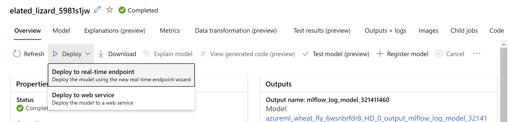
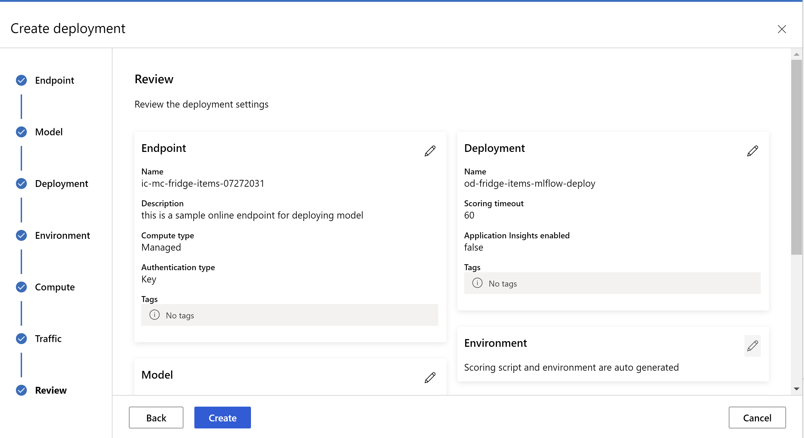
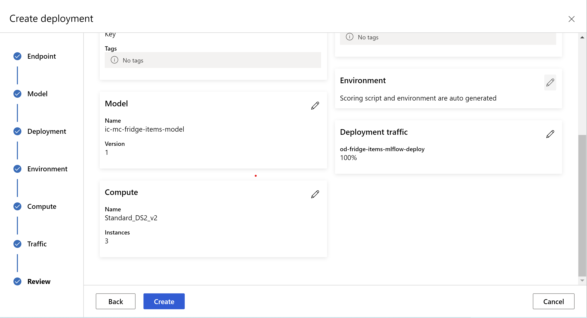
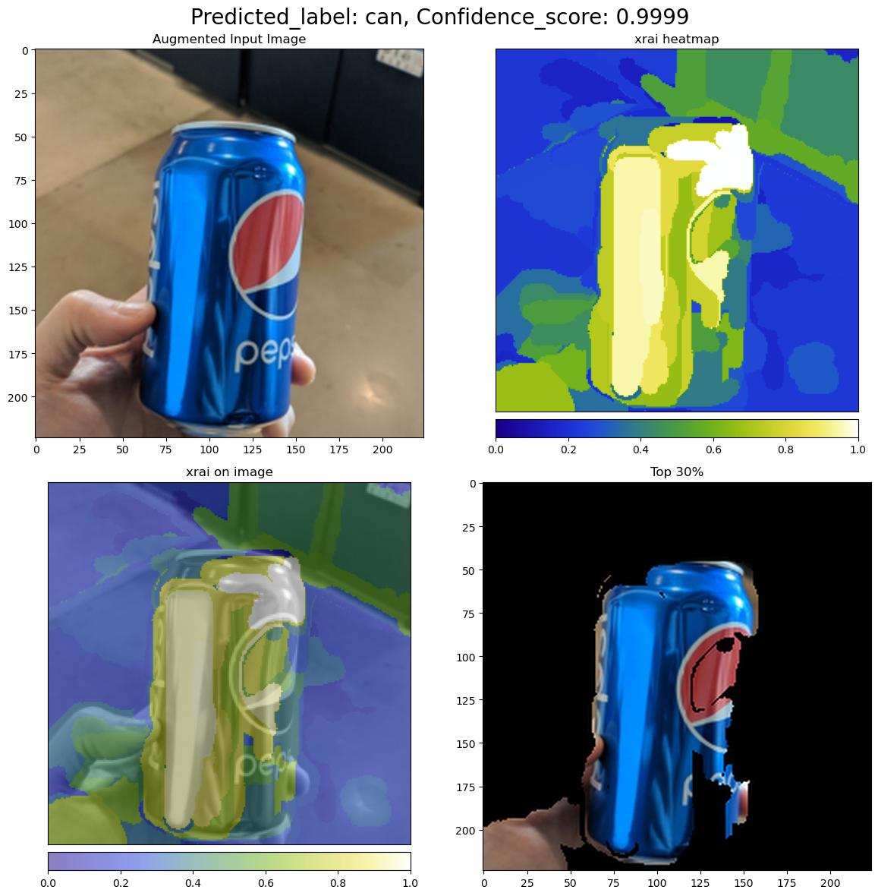

# Set up AutoML to train computer vision models

[!INCLUDE [dev v2](../../includes/machine-learning-dev-v2.md)]
> [!div class="op_single_selector" title1="Select the version of Azure Machine Learning you are using:"]
> * [v1](v1/how-to-auto-train-image-models-v1.md)
> * [v2 (current version)](how-to-auto-train-image-models.md)


In this article, you learn how to train computer vision models on image data with automated ML with the Azure Machine Learning CLI extension v2 or the Azure Machine Learning Python SDK v2.

Automated ML supports model training for computer vision tasks like image classification, object detection, and instance segmentation. Authoring AutoML models for computer vision tasks is currently supported via the Azure Machine Learning Python SDK. The resulting experimentation trials, models, and outputs are accessible from the Azure Machine Learning studio UI. [Learn more about automated ml for computer vision tasks on image data](concept-automated-ml.md).

## Prerequisites

# [Azure CLI](#tab/cli)
 [!INCLUDE [cli v2](../../includes/machine-learning-cli-v2.md)]


* An Azure Machine Learning workspace. To create the workspace, see [Create workspace resources](quickstart-create-resources.md).
* Install and [set up CLI (v2)](how-to-configure-cli.md#prerequisites) and make sure you install the `ml` extension.

# [Python SDK](#tab/python)

 [!INCLUDE [sdk v2](../../includes/machine-learning-sdk-v2.md)]

* An Azure Machine Learning workspace. To create the workspace, see [Create workspace resources](quickstart-create-resources.md).

* The Azure Machine Learning Python SDK v2 installed.

    To install the SDK you can either,  
    * Create a compute instance, which automatically installs the SDK and is pre-configured for ML workflows. For more information, see [Create and manage an Azure Machine Learning compute instance](how-to-create-manage-compute-instance.md).

    * Use the following commands to install Azure Machine Learning Python SDK v2:
       * Uninstall previous preview version:
       ```python
       pip uninstall azure-ai-ml
       ```
       * Install the Azure Machine Learning Python SDK v2:
       ```python
       pip install azure-ai-ml azure-identity
       ```
   
---

## Select your task type

Automated ML for images supports the following task types:

Task type | AutoML Job syntax
---|---
 image classification | CLI v2: `image_classification` <br> SDK v2: `image_classification()`
image classification multi-label | CLI v2: `image_classification_multilabel` <br> SDK v2: `image_classification_multilabel()`
image object detection | CLI v2: `image_object_detection` <br> SDK v2: `image_object_detection()`
image instance segmentation| CLI v2: `image_instance_segmentation` <br> SDK v2: `image_instance_segmentation()`

# [Azure CLI](#tab/cli)

[!INCLUDE [cli v2](../../includes/machine-learning-cli-v2.md)]

This task type is a required parameter and can be set using the `task` key.

For example:

```yaml
task: image_object_detection
```

# [Python SDK](#tab/python)

 [!INCLUDE [sdk v2](../../includes/machine-learning-sdk-v2.md)]


Based on the task type, you can create AutoML image jobs using task specific `automl` functions.

For example:

```python
from azure.ai.ml import automl
image_object_detection_job = automl.image_object_detection()
```
---

## Training and validation data

In order to generate computer vision models, you need to bring labeled image data as input for model training in the form of an `MLTable`. You can create an `MLTable` from training data in JSONL format.

If your training data is in a different format (like, pascal VOC or COCO), you can apply the helper scripts included with the sample notebooks to convert the data to JSONL. Learn more about how to [prepare data for computer vision tasks with automated ML](how-to-prepare-datasets-for-automl-images.md). 

> [!Note]
> The training data needs to have at least 10 images in order to be able to submit an AutoML job. 

> [!Warning]
> Creation of `MLTable` from data in JSONL format is supported using the SDK and CLI only, for this capability. Creating the `MLTable` via UI is not supported at this time. 


### JSONL schema samples

The structure of the TabularDataset depends upon the task at hand. For computer vision task types, it consists of the following fields:

Field| Description
---|---
`image_url`| Contains filepath as a StreamInfo object
`image_details`|Image metadata information consists of height, width, and format. This field is optional and hence may or may not exist.
`label`| A json representation of the image label, based on the task type.

The following is a sample JSONL file for image classification:

```json
{
      "image_url": "azureml://subscriptions/<my-subscription-id>/resourcegroups/<my-resource-group>/workspaces/<my-workspace>/datastores/<my-datastore>/paths/image_data/Image_01.png",
      "image_details":
      {
          "format": "png",
          "width": "2230px",
          "height": "4356px"
      },
      "label": "cat"
  }
  {
      "image_url": "azureml://subscriptions/<my-subscription-id>/resourcegroups/<my-resource-group>/workspaces/<my-workspace>/datastores/<my-datastore>/paths/image_data/Image_02.jpeg",
      "image_details":
      {
          "format": "jpeg",
          "width": "3456px",
          "height": "3467px"
      },
      "label": "dog"
  }
  ```

  The following code is a sample JSONL file for object detection:

  ```json
  {
      "image_url": "azureml://subscriptions/<my-subscription-id>/resourcegroups/<my-resource-group>/workspaces/<my-workspace>/datastores/<my-datastore>/paths/image_data/Image_01.png",
      "image_details":
      {
          "format": "png",
          "width": "2230px",
          "height": "4356px"
      },
      "label":
      {
          "label": "cat",
          "topX": "1",
          "topY": "0",
          "bottomX": "0",
          "bottomY": "1",
          "isCrowd": "true",
      }
  }
  {
      "image_url": "azureml://subscriptions/<my-subscription-id>/resourcegroups/<my-resource-group>/workspaces/<my-workspace>/datastores/<my-datastore>/paths/image_data/Image_02.png",
      "image_details":
      {
          "format": "jpeg",
          "width": "1230px",
          "height": "2356px"
      },
      "label":
      {
          "label": "dog",
          "topX": "0",
          "topY": "1",
          "bottomX": "0",
          "bottomY": "1",
          "isCrowd": "false",
      }
  }
  ```


### Consume data

Once your data is in JSONL format, you can create training and validation `MLTable` as shown below.

```yaml
paths:
  - file: ./train_annotations.jsonl
transformations:
  - read_json_lines:
        encoding: utf8
        invalid_lines: error
        include_path_column: false
  - convert_column_types:
      - columns: image_url
        column_type: stream_info
```

Automated ML doesn't impose any constraints on training or validation data size for computer vision tasks. Maximum dataset size is only limited by the storage layer behind the dataset (i.e. blob store). There's no minimum number of images or labels. However, we recommend starting with a minimum of 10-15 samples per label to ensure the output model is sufficiently trained. The higher the total number of labels/classes, the more samples you need per label.

# [Azure CLI](#tab/cli)

[!INCLUDE [cli v2](../../includes/machine-learning-cli-v2.md)]

Training data is a required parameter and is passed in using the `training_data` key. You can optionally specify another MLtable as a validation data with the `validation_data` key. If no validation data is specified, 20% of your training data will be used for validation by default, unless you pass `validation_data_size` argument with a different value.

Target column name is a required parameter and used as target for supervised ML task. It's passed in using the `target_column_name` key. For example,

```yaml
target_column_name: label
training_data:
  path: data/training-mltable-folder
  type: mltable
validation_data:
  path: data/validation-mltable-folder
  type: mltable
```

# [Python SDK](#tab/python)

 [!INCLUDE [sdk v2](../../includes/machine-learning-sdk-v2.md)]

You can create data inputs from training and validation MLTable from your local directory or cloud storage with the following code:

[!Notebook-python[] (~/azureml-examples-main/sdk/python/jobs/automl-standalone-jobs/automl-image-object-detection-task-fridge-items/automl-image-object-detection-task-fridge-items.ipynb?name=data-load)]

Training data is a required parameter and is passed in using the `training_data` parameter of the task specific `automl` type function. You can optionally specify another MLTable as a validation data with the `validation_data` parameter. If no validation data is specified, 20% of your training data will be used for validation by default, unless you pass `validation_data_size` argument with a different value.

Target column name is a required parameter and used as target for supervised ML task. It's passed in using the `target_column_name` parameter of the task specific `automl` function. For example,

```python
from azure.ai.ml import automl
image_object_detection_job = automl.image_object_detection(
    training_data=my_training_data_input,
    validation_data=my_validation_data_input,
    target_column_name="label"
)
```
---

## Compute to run experiment

Provide a [compute target](concept-azure-machine-learning-architecture.md#compute-targets) for automated ML to conduct model training. Automated ML models for computer vision tasks require GPU SKUs and support NC and ND families. We recommend the NCsv3-series (with v100 GPUs) for faster training. A compute target with a multi-GPU VM SKU leverages multiple GPUs to also speed up training. Additionally, when you set up a compute target with multiple nodes you can conduct faster model training through parallelism when tuning hyperparameters for your model.

> [!NOTE]
> If you are using a [compute instance](concept-compute-instance.md) as your compute target, please make sure that multiple AutoML jobs are not run at the same time. Also, please make sure that `max_concurrent_trials` is set to 1 in your [job limits](#job-limits).

The compute target is passed in using the `compute` parameter. For example:

# [Azure CLI](#tab/cli)

[!INCLUDE [cli v2](../../includes/machine-learning-cli-v2.md)]

```yaml
compute: azureml:gpu-cluster
```

# [Python SDK](#tab/python)

 [!INCLUDE [sdk v2](../../includes/machine-learning-sdk-v2.md)]

```python
from azure.ai.ml import automl

compute_name = "gpu-cluster"
image_object_detection_job = automl.image_object_detection(
    compute=compute_name,
)
```
---

## Configure experiments

For computer vision tasks, you can launch either [individual trials](#individual-trials), [manual sweeps](#manually-sweeping-model-hyperparameters) or [automatic sweeps](#automatically-sweeping-model-hyperparameters-automode). We recommend starting with an automatic sweep to get a first baseline model. Then, you can try out individual trials with certain models and hyperparameter configurations. Finally, with manual sweeps you can explore multiple hyperparameter values near the more promising models and hyperparameter configurations. This three step workflow (automatic sweep, individual trials, manual sweeps) avoids searching the entirety of the hyperparameter space, which grows exponentially in the number of hyperparameters.

Automatic sweeps can yield competitive results for many datasets. Additionally, they do not require advanced knowledge of model architectures, they take into account hyperparameter correlations and they work seamlessly across different hardware setups. All these reasons make them a strong option for the early stage of your experimentation process.

### Primary metric

An AutoML training job uses a primary metric for model optimization and hyperparameter tuning. The primary metric depends on the task type as shown below; other primary metric values are currently not supported. 

* [Accuracy](https://scikit-learn.org/stable/modules/generated/sklearn.metrics.accuracy_score.html) for image classification
* [Intersection over union](https://scikit-learn.org/stable/modules/generated/sklearn.metrics.jaccard_score.html) for image classification multilabel
* [Mean average precision](how-to-understand-automated-ml.md#object-detection-and-instance-segmentation-metrics) for image object detection
* [Mean average precision](how-to-understand-automated-ml.md#object-detection-and-instance-segmentation-metrics) for image instance segmentation
    
### Job limits

You can control the resources spent on your AutoML Image training job by specifying the `timeout_minutes`, `max_trials` and the `max_concurrent_trials` for the job in limit settings as described in the below example.

Parameter | Detail
-----|----
`max_trials` |  Parameter for maximum number of trials to sweep. Must be an integer between 1 and 1000. When exploring just the default hyperparameters for a given model architecture, set this parameter to 1. The default value is 1.
`max_concurrent_trials`| Maximum number of trials that can run concurrently. If specified, must be an integer between 1 and 100.  The default value is 1. <br><br> **NOTE:** <li> The number of concurrent trials is gated on the resources available in the specified compute target. Ensure that the compute target has the available resources for the desired concurrency.  <li> `max_concurrent_trials` is capped at `max_trials` internally. For example, if user sets `max_concurrent_trials=4`, `max_trials=2`, values would be internally updated as `max_concurrent_trials=2`, `max_trials=2`.
`timeout_minutes`| The amount of time in minutes before the experiment terminates. If none specified, default experiment timeout_minutes is seven days (maximum 60 days)

# [Azure CLI](#tab/cli)

[!INCLUDE [cli v2](../../includes/machine-learning-cli-v2.md)]

```yaml
limits:
  timeout_minutes: 60
  max_trials: 10
  max_concurrent_trials: 2
```

# [Python SDK](#tab/python)

 [!INCLUDE [sdk v2](../../includes/machine-learning-sdk-v2.md)]

[!Notebook-python[] (~/azureml-examples-main/sdk/python/jobs/automl-standalone-jobs/automl-image-object-detection-task-fridge-items/automl-image-object-detection-task-fridge-items.ipynb?name=limit-settings)]

---

### Automatically sweeping model hyperparameters (AutoMode)

> [!IMPORTANT]
> This feature is currently in public preview. This preview version is provided without a service-level agreement. Certain features might not be supported or might have constrained capabilities. For more information, see [Supplemental Terms of Use for Microsoft Azure Previews](https://azure.microsoft.com/support/legal/preview-supplemental-terms/).

It is generally hard to predict the best model architecture and hyperparameters for a dataset. Also, in some cases the human time allocated to tuning hyperparameters may be limited. For computer vision tasks, you can specify a number of trials and the system will automatically determine the region of the hyperparameter space to sweep. You do not have to define a hyperparameter search space, a sampling method or an early termination policy.

#### Triggering AutoMode

You can run automatic sweeps by setting `max_trials` to a value greater than 1 in `limits` and by not specifying the search space, sampling method and termination policy. We call this functionality AutoMode; please see an example below.

# [Azure CLI](#tab/cli)

[!INCLUDE [cli v2](../../includes/machine-learning-cli-v2.md)]

```yaml
limits:
  max_trials: 10
  max_concurrent_trials: 2
```

# [Python SDK](#tab/python)

 [!INCLUDE [sdk v2](../../includes/machine-learning-sdk-v2.md)]

```python
image_object_detection_job.set_limits(max_trials=10, max_concurrent_trials=2)
```
---

A number of trials between 10 and 20 will likely work well on many datasets. The [time budget](#job-limits) for the AutoML job can still be set, but we recommend doing this only if each trial may take a long time.

> [!Warning]
> Launching automatic sweeps via the UI is not supported at this time.


### Individual trials

In individual trials, you directly control the model architecture and hyperparameters. The model architecture is passed via the `model_name` parameter.

#### Supported model architectures

The following table summarizes the supported models for each computer vision task.

Task |  model architectures | String literal syntax<br> ***`default_model`\**** denoted with \*
---|----------|----------
Image classification<br> (multi-class and multi-label)| **MobileNet**: Light-weighted models for mobile applications <br> **ResNet**: Residual networks<br> **ResNeSt**: Split attention networks<br> **SE-ResNeXt50**: Squeeze-and-Excitation networks<br> **ViT**: Vision transformer networks| `mobilenetv2`   <br>`resnet18` <br>`resnet34` <br> `resnet50`  <br> `resnet101` <br> `resnet152`    <br> `resnest50` <br> `resnest101`  <br> `seresnext`  <br> `vits16r224` (small) <br> ***`vitb16r224`\**** (base) <br>`vitl16r224` (large)|
Object detection | **YOLOv5**: One stage object detection model   <br>  **Faster RCNN ResNet FPN**: Two stage object detection models  <br> **RetinaNet ResNet FPN**: address class imbalance with Focal Loss <br> <br>*Note: Refer to [`model_size` hyperparameter](reference-automl-images-hyperparameters.md#model-specific-hyperparameters) for YOLOv5 model sizes.*| ***`yolov5`\**** <br> `fasterrcnn_resnet18_fpn` <br> `fasterrcnn_resnet34_fpn` <br> `fasterrcnn_resnet50_fpn` <br> `fasterrcnn_resnet101_fpn` <br> `fasterrcnn_resnet152_fpn` <br> `retinanet_resnet50_fpn` 
Instance segmentation | **MaskRCNN ResNet FPN**| `maskrcnn_resnet18_fpn` <br> `maskrcnn_resnet34_fpn` <br> ***`maskrcnn_resnet50_fpn`\****  <br> `maskrcnn_resnet101_fpn` <br> `maskrcnn_resnet152_fpn`


In addition to controlling the model architecture, you can also tune hyperparameters used for model training. While many of the hyperparameters exposed are model-agnostic, there are instances where hyperparameters are task-specific or model-specific. [Learn more about the available hyperparameters for these instances](reference-automl-images-hyperparameters.md). 

# [Azure CLI](#tab/cli)

[!INCLUDE [cli v2](../../includes/machine-learning-cli-v2.md)]

If you wish to use the default hyperparameter values for a given architecture (say yolov5), you can specify it using the model_name key in the training_parameters section. For example,

```yaml
training_parameters:
    model_name: yolov5
```
# [Python SDK](#tab/python)

 [!INCLUDE [sdk v2](../../includes/machine-learning-sdk-v2.md)]

If you wish to use the default hyperparameter values for a given architecture (say yolov5), you can specify it using the model_name parameter in the set_training_parameters method of the task specific `automl` job. For example,

```python
image_object_detection_job.set_training_parameters(model_name="yolov5")
```
---

### Manually sweeping model hyperparameters

When training computer vision models, model performance depends heavily on the hyperparameter values selected. Often, you might want to tune the hyperparameters to get optimal performance. For computer vision tasks, you can sweep hyperparameters to find the optimal settings for your model. This feature applies the hyperparameter tuning capabilities in Azure Machine Learning. [Learn how to tune hyperparameters](how-to-tune-hyperparameters.md).

# [Azure CLI](#tab/cli)

[!INCLUDE [cli v2](../../includes/machine-learning-cli-v2.md)]

```yaml
search_space:
  - model_name:
      type: choice
      values: [yolov5]
    learning_rate:
      type: uniform
      min_value: 0.0001
      max_value: 0.01
    model_size:
      type: choice
      values: [small, medium]

  - model_name:
      type: choice
      values: [fasterrcnn_resnet50_fpn]
    learning_rate:
      type: uniform
      min_value: 0.0001
      max_value: 0.001
    optimizer:
      type: choice
      values: [sgd, adam, adamw]
    min_size:
      type: choice
      values: [600, 800]
```

# [Python SDK](#tab/python)

 [!INCLUDE [sdk v2](../../includes/machine-learning-sdk-v2.md)]

[!Notebook-python[] (~/azureml-examples-main/sdk/python/jobs/automl-standalone-jobs/automl-image-object-detection-task-fridge-items/automl-image-object-detection-task-fridge-items.ipynb?name=search-space-settings)]

---

#### Define the parameter search space

You can define the model architectures and hyperparameters to sweep in the parameter space. You can either specify a single model architecture or multiple ones. 

* See [Individual trials](#individual-trials) for the list of supported model architectures for each task type. 
* See [Hyperparameters for computer vision tasks](reference-automl-images-hyperparameters.md)  hyperparameters for each computer vision task type. 
* See [details on supported distributions for discrete and continuous hyperparameters](how-to-tune-hyperparameters.md#define-the-search-space).

#### Sampling methods for the sweep

When sweeping hyperparameters, you need to specify the sampling method to use for sweeping over the defined parameter space. Currently, the following sampling methods are supported with the `sampling_algorithm` parameter:

| Sampling type | AutoML Job syntax |
|-------|---------|
|[Random Sampling](how-to-tune-hyperparameters.md#random-sampling)| `random` |
|[Grid Sampling](how-to-tune-hyperparameters.md#grid-sampling)| `grid` |
|[Bayesian Sampling](how-to-tune-hyperparameters.md#bayesian-sampling)| `bayesian` |
    
> [!NOTE]
> Currently only random and grid sampling support conditional hyperparameter spaces.

#### Early termination policies

You can automatically end poorly performing trials with an early termination policy. Early termination improves computational efficiency, saving compute resources that would have been otherwise spent on less promising trials. Automated ML for images supports the following early termination policies using the `early_termination` parameter. If no termination policy is specified, all trials are run to completion.


| Early termination policy | AutoML Job syntax |
|-------|---------|
|[Bandit policy](how-to-tune-hyperparameters.md#bandit-policy)| CLI v2: `bandit` <br> SDK v2: `BanditPolicy()` |
|[Median stopping policy](how-to-tune-hyperparameters.md#median-stopping-policy)| CLI v2: `median_stopping` <br> SDK v2: `MedianStoppingPolicy()` |
|[Truncation selection policy](how-to-tune-hyperparameters.md#truncation-selection-policy)| CLI v2: `truncation_selection` <br> SDK v2: `TruncationSelectionPolicy()` |

Learn more about [how to configure the early termination policy for your hyperparameter sweep](how-to-tune-hyperparameters.md#early-termination).

> [!NOTE]
> For a complete sweep configuration sample, please refer to this [tutorial](tutorial-auto-train-image-models.md#manual-hyperparameter-sweeping-for-image-tasks).


You can configure all the sweep related parameters as shown in the example below.

# [Azure CLI](#tab/cli)

[!INCLUDE [cli v2](../../includes/machine-learning-cli-v2.md)]

```yaml
sweep:
  sampling_algorithm: random
  early_termination:
    type: bandit
    evaluation_interval: 2
    slack_factor: 0.2
    delay_evaluation: 6
```

# [Python SDK](#tab/python)

 [!INCLUDE [sdk v2](../../includes/machine-learning-sdk-v2.md)]

[!Notebook-python[] (~/azureml-examples-main/sdk/python/jobs/automl-standalone-jobs/automl-image-object-detection-task-fridge-items/automl-image-object-detection-task-fridge-items.ipynb?name=sweep-settings)]

---

#### Fixed settings

You can pass fixed settings or parameters that don't change during the parameter space sweep as shown below.

# [Azure CLI](#tab/cli)

[!INCLUDE [cli v2](../../includes/machine-learning-cli-v2.md)]

```yaml
training_parameters:
  early_stopping: True
  evaluation_frequency: 1
```


# [Python SDK](#tab/python)

 [!INCLUDE [sdk v2](../../includes/machine-learning-sdk-v2.md)]
 
[!Notebook-python[] (~/azureml-examples-main/sdk/python/jobs/automl-standalone-jobs/automl-image-object-detection-task-fridge-items/automl-image-object-detection-task-fridge-items.ipynb?name=pass-arguments)]


---

## Data augmentation 

In general, deep learning model performance can often improve with more data. Data augmentation is a practical technique to amplify the data size and variability of a dataset which helps to prevent overfitting and improve the model's generalization ability on unseen data. Automated ML applies different data augmentation techniques based on the computer vision task, before feeding input images to the model. Currently, there's no exposed hyperparameter to control data augmentations. 

|Task | Impacted dataset | Data augmentation technique(s) applied |
|-------|----------|---------|
|Image classification (multi-class and multi-label) | Training <br><br><br> Validation & Test| Random resize and crop, horizontal flip, color jitter (brightness, contrast, saturation, and hue), normalization using channel-wise ImageNet's mean and standard deviation <br><br><br>Resize, center crop, normalization |
|Object detection, instance segmentation| Training <br><br> Validation & Test |Random crop around bounding boxes, expand, horizontal flip, normalization, resize <br><br><br>Normalization, resize
|Object detection using yolov5| Training <br><br> Validation & Test  |Mosaic, random affine (rotation, translation, scale, shear), horizontal flip <br><br><br> Letterbox resizing|

Currently the augmentations defined above are applied by default for an Automated ML for image job. To provide control over augmentations, Automated ML for images exposes below two flags to turn-off certain augmentations. Currently, these flags are only supported for object detection and instance segmentation tasks. 
 1. **apply_mosaic_for_yolo:** This flag is only specific to Yolo model. Setting it to False turns off the mosaic data augmentation which is applied at the training time.
 2. **apply_automl_train_augmentations:** Setting this flag to false turns off the augmentation applied during training time for the object detection and instance segmentation models. For augmentations, see the details in the table above.
    - For non-yolo object detection model and instance segmentation models, this flag turns off only the first three augmentations i.e., *Random crop around bounding boxes, expand, horizontal flip*. The normalization and resize augmentations are still applied regardless of this flag.
    - For Yolo model, this flag turns off the random affine and horizontal flip augmentations.

These two flags are supported via *advanced_settings* under *training_parameters* and can be controlled in the following way.

# [Azure CLI](#tab/cli)

[!INCLUDE [cli v2](../../includes/machine-learning-cli-v2.md)]

```yaml
training_parameters:
  advanced_settings: >
    {"apply_mosaic_for_yolo": false}
```
```yaml
training_parameters:
  advanced_settings: >
    {"apply_automl_train_augmentations": false}
```
 Please note that these two flags are independent of each other and can also be used in combination using the following settings.
 ```yaml
training_parameters:
  advanced_settings: >
    {"apply_automl_train_augmentations": false, "apply_mosaic_for_yolo": false}
```

# [Python SDK](#tab/python)

[!INCLUDE [sdk v2](../../includes/machine-learning-sdk-v2.md)]
 
```python
from azure.ai.ml import automl

image_object_detection_job = automl.image_object_detection(...)

image_object_detection_job.set_training_parameters(
    ...,
    advanced_settings='{"apply_mosaic_for_yolo": false}'
)
```

```python
from azure.ai.ml import automl

image_object_detection_job = automl.image_object_detection(...)

image_object_detection_job.set_training_parameters(
    ...,
    advanced_settings='{"apply_automl_train_augmentations": false}'
)
```
 Please note that these two flags are independent of each other and can also be used in combination using the following settings.

```python
from azure.ai.ml import automl

image_object_detection_job = automl.image_object_detection(...)

image_object_detection_job.set_training_parameters(
    ...,
    advanced_settings='{"apply_automl_train_augmentations": false, "apply_mosaic_for_yolo": false}'
)
```

---

In our experiments, we found that these augmentations help the model to generalize better. Therefore, when these augmentations are switched off, we recommend the users to combine them with other offline augmentations to get better results.


##  Incremental training (optional)

Once the training job is done, you have the option to further train the model by loading the trained model checkpoint. You can either use the same dataset or a different one for incremental training. 


### Pass the checkpoint via job ID

You can pass the job ID that you want to load the checkpoint from.

# [Azure CLI](#tab/cli)

[!INCLUDE [cli v2](../../includes/machine-learning-cli-v2.md)]

```yaml
training_parameters:
  checkpoint_run_id : "target_checkpoint_run_id"
```


# [Python SDK](#tab/python)

 [!INCLUDE [sdk v2](../../includes/machine-learning-sdk-v2.md)]

To find the job ID from the desired model, you can use the following code. 

```python
# find a job id to get a model checkpoint from
import mlflow

# Obtain the tracking URL from MLClient
MLFLOW_TRACKING_URI = ml_client.workspaces.get(
    name=ml_client.workspace_name
).mlflow_tracking_uri
mlflow.set_tracking_uri(MLFLOW_TRACKING_URI)

from mlflow.tracking.client import MlflowClient

mlflow_client = MlflowClient()
mlflow_parent_run = mlflow_client.get_run(automl_job.name)

# Fetch the id of the best automl child trial.
target_checkpoint_run_id = mlflow_parent_run.data.tags["automl_best_child_run_id"]
```

To pass a checkpoint via the job ID, you need to use the `checkpoint_run_id` parameter in `set_training_parameters` function.

```python
image_object_detection_job = automl.image_object_detection(
    compute=compute_name,
    experiment_name=exp_name,
    training_data=my_training_data_input,
    validation_data=my_validation_data_input,
    target_column_name="label",
    primary_metric=ObjectDetectionPrimaryMetrics.MEAN_AVERAGE_PRECISION,
    tags={"my_custom_tag": "My custom value"},
)

image_object_detection_job.set_training_parameters(checkpoint_run_id=target_checkpoint_run_id)

automl_image_job_incremental = ml_client.jobs.create_or_update(
    image_object_detection_job
) 
```

---


## Submit the AutoML job


# [Azure CLI](#tab/cli)

[!INCLUDE [cli v2](../../includes/machine-learning-cli-v2.md)]

To submit your AutoML job, you run the following CLI v2 command with the path to your .yml file, workspace name, resource group and subscription ID.

```azurecli
az ml job create --file ./hello-automl-job-basic.yml --workspace-name [YOUR_AZURE_WORKSPACE] --resource-group [YOUR_AZURE_RESOURCE_GROUP] --subscription [YOUR_AZURE_SUBSCRIPTION]
```

# [Python SDK](#tab/python)

 [!INCLUDE [sdk v2](../../includes/machine-learning-sdk-v2.md)]

When you've configured your AutoML Job to the desired settings, you can submit the job.

[!Notebook-python[] (~/azureml-examples-main/sdk/python/jobs/automl-standalone-jobs/automl-image-object-detection-task-fridge-items/automl-image-object-detection-task-fridge-items.ipynb?name=submit-run)]
---

## Outputs and evaluation metrics

The automated ML training jobs generates output model files, evaluation metrics, logs and deployment artifacts like the scoring file and the environment file which can be viewed from the outputs and logs and metrics tab of the child jobs.

> [!TIP]
> Check how to navigate to the job results from the  [View job results](how-to-understand-automated-ml.md#view-job-results) section.

For definitions and examples of the performance charts and metrics provided for each job, see [Evaluate automated machine learning experiment results](how-to-understand-automated-ml.md#metrics-for-image-models-preview).

## Register and deploy model

Once the job completes, you can register the model that was created from the best trial (configuration that resulted in the best primary metric). You can either register the model after downloading or by specifying the azureml path with corresponding jobid.  Note: If you want to change the inference settings that are described below you need to download the model and change settings.json and register using the updated model folder.

### Get the best trial

# [Azure CLI](#tab/cli)

[!INCLUDE [cli v2](../../includes/machine-learning-cli-v2.md)]

```yaml
CLI example not available, please use Python SDK.
```

# [Python SDK](#tab/python)

 [!INCLUDE [sdk v2](../../includes/machine-learning-sdk-v2.md)]

[!Notebook-python[] (~/azureml-examples-main/sdk/python/jobs/automl-standalone-jobs/automl-image-object-detection-task-fridge-items/automl-image-object-detection-task-fridge-items.ipynb?name=best_run)] 

[!Notebook-python[] (~/azureml-examples-main/sdk/python/jobs/automl-standalone-jobs/automl-image-object-detection-task-fridge-items/automl-image-object-detection-task-fridge-items.ipynb?name=create_local_dir)]

[!Notebook-python[] (~/azureml-examples-main/sdk/python/jobs/automl-standalone-jobs/automl-image-object-detection-task-fridge-items/automl-image-object-detection-task-fridge-items.ipynb?name=download_model)]
---

### register the model

Register the model either using the azureml path or your locally downloaded path. 

# [Azure CLI](#tab/cli)

[!INCLUDE [cli v2](../../includes/machine-learning-cli-v2.md)]

```azurecli
 az ml model create --name od-fridge-items-mlflow-model --version 1 --path azureml://jobs/$best_run/outputs/artifacts/outputs/mlflow-model/ --type mlflow_model --workspace-name [YOUR_AZURE_WORKSPACE] --resource-group [YOUR_AZURE_RESOURCE_GROUP] --subscription [YOUR_AZURE_SUBSCRIPTION]
```
# [Python SDK](#tab/python)

 [!INCLUDE [sdk v2](../../includes/machine-learning-sdk-v2.md)]

[!Notebook-python[] (~/azureml-examples-main/sdk/python/jobs/automl-standalone-jobs/automl-image-object-detection-task-fridge-items/automl-image-object-detection-task-fridge-items.ipynb?name=register_model)]    
---

After you register the model you want to use, you can deploy it using the managed online endpoint [deploy-managed-online-endpoint](how-to-deploy-managed-online-endpoint-sdk-v2.md)

### Configure online endpoint

# [Azure CLI](#tab/cli)

[!INCLUDE [cli v2](../../includes/machine-learning-cli-v2.md)]

```yaml
$schema: https://azuremlschemas.azureedge.net/latest/managedOnlineEndpoint.schema.json
name: od-fridge-items-endpoint
auth_mode: key
```
    
# [Python SDK](#tab/python)

 [!INCLUDE [sdk v2](../../includes/machine-learning-sdk-v2.md)]

[!Notebook-python[] (~/azureml-examples-main/sdk/python/jobs/automl-standalone-jobs/automl-image-object-detection-task-fridge-items/automl-image-object-detection-task-fridge-items.ipynb?name=endpoint)]    

---

### Create the endpoint

Using the `MLClient` created earlier, we'll now create the Endpoint in the workspace. This command will start the endpoint creation and return a confirmation response while the endpoint creation continues.


# [Azure CLI](#tab/cli)

[!INCLUDE [cli v2](../../includes/machine-learning-cli-v2.md)]
```azurecli
az ml online-endpoint create --file .\create_endpoint.yml --workspace-name [YOUR_AZURE_WORKSPACE] --resource-group [YOUR_AZURE_RESOURCE_GROUP] --subscription [YOUR_AZURE_SUBSCRIPTION]
```

# [Python SDK](#tab/python)

 [!INCLUDE [sdk v2](../../includes/machine-learning-sdk-v2.md)]

[!Notebook-python[] (~/azureml-examples-main/sdk/python/jobs/automl-standalone-jobs/automl-image-object-detection-task-fridge-items/automl-image-object-detection-task-fridge-items.ipynb?name=create_endpoint)]
---

### Configure online deployment

A deployment is a set of resources required for hosting the model that does the actual inferencing. We'll create a deployment for our endpoint using the `ManagedOnlineDeployment` class. You can use either GPU or CPU VM SKUs for your deployment cluster.


# [Azure CLI](#tab/cli)

[!INCLUDE [cli v2](../../includes/machine-learning-cli-v2.md)]

```yaml
name: od-fridge-items-mlflow-deploy
endpoint_name: od-fridge-items-endpoint
model: azureml:od-fridge-items-mlflow-model@latest
instance_type: Standard_DS3_v2
instance_count: 1
liveness_probe:
    failure_threshold: 30
    success_threshold: 1
    timeout: 2
    period: 10
    initial_delay: 2000
readiness_probe:
    failure_threshold: 10
    success_threshold: 1
    timeout: 10
    period: 10
    initial_delay: 2000 
```

# [Python SDK](#tab/python)

 [!INCLUDE [sdk v2](../../includes/machine-learning-sdk-v2.md)]

[!Notebook-python[] (~/azureml-examples-main/sdk/python/jobs/automl-standalone-jobs/automl-image-object-detection-task-fridge-items/automl-image-object-detection-task-fridge-items.ipynb?name=deploy)]
---


### Create the deployment

Using the `MLClient` created earlier, we'll now create the deployment in the workspace. This command will start the deployment creation and return a confirmation response while the deployment creation continues.

# [Azure CLI](#tab/cli)

[!INCLUDE [cli v2](../../includes/machine-learning-cli-v2.md)]

```azurecli
az ml online-deployment create --file .\create_deployment.yml --workspace-name [YOUR_AZURE_WORKSPACE] --resource-group [YOUR_AZURE_RESOURCE_GROUP] --subscription [YOUR_AZURE_SUBSCRIPTION]
```

# [Python SDK](#tab/python)

 [!INCLUDE [sdk v2](../../includes/machine-learning-sdk-v2.md)]

[!Notebook-python[] (~/azureml-examples-main/sdk/python/jobs/automl-standalone-jobs/automl-image-object-detection-task-fridge-items/automl-image-object-detection-task-fridge-items.ipynb?name=create_deploy)]
---

### update traffic:
By default the current deployment is set to receive 0% traffic. you can set the traffic percentage current deployment should receive. Sum of traffic percentages of all the deployments with one end point shouldn't exceed 100%.

# [Azure CLI](#tab/cli)

[!INCLUDE [cli v2](../../includes/machine-learning-cli-v2.md)]

```azurecli
az ml online-endpoint update --name 'od-fridge-items-endpoint' --traffic 'od-fridge-items-mlflow-deploy=100' --workspace-name [YOUR_AZURE_WORKSPACE] --resource-group [YOUR_AZURE_RESOURCE_GROUP] --subscription [YOUR_AZURE_SUBSCRIPTION]
```

# [Python SDK](#tab/python)

 [!INCLUDE [sdk v2](../../includes/machine-learning-sdk-v2.md)]

[!Notebook-python[] (~/azureml-examples-main/sdk/python/jobs/automl-standalone-jobs/automl-image-object-detection-task-fridge-items/automl-image-object-detection-task-fridge-items.ipynb?name=update_traffic)]
---


Alternatively You can deploy the model from the [Azure Machine Learning studio UI](https://ml.azure.com/). 
Navigate to the model you wish to deploy in the **Models** tab of the automated ML job and select on **Deploy** and select **Deploy to real-time endpoint** .  

.

this is how your review page looks like. we can select instance type, instance count and set traffic percentage for the current deployment.

.
.

### Update inference settings

In the previous step, we downloaded a file `mlflow-model/artifacts/settings.json` from the best model. which can be used to update the inference settings before registering the model. Although it's recommended to use the same parameters as training for best performance.

Each of the tasks (and some models) has a set of parameters. By default, we use the same values for the parameters that were used during the training and validation. Depending on the behavior that we need when using the model for inference, we can change these parameters. Below you can find a list of parameters for each task type and model.  

| Task | Parameter name | Default  |
|--------- |------------- | --------- |
|Image classification (multi-class and multi-label) | `valid_resize_size`<br>`valid_crop_size` | 256<br>224 |
|Object detection | `min_size`<br>`max_size`<br>`box_score_thresh`<br>`nms_iou_thresh`<br>`box_detections_per_img` | 600<br>1333<br>0.3<br>0.5<br>100 |
|Object detection using `yolov5`| `img_size`<br>`model_size`<br>`box_score_thresh`<br>`nms_iou_thresh` | 640<br>medium<br>0.1<br>0.5 |
|Instance segmentation| `min_size`<br>`max_size`<br>`box_score_thresh`<br>`nms_iou_thresh`<br>`box_detections_per_img`<br>`mask_pixel_score_threshold`<br>`max_number_of_polygon_points`<br>`export_as_image`<br>`image_type` | 600<br>1333<br>0.3<br>0.5<br>100<br>0.5<br>100<br>False<br>JPG|

For a detailed description on task specific hyperparameters, please refer to [Hyperparameters for computer vision tasks in automated machine learning](./reference-automl-images-hyperparameters.md).
    
If you want to use tiling, and want to control tiling behavior, the following parameters are available: `tile_grid_size`, `tile_overlap_ratio` and `tile_predictions_nms_thresh`. For more details on these parameters please check [Train a small object detection model using AutoML](./how-to-use-automl-small-object-detect.md).

###  Test the deployment
Please check this [Test the deployment](./tutorial-auto-train-image-models.md#test-the-deployment) section to test the deployment and visualize the detections from the model.

## Generate explanations for predictions

> [!IMPORTANT]
> These settings are currently in public preview. They are provided without a service-level agreement. Certain features might not be supported or might have constrained capabilities. For more information, see [Supplemental Terms of Use for Microsoft Azure Previews](https://azure.microsoft.com/support/legal/preview-supplemental-terms/).

> [!WARNING]
>  **Model Explainability** is supported only for **multi-class classification** and **multi-label classification**.

Some of the advantages of using Explainable AI (XAI) with AutoML for images:
- Improves the transparency in the complex vision model predictions
- Helps the users to understand the important features/pixels in the input image that are contributing to the model predictions
- Helps in troubleshooting the models
- Helps in discovering the bias

### Explanations
Explanations are **feature attributions** or weights given to each pixel in the input image based on its contribution to model's prediction. Each weight can be negative (negatively correlated with the prediction) or positive (positively correlated with the prediction). These attributions are calculated against the predicted class. For multi-class classification, exactly one attribution matrix of size `[3, valid_crop_size, valid_crop_size]` will be generated per sample, whereas for multi-label classification, attribution matrix of size `[3, valid_crop_size, valid_crop_size]` will be generated for each predicted label/class for each sample.

Using Explainable AI in AutoML for Images on the deployed endpoint, users can get **visualizations** of explanations (attributions overlaid on an input image) and/or **attributions** (multi-dimensional array of size `[3, valid_crop_size, valid_crop_size]`) for each image. Apart from visualizations, users can also get attribution matrices to gain more control over the explanations (like generating custom visualizations using attributions or scrutinizing segments of attributions). All the explanation algorithms will use cropped square images with size `valid_crop_size` for generating attributions.


Explanations can be generated either from **online endpoint** or **batch endpoint**. Once the deployment is done, this endpoint can be utilized to generate the explanations for predictions. In case of online deployment, make sure to pass `request_settings = OnlineRequestSettings(request_timeout_ms=90000)` parameter to `ManagedOnlineDeployment` and set `request_timeout_ms` to its maximum value to avoid **timeout issues** while generating explanations (refer to [register and deploy model section](#register-and-deploy-model)). Some of the explainability (XAI) methods like `xrai` consume more time (specially for multi-label classification as we need to generate attributions and/or visualizations against each predicted label). So, we recommend any GPU instance for faster explanations. For more information on input and output schema for generating explanations, see the [schema docs](reference-automl-images-schema.md#data-format-for-online-scoring-and-explainability-xai).


We support following state-of-the-art explainability algorithms in AutoML for images:
   - [XRAI](https://arxiv.org/abs/1906.02825) (xrai)
   - [Integrated Gradients](https://arxiv.org/abs/1703.01365) (integrated_gradients)
   - [Guided GradCAM](https://arxiv.org/abs/1610.02391v4) (guided_gradcam)
   - [Guided BackPropagation](https://arxiv.org/abs/1412.6806) (guided_backprop)

Following table describes the explainability algorithm specific tuning parameters for XRAI and Integrated Gradients. Guided backpropagation and guided gradcam don't require any tuning parameters.

| XAI algorithm | Algorithm specific parameters  | Default Values |
|--------- |------------- | --------- |
| `xrai` | 1. `n_steps`: The number of steps used by the approximation method. Larger number of steps lead to better approximations of attributions (explanations). Range of n_steps is [2, inf), but the performance of attributions starts to converge after 50 steps. <br> `Optional, Int` <br><br> 2. `xrai_fast`: Whether to use faster version of XRAI. if `True`, then computation time for explanations is faster but leads to less accurate explanations (attributions) <br>`Optional, Bool` <br> | `n_steps = 50` <br> `xrai_fast = True` |
| `integrated_gradients` | 1. `n_steps`: The number of steps used by the approximation method. Larger number of steps lead to better attributions (explanations). Range of n_steps is [2, inf), but the performance of attributions starts to converge after 50 steps.<br> `Optional, Int` <br><br> 2. `approximation_method`: Method for approximating the integral. Available approximation methods are `riemann_middle` and `gausslegendre`.<br> `Optional, String` | `n_steps = 50` <br> `approximation_method = riemann_middle` |


Internally XRAI algorithm uses integrated gradients. So, `n_steps` parameter is required by both integrated gradients and XRAI algorithms. Larger number of steps consume more time for approximating the explanations and it may result in timeout issues on the online endpoint.

We recommend using XRAI > Guided GradCAM > Integrated Gradients > Guided BackPropagation algorithms for better explanations, whereas Guided BackPropagation > Guided GradCAM > Integrated Gradients > XRAI are recommended for faster explanations in the specified order.

A sample request to the online endpoint looks like the following. This request generates explanations when `model_explainability` is set to `True`. Following request will generate visualizations and attributions using faster version of XRAI algorithm with 50 steps.

```python
import base64
import json

def read_image(image_path):
    with open(image_path, "rb") as f:
        return f.read()

sample_image = "./test_image.jpg"

# Define explainability (XAI) parameters
model_explainability = True
xai_parameters = {"xai_algorithm": "xrai",
                  "n_steps": 50,
                  "xrai_fast": True,
                  "visualizations": True,
                  "attributions": True}

# Create request json
request_json = {"input_data": {"columns":  ["image"],
                               "data": [json.dumps({"image_base64": base64.encodebytes(read_image(sample_image)).decode("utf-8"),
                                                    "model_explainability": model_explainability,
                                                    "xai_parameters": xai_parameters})],
                               }
                }

request_file_name = "sample_request_data.json"

with open(request_file_name, "w") as request_file:
    json.dump(request_json, request_file)

resp = ml_client.online_endpoints.invoke(
    endpoint_name=online_endpoint_name,
    deployment_name=deployment.name,
    request_file=request_file_name,
)
predictions = json.loads(resp)
```

For more information on generating explanations, see [GitHub notebook repository for automated machine learning samples](https://github.com/Azure/azureml-examples/tree/main/sdk/python/jobs/automl-standalone-jobs).

### Interpreting Visualizations
Deployed endpoint returns base64 encoded image string if both `model_explainability` and `visualizations` are set to `True`. Decode the base64 string as described in [notebooks](https://github.com/Azure/azureml-examples/tree/main/sdk/python/jobs/automl-standalone-jobs) or use the following code to decode and visualize the base64 image strings in the prediction.

```python
import base64
from io import BytesIO
from PIL import Image

def base64_to_img(base64_img_str):
    base64_img = base64_img_str.encode("utf-8")
    decoded_img = base64.b64decode(base64_img)
    return BytesIO(decoded_img).getvalue()

# For Multi-class classification:
# Decode and visualize base64 image string for explanations for first input image
# img_bytes = base64_to_img(predictions[0]["visualizations"])

# For  Multi-label classification:
# Decode and visualize base64 image string for explanations for first input image against one of the classes
img_bytes = base64_to_img(predictions[0]["visualizations"][0])
image = Image.open(BytesIO(img_bytes))
```

Following picture describes the Visualization of explanations for a sample input image.


Decoded base64 figure will have four image sections within a 2 x 2 grid.

- Image at Top-left corner (0, 0) is the cropped input image
- Image at top-right corner (0, 1) is the heatmap of attributions on a color scale bgyw (blue green yellow white) where the contribution of white pixels on the predicted class is the highest and blue pixels is the lowest.
- Image at bottom left corner (1, 0) is blended heatmap of attributions on cropped input image
- Image at bottom right corner (1, 1) is the cropped input image with top 30 percent of the pixels based on attribution scores.


### Interpreting Attributions
Deployed endpoint returns attributions if both `model_explainability` and `attributions` are set to `True`. Fore more details, refer to [multi-class classification and multi-label classification notebooks](https://github.com/Azure/azureml-examples/tree/main/sdk/python/jobs/automl-standalone-jobs).

These attributions give more control to the users to generate custom visualizations or to scrutinize pixel level attribution scores.
Following code snippet describes a way to generate custom visualizations using attribution matrix. For more information on the schema of attributions for multi-class classification and multi-label classification, see the [schema docs](reference-automl-images-schema.md#data-format-for-online-scoring-and-explainability-xai).

Use the exact `valid_resize_size` and `valid_crop_size` values of the selected model to generate the explanations (default values are 256 and 224 respectively). Following code uses [Captum](https://captum.ai/) visualization functionality to generate custom visualizations. Users can utilize any other library to generate visualizations. For more details, please refer to the [captum visualization utilities](https://captum.ai/api/utilities.html#visualization).

```python
import colorcet as cc
import numpy as np
from captum.attr import visualization as viz
from PIL import Image
from torchvision import transforms

def get_common_valid_transforms(resize_to=256, crop_size=224):

    return transforms.Compose([
        transforms.Resize(resize_to),
        transforms.CenterCrop(crop_size)
    ])

# Load the image
valid_resize_size = 256
valid_crop_size = 224
sample_image = "./test_image.jpg"
image = Image.open(sample_image)
# Perform common validation transforms to get the image used to generate attributions
common_transforms = get_common_valid_transforms(resize_to=valid_resize_size,
                                                crop_size=valid_crop_size)
input_tensor = common_transforms(image)

# Convert output attributions to numpy array

# For Multi-class classification:
# Selecting attribution matrix for first input image
# attributions = np.array(predictions[0]["attributions"])

# For  Multi-label classification:
# Selecting first attribution matrix against one of the classes for first input image
attributions = np.array(predictions[0]["attributions"][0])

# visualize results
viz.visualize_image_attr_multiple(np.transpose(attributions, (1, 2, 0)),
                                  np.array(input_tensor),
                                  ["original_image", "blended_heat_map"],
                                  ["all", "absolute_value"],
                                  show_colorbar=True,
                                  cmap=cc.cm.bgyw,
                                  titles=["original_image", "heatmap"],
                                  fig_size=(12, 12))
```

## Large datasets

If you're using AutoML to train on large datasets, there are some experimental settings that may be useful.

> [!IMPORTANT]
> These settings are currently in public preview. They are provided without a service-level agreement. Certain features might not be supported or might have constrained capabilities. For more information, see [Supplemental Terms of Use for Microsoft Azure Previews](https://azure.microsoft.com/support/legal/preview-supplemental-terms/).

### Multi-GPU and multi-node training

By default, each model trains on a single VM. If training a model is taking too much time, using VMs that contain multiple GPUs may help. The time to train a model on large datasets should decrease in roughly linear proportion to the number of GPUs used. (For instance, a model should train roughly twice as fast on a VM with two GPUs as on a VM with one GPU.) If the time to train a model is still high on a VM with multiple GPUs, you can increase the number of VMs used to train each model. Similar to multi-GPU training, the time to train a model on large datasets should also decrease in roughly linear proportion to the number of VMs used. When training a model across multiple VMs, be sure to use a compute SKU that supports [InfiniBand](how-to-train-distributed-gpu.md#accelerating-distributed-gpu-training-with-infiniband) for best results. You can configure the number of VMs used to train a single model by setting the `node_count_per_trial` property of the AutoML job.

# [Azure CLI](#tab/cli)

[!INCLUDE [cli v2](../../includes/machine-learning-cli-v2.md)]

```yaml
properties:
  node_count_per_trial: "2"
```

# [Python SDK](#tab/python)

 [!INCLUDE [sdk v2](../../includes/machine-learning-sdk-v2.md)]

Multi-node training is supported for all tasks. The `node_count_per_trial` property can be specified using the task-specific `automl` functions. For instance, for object detection:

```python
from azure.ai.ml import automl

image_object_detection_job = automl.image_object_detection(
    ...,
    properties={"node_count_per_trial": 2}
)
```
---

### Streaming image files from storage

By default, all image files are downloaded to disk prior to model training. If the size of the image files is greater than available disk space, the job will fail. Instead of downloading all images to disk, you can select to stream image files from Azure storage as they're needed during training. Image files are streamed from Azure storage directly to system memory, bypassing disk. At the same time, as many files as possible from storage are cached on disk to minimize the number of requests to storage.

> [!NOTE]
> If streaming is enabled, ensure the Azure storage account is located in the same region as compute to minimize cost and latency.

# [Azure CLI](#tab/cli)

[!INCLUDE [cli v2](../../includes/machine-learning-cli-v2.md)]

```yaml
training_parameters:
  advanced_settings: >
    {"stream_image_files": true}
```

# [Python SDK](#tab/python)

 [!INCLUDE [sdk v2](../../includes/machine-learning-sdk-v2.md)]

```python
from azure.ai.ml import automl

image_object_detection_job = automl.image_object_detection(...)

image_object_detection_job.set_training_parameters(
    ...,
    advanced_settings='{"stream_image_files": true}'
)
```
---


## Example notebooks
Review detailed code examples and use cases in the [GitHub notebook repository for automated machine learning samples](https://github.com/Azure/azureml-examples/tree/main/sdk/python/jobs/automl-standalone-jobs). Please check the folders with 'automl-image-' prefix for samples specific to building computer vision models.


## Code examples

# [Azure CLI](#tab/cli)

Review detailed code examples and use cases in the [azureml-examples repository for automated machine learning samples](https://github.com/Azure/azureml-examples/tree/sdk-preview/cli/jobs/automl-standalone-jobs). 


# [Python SDK](#tab/python)

 [!INCLUDE [sdk v2](../../includes/machine-learning-sdk-v2.md)]

Review detailed code examples and use cases in the [GitHub notebook repository for automated machine learning samples](https://github.com/Azure/azureml-examples/tree/main/sdk/python/jobs/automl-standalone-jobs). 

---
## Next steps

* [Tutorial: Train an object detection model with AutoML and Python](tutorial-auto-train-image-models.md).
* [Troubleshoot automated ML experiments](how-to-troubleshoot-auto-ml.md).
