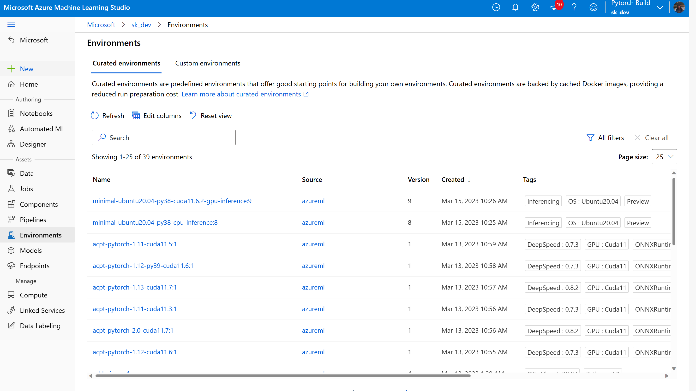

# Creating Custom Curated ACPT Environments in Azure Machine Learning Studio

If you are looking to extend curated environment and add HF transformers or datasets or any other external packages to be installed, AzureML offers creating a new env with docker context containing ACPT curated environment as base image and additional packages on top of it as below.

### Step 1: Navigate to Environments

In the [Azure Machine Learning Studio](https://ml.azure.com/registries/environments), navigate to the "Environments" section by clicking on the "Environments" option in the left-hand menu.

 

### Step 2: Navigate to Curated Enviroments

Navigate to curated environments and search "acpt" to list all the available ACPT curated enviroments. Clicking on the environment will show details of the environment. 

 

### Step 3: Get details of the curated enviroment

To create custom environment you will need the base docker image repository which can be found in the "Description" section as "Azure Container Registry". Copy the "Azure Container Registry" name which will be used later when you create a new custom environment.

 

### Step 4: Navigate to Custom Enviroments

Go back and click on the " Custom Environments" tab.

### Step 5: Create Custom Environment 

Click on + Create. In the "Create Environment" window, name the environment, description and select "Create a new docker context" in Select enbvironment type section

Paste the docker image name that you copied in Step 3. Configure your environment by declaring the base image and add any env variables you want to use and the packages that you want to include.

Review your environment settings, add any tags if needed and click on the "Create" button to create your custom environment.

That's it! You have now created a custom environment in Azure Machine Learning Studio and can use it to run your machine learning models.

## Next steps

* Learn more about environment objects:

    * [What are Azure Machine Learning Environments? ](concept-environments.md.md).
    * Learn more about [curated environments](concept-environments.md).

* Learn more about [training models in AML](concept-train-machine-learning-model.md).
