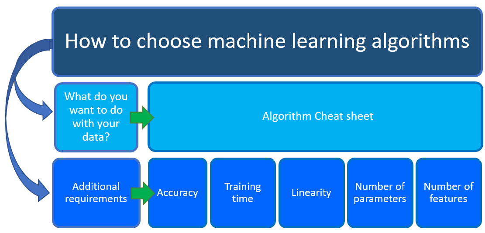

# How to choose algorithms for Azure Machine Learning

“What machine learning algorithm should I use?” The answer to this popular question mainly depends on two different aspects of your data science scenario:

 - What you want to do with your data: Specifically, what is the business question you want to answer by learning from your past data?

 - The requirements of your data science scenario: Specifically, what is the accuracy, training time, linearity, number of parameters, number of features your solution is supporting?

 

 ## Machine Learning Algorithm Cheat Sheet and business scenarios

The [Azure Machine Learning Algorithm Cheat Sheet](https://docs.microsoft.com/azure/machine-learning/algorithm-cheat-sheet?WT.mc_id=docs-article-lazzeri) helps you with the first aspect listed above: **what you want to do with your data**. With the Machine Learning Algorithm Cheat Sheet you can start your machine learning journey and choose the right [Azure Machine Learning designer](https://docs.microsoft.com/azure/machine-learning/concept-designer?WT.mc_id=docs-article-lazzeri) algorithm for your predictive analytics solutions. 

Machine Learning designer provides a comprehensive portfolio of algorithms, such as Multiclass Decision Forest, Recommendation systems, Neural Network Regression, Multiclass Neural Network, and K-Means Clustering. Each algorithm is designed to address a different type of machine learning problem. See the [Machine Learning designer algorithm and module reference](https://docs.microsoft.com/azure/machine-learning/algorithm-module-reference/module-reference?WT.mc_id=docs-article-lazzeri
) for a complete list along with documentation about how each algorithm works and how to tune parameters to optimize the algorithm for your use.

However, there are a few additional requirements that, together with the Azure Machine Learning Algorithm Cheat Sheet, you need to keep in mind when choosing a machine learning algorithm for your solution. The rest of this article helps you with the second aspect listed above: **requirements of your data science scenario**. This article walks you through additional factors to consider, such as the accuracy, training time, linearity, number of parameters and number of features.

> [!NOTE]
> To download the machine learning algorithm cheat sheet, go to [Azure Machine learning algorithm cheat sheet](https://docs.microsoft.com/azure/machine-learning/algorithm-cheat-sheet?WT.mc_id=docs-article-lazzeri).
> 
> 

## Additional requirements for a data science scenario

When choosing your algorithm, you need to know what you want to do with your data and what the additional requirements of your solution are: 

Let’s have a closer look at each of these requirements:

## Accuracy

Accuracy in machine learning is a general term used to measure the goodness of a model as the proportion of true results to total cases. In Azure ML designer the Evaluate Model module computes a set of industry-standard evaluation metrics. You can use this module to measure the accuracy of a trained model.

Getting the most accurate answer possible isn’t always necessary. Sometimes an approximation is adequate, depending on what you want to use it for. If that is the case, you may be able to cut your processing time dramatically by sticking with more approximate methods. Another advantage of more approximate methods is that they naturally tend to avoid overfitting.

There are three ways to use the Evaluate Model module:

 - Generate scores over your training data, and evaluate the model based on these scores
 - Generate scores on the model, but compare those scores to scores on a reserved testing set
 - Compare scores for two different but related models, using the same set of data

To see a complete list of metrics and approaches that you can use to evaluate the accuracy of your machine learning models, see Evaluate Model module.

## Training time

In supervised learning, training means using historical data to build a machine learning model that minimizes loss. The number of minutes or hours necessary to train a model varies a great deal between algorithms. Training time is often closely tied to accuracy—one typically accompanies the other. 

In addition, some algorithms are more sensitive to the number of data points than others. When time is limited it can drive the choice of algorithm, especially when the data set is large.

In Azure ML designer, creating and using a machine learning model is typically a three-step process.

1.	You configure a model, by choosing a particular type of algorithm, and defining its parameters or hyperparameters. 

2.	Provide a dataset that is labeled and has data compatible with the algorithm. Connect both the data and the model to Train Model module.

3.	After training is completed, use the trained model with one of the scoring modules, to make predictions on new data.

## Linearity

Linearity in statistics and machine learning means that there is a linear relationship between a variable and a constant in your dataset. Lots of machine learning algorithms make use of linearity. For example, linear classification algorithms assume that classes can be separated by a straight line (or its higher-dimensional analog). These include multiclass logistic regression, two-class logistic regression and support vector machines (as implemented in Azure ML designer). 

Linear regression algorithms assume that data trends follow a straight line. These assumptions aren’t bad for some problems, but on others they bring accuracy down. Despite their dangers, linear algorithms are very popular as a first line of attack. They tend to be algorithmically simple and fast to train.

## Number of parameters

Parameters are the knobs a data scientist gets to turn when setting up an algorithm. They are numbers that affect the algorithm’s behavior, such as error tolerance or number of iterations, or options between variants of how the algorithm behaves. The training time and accuracy of the algorithm can sometimes be quite sensitive to getting just the right settings. Typically, algorithms with large numbers of parameters require the most trial and error to find a good combination.

Alternatively, there is the Tune Model Hyperparameters module in Azure ML designer: the goal of this module is to determine the optimum hyperparameters for a machine learning model. The module builds and tests multiple models by using different combinations of settings. It compares metrics over all models to get the combinations of settings. 

While this is a great way to make sure you’ve spanned the parameter space, the time required to train a model increases exponentially with the number of parameters.  The upside is that having many parameters typically indicates that an algorithm has greater flexibility. It can often achieve very good accuracy, provided you can find the right combination of parameter settings.

## Number of features

In machine learning a feature is a quantifiable variable of the phenomenon you are trying to analyze. For certain types of data, the number of features can be very large compared to the number of data points. This is often the case with genetics or textual data. 

The large number of features can bog down some learning algorithms, making training time unfeasibly long. Support vector machines are particularly well suited to scenarios with high number of features: for this reason, they have been used in many applications, from information retrieval to text and image classification. Support vector machines can be used for both classification and regression tasks.

Feature selection refers to the process of applying statistical tests to inputs, given a specified output. The goal is to determine which columns are more predictive of the output. The Filter Based Feature Selection module in Azure ML designer provides multiple feature selection algorithms to choose from. The module includes correlation methods such as Pearson correlation and chi-squared values.

In Azure ML designer you can also use the Permutation Feature Importance module to compute a set of feature importance scores for your dataset. You can then leverage these scores to help you determine the best features to use in a model.

## Next Steps

 - Learn more about Azure Machine Learning designer
 - For descriptions of all the machine learning algorithms available in Azure Machine Learning designer, see Machine Learning designer algorithm and module reference
 - To explore the differences between deep learning, machine learning and AI, see Deep Learning vs. Machine Learning
