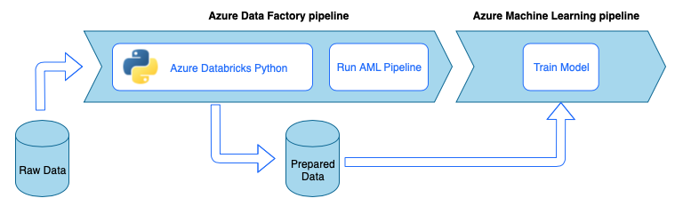
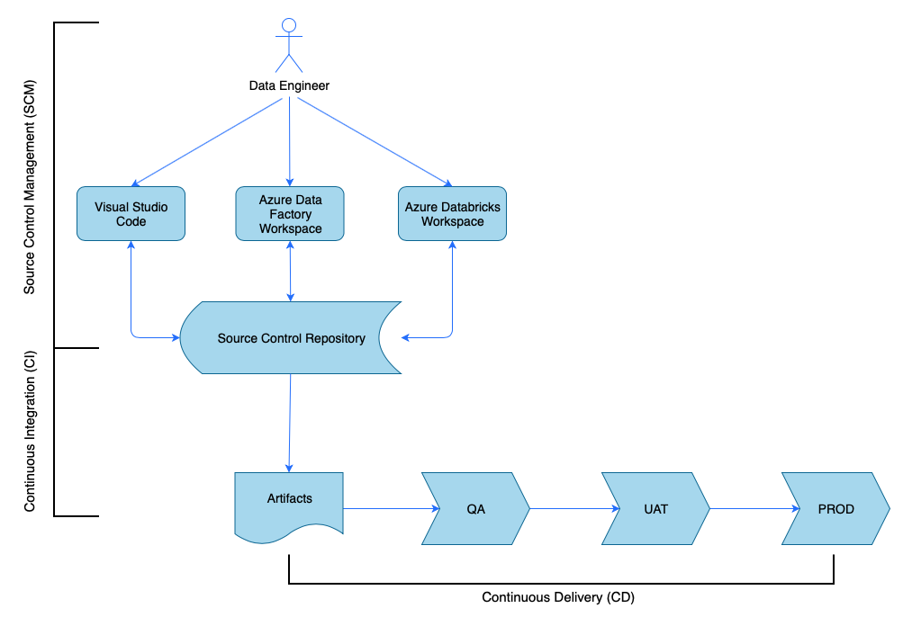
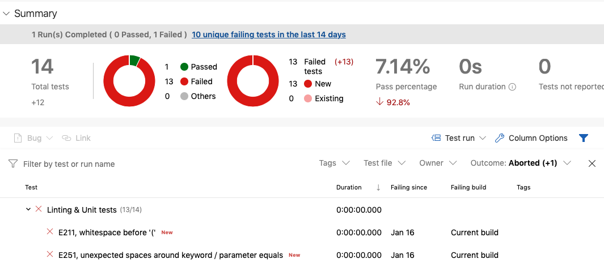
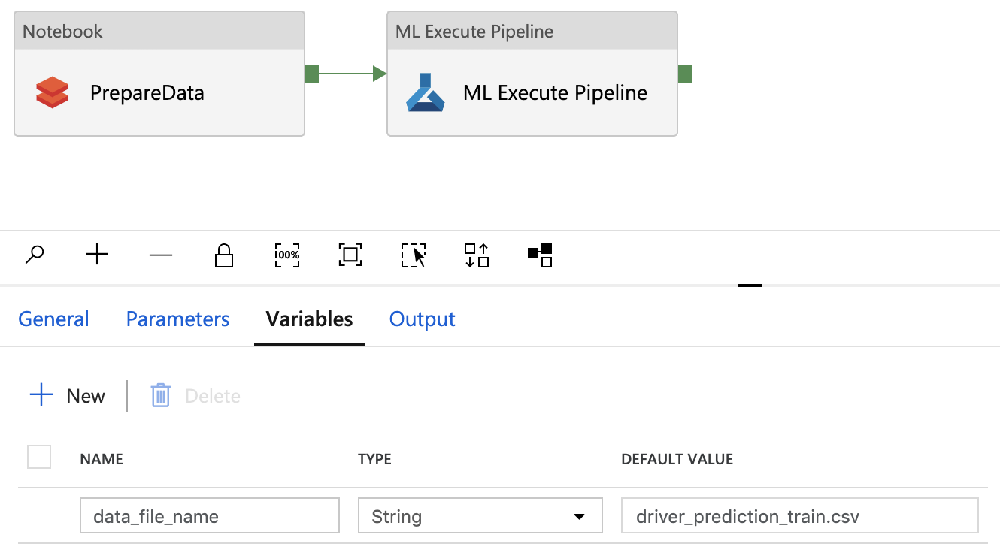
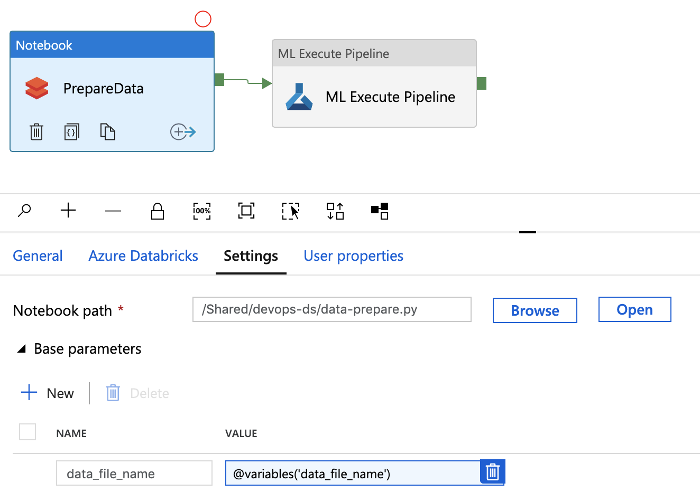

# DevOps for a data ingestion pipeline

In most scenarios, a data ingestion solution is a composition of scripts, service invocations, and a pipeline orchestrating all the activities. In this article, you learn how to apply DevOps practices to the development lifecycle of a common data ingestion pipeline that prepares data for machine learning model training. The pipeline is built using the following Azure services:

* __Azure Data Factory__: Reads the raw data and orchestrates data preparation.
* __Azure Databricks__: Runs a Python notebook that transforms the data.
* __Azure Pipelines__: Automates a continuous integration and development process.

## Data ingestion pipeline workflow

The data ingestion pipeline implements the following workflow:

1. Raw data is read into an Azure Data Factory (ADF) pipeline.
1. The ADF pipeline sends the data to an Azure Databricks cluster, which runs a Python notebook to transform the data.
1. The data is stored to a blob container, where it can be used by Azure Machine Learning to train a model.



## Continuous integration and delivery overview

As with many software solutions, there is a team (for example, Data Engineers) working on it. They collaborate and share the same Azure resources such as Azure Data Factory, Azure Databricks, and Azure Storage accounts. The collection of these resources is a Development environment. The data engineers contribute to the same source code base.

A continuous integration and delivery system automates the process of building, testing, and delivering (deploying) the solution. The Continuous Integration (CI) process performs the following tasks:

* Assembles the code
* Checks it with the code quality tests
* Runs unit tests
* Produces artifacts such as tested code and Azure Resource Manager templates

The Continuous Delivery (CD) process deploys the artifacts to the downstream environments.



This article demonstrates how to automate the CI and CD processes with [Azure Pipelines](https://azure.microsoft.com/services/devops/pipelines/).

## Source control management

Source control management is needed to track changes and enable collaboration between team members.
For example, the code would be stored in an Azure DevOps, GitHub, or GitLab repository. The collaboration workflow is based on a branching model. For example, [GitFlow](https://datasift.github.io/gitflow/IntroducingGitFlow.html).

### Python Notebook Source Code

The data engineers work with the Python notebook source code either locally in an IDE (for example, [Visual Studio Code](https://code.visualstudio.com)) or directly in the Databricks workspace. Once the code changes are complete, they are merged to the repository following a branching policy.

> [!TIP] 
> We recommended storing the code in `.py` files rather than in `.ipynb` Jupyter Notebook format. It improves the code readability and enables automatic code quality checks in the CI process.

### Azure Data Factory Source Code

The source code of Azure Data Factory pipelines is a collection of JSON files generated by an Azure Data Factory workspace. Normally the data engineers work with a visual designer in the Azure Data Factory workspace rather than with the source code files directly. 

To configure the workspace to use a source control repository, see [Author with Azure Repos Git integration](../data-factory/source-control.md#author-with-azure-repos-git-integration).   

## Continuous integration (CI)

The ultimate goal of the Continuous Integration process is to gather the joint team work from the source code and prepare it for the deployment to the downstream environments. As with the source code management this process is different for the Python notebooks and Azure Data Factory pipelines. 

### Python Notebook CI

The CI process for the Python Notebooks gets the code from the collaboration branch (for example, ***master*** or ***develop***) and performs the following activities:
* Code linting
* Unit testing
* Saving the code as an artifact

The following code snippet demonstrates the implementation of these steps in an Azure DevOps ***yaml*** pipeline:

```yaml
steps:
- script: |
   flake8 --output-file=$(Build.BinariesDirectory)/lint-testresults.xml --format junit-xml  
  workingDirectory: '$(Build.SourcesDirectory)'
  displayName: 'Run flake8 (code style analysis)'  
  
- script: |
   python -m pytest --junitxml=$(Build.BinariesDirectory)/unit-testresults.xml $(Build.SourcesDirectory)
  displayName: 'Run unit tests'

- task: PublishTestResults@2
  condition: succeededOrFailed()
  inputs:
    testResultsFiles: '$(Build.BinariesDirectory)/*-testresults.xml'
    testRunTitle: 'Linting & Unit tests'
    failTaskOnFailedTests: true
  displayName: 'Publish linting and unit test results'

- publish: $(Build.SourcesDirectory)
    artifact: di-notebooks
```

The pipeline uses [flake8](https://pypi.org/project/flake8/) to do the Python code linting. It runs the unit tests defined in the source code and publishes the linting and test results so they're available in the Azure Pipeline execution screen:



If the linting and unit testing is successful, the pipeline will copy the source code to the artifact repository to be used by the subsequent deployment steps.

### Azure Data Factory CI

CI process for an Azure Data Factory pipeline is a bottleneck for a data ingestion pipeline. 
There's no continuous integration. A deployable artifact for Azure Data Factory is a collection of Azure Resource Manager templates. The only way to produce those templates is to click the ***publish*** button in the Azure Data Factory workspace.

1. The data engineers merge the source code from their feature branches into the collaboration branch, for example, ***master*** or ***develop***. 
1. Someone with the granted permissions clicks the ***publish*** button to generate Azure Resource Manager templates from the source code in the collaboration branch. 
1. The workspace validates the pipelines (think of it as of linting and unit testing), generates Azure Resource Manager templates (think of it as of building) and saves the generated templates to a technical branch ***adf_publish*** in the same code repository (think of it as of publishing artifacts). This branch is created automatically by the Azure Data Factory workspace. 

For more information on this process, see [Continuous integration and delivery in Azure Data Factory](../data-factory/continuous-integration-deployment.md).

It's important to make sure that the generated Azure Resource Manager templates are environment agnostic. This means that all values that may differ between environments are parametrized. Azure Data Factory is smart enough to expose the majority of such values as parameters. For example, in the following template the connection properties to an Azure Machine Learning workspace are exposed as parameters:

```json
{
    "$schema": "https://schema.management.azure.com/schemas/2015-01-01/deploymentParameters.json#",
    "contentVersion": "1.0.0.0",
    "parameters": {
        "factoryName": {
            "value": "devops-ds-adf"
        },
        "AzureMLService_servicePrincipalKey": {
            "value": ""
        },
        "AzureMLService_properties_typeProperties_subscriptionId": {
            "value": "0fe1c235-5cfa-4152-17d7-5dff45a8d4ba"
        },
        "AzureMLService_properties_typeProperties_resourceGroupName": {
            "value": "devops-ds-rg"
        },
        "AzureMLService_properties_typeProperties_servicePrincipalId": {
            "value": "6e35e589-3b22-4edb-89d0-2ab7fc08d488"
        },
        "AzureMLService_properties_typeProperties_tenant": {
            "value": "72f988bf-86f1-41af-912b-2d7cd611db47"
        }
    }
}
```

However, you may want to expose your custom properties that are not handled by the Azure Data Factory workspace by default. In the scenario of this article an Azure Data Factory pipeline invokes a Python notebook processing the data. The notebook accepts a parameter with the name of an input data file.

```Python
import pandas as pd
import numpy as np

data_file_name = getArgument("data_file_name")
data = pd.read_csv(data_file_name)

labels = np.array(data['target'])
...
```

This name is different for ***Dev***, ***QA***, ***UAT***, and ***PROD*** environments. In a complex pipeline with multiple activities, there can be several custom properties. It's good practice to collect all those values in one place and define them as pipeline ***variables***:



The pipeline activities may refer to the pipeline variables while actually using them:



The Azure Data Factory workspace ***doesn't*** expose pipeline variables as Azure Resource Manager templates parameters by default. The workspace uses the [Default Parameterization Template](../data-factory/continuous-integration-deployment.md#default-parameterization-template) dictating what pipeline properties should be exposed as Azure Resource Manager template parameters. To add pipeline variables to the list, update the `"Microsoft.DataFactory/factories/pipelines"` section of the [Default Parameterization Template](../data-factory/continuous-integration-deployment.md#default-parameterization-template) with the following snippet and place the result json file in the root of the source folder:

```json
"Microsoft.DataFactory/factories/pipelines": {
        "properties": {
            "variables": {
                "*": {
                    "defaultValue": "="
                }
            }
        }
    }
```

Doing so will force the Azure Data Factory workspace to add the variables to the parameters list when the ***publish*** button is clicked:

```json
{
    "$schema": "https://schema.management.azure.com/schemas/2015-01-01/deploymentParameters.json#",
    "contentVersion": "1.0.0.0",
    "parameters": {
        "factoryName": {
            "value": "devops-ds-adf"
        },
        ...
        "data-ingestion-pipeline_properties_variables_data_file_name_defaultValue": {
            "value": "driver_prediction_train.csv"
        }        
    }
}
```

The values in the JSON file are default values configured in the pipeline definition. They're expected to be overridden with the target environment values when the Azure Resource Manager template is deployed.

## Continuous delivery (CD)

The Continuous Delivery process takes the artifacts and deploys them to the first target environment. It makes sure that the solution works by running tests. If successful, it continues to the next environment. 

The CD Azure Pipeline consists of multiple stages representing the environments. Each stage contains [deployments](/azure/devops/pipelines/process/deployment-jobs) and [jobs](/azure/devops/pipelines/process/phases?tabs=yaml) that perform the following steps:

* Deploy a Python Notebook to Azure Databricks workspace
* Deploy an Azure Data Factory pipeline 
* Run the pipeline
* Check the data ingestion result

The pipeline stages can be configured with [approvals](/azure/devops/pipelines/process/approvals?tabs=check-pass) and [gates](/azure/devops/pipelines/release/approvals/gates) that provide additional control on how the deployment process evolves through the chain of environments.

### Deploy a Python Notebook

The following code snippet defines an Azure Pipeline [deployment](/azure/devops/pipelines/process/deployment-jobs) that copies a Python notebook to a Databricks cluster:

```yaml
- stage: 'Deploy_to_QA'
  displayName: 'Deploy to QA'
  variables:
  - group: devops-ds-qa-vg
  jobs:
  - deployment: "Deploy_to_Databricks"
    displayName: 'Deploy to Databricks'
    timeoutInMinutes: 0
    environment: qa
    strategy:
      runOnce:
        deploy:
          steps:
            - task: UsePythonVersion@0
              inputs:
                versionSpec: '3.x'
                addToPath: true
                architecture: 'x64'
              displayName: 'Use Python3'

            - task: configuredatabricks@0
              inputs:
                url: '$(DATABRICKS_URL)'
                token: '$(DATABRICKS_TOKEN)'
              displayName: 'Configure Databricks CLI'    

            - task: deploynotebooks@0
              inputs:
                notebooksFolderPath: '$(Pipeline.Workspace)/di-notebooks'
                workspaceFolder: '/Shared/devops-ds'
              displayName: 'Deploy (copy) data processing notebook to the Databricks cluster'       
```            

The artifacts produced by the CI are automatically copied to the deployment agent and are available in the `$(Pipeline.Workspace)` folder. In this case, the deployment task refers to the `di-notebooks` artifact containing the Python notebook. This [deployment](/azure/devops/pipelines/process/deployment-jobs) uses the [Databricks Azure DevOps extension](https://marketplace.visualstudio.com/items?itemName=riserrad.azdo-databricks) to copy the notebook files to the Databricks workspace.

The `Deploy_to_QA` stage contains a reference to the `devops-ds-qa-vg` variable group defined in the Azure DevOps project. The steps in this stage refer to the variables from this variable group (for example, `$(DATABRICKS_URL)` and `$(DATABRICKS_TOKEN)`). The idea is that the next stage (for example, `Deploy_to_UAT`) will operate with the same variable names defined in its own UAT-scoped variable group.

### Deploy an Azure Data Factory pipeline

A deployable artifact for Azure Data Factory is an Azure Resource Manager template. It's going to be deployed with the ***Azure Resource Group Deployment*** task as it is demonstrated in the following snippet:

```yaml
  - deployment: "Deploy_to_ADF"
    displayName: 'Deploy to ADF'
    timeoutInMinutes: 0
    environment: qa
    strategy:
      runOnce:
        deploy:
          steps:
            - task: AzureResourceGroupDeployment@2
              displayName: 'Deploy ADF resources'
              inputs:
                azureSubscription: $(AZURE_RM_CONNECTION)
                resourceGroupName: $(RESOURCE_GROUP)
                location: $(LOCATION)
                csmFile: '$(Pipeline.Workspace)/adf-pipelines/ARMTemplateForFactory.json'
                csmParametersFile: '$(Pipeline.Workspace)/adf-pipelines/ARMTemplateParametersForFactory.json'
                overrideParameters: -data-ingestion-pipeline_properties_variables_data_file_name_defaultValue "$(DATA_FILE_NAME)"
```
The value of the data filename parameter comes from the `$(DATA_FILE_NAME)` variable defined in a QA stage variable group. Similarly, all parameters defined in ***ARMTemplateForFactory.json*** can be overridden. If they are not, then the default values are used.

### Run the pipeline and check the data ingestion result

The next step is to make sure that the deployed solution is working. The following job definition runs an Azure Data Factory pipeline with a [PowerShell script](https://github.com/microsoft/DataOps/tree/master/adf/utils) and executes a Python notebook on an Azure Databricks cluster. The notebook checks if the data has been ingested correctly and validates the result data file with `$(bin_FILE_NAME)` name.

```yaml
  - job: "Integration_test_job"
    displayName: "Integration test job"
    dependsOn: [Deploy_to_Databricks, Deploy_to_ADF]
    pool:
      vmImage: 'ubuntu-latest'
    timeoutInMinutes: 0
    steps:
    - task: AzurePowerShell@4
      displayName: 'Execute ADF Pipeline'
      inputs:
        azureSubscription: $(AZURE_RM_CONNECTION)
        ScriptPath: '$(Build.SourcesDirectory)/adf/utils/Invoke-ADFPipeline.ps1'
        ScriptArguments: '-ResourceGroupName $(RESOURCE_GROUP) -DataFactoryName $(DATA_FACTORY_NAME) -PipelineName $(PIPELINE_NAME)'
        azurePowerShellVersion: LatestVersion
    - task: UsePythonVersion@0
      inputs:
        versionSpec: '3.x'
        addToPath: true
        architecture: 'x64'
      displayName: 'Use Python3'

    - task: configuredatabricks@0
      inputs:
        url: '$(DATABRICKS_URL)'
        token: '$(DATABRICKS_TOKEN)'
      displayName: 'Configure Databricks CLI'    

    - task: executenotebook@0
      inputs:
        notebookPath: '/Shared/devops-ds/test-data-ingestion'
        existingClusterId: '$(DATABRICKS_CLUSTER_ID)'
        executionParams: '{"bin_file_name":"$(bin_FILE_NAME)"}'
      displayName: 'Test data ingestion'

    - task: waitexecution@0
      displayName: 'Wait until the testing is done'
```

The final task in the job checks the result of the notebook execution. If it returns an error, it sets the status of pipeline execution to failed.

## Putting pieces together

The complete CI/CD Azure Pipeline consists of the following stages:
* CI
* Deploy To QA
    * Deploy to Databricks + Deploy to ADF
    * Integration Test

It contains a number of ***Deploy*** stages equal to the number of target environments you have. Each ***Deploy*** stage contains two [deployments](/azure/devops/pipelines/process/deployment-jobs) that run in parallel and a [job](/azure/devops/pipelines/process/phases?tabs=yaml) that runs after deployments to test the solution on the environment.

A sample implementation of the pipeline is assembled in the following ***yaml*** snippet:

```yaml
variables:
- group: devops-ds-vg

stages:
- stage: 'CI'
  displayName: 'CI'
  jobs:
  - job: "CI_Job"
    displayName: "CI Job"
    pool:
      vmImage: 'ubuntu-latest'
    timeoutInMinutes: 0
    steps:
    - task: UsePythonVersion@0
      inputs:
        versionSpec: '3.x'
        addToPath: true
        architecture: 'x64'
      displayName: 'Use Python3'
    - script: pip install --upgrade flake8 flake8_formatter_junit_xml
      displayName: 'Install flake8'
    - checkout: self
    - script: |
       flake8 --output-file=$(Build.BinariesDirectory)/lint-testresults.xml --format junit-xml  
    workingDirectory: '$(Build.SourcesDirectory)'
    displayName: 'Run flake8 (code style analysis)'  
    - script: |
       python -m pytest --junitxml=$(Build.BinariesDirectory)/unit-testresults.xml $(Build.SourcesDirectory)
    displayName: 'Run unit tests'
    - task: PublishTestResults@2
    condition: succeededOrFailed()
    inputs:
        testResultsFiles: '$(Build.BinariesDirectory)/*-testresults.xml'
        testRunTitle: 'Linting & Unit tests'
        failTaskOnFailedTests: true
    displayName: 'Publish linting and unit test results'    

    # The CI stage produces two artifacts (notebooks and ADF pipelines).
    # The pipelines Azure Resource Manager templates are stored in a technical branch "adf_publish"
    - publish: $(Build.SourcesDirectory)/$(Build.Repository.Name)/code/dataingestion
      artifact: di-notebooks
    - checkout: git://${{variables['System.TeamProject']}}@adf_publish    
    - publish: $(Build.SourcesDirectory)/$(Build.Repository.Name)/devops-ds-adf
      artifact: adf-pipelines

- stage: 'Deploy_to_QA'
  displayName: 'Deploy to QA'
  variables:
  - group: devops-ds-qa-vg
  jobs:
  - deployment: "Deploy_to_Databricks"
    displayName: 'Deploy to Databricks'
    timeoutInMinutes: 0
    environment: qa
    strategy:
      runOnce:
        deploy:
          steps:
            - task: UsePythonVersion@0
              inputs:
                versionSpec: '3.x'
                addToPath: true
                architecture: 'x64'
              displayName: 'Use Python3'

            - task: configuredatabricks@0
              inputs:
                url: '$(DATABRICKS_URL)'
                token: '$(DATABRICKS_TOKEN)'
              displayName: 'Configure Databricks CLI'    

            - task: deploynotebooks@0
              inputs:
                notebooksFolderPath: '$(Pipeline.Workspace)/di-notebooks'
                workspaceFolder: '/Shared/devops-ds'
              displayName: 'Deploy (copy) data processing notebook to the Databricks cluster'             
  - deployment: "Deploy_to_ADF"
    displayName: 'Deploy to ADF'
    timeoutInMinutes: 0
    environment: qa
    strategy:
      runOnce:
        deploy:
          steps:
            - task: AzureResourceGroupDeployment@2
              displayName: 'Deploy ADF resources'
              inputs:
                azureSubscription: $(AZURE_RM_CONNECTION)
                resourceGroupName: $(RESOURCE_GROUP)
                location: $(LOCATION)
                csmFile: '$(Pipeline.Workspace)/adf-pipelines/ARMTemplateForFactory.json'
                csmParametersFile: '$(Pipeline.Workspace)/adf-pipelines/ARMTemplateParametersForFactory.json'
                overrideParameters: -data-ingestion-pipeline_properties_variables_data_file_name_defaultValue "$(DATA_FILE_NAME)"
  - job: "Integration_test_job"
    displayName: "Integration test job"
    dependsOn: [Deploy_to_Databricks, Deploy_to_ADF]
    pool:
      vmImage: 'ubuntu-latest'
    timeoutInMinutes: 0
    steps:
    - task: AzurePowerShell@4
      displayName: 'Execute ADF Pipeline'
      inputs:
        azureSubscription: $(AZURE_RM_CONNECTION)
        ScriptPath: '$(Build.SourcesDirectory)/adf/utils/Invoke-ADFPipeline.ps1'
        ScriptArguments: '-ResourceGroupName $(RESOURCE_GROUP) -DataFactoryName $(DATA_FACTORY_NAME) -PipelineName $(PIPELINE_NAME)'
        azurePowerShellVersion: LatestVersion
    - task: UsePythonVersion@0
      inputs:
        versionSpec: '3.x'
        addToPath: true
        architecture: 'x64'
      displayName: 'Use Python3'

    - task: configuredatabricks@0
      inputs:
        url: '$(DATABRICKS_URL)'
        token: '$(DATABRICKS_TOKEN)'
      displayName: 'Configure Databricks CLI'    

    - task: executenotebook@0
      inputs:
        notebookPath: '/Shared/devops-ds/test-data-ingestion'
        existingClusterId: '$(DATABRICKS_CLUSTER_ID)'
        executionParams: '{"bin_file_name":"$(bin_FILE_NAME)"}'
      displayName: 'Test data ingestion'

    - task: waitexecution@0
      displayName: 'Wait until the testing is done'                

```

## Next steps

* [Source Control in Azure Data Factory](../data-factory/source-control.md)
* [Continuous integration and delivery in Azure Data Factory](../data-factory/continuous-integration-deployment.md)
* [DevOps for Azure Databricks](https://marketplace.visualstudio.com/items?itemName=riserrad.azdo-databricks)