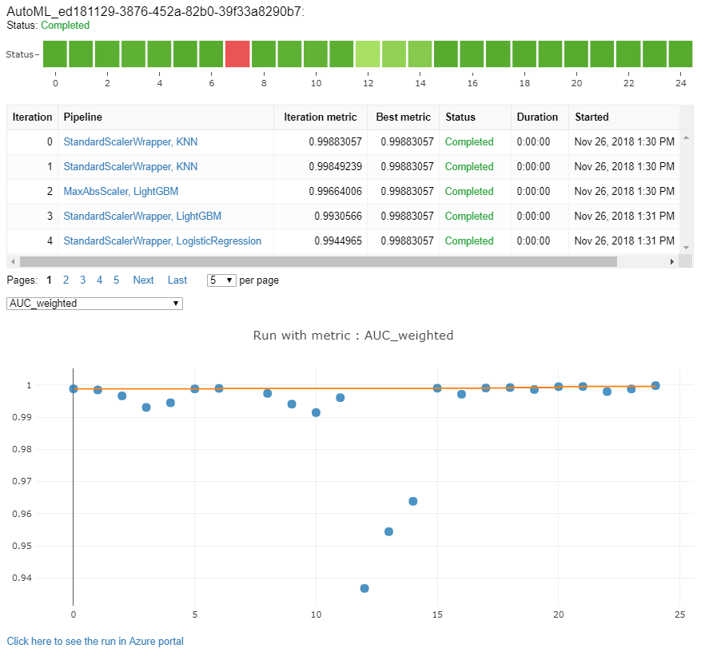

# Configure automated ML experiments in Python


In this guide, learn how to define various configuration settings of your automated machine learning experiments with the [Azure Machine Learning SDK](/python/api/overview/azure/ml/intro). Automated machine learning picks an algorithm and hyperparameters for you and generates a model ready for deployment. There are several options that you can use to configure automated machine learning experiments.

For an end to end example of an automated machine learning experiment, see [Tutorial: Train a classification model with automated machine learning](tutorial-auto-train-models.md).

Configuration options available in automated machine learning:

* Select your experiment type: Classification, Regression, or Time Series Forecasting
* Data source, formats, and fetch data
* Choose your compute target: local or remote
* Automated machine learning experiment settings
* Run an automated machine learning experiment
* Explore model metrics
* Register and deploy model

If you prefer a no code experience, you can also [Create your automated machine learning experiments in Azure Machine Learning studio](how-to-use-automated-ml-for-ml-models.md).

## Prerequisites

For this article you need, 
* An Azure Machine Learning workspace. To create the workspace, see [Create an Azure Machine Learning workspace](how-to-manage-workspace.md).

* The Azure Machine Learning Python SDK installed.
    To install the SDK you can either, 
    * Create a compute instance, which automatically installs the SDK and is preconfigured for ML workflows. See [Create and manage an Azure Machine Learning compute instance](how-to-create-manage-compute-instance.md) for more information. 

    * [Install the `automl` package yourself](https://github.com/Azure/MachineLearningNotebooks/blob/master/how-to-use-azureml/automated-machine-learning/README.md#setup-using-a-local-conda-environment), which includes the [default installation](/python/api/overview/azure/ml/install#default-install) of the SDK.
    
    > [!WARNING]
    > Python 3.8 is not compatible with `automl`. 

## Select your experiment type

Before you begin your experiment, you should determine the kind of machine learning problem you are solving. Automated machine learning supports task types of `classification`, `regression`, and `forecasting`. Learn more about [task types](concept-automated-ml.md#when-to-use-automl-classify-regression--forecast).

The following code uses the `task` parameter in the `AutoMLConfig` constructor to specify the experiment type as `classification`.

```python
from azureml.train.automl import AutoMLConfig

# task can be one of classification, regression, forecasting
automl_config = AutoMLConfig(task = "classification")
```

## Data source and format

Automated machine learning supports data that resides on your local desktop or in the cloud such as Azure Blob Storage. The data can be read into a **Pandas DataFrame** or an **Azure Machine Learning TabularDataset**. [Learn more about datasets](how-to-create-register-datasets.md).

Requirements for training data in machine learning:
- Data must be in tabular form.
- The value to predict, target column, must be in the data.

**For remote experiments**, training data must be accessible from the remote compute. AutoML only accepts [Azure Machine Learning TabularDatasets](/python/api/azureml-core/azureml.data.tabulardataset) when working on a remote compute. 

Azure Machine Learning datasets expose functionality to:

* Easily transfer data from static files or URL sources into your workspace.
* Make your data available to training scripts when running on cloud compute resources. See [How to train with datasets](how-to-train-with-datasets.md#mount-files-to-remote-compute-targets) for an example of using the `Dataset` class to mount data to your remote compute target.

The following code creates a TabularDataset from a web url. See [Create a TabularDatasets](how-to-create-register-datasets.md#create-a-tabulardataset) for code examples on how to create datasets from other sources like local files and datastores.

```python
from azureml.core.dataset import Dataset
data = "https://automlsamplenotebookdata.blob.core.windows.net/automl-sample-notebook-data/creditcard.csv"
dataset = Dataset.Tabular.from_delimited_files(data)
  ```
**For local compute experiments**, we recommend pandas dataframes for faster processing times.

  ```python
  import pandas as pd
  from sklearn.model_selection import train_test_split

  df = pd.read_csv("your-local-file.csv")
  train_data, test_data = train_test_split(df, test_size=0.1, random_state=42)
  label = "label-col-name"
  ```

## Training, validation, and test data

You can specify separate **training data and validation data sets** directly in the `AutoMLConfig` constructor. Learn more about [how to configure data splits and cross validation](how-to-configure-cross-validation-data-splits.md) for your AutoML experiments. 

If you do not explicitly specify a `validation_data` or `n_cross_validation` parameter, automated ML applies default techniques to determine how validation is performed. This determination depends on the number of rows in the dataset assigned to your `training_data` parameter. 

|Training&nbsp;data&nbsp;size| Validation technique |
|---|-----|
|**Larger&nbsp;than&nbsp;20,000&nbsp;rows**| Train/validation data split is applied. The default is to take 10% of the initial training data set as the validation set. In turn, that validation set is used for metrics calculation.
|**Smaller&nbsp;than&nbsp;20,000&nbsp;rows**| Cross-validation approach is applied. The default number of folds depends on the number of rows. <br> **If the dataset is less than 1,000 rows**, 10 folds are used. <br> **If the rows are between 1,000 and 20,000**, then three folds are used.

At this time, you need to provide your own **test data** for  model evaluation. For a code example of bringing your own test data for model evaluation see the **Test** section of [this Jupyter notebook](https://github.com/Azure/MachineLearningNotebooks/blob/master/how-to-use-azureml/automated-machine-learning/classification-credit-card-fraud/auto-ml-classification-credit-card-fraud.ipynb).

## Compute to run experiment

Next determine where the model will be trained. An automated machine learning training experiment can run on the following compute options. Learn the [pros and cons of local and remote compute](concept-automated-ml.md#local-remote) options. 

* Your **local** machine such as a local desktop or laptop – Generally when you have a small dataset and you are still in the exploration stage. See [this notebook](https://github.com/Azure/MachineLearningNotebooks/blob/master/how-to-use-azureml/automated-machine-learning/local-run-classification-credit-card-fraud/auto-ml-classification-credit-card-fraud-local.ipynb) for a local compute example. 
 
* A **remote** machine in the cloud – [Azure Machine Learning Managed Compute](concept-compute-target.md#amlcompute) is a managed service that enables the ability to train machine learning models on clusters of Azure virtual machines. 

    See [this notebook](https://github.com/Azure/MachineLearningNotebooks/blob/master/how-to-use-azureml/automated-machine-learning/classification-bank-marketing-all-features/auto-ml-classification-bank-marketing-all-features.ipynb) for a remote example using Azure Machine Learning Managed Compute. 

* An **Azure Databricks cluster** in your Azure subscription. You can find more details in [Set up an Azure Databricks cluster for automated ML](how-to-configure-databricks-automl-environment.md). See this [GitHub site](https://github.com/Azure/MachineLearningNotebooks/tree/master/how-to-use-azureml/azure-databricks/automl) for examples of notebooks with Azure Databricks.

<a name='configure-experiment'></a>

## Configure your experiment settings

There are several options that you can use to configure your automated machine learning experiment. These parameters are set by instantiating an `AutoMLConfig` object. See the [AutoMLConfig class](/python/api/azureml-train-automl-client/azureml.train.automl.automlconfig.automlconfig) for a full list of parameters.

Some examples include:

1. Classification experiment using AUC weighted as the primary metric with experiment timeout minutes set to 30 minutes and 2 cross-validation folds.

   ```python
       automl_classifier=AutoMLConfig(task='classification',
                                      primary_metric='AUC_weighted',
                                      experiment_timeout_minutes=30,
                                      blocked_models=['XGBoostClassifier'],
                                      training_data=train_data,
                                      label_column_name=label,
                                      n_cross_validations=2)
   ```
1. The following example is a regression experiment set to end after 60 minutes with five validation cross folds.

   ```python
      automl_regressor = AutoMLConfig(task='regression',
                                      experiment_timeout_minutes=60,
                                      allowed_models=['KNN'],
                                      primary_metric='r2_score',
                                      training_data=train_data,
                                      label_column_name=label,
                                      n_cross_validations=5)
   ```


1. Forecasting tasks require extra setup, see the [Autotrain a time-series forecast model](how-to-auto-train-forecast.md) article for more details. 

    ```python
    time_series_settings = {
        'time_column_name': time_column_name,
        'time_series_id_column_names': time_series_id_column_names,
        'forecast_horizon': n_test_periods
    }
    
    automl_config = AutoMLConfig(task = 'forecasting',
                                 debug_log='automl_oj_sales_errors.log',
                                 primary_metric='normalized_root_mean_squared_error',
                                 experiment_timeout_minutes=20,
                                 training_data=train_data,
                                 label_column_name=label,
                                 n_cross_validations=5,
                                 path=project_folder,
                                 verbosity=logging.INFO,
                                 **time_series_settings)
    ```
    
### Supported models

Automated machine learning tries different models and algorithms during the automation and tuning process. As a user, there is no need for you to specify the algorithm. 

The three different `task` parameter values determine the list of algorithms, or models, to apply. Use the `allowed_models` or `blocked_models` parameters to further modify iterations with the available models to include or exclude. 

The following table summarizes the supported models by task type. 

> [!NOTE]
> If you plan to export your auto ML created models to an [ONNX model](concept-onnx.md), only those algorithms indicated with an * are able to be converted to the ONNX format. Learn more about [converting models to ONNX](concept-automated-ml.md#use-with-onnx). <br> <br> Also note, ONNX only supports classification and regression tasks at this time. 

Classification | Regression | Time Series Forecasting
|-- |-- |--
[Logistic Regression](https://scikit-learn.org/stable/modules/linear_model.html#logistic-regression)* | [Elastic Net](https://scikit-learn.org/stable/modules/linear_model.html#elastic-net)* | [AutoARIMA](https://www.alkaline-ml.com/pmdarima/modules/generated/pmdarima.arima.auto_arima.html#pmdarima.arima.auto_arima)
[Light GBM](https://lightgbm.readthedocs.io/en/latest/index.html)* | [Light GBM](https://lightgbm.readthedocs.io/en/latest/index.html)* | [Prophet](https://facebook.github.io/prophet/docs/quick_start.html)
[Gradient Boosting](https://scikit-learn.org/stable/modules/ensemble.html#classification)* | [Gradient Boosting](https://scikit-learn.org/stable/modules/ensemble.html#regression)* | [Elastic Net](https://scikit-learn.org/stable/modules/linear_model.html#elastic-net)
[Decision Tree](https://scikit-learn.org/stable/modules/tree.html#decision-trees)* |[Decision Tree](https://scikit-learn.org/stable/modules/tree.html#regression)* |[Light GBM](https://lightgbm.readthedocs.io/en/latest/index.html)
[K Nearest Neighbors](https://scikit-learn.org/stable/modules/neighbors.html#nearest-neighbors-regression)* |[K Nearest Neighbors](https://scikit-learn.org/stable/modules/neighbors.html#nearest-neighbors-regression)* | [Gradient Boosting](https://scikit-learn.org/stable/modules/ensemble.html#regression)
[Linear SVC](https://scikit-learn.org/stable/modules/svm.html#classification)* |[LARS Lasso](https://scikit-learn.org/stable/modules/linear_model.html#lars-lasso)* | [Decision Tree](https://scikit-learn.org/stable/modules/tree.html#regression)
[Support Vector Classification (SVC)](https://scikit-learn.org/stable/modules/svm.html#classification)* |[Stochastic Gradient Descent (SGD)](https://scikit-learn.org/stable/modules/sgd.html#regression)* | [Decision Tree](https://scikit-learn.org/stable/modules/tree.html#regression)
[Random Forest](https://scikit-learn.org/stable/modules/ensemble.html#random-forests)* | [Random Forest](https://scikit-learn.org/stable/modules/ensemble.html#random-forests) | [LARS Lasso](https://scikit-learn.org/stable/modules/linear_model.html#lars-lasso)
[Extremely Randomized Trees](https://scikit-learn.org/stable/modules/ensemble.html#extremely-randomized-trees)* | [Extremely Randomized Trees](https://scikit-learn.org/stable/modules/ensemble.html#extremely-randomized-trees)* | [Stochastic Gradient Descent (SGD)](https://scikit-learn.org/stable/modules/sgd.html#regression)
[Xgboost](https://xgboost.readthedocs.io/en/latest/parameter.html)* |[Xgboost](https://xgboost.readthedocs.io/en/latest/parameter.html)* | [Random Forest](https://scikit-learn.org/stable/modules/ensemble.html#random-forests)
[Averaged Perceptron Classifier](/python/api/nimbusml/nimbusml.linear_model.averagedperceptronbinaryclassifier?preserve-view=true&view=nimbusml-py-latest)| [Online Gradient Descent Regressor](/python/api/nimbusml/nimbusml.linear_model.onlinegradientdescentregressor?preserve-view=true&view=nimbusml-py-latest) | [Xgboost](https://xgboost.readthedocs.io/en/latest/parameter.html)
[Naive Bayes](https://scikit-learn.org/stable/modules/naive_bayes.html#bernoulli-naive-bayes)* |[Fast Linear Regressor](/python/api/nimbusml/nimbusml.linear_model.fastlinearregressor?preserve-view=true&view=nimbusml-py-latest)| ForecastTCN
[Stochastic Gradient Descent (SGD)](https://scikit-learn.org/stable/modules/sgd.html#sgd)* || Naive
[Linear SVM Classifier](/python/api/nimbusml/nimbusml.linear_model.linearsvmbinaryclassifier?preserve-view=true&view=nimbusml-py-latest)* || SeasonalNaive
||| Average
||| SeasonalAverage
||| [ExponentialSmoothing](https://www.statsmodels.org/v0.10.2/generated/statsmodels.tsa.holtwinters.ExponentialSmoothing.html)
### Primary Metric
The `primary metric` parameter determines the metric to be used during model training for optimization. The available metrics you can select is determined by the task type you choose, and the following table shows valid primary metrics for each task type.

Choosing a primary metric for automated machine learning to optimize depends on many factors. We recommend your primary consideration be to choose a metric which best represents your business needs. Then consider if the metric is suitable for your dataset profile (data size, range, class distribution, etc.).

Learn about the specific definitions of these metrics in [Understand automated machine learning results](how-to-understand-automated-ml.md).

|Classification | Regression | Time Series Forecasting
|--|--|--
|`accuracy`| `spearman_correlation` | `spearman_correlation`
|`AUC_weighted` | `normalized_root_mean_squared_error` | `normalized_root_mean_squared_error`
|`average_precision_score_weighted` | `r2_score` | `r2_score`
|`norm_macro_recall` | `normalized_mean_absolute_error` | `normalized_mean_absolute_error`
|`precision_score_weighted` |

### Primary metrics for classification scenarios 

Post thresholded metrics, like `accuracy`, `average_precision_score_weighted`, `norm_macro_recall`, and `precision_score_weighted` may not optimize as well for datasets which are small, have very large class skew (class imbalance), or when the expected metric value is very close to 0.0 or 1.0. In those cases, `AUC_weighted` can be a better choice for the primary metric. After automated machine learning completes, you can choose the winning model based on the metric best suited to your business needs.

| Metric | Example use case(s) |
| ------ | ------- |
| `accuracy` | Image classification, Sentiment analysis, Churn prediction |
| `AUC_weighted` | Fraud detection, Image classification, Anomaly detection/spam detection |
| `average_precision_score_weighted` | Sentiment analysis |
| `norm_macro_recall` | Churn prediction |
| `precision_score_weighted` |  |

### Primary metrics for regression scenarios

Metrics like `r2_score` and `spearman_correlation` can better represent the quality of model when the scale of the value-to-predict covers many orders of magnitude. For instance salary estimation, where many people have a salary of $20k to $100k, but the scale goes very high with some salaries in the $100M range. 

`normalized_mean_absolute_error` and `normalized_root_mean_squared_error` would in this case treat a $20k prediction error the same for a worker with a $30k salary as a worker making $20M. While in reality, predicting only $20k off from a $20M salary is very close (a small 0.1% relative difference), whereas $20k off from $30k is not close (a large 67% relative difference). `normalized_mean_absolute_error` and `normalized_root_mean_squared_error` are useful when the values to predict are in a similar scale.

| Metric | Example use case(s) |
| ------ | ------- |
| `spearman_correlation` | |
| `normalized_root_mean_squared_error` | Price prediction (house/product/tip), Review score prediction |
| `r2_score` | Airline delay, Salary estimation, Bug resolution time |
| `normalized_mean_absolute_error` |  |

### Primary metrics for time series forecasting scenarios

See regression notes, above.

| Metric | Example use case(s) |
| ------ | ------- |
| `spearman_correlation` | |
| `normalized_root_mean_squared_error` | Price prediction (forecasting), Inventory optimization, Demand forecasting |
| `r2_score` | Price prediction (forecasting), Inventory optimization, Demand forecasting |
| `normalized_mean_absolute_error` | |

### Data featurization

In every automated machine learning experiment, your data is automatically scaled and normalized to help *certain* algorithms that are sensitive to features that are on different scales. This scaling and normalization is referred to as featurization. 
See [Featurization in AutoML](how-to-configure-auto-features.md#) for more detail and code examples. 

When configuring your experiments in your `AutoMLConfig` object, you can enable/disable the setting `featurization`. The following table shows the accepted settings for featurization in the [AutoMLConfig object](/python/api/azureml-train-automl-client/azureml.train.automl.automlconfig.automlconfig). 

|Featurization Configuration | Description |
| ------------- | ------------- |
|`"featurization": 'auto'`| Indicates that as part of preprocessing, [data guardrails and featurization steps](how-to-configure-auto-features.md#featurization) are performed automatically. **Default setting**.|
|`"featurization": 'off'`| Indicates featurization step shouldn't be done automatically.|
|`"featurization":`&nbsp;`'FeaturizationConfig'`| Indicates customized featurization step should be used. [Learn how to customize featurization](how-to-configure-auto-features.md#customize-featurization).|

> [!NOTE]
> Automated machine learning featurization steps (feature normalization, handling missing data,
> converting text to numeric, etc.) become part of the underlying model. When using the model for
> predictions, the same featurization steps applied during training are applied to
> your input data automatically.

<a name="ensemble"></a>

### Ensemble configuration

Ensemble models are enabled by default, and appear as the final run iterations in an AutoML run. Currently **VotingEnsemble** and **StackEnsemble** are supported. 

Voting implements soft-voting, which uses weighted averages. The stacking implementation uses a two layer implementation, where the first layer has the same models as the voting ensemble, and the second layer model is used to find the optimal combination of the models from the first layer. 

If you are using ONNX models, **or** have model-explainability enabled, stacking is disabled and only voting is utilized.

Ensemble training can be disabled by using the `enable_voting_ensemble` and `enable_stack_ensemble` boolean parameters.

```python
automl_classifier = AutoMLConfig(
        task='classification',
        primary_metric='AUC_weighted',
        experiment_timeout_minutes=30,
        training_data=data_train,
        label_column_name=label,
        n_cross_validations=5,
        enable_voting_ensemble=False,
        enable_stack_ensemble=False
        )
```

To alter the default ensemble behavior, there are multiple default arguments that can be provided as `kwargs` in an `AutoMLConfig` object.

> [!IMPORTANT]
>  The following parameters aren't explicit parameters of the AutoMLConfig class. 

* `ensemble_download_models_timeout_sec`: During **VotingEnsemble** and **StackEnsemble** model generation, multiple fitted models from the previous child runs are downloaded. If you encounter this error: `AutoMLEnsembleException: Could not find any models for running ensembling`, then you may need to provide more time for the models to be downloaded. The default value is 300 seconds for downloading these models in parallel and there is no maximum timeout limit. Configure this parameter with a higher value than 300 secs, if more time is needed. 

  > [!NOTE]
  >  If the timeout is reached and there are models downloaded, then the ensembling proceeds with as many models it has downloaded. It's not required that all the models need to be downloaded to finish within that timeout.

The following parameters only apply to **StackEnsemble** models: 

* `stack_meta_learner_type`: the meta-learner is a model trained on the output of the individual heterogeneous models. Default meta-learners are `LogisticRegression` for classification tasks (or `LogisticRegressionCV` if cross-validation is enabled) and `ElasticNet` for regression/forecasting tasks (or `ElasticNetCV` if cross-validation is enabled). This parameter can be one of the following strings: `LogisticRegression`, `LogisticRegressionCV`, `LightGBMClassifier`, `ElasticNet`, `ElasticNetCV`, `LightGBMRegressor`, or `LinearRegression`.

* `stack_meta_learner_train_percentage`: specifies the proportion of the training set (when choosing train and validation type of training) to be reserved for training the meta-learner. Default value is `0.2`. 

* `stack_meta_learner_kwargs`: optional parameters to pass to the initializer of the meta-learner. These parameters and parameter types mirror the parameters and parameter types from the corresponding model constructor, and are forwarded to the model constructor.

The following code shows an example of specifying custom ensemble behavior in an `AutoMLConfig` object.

```python
ensemble_settings = {
    "ensemble_download_models_timeout_sec": 600
    "stack_meta_learner_type": "LogisticRegressionCV",
    "stack_meta_learner_train_percentage": 0.3,
    "stack_meta_learner_kwargs": {
        "refit": True,
        "fit_intercept": False,
        "class_weight": "balanced",
        "multi_class": "auto",
        "n_jobs": -1
    }
}

automl_classifier = AutoMLConfig(
        task='classification',
        primary_metric='AUC_weighted',
        experiment_timeout_minutes=30,
        training_data=train_data,
        label_column_name=label,
        n_cross_validations=5,
        **ensemble_settings
        )
```

<a name="exit"></a> 

### Exit criteria

There are a few options you can define in your AutoMLConfig to end your experiment.

|Criteria| description
|----|----
No&nbsp;criteria | If you do not define any exit parameters the experiment continues until no further progress is made on your primary metric.
After&nbsp;a&nbsp;length&nbsp;of&nbsp;time| Use `experiment_timeout_minutes` in your settings to define how long, in minutes, your experiment should continue to run. <br><br> To help avoid experiment time out failures, there is a minimum of 15 minutes, or 60 minutes if your row by column size exceeds 10 million.
A&nbsp;score&nbsp;has&nbsp;been&nbsp;reached| Use `experiment_exit_score` completes the experiment after a specified primary metric score has been reached.

## Run experiment

For automated ML, you create an `Experiment` object, which is a named object in a `Workspace` used to run experiments.

```python
from azureml.core.experiment import Experiment

ws = Workspace.from_config()

# Choose a name for the experiment and specify the project folder.
experiment_name = 'Tutorial-automl'
project_folder = './sample_projects/automl-classification'

experiment = Experiment(ws, experiment_name)
```

Submit the experiment to run and generate a model. Pass the `AutoMLConfig` to the `submit` method to generate the model.

```python
run = experiment.submit(automl_config, show_output=True)
```

>[!NOTE]
>Dependencies are first installed on a new machine.  It may take up to 10 minutes before output is shown.
>Setting `show_output` to `True` results in output being shown on the console.

### Multiple child runs on clusters

Automated ML experiment child runs can be performed on a cluster that is already running another experiment. However, the timing depends on how many nodes the cluster has, and if those nodes are available to run a different experiment.

Each node in the cluster acts as an individual virtual machine (VM) that can accomplish a single training run; for automated ML this means a child run. If all the nodes are busy, the new experiment is queued. But if there are free nodes, the new experiment will run automated ML child runs in parallel in the available nodes/VMs.

To help manage child runs and when they can be performed, we recommend you create a dedicated cluster per experiment, and match the number of `max_concurrent_iterations` of your experiment to the number of nodes in the cluster. This way, you use all the nodes of the cluster at the same time with the number of concurrent child runs/iterations you want.

Configure  `max_concurrent_iterations` in your `AutoMLConfig` object. If it is not configured, then by default only one concurrent child run/iteration is allowed per experiment.  

## Explore models and metrics

Automated ML offers options for you to monitor and evaluate your training results. 

* You can view your training results in a widget or inline if you are in a notebook. See [Monitor automated machine learning runs](#monitor) for more details.

* For definitions and examples of the performance charts and metrics provided for each run, see [Evaluate automated machine learning experiment results](how-to-understand-automated-ml.md) . 

* To get a featurization summary and understand what features were added to a particular model, see [Featurization transparency](how-to-configure-auto-features.md#featurization-transparency). 

You can view the hyperparameters, the scaling and normalization techniques, and algorithm applied to a specific automated ML run with the following custom code solution. 

The following defines the custom method, `print_model()`, which prints the hyperparameters of each step of the automated ML training pipeline.
 
```python
from pprint import pprint

def print_model(model, prefix=""):
    for step in model.steps:
        print(prefix + step[0])
        if hasattr(step[1], 'estimators') and hasattr(step[1], 'weights'):
            pprint({'estimators': list(e[0] for e in step[1].estimators), 'weights': step[1].weights})
            print()
            for estimator in step[1].estimators:
                print_model(estimator[1], estimator[0]+ ' - ')
        elif hasattr(step[1], '_base_learners') and hasattr(step[1], '_meta_learner'):
            print("\nMeta Learner")
            pprint(step[1]._meta_learner)
            print()
            for estimator in step[1]._base_learners:
                print_model(estimator[1], estimator[0]+ ' - ')
        else:
            pprint(step[1].get_params())
            print()   
```

For a local or remote run that was just submitted and trained from within the same experiment notebook, you can pass in the best model using the `get_output()` method. 

```python
best_run, fitted_model = run.get_output()
print(best_run)
         
print_model(fitted_model)
```

The following output indicates that:
 
* The StandardScalerWrapper technique was used to scale and normalize the data prior to training.

* The XGBoostClassifier algorithm was identified as the best run, and also shows the hyperparameter values. 

```python
StandardScalerWrapper
{'class_name': 'StandardScaler',
 'copy': True,
 'module_name': 'sklearn.preprocessing.data',
 'with_mean': False,
 'with_std': False}

XGBoostClassifier
{'base_score': 0.5,
 'booster': 'gbtree',
 'colsample_bylevel': 1,
 'colsample_bynode': 1,
 'colsample_bytree': 0.6,
 'eta': 0.4,
 'gamma': 0,
 'learning_rate': 0.1,
 'max_delta_step': 0,
 'max_depth': 8,
 'max_leaves': 0,
 'min_child_weight': 1,
 'missing': nan,
 'n_estimators': 400,
 'n_jobs': 1,
 'nthread': None,
 'objective': 'multi:softprob',
 'random_state': 0,
 'reg_alpha': 0,
 'reg_lambda': 1.6666666666666667,
 'scale_pos_weight': 1,
 'seed': None,
 'silent': None,
 'subsample': 0.8,
 'tree_method': 'auto',
 'verbose': -10,
 'verbosity': 1}
```

For an existing run from a different experiment in your workspace, obtain the specific run ID you want to explore and pass that into the `print_model()` method. 

```python
from azureml.train.automl.run import AutoMLRun

ws = Workspace.from_config()
experiment = ws.experiments['automl-classification']
automl_run = AutoMLRun(experiment, run_id = 'AutoML_xxxxxxxx-xxxx-xxxx-xxxx-xxxxxxxxxx')

automl_run
best_run, model_from_aml = automl_run.get_output()

print_model(model_from_aml)

```
> [!NOTE]
> The algorithms automated ML employs have inherent randomness that can cause slight variation in a recommended model's final metrics score, like accuracy. Automated ML also performs operations on data such as train-test split, train-validation split or cross-validation when necessary. So if you run an experiment with the same configuration settings and primary metric multiple times, you'll likely see variation in each experiments final metrics score due to these factors. 

## <a name="monitor"></a> Monitor automated machine learning runs

For automated machine learning runs, to access the charts from a previous run, replace `<<experiment_name>>` with the appropriate experiment name:

```python
from azureml.widgets import RunDetails
from azureml.core.run import Run

experiment = Experiment (workspace, <<experiment_name>>)
run_id = 'autoML_my_runID' #replace with run_ID
run = Run(experiment, run_id)
RunDetails(run).show()
```



## Register and deploy models

You can register a model, so you can come back to it for later use. 

To register a model from an automated ML run, use the [`register_model()`](/python/api/azureml-train-automl-client/azureml.train.automl.run.automlrun#register-model-model-name-none--description-none--tags-none--iteration-none--metric-none-) method. 

```Python

best_run, fitted_model = run.get_output()
print(fitted_model.steps)

model_name = best_run.properties['model_name']
description = 'AutoML forecast example'
tags = None

model = remote_run.register_model(model_name = model_name, 
                                  description = description, 
                                  tags = tags)
```


For details on how to create a deployment configuration and deploy a registered model to a web service, see [how and where to deploy a model](how-to-deploy-and-where.md?tabs=python#define-a-deployment-configuration).

> [!TIP]
> For registered models, one-click deployment is available via the [Azure Machine Learning studio](https://ml.azure.com). See [how to deploy registered models from the studio](how-to-use-automated-ml-for-ml-models.md#deploy-your-model). 
<a name="explain"></a>

## Model interpretability

Model interpretability allows you to understand why your models made predictions, and the underlying feature importance values. The SDK includes various packages for enabling model interpretability features, both at training and inference time, for local and deployed models.

See the [how-to](how-to-machine-learning-interpretability-automl.md) for code samples on how to enable interpretability features specifically within automated machine learning experiments.

For general information on how model explanations and feature importance can be enabled in other areas of the SDK outside of automated machine learning, see the [concept](how-to-machine-learning-interpretability.md) article on interpretability.

> [!NOTE]
> The ForecastTCN model is not currently supported by the Explanation Client. This model will not return an explanation dashboard if it is returned as the best model, and does not support on-demand explanation runs.

## Next steps

+ Learn more about [how and where to deploy a model](how-to-deploy-and-where.md).

+ Learn more about [how to train a regression model with Automated machine learning](tutorial-auto-train-models.md).

+ Learn how to train multiple models with AutoML in the [Many Models Solution Accelerator](https://aka.ms/many-models).

+ [Troubleshoot automated ML experiments](how-to-troubleshoot-auto-ml.md). 
