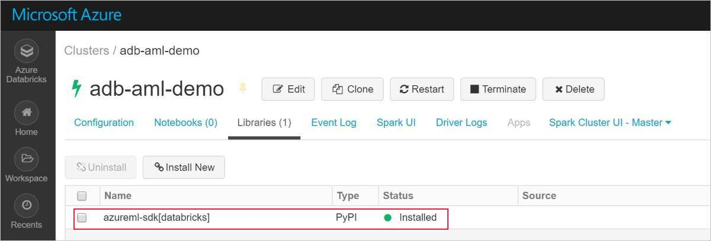
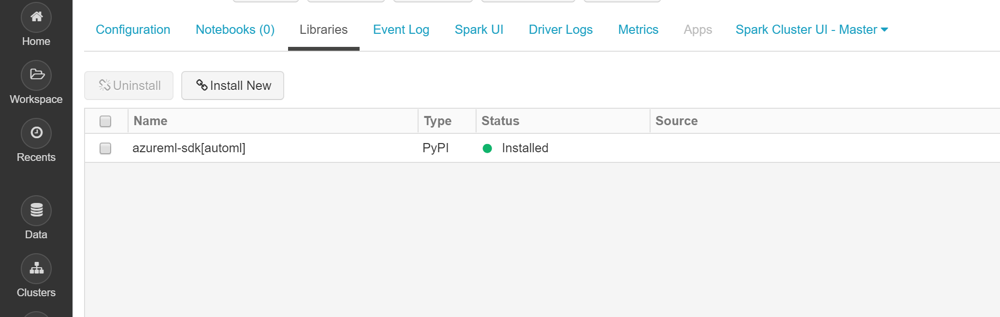

# Configure a development environment for Azure Machine Learning
[!INCLUDE [applies-to-skus](../../includes/aml-applies-to-basic-enterprise-sku.md)]

In this article, you learn how to configure a development environment to work with Azure Machine Learning. Azure Machine Learning is platform agnostic. The only hard requirement for your development environment is Python 3. An isolated environment like Anaconda or Virtualenv is also recommended.

The following table shows each development environment covered in this article, along with pros and cons.

| Environment | Pros | Cons |
| --- | --- | --- |
| [Cloud-based Azure Machine Learning compute instance (preview)](#compute-instance) | Easiest way to get started. The entire SDK is already installed in your workspace VM, and notebook tutorials are pre-cloned and ready to run. | Lack of control over your development environment and dependencies. Additional cost incurred for Linux VM (VM can be stopped when not in use to avoid charges). See [pricing details](https://azure.microsoft.com/pricing/details/virtual-machines/linux/). |
| [Local environment](#local) | Full control of your development environment and dependencies. Run with any build tool, environment, or IDE of your choice. | Takes longer to get started. Necessary SDK packages must be installed, and an environment must also be installed if you don't already have one. |
| [Azure Databricks](#aml-databricks) | Ideal for running large-scale intensive machine learning workflows on the scalable Apache Spark platform. | Overkill for experimental machine learning, or smaller-scale experiments and workflows. Additional cost incurred for Azure Databricks. See [pricing details](https://azure.microsoft.com/pricing/details/databricks/). |
| [The Data Science Virtual Machine (DSVM)](#dsvm) | Similar to the cloud-based compute instance (Python and the SDK are pre-installed), but with additional popular data science and machine learning tools pre-installed. Easy to scale and combine with other custom tools and workflows. | A slower getting started experience compared to the cloud-based compute instance. |

This article also provides additional usage tips for the following tools:

* [Jupyter Notebooks](#jupyter): If you're already using the Jupyter Notebook, the SDK has some extras that you should install.

* [Visual Studio Code](#vscode): If you use Visual Studio Code, the [Azure Machine Learning extension](https://marketplace.visualstudio.com/items?itemName=ms-toolsai.vscode-ai) includes extensive language support for Python as well as features to make working with the Azure Machine Learning much more convenient and productive.

## Prerequisites

An Azure Machine Learning workspace. To create the workspace, see [Create an Azure Machine Learning workspace](how-to-manage-workspace.md). A workspace is all you need to get started with your own [cloud-based notebook server](#compute-instance), a [DSVM](#dsvm), or [Azure Databricks](#aml-databricks).

To install the SDK environment for your [local computer](#local), [Jupyter Notebook server](#jupyter) or [Visual Studio Code](#vscode) you also need:

- Either the [Anaconda](https://www.anaconda.com/download/) or [Miniconda](https://conda.io/miniconda.html) package manager.

- On Linux or macOS, you need the bash shell.

    > [!TIP]
    > If you're on Linux or macOS and use a shell other than bash (for example, zsh) you might receive errors when you run some commands. To work around this problem, use the `bash` command to start a new bash shell and run the commands there.

- On Windows, you need the command prompt or Anaconda prompt (installed by Anaconda and Miniconda).

## <a id="compute-instance"></a>Your own cloud-based compute instance

The Azure Machine Learning [compute instance (preview)](concept-compute-instance.md) is a secure, cloud-based Azure workstation that provides data scientists with a Jupyter notebook server, JupyterLab, and a fully prepared ML environment.

There is nothing to install or configure for a compute instance.  Create one anytime from within your Azure Machine Learning workspace. Provide just a name and specify an Azure VM type. Try it now with this [Tutorial: Setup environment and workspace](tutorial-1st-experiment-sdk-setup.md).

Learn more about [compute instances](concept-compute-instance.md).

To stop incurring compute charges, [stop the compute instance](tutorial-1st-experiment-sdk-train.md#clean-up-resources).

## <a id="dsvm"></a>Data Science Virtual Machine

The DSVM is a customized virtual machine (VM) image. It's designed for data science work that's pre-configured with:

  - Packages such as TensorFlow, PyTorch, Scikit-learn, XGBoost, and the Azure Machine Learning SDK
  - Popular data science tools such as Spark Standalone and Drill
  - Azure tools such as the Azure CLI, AzCopy, and Storage Explorer
  - Integrated development environments (IDEs) such as Visual Studio Code and PyCharm
  - Jupyter Notebook Server

The Azure Machine Learning SDK works on either the Ubuntu or Windows version of the DSVM. But if you plan to use the DSVM as a compute target as well, only Ubuntu is supported.

To use the DSVM as a development environment:

1. Create a DSVM in either of the following environments:

    * The Azure portal:

        * [Create an Ubuntu Data Science Virtual Machine](https://docs.microsoft.com/azure/machine-learning/data-science-virtual-machine/dsvm-ubuntu-intro)

        * [Create a Windows Data Science Virtual Machine](https://docs.microsoft.com/azure/machine-learning/data-science-virtual-machine/provision-vm)

    * The Azure CLI:

        > [!IMPORTANT]
        > * When you use the Azure CLI, you must first sign in to your Azure subscription by using the `az login` command.
        >
        > * When you use the commands in this step, you must provide a resource group name, a name for the VM, a username, and a password.

        * To create an Ubuntu Data Science Virtual Machine, use the following command:

            ```azurecli-interactive
            # create a Ubuntu DSVM in your resource group
            # note you need to be at least a contributor to the resource group in order to execute this command successfully
            # If you need to create a new resource group use: "az group create --name YOUR-RESOURCE-GROUP-NAME --location YOUR-REGION (For example: westus2)"
            az vm create --resource-group YOUR-RESOURCE-GROUP-NAME --name YOUR-VM-NAME --image microsoft-dsvm:linux-data-science-vm-ubuntu:linuxdsvmubuntu:latest --admin-username YOUR-USERNAME --admin-password YOUR-PASSWORD --generate-ssh-keys --authentication-type password
            ```

        * To create a Windows Data Science Virtual Machine, use the following command:

            ```azurecli-interactive
            # create a Windows Server 2016 DSVM in your resource group
            # note you need to be at least a contributor to the resource group in order to execute this command successfully
            az vm create --resource-group YOUR-RESOURCE-GROUP-NAME --name YOUR-VM-NAME --image microsoft-dsvm:dsvm-windows:server-2016:latest --admin-username YOUR-USERNAME --admin-password YOUR-PASSWORD --authentication-type password
            ```

2. The Azure Machine Learning SDK is already installed on the DSVM. To use the Conda environment that contains the SDK, use one of the following commands:

    * For Ubuntu DSVM:

        ```bash
        conda activate py36
        ```

    * For Windows DSVM:

        ```bash
        conda activate AzureML
        ```

1. To verify that you can access the SDK and check the version, use the following Python code:

    ```python
    import azureml.core
    print(azureml.core.VERSION)
    ```

1. To configure the DSVM to use your Azure Machine Learning workspace, see the [Create a workspace configuration file](#workspace) section.

For more information, see [Data Science Virtual Machines](https://azure.microsoft.com/services/virtual-machines/data-science-virtual-machines/).

## <a id="local"></a>Local computer

When you're using a local computer (which might also be a remote virtual machine), create an Anaconda environment and install the SDK. Here's an example:

1. Download and install [Anaconda](https://www.anaconda.com/distribution/#download-section) (Python 3.7 version) if you don't already have it.

1. Open an Anaconda prompt and create an environment with the following commands:

    Run the following command to create the environment.

    ```bash
    conda create -n myenv python=3.7.7
    ```

    Then activate the environment.

    ```bash
    conda activate myenv
    ```

    This example creates an environment using python 3.7.7, but any specific subversions can be chosen. SDK compatibility may not be guaranteed with certain major versions (3.5+ is recommended), and it's recommended to try a different version/subversion in your Anaconda environment if you run into errors. It will take several minutes to create the environment while components and packages are downloaded.

1. Run the following commands in your new environment to enable environment-specific IPython kernels. This will ensure expected kernel and package import behavior when working with Jupyter Notebooks within Anaconda environments:

    ```bash
    conda install notebook ipykernel
    ```

    Then run the following command to create the kernel:

    ```bash
    ipython kernel install --user --name myenv --display-name "Python (myenv)"
    ```

1. Use the following commands to install packages:

    This command installs the base Azure Machine Learning SDK with notebook and `automl` extras. The `automl` extra is a large install, and can be removed from the brackets if you don't intend to run automated machine learning experiments. The `automl` extra also includes the Azure Machine Learning Data Prep SDK by default as a dependency.

    ```bash
    pip install azureml-sdk[notebooks,automl]
    ```

   > [!NOTE]
   > * If you get a message that PyYAML can't be uninstalled, use the following command instead:
   >
   >   `pip install --upgrade azureml-sdk[notebooks,automl] --ignore-installed PyYAML`
   >
   > * Starting with macOS Catalina, zsh (Z shell) is the default login shell and interactive shell. In zsh, use the following command which escapes brackets with "\\" (backslash):
   >
   >   `pip install --upgrade azureml-sdk\[notebooks,automl\]`

   It will take several minutes to install the SDK. For more information on installation options, see the [install guide](https://docs.microsoft.com/python/api/overview/azure/ml/install?view=azure-ml-py).

1. Install other packages for your machine learning experimentation.

    Use either of the following commands and replace *\<new package>* with the package you want to install. Installing packages via `conda install` requires that the package is part of the current channels (new channels can be added in Anaconda Cloud).

    ```bash
    conda install <new package>
    ```

    Alternatively, you can install packages via `pip`.

    ```bash
    pip install <new package>
    ```

### <a id="jupyter"></a>Jupyter Notebooks

Jupyter Notebooks are part of the [Jupyter Project](https://jupyter.org/). They provide an interactive coding experience where you create documents that mix live code with narrative text and graphics. Jupyter Notebooks are also a great way to share your results with others, because you can save the output of your code sections in the document. You can install Jupyter Notebooks on a variety of platforms.

The procedure in the [Local computer](#local) section installs necessary components for running Jupyter Notebooks in an Anaconda environment.

To enable these components in your Jupyter Notebook environment:

1. Open an Anaconda prompt and activate your environment.

    ```bash
    conda activate myenv
    ```

1. Clone [the GitHub repository](https://aka.ms/aml-notebooks) for a set of sample notebooks.

    ```bash
    git clone https://github.com/Azure/MachineLearningNotebooks.git
    ```

1. Launch the Jupyter Notebook server with the following command:

    ```bash
    jupyter notebook
    ```

1. To verify that Jupyter Notebook can use the SDK, create a **New** notebook, select **Python 3** as your kernel, and then run the following command in a notebook cell:

    ```python
    import azureml.core
    azureml.core.VERSION
    ```

1. If you encounter issues importing modules and receive a `ModuleNotFoundError`, ensure your Jupyter kernel is connected to the correct path for your environment by running the following code in a Notebook cell.

    ```python
    import sys
    sys.path
    ```

1. To configure the Jupyter Notebook to use your Azure Machine Learning workspace, go to the [Create a workspace configuration file](#workspace) section.

### <a id="vscode"></a>Visual Studio Code

Visual Studio Code is a very popular cross platform code editor that supports an extensive set of programming languages and tools through extensions available in the [Visual Studio marketplace](https://marketplace.visualstudio.com/vscode). The [Azure Machine Learning extension](https://marketplace.visualstudio.com/items?itemName=ms-toolsai.vscode-ai) installs the [Python extension](https://marketplace.visualstudio.com/items?itemName=ms-python.python) for coding in all types of Python environments (virtual, Anaconda, etc.). In addition, it provides convenience features for working with Azure Machine Learning resources and running Azure Machine Learning experiments all without leaving Visual Studio Code.

To use Visual Studio Code for development:

1. Install the Azure Machine Learning extension for Visual Studio Code, see [Azure Machine Learning](https://marketplace.visualstudio.com/items?itemName=ms-toolsai.vscode-ai).

    For more information, see [Use Azure Machine Learning for Visual Studio Code](tutorial-setup-vscode-extension.md).

1. Learn how to use Visual Studio Code for any type of Python development, see [Get started with Python in VSCode](https://code.visualstudio.com/docs/python/python-tutorial).

    - To select the SDK Python environment containing the SDK, open VS Code, and then select Ctrl+Shift+P (Linux and Windows) or Command+Shift+P (Mac).
        - The __Command Palette__ opens.

    - Enter __Python: Select Interpreter__, and then select the appropriate environment

1. To validate that you can use the SDK, create a new Python file (.py) that contains the following code:

    ```python
    #%%
    import azureml.core
    azureml.core.VERSION
    ```
    Run this code by clicking the "Run cell" CodeLens or simply press shift-enter.
<a name="aml-databricks"></a>

## Azure Databricks
Azure Databricks is an  Apache Spark-based environment in the Azure cloud. It provides a collaborative Notebook-based environment with CPU or GPU-based compute cluster.

How Azure Databricks works with Azure Machine Learning:
+ You can train a model using Spark MLlib and deploy the model to ACI/AKS from within Azure Databricks.
+ You can also use [automated machine learning](concept-automated-ml.md) capabilities in a special Azure ML SDK with Azure Databricks.
+ You can use Azure Databricks as a compute target from an [Azure Machine Learning pipeline](concept-ml-pipelines.md).

### Set up your Databricks cluster

Create a [Databricks cluster](https://docs.microsoft.com/azure/azure-databricks/quickstart-create-databricks-workspace-portal). Some settings apply only if you install the SDK for automated machine learning on Databricks.
**It will take few minutes to create the cluster.**

Use these settings:

| Setting |Applies to| Value |
|----|---|---|
| Cluster name |always| yourclustername |
| Databricks Runtime |always|Non-ML Runtime 6.5 (scala 2.11, spark 2.4.3) |
| Python version |always| 3 |
| Workers |always| 2 or higher |
| Worker node VM types <br>(determines max # of concurrent iterations) |Automated ML<br>only| Memory optimized VM preferred |
| Enable Autoscaling |Automated ML<br>only| Uncheck |

Wait until the cluster is running before proceeding further.

### Install the correct SDK into a Databricks library
Once the cluster is running, [create a library](https://docs.databricks.com/user-guide/libraries.html#create-a-library) to attach the appropriate Azure Machine Learning SDK package to your cluster.

1. Right-click the current Workspace folder where you want to store the library. Select **Create** > **Library**.

1. Choose **only one** option (no other SDK installation are supported)

   |SDK&nbsp;package&nbsp;extras|Source|PyPi&nbsp;Name&nbsp;&nbsp;&nbsp;&nbsp;&nbsp;&nbsp;|
   |----|---|---|
   |For Databricks| Upload Python Egg or PyPI | azureml-sdk[databricks]|
   |For Databricks -with-<br> automated ML capabilities| Upload Python Egg or PyPI | azureml-sdk[automl]|

   > [!Warning]
   > No other SDK extras can be installed. Choose only one of the preceding options [databricks] or [automl].

   * Do not select **Attach automatically to all clusters**.
   * Select  **Attach** next to your cluster name.

1. Monitor for errors until status changes to **Attached**, which may take several minutes.  If this step fails:

   Try restarting your cluster by:
   1. In the left pane, select **Clusters**.
   1. In the table, select your cluster name.
   1. On the **Libraries** tab, select **Restart**.

   Also consider:
   + In AutoML config, when using Azure Databricks add the following parameters:
       1. ```max_concurrent_iterations``` is based on number of worker nodes in your cluster.
        2. ```spark_context=sc``` is based on the default spark context.
   + Or, if you have an old SDK version, deselect it from cluster's installed libs and move to trash. Install the new SDK version and restart the cluster. If there is an issue after the restart, detach and reattach your cluster.

If install was successful, the imported library should look like one of these:

SDK for Databricks **_without_** automated machine learning


SDK for Databricks **WITH** automated machine learning


### Start exploring

Try it out:
+ While many sample notebooks are available, **only [these sample notebooks](https://github.com/Azure/MachineLearningNotebooks/blob/master/how-to-use-azureml/azure-databricks) work with Azure Databricks.**

+ Import these samples directly from your workspace. See below:


+ Learn how to [create a pipeline with Databricks as the training compute](how-to-create-your-first-pipeline.md).

## <a id="workspace"></a>Create a workspace configuration file

The workspace configuration file is a JSON file that tells the SDK how to communicate with your Azure Machine Learning workspace. The file is named *config.json*, and it has the following format:

```json
{
    "subscription_id": "<subscription-id>",
    "resource_group": "<resource-group>",
    "workspace_name": "<workspace-name>"
}
```

This JSON file must be in the directory structure that contains your Python scripts or Jupyter Notebooks. It can be in the same directory, a subdirectory named *.azureml*, or in a parent directory.

To use this file from your code, use `ws=Workspace.from_config()`. This code loads the information from the file and connects to your workspace.

You can create the configuration file in three ways:

* **Use  [ws.write_config](https://docs.microsoft.com/python/api/overview/azure/ml/intro?view=azure-ml-py)**: to write a *config.json* file. The file contains the configuration information for your workspace. You can download or copy the *config.json* to other development environments.

* **Download the file**: In the [Azure portal](https://ms.portal.azure.com), select  **Download config.json** from the **Overview** section of your workspace.

     

* **Create the file programmatically**: In the following code snippet, you connect to a workspace by providing the subscription ID, resource group, and workspace name. It then saves the workspace configuration to the file:

    ```python
    from azureml.core import Workspace

    subscription_id = '<subscription-id>'
    resource_group  = '<resource-group>'
    workspace_name  = '<workspace-name>'

    try:
        ws = Workspace(subscription_id = subscription_id, resource_group = resource_group, workspace_name = workspace_name)
        ws.write_config()
        print('Library configuration succeeded')
    except:
        print('Workspace not found')
    ```

    This code writes the configuration file to the *.azureml/config.json* file.

## Next steps

- [Train a model](tutorial-train-models-with-aml.md) on Azure Machine Learning with the MNIST dataset
- View the [Azure Machine Learning SDK for Python](https://docs.microsoft.com/python/api/overview/azure/ml/intro?view=azure-ml-py) reference
