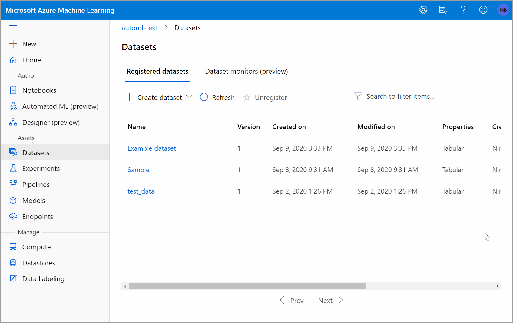

# Connect to data with the Azure Machine Learning studio

In this article, learn how to access your data with the [Azure Machine Learning studio](overview-what-is-machine-learning-studio.md). Connect to your data in storage services on Azure with [Azure Machine Learning datastores](how-to-access-data.md), and then package that data for tasks in your ML workflows with [Azure Machine Learning datasets](how-to-create-register-datasets.md).

The following table defines and summarizes the benefits of datastores and datasets. 

|Object|Description| Benefits|   
|---|---|---|
|Datastores| Securely connect to your storage service on Azure, by storing your connection information, like your subscription ID and token authorization in your [Key Vault](https://azure.microsoft.com/services/key-vault/) associated with the workspace | Because your information is securely stored, you    <li> Don't&nbsp;put&nbsp;authentication&nbsp;credentials&nbsp;or&nbsp;original&nbsp;data sources at risk. <li> No longer need to hard code them in your scripts.
|Datasets| By creating a dataset, you create a reference to the data source location, along with a copy of its metadata. With datasets you can,   <li> Access data during model training.<li> Share data and collaborate with other users.<li> Leverage open-source libraries, like pandas, for data exploration. | Because datasets are lazily evaluated, and the data remains in its existing location, you   <li>Keep a single copy of data in your storage.<li> Incur no extra storage cost <li> Don't risk unintentionally changing your original data sources.<li>Improve ML workflow performance speeds. 

To understand where datastores and datasets fit in Azure Machine Learning's overall data access workflow, see  the [Securely access data](concept-data.md#data-workflow) article.

For a code first experience, see the following articles to use the [Azure Machine Learning Python SDK](/python/api/overview/azure/ml/) to:
* [Connect to Azure storage services with datastores](how-to-access-data.md). 
* [Create Azure Machine Learning datasets](how-to-create-register-datasets.md). 

## Prerequisites

- An Azure subscription. If you don't have an Azure subscription, create a free account before you begin. Try the [free or paid version of Azure Machine Learning](https://aka.ms/AMLFree).

- Access to [Azure Machine Learning studio](https://ml.azure.com/).

- An Azure Machine Learning workspace. [Create an Azure Machine Learning workspace](how-to-manage-workspace.md).

    -  When you create a workspace, an Azure blob container and an Azure file share are automatically registered as datastores to the workspace. They're named `workspaceblobstore` and `workspacefilestore`, respectively. If blob storage is sufficient for your needs, the `workspaceblobstore` is set as the default datastore, and already configured for use. Otherwise, you need a storage account on Azure with a [supported storage type](how-to-access-data.md#matrix).
    

## Create datastores

You can create datastores from [these Azure storage solutions](how-to-access-data.md#matrix). **For unsupported storage solutions**, and to save data egress cost during ML experiments, you must [move your data](how-to-access-data.md#move) to a supported Azure storage solution. [Learn more about datastores](how-to-access-data.md). 

Create a new datastore in a few steps with the Azure Machine Learning studio.

> [!IMPORTANT]
> If your data storage account is in a virtual network, additional configuration steps are required to ensure the studio has access to your data. See [Network isolation & privacy](how-to-enable-studio-virtual-network.md) to ensure the appropriate configuration steps are applied.

1. Sign in to [Azure Machine Learning studio](https://ml.azure.com/).
1. Select **Datastores** on the left pane under **Manage**.
1. Select **+ New datastore**.
1. Complete the form to create and register a new datastore. The form intelligently updates itself based on your selections for Azure storage type and authentication type. See the [storage access and permissions section](#access-validation) to understand where to find the authentication credentials you need to populate this form.

The following example demonstrates what the form looks like when you create an **Azure blob datastore**:

## Create datasets

After you create a datastore, create a dataset to interact with your data. Datasets package your data into a lazily evaluated consumable object for machine learning tasks, like training. [Learn more about datasets](how-to-create-register-datasets.md).

There are two types of datasets, FileDataset and TabularDataset. 
[FileDatasets](how-to-create-register-datasets.md#filedataset) create references to single or multiple files or public URLs. Whereas,
[TabularDatasets](how-to-create-register-datasets.md#tabulardataset) represent your data in a tabular format. You can create TabularDatasets from .csv, .tsv, .parquet, .jsonl files, and from SQL query results.

The following steps and animation show how to create a dataset in [Azure Machine Learning studio](https://ml.azure.com).

> [!Note]
> Datasets created through Azure Machine Learning studio are automatically registered to the workspace.

To create a dataset in the studio:
1. Sign in to the [Azure Machine Learning studio](https://ml.azure.com/).
1. Select **Datasets** in the **Assets** section of the left pane.
1. Select **Create Dataset** to choose the source of your dataset. This source can be local files, a datastore, public URLs, or [Azure Open Datasets](../open-datasets/how-to-create-azure-machine-learning-dataset-from-open-dataset.md).
1. Select **Tabular** or **File** for Dataset type.
1. Select **Next** to open the **Datastore and file selection** form. On this form you select where to keep your dataset after creation, as well as select what data files to use for your dataset.
    1. Enable skip validation if your data is in a virtual network. Learn more about [virtual network isolation and privacy](how-to-enable-studio-virtual-network.md).
    1. For Tabular datasets, you can specify a 'timeseries' trait to enable time related operations on your dataset. Learn how to [add the timeseries trait to your dataset](how-to-monitor-datasets.md#studio-dataset).
1. Select **Next** to populate the **Settings and preview** and **Schema** forms; they are intelligently populated based on file type and you can further configure your dataset prior to creation on these forms. 
1. Select **Next** to review the **Confirm details** form. Check your selections and create an optional data profile for your dataset. Learn more about [data profiling](#profile).
1. Select **Create** to complete your dataset creation.

### Data profile and preview

After you create your dataset, verify you can view the profile and preview in the studio with the following steps. 

1. Sign in to the [Azure Machine Learning studio](https://ml.azure.com/)
1. Select **Datasets** in the **Assets** section of the left pane.
1. Select the name of the dataset you want to view. 
1. Select the **Explore** tab. 
1. Select the **Preview** or **Profile** tab. 

You can get a vast variety of summary statistics across your data set to verify whether your data set is ML-ready. For non-numeric columns, they include only basic statistics like min, max, and error count. For numeric columns, you can also review their statistical moments and estimated quantiles. 

Specifically, Azure Machine Learning dataset's data profile includes:

>[!NOTE]
> Blank entries appear for features with irrelevant types.

|Statistic|Description
|------|------
|Feature| Name of the column that is being summarized.
|Profile| In-line visualization based on the type inferred. For example, strings, booleans, and dates will have value counts, while decimals (numerics) have approximated histograms. This allows you to gain a quick understanding of the distribution of the data.
|Type distribution| In-line value count of types within a column. Nulls are their own type, so this visualization is useful for detecting odd or missing values.
|Type|Inferred type of the column. Possible values include: strings, booleans, dates, and decimals.
|Min| Minimum value of the column. Blank entries appear for features whose type does not have an inherent ordering (like, booleans).
|Max| Maximum value of the column. 
|Count| Total number of missing and non-missing entries in the column.
|Not missing count| Number of entries in the column that are not missing. Empty strings and errors are treated as values, so they will not contribute to the "not missing count."
|Quantiles| Approximated values at each quantile to provide a sense of the distribution of the data.
|Mean| Arithmetic mean or average of the column.
|Standard deviation| Measure of the amount of dispersion or variation of this column's data.
|Variance| Measure of how far spread out this column's data is from its average value. 
|Skewness| Measure of how different this column's data is from a normal distribution.
|Kurtosis| Measure of how heavily tailed this column's data is compared to a normal distribution.

## Storage access and permissions

To ensure you securely connect to your Azure storage service, Azure Machine Learning  requires that you  have permission to access the corresponding data storage. This access depends on the authentication credentials used to register the datastore.

### Virtual network

If your data storage account is in a **virtual network**, additional configuration steps are required to ensure Azure Machine Learning has access to your data. See [Network isolation & privacy](how-to-enable-studio-virtual-network.md) to ensure the appropriate configuration steps are applied when you create and register your datastore.  

### Access validation

**As part of the initial datastore creation and registration process**, Azure Machine Learning automatically validates that the underlying storage service exists and the user provided principal (username, service principal, or SAS token) has access to the specified storage.

**After datastore creation**, this validation is only performed for methods that require access to the underlying storage container, **not** each time datastore objects are retrieved. For example, validation happens if you want to download files from your datastore; but if you just want to change your default datastore, then validation does not happen.

To authenticate your access to the underlying storage service, you can provide either your account key, shared access signatures (SAS) tokens, or service principal according to the datastore type you want to create. The [storage type matrix](how-to-access-data.md#matrix) lists the supported authentication types that correspond to each datastore type.

You can find account key, SAS token, and service principal information on your [Azure portal](https://portal.azure.com).

* If you plan to use an account key or SAS token for authentication, select **Storage Accounts** on the left pane, and choose the storage account that you want to register.
  * The **Overview** page provides information such as the account name, container, and file share name.
      1. For account keys, go to **Access keys** on the **Settings** pane.
      1. For SAS tokens, go to **Shared access signatures** on the **Settings** pane.

* If you plan to use a [service principal](../active-directory/develop/howto-create-service-principal-portal.md) for authentication, go to your **App registrations** and select which app you want to use.
    * Its corresponding **Overview** page will contain required information like tenant ID and client ID.

> [!IMPORTANT]
> * If you need to change your access keys for an Azure Storage account (account key or SAS token), be sure to sync the new credentials with your workspace and the datastores connected to it. Learn how to [sync your updated credentials](how-to-change-storage-access-key.md).    
> * If you unregister and re-register a datastore with the same name, and it fails, the Azure Key Vault for your workspace may not have soft-delete enabled. By default, soft-delete is enabled for the key vault instance created by your workspace, but it may not be enabled if you used an existing key vault or have a workspace created prior to October 2020. For information on how to enable soft-delete, see [Turn on Soft Delete for an existing key vault]( https://docs.microsoft.com/azure/key-vault/general/soft-delete-change#turn-on-soft-delete-for-an-existing-key-vault).”

### Permissions

For Azure blob container and Azure Data Lake Gen 2 storage, make sure your authentication credentials  have **Storage Blob Data Reader** access. Learn more about [Storage Blob Data Reader](../role-based-access-control/built-in-roles.md#storage-blob-data-reader). An account SAS token defaults to no permissions. 
* For data **read access**, your authentication credentials must have a minimum of list and read permissions for containers and objects. 

* For data **write access**, write and add permissions also are required.

## Train with datasets

Use your datasets in your machine learning experiments for training ML models. [Learn more about how to train with datasets](how-to-train-with-datasets.md)

## Next steps

* [A step-by-step example of training with TabularDatasets and automated machine learning](tutorial-first-experiment-automated-ml.md).

* [Train a model](how-to-set-up-training-targets.md).

* For more dataset training examples, see the [sample notebooks](https://github.com/Azure/MachineLearningNotebooks/tree/master/how-to-use-azureml/work-with-data/).
