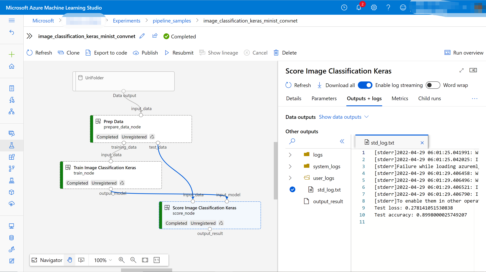

# Create and run machine learning pipelines using components with the Azure Machine Learning SDK v2 (Preview)

In this article, you learn how to build an [Azure Machine Learning pipeline](concept-ml-pipelines.md) using Python SDK v2 to complete an image classification task. We'll split this machine learning task into three steps: prepare data for training and scoring, train an image classification model and score the model. Machine learning pipelines optimize your workflow with speed, portability, and reuse, so you can focus on machine learning instead of infrastructure and automation.  

The example trains a small [Keras](https://keras.io/) convolutional neural network to classify images in the [Fashion MNIST](https://github.com/zalandoresearch/fashion-mnist) dataset. 

In this article, you complete the following tasks:

> [!div class="checklist"]
> * Configure credential 
> * Configure workspace 
> * Provision a ComputeTarget to do the work
> * Prepare input data for the pipeline job
> * Create a component to prepare the data for training and scoring
> * Create a component to train a neural network model using training data
> * Create a component to score the model using test data
> * Compose a Pipeline from the components
> * Submit the pipeline job
> * Review the output of the components and the trained neural network
> * Register the component for further reuse and sharing within workspace

If you don't have an Azure subscription, create a free account before you begin. Try the [free or paid version of Azure Machine Learning](https://azure.microsoft.com/free/) today.

## Prerequisites

* Complete the [Quickstart: Get started with Azure Machine Learning](quickstart-create-resources.md) if you don't already have an Azure Machine Learning workspace.
* A Python environment in which you've installed Azure Machine Learning Python SDK v2 - [install instructions](TOOD:notebook_link) - check the getting started section. This environment is for defining and controlling your Azure Machine Learning resources and is separate from the environment used at runtime for training.

> [!Important]
> Currently, the most recent Python release compatible with `azureml-pipeline` is Python 3.8. If you've difficulty installing the `azureml-pipeline` package, ensure that `python --version` is a compatible release. Consult the documentation of your Python virtual environment manager (`venv`, `conda`, and so on) for instructions.

## Start an interactive Python session

This article uses the Python SDK for Azure ML to create and control an Azure Machine Learning pipeline. The article assumes that you'll be running the code snippets interactively in either a Python REPL environment or a Jupyter notebook.

This article is based on the `image_classification_keras_minist_convnet.ipynb` notebook found in the `sdk/jobs/pipelines/2e_image_classification_keras_minist_convnet` directory of the [AzureML Examples](https://github.com/azure/azureml-examples) repository. The source code for the components themselves is in the `keras-mnist-fashion` subdirectory.


## Import types

Import all the Azure Machine Learning types that you'll need for this article:

TODO: update all required packages when lockdown
TODO: update link
[!notebook-python[] (~~/azureml-examples/sdk/jobs/pipelines/2e_image_classification_keras_minist_convnet/image_classification_keras_minist_convnet.ipynb?name=required-library)]

```python
from azure.ml import MLClient, dsl
from azure.ml.entities import load_component
from azure.identity import DefaultAzureCredential, InteractiveBrowserCredential
from azure.ml import Input

```

## Get access to your workspace

### Configure credential

We'll use `DefaultAzureCredential` to get access to workspace. `DefaultAzureCredential` to get access to workspace.

`DefaultAzureCredential` should be capable of handling most Azure SDK authentication scenarios. 

Reference for more available credentials if it doesn't work for you: [configure credential example](../../configuration.ipynb), [azure-identity reference doc](https://docs.microsoft.com/en-us/python/api/azure-identity/azure.identity?view=azure-python).


TODO: update link
[!notebook-python[] (~/azureml-examples/sdk/jobs/pipelines/2e_image_classification_keras_minist_convnet/image_classification_keras_minist_convnet.ipynb?name=credential)]

```python
from azure.identity import DefaultAzureCredential, InteractiveBrowserCredential

try:
    credential = DefaultAzureCredential()
    # Check if given credential can get token successfully.
    credential.get_token('https://management.azure.com/.default')
except Exception as ex:
    # Fall back to InteractiveBrowserCredential in case DefaultAzureCredential not work
    credential = InteractiveBrowserCredential()
```

### Get a handle to a workspace with compute

Create a `MLClient` object to manage Azure Machine Learning services.

TODO: update link
[!notebook-python[] (~/azureml-examples/sdk/jobs/pipelines/2e_image_classification_keras_minist_convnet/image_classification_keras_minist_convnet.ipynb?name=workspace)]

```python
# Get a handle to workspace
ml_client = MLClient.from_config(credential=credential)

# Retrieve an already attached Azure Machine Learning Compute
cpu_compute_target = "cpu-cluster"
print(ml_client.compute.get(cpu_compute_target))
gpu_compute_target = 'gpu-cluster'
print(ml_client.compute.get(gpu_compute_target))
```

> [!IMPORTANT]
> This code snippet expects the workspace configuration json file to be saved in the current directory or its parent. For more information on creating a workspace, see [Create and manage Azure Machine Learning workspaces](how-to-manage-workspace.md). For more information on saving the configuration to file, see [Create a workspace configuration file](how-to-configure-environment.md#workspace).


### Prepare input data for your pipeline job

Fashion-MNIST is a dataset of fashion images divided into 10 classes. Each image is a 28x28 grayscale image and there are 60,000 training and 10,000 test images. As an image classification problem, Fashion-MNIST is harder than the classic MNIST handwritten digit database. It's distributed in the same compressed binary form as the original [handwritten digit database](http://yann.lecun.com/exdb/mnist/) .

To define the input data of a job that references the Web-based data, run:

TODO: update link
[!notebook-python[] (~/azureml-examples/sdk/jobs/pipelines/2e_image_classification_keras_minist_convnet/image_classification_keras_minist_convnet.ipynb?name=define-input)]

```python
from azure.ml.entities import Input

fashion_ds = JobInput(path="wasbs://demo@data4mldemo6150520719.blob.core.windows.net/mnist-fashion/")
```

By defining a `Input`, you create a reference to the data source location. The data remains in its existing location, so no extra storage cost is incurred.

## Create components for building pipeline

The image classification task can be split into three steps: prepare data, train model and score model.

[Azure Machine Learning component](concept-component.md) is a self-contained piece of code that does one step in a machine learning pipeline. In this article, you'll create three components for the image classification project:

- Prepare data for training and test
- Train a neural networking for image classification using training data
- Score the model using test data

### Create the data-preparation component

The code that you've executed so far has create and controlled Azure resources. Now it's time to write code that does the first component. 

The first component in this pipeline will convert the compressed data files of `fashion_ds` into two csv files, one for training and the other for scoring. You'll use python function to define this component.

If you're following along with the example in the [TODO: AzureML Examples repo](https://github.com/Azure/azureml-examples/tree/main/sdk/jobs/pipelines/2e_image_classification_keras_minist_convnet), the source files are already available in `prep/` folder. This folder contains three files to construct the component: `prep.py`, which contains the actual logic to prepare data, `prep_dsl_component.py`, which defines the interface of the component and imports the function in `prep.py`, and `conda.yaml`, which defines the run-time environment of the component.

#### Get a script containing execution logic

Let's see `prep.py` first. It contains a normal python function, which performs the prepare data logic.

TODO: check link
:::code language="python" source="~/azureml-examples-main/sdk/jobs/pipelines/2e_image_classification_keras_minist_convnet/prep/prep.py":::

```python
# Converts MNIST-formatted files at the passed-in input path to training data output path and test data output path
import os


def convert(imgf, labelf, outf, n):
    f = open(imgf, "rb")
    l = open(labelf, "rb")
    o = open(outf, "w")

    f.read(16)
    l.read(8)
    images = []

    for i in range(n):
        image = [ord(l.read(1))]
        for j in range(28 * 28):
            image.append(ord(f.read(1)))
        images.append(image)

    for image in images:
        o.write(",".join(str(pix) for pix in image) + "\n")
    f.close()
    o.close()
    l.close()


def prep(input_path, output_path_1, output_path_2):
    
    convert(
        os.path.join(input_path, "train-images-idx3-ubyte"),
        os.path.join(input_path, "train-labels-idx1-ubyte"),
        os.path.join(output_path_1, "mnist_train.csv"),
        60000,
    )
    convert(
        os.path.join(input_path, "t10k-images-idx3-ubyte"),
        os.path.join(input_path, "t10k-labels-idx1-ubyte"),
        os.path.join(output_path_2, "mnist_test.csv"),
        10000,
    )
```

The `prep()` function in `prep.py` takes three arguments: `input_path` is input data path, and `output_path_1` and `output_path_2` are output data paths for training data and test data. It converts the data from `input_path` into a training data csv to `output_path_1` and a test data csv to `output_path_2`.

#### Define component using python function

After defining the python function successfully, you can use @dsl.command_component in Azure Machine Learning SDK v2 to wrap your function as a component, which can be used in AML pipelines.

TODO: check link
:::code language="python" source="~/azureml-examples-main/sdk/jobs/pipelines/2e_image_classification_keras_minist_convnet/prep/prep_dsl_component.py":::

```python
from pathlib import Path
from azure.ml import dsl, Input, Output
from azure.ml.entities import Environment

conda_env = Environment(
    conda_file=Path(__file__).parent / "conda.yaml",
    image="mcr.microsoft.com/azureml/openmpi3.1.2-ubuntu18.04"
)

@dsl.command_component(
    name="prep_data",
    version="1",
    display_name="Prep Data",
    description="Convert data to CSV file, and split to training and test data",
    environment=conda_env,
)
def prep(
    input_data: Input,
    training_data: Output,
    test_data: Output,
):
    # Avoid dependency issue, execution logic is in prep.py file
    from prep import prep
    prep(input_data, training_data, test_data)

```

The code above define a component with display name `Prep Data` using `@dsl.command_component`:

* `name` is the unique identifier of the component.
* `version` is the current version of the component. A component can have multiple versions.
* `display_name` is a friendly display name of the component in UI, which isn't unique.
* `description` usually describes what task this component can complete.
* `environment` specifies the run-time environment for this component. The environment of this component specifies a docker image and refers to the `conda.yaml` file.
* The `prep` function defines one input for `input_data` and two outputs for `training_data` and `test_data`. The execution logic of this component is from `prep` function in `prep.py` above.

#### Specify component run-time environment

You'll need to modify the runtime environment in which your component runs. 

```python
conda_env = Environment(
    conda_file=Path(__file__).parent / "conda.yaml",
    image="mcr.microsoft.com/azureml/openmpi3.1.2-ubuntu18.04"
)
```

The above code creates an `Environment` class represents the runtime environment in which the component runs.

The `conda.yaml` file contains all packages used for the component like following:

TODO: check link
:::code language="python" source="~/azureml-examples-main/sdk/jobs/pipelines/2e_image_classification_keras_minist_convnet/prep/conda.yaml":::

```yaml
name: imagekeras_train_conda_env
channels:
  - defaults
dependencies:
  - python=3.7.11
  - pip=20.0
  - pip:
    # change this when stable version release
    - --extra-index-url=https://azuremlsdktestpypi.azureedge.net/azureml-v2-cli-e2e-test/60864551
    - azure-ml==0.0.60864551
    - azureml-mlflow
    - tensorflow==2.7.0
    - numpy==1.21.4
    - scikit-learn==1.0.1
    - pandas==1.3.4
    - matplotlib==3.2.2
```

Now, you've prepared all source files for the `Prep Data` component.


### Create the train-model component

In this section, you'll create a component for training the image classification model.

If you're following along with the example in the [TODO: AzureML Examples repo](https://github.com/Azure/azureml-examples/tree/main/sdk/jobs/pipelines/2e_image_classification_keras_minist_convnet), the source files are already available in `train/` folder. This folder contains three files to construct the component: `train.py` which contains the actual logic to train model, `train_dsl_component.py` which defines the interface of the component and imports the function in `train.py`, and `conda.yaml` which defines the run-time environment of the component.

#### Get a script containing execution logic

The `train.py` file contains a normal python function, which performs the training model logic.

TODO: check link
:::code language="python" source="~/azureml-examples-main/sdk/jobs/pipelines/2e_image_classification_keras_minist_convnet/train/train.py":::

```python
from tensorflow import keras
from keras.models import Sequential
from keras.layers import Dense, Dropout, Flatten
from keras.layers import Conv2D, MaxPooling2D
from tensorflow.keras.layers import BatchNormalization
from tensorflow.keras.utils import to_categorical
from keras.callbacks import Callback

import argparse
from pathlib import Path
import numpy as np
import pandas as pd
import os
import matplotlib.pyplot as plt
from sklearn.model_selection import train_test_split
import mlflow

# Get input file
def get_file(f):

    f = Path(f)
    if f.is_file():
        return f
    else:
        files = list(f.iterdir())
        if len(files) == 1:
            return files[0]
        else:
            raise Exception("********This path contains more than one file*******")

def train(train_input, model_output, epochs):

    train_file = get_file(train_input)
    data_train = pd.read_csv(train_file, header=None)
    X = np.array(data_train.iloc[:, 1:])
    y = to_categorical(np.array(data_train.iloc[:, 0]))

    img_rows, img_cols = 28, 28
    input_shape = (img_rows, img_cols, 1)

    # Split validation data to optimiza classifier during training
    X_train, X_val, y_train, y_val = train_test_split(X, y, test_size=0.2, random_state=13)

    X_train = (
        X_train.reshape(X_train.shape[0], img_rows, img_cols, 1).astype("float32") / 255
    )

    X_val = X_val.reshape(X_val.shape[0], img_rows, img_cols, 1).astype("float32") / 255

    batch_size = 256
    num_classes = 10
    epochs = epochs

    # Construct neuron network
    model = Sequential()
    model.add(
        Conv2D(
            32,
            kernel_size=(3, 3),
            activation="relu",
            kernel_initializer="he_normal",
            input_shape=input_shape,
        )
    )
    model.add(MaxPooling2D((2, 2)))
    model.add(Dropout(0.25))
    model.add(Conv2D(64, (3, 3), activation="relu"))
    model.add(MaxPooling2D(pool_size=(2, 2)))
    model.add(Dropout(0.25))
    model.add(Conv2D(128, (3, 3), activation="relu"))
    model.add(Dropout(0.4))
    model.add(Flatten())
    model.add(Dense(128, activation="relu"))
    model.add(Dropout(0.3))
    model.add(Dense(num_classes, activation="softmax"))

    model.compile(
        loss=keras.losses.categorical_crossentropy,
        optimizer=keras.optimizers.Adam(),
        metrics=["accuracy"],
    )

    # Log metrics
    class LogRunMetrics(Callback):
        # callback at the end of every epoch
        def on_epoch_end(self, epoch, log):
            # log a value repeated which creates a list
            mlflow.log_metric("Loss", log["loss"])
            mlflow.log_metric("Accuracy", log["accuracy"])


    history = model.fit(
        X_train,
        y_train,
        batch_size=batch_size,
        epochs=epochs,
        verbose=1,
        validation_data=(X_val, y_val),
        callbacks=[LogRunMetrics()],
    )

    # Log an image for training loss and accuracy
    fig = plt.figure(figsize=(6, 3))
    plt.title("Fashion MNIST with Keras ({} epochs)".format(epochs), fontsize=14)
    plt.plot(history.history["accuracy"], "b-", label="Accuracy", lw=4, alpha=0.5)
    plt.plot(history.history["loss"], "r--", label="Loss", lw=4, alpha=0.5)
    plt.legend(fontsize=12)
    plt.grid(True)
    mlflow.log_figure(fig, "Loss v.s. Accuracy.png")

    # Output model file
    model.save(model_output+'/image_classification_model.h5')
```

The `train()` function in `train.py` takes three arguments: `train_input` is input data path, and `model_output` is the output path for the trained model, and `epochs` specifies the epochs during training. It trains an image classification model using keras.

#### Define component using python function

After defining the python function successfully, you can use @dsl.command_component in Azure Machine Learning SDK v2 to wrap your function as a component which can be used in AML pipelines.

TODO: check link
:::code language="python" source="~/azureml-examples-main/sdk/jobs/pipelines/2e_image_classification_keras_minist_convnet/train/train_dsl_component.py":::

```python
import os
from pathlib import Path
from azure.ml import dsl, Input, Output
from azure.ml.entities import Environment

conda_env = Environment(
    conda_file=Path(__file__).parent / "conda.yaml",
    image="mcr.microsoft.com/azureml/openmpi3.1.2-ubuntu18.04"
)

@dsl.command_component(
    name="train_image_classification_keras",
    version="1",
    display_name="Train Image Classification Keras",
    description="train image classification with keras",
    environment=conda_env,
)
def keras_train(
    input_data: Input,
    output_model: Output,
    epochs=10,
):
    # avoid dependency issue, execution logic is in prep.py file
    from train import train
    train(input_data, output_model, epochs)

```

The code above define a component with display name `Train Image Classification Keras` using `@dsl.command_component`:

* The `keras_train` function defines one input `input_data` where training data comes from, one input `epochs` specifying epochs during training, and one outputs `output_model` where outputs the model file. The execution logic of this component is from `train` function in `train.py` above.

#### Specify component run-time environment

The train-model component has a slightly more complex configuration than the prep-data component. The conda.yaml is like following:

TODO: check link
:::code language="yaml" source="~/azureml-examples-main/sdk/jobs/pipelines/2e_image_classification_keras_minist_convnet/train/conda.yaml":::

```yaml
name: imagekeras_train_conda_env
channels:
  - defaults
dependencies:
  - python=3.7.11
  - pip=20.0
  - pip:
    # change this when stable version release
    - --extra-index-url=https://azuremlsdktestpypi.azureedge.net/azureml-v2-cli-e2e-test/60864551
    - azure-ml==0.0.60864551
    - azureml-mlflow
    - tensorflow==2.7.0
    - numpy==1.21.4
    - scikit-learn==1.0.1
    - pandas==1.3.4
    - matplotlib==3.2.2
```

Now, you've prepared all source files for the `Train Image Classification Keras` component.


### Create the score-model component

In this section, other than the previous components, you'll create a component to score the trained model via Yaml and script.

If you're following along with the example in the [TODO: AzureML Examples repo](https://github.com/Azure/azureml-examples/tree/main/sdk/jobs/pipelines/2e_image_classification_keras_minist_convnet), the source files are already available in `score/` folder. This folder contains two files to construct the component: `score.py` which contains the source code of the component, `score.yaml` which defines the interface and other details of the component, and `conda.yaml` which defines the run-time environment of the component.

#### Get a script containing execution logic

The `score.py` file contains a normal python function, which performs the training model logic.

TODO: check link
:::code language="python" source="~/azureml-examples-main/sdk/jobs/pipelines/2e_image_classification_keras_minist_convnet/score/score.py":::

```python
from tensorflow import keras
from keras.models import Sequential
from keras.layers import Dense, Dropout, Flatten
from keras.layers import Conv2D, MaxPooling2D
from tensorflow.keras.layers import BatchNormalization
from tensorflow.keras.utils import to_categorical
from keras.callbacks import Callback
from keras.models import load_model

import argparse
from pathlib import Path
import numpy as np
import pandas as pd
import os
import matplotlib.pyplot as plt
from sklearn.model_selection import train_test_split
import mlflow


def get_file(f):

    f = Path(f)
    if f.is_file():
        return f
    else:
        files = list(f.iterdir())
        if len(files) == 1:
            return files[0]
        else:
            raise Exception("********This path contains more than one file*******")

def parse_args():
    # setup argparse
    parser = argparse.ArgumentParser()

    # add arguments
    parser.add_argument(
        "--input_data", type=str, help="path containing data for scoring"
    )
    parser.add_argument(
        "--input_model", type=str, default="./", help="input path for model"
    )    

    parser.add_argument(
        "--output_result", type=str, default="./", help="output path for model"
    )

    # parse args
    args = parser.parse_args()

    # return args
    return args

def score(input_data, input_model, output_result):

    test_file = get_file(input_data)
    data_test = pd.read_csv(test_file, header=None)

    img_rows, img_cols = 28, 28
    input_shape = (img_rows, img_cols, 1)

    # Read test data
    X_test = np.array(data_test.iloc[:, 1:])
    print("*******************X_test**************************")
    print(X_test)
    y_test = to_categorical(np.array(data_test.iloc[:, 0]))
    X_test = X_test.reshape(X_test.shape[0], img_rows, img_cols, 1).astype("float32") / 255
    print("*******************X_test reshape**************************")
    print(X_test)

    # Load model
    files=[f for f in os.listdir(input_model) if f.endswith(".h5")]
    print(input_model)
    print(files)
    model = load_model(input_model+'/'+files[0])

    # Log metrics of the model
    eval = model.evaluate(X_test, y_test, verbose=0)

    mlflow.log_metric("Final test loss", eval[0])
    print("Test loss:", eval[0])

    mlflow.log_metric("Final test accuracy", eval[1])
    print("Test accuracy:", eval[1])


    # Score model using test data
    y_predict = model.predict(X_test)
    print("*******************y_predict**************************")
    print(type(y_predict))
    print(y_predict)
    y_result = np.argmax(y_predict, axis=1)
    print("*******************y_result**************************")
    print(type(y_result))
    print(y_result)

    # Output result
    np.savetxt(output_result+'/predict_result.csv', y_result, delimiter=',')
  

def main(args):
    score(args.input_data, args.input_model, args.output_result)

# run script
if __name__ == "__main__":
    # parse args
    args = parse_args()

    # call main function
    main(args)
```

The code in score.py takes three command-line arguments: `input_data`, `input_model` and `output_result`. The program score the input model using input data and then output the scoring result.

#### Define component via Yaml

In this section you'll learn to create a component specification in the valid YAML component specification format. This file specifies the following information:

- Metadata: name, display_name, version, type, and so on.
- Interface: inputs and outputs
- Command, code, & environment: The command, code, and environment used to run the component

TODO: check link
:::code language="python" source="~/azureml-examples-main/sdk/jobs/pipelines/2e_image_classification_keras_minist_convnet/score/score.yaml":::

```yaml
$schema: https://azuremlschemas.azureedge.net/latest/commandComponent.schema.json
type: command

name: score_image_classification_keras
display_name: Score Image Classification Keras
inputs:
  input_data: 
    type: uri_folder
  input_model:
    type: uri_folder
outputs:
  output_result:
    type: uri_folder
code: ./
command: python score.py --input_data ${{inputs.input_data}} --input_model ${{inputs.input_model}} --output_result ${{outputs.output_result}}
environment:
  conda_file: ./conda.yaml
  image: mcr.microsoft.com/azureml/openmpi3.1.2-ubuntu18.04

```

`name` is the unique identifier of the component. Its display name is `Score Image Classification Keras`. This component has two inputs and one output. The source code path of it's defined in the `code` section and when the component is run in cloud, all files from that path will be uploaded as the snapshot of this component. The `command` section specifies the command to execute while running this component. The `environment` section contains a docker image and a conda yaml file.

#### Specify component run-time environment

The score component uses the same image and conda.yaml file as the train component.

TODO: check link
:::code language="yaml" source="~/azureml-examples-main/sdk/jobs/pipelines/2e_image_classification_keras_minist_convnet/train/conda.yaml":::


## Load components to build pipeline

For prep-data component and train-model component defined by python function, you can import the component just like normal python functions.

TODO: update link
[!notebook-python[] (~~/azureml-examples/sdk/jobs/pipelines/2e_image_classification_keras_minist_convnet/image_classification_keras_minist_convnet.ipynb?name=load-from-dsl-component)]

```python
# load component function from dsl component python file
from prep.prep_dsl_component import prep
from train.train_dsl_component import keras_train

# print hint of components
help(prep)
help(keras_train)
```

For score component defined by yaml, you can use `load_component()` function to load.

TODO: update link
[!notebook-python[] (~~/azureml-examples/sdk/jobs/pipelines/2e_image_classification_keras_minist_convnet/image_classification_keras_minist_convnet.ipynb?name=load-from-yaml)]

```python
# load component function from yaml
keras_score = load_component(yaml_file='./score/score.yaml')
```

## Build and submit the pipeline

Now that you've created and loaded all components to build the pipeline. You can compose them into a pipeline:

TODO: update link
[!notebook-python[] (~~/azureml-examples/sdk/jobs/pipelines/2e_image_classification_keras_minist_convnet/image_classification_keras_minist_convnet.ipynb?name=build-pipeline)]

```python
# define a pipeline containing 3 nodes: Prepare data node, train node, and score node
@dsl.pipeline(
    description='E2E image classification pipeline with keras',
    default_compute=cpu_compute_target,
)
def image_classification_keras_minist_convnet():

    prepare_data_node = prep(input_data=fashion_ds)

    train_node = keras_train(input_data=prepare_data_node.outputs.training_data)
    train_node.compute = gpu_compute_target

    score_node = keras_score(input_data=prepare_data_node.outputs.test_data, input_model=train_node.outputs.output_model)

# create a pipeline
pipeline = image_classification_keras_minist_convnet()
```

The pipeline has a default compute `cpu_compute_target`, which means if you don't specify compute for a specific node, that node will run on the default compute.

The pipeline contains three nodes, prepare_data_node, train_node and score_node. The `input_data` of train_node is from the `training_data` output of the prepare_data_node. The `input_data` of score_node is from the `test_data` output of prepare_data_node, and the `input_model` is from the `output_model` of train_node. Since train_node will train a CNN model, you can specify its compute as the gpu_compute_target, which can improve the training performance.

Now you've defined the pipeline, you can submit to your workspace.

TODO: update link
[!notebook-python[] (~~/azureml-examples/sdk/jobs/pipelines/2e_image_classification_keras_minist_convnet/image_classification_keras_minist_convnet.ipynb?name=submit-pipeline)]

```python
pipeline_job = ml_client.jobs.create_or_update(pipeline, experiment_name='pipeline_samples')
pipeline_job
```

The code above submit this image classification pipeline job to experiment called `pipeline_samples`. It will auto create the experiment if not exists.

The call to `pipeline_job`produces output similar to:

The call to `submit` the `Experiment` completes quickly, and produces output similar to:

| Experiment | Name | Type | Status | Details Page |
| --- | ---- | ----------- | -------------- | ------------- |
| pipeline_samples | sharp_pipe_4gvqx6h1fb | pipeline | Preparing | Link to Azure Machine Learning studio |

You can monitor the pipeline run by opening the link or you can block until it completes by running:

TODO: update link
[!notebook-python[] (~~/azureml-examples/sdk/jobs/pipelines/2e_image_classification_keras_minist_convnet/image_classification_keras_minist_convnet.ipynb?name=stream-pipeline)]

```python
ml_client.jobs.stream(pipeline_job.name)
```

> [!IMPORTANT]
> The first pipeline run takes roughly *15 minutes*. All dependencies must be downloaded, a Docker image is created, and the Python environment is provisioned and created. Running the pipeline again takes significantly less time because those resources are reused instead of created. However, total run time for the pipeline depends on the workload of your scripts and the processes that are running in each pipeline step.

### Checkout outputs and debug your pipeline in UI

You can open the `Link to Azure Machine LEarning studio`, which is the job detail page of your pipeline. You will see the pipeline graph like following. 



You can check the logs and outputs of each component by right clicking the component, or select the component to open its detail pane. To learn more about how to debug your pipeline in UI, you can refer to [this article](how-to-use-pipeline-ui.md).

## (Optional) Register components to workspace

In the previous section, you have built a pipeline using three components to E2E complete an image classification task. You can also register these components to your workspace so that they can be shared and resued within the workspace.

TODO: update link
[!notebook-python[] (~~/azureml-examples/sdk/jobs/pipelines/2e_image_classification_keras_minist_convnet/image_classification_keras_minist_convnet.ipynb?name=register component)]

```python
try:
    # try get back the dsl.command_component defined component
    prep = ml_client.components.get(name="prep_data", version="1")
except:
    # if not exists, register component using following code
    prep = ml_client.components.create_or_update(prep)

# list all components registered in workspace
for c in ml_client.components.list():
    print(c)
```

Using `ml_client.components.get()`, you can get a registered component by name and version. Using `ml_client.compoennts.create_or_update()`, you can register a component previously loaded from python function or yaml.

## Next steps

For more examples of how to build pipelines by using the machine learning SDK, see the [example repository](https://github.com/Azure/azureml-examples/sdk/jobx/pipelines).

For how to transform your original script to component, see [TODO: how to productionize your script](yijun's-doc).
