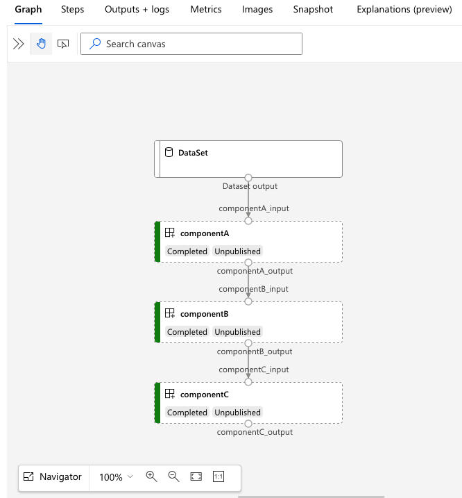
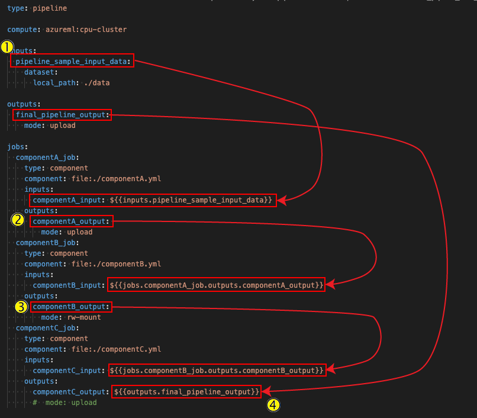
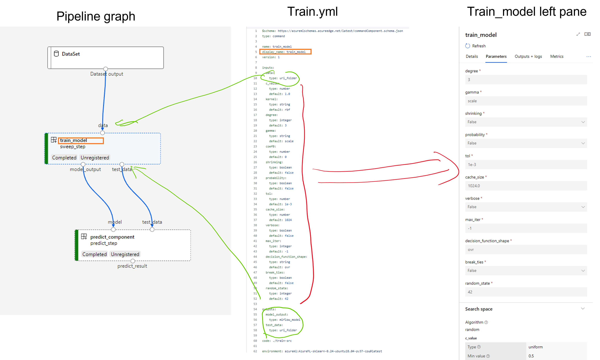

# Create and run machine learning pipelines using components with the Azure Machine Learning CLI (Preview)

[!INCLUDE [cli v2](../../includes/machine-learning-cli-v2.md)]
[!INCLUDE [cli v2 how to update](../../includes/machine-learning-cli-v2-update-note.md)]

In this article, you learn how to create and run [machine learning pipelines](concept-ml-pipelines.md) by using the Azure CLI and Components (for more, see [What is an Azure Machine Learning component?](concept-component.md)). You can [create pipelines without using components](how-to-train-cli.md#build-a-training-pipeline), but components offer the greatest amount of flexibility and reuse. AzureML Pipelines may be defined in YAML and run from the CLI, authored in Python, or composed in AzureML Studio Designer with a drag-and-drop UI. This document focuses on the CLI.

[!INCLUDE [preview disclaimer](../../includes/machine-learning-preview-generic-disclaimer.md)]

## Prerequisites

* If you don't have an Azure subscription, create a free account before you begin. Try the [free or paid version of Azure Machine Learning](https://azure.microsoft.com/free/).

* You'll need an [Azure Machine Learning workspace](how-to-manage-workspace.md) for your pipelines and associated resources

* [Install and set up the Azure CLI extension for Machine Learning](how-to-configure-cli.md)

* Clone the examples repository:

    ```azurecli-interactive
    git clone https://github.com/Azure/azureml-examples --depth 1
    cd azureml-examples/cli/jobs/pipelines-with-components/
    ```

## Suggested pre-reading
- [What is Azure Machine Learning pipeline](./concept-ml-pipelines.md)
- [What is Azure Machine Learning component](./concept-component.md)


## Outline of this article
1. Create your first pipeline with component. -> get familar with pipeline and component YAML defination. 

2. Understand pipeline YAML
    - data input -- reference to Sam's article
        - local
        - datastore
        - web url. how to create the URL AzureML expecting? 
        - data asset. why mltable? 
        
3. Understand component YAML
    - data input
    - Other input - component specific. spend some time here
        - default
        - enum
        - mentioning UI? 
    - environment
    - distributed training

4. Register component for resue and sharing


## 1. Create your first pipeline using component

From the `cli/jobs/pipelines-with-components/basics` directory of the [`azureml-examples` repository](https://github.com/Azure/azureml-examples), navigate to the `3b_pipeline_with_data` subdirector. List your available compute resources with the following command: 

```azurecli
az ml compute list
```

If you don't have it, create a cluster called `cpu-cluster` by running:

```azurecli
az ml compute create -n cpu-cluster --type amlcompute --min-instances 0 --max-instances 10
```

Now, create a pipeline job with the following command:

```azurecli
az ml job create --file pipeline.yml
```

You should receive a JSON dictionary with information about the pipeline job, including:

| Key | Description | 
| --- | --- | 
| `name` | The GUID-based name of the job. | 
| `experiment_name` | The name under which jobs will be organized in Studio. | 
| `services.Studio.endpoint` | A URL for monitoring and reviewing the pipeline job. | 
| `status` | The status of the job. This will likely be `Preparing` at this point. |

Open the `services.Studio.endpoint` URL you will see a graph visualization of the pipeline looks like below image.
 


## Understand the pipeline defination YAML

Let's take a look at code snippet in the *jobs/pipelines-with-components/basics/basics/3b_pipeline_with_data/pipeline.yml* file. 


:::code language="yaml" source="~/azureml-examples-main/cli/jobs/pipelines-with-components/basics/basics/3b_pipeline_with_data/pipeline.yml":::

**[to do] remove the hard code yaml after release to main**

```yaml
$schema: https://azuremlschemas.azureedge.net/latest/pipelineJob.schema.json
type: pipeline

display_name: 3b_pipeline_with_data
description: Pipeline with 3 component jobs with data dependencies

compute: azureml:cpu-cluster

outputs:
  final_pipeline_output:
    mode: rw_mount

jobs:
  component_a:
    type: command
    component: file:./componentA.yml
    inputs:
      component_a_input: 
        type: uri_folder
        path: ./data

    outputs:
      component_a_output: 
        mode: rw_mount
  component_b:
    type: command
    component: file:./componentB.yml
    inputs:
      component_b_input: ${{parent.jobs.component_a.outputs.component_a_output}}
    outputs:
      component_b_output: 
        mode: rw_mount
  component_c:
    type: command
    component: file:./componentC.yml
    inputs:
      component_c_input: ${{parent.jobs.component_b.outputs.component_b_output}}
    outputs:
      component_c_output: ${{parent.outputs.final_pipeline_output}}
      #  mode: upload
```

Below table describes the key pipeline YAML schema. See [full pipeline YAML schema here](./reference-pipeline-yaml.md).  

|key|description|
|------|------|
|type|**Required**. Need to be `pipeline`|
|name|Name of the pipeline job. Must be unique across all jobs in the workspace. If omitted, Azure ML will autogenerate a GUID for the name.|
|display_name|Display name of the pipeline job in Studio UI. Editable.  Don't need be unique across all jobs in the workspace.|
|jobs|**Required**. Dictionary of the set of individual jobs to run as steps within the pipeline. These jobs are considered child jobs of the parent pipeline job. In this release, supported job types in pipeline are `command` and `sweep`
|inputs|Dictionary of inputs to the pipeline job. The key is a name for the input within the context of the job and the value is the input value. These pipeline inputs can be referenced by the inputs of an individual step job in the pipeline using the ${{ parent.inputs.<input_name> }} expression.|
|outputs|Dictionary of output configurations of the pipeline job. The key is a name for the output within the context of the job and the value is the output configuration.These pipeline outputs can be referenced by the outputs of an individual step job in the pipeline using the ${{ parents.outputs.<output_name> }} expression. |

This example *cli/jobs/pipelines-with-components/basics/basics/3b_pipeline_with_data/pipeline.yml* is a three steps pipeline:
- The three steps are all command jobs.
- component A takes data input from local folder under `./data`, and pass it's output to componentB. This is defined in: 



### Use data in pipeline job
To use data as input of a pipeline job, there is no special handle for pipeline. See [Sam's data aeticle](add link to data article). Below are examples of using data stored in different location as pipeline input. 

**to-do: update below link after merge to main**
- [local data](https://github.com/Azure/azureml-examples/tree/april-sdk-preview/cli/jobs/pipelines-with-components/basics/4a_local_data_input) 
- [web file with public URL](https://github.com/Azure/azureml-examples/blob/april-sdk-preview/cli/jobs/pipelines-with-components/basics/4c_web_url_input/pipeline.yml)
- [AzureML datastore and path](https://github.com/Azure/azureml-examples/tree/april-sdk-preview/cli/jobs/pipelines-with-components/basics/4b_datastore_datapath_uri) 
- [AzureML data asset](https://github.com/Azure/azureml-examples/tree/april-sdk-preview/cli/jobs/pipelines-with-components/basics/4d_data_input) 


### Overwrite component inputs in pipeline
If you have a input defined in component, and you want to change the input value at run time. You don't have to update the component , just pass value in the pipeline YAML. Pipeline value will overwrite the pipeline YAML value. 


## Understand the component defination YAML 
In the *cli/jobs/pipelines-with-components/basics/3b_pipeline_with_data* example, we use three components with data dependency. Let's take a look at *componentA.yml*

:::code language="yaml" source="~/azureml-examples-main/cli/jobs/pipelines-with-components/basics/basics/3b_pipeline_with_data/componentA.yml":::

**to-do: remove the hard code YAML after merge to main**
```yaml
$schema: https://azuremlschemas.azureedge.net/latest/commandComponent.schema.json
type: command

name: component_a
display_name: componentA
version: 1

inputs:
  component_a_input:
    type: uri_folder

outputs:
  component_a_output:
    type: uri_folder

code: ./componentA_src

environment: 
  image: python

command: >-
  python hello.py --componentA_input ${{inputs.component_a_input}} --componentA_output ${{outputs.component_a_output}}
```

The key schema of the component YAML is described in below table. See [full component YAML schema here](./reference-yaml-component-command.md). 

|key|description|
|------|------|
|name|**Required**. Name of the component. Must be unique across the AzureML workspace.|
|display_name|Display name of the component in the studio UI. Can be non-unique within the workspace.|
|command|**Required** the command to execute|
|code|Local path to the source code directory to be uploaded and used for the component.|
|environment|**Required**. The environment that will be used to execute the component.|
|iutputs|Dictionary of component inputs. The key is a name for the input within the context of the component and the value is the component input definition. Inputs can be referenced in the command using the ${{ inputs.<input_name> }} expression.|
|outputs|Dictionary of component outputs. The key is a name for the output within the context of the component and the value is the component output definition.Outputs can be referenced in the command using the ${{ outputs.<output_name> }} expression.|
|is_deterministic|Whether to reuse previous job's result if the component input not change. Default value is `true`, aka resue by default. The common scenario to set it as `false` is to force reload data from a cloud storage or URL.|


For the example in *3b_pipeline_with_data/componentA.yml*, componentA has 1 data input and 1 data output, which can be connect to other steps in the parent pipeline. All the files under `code` secion in component YAML will be uploaded to AzureML when submit the pipeline job. You can see a component's soucre code in Studio UI: double click the ComponentA step and navigate to Snapshot tab. As shown in below picture, componentA's source code (hello.py) is a simple hello world script. 

We suggest to use `argparse` to add input and output as argument in your source code.  


### Input and output
Input and output defines the interface of a command. Input and output could be either of a literal value(of type `string`,`number`,`integer`, or `boolean`) or a object containing input schema. 

Object input (of type `uri_file`, `uri_folder`,`mlflow_model`,`custom_model`) can connect to other steps in the parent pipeline job and hence pass data/model to other steps. You can also define how data will be delieverd to the compute target. See more in [command component YAML defination](./reference-yaml-component-command.md#component-input) 

Literal value inputs (`string`,`number`,`integer`,`boolean`) are the parameters you can pass to the component at run time. You can add `default` value of leteral inputs. For `number` and `integer` type, you can also add `min` and `max` value of the accepted value. If the input value exceeds the min and max, pipeline will fail at validation (happens when you submit a pipeline job) and save you time on debugging. 

Below is an example of train_example.yml. 

to-do: add an screenshot of YAML, grpah and right panel. 



### Environment
Environment defines the environemnt to execu te the component. It's possible value and example shows in below list: 

**to-do: update link after merge to main**

- [AzureML registered environment asset](https://github.com/Azure/azureml-examples/tree/april-sdk-preview/cli/jobs/pipelines-with-components/basics/5b_env_registered). It's referecned in component following `azureml:<environment-name>:<environment-version>` syntax. 
- [public docker image](https://github.com/Azure/azureml-examples/tree/april-sdk-preview/cli/jobs/pipelines-with-components/basics/5a_env_public_docker_image)
- [conda file](https://github.com/Azure/azureml-examples/tree/april-sdk-preview/cli/jobs/pipelines-with-components/basics/5c_env_conda_file) Conda file needs to be used together with a base image. 


## Register component for reuse and sharing 

While some components will be specific to a particular pipeline, the real benefit of components comes from reuse and sharing. Register a component in your Machine Learning workspace to make it available for reuse. Registered components support automatic versioning so you can update the component but assure that pipelines that require an older version will continue to work.  

In the azureml-examples repository, navigate to the `cli/jobs/pipelines-with-components/basics/1b_e2e_registered_components` directory. 

To register a component, use the `az ml component create` command:

```azurecli
az ml component create --file train.yml
az ml component create --file score.yml
az ml component create --file eval.yml
```

After these commands run to completion, you can see the components in Studio, under Asset -> Components:


Click on a component. You'll see some basic information about the component, such as creation and modification dates. Also, you'll see editable fields for Tags and Description. The tags can be used for adding rapidly searched keywords. The description field supports Markdown formatting and should be used to describe your component's functionality and basic use. 


### Use registered components in a job specification file 

In the `1b_e2e_registered_components` directory, open the `pipeline.yml` file. The keys and values in the `inputs` and `outputs` dictionaries are similar to those already discussed. The only significant difference is the value of the `command` values in the `jobs.<JOB_NAME>.component` entries. The `component` value is of the form `azureml:<JOB_NAME>:<COMPONENT_VERSION>`. The `train-job` definition, for instance, specifies the latest version of the registered component `Train` should be used:

:::code language="yaml" source="~/azureml-examples-main/cli/jobs/pipelines-with-components/basics/1b_e2e_registered_components/pipeline.yml" range="29-40" highlight="4":::
 

### Manage components

You can check component details and manage the component using CLI (v2). Use `az ml component -h` to get detailed instructions on component command. Below table lists all available commands. See more examples in [Azure CLI reference](https://docs.microsoft.com/en-us/cli/azure/ml/component?view=azure-cli-latest&source=docs#commands)

|commands|description|
|------|------|
|`az ml component create`|Create a component|
|`az ml component list`|List components in a workspace|
|`az ml component show --name <component_name>`|Show details of a component|
|`az ml component update --name <component_name>`|Update a component. Only a few fields(description, display_name)support update|


