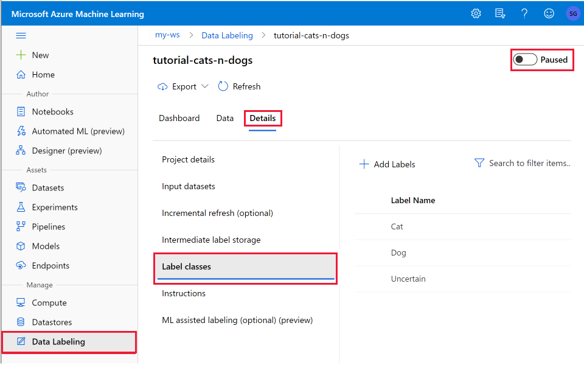

# Create a data labeling project and export labels 

Learn how to create and run data labeling projects to tag data in Azure Machine Learning.  Use machine-learning-assisted data labeling, or human-in-the-loop labeling, to aid with the task.

## Data labeling capabilities

> [!Important]
> Data images must be available in an Azure blob datastore. (If you do not have an existing datastore, you may upload images during project creation.)

Azure Machine Learning data labeling is a central place to create, manage, and monitor labeling projects:
 - Coordinate data, labels, and team members to efficiently manage labeling tasks. 
 - Tracks progress and maintains the queue of incomplete labeling tasks.
 - Start and stop the project and control the labeling progress.
 - Review the labeled data and export labeled in COCO format or as an Azure Machine Learning dataset.

## Prerequisites

* The data that you want to label, either in local files or in Azure blob storage.
* The set of labels that you want to apply.
* The instructions for labeling.
* An Azure subscription. If you don't have an Azure subscription, create a [free account](https://aka.ms/AMLFree) before you begin.
* A Machine Learning workspace. See [Create an Azure Machine Learning workspace](how-to-manage-workspace.md).

## Create a data labeling project

Labeling projects are administered from Azure Machine Learning. You use the **Labeling projects** page to manage your projects.

If your data is already in Azure Blob storage, you should make it available as a datastore before you create the labeling project. For an example of using a datastore, see [Tutorial: Create your first image classification labeling project](tutorial-labeling.md).

To create a project, select **Add project**. Give the project an appropriate name and select **Labeling task type**. Project name cannot be reused, even if the project is deleted in future.

:::image type="content" source="media/how-to-create-labeling-projects/labeling-creation-wizard.png" alt-text="Labeling project creation wizard":::

* Choose **Image Classification Multi-class** for projects when you want to apply only a *single label* from a set of labels to an image.
* Choose **Image Classification Multi-label** for projects when you want to apply *one or more* labels from a set of labels to an image. For instance, a photo of a dog might be labeled with both *dog* and *daytime*.
* Choose **Object Identification (Bounding Box)** for projects when you want to assign a label and a bounding box to each object within an image.
* Choose **Instance Segmentation (Polygon)** for projects when you want to assign a label and draw a polygon around each object within an image.

Select **Next** when you're ready to continue.

## Specify the data to label

If you already created a dataset that contains your data, select it from the **Select an existing dataset** drop-down list. Or, select **Create a dataset** to use an existing Azure datastore or to upload local files.

> [!NOTE]
> A project cannot contain more than 500,000 images.  If your dataset has more, only the first 500,000 images will be loaded.  

### Create a dataset from an Azure datastore

In many cases, it's fine to just upload local files. But [Azure Storage Explorer](https://azure.microsoft.com/features/storage-explorer/) provides a faster and more robust way to transfer a large amount of data. We recommend Storage Explorer as the default way to move files.

To create a dataset from data that you've already stored in Azure Blob storage:

1. Select **Create a dataset** > **From datastore**.
1. Assign a **Name** to your dataset.
1. Choose **File** as the **Dataset type**.  Only file dataset types are supported.
1. Select the datastore.
1. If your data is in a subfolder within your blob storage, choose **Browse** to select the path.
    * Append "/**" to the path to include all the files in subfolders of the selected path.
    * Append "**/*.*" to include all the data in the current container and its subfolders.
1. Provide a description for your dataset.
1. Select **Next**.
1. Confirm the details. Select **Back** to modify the settings or **Create** to create the dataset.

### Create a dataset from uploaded data

To directly upload your data:

1. Select **Create a dataset** > **From local files**.
1. Assign a **Name** to your dataset.
1. Choose "File" as the **Dataset type**.
1. *Optional:* Select **Advanced settings** to customize the datastore, container, and path to your data.
1. Select **Browse** to select the local files to upload.
1. Provide a description of your dataset.
1. Select **Next**.
1. Confirm the details. Select **Back** to modify the settings or **Create** to create the dataset.

The data gets uploaded to the default blob store ("workspaceblobstore") of your Machine Learning workspace.

##  Configure incremental refresh

If you plan to add new images to your dataset, use incremental refresh to add these new images your project.   When **incremental refresh** is enabled,  the dataset is checked periodically for new images to be added to a project, based on the labeling completion rate.   The check for new data stops when the project contains the maximum 500,000 images.

To add more images to your project, use [Azure Storage Explorer](https://azure.microsoft.com/features/storage-explorer/) to upload to the appropriate folder in the blob storage. 

Check the box for **Enable incremental refresh** when you want your project to continually monitor for new data in the datastore. This data will be pulled into your project once a day when enabled, so you will have to wait after you add new data to the datastore before it shows up in your project.  You can see a timestamp for when data was last  refreshed in the **Incremental refresh** section of **Details** tab for your project.

Uncheck this box if you do not want new images that appear in the datastore to be added to your project.

## Specify label classes

On the **Label classes** page, specify the set of classes to categorize your data. Your labelers' accuracy and speed are affected by their ability to choose among the classes. For instance, instead of spelling out the full genus and species for plants or animals, use a field code or abbreviate the genus.

Enter one label per row. Use the **+** button to add a new row. If you have more than 3 or 4 labels but fewer than 10, you may want to prefix the names with numbers ("1: ", "2: ") so the labelers can use the number keys to speed their work.

## Describe the data labeling task

It's important to clearly explain the labeling task. On the **Labeling instructions** page, you can add a link to an external site for labeling instructions, or provide instructions in the edit box on the page. Keep the instructions task-oriented and appropriate to the audience. Consider these questions:

* What are the labels they'll see, and how will they choose among them? Is there a reference text to refer to?
* What should they do if no label seems appropriate?
* What should they do if multiple labels seem appropriate?
* What confidence threshold should they apply to a label? Do you want their "best guess" if they aren't certain?
* What should they do with partially occluded or overlapping objects of interest?
* What should they do if an object of interest is clipped by the edge of the image?
* What should they do after they submit a label if they think they made a mistake?

For bounding boxes, important questions include:

* How is the bounding box defined for this task? Should it be entirely on the interior of the object, or should it be on the exterior? Should it be cropped as closely as possible, or is some clearance acceptable?
* What level of care and consistency do you expect the labelers to apply in defining bounding boxes?
* How to label the object that is partially shown in the image? 
* How to label the object that partially covered by other object?

>[!NOTE]
> Be sure to note that the labelers will be able to select the first 9 labels by using number keys 1-9.

## Use ML-assisted data labeling

The **ML-assisted labeling** page lets you trigger automatic machine learning models to accelerate the labeling task. At the beginning of your labeling project, the images are shuffled into a random order to reduce potential bias. However, any biases that are present in the dataset will be reflected in the trained model. For example, if 80% of your images are of a single class, then approximately 80% of the data used to train the model will be of that class. This training does not include active learning.

Select *Enable ML assisted labeling* and specify a GPU to enable assisted labeling, which consists of two phases:
* Clustering
* Prelabeling

The exact number of labeled images necessary to start assisted labeling is not a fixed number.  This can vary significantly from one labeling project to another. For some projects, is sometimes possible to see prelabel or cluster tasks after 300 images have been manually labeled. ML Assisted Labeling uses a technique called *Transfer Learning*, which uses a pre-trained model to jump-start the training process. If your dataset's classes are similar to those in the pre-trained model, pre-labels may be available after only a few hundred manually labeled images. If your dataset is significantly different from the data used to pre-train the model, it may take much longer.

Since the final labels still rely on input from the labeler, this technology is sometimes called *human in the loop* labeling.

> [!NOTE]
> ML assisted data labelling does not support default storage accounts secured behind a [virtual network](how-to-network-security-overview.md). You must use a non-default storage account for ML assisted data labelling. The non-default storage account can be secured behind the virtual network.

### Clustering

After a certain number of labels are submitted, the machine learning model for image classification starts to group together similar images.  These similar images are presented to the labelers on the same screen to speed up manual tagging. Clustering is especially useful when the labeler is viewing a grid of 4, 6, or 9 images. 

Once a machine learning model has been trained on your manually labeled data, the model is truncated to its last fully-connected layer. Unlabeled images are then passed through the truncated model in a process commonly known as "embedding" or "featurization." This embeds each image in a high-dimensional space defined by this model layer. Images that are nearest neighbors in the space are used for clustering tasks. 

The clustering phase does not appear for object detection models.

### Prelabeling

After enough image labels are submitted, a classification model is used to predict image tags. Or an object detection model is used to predict bounding boxes. The labeler now sees pages that contain predicted labels already present on each image. For object detection, predicted boxes are also shown. The task is then to review these predictions and correct any mis-labeled images before submitting the page.  

Once a machine learning model has been trained on your manually labeled data, the model is evaluated on a test set of manually labeled images to determine its accuracy at different confidence thresholds. This evaluation process is used to determine a confidence threshold above which the model is accurate enough to show pre-labels. The model is then evaluated against unlabeled data. Images with predictions more confident than this threshold are used for pre-labeling.

## Initialize the data labeling project

After the labeling project is initialized, some aspects of the  project are immutable. You can't change the task type or dataset. You *can* modify labels and the URL for the task description. Carefully review the settings before you create the project. After you submit the project, you're returned to the **Data Labeling** homepage, which will show the project as **Initializing**.

> [!NOTE]
> This page may not automatically refresh. So, after a pause,  manually refresh the page to see the project's status as **Created**.

## Run and monitor the project
After you initialize the project, Azure will begin running it. Select the project on the main **Data Labeling** page to see details of the project

To pause or restart the project, toggle the **Running** status on the top right. You can only label data when the project is running.

### Dashboard

The **Dashboard** tab shows the progress of the labeling task.

:::image type="content" source="media/how-to-create-labeling-projects/labeling-dashboard.png" alt-text="Data labeling dashboard":::

The progress chart shows how many items have been labeled and how many are not yet done.  Items pending may be:

* Not yet added to a task
* Included in a task that is assigned to a labeler but not yet completed 
* In the queue of tasks yet to be assigned

The middle section shows the queue of tasks yet to be assigned. When ML assisted labeling is off, this section shows the number of manual tasks to be assigned. When ML assisted labeling is on, this will also show:

* Tasks containing clustered items in the queue
* Tasks containing prelabeled items in the queue

Additionally, when ML assisted labeling is enabled, a small progress bar shows when the next training run will occur.  The Experiments sections give links for each of the machine learning runs.

* Training - trains a model to predict the labels
* Validation - determines whether this model's prediction will be used for pre-labeling the items 
* Inference - prediction run for new items
* Featurization - clusters items (only for image classification projects)

On the right side is a distribution of the labels for those tasks that are complete.  Remember that in some project types, an item can have multiple labels, in which case the total number of labels can be greater than the total number items.

### Data tab

On the **Data** tab, you can see your dataset and review labeled data. If you see incorrectly labeled data, select it and choose **Reject**, which will remove the labels and put the data back into the unlabeled queue.

### Details tab

View details of your project.  In this tab you can:

* View project details and input datasets
* Enable incremental refresh
* View details of the storage container used to store labeled outputs in your project
* Add labels to your project
* Edit instructions you give to your labels
* Edit details of ML assisted labeling, including enable/disable

### Access for labelers

Anyone who has access to your workspace can label data in your project.  You can also customize the permissions for labelers so that they can access labeling but not other parts of the workspace or your labeling project.  For more details, see [Manage access to an Azure Machine Learning workspace](how-to-assign-roles.md), and learn how to create the [labeler custom role](how-to-assign-roles.md#labeler).

## Add new label class to a project

During the data labeling process, you may find that additional labels are needed to classify your images.  For example, you may want to add an "Unknown" or "Other" label to indicate confusing images.

Use these steps to add one or more labels to a project:

1. Select the project on the main **Data Labeling** page.
1. At the top right of the page, toggle **Running** to **Paused** to stop labelers from their activity.
1. Select the **Details** tab.
1. In the list on the left, select **Label classes**.
1. At the top of the list, select **+ Add Labels**
    
1. In the form, add your new label and choose how to proceed.  Since you've changed the available labels for an image, you choose how to treat the already labeled data:
    * Start over, removing all existing labels.  Choose this option if you want to start labeling from the beginning with the new full set of labels. 
    * Start over, keeping all existing labels.  Choose this option to mark all data as unlabeled, but keep the existing labels as a default tag for images that were previously labeled.
    * Continue, keeping all existing labels. Choose this option to keep all data already labeled as is, and start using the new label for data not yet labeled.
1. Modify your instructions page as necessary for the new label(s).
1. Once you have added all new labels, at the top right of the page toggle **Paused** to **Running** to restart the project.  

## Export the labels

You can export the label data for Machine Learning experimentation at any time. Image labels can be exported in [COCO format](http://cocodataset.org/#format-data) or as an [Azure Machine Learning dataset with labels](how-to-use-labeled-dataset.md). Use the **Export** button on the **Project details** page of your labeling project.

The COCO file is created in the default blob store of the Azure Machine Learning workspace in a folder within *export/coco*. You can access the exported Azure Machine Learning dataset in the **Datasets** section of Machine Learning. The dataset details page also provides sample code to access your labels from Python.

## Troubleshooting

Use these tips if you see any of these issues.

|Issue  |Resolution  |
|---------|---------|
|Only datasets created on blob datastores can be used.     |  This is a known limitation of the current release.       |
|After creation, the project shows "Initializing" for a long time.     | Manually refresh the page. Initialization should proceed at roughly 20 datapoints per second. The lack of autorefresh is a known issue.         |
|When reviewing images, newly labeled images are not shown.     |   To load all labeled images, choose the **First** button. The **First** button will take you back to the front of the list, but loads all labeled data.      |
|Pressing Esc key while labeling for object detection creates a zero size label on the top-left corner. Submitting labels in this state fails.     |   Delete the label by clicking on the cross mark next to it.  |
|Unable to assign set of tasks to a specific labeler.     |   This is a known limitation of the current release.  |

## Next steps

* [Tutorial: Create your first image classification labeling project](tutorial-labeling.md).
* Label images for [image classification or object detection](how-to-label-images.md)
* Learn more about [Azure Machine Learning and Machine Learning Studio (classic)](./overview-what-is-machine-learning-studio.md#ml-studio-classic-vs-azure-machine-learning-studio)
