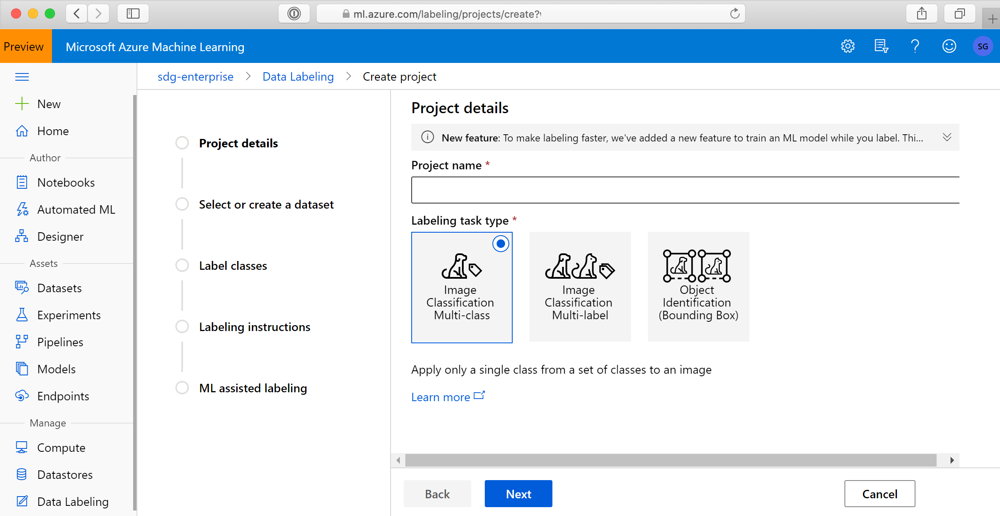

# Create a data labeling project and export labels 

Labeling voluminous data in machine learning projects is often a headache. Projects that have a computer-vision component, such as image classification or object detection, generally require labels for thousands of images.
 
[Azure Machine Learning](https://ml.azure.com/) gives you a central place to create, manage, and monitor labeling projects. Use it to coordinate data, labels, and team members to efficiently manage labeling tasks. Machine Learning supports image classification, either multi-label or multi-class, and object identification together with bounded boxes.

Machine Learning tracks progress and maintains the queue of incomplete labeling tasks. Labelers don't need an Azure account to participate. After they are authenticated with your Microsoft account or [Azure Active Directory](https://docs.microsoft.com/azure/active-directory/active-directory-whatis), they can do as much labeling as their time allows.

In Machine Learning, you start and stop the project, add and remove people and teams, and monitor progress. You can export labeled data in COCO format or as an Azure Machine Learning dataset.

> [!Important]
> Only image classification and object identification labeling projects are currently supported. Additionally, the data images must be available in an Azure blob datastore. (If you do not have an existing datastore, you may upload images during project creation.) 

In this article, you'll learn how to:

> [!div class="checklist"]
> * Create a project
> * Specify the project's data and structure
> * Manage the teams and people who work on the project
> * Run and monitor the project
> * Export the labels

## Prerequisites

* The data that you want to label, either in local files or in Azure storage.
* The set of labels that you want to apply.
* The instructions for labeling.
* An Azure subscription. If you don’t have an Azure subscription, create a [free account](https://aka.ms/AMLFree) before you begin.
* A Machine Learning workspace. See [Create an Azure Machine Learning workspace](how-to-manage-workspace.md).

## Create a labeling project

Labeling projects are administered from Azure Machine Learning. You use the **Labeling projects** page to manage your projects and people. A project has one or more teams assigned to it, and a team has one or more people assigned to it.

If your data is already in Azure Blob storage, you should make it available as a datastore before you create the labeling project. For details, see [Create and register datastores](https://docs.microsoft.com/azure/machine-learning/how-to-access-data#create-and-register-datastores).

To create a project, select **Add project**. Give the project an appropriate name and select **Labeling task type**.

* Choose **Image Classification Multi-label** for projects when you want to apply *one or more* labels from a set of classes to an image. For instance, a photo of a dog might be labeled with both *dog* and *daytime*.
* Choose **Image Classification Multi-class** for projects when you want to apply only a *single class* from a set of classes to an image.
* Choose **Object Identification (Bounding Box)** for projects when you want to assign a class and a bounding box to each object within an image.

Select **Next** when you're ready to continue.

## Specify the data to label

If you already created a dataset that contains your data, select it from the **Select an existing dataset** drop-down list. Or, select **Create a dataset** to use an existing Azure datastore or to upload local files.

### Create a dataset from an Azure datastore

In many cases, it's fine to just upload local files. But [Azure Storage Explorer](https://azure.microsoft.com/features/storage-explorer/) provides a faster and more robust way to transfer a large amount of data. We recommend Storage Explorer as the default way to move files.

To create a dataset from data that you've already stored in Azure Blob storage:

1. Select **Create a dataset** > **From datastore**.
1. Assign a **Name** to your dataset.
1. Choose **File** as the **Dataset type**.  
1. Select the datastore.
1. If your data is in a subfolder within your blob storage, choose **Browse** to select the path.
    * Append "/**" to the path to include all the files in subfolders of the selected path.
    * Append "**/*.*" to include all the data in the current container and its subfolders.
1. Provide a description for your dataset.
1. Select **Next**.
1. Confirm the details. Select **Back** to modify the settings or **Create** to create the dataset.

### Create a dataset from uploaded data

To directly upload your data:

1. Select **Create a dataset** > **From local files**.
1. Assign a **Name** to your dataset.
1. Choose "File" as the **Dataset type**.
1. *Optional:* Select **Advanced settings** to customize the datastore, container, and path to your data.
1. Select **Browse** to select the local files to upload.
1. Provide a description of your dataset.
1. Select **Next**.
1. Confirm the details. Select **Back** to modify the settings or **Create** to create the dataset.

The data gets uploaded to the default blob store ("workspaceblobstore") of your Machine Learning workspace.

## Specify label classes

On the **Label classes** page, specify the set of classes to categorize your data. Do this carefully, because your labelers' accuracy and speed will be affected by their ability to choose among the classes. For instance, instead of spelling out the full genus and species for plants or animals, use a field code or abbreviate the genus.

Enter one label per row. Use the **+** button to add a new row. If you have more than 3 or 4 labels but fewer than 10, you may want to prefix the names with numbers ("1: ", "2: ") so the labelers can use the number keys to speed their work.

## Describe the labeling task

It's important to clearly explain the labeling task. On the **Labeling instructions** page, you can add a link to an external site for labeling instructions. Keep the instructions task-oriented and appropriate to the audience. Consider these questions:

* What are the labels they'll see, and how will they choose among them? Is there a reference text to refer to?
* What should they do if no label seems appropriate?
* What should they do if multiple labels seem appropriate?
* What confidence threshold should they apply to a label? Do you want their "best guess" if they aren't certain?
* What should they do with partially occluded or overlapping objects of interest?
* What should they do if an object of interest is clipped by the edge of the image?
* What should they do after they submit a label if they think they made a mistake?

For bounding boxes, important questions include:

* How is the bounding box defined for this task? Should it be entirely on the interior of the object, or should it be on the exterior? Should it be cropped as closely as possible, or is some clearance acceptable?
* What level of care and consistency do you expect the labelers to apply in defining bounding boxes?

>[!NOTE]
> Be sure to note that the labelers will be able to select the first 9 labels by using number keys 1-9.

## Initialize the labeling project

After the labeling project is initialized, some aspects of the  project are immutable. You can't change the task type or dataset. You *can* modify labels and the URL for the task description. Carefully review the settings before you create the project. After you submit the project, you're returned to the **Data Labeling** homepage, which will show the project as **Initializing**. This page doesn't automatically refresh. So, after a pause,  manually refresh the page to see the project's status as **Created**.

## Manage teams and people

By default, each labeling project that you create gets a new team with you as a member. But teams can also be shared between projects. And projects can have more than one team. To create a team, select **Add team** on the **Teams** page.

You manage people on the **People** page. Add and remove people by email address. Each labeler has to authenticate through your Microsoft account or Azure Active Directory, if you use it.  

After you add a person, you can assign that person to one or more teams: Go to the **Teams** page, select the team, and then select **Assign people** or **Remove people**.

To send an email to the team, select the team to view the **Team details** page. On this page, select **Email team** to open an email draft with the addresses of everyone on the team.

## Run and monitor the project

After you initialize the project, Azure will begin running it. Select the project on the main **Data Labeling** page to go to **Project details**. The **Dashboard** tab shows the progress of the labeling task.

On the **Data** tab, you can see your dataset and review labeled data. If you see incorrectly labeled data, select it and choose **Reject**, which will remove the labels and put the data back into the unlabeled queue.

Use the **Team** tab to assign or unassign teams to the project.

To pause or restart the project, select the **Pause**/**Start** button. You can only label data when the project is running.

You can label data directly from the **Project details** page by selecting **Label data**.

## Add labels to a project

During the labeling process, you may find that additional labels are needed to classify your images.  For example, you may want to add an "Unknown" or "Other" label to indicate confusing images.

Use these steps to add one or more labels to a project:

1. Select the project on the main **Data Labeling** page.
1. At the top of the page, select **Pause** to stop labelers from their activity.
1. Select the **Details** tab.
1. In the list on the left, select **Label classes**.
1. At the top of the list, select **+ Add Labels**
    
1. In the form, add your new label and choose how to proceed.  Since you've changed the available labels for an image, you choose how to treat the already labeled data:
    * Start over, removing all existing labels.  Choose this option if you want to wipe out all existing labels so that the full set can be used to tag all images.
    * Start over, keeping all existing labels.  Choose this option to mark all data as unlabeled, but keep the existing labels as a default tag for images that had been labeled.
    * Continue, keeping all existing labels. Choose this option to keep all data already labeled as is, and use the new label only for data not yet classified.
1. Once you have added all new labels, at the top of the page select **Start**  to restart the project.  

## Export the labels

You can export the label data for Machine Learning experimentation at any time. Image labels can be exported in [COCO format](http://cocodataset.org/#format-data) or as an Azure Machine Learning dataset. Use the **Export** button on the **Project details** page of your labeling project.

The COCO file is created in the default blob store of the Azure Machine Learning workspace in a folder within *export/coco*. You can access the exported Azure Machine Learning dataset in the **Datasets** section of Machine Learning. The dataset details page also provides sample code to access your labels from Python.

## Next steps

* Label images for [image classification or object detection](how-to-label-images.md)
* Learn more about [Azure Machine Learning and Machine Learning Studio (classic)](compare-azure-ml-to-studio-classic.md)
