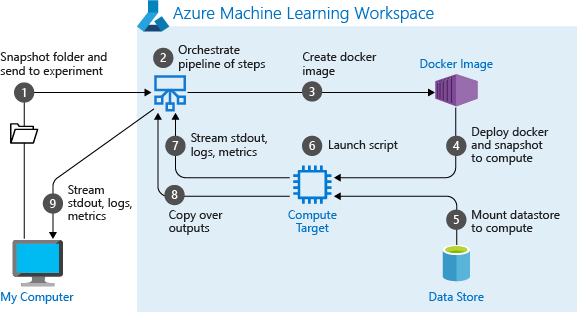
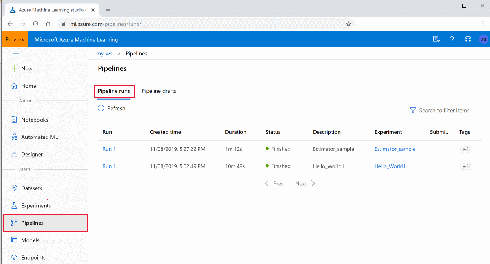

# Create and run machine learning pipelines with Azure Machine Learning SDK

In this article, you learn how to create and run [machine learning pipelines](concept-ml-pipelines.md) by using the [Azure Machine Learning SDK](/python/api/overview/azure/ml/intro). Use **ML pipelines** to create a workflow that stitches together various ML phases. Then, publish that pipeline for later access or sharing with others. Track ML pipelines to see how your model is performing in the real world and to detect data drift. ML pipelines are ideal for batch scoring scenarios, using various computes, reusing steps instead of rerunning them, and sharing ML workflows with others.

This article is not a tutorial. For guidance on creating your first pipeline, see [Tutorial: Build an Azure Machine Learning pipeline for batch scoring](tutorial-pipeline-batch-scoring-classification.md) or [Use automated ML in an Azure Machine Learning pipeline in Python](how-to-use-automlstep-in-pipelines.md). 

While you can use a different kind of pipeline called an [Azure Pipeline](/azure/devops/pipelines/targets/azure-machine-learning?context=azure%2fmachine-learning%2fservice%2fcontext%2fml-context&tabs=yaml) for CI/CD automation of ML tasks, that type of pipeline is not stored in your workspace. [Compare these different pipelines](concept-ml-pipelines.md#which-azure-pipeline-technology-should-i-use).

The ML pipelines you create are visible to the members of your Azure Machine Learning [workspace](how-to-manage-workspace.md). 

ML pipelines execute on compute targets (see [What are compute targets in Azure Machine Learning](./concept-compute-target.md)). Pipelines can read and write data to and from supported [Azure Storage](../storage/index.yml) locations.

If you don't have an Azure subscription, create a free account before you begin. Try the [free or paid version of Azure Machine Learning](https://aka.ms/AMLFree).

## Prerequisites

* Create an [Azure Machine Learning workspace](how-to-manage-workspace.md) to hold all your pipeline resources.

* [Configure your development environment](how-to-configure-environment.md) to install the Azure Machine Learning SDK, or use an [Azure Machine Learning compute instance](concept-compute-instance.md) with the SDK already installed.

Start by attaching your workspace:

```Python
import azureml.core
from azureml.core import Workspace, Datastore

ws = Workspace.from_config()
```

## Set up machine learning resources

Create the resources required to run an ML pipeline:

* Set up a datastore used to access the data needed in the pipeline steps.

* Configure a `Dataset` object to point to persistent data that lives in, or is accessible in, a datastore. Configure an `OutputFileDatasetConfig` object for temporary data passed between pipeline steps. 

* Set up the [compute targets](concept-azure-machine-learning-architecture.md#compute-targets) on which your pipeline steps will run.

### Set up a datastore

A datastore stores the data for the pipeline to access. Each workspace has a default datastore. You can register more datastores. 

When you create your workspace, [Azure Files](../storage/files/storage-files-introduction.md) and [Azure Blob storage](../storage/blobs/storage-blobs-introduction.md) are attached to the workspace. A default datastore is registered to connect to the Azure Blob storage. To learn more, see [Deciding when to use Azure Files, Azure Blobs, or Azure Disks](../storage/common/storage-introduction.md). 

```python
# Default datastore 
def_data_store = ws.get_default_datastore()

# Get the blob storage associated with the workspace
def_blob_store = Datastore(ws, "workspaceblobstore")

# Get file storage associated with the workspace
def_file_store = Datastore(ws, "workspacefilestore")

```

Steps generally consume data and produce output data. A step can create data such as a model, a directory with model and dependent files, or temporary data. This data is then available for other steps later in the pipeline. To learn more about connecting your pipeline to your data, see the articles [How to Access Data](how-to-access-data.md) and [How to Register Datasets](how-to-create-register-datasets.md). 

### Configure data with `Dataset` and `OutputFileDatasetConfig` objects

The preferred way to provide data to a pipeline is a [Dataset](/python/api/azureml-core/azureml.core.dataset.Dataset) object. The `Dataset` object points to data that lives in or is accessible from a datastore or at a Web URL. The `Dataset` class is abstract, so you will create an instance of either a `FileDataset` (referring to one or more files) or a `TabularDataset` that's created by from one or more files with delimited columns of data.

You create a `Dataset` using methods like [from_files](/python/api/azureml-core/azureml.data.dataset_factory.filedatasetfactory#from-files-path--validate-true-) or [from_delimited_files](/python/api/azureml-core/azureml.data.dataset_factory.tabulardatasetfactory#from-delimited-files-path--validate-true--include-path-false--infer-column-types-true--set-column-types-none--separator------header-true--partition-format-none--support-multi-line-false-).

```python
from azureml.core import Dataset

my_dataset = Dataset.File.from_files([(def_blob_store, 'train-images/')])
```

Intermediate data (or output of a step) is represented by an [OutputFileDatasetConfig](/python/api/azureml-core/azureml.data.output_dataset_config.outputfiledatasetconfig) object. `output_data1` is produced as the output of a step. Optionally, this data can be registered as a dataset by calling `register_on_complete`. If you create an `OutputFileDatasetConfig` in one step and use it as an input to another step, that data dependency between steps creates an implicit execution order in the pipeline.

`OutputFileDatasetConfig` objects return a directory, and by default writes output to the default datastore of the workspace.

```python
from azureml.data import OutputFileDatasetConfig

output_data1 = OutputFileDatasetConfig(destination = (datastore, 'outputdataset/{run-id}'))
output_data_dataset = output_data1.register_on_complete(name = 'prepared_output_data')

```

> [!IMPORTANT]
> Intermediate data stored using `OutputFileDatasetConfig` is not automatically deleted by Azure.
> You should either programmatically delete intermediate data at the end of a pipeline run, use a
> datastore with a short data-retention policy, or regularly do manual clean up.

> [!TIP]
> Only upload files relevant to the job at hand. Any change in files within the data directory will be seen as reason to rerun the step the next time the pipeline is run even if reuse is specified. 

## Set up a compute target


In Azure Machine Learning, the term __compute__ (or __compute target__) refers to the machines or clusters that perform the computational steps in your machine learning pipeline.   See [compute targets for model training](concept-compute-target.md#train) for a full list of compute targets and [Create compute targets](how-to-create-attach-compute-studio.md) for how to create and attach them to your workspace.   The process for creating and or attaching a compute target is the same whether you are training a model or running a pipeline step. After you create and attach your compute target, use the `ComputeTarget` object in your [pipeline step](#steps).

> [!IMPORTANT]
> Performing management operations on compute targets is not supported from inside remote jobs. Since machine learning pipelines are submitted as a remote job, do not use management operations on compute targets from inside the pipeline.

### Azure Machine Learning compute

You can create an Azure Machine Learning compute for running your steps. The code for other compute targets is similar, with slightly different parameters, depending on the type. 

```python
from azureml.core.compute import ComputeTarget, AmlCompute

compute_name = "aml-compute"
vm_size = "STANDARD_NC6"
if compute_name in ws.compute_targets:
    compute_target = ws.compute_targets[compute_name]
    if compute_target and type(compute_target) is AmlCompute:
        print('Found compute target: ' + compute_name)
else:
    print('Creating a new compute target...')
    provisioning_config = AmlCompute.provisioning_configuration(vm_size=vm_size,  # STANDARD_NC6 is GPU-enabled
                                                                min_nodes=0,
                                                                max_nodes=4)
    # create the compute target
    compute_target = ComputeTarget.create(
        ws, compute_name, provisioning_config)

    # Can poll for a minimum number of nodes and for a specific timeout.
    # If no min node count is provided it will use the scale settings for the cluster
    compute_target.wait_for_completion(
        show_output=True, min_node_count=None, timeout_in_minutes=20)

    # For a more detailed view of current cluster status, use the 'status' property
    print(compute_target.status.serialize())
```

## Configure the training run's environment

The next step is making sure that the remote training run has all the dependencies needed by the training steps. Dependencies and the runtime context are set by creating and configuring a `RunConfiguration` object. 

```python
from azureml.core.runconfig import RunConfiguration
from azureml.core.conda_dependencies import CondaDependencies
from azureml.core import Environment 

aml_run_config = RunConfiguration()
# `compute_target` as defined in "Azure Machine Learning compute" section above
aml_run_config.target = compute_target

USE_CURATED_ENV = True
if USE_CURATED_ENV :
    curated_environment = Environment.get(workspace=ws, name="AzureML-Tutorial")
    aml_run_config.environment = curated_environment
else:
    aml_run_config.environment.python.user_managed_dependencies = False
    
    # Add some packages relied on by data prep step
    aml_run_config.environment.python.conda_dependencies = CondaDependencies.create(
        conda_packages=['pandas','scikit-learn'], 
        pip_packages=['azureml-sdk', 'azureml-dataprep[fuse,pandas]'], 
        pin_sdk_version=False)
```

The code above shows two options for handling dependencies. As presented, with `USE_CURATED_ENV = True`, the configuration is based on a curated environment. Curated environments are "prebaked" with common inter-dependent libraries and can be faster to bring online. Curated environments have prebuilt Docker images in the [Microsoft Container Registry](https://hub.docker.com/publishers/microsoftowner). For more information, see [Azure Machine Learning curated environments](resource-curated-environments.md).

The path taken if you change `USE_CURATED_ENV` to `False` shows the pattern for explicitly setting your dependencies. In that scenario, a new custom Docker image will be created and registered in an Azure Container Registry within your resource group (see [Introduction to private Docker container registries in Azure](../container-registry/container-registry-intro.md)). Building and registering this image can take quite a few minutes.

## <a id="steps"></a>Construct your pipeline steps

Once you have the compute resource and environment created, you are ready to define your pipeline's steps. There are many built-in steps available via the Azure Machine Learning SDK, as you can see on the [reference documentation for the `azureml.pipeline.steps` package](/python/api/azureml-pipeline-steps/azureml.pipeline.steps). The most flexible class is [PythonScriptStep](/python/api/azureml-pipeline-steps/azureml.pipeline.steps.python_script_step.pythonscriptstep), which runs a Python script.

```python
from azureml.pipeline.steps import PythonScriptStep
dataprep_source_dir = "./dataprep_src"
entry_point = "prepare.py"
# `my_dataset` as defined above
ds_input = my_dataset.as_named_input('input1')

# `output_data1`, `compute_target`, `aml_run_config` as defined above
data_prep_step = PythonScriptStep(
    script_name=entry_point,
    source_directory=dataprep_source_dir,
    arguments=["--input", ds_input.as_download(), "--output", output_data1],
    compute_target=compute_target,
    runconfig=aml_run_config,
    allow_reuse=True
)
```

The above code shows a typical initial pipeline step. Your data preparation code is in a subdirectory (in this example, `"prepare.py"` in the directory `"./dataprep.src"`). As part of the pipeline creation process, this directory is zipped and uploaded to the `compute_target` and the step runs the script specified as the value for `script_name`.

The `arguments` values specify the inputs and outputs of the step. In the example above, the baseline data is the `my_dataset` dataset. The corresponding data will be downloaded to the compute resource since the code specifies it as `as_download()`. The script `prepare.py` does whatever data-transformation tasks are appropriate to the task at hand and outputs the data to `output_data1`, of type `OutputFileDatasetConfig`. For more information, see [Moving data into and between ML pipeline steps (Python)](how-to-move-data-in-out-of-pipelines.md). 
The step will run on the machine defined by `compute_target`, using the configuration `aml_run_config`. 

Reuse of previous results (`allow_reuse`) is key when using pipelines in a collaborative environment since eliminating unnecessary reruns offers agility. Reuse is the default behavior when the script_name, inputs, and the parameters of a step remain the same. When reuse is allowed, results from the previous run are immediately sent to the next step. If `allow_reuse` is set to `False`, a new run will always be generated for this step during pipeline execution.

It's possible to create a pipeline with a single step, but almost always you'll choose to split your overall process into several steps. For instance, you might have steps for data preparation, training, model comparison, and deployment. For instance, one might imagine that after the `data_prep_step` specified above, the next step might be training:

```python
train_source_dir = "./train_src"
train_entry_point = "train.py"

training_results = OutputFileDatasetConfig(name = "training_results",
    destination = def_blob_store)

    
train_step = PythonScriptStep(
    script_name=train_entry_point,
    source_directory=train_source_dir,
    arguments=["--prepped_data", output_data1.as_input(), "--training_results", training_results],
    compute_target=compute_target,
    runconfig=aml_run_config,
    allow_reuse=True
)
```

The above code is similar to the code in the data preparation step. The training code is in a directory separate from that of the data preparation code. The `OutputFileDatasetConfig` output of the data preparation step, `output_data1` is used as the _input_ to the training step. A new `OutputFileDatasetConfig` object, `training_results` is created to hold the results for a subsequent comparison or deployment step. 

For other code examples, see how to [build a two step ML pipeline](https://github.com/Azure/MachineLearningNotebooks/blob/master/how-to-use-azureml/work-with-data/datasets-tutorial/pipeline-with-datasets/pipeline-for-image-classification.ipynb) and [how to write data back to datastores upon run completion](https://github.com/Azure/MachineLearningNotebooks/blob/master/how-to-use-azureml/work-with-data/datasets-tutorial/scriptrun-with-data-input-output/how-to-use-scriptrun.ipynb).

After you define your steps, you build the pipeline by using some or all of those steps.

> [!NOTE]
> No file or data is uploaded to Azure Machine Learning when you define the steps or build the pipeline. The files are uploaded when you call [Experiment.submit()](/python/api/azureml-core/azureml.core.experiment.experiment#submit-config--tags-none----kwargs-).

```python
# list of steps to run (`compare_step` definition not shown)
compare_models = [data_prep_step, train_step, compare_step]

from azureml.pipeline.core import Pipeline

# Build the pipeline
pipeline1 = Pipeline(workspace=ws, steps=[compare_models])
```

### Use a dataset 

Datasets created from Azure Blob storage, Azure Files, Azure Data Lake Storage Gen1,  Azure Data Lake Storage Gen2, Azure SQL Database, and Azure Database for PostgreSQL can be used as input to any pipeline step. You can write output to a [DataTransferStep](/python/api/azureml-pipeline-steps/azureml.pipeline.steps.datatransferstep), [DatabricksStep](/python/api/azureml-pipeline-steps/azureml.pipeline.steps.databricks_step.databricksstep), or if you want to write data to a specific datastore use [OutputFileDatasetConfig](/python/api/azureml-core/azureml.data.outputfiledatasetconfig). 

> [!IMPORTANT]
> Writing output data back to a datastore using `OutputFileDatasetConfig` is only supported for Azure Blob, Azure File share, ADLS Gen 1 and Gen 2 datastores. 

```python
dataset_consuming_step = PythonScriptStep(
    script_name="iris_train.py",
    inputs=[iris_tabular_dataset.as_named_input("iris_data")],
    compute_target=compute_target,
    source_directory=project_folder
)
```

You then retrieve the dataset in your pipeline by using the [Run.input_datasets](/python/api/azureml-core/azureml.core.run.run#input-datasets) dictionary.

```python
# iris_train.py
from azureml.core import Run, Dataset

run_context = Run.get_context()
iris_dataset = run_context.input_datasets['iris_data']
dataframe = iris_dataset.to_pandas_dataframe()
```

The line `Run.get_context()` is worth highlighting. This function retrieves a `Run` representing the current experimental run. In the above sample, we use it to retrieve a registered dataset. Another common use of the `Run` object is to retrieve both the experiment itself and the workspace in which the experiment resides: 

```python
# Within a PythonScriptStep

ws = Run.get_context().experiment.workspace
```

For more detail, including alternate ways to pass and access data, see [Moving data into and between ML pipeline steps (Python)](how-to-move-data-in-out-of-pipelines.md).

## Caching & reuse  

In order to optimize and customize the behavior of your pipelines, you can do a few things around caching and reuse. For example, you can choose to:
+ **Turn off the default reuse of the step run output** by setting `allow_reuse=False` during [step definition](/python/api/azureml-pipeline-steps/). Reuse is key when using pipelines in a collaborative environment since eliminating unnecessary runs offers agility. However, you can opt out of reuse.
+ **Force output regeneration for all steps in a run** with `pipeline_run = exp.submit(pipeline, regenerate_outputs=False)`

By default, `allow_reuse` for steps is enabled and the `source_directory` specified in the step definition is hashed. So, if the script for a given step remains the same (`script_name`, inputs, and the parameters), and nothing else in the` source_directory` has changed, the output of a previous step run is reused, the job is not submitted to the compute, and the results from the previous run are immediately available to the next step instead.

```python
step = PythonScriptStep(name="Hello World",
                        script_name="hello_world.py",
                        compute_target=aml_compute,
                        source_directory=source_directory,
                        allow_reuse=False,
                        hash_paths=['hello_world.ipynb'])
```

## Submit the pipeline

When you submit the pipeline, Azure Machine Learning checks the dependencies for each step and uploads a snapshot of the source directory you specified. If no source directory is specified, the current local directory is uploaded. The snapshot is also stored as part of the experiment in your workspace.

> [!IMPORTANT]
> [!INCLUDE [amlinclude-info](../../includes/machine-learning-amlignore-gitignore.md)]
>
> For more information, see [Snapshots](concept-azure-machine-learning-architecture.md#snapshots).

```python
from azureml.core import Experiment

# Submit the pipeline to be run
pipeline_run1 = Experiment(ws, 'Compare_Models_Exp').submit(pipeline1)
pipeline_run1.wait_for_completion()
```

When you first run a pipeline, Azure Machine Learning:

* Downloads the project snapshot to the compute target from the Blob storage associated with the workspace.
* Builds a Docker image corresponding to each step in the pipeline.
* Downloads the Docker image for each step to the compute target from the container registry.
* Configures access to `Dataset` and `OutputFileDatasetConfig` objects. For `as_mount()` access mode, FUSE is used to provide virtual access. If mount is not supported or if the user specified access as `as_upload()`, the data is instead copied to the compute target.

* Runs the step in the compute target specified in the step definition. 
* Creates artifacts, such as logs, stdout and stderr, metrics, and output specified by the step. These artifacts are then uploaded and kept in the user's default datastore.



For more information, see the [Experiment class](/python/api/azureml-core/azureml.core.experiment.experiment) reference.

## Use pipeline parameters for arguments that change at inference time

Sometimes, the arguments to individual steps within a pipeline relate to the development and training period: things like training rates and momentum, or paths to data or configuration files. When a model is deployed, though, you'll want to dynamically pass the arguments upon which you are inferencing (that is, the query you built the model to answer!). You should make these types of arguments pipeline parameters. To do this in Python, use the `azureml.pipeline.core.PipelineParameter` class, as shown in the following code snippet:

```python
from azureml.pipeline.core import PipelineParameter

pipeline_param = PipelineParameter(name="pipeline_arg", default_value="default_val")
train_step = PythonScriptStep(script_name="train.py",
                            arguments=["--param1", pipeline_param],
                            target=compute_target,
                            source_directory=project_folder)
```

### How Python environments work with pipeline parameters

As discussed previously in [Configure the training run's environment](#configure-the-training-runs-environment), environment state, and Python library dependencies are specified using an `Environment` object. Generally, you can specify an existing `Environment` by referring to its name and, optionally, a version:

```python
aml_run_config = RunConfiguration()
aml_run_config.environment.name = 'MyEnvironment'
aml_run_config.environment.version = '1.0'
```

However, if you choose to use `PipelineParameter` objects to dynamically set variables at runtime for your pipeline steps, you cannot use this technique of referring to an existing `Environment`. Instead, if you want to use `PipelineParameter` objects, you must set the `environment` field of the `RunConfiguration` to an `Environment` object. It is your responsibility to ensure that such an `Environment` has its dependencies on external Python packages properly set.


## View results of a pipeline

See the list of all your pipelines and their run details in the studio:

1. Sign in to [Azure Machine Learning studio](https://ml.azure.com).

1. [View your workspace](how-to-manage-workspace.md#view).

1. On the left, select **Pipelines** to see all your pipeline runs.
 
 
1. Select a specific pipeline to see the run results.

### Git tracking and integration

When you start a training run where the source directory is a local Git repository, information about the repository is stored in the run history. For more information, see [Git integration for Azure Machine Learning](concept-train-model-git-integration.md).

## Next steps

- To share your pipeline with colleagues or customers, see [Publish machine learning pipelines](how-to-deploy-pipelines.md)
- Use [these Jupyter notebooks on GitHub](https://aka.ms/aml-pipeline-readme) to explore machine learning pipelines further
- See the SDK reference help for the [azureml-pipelines-core](/python/api/azureml-pipeline-core/) package and the [azureml-pipelines-steps](/python/api/azureml-pipeline-steps/) package
- See the [how-to](how-to-debug-pipelines.md) for tips on debugging and troubleshooting pipelines=
- Learn how to run notebooks by following the article [Use Jupyter notebooks to explore this service](samples-notebooks.md).
