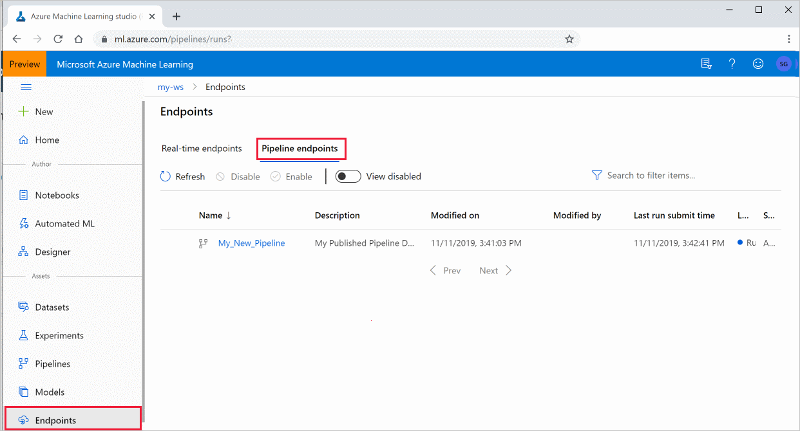

# Create and run machine learning pipelines with Azure Machine Learning SDK

[!INCLUDE [applies-to-skus](../../includes/aml-applies-to-basic-enterprise-sku.md)]

In this article, you learn how to create, publish, run, and track a [machine learning pipeline](concept-ml-pipelines.md) by using the [Azure Machine Learning SDK](https://docs.microsoft.com/python/api/overview/azure/ml/intro?view=azure-ml-py).  Use **ML pipelines** to create a workflow that stitches together various ML phases, and then publish that pipeline into your Azure Machine Learning workspace to access later or share with others.  ML pipelines are ideal for batch scoring scenarios, using various computes, reusing steps instead of rerunning them, as well as sharing ML workflows with others.

While you can use a different kind of pipeline called an [Azure Pipeline](https://docs.microsoft.com/azure/devops/pipelines/targets/azure-machine-learning?context=azure%2Fmachine-learning%2Fservice%2Fcontext%2Fml-context&view=azure-devops&tabs=yaml) for CI/CD automation of ML tasks, that type of pipeline is never stored inside your workspace. [Compare these different pipelines](concept-ml-pipelines.md#which-azure-pipeline-technology-should-i-use).

Each phase of an ML pipeline, such as data preparation and model training, can include one or more steps.

The ML pipelines you create are visible to the members of your Azure Machine Learning [workspace](how-to-manage-workspace.md). 

ML pipelines use remote compute targets for computation and the storage of the intermediate and final data associated with that pipeline. They can read and write data to and from supported [Azure Storage](https://docs.microsoft.com/azure/storage/) locations.

If you don't have an Azure subscription, create a free account before you begin. Try the [free or paid version of Azure Machine Learning](https://aka.ms/AMLFree).

## Prerequisites

* Create an [Azure Machine Learning workspace](how-to-manage-workspace.md) to hold all your pipeline resources.

* [Configure your development environment](how-to-configure-environment.md) to install the Azure Machine Learning SDK, or use an [Azure Machine Learning compute instance (preview)](concept-compute-instance.md) with the SDK already installed.

Start by attaching your workspace:

```Python
import azureml.core
from azureml.core import Workspace, Datastore

ws = Workspace.from_config()
```

## Set up machine learning resources

Create the resources required to run an ML pipeline:

* Set up a datastore used to access the data needed in the pipeline steps.

* Configure a `Dataset` object to point to persistent data that lives in, or is accessible in, a datastore. Configure a `PipelineData` object for temporary data passed between pipeline steps. 

* Set up the [compute targets](concept-azure-machine-learning-architecture.md#compute-targets) on which your pipeline steps will run.

### Set up a datastore

A datastore stores the data for the pipeline to access. Each workspace has a default datastore. You can register additional datastores. 

When you create your workspace, [Azure Files](https://docs.microsoft.com/azure/storage/files/storage-files-introduction) and [Azure Blob storage](https://docs.microsoft.com/azure/storage/blobs/storage-blobs-introduction) are attached to the workspace. A default datastore is registered to connect to the Azure Blob storage. To learn more, see [Deciding when to use Azure Files, Azure Blobs, or Azure Disks](https://docs.microsoft.com/azure/storage/common/storage-decide-blobs-files-disks). 

```python
# Default datastore 
def_data_store = ws.get_default_datastore()

# Get the blob storage associated with the workspace
def_blob_store = Datastore(ws, "workspaceblobstore")

# Get file storage associated with the workspace
def_file_store = Datastore(ws, "workspacefilestore")

```

Upload data files or directories to the datastore for them to be accessible from your pipelines. This example uses the Blob storage as the datastore:

```python
def_blob_store.upload_files(
    ["iris.csv"],
    target_path="train-dataset",
    overwrite=True)
```

A pipeline consists of one or more steps. A step is a unit run on a compute target. Steps might consume data sources and produce "intermediate" data. A step can create data such as a model, a directory with model and dependent files, or temporary data. This data is then available for other steps later in the pipeline.

To learn more about connecting your pipeline to your data, see the articles [How to Access Data](how-to-access-data.md) and [How to Register Datasets](how-to-create-register-datasets.md). 

### Configure data using `Dataset` and `PipelineData` objects

You just created a data source that can be referenced in a pipeline as an input to a step. The preferred way to provide data to a pipeline is a [Dataset](https://docs.microsoft.com/python/api/azureml-core/azureml.core.dataset.Dataset) object. The `Dataset` object points to data that lives in or is accessible from a datastore or at a Web URL. The `Dataset` class is abstract, so you will create an instance of either a `FileDataset` (referring to one or more files) or a `TabularDataset` that's created by from one or more files with delimited columns of data.

`Dataset` objects support versioning, diffs, and summary statistics. `Dataset`s are lazily evaluated (like Python generators) and it's efficient to subset them by splitting or filtering. 

You create a `Dataset` using methods like [from_file](https://docs.microsoft.com/python/api/azureml-core/azureml.data.dataset_factory.filedatasetfactory?view=azure-ml-py#from-files-path--validate-true-) or [from_delimited_files](https://docs.microsoft.com/python/api/azureml-core/azureml.data.dataset_factory.tabulardatasetfactory?view=azure-ml-py#from-delimited-files-path--validate-true--include-path-false--infer-column-types-true--set-column-types-none--separator------header-true--partition-format-none--support-multi-line-false-).

```python
from azureml.core import Dataset

iris_tabular_dataset = Dataset.Tabular.from_delimited_files([(def_blob_store, 'train-dataset/iris.csv')])
```

Intermediate data (or output of a step) is represented by a [PipelineData](https://docs.microsoft.com/python/api/azureml-pipeline-core/azureml.pipeline.core.pipelinedata?view=azure-ml-py) object. `output_data1` is produced as the output of a step, and used as the input of one or more future steps. `PipelineData` introduces a data dependency between steps, and creates an implicit execution order in the pipeline. This object will be used later when creating pipeline steps.

```python
from azureml.pipeline.core import PipelineData

output_data1 = PipelineData(
    "output_data1",
    datastore=def_blob_store,
    output_name="output_data1")
```

More details and sample code for working with datasets and pipeline data can be found in [Moving data into and between ML pipeline steps (Python)](how-to-move-data-in-out-of-pipelines.md).

## Set up a compute target

In Azure Machine Learning, the term __compute__ (or __compute target__) refers to the machines or clusters that perform the computational steps in your machine learning pipeline.   See [compute targets for model training](how-to-set-up-training-targets.md) for a full list of compute targets and how to create and attach them to your workspace.  The process for creating and or attaching a compute target is the same regardless of whether you are training a model or running a pipeline step. After you create and attach your compute target, use the `ComputeTarget` object in your [pipeline step](#steps).

> [!IMPORTANT]
> Performing management operations on compute targets is not supported from inside remote jobs. Since machine learning pipelines are submitted as a remote job, do not use management operations on compute targets from inside the pipeline.

Below are examples of creating and attaching compute targets for:

* Azure Machine Learning Compute
* Azure Databricks 
* Azure Data Lake Analytics

### Azure Machine Learning compute

You can create an Azure Machine Learning compute for running your steps.

```python
from azureml.core.compute import ComputeTarget, AmlCompute

compute_name = "aml-compute"
vm_size = "STANDARD_NC6"
if compute_name in ws.compute_targets:
    compute_target = ws.compute_targets[compute_name]
    if compute_target and type(compute_target) is AmlCompute:
        print('Found compute target: ' + compute_name)
else:
    print('Creating a new compute target...')
    provisioning_config = AmlCompute.provisioning_configuration(vm_size=vm_size,  # STANDARD_NC6 is GPU-enabled
                                                                min_nodes=0,
                                                                max_nodes=4)
    # create the compute target
    compute_target = ComputeTarget.create(
        ws, compute_name, provisioning_config)

    # Can poll for a minimum number of nodes and for a specific timeout.
    # If no min node count is provided it will use the scale settings for the cluster
    compute_target.wait_for_completion(
        show_output=True, min_node_count=None, timeout_in_minutes=20)

    # For a more detailed view of current cluster status, use the 'status' property
    print(compute_target.status.serialize())
```

### <a id="databricks"></a>Azure Databricks

Azure Databricks is an Apache Spark-based environment in the Azure cloud. It can be used as a compute target with an Azure Machine Learning pipeline.

Create an Azure Databricks workspace before using it. To create a workspace resource, see the [Run a Spark job on Azure Databricks](https://docs.microsoft.com/azure/azure-databricks/quickstart-create-databricks-workspace-portal) document.

To attach Azure Databricks as a compute target, provide the following information:

* __Databricks compute name__: The name you want to assign to this compute resource.
* __Databricks workspace name__: The name of the Azure Databricks workspace.
* __Databricks access token__: The access token used to authenticate to Azure Databricks. To generate an access token, see the [Authentication](https://docs.azuredatabricks.net/dev-tools/api/latest/authentication.html) document.

The following code demonstrates how to attach Azure Databricks as a compute target with the Azure Machine Learning SDK (__The Databricks workspace need to be present in the same subscription as your AML workspace__):

```python
import os
from azureml.core.compute import ComputeTarget, DatabricksCompute
from azureml.exceptions import ComputeTargetException

databricks_compute_name = os.environ.get(
    "AML_DATABRICKS_COMPUTE_NAME", "<databricks_compute_name>")
databricks_workspace_name = os.environ.get(
    "AML_DATABRICKS_WORKSPACE", "<databricks_workspace_name>")
databricks_resource_group = os.environ.get(
    "AML_DATABRICKS_RESOURCE_GROUP", "<databricks_resource_group>")
databricks_access_token = os.environ.get(
    "AML_DATABRICKS_ACCESS_TOKEN", "<databricks_access_token>")

try:
    databricks_compute = ComputeTarget(
        workspace=ws, name=databricks_compute_name)
    print('Compute target already exists')
except ComputeTargetException:
    print('compute not found')
    print('databricks_compute_name {}'.format(databricks_compute_name))
    print('databricks_workspace_name {}'.format(databricks_workspace_name))
    print('databricks_access_token {}'.format(databricks_access_token))

    # Create attach config
    attach_config = DatabricksCompute.attach_configuration(resource_group=databricks_resource_group,
                                                           workspace_name=databricks_workspace_name,
                                                           access_token=databricks_access_token)
    databricks_compute = ComputeTarget.attach(
        ws,
        databricks_compute_name,
        attach_config
    )

    databricks_compute.wait_for_completion(True)
```

For a more detailed example, see an [example notebook](https://aka.ms/pl-databricks) on GitHub.

### <a id="adla"></a>Azure Data Lake Analytics

Azure Data Lake Analytics is a big data analytics platform in the Azure cloud. It can be used as a compute target with an Azure Machine Learning pipeline.

Create an Azure Data Lake Analytics account before using it. To create this resource, see the [Get started with Azure Data Lake Analytics](https://docs.microsoft.com/azure/data-lake-analytics/data-lake-analytics-get-started-portal) document.

To attach Data Lake Analytics as a compute target, you must use the Azure Machine Learning SDK and provide the following information:

* __Compute name__: The name you want to assign to this compute resource.
* __Resource Group__: The resource group that contains the Data Lake Analytics account.
* __Account name__: The Data Lake Analytics account name.

The following code demonstrates how to attach Data Lake Analytics as a compute target:

```python
import os
from azureml.core.compute import ComputeTarget, AdlaCompute
from azureml.exceptions import ComputeTargetException


adla_compute_name = os.environ.get(
    "AML_ADLA_COMPUTE_NAME", "<adla_compute_name>")
adla_resource_group = os.environ.get(
    "AML_ADLA_RESOURCE_GROUP", "<adla_resource_group>")
adla_account_name = os.environ.get(
    "AML_ADLA_ACCOUNT_NAME", "<adla_account_name>")

try:
    adla_compute = ComputeTarget(workspace=ws, name=adla_compute_name)
    print('Compute target already exists')
except ComputeTargetException:
    print('compute not found')
    print('adla_compute_name {}'.format(adla_compute_name))
    print('adla_resource_id {}'.format(adla_resource_group))
    print('adla_account_name {}'.format(adla_account_name))
    # create attach config
    attach_config = AdlaCompute.attach_configuration(resource_group=adla_resource_group,
                                                     account_name=adla_account_name)
    # Attach ADLA
    adla_compute = ComputeTarget.attach(
        ws,
        adla_compute_name,
        attach_config
    )

    adla_compute.wait_for_completion(True)
```

For a more detailed example, see an [example notebook](https://aka.ms/pl-adla) on GitHub.

> [!TIP]
> Azure Machine Learning pipelines can only work with data stored in the default data store of the Data Lake Analytics account. If the data you need to work with is in a non-default store, you can use a [`DataTransferStep`](https://docs.microsoft.com/python/api/azureml-pipeline-steps/azureml.pipeline.steps.data_transfer_step.datatransferstep?view=azure-ml-py) to copy the data before training.

## <a id="steps"></a>Construct your pipeline steps

Once you create and attach a compute target to your workspace, you are ready to define a pipeline step. There are many built-in steps available via the Azure Machine Learning SDK. The most basic of these steps is a [PythonScriptStep](https://docs.microsoft.com/python/api/azureml-pipeline-steps/azureml.pipeline.steps.python_script_step.pythonscriptstep?view=azure-ml-py), which runs a Python script in a specified compute target:

```python
from azureml.pipeline.steps import PythonScriptStep

ds_input = my_dataset.as_named_input('input1')

trainStep = PythonScriptStep(
    script_name="train.py",
    arguments=["--input", ds_input.as_download(), "--output", output_data1],
    inputs=[ds_input],
    outputs=[output_data1],
    compute_target=compute_target,
    source_directory=project_folder,
    allow_reuse=True
)
```

Reuse of previous results (`allow_reuse`) is key when using pipelines in a collaborative environment since eliminating unnecessary reruns offers agility. Reuse is the default behavior when the script_name, inputs, and the parameters of a step remain the same. When the output of the step is reused, the job is not submitted to the compute, instead, the results from the previous run are immediately available to the next step's run. If `allow_reuse` is set to false, a new run will always be generated for this step during pipeline execution. 

After you define your steps, you build the pipeline by using some or all of those steps.

> [!NOTE]
> No file or data is uploaded to Azure Machine Learning when you define the steps or build the pipeline.

```python
# list of steps to run
compareModels = [trainStep, extractStep, compareStep]

from azureml.pipeline.core import Pipeline

# Build the pipeline
pipeline1 = Pipeline(workspace=ws, steps=[compareModels])
```

The following example uses the Azure Databricks compute target created earlier: 

```python
from azureml.pipeline.steps import DatabricksStep

dbStep = DatabricksStep(
    name="databricksmodule",
    inputs=[step_1_input],
    outputs=[step_1_output],
    num_workers=1,
    notebook_path=notebook_path,
    notebook_params={'myparam': 'testparam'},
    run_name='demo run name',
    compute_target=databricks_compute,
    allow_reuse=False
)
# List of steps to run
steps = [dbStep]

# Build the pipeline
pipeline1 = Pipeline(workspace=ws, steps=steps)
```

### Use a dataset 

Datasets created from Azure Blob storage, Azure Files, Azure Data Lake Storage Gen1,  Azure Data Lake Storage Gen2, Azure SQL Database, and Azure Database for PostgreSQL can be used as input to any pipeline step. You can write output to a [DataTransferStep](https://docs.microsoft.com/python/api/azureml-pipeline-steps/azureml.pipeline.steps.datatransferstep?view=azure-ml-py), [DatabricksStep](https://docs.microsoft.com/python/api/azureml-pipeline-steps/azureml.pipeline.steps.databricks_step.databricksstep?view=azure-ml-py), or if you want to write data to a specific datastore use [PipelineData](https://docs.microsoft.com/python/api/azureml-pipeline-core/azureml.pipeline.core.pipelinedata?view=azure-ml-py). 

> [!IMPORTANT]
> Writing output data back to a datastore using PipelineData is only supported for Azure Blob and Azure File share datastores. This functionality is not supported for [ADLS Gen 2 datastores](https://docs.microsoft.com/python/api/azureml-core/azureml.data.azure_data_lake_datastore.azuredatalakegen2datastore?view=azure-ml-py) at this time.

```python
dataset_consuming_step = PythonScriptStep(
    script_name="iris_train.py",
    inputs=[iris_tabular_dataset.as_named_input("iris_data")],
    compute_target=compute_target,
    source_directory=project_folder
)
```

You then retrieve the dataset in your pipeline by using the [Run.input_datasets](https://docs.microsoft.com/python/api/azureml-core/azureml.core.run.run?view=azure-ml-py#input-datasets) dictionary.

```python
# iris_train.py
from azureml.core import Run, Dataset

run_context = Run.get_context()
iris_dataset = run_context.input_datasets['iris_data']
dataframe = iris_dataset.to_pandas_dataframe()
```

The line `Run.get_context()` is worth highlighting. This function retrieves a `Run` representing the current experimental run. In the above sample, we use it to retrieve a registered dataset. Another common use of the `Run` object is to retrieve both the experiment itself and the workspace in which the experiment resides: 

```python
# Within a PythonScriptStep

ws = Run.get_context().experiment.workspace
```

For more detail, including alternate ways to pass and access data, see [Moving data into and between ML pipeline steps (Python)](how-to-move-data-in-out-of-pipelines.md).

## Submit the pipeline

When you submit the pipeline, Azure Machine Learning checks the dependencies for each step and uploads a snapshot of the source directory you specified. If no source directory is specified, the current local directory is uploaded. The snapshot is also stored as part of the experiment in your workspace.

> [!IMPORTANT]
> [!INCLUDE [amlinclude-info](../../includes/machine-learning-amlignore-gitignore.md)]
>
> For more information, see [Snapshots](concept-azure-machine-learning-architecture.md#snapshots).

```python
from azureml.core import Experiment

# Submit the pipeline to be run
pipeline_run1 = Experiment(ws, 'Compare_Models_Exp').submit(pipeline1)
pipeline_run1.wait_for_completion()
```

When you first run a pipeline, Azure Machine Learning:

* Downloads the project snapshot to the compute target from the Blob storage associated with the workspace.
* Builds a Docker image corresponding to each step in the pipeline.
* Downloads the Docker image for each step to the compute target from the container registry.
* Configures access to `Dataset` and `PipelineData` objects. For as `as_mount()` access mode, FUSE is used to provide virtual access. If mount is not supported or if the user specified access as `as_download()`, the data is instead copied to the compute target.
* Runs the step in the compute target specified in the step definition. 
* Creates artifacts, such as logs, stdout and stderr, metrics, and output specified by the step. These artifacts are then uploaded and kept in the user's default datastore.


For more information, see the [Experiment class](https://docs.microsoft.com/python/api/azureml-core/azureml.core.experiment.experiment?view=azure-ml-py) reference.

### View results of a pipeline

See the list of all your pipelines and their run details in the studio:

1. Sign in to [Azure Machine Learning studio](https://ml.azure.com).

1. [View your workspace](how-to-manage-workspace.md#view).

1. On the left, select **Pipelines** to see all your pipeline runs.
 
 
1. Select a specific pipeline to see the run results.

## Git tracking and integration

When you start a training run where the source directory is a local Git repository, information about the repository is stored in the run history. For more information, see [Git integration for Azure Machine Learning](concept-train-model-git-integration.md).

## Publish a pipeline

You can publish a pipeline to run it with different inputs later. For the REST endpoint of an already published pipeline to accept parameters, you must parameterize the pipeline before publishing.

1. To create a pipeline parameter, use a [PipelineParameter](https://docs.microsoft.com/python/api/azureml-pipeline-core/azureml.pipeline.core.graph.pipelineparameter?view=azure-ml-py) object with a default value.

   ```python
   from azureml.pipeline.core.graph import PipelineParameter
   
   pipeline_param = PipelineParameter(
     name="pipeline_arg",
     default_value=10)
   ```

2. Add this `PipelineParameter` object as a parameter to any of the steps in the pipeline as follows:

   ```python
   compareStep = PythonScriptStep(
     script_name="compare.py",
     arguments=["--comp_data1", comp_data1, "--comp_data2", comp_data2, "--output_data", out_data3, "--param1", pipeline_param],
     inputs=[ comp_data1, comp_data2],
     outputs=[out_data3],
     compute_target=compute_target,
     source_directory=project_folder)
   ```

3. Publish this pipeline that will accept a parameter when invoked.

   ```python
   published_pipeline1 = pipeline_run1.publish_pipeline(
        name="My_Published_Pipeline",
        description="My Published Pipeline Description",
        version="1.0")
   ```

### Run a published pipeline

All published pipelines have a REST endpoint. With the pipeline endpoint, you can trigger a run of the pipeline from any external systems, including non-Python clients. This endpoint enables "managed repeatability" in batch scoring and retraining scenarios.

To invoke the run of the preceding pipeline, you need an Azure Active Directory authentication header token, as described in [AzureCliAuthentication class](https://docs.microsoft.com/python/api/azureml-core/azureml.core.authentication.azurecliauthentication?view=azure-ml-py) reference or get more details in the [Authentication in Azure Machine Learning](https://aka.ms/pl-restep-auth) notebook.

```python
from azureml.pipeline.core import PublishedPipeline
import requests

response = requests.post(published_pipeline1.endpoint,
                         headers=aad_token,
                         json={"ExperimentName": "My_Pipeline",
                               "ParameterAssignments": {"pipeline_arg": 20}})
```

## Create a versioned pipeline endpoint

You can create a Pipeline Endpoint with multiple published pipelines behind it. This can be used like a published pipeline but gives you a fixed REST endpoint as you iterate on and update your ML pipelines.

```python
from azureml.pipeline.core import PipelineEndpoint

published_pipeline = PublishedPipeline.get(workspace="ws", name="My_Published_Pipeline")
pipeline_endpoint = PipelineEndpoint.publish(workspace=ws, name="PipelineEndpointTest",
                                            pipeline=published_pipeline, description="Test description Notebook")
```

### Submit a job to a pipeline endpoint

You can submit a job to the default version of a pipeline endpoint:

```python
pipeline_endpoint_by_name = PipelineEndpoint.get(workspace=ws, name="PipelineEndpointTest")
run_id = pipeline_endpoint_by_name.submit("PipelineEndpointExperiment")
print(run_id)
```

You can also submit a job to a specific version:

```python
run_id = pipeline_endpoint_by_name.submit("PipelineEndpointExperiment", pipeline_version="0")
print(run_id)
```

The same can be accomplished using the REST API:

```python
rest_endpoint = pipeline_endpoint_by_name.endpoint
response = requests.post(rest_endpoint, 
                         headers=aad_token, 
                         json={"ExperimentName": "PipelineEndpointExperiment",
                               "RunSource": "API",
                               "ParameterAssignments": {"1": "united", "2":"city"}})
```

### Use published pipelines in the studio

You can also run a published pipeline from the studio:

1. Sign in to [Azure Machine Learning studio](https://ml.azure.com).

1. [View your workspace](how-to-manage-workspace.md#view).

1. On the left, select **Endpoints**.

1. On the top, select **Pipeline endpoints**.
 

1. Select a specific pipeline to run, consume, or review results of previous runs of the pipeline endpoint.

### Disable a published pipeline

To hide a pipeline from your list of published pipelines, you disable it, either in the studio or from the SDK:

```python
# Get the pipeline by using its ID from Azure Machine Learning studio
p = PublishedPipeline.get(ws, id="068f4885-7088-424b-8ce2-eeb9ba5381a6")
p.disable()
```

You can enable it again with `p.enable()`. For more information, see [PublishedPipeline class](https://docs.microsoft.com/python/api/azureml-pipeline-core/azureml.pipeline.core.publishedpipeline?view=azure-ml-py) reference.

## Caching & reuse  

In order to optimize and customize the behavior of your pipelines, you can do a few things around caching and reuse. For example, you can choose to:
+ **Turn off the default reuse of the step run output** by setting `allow_reuse=False` during [step definition](https://docs.microsoft.com/python/api/azureml-pipeline-steps/?view=azure-ml-py). Reuse is key when using pipelines in a collaborative environment since eliminating unnecessary runs offers agility. However, you can opt out of reuse.
+ **Force output regeneration for all steps in a run** with `pipeline_run = exp.submit(pipeline, regenerate_outputs=False)`

By default, `allow_reuse` for steps is enabled and the `source_directory` specified in the step definition is hashed. So, if the script for a given step remains the same (`script_name`, inputs, and the parameters), and nothing else in the` source_directory` has changed, the output of a previous step run is reused, the job is not submitted to the compute, and the results from the previous run are immediately available to the next step instead.

```python
step = PythonScriptStep(name="Hello World",
                        script_name="hello_world.py",
                        compute_target=aml_compute,
                        source_directory=source_directory,
                        allow_reuse=False,
                        hash_paths=['hello_world.ipynb'])
```

## Next steps

- Use [these Jupyter notebooks on GitHub](https://aka.ms/aml-pipeline-readme) to explore machine learning pipelines further.
- See the SDK reference help for the [azureml-pipelines-core](https://docs.microsoft.com/python/api/azureml-pipeline-core/?view=azure-ml-py) package and the [azureml-pipelines-steps](https://docs.microsoft.com/python/api/azureml-pipeline-steps/?view=azure-ml-py) package.
- See the [how-to](how-to-debug-pipelines.md) for tips on debugging and troubleshooting pipelines.

[!INCLUDE [aml-clone-in-azure-notebook](../../includes/aml-clone-for-examples.md)]
